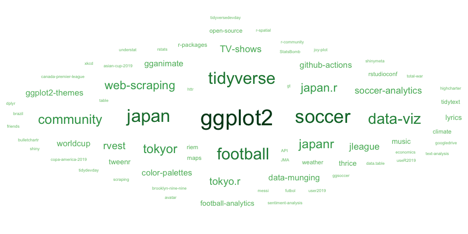

<!-- README.md is generated from README.Rmd. Please edit that file -->

# Ryo-N7.github.io

<!-- badges: start -->

<!-- badges: end -->

This is the Github repository for my website,
[R\_by\_Ryo](https://ryo-n7.github.io/)\!

Usually about soccer, R conference/meetup roundups (RStudio, UseR\!,
TokyoR, etc.), and other data science-y things - all done in R.

# Expected Blog (xBlog) Stats

⭐ There have been 50 posts on the blog since 2017-09-18.

📅 That’s about a post every 41 days, or about 0.7 posts per month.

🆕 The latest post was published 24 day(s) ago: [Modding Rome Total War
(Avatar, The Last Airbender mod) using
R\!](https://ryo-n7.github.io//2023-03-15-modding-rometotalwar-with-R/).

📈 This 2D plot shows posts over time:

Below is a word cloud of all the different tags on my blog posts, it
seems I mostly blog about " ggplot2":

<!-- -->

 Click to expand a full list of my blog posts

| Number | Date       | Title                                                                                                                                                                                                                           |
| -----: | :--------- | :------------------------------------------------------------------------------------------------------------------------------------------------------------------------------------------------------------------------------ |
|     50 | 2023-03-15 | [Modding Rome Total War (Avatar, The Last Airbender mod) using R\!](https://ryo-n7.github.io//2023-03-15-modding-rometotalwar-with-R/)                                                                                          |
|     49 | 2023-03-13 | [Managing Large R Codebases webinar (summary and slides)](https://ryo-n7.github.io//2023-03-13-managing-large-codebases-with-R-webinar/)                                                                                        |
|     48 | 2022-12-01 | [Iran vs. USA Tactical Review\!](https://ryo-n7.github.io//2022-12-01-iran-usa-tactical-review/)                                                                                                                                |
|     47 | 2022-11-15 | [J.League Soccer 2022 Season Review\!](https://ryo-n7.github.io//2022-11-15-jleague-2022-endseason-review/)                                                                                                                     |
|     46 | 2022-09-20 | [101st TokyoR Meetup Roundup: Palmer penguins, fractal analysis, and more\!](https://ryo-n7.github.io//2022-09-20-tokyoR-101-roundup/)                                                                                          |
|     45 | 2022-07-22 | [Developer diary for {ggshakeR} 0.2.0 (a package for soccer analytics viz): Working smoothly as a team on GitHub for R package development\!](https://ryo-n7.github.io//2022-07-22-ggshakeR-0.2.0-announcement/)                |
|     44 | 2022-06-15 | [J.League Soccer 2022 Mid-Season Review\!](https://ryo-n7.github.io//2022-06-15-jleague-2022-midseason-review/)                                                                                                                 |
|     43 | 2022-03-23 | [Developer diary for {ggshakeR} 0.1.2 (a package for soccer analytics viz): Implementing Github Actions CI tools (codecov, lintr, etc.) into the workflow\!](https://ryo-n7.github.io//2022-03-23-ggshakeR-0.1.2-announcement/) |
|     42 | 2022-03-17 | [{tvthemes 1.3.0} is on CRAN: ‘Steven Universe’-themed color palettes for ggplot2\!](https://ryo-n7.github.io//2022-03-17-tvthemes-1.3.0-announcement/)                                                                         |
|     41 | 2022-01-14 | [Solving the ‘preserving the sum after rounding’ problem for a soccer waffle viz](https://ryo-n7.github.io//2022-01-14-preserve-sum-rounding-soccer-viz/)                                                                       |
|     40 | 2021-12-20 | [J.League Soccer 2021 Season Review\!](https://ryo-n7.github.io//2021-12-20-jleague-2021-endseason-review/)                                                                                                                     |
|     39 | 2021-09-23 | [Creating a data pipeline with Github Actions & the {googledrive} package for the Canadian Premier League soccer data initiative\!](https://ryo-n7.github.io//2021-09-23-CanPL-GoogleDrive-GithubActions-Tutorial/)             |
|     38 | 2021-07-26 | [J.League Soccer 2021 Mid-Season Review\!](https://ryo-n7.github.io//2021-07-26-jleague-2021-midseason-review/)                                                                                                                 |
|     37 | 2021-05-06 | [Introducing {centralperk}: Get quotes from the main characters of the TV show ‘Friends’](https://ryo-n7.github.io//2021-05-06-friends-quotes-api/)                                                                             |
|     36 | 2021-01-14 | [J.League Soccer 2020 Season Review with R\!](https://ryo-n7.github.io//2021-01-14-jleague-2020-season-review-with-r/)                                                                                                          |
|     35 | 2020-11-02 | [My R Table Competition 2020 Submission: xG Timeline Table for Soccer/Football with {gt}\!](https://ryo-n7.github.io//2020-11-02-xG-timeline-table-competition-tutorial/)                                                       |
|     34 | 2020-08-03 | [87th TokyoR Meetup Roundup: {data.table}, Bioconductor, & more\!](https://ryo-n7.github.io//2020-08-03-tokyoR-87-roundup/)                                                                                                     |
|     33 | 2020-05-14 | [Intro to {polite} Web Scraping of Soccer Data with R\!](https://ryo-n7.github.io//2020-05-14-webscrape-soccer-data-with-R/)                                                                                                    |
|     32 | 2020-02-12 | [My RStudio::Conf 2020 / TidyDevDay Roundup & Reflections\!](https://ryo-n7.github.io//2020-02-12-rstudioconf-tidydevday-reflections/)                                                                                          |
|     31 | 2019-11-28 | [Visualizing the Premier League So Far, Part 2: Stats from Open Play and Set Pieces](https://ryo-n7.github.io//2019-11-28-visualize-EPL-part-2/)                                                                                |
|     30 | 2019-11-21 | [Visualizing the Premier League So Far, Part 1: Overview with xPts Tables and xG Plots](https://ryo-n7.github.io//2019-11-21-visualize-EPL-part-1/)                                                                             |
|     29 | 2019-11-04 | [{tvthemes 1.1.0} is on CRAN: Creating a {pkgdown} website, Gravity Falls palette, and more\!](https://ryo-n7.github.io//2019-11-04-tvthemes-1.1.0-announcement/)                                                               |
|     28 | 2019-10-30 | [81st TokyoR Meetup Roundup: A Special Session in {Shiny}\!](https://ryo-n7.github.io//2019-10-30-tokyoR-81-roundup/)                                                                                                           |
|     27 | 2019-09-06 | [{tvthemes 1.0.0} is on CRAN: Code improvements, Kim Possible, Stannis Baratheon, Hilda palettes/themes, and more\!](https://ryo-n7.github.io//2019-09-06-tvthemes-CRAN-announcement/)                                          |
|     26 | 2019-08-21 | [Visualizing Soccer with StatsBomb Data and R, Part 1: Simple xG and Pass Partner Plots\!](https://ryo-n7.github.io//2019-08-21-visualize-soccer-statsbomb-part-1/)                                                             |
|     25 | 2019-08-02 | [80th \#TokyoR Meetup Roundup: Econometrics vs. ML, Python with R, & Translating tidyverse.org into Japanese\!](https://ryo-n7.github.io//2019-08-02-tokyoR-80-roundup/)                                                        |
|     24 | 2019-07-21 | [My useR\! 2019 Highlights & Experience: Shiny, R Community, {packages}, and more\!](https://ryo-n7.github.io//2019-07-21-user2019-reflections/)                                                                                |
|     23 | 2019-07-05 | [79th \#TokyoR Meetup: {tidyr} 1.0.0, RAW image processing, and more\!](https://ryo-n7.github.io//2019-07-05-tokyoR-79-roundup/)                                                                                                |
|     22 | 2019-06-18 | [Visualizing the Copa América: Historical Records, Squad Profiles, and Player Profiles with xG statistics\!](https://ryo-n7.github.io//2019-06-18-visualize-copa-america/)                                                      |
|     21 | 2019-05-31 | [78th \#TokyoR Meetup Roundup\!](https://ryo-n7.github.io//2019-05-31-tokyoR-78-roundup/)                                                                                                                                       |
|     20 | 2019-05-16 | [Introducing {tvthemes}: ggplot2 palettes and themes from your favorite TV shows\!](https://ryo-n7.github.io//2019-05-16-introducing-tvthemes-package/)                                                                         |
|     19 | 2019-04-24 | [77th Tokyo.R Users Meetup Roundup\!](https://ryo-n7.github.io//2019-04-24-tokyoR-77/)                                                                                                                                          |
|     18 | 2019-03-07 | [76th Tokyo.R Users Meetup Roundup\!](https://ryo-n7.github.io//2019-03-07-tokyoR-76-roundup/)                                                                                                                                  |
|     17 | 2019-02-15 | [Visualizing Brooklyn Nine-Nine with R\!](https://ryo-n7.github.io//2019-02-15-visualize-brooklyn-nine-nine/)                                                                                                                   |
|     16 | 2019-01-25 | [My \#TidyverseDevDay and \#RStudioConf 2019 Reflections\!](https://ryo-n7.github.io//2019-01-25-tidyversedevday-rstudioconf-reflections/)                                                                                      |
|     15 | 2019-01-11 | [Visualizing the Asian Cup with R\!](https://ryo-n7.github.io//2019-01-11-visualize-asian-cup/)                                                                                                                                 |
|     14 | 2018-12-06 | [The JapanR Conference 2018 Round-Up\!](https://ryo-n7.github.io//2018-12-06-japanr-conference-roundup-blog-post/)                                                                                                              |
|     13 | 2018-10-04 | [Visualizing the Weather in Japan: A Sweltering Summer Story\!](https://ryo-n7.github.io//2018-10-04-visualize-weather-in-japan/)                                                                                               |
|     12 | 2018-07-24 | [Animating the Goals of the World Cup: Comparing the old vs. new gganimate and tweenr API\!](https://ryo-n7.github.io//2018-07-24-visualize-worldcup-part-3/)                                                                   |
|     11 | 2018-07-05 | [Visualize the World Cup with R\! Part 2: World Cup Drama - Visualizing Changes in the Group Table During the Final Matchday](https://ryo-n7.github.io//2018-07-05-visualize-worldcup-part-2/)                                  |
|     10 | 2018-06-29 | [Visualize the World Cup with R\! Part 1: Recreating Goals with ggsoccer and ggplot2](https://ryo-n7.github.io//2018-06-29-visualize-worldcup/)                                                                                 |
|      9 | 2018-06-07 | [Webスクレーピングから可視化まで、Tidyverseパッケージで探索データ解析（EDA）\!](https://ryo-n7.github.io//2018-06-07-global-peace-index-JP/)                                                                                                                  |
|      8 | 2018-04-30 | [My first R package building experience: Reflections from creating bulletchartr\!](https://ryo-n7.github.io//2018-04-30-bulletchartr-package-experience/)                                                                       |
|      7 | 2018-04-02 | [Sakura Surprise: Cherry blossoms in Kyoto blooming earlier in the past \~100 years\!](https://ryo-n7.github.io//2018-04-02-sakura-surprise/)                                                                                   |
|      6 | 2018-01-12 | [Exploring Japan’s Postwar Economic Miracle with gganimate, tweenr, & highcharter\!](https://ryo-n7.github.io//2018-01-12-japan-postwar-economic-recovery/)                                                                     |
|      5 | 2017-11-22 | [Where to live in Japan: XKCD-themed climate plots and maps\!](https://ryo-n7.github.io//2017-11-22-japan-xkcd-weather-index/)                                                                                                  |
|      4 | 2017-10-22 | [Thrice: Sentiment Analysis - Emotions in Lyrics\!](https://ryo-n7.github.io//2017-10-22-thrice-part-3/)                                                                                                                        |
|      3 | 2017-10-10 | [Thrice: Breaking Down The Lyrics Word-by-Word\!](https://ryo-n7.github.io//2017-10-10-thrice-part-2/)                                                                                                                          |
|      2 | 2017-09-30 | [Thrice: Initial Data Exploration and Song Length Distributions with Joy Plots\!](https://ryo-n7.github.io//2017-09-30-thrice-part-1/)                                                                                          |
|      1 | 2017-09-18 | [Global Peace Index: Web scraping and bump charts\!](https://ryo-n7.github.io//2017-09-18-global-peace-index/)                                                                                                                  |

*Last Updated 2023-04-08*
