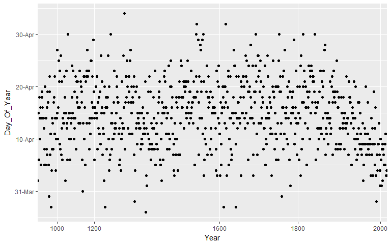
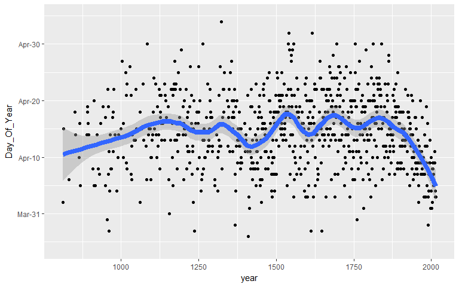
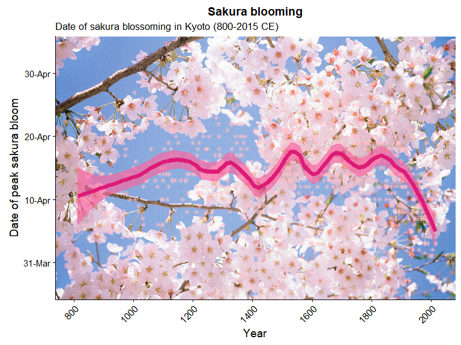

April in Japan is a time of new beginnings. Unlike most countries, the school year starts in April and is also the beginning of the fiscal year for the government and most corporations. This past April, The Economist presented an interesting article with a beautiful ggplot2 graphic depicting the steadily early blossoming of sakura trees in Kyoto:


For this article I will try to recreate this graphic but with my own twist(s). Thankfully the raw data is made available by the original author of the research paper documenting this phenomenon, Dr. Yasuyuki Aono from Osaka Prefecture University. The dataset can be downloaded from [here](http://atmenv.envi.osakafu-u.ac.jp/aono/kyophenotemp4/).

Let's get started by loading up our trusty packages and data:

``` r
# Sakura data
library(tidyverse)
library(stringr)
library(scales)

# Load data ---------------------------------------------------------------

sakura <- read.csv("~/R_materials/Kyoto_Flowers.csv")
glimpse(sakura)
```

    ## Observations: 1,235
    ## Variables: 7
    ## $ AD                        <int> 801, 802, 803, 804, 805, 806, 807, 8...
    ## $ Full.flowering.date..DOY. <int> NA, NA, NA, NA, NA, NA, NA, NA, NA, ...
    ## $ Full.flowering.date       <int> NA, NA, NA, NA, NA, NA, NA, NA, NA, ...
    ## $ Source.code               <int> NA, NA, NA, NA, NA, NA, NA, NA, NA, ...
    ## $ Data.type.code            <int> NA, NA, NA, NA, NA, NA, NA, NA, NA, ...
    ## $ Reference.Name            <fctr> -, -, -, -, -, -, -, -, -, -, -, NI...
    ## $ X                         <lgl> NA, NA, NA, NA, NA, NA, NA, NA, NA, ...

From looking at the raw data, it appears that data is missing from a number of rows until 812 AD, along with many other rows throughout the years. We might as well cut those rows out especially since we can specify the limits of our year variable in the plot manually when we start plotting.

``` r
# Tidy and Clean ----------------------------------------------------------

# remove rows without flowering date
sakura <- sakura %>% filter(!is.na(Full.flowering.date))

colnames(sakura)   # look at the column names
```

    ## [1] "AD"                        "Full.flowering.date..DOY."
    ## [3] "Full.flowering.date"       "Source.code"              
    ## [5] "Data.type.code"            "Reference.Name"           
    ## [7] "X"

from looking at the column names... they don't look very neat or tidy.

``` r
# colnames don't look very neat and tidy...
colnames(sakura) <- sakura %>% 
  colnames() %>% 
  str_to_lower() %>%                  # to lower case letters
  str_replace_all("\\.", "_")         # replace . with _

colnames(sakura)
```

    ## [1] "ad"                        "full_flowering_date__doy_"
    ## [3] "full_flowering_date"       "source_code"              
    ## [5] "data_type_code"            "reference_name"           
    ## [7] "x"

Much better! However there are two columns with names that need some manual fixing:

``` r
colnames(sakura)[1] <- "year"
colnames(sakura)[2] <- "full_flowering_day_of_year"

colnames(sakura)
```

    ## [1] "year"                       "full_flowering_day_of_year"
    ## [3] "full_flowering_date"        "source_code"               
    ## [5] "data_type_code"             "reference_name"            
    ## [7] "x"

OK! Now let's separate the column containing our three-digit date data into individual `month` and `day` columns. We can use regular expressions (**regex**) to parse the character strings of the date (converted from the numeric format first) and then separate the `month` digits and `day` digits with a `.` period symbol.

``` r
# turn three digit number into month and day values.
# split into two backreferences on the first digit, then place a .
date_sep <- as.character(sakura$full_flowering_date) %>% 
  str_replace_all("(.{1})(.*)", "\\1.\\2") %>% 
  as.data.frame()

colnames(date_sep)[1] <- "date_fl"                        # properly name column
colnames(date_sep)
```

    ## [1] "date_fl"

``` r
date_sep <- date_sep %>% separate(date_fl, c("month", "day"), "\\.")  # separate into 'month' and 'day' columns by '.'
```

Now we can combine `date_sep` into `sakura` using `bind_cols()` and then remove the variables we don't need:

``` r
sakura <- bind_cols(date_sep, sakura)   
sakura <- sakura %>% select(-full_flowering_date, -full_flowering_day_of_year, -x, -data_type_code, -reference_name, -source_code)  
```

Using the `lubridate` package we can create a separate variable in YYYY/MM/DD format as well as format the individual date components into their own variables.

``` r
library(lubridate)
# ?make_date()
# ?format()
# use make_date function to create separate variable in full date format
sakura <- sakura %>% 
  mutate(bloom = make_date(year, month, day))

# Reformat date variables into specific date formats:
sakura$Day_Of_Year <- as.numeric(format(sakura$bloom, "%j"))   #  %j: decimal day of the year
sakura$Year <- format(sakura$bloom, "%Y")                      #  %Y: 4 digit year
sakura$Month <- format(sakura$bloom, "%b")                     #  %b: abbreviated month
sakura$Day <- format(sakura$bloom, "%d")                       #  %d: decimal date

glimpse(sakura)
```

    ## Observations: 827
    ## Variables: 8
    ## $ month       <chr> "4", "4", "4", "4", "4", "4", "4", "4", "4", "4", ...
    ## $ day         <chr> "01", "15", "06", "18", "14", "09", "16", "05", "1...
    ## $ year        <int> 812, 815, 831, 851, 853, 864, 866, 869, 889, 891, ...
    ## $ bloom       <date> 0812-04-01, 0815-04-15, 0831-04-06, 0851-04-18, 0...
    ## $ Day_Of_Year <dbl> 92, 105, 96, 108, 104, 100, 106, 95, 104, 109, 108...
    ## $ Year        <chr> "0812", "0815", "0831", "0851", "0853", "0864", "0...
    ## $ Month       <chr> "Apr", "Apr", "Apr", "Apr", "Apr", "Apr", "Apr", "...
    ## $ Day         <chr> "01", "15", "06", "18", "14", "09", "16", "05", "1...

``` r
# date format are all in <chr>
```

Now we are ready to plot!

``` r
# Plotting ----------------------------------------------------------------

ggplot(sakura, aes(x = Year, y = Day_Of_Year)) +
  geom_point() +
  geom_line() +
  scale_y_continuous(labels = function(x) format(as.Date(as.character(x), "%j"), "%d-%b"))
```



This looks very messy and we can't really discern any patterns/trends from this plot... So let's try adding in a smoother into our plot!

``` r
ggplot(sakura, aes(x = year, y = Day_Of_Year)) +  # or just use original 'year' variable...
  geom_point() +
  geom_smooth(span = 0.2, size = 3) +
  scale_y_continuous(labels = function(x) format(as.Date(as.character(x), "%j"), "%b-%d"),
                     limits = c(84, 125))
```



Better! Now we can clearly see the trend by adding in the `geom_smooth()` function, but could we make it more... sakura-y?

``` r
ggplot(sakura, aes(x = year, y = Day_Of_Year)) +  # or just use original 'year' variable...
  geom_point(shape = 8, size = 5, color = "pink") +
  geom_smooth(span = 0.2, color = "#dd1c77", fill = "red", size = 3) +
  scale_y_continuous(labels = function(x) format(as.Date(as.character(x), "%j"), "%b-%d"),
                     limits = c(84, 125))
```


The colors are more pink and changing the points to an 8-sided shape makes it a bit more sakura-like but the plot looks out of place on a drab grey background...
The mix of colors look a bit garish but I chose them because they would stand out against a sakura tree background image that I want to place...
So let's add a background image! (Generally not recommended but let's try it out!)

``` r
#### With background image!
library(jpeg)
library(grid)
library(gridExtra)
library(cowplot)

sakura_r <- function(df = sakura, xvar = 'as.numeric(Year)', yvar = 'Day_Of_Year') {
  img_url <- 'https://i.imgur.com/CgwU1zb.jpg'
  tmp_file <- tempfile()
  download.file(img_url, tmp_file, mode = "wb")
  img <- readJPEG(tmp_file)
  file.remove(tmp_file)
  
  rstr <- rasterGrob(img, width = unit(1,"npc"), height = unit(1,"npc"), interpolate = FALSE)
  
  g <- ggplot(data = df)  + annotation_custom(rstr, -Inf, Inf, -Inf, Inf)
  g <- g + geom_point(aes_string(x = xvar, y = yvar), alpha = 0.8, color = "pink", shape = 8)
  g <- g + geom_smooth(aes_string(x = xvar, y = yvar), color = "#dd1c77", span = 0.2, size = 2.5, fill = "#f768a1", alpha = 0.7)
  g <- g + scale_y_continuous(labels = function(x) format(as.Date(as.character(x), "%j"), "%d-%b"))
  g <- g + scale_x_continuous(limits = c(800, 2020), breaks = seq(800, 2000, 200))
  g <- g + labs(x = "Year", y = "Date of peak sakura bloom")
  g <- g + ggtitle("Sakura blooming", subtitle = "Date of sakura blossoming in Kyoto (800-2015 CE)")
  g <- g + theme(legend.position = "top", legend.background = element_rect(color = "black"),
                 axis.text.x = element_text(angle = 45, hjust = 1))
  return (g)
}
sakura_r()
```



Most of the time you would never add in a background image to a plot as it would obscure the individual data points and other details. However, for this graph the main point of interest is the trend line going across and decreasing from the 20th century, pointing out how sakura have been steadily blossoming earlier and earlier in the year.This can still be seen quite clearly despite the background image. I mainly wanted to show off a cool new trick I learned and to also do something *slightly* different from what The Economist did. 

Some other cool adaptations of Dr. Aono's sakura dataset include [this](http://opiateforthemass.es/articles/sakura/) visualization done by Christoph Safferling from *Opiate for the masses* where they incorporated sakura emoji as the data point shapes; definitely much better than the ersatz geom\_point shape I used as "sakura"for my own plot!

To cap off, I'll leave you with some photos I took of sakura in Tokyo when I went back home for Spring Break back in April! Can't wait for the blossomings next year!


   


  


  
