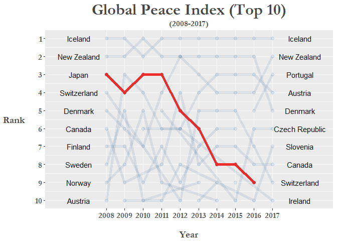
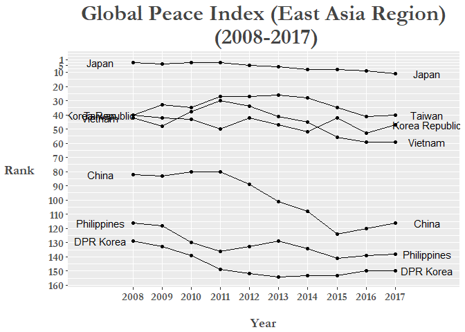
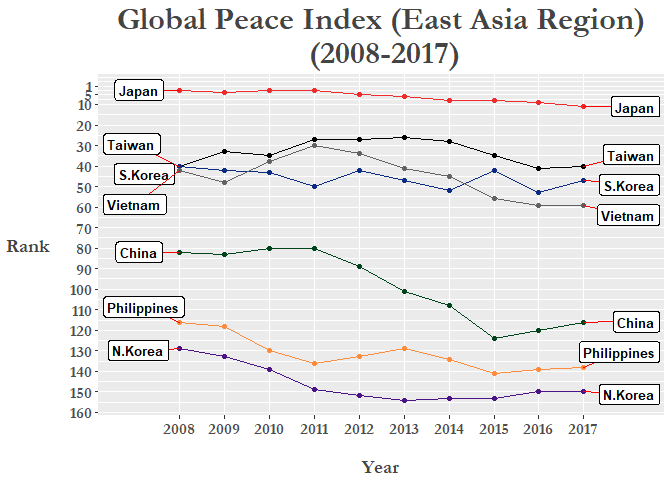
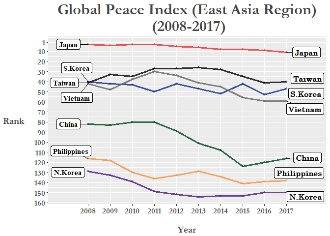

The Global Peace Index (GPI) was created by the Institute for Economics and Peace (IEP), a think tank with a dedication to measuring positive human well-being and progress, and one attempt to quantitatively measure the relative position of a nations' and regions' peacefulness. The official 2017 report visualizes the most recent data as a map below: 

Today I will web scrape the GPI data from 2008 to 2017 from Wikipedia using the `rvest` package and use a variety of data tidying packages such as `dplyr`, `tidyr`, and `stringr` to create a bump chart to visualize the GPI index data in another way!

``` r
# Global Peace Index
library(tidyverse)          # includes dplyr, tidyr, ggplot2
library(scales)             # more options for scales on plots
library(ggrepel)            # dealing with overlapping text/labels
library(rvest)              # for web scraping: read_html(), html_table() functions
library(stringr)            # dealing with strings
library(forcats)            # change factor levels manually

# Web scrape: -------------------------------------------------------------

url <- "https://en.wikipedia.org/wiki/Global_Peace_Index"

GPI <- url %>% 
  read_html() %>% 
  html_nodes('table.wikitable:nth-child(29)') %>%
  .[[1]] %>% 
  html_table()
```

Here we use the `read_html()` function to read the url of the web page, then we find the **CSS selector** of the table we want to use from the web page. I will go through what I did above step-by-step (Using the Mozilla Firefox browser):

1.  Press **F12** on the page you want to extract data from
2.  Click on the left-most button the pop-up bar
3.  Hover your mouse over the element of the page you want to extract. The console will scroll to the exact html code that you are point at
4.  Right-click on the highlighted html code, click on 'Copy' in the menu, then click on 'CSS Selector'
5.  Then Paste into R and place it inside the `html_nodes()` function as above within single brackets.
6.  Select only the element with the table information (in this case there is only one element anyways), `[[1]]`.
7.  Finally we specifically extract the table using `html_table()`. You can use the `fill =` option to autofill any poorly formatted tables.

Now with our data gathered, let's take a closer inspection at what we have:

``` r
# Inspect scraped data ----------------------------------------------------

glimpse(GPI)
```

    ## Observations: 163
    ## Variables: 21
    ## $ Country              <chr> "Iceland", "New Zealand", "Portugal", "Au...
    ## $ `2017 rank`          <chr> "1", "2", "3", "4", "5", "6", "7", "8", "...
    ## $ `2017 score[23]`     <dbl> 1.111, 1.241, 1.258, 1.265, 1.337, 1.360,...
    ## $ `2016 rank`          <int> 1, 4, 5, 3, 2, 6, 10, 8, 7, 12, 9, 15, 13...
    ## $ `2016 score[24]`     <dbl> 1.192, 1.287, 1.356, 1.278, 1.246, 1.360,...
    ## $ `2015 rank`          <int> 1, 4, 11, 3, 2, 10, 15, 7, 5, 12, 8, 9, 1...
    ## $ `2015 score[25]`     <dbl> 1.148, 1.221, 1.344, 1.198, 1.150, 1.341,...
    ## $ `2014 rank`          <int> 1, 4, 18, 3, 2, 11, 14, 7, 5, 13, 8, 15, ...
    ## $ `2014 score[26]`     <dbl> 1.189, 1.236, 1.425, 1.200, 1.193, 1.381,...
    ## $ `2013 rank`          <int> 1, 3, 18, 4, 2, 14, 13, 8, 5, 12, 6, 16, ...
    ## $ `2013 score[27]`     <dbl> 1.162, 1.237, 1.467, 1.250, 1.207, 1.404,...
    ## $ `2012 rank`          <int> 1, 2, 16, 6, 2, 13, 8, 4, 10, 6, 5, 22, 1...
    ## $ `2012 score[28][29]` <dbl> 1.113, 1.239, 1.470, 1.328, 1.239, 1.396,...
    ## $ `2011 rank`          <int> 1, 2, 17, 6, 4, 5, 10, 8, 16, 11, 3, 18, ...
    ## $ `2011 score[29][30]` <dbl> 1.148, 1.279, 1.453, 1.337, 1.289, 1.320,...
    ## $ `2010 rank`          <int> 2, 1, 13, 4, 7, 12, 11, 14, 18, 6, 3, 19,...
    ## $ `2010 score[31]`     <dbl> 1.212, 1.188, 1.366, 1.290, 1.341, 1.360,...
    ## $ `2009 rank`          <int> 1, 2, 15, 3, 6, 16, 10, 9, 11, 14, 4, 19,...
    ## $ `2009 score`         <dbl> 1.203, 1.227, 1.426, 1.240, 1.263, 1.430,...
    ## $ `2008 rank`          <int> 1, 2, 14, 10, 5, 18, 13, 6, 4, 11, 3, 16,...
    ## $ `2008 score`         <dbl> 1.107, 1.190, 1.385, 1.291, 1.238, 1.435,...

For my purposes I only need the data from the `rank` variables so I create a new dataframe excluding the `score` columns:

``` r
# Tidy dataset ------------------------------------------------------------

GPI_rank <- GPI %>% select(Country, ends_with("rank"))

colnames(GPI_rank) <- colnames(GPI_rank) %>% tolower()   # turn "Country" into lower case...

glimpse(GPI_rank)
```

    ## Observations: 163
    ## Variables: 11
    ## $ country     <chr> "Iceland", "New Zealand", "Portugal", "Austria", "...
    ## $ `2017 rank` <chr> "1", "2", "3", "4", "5", "6", "7", "8", "9", "10="...
    ## $ `2016 rank` <int> 1, 4, 5, 3, 2, 6, 10, 8, 7, 12, 9, 15, 13, 17, 19,...
    ## $ `2015 rank` <int> 1, 4, 11, 3, 2, 10, 15, 7, 5, 12, 8, 9, 18, 17, 22...
    ## $ `2014 rank` <int> 1, 4, 18, 3, 2, 11, 14, 7, 5, 13, 8, 15, 16, 10, 2...
    ## $ `2013 rank` <int> 1, 3, 18, 4, 2, 14, 13, 8, 5, 12, 6, 16, 20, 11, 2...
    ## $ `2012 rank` <int> 1, 2, 16, 6, 2, 13, 8, 4, 10, 6, 5, 22, 19, 18, 17...
    ## $ `2011 rank` <int> 1, 2, 17, 6, 4, 5, 10, 8, 16, 11, 3, 18, 34, 9, 20...
    ## $ `2010 rank` <int> 2, 1, 13, 4, 7, 12, 11, 14, 18, 6, 3, 19, 36, 5, 2...
    ## $ `2009 rank` <int> 1, 2, 15, 3, 6, 16, 10, 9, 11, 14, 4, 19, 43, 8, 2...
    ## $ `2008 rank` <int> 1, 2, 14, 10, 5, 18, 13, 6, 4, 11, 3, 16, 19, 9, 2...

In data analysis, one of the most important part of the process is the data cleanining or tidying process that we have began doing here. One of the main tenets of the cleaning process is to have a *tidy* dataset where we arrange data so that each variable is a column and each observation is a row.

We see that the data is organized in an *"untidy"* or *"wide"* format. To make our analysis workflow smoother we need to convert this data frame into the *tidy* or *"long"* format. We do this by using the `gather()` function in the `tidyr` package. For more details on the concept of "**tidy data**" Hadley Wickham's seminal paper on this subject can be found [here](https://www.jstatsoft.org/article/view/v059i10/v59i10.pdf).

``` r
GPI_rank <- GPI_rank %>% gather(`2017 rank`:`2008 rank`, key = "year", value = "rank")

glimpse(GPI_rank)
```

    ## Observations: 1,630
    ## Variables: 3
    ## $ country <chr> "Iceland", "New Zealand", "Portugal", "Austria", "Denm...
    ## $ year    <chr> "2017 rank", "2017 rank", "2017 rank", "2017 rank", "2...
    ## $ rank    <chr> "1", "2", "3", "4", "5", "6", "7", "8", "9", "10=", "1...

Next, in the `year` column let's take out the "rank" part of each "20xx rank" value (from '2017 rank' to '2017'). We can do this by using the `str_replace_all()` function from the `stringr` package to specifically take out "rank", and then clean up the remaining white space with `trimws()`.

``` r
GPI_rank$year <- GPI_rank$year %>% str_replace_all("rank", "") %>% trimws()

glimpse(GPI_rank)
```

    ## Observations: 1,630
    ## Variables: 3
    ## $ country <chr> "Iceland", "New Zealand", "Portugal", "Austria", "Denm...
    ## $ year    <chr> "2017", "2017", "2017", "2017", "2017", "2017", "2017"...
    ## $ rank    <chr> "1", "2", "3", "4", "5", "6", "7", "8", "9", "10=", "1...

Now we can turn the `year` column into a factor variable:

``` r
GPI_rank <- GPI_rank %>% mutate(year = as.factor(year))
levels(GPI_rank$year)     # now as factor + no "rank" afterwards.
```

    ##  [1] "2008" "2009" "2010" "2011" "2012" "2013" "2014" "2015" "2016" "2017"

Let's inspect our work so far!

``` r
GPI_rank %>% head(15)
```

    ##           country year rank
    ## 1         Iceland 2017    1
    ## 2     New Zealand 2017    2
    ## 3        Portugal 2017    3
    ## 4         Austria 2017    4
    ## 5         Denmark 2017    5
    ## 6  Czech Republic 2017    6
    ## 7        Slovenia 2017    7
    ## 8          Canada 2017    8
    ## 9     Switzerland 2017    9
    ## 10        Ireland 2017  10=
    ## 11          Japan 2017  10=
    ## 12      Australia 2017   12
    ## 13         Bhutan 2017   13
    ## 14         Norway 2017   14
    ## 15        Hungary 2017   15

We can see here that there are countries with a tied ranking due to similar GPI scores (shown in original GPI table), first let's get rid of the `=` symbol and then replace

``` r
GPI_rank <- GPI_rank %>% mutate(rank = str_replace(rank, "\\=", ""))   #   take out '=' in rank values
```

Now let's change the `rank` variable into a numeric format and finally reorder the dataframe so that the rows are arranged in a way where ranks are in ascending order for each year (2008: Rank \#1 - \#163, 2009: Rank \#1 - \#163, etc.).

``` r
GPI_rank$rank <- as.numeric(GPI_rank$rank)

GPI_rank <- GPI_rank %>% arrange(year, rank)

glimpse(GPI_rank)
```

    ## Observations: 1,630
    ## Variables: 3
    ## $ country <chr> "Iceland", "New Zealand", "Japan", "Switzerland", "Den...
    ## $ year    <fctr> 2008, 2008, 2008, 2008, 2008, 2008, 2008, 2008, 2008,...
    ## $ rank    <dbl> 1, 2, 3, 4, 5, 6, 7, 8, 9, 10, 11, 13, 13, 14, 15, 16,...

In regards to actually detecting and replacing duplicate values in a single automated function I wasn't very successful. However to detect duplicates for each year, I can do this:

``` r
GPI_rank %>% 
  filter(year == 2017) %>%       # replace 2017 with each specific year...
  select(rank) %>%  
  duplicated() %>%               # find duplicate values: TRUE/FALSE
  as.data.frame() %>% 
  rownames_to_column() %>% 
  filter(. == TRUE)
```

    ##   rowname    .
    ## 1      11 TRUE
    ## 2      20 TRUE
    ## 3      42 TRUE
    ## 4      85 TRUE
    ## 5      98 TRUE
    ## 6     147 TRUE
    ## 7     156 TRUE

Due to the fact that we can filter by year, the row name in the filtered data set (which is the duplicated rank value) should match up to the duplicated rank value in the whole dataset, allowing us to easily identify the specific rows that need fixing.

In 2017 there were 4 rows with duplicate values, let's manually replace them:

``` r
GPI_rank[1551:1552, 3]  # 84, 84   (Bangladesh and Bosnia & Herzegovina)
```

    ## [1] 84 84

``` r
GPI_rank[1552, 3] <-   85          # For tied ranks, we will reorder in alphabetical order.
GPI_rank[1551:1552, 3]  # 84, 85     Bosnia & Herzegovina is now 85th.
```

    ## [1] 84 85

``` r
GPI_rank[1565, 3] <- 98
GPI_rank[1614, 3] <- 147
GPI_rank[1623, 3] <- 156
GPI_rank[1478, 3] <- 11
```

I'm not going to bother manually changing all of them especially since there are a lot of NAs in the earlier years where many countries that show up in the later editions of the GPI had not been included yet. The most important thing is to make sure there aren't any tied rankings in the Top 10 for `2008` and `2017` as that's where our labels are going to be.

I'm sure there's a way to automate this using the function I used to detect duplicates with `lapply()`/`map()` to combine the duplicates in each year all in one dataframe, I'll edit this section when I find out how to do it.

Now let's create a custom theme we can add on to our plot and call it... `theme_peace`!

``` r
# Create custom theme -----------------------------------------------------
library(extrafont)                 # for fonts in titles and labels

theme_peace <-  
  theme(text = element_text(family = "Garamond", color = "#444444", face = "bold")) +
  theme(plot.title = element_text(size = 24, hjust = 0.5)) +
  theme(plot.subtitle = element_text(size = 12, hjust = 0.5)) +
  theme(axis.title = element_text(size = 14)) +
  theme(axis.title.y = element_text(angle = 0, vjust = 0.5, margin = margin(r = 15))) +
  theme(axis.text = element_text(size = 12)) +
  theme(axis.title.x = element_text(margin = margin(t = 20))) +
  theme(legend.title = element_blank()) +
  theme(legend.position = "none")
```

The type of plot we are going to create is called a bump chart which are used to visualize changes in rank over periods of time, perfect for our needs! Here let's specifically highlight the ranking over time for Japan by coloring its line to red and making the other countries more transparent by creating an `if/else` statement that evaluates whether the country being plotted is Japan or not. Also by using `geom_text` we can manually add labels on next to both the `2008` and `2017` variables:

``` r
# Plotting ----------------------------------------------------------------

GPI_rank %>% 
  filter(rank <= 10) %>% 
  mutate(jpn = ifelse(country == "Japan", T, F)) %>% 
  ggplot(aes(year, rank, group = country)) +
  geom_line(aes(color = jpn, alpha = jpn), size = 2) +
  geom_point(aes(color = jpn, alpha = jpn), size = 2.3) +
  geom_text(data = GPI_rank %>% filter(year == "2008", rank <= 10), 
            aes(label = country, x = "2008"), color = "black", size = 4, nudge_x = -1.5) +
  geom_text(data = GPI_rank %>% filter(year == "2017", rank <= 10), 
            aes(label = country, x = "2017"), color = "black", size = 4, nudge_x = 1.5) +
  scale_y_reverse(breaks = pretty_breaks(10)) +
  scale_x_discrete(expand = c(0.15, 0.1)) +
  scale_color_manual(values = c("#104E8B", "#EE2C2C")) + 
  labs(x = "Year", y = "Rank") +
  ggtitle("Global Peace Index (Top 10)", subtitle = "(2008-2017)") +
  theme_peace
```



We can clearly see that Japan's ranking has fallen from 2008 and even dropping out of the Top 10 altogether in 2017 (NOTE: technically Ireland and Japan were tied for 10th in 2017)! Could this be a result of the rising tensions in the past 10 years with its neighbors on a number of issues, such as the [East China Sea disputes](https://www.japantimes.co.jp/opinion/2017/08/29/commentary/japan-commentary/japans-maritime-diplomacy-mission-s-e-asia/), the more recent protests regarding the [comfort women issue](https://www.nytimes.com/2017/04/03/world/asia/japan-ambassador-south-korea-comfort-woman.html), and of course North Korea's recent [missile tests](http://www.bbc.co.uk/news/world-asia-41281050) among others? Let's see if there is a general downward trend in the East Asia region between 2008 and 2017! Neither `Macau` or `Hong Kong` are not in the data as they are counted as dependent territories and from what we know of recent conflicts in the *marginal seas* of the Pacific we include ASEAN contries such as Vietnam and the Philippines.

``` r
# Subset custom "East Asia" region -----------------------------------------------

GPI_Asia <- GPI_rank %>% filter(country %in% c("Japan", "China", "Korea Republic", "DPR Korea", 
                                               "Philippines", "Taiwan", "Vietnam")) %>% 
  mutate(region = "East Asia")

glimpse(GPI_Asia)
```

    ## Observations: 70
    ## Variables: 4
    ## $ country <chr> "Japan", "Taiwan", "Korea Republic", "Vietnam", "China...
    ## $ year    <fctr> 2008, 2008, 2008, 2008, 2008, 2008, 2008, 2009, 2009,...
    ## $ rank    <dbl> 3, 40, 40, 42, 82, 116, 129, 4, 33, 42, 48, 83, 118, 1...
    ## $ region  <chr> "East Asia", "East Asia", "East Asia", "East Asia", "E...

``` r
GPI_Asia$rank <- as.numeric(GPI_Asia$rank)
```

Now we are all ready to start plotting!

``` r
# Plot "East Asia" region -------------------------------------------------
GPI_Asia %>%
  ggplot(aes(year, as.numeric(rank), group = country)) +
  geom_line() +
  geom_point() +
  geom_text(data = GPI_Asia %>% filter(year == "2008"), 
                  aes(label = country, x = "2008"), color = "black", size = 4, nudge_x = -1.1) +
  geom_text(data = GPI_Asia %>% filter(year == "2017"), 
                  aes(label = country, x = "2017"), color = "black", size = 4, nudge_x = 1.1) +
  scale_y_reverse(breaks = c(1, 5, seq(10, 160, by = 10))) +
  scale_x_discrete(expand = c(0.1, 0.05)) +
  labs(x = "Year", y = "Rank") +
  ggtitle("Global Peace Index (East Asia Region)\n (2008-2017)") +
  theme_peace
```



There could still be some improvements made to this plot, specifically, the country labels on either side of the x-axis limits. We can fix this by Using the `gg_repel` package that will spread out them ot with a small line from the label box pointing to the corresponding line or point. We can also, manually set colors to each of our custom "East Asia" region countries to further differntiate each line and make it more easy to read:

``` r
# plot with filter()  East Asia

colors = c(
  Japan = "#EE2C2C",          # red
  S.Korea = "#0c2c84",        # dark blue
  China = "#00441b",          # green
  N.Korea = "#4a1486",        # purple
  Vietnam = "#636363",        # dark grey
  Philippines = "#fd8d3c",    # orange
  Taiwan = "#000000"          # black
)
```

Change the variable type of `country` into a factor and then rename *Korea Republic* to *S.Korea* and *DPR Korea* to *N.Korea* to fit graph labels better:

``` r
# rename Korea Republic to S.Korea to fit graph label better...
GPI_Asia$country <- as.factor(GPI_Asia$country)
GPI_Asia %>% glimpse()
```

    ## Observations: 70
    ## Variables: 4
    ## $ country <fctr> Japan, Taiwan, Korea Republic, Vietnam, China, Philip...
    ## $ year    <fctr> 2008, 2008, 2008, 2008, 2008, 2008, 2008, 2009, 2009,...
    ## $ rank    <dbl> 3, 40, 40, 42, 82, 116, 129, 4, 33, 42, 48, 83, 118, 1...
    ## $ region  <chr> "East Asia", "East Asia", "East Asia", "East Asia", "E...

``` r
GPI_Asia <- GPI_Asia %>% 
   mutate(country = fct_recode(country,
                                 "S.Korea" = "Korea Republic",
                                 "N.Korea" = "DPR Korea"))

# use geom_text_repel() instead of regular geom_text() as doesnt have font-face for some stupid reason -_-"

GPI_Asia %>%
  ggplot(aes(year, as.numeric(rank), group = country)) +
  geom_line(aes(color = country)) +
  geom_point(aes(color = country)) +
  geom_label_repel(data = GPI_Asia %>% filter(year == "2008"), 
                  aes(label = country, x = "2008"), 
                  color = "black", size = 3.5, nudge_x = -0.9, 
                  fontface = "bold", segment.colour = "red") +
  geom_label_repel(data = GPI_Asia %>% filter(year == "2017"), 
                   aes(label = country, x = "2017"), 
                   color = "black", size = 3.5, nudge_x = 1.5,
                   fontface = "bold", segment.colour = "red") +
  scale_y_reverse(breaks = c(1, 5, seq(10, 160, by = 10))) +
  scale_x_discrete(expand = c(0.2, 0.05)) +
  labs(x = "Year", y = "Rank") +
  ggtitle("Global Peace Index (East Asia Region)\n (2008-2017)") +
  theme_peace +
  scale_color_manual(values = colors)
```



Of course, the changes in rankings aren't ***all*** due to inter-country conflicts as it is only 1 of the 23 indicators used to calculate the GPI score. Both external peace indicators (*military expenditure as a percentage of GDP*, *nuclear and heavey weapons capabilities*, and *relations with neighboring countries*) **and** internal peace indicators (*level of violent crime*, *political instability*, *impact of terrorism*) are used in calculating the GPI. The full run-down on the various indicators can be found in Appendix B of the most recent GPI Report [here](http://visionofhumanity.org/app/uploads/2017/06/GPI17-Report.pdf).

There is another way to do the above but first I'll clean up the data further by changing the names of the Koreas in the main dataset like we did in `GPI_Asia` then fix one of the values:

``` r
GPI_rank <- GPI_rank %>% 
  mutate(country = fct_recode(country,
                              "S.Korea" = "Korea Republic",
                              "N.Korea" = "DPR Korea"))

GPI_rank[37, 3] <- 41     # in 2008 S.Korea and Taiwan were tied 40th
```

Instead of creating new subset of our data, we can reduce clutter in our R environment by using `magrittr` pipes before plotting!

To do the same thing without creating a separate dataset (like `GPI_Asia`) is to simply create a new variable called `region` inside our existing `GPI_rank` data frame and then use the `filter()` function right before we pipe it through our `ggplot` code:

``` r
knitr::opts_chunk$set(warning = FALSE, message = FALSE, dev = "cairo_pdf")
# Piping before plotting East Asia ----------------------------------------

GPI_rank <- GPI_rank %>% 
      mutate(region = if_else(
      country %in% c("Japan", "China", "S.Korea", "N.Korea", "Philippines", "Taiwan", "Vietnam"), 
                          "East Asia", "Other")) 

# Final plot: East Asia ---------------------------------------------------

GPI_rank %>%
  filter(region == "East Asia") %>% 
  ggplot(aes(year, rank, group = country)) +
  geom_line(aes(color = country), size = 1.2, alpha = 0.8) +
  geom_point(aes(color = country), size = 1.1, alpha = 0.5) +
  geom_label_repel(
    data = GPI_rank %>% 
      filter(year == "2008", region == "East Asia"), 
      aes(label = country, x = "2008"), 
      color = "black", family = "Times New Roman", fontface = "bold",
      size = 4, nudge_x = -0.9) +
  geom_label_repel(
    data = GPI_rank %>% 
      filter(year == "2017", region == "East Asia"), 
      aes(label = country, x = "2017"), 
      color = "black", family = "Century", fontface = "bold",
      size = 4, nudge_x = 0.9) +
  scale_y_reverse(breaks = c(1, seq(10, 160, by = 10))) +
  scale_x_discrete(expand = c(0.2, 0.05)) +
  labs(x = "Year", y = "Rank") +
  ggtitle("Global Peace Index (East Asia Region)\n (2008-2017)") +
  theme_peace +
  scale_color_manual(values = colors)
```



With the colored lines and the labels we can clearly see the downward trend of GPI rankings for all countries in the East Asia region except for Taiwan which temporarily moved up until it reverted back to its 40th place in the rankings.

``` r
GPI_rank %>% filter(country == "Taiwan", year %in% c(2008, 2017))
```

    ##   country year rank    region
    ## 1  Taiwan 2008   41 East Asia
    ## 2  Taiwan 2017   40 East Asia

Well, OK. Remember though, that we manually changed Taiwan's ranking in 2008 as it was tied 40th with South Korea!

Hopefully with initiatives like the GPI and the works of other peace-oriented think tanks, the public can identify different sources of problems that hinder peaceful co-existence both within-countries and between-countries and assist policy-makers in finding viable solutions!

