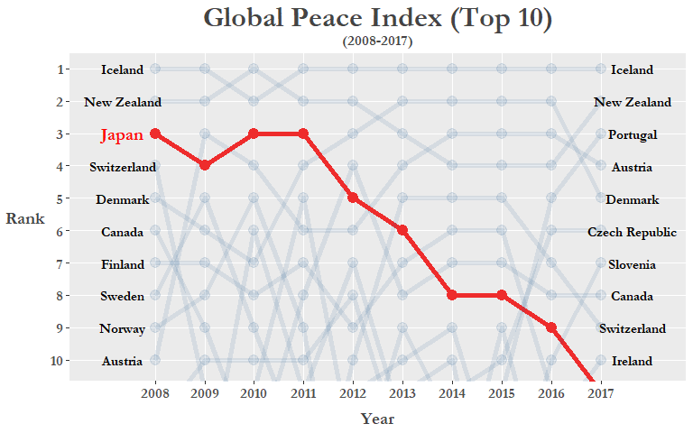
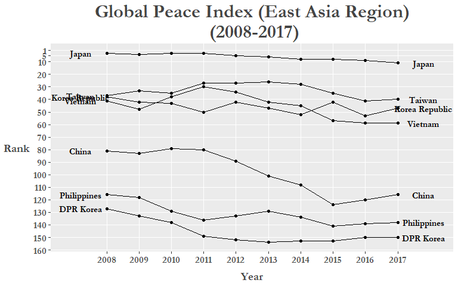
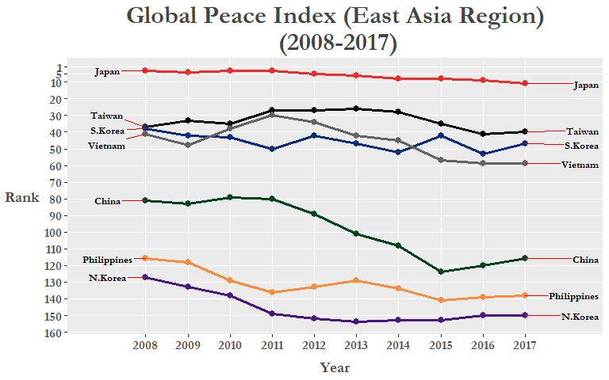
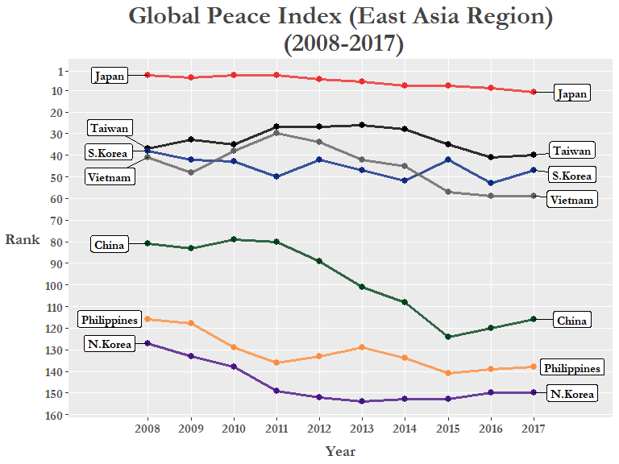

日本語版は[ここ](https://ryo-n7.github.io/2018-06-07-global-peace-index-JP/)です！

The Global Peace Index (GPI) was created by the Institute for Economics and Peace (IEP), a think tank with a dedication to measuring positive human well-being and progress, and is one attempt to quantitatively measure the relative position of a nations' and regions' peacefulness. The official 2017 report visualizes the most recent data as a map below: 

Today I will web scrape the GPI data from **2008** to **2017** from Wikipedia using the `rvest` package and use a variety of data tidying packages such as `dplyr`, `tidyr`, and `stringr` to create a **bump chart** to visualize the GPI index data in another way!

``` r
# Global Peace Index
library(tidyverse)          # includes dplyr, tidyr, ggplot2
library(scales)             # more options for scales on plots
library(ggrepel)            # dealing with overlapping text/labels
library(rvest)              # for web scraping: read_html(), html_table() functions
library(stringr)            # dealing with strings
library(forcats)            # change factor levels manually

# Web scrape: -------------------------------------------------------------

url <- "https://en.wikipedia.org/wiki/Global_Peace_Index"

# 12/1/17: update css selector to table.wikitable:nth-child(77)  
# 4/28/18: table.wikitable:nth-child(71)

GPI <- url %>% 
  read_html() %>% 
  html_nodes('table.wikitable:nth-child(71)') %>%
  .[[1]] %>% 
  html_table(header = TRUE)
```

Here we use the `read_html()` function to read the url of the web page, then we find the **CSS selector** of the table we want to use from the web page. I will go through what I did above step-by-step (Using the Mozilla Firefox browser):

1.  Press **F12** or **Ctrl + Shift + C** to open up the *Inspector Tool* on the page you want to extract data from.
2.  Click on the left-most button on the pop-up bar.
3.  Hover your mouse over the element of the page you want to extract. The console will scroll to the exact html code that you are pointing at.
4.  Right-click on the highlighted html code, click on 'Copy' in the menu, then click on 'CSS Selector'
5.  Then Paste into R and place it inside the `html_nodes()` function as above within brackets.
6.  Select only the element with the table information (in this case there is only one element anyways), `[[1]]`.
7.  Finally we specifically extract the table using `html_table()`. You can use the `fill =` option to autofill any poorly formatted tables.

There are other ways to do this such as using the *Selector Gadget* ([Tutorial](https://stat4701.github.io/edav/2015/04/02/rvest_tutorial/)). Now with our data gathered, let's take a closer inspection at what we have:

``` r
# Inspect scraped data ----------------------------------------------------

glimpse(GPI)
```

    ## Observations: 163
    ## Variables: 21
    ## $ Country               <chr> "Iceland", "New Zealand", "Portugal", "A...
    ## $ `2017 rank`           <chr> "1", "2", "3", "4", "5", "6", "7", "8", ...
    ## $ `2017 score[1]`       <dbl> 1.111, 1.241, 1.258, 1.265, 1.337, 1.360...
    ## $ `2016 rank`           <int> 1, 4, 5, 3, 2, 6, 10, 8, 7, 12, 9, 15, 1...
    ## $ `2016 score[57]`      <dbl> 1.192, 1.287, 1.356, 1.278, 1.246, 1.360...
    ## $ `2015 rank`           <int> 1, 4, 11, 3, 2, 10, 15, 7, 5, 12, 8, 9, ...
    ## $ `2015 score[58]`      <dbl> 1.148, 1.221, 1.344, 1.198, 1.150, 1.341...
    ## $ `2014 rank`           <int> 1, 4, 18, 3, 2, 11, 14, 7, 5, 13, 8, 15,...
    ## $ `2014 score[59]`      <dbl> 1.189, 1.236, 1.425, 1.200, 1.193, 1.381...
    ## $ `2013 rank`           <int> 1, 3, 18, 4, 2, 14, 13, 8, 5, 12, 6, 16,...
    ## $ `2013 score[60]`      <dbl> 1.162, 1.237, 1.467, 1.250, 1.207, 1.404...
    ## $ `2012 rank`           <int> 1, 2, 16, 6, 2, 13, 8, 4, 10, 6, 5, 22, ...
    ## $ `2012 score[61],[62]` <dbl> 1.113, 1.239, 1.470, 1.328, 1.239, 1.396...
    ## $ `2011 rank`           <int> 1, 2, 17, 6, 4, 5, 10, 8, 16, 11, 3, 18,...
    ## $ `2011 score[63]`      <dbl> 1.148, 1.279, 1.453, 1.337, 1.289, 1.320...
    ## $ `2010 rank`           <int> 2, 1, 13, 4, 7, 12, 11, 14, 18, 6, 3, 19...
    ## $ `2010 score[64]`      <dbl> 1.212, 1.188, 1.366, 1.290, 1.341, 1.360...
    ## $ `2009 rank`           <int> 1, 2, 15, 3, 6, 16, 10, 9, 11, 14, 4, 19...
    ## $ `2009 score`          <dbl> 1.203, 1.227, 1.426, 1.240, 1.263, 1.430...
    ## $ `2008 rank`           <int> 1, 2, 14, 10, 5, 18, 13, 6, 4, 11, 3, 16...
    ## $ `2008 score`          <dbl> 1.107, 1.190, 1.385, 1.291, 1.238, 1.435...

For my purposes I only need the data from the `rank` variables so I create a new dataframe excluding the `score` columns. A neat trick here is to use the `ends_with()` function inside `select()` to select all the variables that end in **"rank"**, this is much easier than manually inputting every single **"rank"** column!

``` r
# Tidy dataset ------------------------------------------------------------

GPI_rank <- GPI %>% select(Country, ends_with("rank"))

colnames(GPI_rank) <- colnames(GPI_rank) %>% tolower()   # turn "Country" into lower case...

glimpse(GPI_rank)
```

    ## Observations: 163
    ## Variables: 11
    ## $ country     <chr> "Iceland", "New Zealand", "Portugal", "Austria", "...
    ## $ `2017 rank` <chr> "1", "2", "3", "4", "5", "6", "7", "8", "9", "10="...
    ## $ `2016 rank` <int> 1, 4, 5, 3, 2, 6, 10, 8, 7, 12, 9, 15, 13, 17, 19,...
    ## $ `2015 rank` <int> 1, 4, 11, 3, 2, 10, 15, 7, 5, 12, 8, 9, 18, 17, 22...
    ## $ `2014 rank` <int> 1, 4, 18, 3, 2, 11, 14, 7, 5, 13, 8, 15, 16, 10, 2...
    ## $ `2013 rank` <int> 1, 3, 18, 4, 2, 14, 13, 8, 5, 12, 6, 16, 20, 11, 2...
    ## $ `2012 rank` <int> 1, 2, 16, 6, 2, 13, 8, 4, 10, 6, 5, 22, 19, 18, 17...
    ## $ `2011 rank` <int> 1, 2, 17, 6, 4, 5, 10, 8, 16, 11, 3, 18, 34, 9, 20...
    ## $ `2010 rank` <int> 2, 1, 13, 4, 7, 12, 11, 14, 18, 6, 3, 19, 36, 5, 2...
    ## $ `2009 rank` <int> 1, 2, 15, 3, 6, 16, 10, 9, 11, 14, 4, 19, 43, 8, 2...
    ## $ `2008 rank` <int> 1, 2, 14, 10, 5, 18, 13, 6, 4, 11, 3, 16, 19, 9, 2...

In data analysis, one of the most important part of the process is the data cleaning (also called data tidying or data munging) process that we have been doing here. One of the main tenets of the cleaning process is to have a *tidy* dataset where we arrange data so that each *variable* is a **column** and each *observation* is a **row**.

We see that the data we have is organized in an *"untidy"* or *"wide"* format. To make our analysis workflow smoother we need to convert this data frame into the *tidy* or *"long"* format. We do this by using the `gather()` function in the `tidyr` package. For more details on the concept of "**tidy data**" Hadley Wickham's seminal paper on this subject can be found [here](https://www.jstatsoft.org/article/view/v059i10/v59i10.pdf).

``` r
GPI_rank <- GPI_rank %>% gather(`2017 rank`:`2008 rank`, key = "year", value = "rank")

GPI_rank %>% filter(year == 2008) %>% slice(9:20)
```

    ## # A tibble: 0 x 3
    ## # ... with 3 variables: country <chr>, year <chr>, rank <chr>

Next, in the `year` column let's take out the "rank" part of each "20xx rank" value (basically changing the values from '2017 rank' to '2017'). We can do this by using the `str_replace_all()` function from the `stringr` package to specifically take out "rank", and then clean up the remaining white space with `trimws()`. Now we can turn the `year` column into a **factor** variable:

``` r
GPI_rank$year <- GPI_rank$year %>% str_replace_all("rank", "") %>% trimws()

glimpse(GPI_rank)
```

    ## Observations: 1,630
    ## Variables: 3
    ## $ country <chr> "Iceland", "New Zealand", "Portugal", "Austria", "Denm...
    ## $ year    <chr> "2017", "2017", "2017", "2017", "2017", "2017", "2017"...
    ## $ rank    <chr> "1", "2", "3", "4", "5", "6", "7", "8", "9", "10=", "1...

``` r
GPI_rank <- GPI_rank %>% mutate(year = as.factor(year))

# levels(GPI_rank$year) 
GPI_rank %>% head(15)
```

    ##           country year rank
    ## 1         Iceland 2017    1
    ## 2     New Zealand 2017    2
    ## 3        Portugal 2017    3
    ## 4         Austria 2017    4
    ## 5         Denmark 2017    5
    ## 6  Czech Republic 2017    6
    ## 7        Slovenia 2017    7
    ## 8          Canada 2017    8
    ## 9     Switzerland 2017    9
    ## 10        Ireland 2017  10=
    ## 11          Japan 2017  10=
    ## 12      Australia 2017   12
    ## 13         Bhutan 2017   13
    ## 14         Norway 2017   14
    ## 15        Hungary 2017   15

We can see that there are countries with a tied ranking due to similar GPI scores (shown in original GPI table), first let's get rid of the `=` symbol, then let's change the `rank` variable into a **numeric** format and finally reorder the dataframe so that the rows are arranged in a way where ranks are in ascending order for each year (2008: Rank \#1 - \#163, 2009: Rank \#1 - \#163, etc.).

``` r
GPI_rank <- GPI_rank %>% 
  mutate(rank = str_replace(rank, "\\=", ""),
         rank = as.numeric(rank)) %>% 
  arrange(year, rank)

glimpse(GPI_rank)
```

    ## Observations: 1,630
    ## Variables: 3
    ## $ country <chr> "Iceland", "New Zealand", "Japan", "Switzerland", "Den...
    ## $ year    <fct> 2008, 2008, 2008, 2008, 2008, 2008, 2008, 2008, 2008, ...
    ## $ rank    <dbl> 1, 2, 3, 4, 5, 6, 7, 8, 9, 10, 11, 13, 13, 14, 15, 16,...

You can use the `ties.method =` argument in the `rank()` function to order tied values by alphabetical order!

``` r
GPI_rank %>% 
  group_by(year) %>% 
  filter(year == 2017) %>% 
  slice(84:85)             
```

    ## # A tibble: 2 x 3
    ## # Groups:   year [1]
    ##   country                year   rank
    ##   <chr>                  <fct> <dbl>
    ## 1 Bangladesh             2017    84.
    ## 2 Bosnia and Herzegovina 2017    84.

``` r
# Bangladesh and Bosnia & Herzegovina are tied 84th in 2017!
GPI_rank %>% 
  group_by(year) %>% 
  mutate(rank = rank(rank, ties.method = "first")) %>% 
  filter(year == 2017) %>% 
  slice(84:85)             
```

    ## # A tibble: 2 x 3
    ## # Groups:   year [1]
    ##   country                year   rank
    ##   <chr>                  <fct> <int>
    ## 1 Bangladesh             2017     84
    ## 2 Bosnia and Herzegovina 2017     85

``` r
# Bangladesh is 84th and Bosnia & Herzegovina is now 85th! Success!
GPI_rank <- GPI_rank %>% 
  group_by(year) %>% 
  mutate(rank = rank(rank, ties.method = "first"))
```

And just like that ALL the tied ranks are fixed with the second tied rank value taking on a `n+1` rank value instead!

Now we are all ready to plot!

But first, let'screate a **custom ggplot theme** that we can add on to our plot and call it... `theme_peace`!

``` r
# Create custom theme -----------------------------------------------------
library(extrafont)                 # for fonts in titles and labels

theme_peace <-  
  theme(text = element_text(family = "Garamond", color = "#444444", face = "bold"),
        plot.title = element_text(size = 24, hjust = 0.5),
        plot.subtitle = element_text(size = 12, hjust = 0.5),
        axis.title = element_text(size = 14),
        axis.title.y = element_text(angle = 0, vjust = 0.5, margin = margin(r = 5)),
        axis.text = element_text(size = 12),
        axis.title.x = element_text(margin = margin(t = 10)),
        panel.grid.minor.y = element_blank(),
        legend.title = element_blank(),
        legend.position = "none")
```

Let's go over some of the code in `theme()`!

-   Using the `extrafont` library we can specify various fonts that are installed on your computer (this obviously varies depending on your OS). For how to get this working see the package [README](https://cran.r-project.org/web/packages/extrafont/README.html), it's a really handy package to customize your plots even more!

-   The `margin` argument in `element_text()` allows you to change around the spacing between things, in this case `axis.title.y` and `axis.title.x`.

-   `panel.grid.minor/major` is useful for when you want to emphasize or delete grid lines from your graph. You'll see why I deleted the minor grid lines when we make the plot!

The type of plot we are going to create is called a **bump chart** which are used to visualize changes in rank over periods of time, which is perfect for our current analysis! Here let's specifically highlight the ranking over time for Japan by coloring its line to red and making the other countries more transparent by creating an `if/else` statement that evaluates whether the country being plotted is Japan or not. Also by using `geom_text` we can manually add labels next to both the `2008` and `2017` variables:

``` r
# Plotting ----------------------------------------------------------------

GPI_rank %>% 
  mutate(jpn = ifelse(country == "Japan", T, F)) %>% 
  ggplot(aes(year, rank, group = country)) +
  geom_line(aes(color = jpn, alpha = jpn), size = 2) +  
  geom_point(aes(color = jpn, alpha = jpn), size = 2.3) +
  geom_text(data = GPI_rank %>% filter(year == "2008", rank <= 10, country != "Japan"), 
            aes(label = country), color = "black", 
            family = "Garamond", fontface = "bold",
            size = 4, nudge_x = -0.65) +
  geom_text(data = GPI_rank %>% filter(year == "2008", rank <= 10, country == "Japan"), 
            aes(label = country), color = "red", 
            family = "Garamond", fontface = "bold",
            size = 5, nudge_x = -0.65) +
  geom_text(data = GPI_rank %>% filter(year == "2017", rank <= 10), 
            aes(label = country), color = "black", 
            family = "Garamond", fontface = "bold",
            size = 4, nudge_x = 0.65) +
  scale_y_reverse(breaks = pretty_breaks(10)) +
  scale_x_discrete(breaks = pretty_breaks(10), expand = c(0.025, 1.5)) +
  scale_color_manual(values = c("#104E8B", "#EE2C2C")) + 
  labs(x = "Year", y = "Rank") +
  ggtitle("Global Peace Index (Top 10)", subtitle = "(2008-2017)") +
  theme_peace +
  coord_cartesian(ylim = c(1, 10.2))
```



Let's go over some of the ggplot code I used above!

-   `geom_text()`: Append country names on to either end of the axes.
-   `coord_cartesian()`: Focus our coordinate plane so we're only looking at the top 10 countries.
-   `scale_y_reverse()`: Flip the y-axis so that 1 is on top. Useful for when plotting ranking data.
-   `theme_peace`: The cool custom theme we just created.
-   `scale_color_manual()`: Specify the colors you want for the aesthetics.
-   `scales::pretty_breaks()`: Better control over the number of axis ticks.

We can clearly see that Japan's ranking has fallen from 2008 and even dropping out of the Top 10 altogether in 2017 (*Note*: technically Ireland and Japan were tied for 10th in 2017 but we reordered them in alphabetical order to get rid of tied rank values)! Could this be a result of the rising tensions in the past 10 years with its neighbors on a number of issues, such as the [East China Sea disputes](https://www.japantimes.co.jp/opinion/2017/08/29/commentary/japan-commentary/japans-maritime-diplomacy-mission-s-e-asia/), the more recent protests regarding the [comfort women issue](https://www.nytimes.com/2017/04/03/world/asia/japan-ambassador-south-korea-comfort-woman.html), and of course North Korea's recent [missile tests](http://www.bbc.co.uk/news/world-asia-41281050) among others? Let's see if there is a general downward trend in the East Asia region between 2008 and 2017! Neither `Macau` or `Hong Kong` are in the data as they are counted as dependent territories and from what we know of recent conflicts in the *"marginal seas"* of the Pacific, we include some ASEAN contries such as Vietnam and the Philippines.

``` r
# Subset custom "East Asia" region -----------------------------------------------

GPI_Asia <- GPI_rank %>% filter(country %in% c("Japan", "China", "Korea Republic", "DPR Korea", 
                                               "Philippines", "Taiwan", "Vietnam")) %>% 
  mutate(rank = as.numeric(rank))

# Plot "East Asia" region -------------------------------------------------
GPI_Asia %>%
  ggplot(aes(year, as.numeric(rank), group = country)) +
  geom_line() +
  geom_point() +
  geom_text(data = GPI_Asia %>% filter(year == "2008"), 
                  aes(label = country, x = "2008"), 
            color = "black", size = 4, nudge_x = -0.8, 
            family = "Garamond", fontface = "bold") +
  geom_text(data = GPI_Asia %>% filter(year == "2017"), 
                  aes(label = country, x = "2017"), 
            color = "black", size = 4, nudge_x = 0.8, 
            family = "Garamond", fontface = "bold") +
  scale_y_reverse(breaks = c(1, 5, seq(10, 160, by = 10))) +
  scale_x_discrete(expand = c(0.025, 1.5)) +
  labs(x = "Year", y = "Rank") +
  ggtitle("Global Peace Index (East Asia Region)\n (2008-2017)") +
  theme_peace
```



There could still be some improvements made to this plot, specifically, the country labels on either side of the x-axis limits. We can fix this by Using the `gg_repel` package that will spread them out and create a small line/arrow from the label box pointing to the corresponding line or point. We can also manually set colors to each of our custom "East Asia" region countries to further differentiate each line and make it more easy to read. Here we use HEX colors to specify our preferred colors, to learn more check out [this](http://colorbrewer2.org) or this [RStudio add-in](https://github.com/daattali/colourpicker)!

``` r
colors = c(
  Japan = "#EE2C2C",          # red
  S.Korea = "#0c2c84",        # dark blue
  China = "#00441b",          # green
  N.Korea = "#4a1486",        # purple
  Vietnam = "#636363",        # dark grey
  Philippines = "#fd8d3c",    # orange
  Taiwan = "#000000"          # black
)
```

Change the variable type of `country` into a **factor** and then rename *Korea Republic* to *S.Korea* and *DPR Korea* to *N.Korea* to fit graph labels better:

``` r
GPI_Asia <- GPI_Asia %>% 
   mutate(country = as.factor(country),
          country = fct_recode(country,
                                 "S.Korea" = "Korea Republic",
                                 "N.Korea" = "DPR Korea"))

GPI_Asia %>%
  ggplot(aes(year, as.numeric(rank), group = country)) +
  geom_line(aes(color = country), size = 1.15) +
  geom_point(aes(color = country), size = 2.5) +
  geom_text_repel(data = GPI_Asia %>% filter(year == "2008"), 
                  aes(label = country, x = "2008"), family = "Garamond",
                  color = "black", size = 3.5, nudge_x = -0.9, 
                  fontface = "bold", segment.colour = "red") +
  geom_text_repel(data = GPI_Asia %>% filter(year == "2017"), 
                   aes(label = country, x = "2017"), family = "Garamond",
                   color = "black", size = 3.5, nudge_x = 1.5,
                   fontface = "bold", segment.colour = "red") +
  scale_y_reverse(breaks = c(1, 5, seq(10, 160, by = 10))) +
  scale_x_discrete(expand = c(0.2, 0.05)) +
  labs(x = "Year", y = "Rank") +
  ggtitle("Global Peace Index (East Asia Region)\n (2008-2017)") +
  theme_peace +
  scale_color_manual(values = colors)
```



Of course, the changes in rankings aren't ***all*** due to inter-country conflicts as it is only 1 of the 23 indicators used to calculate the GPI score. Both external peace indicators (*military expenditure as a percentage of GDP*, *nuclear and heavey weapons capabilities*, and *relations with neighboring countries*) **and** internal peace indicators (*level of violent crime*, *political instability*, *impact of terrorism*) are used in calculating the GPI. The full run-down on the various indicators can be found in Appendix B of the most recent GPI Report [here](http://visionofhumanity.org/app/uploads/2017/06/GPI17-Report.pdf).

Now, instead of creating a new subset of our data, we can reduce clutter in our R environment by using `magrittr` ( %&gt;% ) pipes before plotting!

To do the same thing without creating a separate dataset (like `GPI_Asia`) is to simply create a new variable called `region` inside our existing `GPI_rank` data frame and then use the `filter()` function right before we pipe it through our `ggplot` code. This time let's try using `geom_label_repel()` so the country names "pop" out a bit more!

``` r
# Final plot: East Asia ---------------------------------------------------

GPI_rank %>%
  mutate(country = fct_recode(country,
                              "S.Korea" = "Korea Republic",
                              "N.Korea" = "DPR Korea"))　 %>% 
  mutate(region = if_else(
    country %in% c("Japan", "China", "S.Korea", "N.Korea", 
                   "Philippines", "Taiwan", "Vietnam"), 
    "East Asia", "Other")) %>% 
  filter(region == "East Asia") %>% 
  ggplot(aes(year, rank, group = country)) +
  geom_line(aes(color = country), size = 1.2, alpha = 0.8) +
  geom_point(aes(color = country), size = 2.5) +
  geom_label_repel(
    data = . %>% filter(year == "2008", region == "East Asia"), 
    aes(label = country), 
    color = "black", family = "Garamond", fontface = "bold",
    size = 4, nudge_x = -0.9) +
  geom_label_repel(
    data = . %>% filter(year == "2017", region == "East Asia"), 
    aes(label = country), 
    color = "black", family = "Garamond", fontface = "bold",
    size = 4, nudge_x = 0.9) +
  scale_y_reverse(breaks = c(1, seq(10, 160, by = 10))) +
  scale_x_discrete(expand = c(0.2, 0.05)) +
  labs(x = "Year", y = "Rank") +
  ggtitle("Global Peace Index (East Asia Region)\n (2008-2017)") +
  theme_peace +
  scale_color_manual(values = colors)
```



With the colored lines and the labels we can clearly see the downward trend of GPI rankings for all countries in the East Asia region. The exception is Taiwan which although shown as 37th in 2008, it was technically tied with Tunisia and South Korea, and they basically reverted back to their actual 2008 rank (40th) after a brief rise.

With initiatives like the GPI and the works of other peace-oriented think tanks, the public can identify different sources of problems that hinder peaceful co-existence both within-countries and between-countries and assist policy-makers in finding viable solutions!

I hope this was a good example for people wanting to learn how to use the Tidy data munging packages and ggplot with real world data. There's plenty of other ways to visualize this data so try it out (maybe try recreating the map at the beginning of the blog post with `ggmap` or something else)!

<center>
<script type='text/javascript' src='https://storage.ko-fi.com/cdn/widget/Widget_2.js'></script><script type='text/javascript'>kofiwidget2.init('Buy Me A Coffee!', '#29abe0', 'O4O342A2A');kofiwidget2.draw();</script> 
<center/>
