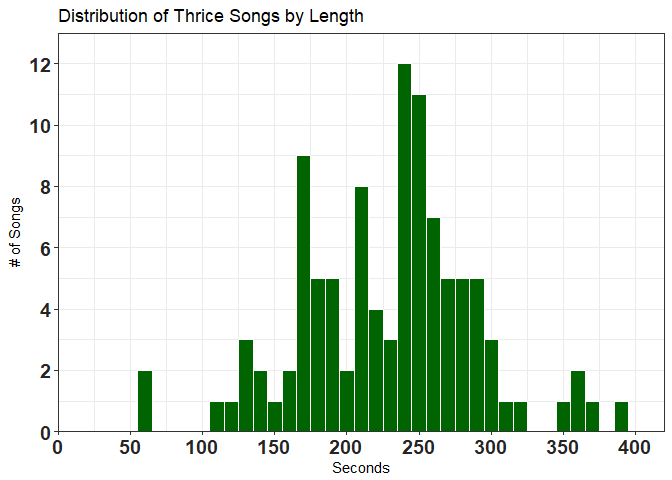
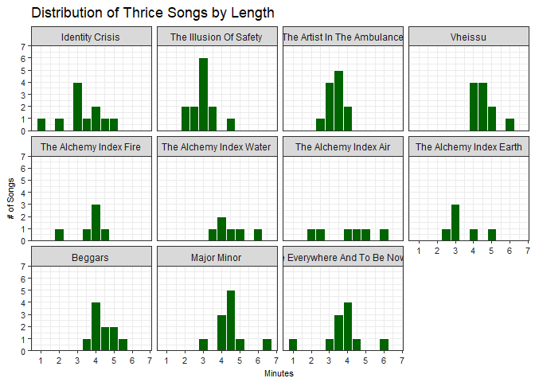
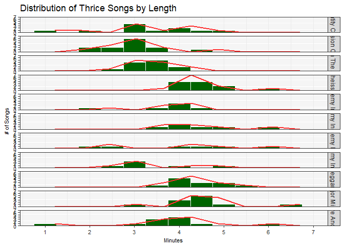
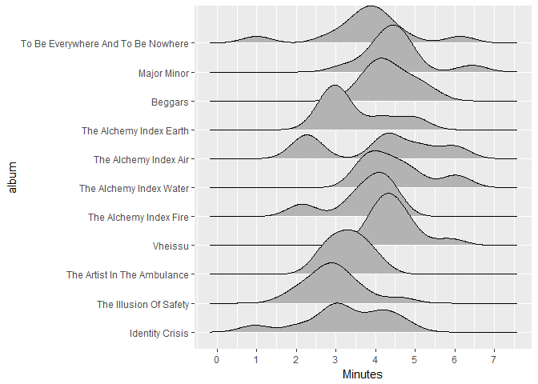
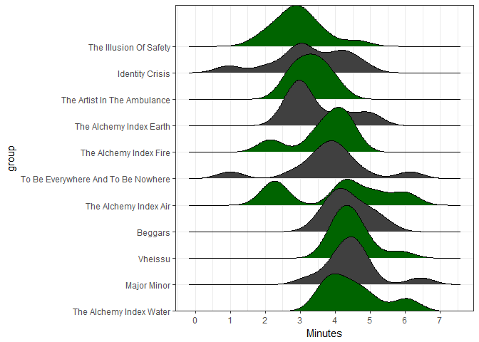
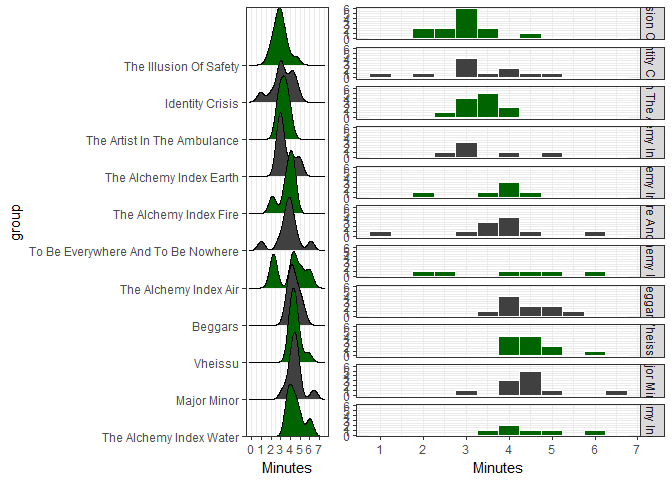
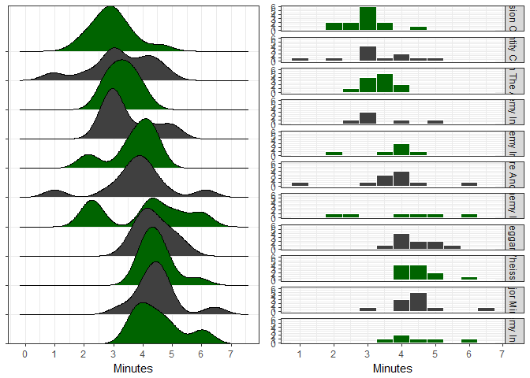

*(April-2018: updated to use `ggridges` package instead of deprecated `ggjoy`)*

Hello, for those who know me well you would know that my favorite band is [Thrice](https://en.wikipedia.org/wiki/Thrice)! For those that aren't familiar with them, they are a post-hardcore rock band from California, specifically the area around where I went to college (OC/Irvine area). This article will be **Part 1** of a series that will cover data analysis of Thrice's lyrics. Part 1, however, we will just be looking at doing some exploratory analysis with all of the non-lyrics data so we can all get a understanding of the context of what we are dealing with before we deep-dive into the lyrics!

``` r
# Packages:
library(tidyverse)     # for dplyr and tidyr
library(lubridate)     # measuring and calculating time periods
library(scales)        # fiddling with scales on our plots
library(stringr)       # detecting string patterns
library(gridExtra)     # arranging multiple plots in a single output

# Load and tidy  ----------------------------------------------------------

df <- read.csv('~/R_materials/ThriceLyrics/thrice.df.csv', header = TRUE, stringsAsFactors = FALSE)
str(df, list.len = 3)
```

    ## 'data.frame':    103 obs. of  9 variables:
    ##  $ ID      : int  1 2 3 4 5 6 7 8 9 10 ...
    ##  $ album   : chr  "Identity Crisis" "Identity Crisis" "Identity Crisis" "Identity Crisis" ...
    ##  $ year    : int  2000 2000 2000 2000 2000 2000 2000 2000 2000 2000 ...
    ##   [list output truncated]

One of the important things to note about reading in files into the R environment is that if you already have headers in the data set you are importing, you need to set `header = TRUE` or else your column/variable names will appear on their own as the first row of each column, as shown below:

``` r
df2 <- read.csv('~/R_materials/ThriceLyrics/thrice.df.csv', header = FALSE, stringsAsFactors = FALSE)

str(df2, list.len = 3)
```

    ## 'data.frame':    104 obs. of  9 variables:
    ##  $ V1: chr  "ID" "1" "2" "3" ...
    ##  $ V2: chr  "album" "Identity Crisis" "Identity Crisis" "Identity Crisis" ...
    ##  $ V3: chr  "year" "2000" "2000" "2000" ...
    ##   [list output truncated]

Let's get a "glimpse" of our data frame!

``` r
glimpse(df)
```

    ## Observations: 103
    ## Variables: 9
    ## $ ID       <int> 1, 2, 3, 4, 5, 6, 7, 8, 9, 10, 11, 12, 13, 14, 15, 16...
    ## $ album    <chr> "Identity Crisis", "Identity Crisis", "Identity Crisi...
    ## $ year     <int> 2000, 2000, 2000, 2000, 2000, 2000, 2000, 2000, 2000,...
    ## $ tracknum <int> 1, 2, 3, 4, 5, 6, 7, 8, 9, 10, 11, 1, 2, 3, 4, 5, 6, ...
    ## $ title    <chr> "Identity Crisis", "Phoenix Ignition", "In Your Hands...
    ## $ writers  <chr> "Dustin Kensrue", "Dustin Kensrue", "Riley Breckenrid...
    ## $ length   <chr> "2M 58S", "3M 31S", "2M 47S", "3M 4S", "3M 2S", "2M 4...
    ## $ lengthS  <chr> "178S", "211S", "167S", "184S", "182S", "124S", "57S"...
    ## $ lyrics   <chr> "Image marred by self-infliction <br>  Private wars o...

As we can see the song `ID`, `year`, `track num` variables are all of the type `integer`, all others are `character` types, even the `length` and `lengthS` variables. To transform these last two variables we can use the `lubridate` package. The \``ms()` and `seconds()` functions in this package transforms `character` or `numeric` types into a `Period` type, which is a specific class that can track the changes between date/times. Concurrently we can turn `album` and `year` variables into a factor!

``` r
library(lubridate)

df <- df %>% 
  mutate(album = factor(album, levels = unique(album)),
         year = factor(year, levels = unique(year)),
         length = ms(length),
         lengthS = seconds(length))

glimpse(df)
```

    ## Observations: 103
    ## Variables: 9
    ## $ ID       <int> 1, 2, 3, 4, 5, 6, 7, 8, 9, 10, 11, 12, 13, 14, 15, 16...
    ## $ album    <fct> Identity Crisis, Identity Crisis, Identity Crisis, Id...
    ## $ year     <fct> 2000, 2000, 2000, 2000, 2000, 2000, 2000, 2000, 2000,...
    ## $ tracknum <int> 1, 2, 3, 4, 5, 6, 7, 8, 9, 10, 11, 1, 2, 3, 4, 5, 6, ...
    ## $ title    <chr> "Identity Crisis", "Phoenix Ignition", "In Your Hands...
    ## $ writers  <chr> "Dustin Kensrue", "Dustin Kensrue", "Riley Breckenrid...
    ## $ length   <S4: Period> 2M 58S, 3M 31S, 2M 47S, 3M 4S, 3M 2S, 2M 4S, 5...
    ## $ lengthS  <S4: Period> 178S, 211S, 167S, 184S, 182S, 124S, 57S, 250S,...
    ## $ lyrics   <chr> "Image marred by self-infliction <br>  Private wars o...

Both `length` and `lengthS` are now `Period` type variables! `album` and `year` are a factor!

Now let's take a closer look at our data! First, let's look at how many total albums have Thrice released?

``` r
# Explore our data -----------------------------------------------

length(unique(df$album))
```

    ## [1] 11

11 albums so far! Do note that in reality, **The Alchemy Index** albums (divided into the four elements of **Fire**, **Water**, **Air**, and **Earth**) were organized into two albums of two elements each (released in 2007 and 2008 respectively). I divided each element album individually because they're stylistically very different from one another and for the purposes of the lyrics analysis later on, I thought it would be better to categorize them into distinct albums.

Another way to do the above and in more readable code is to use the `n_distinct()` function from the `dply` package while also taking advantage of the `magrittr` pipes:

``` r
df %>% select(album) %>% n_distinct()  
```

    ## [1] 11

How many total songs have Thrice released?

``` r
df %>% select(title) %>% n_distinct()
```

    ## [1] 103

Now let's list all of the Thrice albums by name:

``` r
df %>% select(album, year) %>% unique() 
```

    ##                                 album year
    ## 1                     Identity Crisis 2000
    ## 12             The Illusion Of Safety 2002
    ## 25        The Artist In The Ambulance 2003
    ## 37                            Vheissu 2005
    ## 48             The Alchemy Index Fire 2007
    ## 54            The Alchemy Index Water 2007
    ## 60              The Alchemy Index Air 2008
    ## 66            The Alchemy Index Earth 2008
    ## 72                            Beggars 2009
    ## 82                        Major Minor 2011
    ## 93 To Be Everywhere And To Be Nowhere 2016

What is the length in seconds and minutes of each album?

``` r
df %>% 
  group_by(album, year) %>% 
  summarise(num_songs = n(),    # Number of songs in each album
            duration = as.duration(sum(lengthS))) %>% 
  arrange(desc(duration))
```

    ## # A tibble: 11 x 4
    ## # Groups:   album [11]
    ##    album                            year  num_songs duration              
    ##    <fct>                            <fct>     <int> <S4: Duration>        
    ##  1 Major Minor                      2011         11 2962s (~49.37 minutes)
    ##  2 Vheissu                          2005         11 2960s (~49.33 minutes)
    ##  3 Beggars                          2009         10 2624s (~43.73 minutes)
    ##  4 To Be Everywhere And To Be Nowh~ 2016         11 2496s (~41.6 minutes) 
    ##  5 The Artist In The Ambulance      2003         12 2374s (~39.57 minutes)
    ##  6 The Illusion Of Safety           2002         13 2307s (~38.45 minutes)
    ##  7 Identity Crisis                  2000         11 2142s (~35.7 minutes) 
    ##  8 The Alchemy Index Water          2007          6 1627s (~27.12 minutes)
    ##  9 The Alchemy Index Air            2008          6 1454s (~24.23 minutes)
    ## 10 The Alchemy Index Fire           2007          6 1327s (~22.12 minutes)
    ## 11 The Alchemy Index Earth          2008          6 1256s (~20.93 minutes)

**Major/Minor** and **Vheissu** are the longest albums, both totaling up to a bit over 49 mins!

How about the length of each song?

``` r
df %>% 
  group_by(title) %>% 
  summarise(duration = as.duration(sum(lengthS))) %>% 
  arrange(desc(duration))
```

    ## # A tibble: 103 x 2
    ##    title                       duration            
    ##    <chr>                       <S4: Duration>      
    ##  1 Words In The Water          386s (~6.43 minutes)
    ##  2 Salt And Shadow             368s (~6.13 minutes)
    ##  3 Night Diving                362s (~6.03 minutes)
    ##  4 Daedalus                    360s (~6 minutes)   
    ##  5 Stand And Feel Your Worth   352s (~5.87 minutes)
    ##  6 Beggars                     324s (~5.4 minutes) 
    ##  7 A Song For Milly Michaelson 307s (~5.12 minutes)
    ##  8 The Weight                  300s (~5 minutes)   
    ##  9 The Earth Isn't Humming     298s (~4.97 minutes)
    ## 10 Kings Upon The Main         296s (~4.93 minutes)
    ## # ... with 93 more rows

Besides grouping with `group_by()` and summarizing with `summarize()`, there are other ways to filter our data. For example, let's say we want to see the total duration of **The Alchemy Index** (**Fire**, **Water**, **Earth**, and **Air**) then we could use the `grepl()` function to search for all albums with the term "Index" in it:

``` r
df %>% 
  filter(grepl("Index", album)) %>% 
  summarise(duration_minutes = seconds_to_period(sum(lengthS)))
```

    ##   duration_minutes
    ## 1       1H 34M 24S

or we can use `stringr` package's `str_detect()` function to find all instances inside `album` which has the term "Index" in it:

``` r
library(stringr)

df %>% 
  filter(str_detect(album, "Index")) %>% 
  summarise(duration_minutes = seconds_to_period(sum(lengthS)))
```

    ##   duration_minutes
    ## 1       1H 34M 24S

Both do practically the same thing. The `seconds_to_period()` function here essentially allows us to create a `Period` output (Days/Hours/Minutes/Seconds) from the variable `lengthS` (which is in seconds).

If we wanted to look at a specific album:

``` r
df %>% 
  filter(album == "Vheissu") %>% 
  summarise(duration_minutes = seconds_to_period(sum(lengthS)))
```

    ##   duration_minutes
    ## 1          49M 20S

How about we try summarizing as we did a few code chunks back but use the `seconds_to_period()` function instead?

``` r
df %>% 
  group_by(album) %>% 
  summarize(duration_minutes = seconds_to_period(sum(lengthS))) %>% 
  arrange(desc(duration_minutes))
```

    ## # A tibble: 11 x 2
    ##    album                              duration_minutes
    ##    <fct>                              <S4: Period>    
    ##  1 The Alchemy Index Earth            35M 56S         
    ##  2 Beggars                            44S             
    ##  3 Identity Crisis                    42S             
    ##  4 To Be Everywhere And To Be Nowhere 36S             
    ##  5 The Artist In The Ambulance        34S             
    ##  6 The Illusion Of Safety             27S             
    ##  7 Major Minor                        22S             
    ##  8 Vheissu                            20S             
    ##  9 The Alchemy Index Air              14S             
    ## 10 The Alchemy Index Fire             7S              
    ## 11 The Alchemy Index Water            7S

``` r
df %>% 
  group_by(title) %>% 
  summarize(duration_song = seconds_to_period(sum(lengthS))) %>% 
  arrange(desc(duration_song))
```

    ## # A tibble: 103 x 2
    ##    title                            duration_song
    ##    <chr>                            <S4: Period> 
    ##  1 All The World Is Mad             3M 59S       
    ##  2 Black Honey                      59S          
    ##  3 Don't Tell And We Won't Ask      59S          
    ##  4 Paper Tigers                     59S          
    ##  5 Identity Crisis                  58S          
    ##  6 The Earth Isn't Humming          58S          
    ##  7 Yellow Belly                     58S          
    ##  8 The Next Day                     57S          
    ##  9 Between The End And Where We Lie 56S          
    ## 10 Kings Upon The Main              56S          
    ## # ... with 93 more rows

Unfortunately, the seconds\_to\_period() conversion doesn't seem to work well with `summarize()` across the entire set of the songs or albums. I find it very weird as from previous times we used it, such as when we summarized all the Alchemy Index albums together, it worked perfectly fine. *I'll have to look into this later...*

Leaving that aside for now (especially since we can still calculate the sums just fine using `duration()`), let's start plotting to visualize the song lengths for Thrice!

Plot song lengths!
------------------

``` r
# Plotting! ---------------------------------------------------------------

df %>% 
  ggplot(aes(x = as.numeric(lengthS))) + 
  geom_histogram(binwidth = 10, 
                 color = 'white',
                 fill = 'darkgreen') +
  scale_y_continuous(breaks = pretty_breaks(), 
                      limits = c(0, 13), expand = c(0, 0)) +  # expand 0,0 to reduce space
  scale_x_continuous(breaks = pretty_breaks(10), 
                     limits = c(0, 420), expand = c(0, 0)) +  # set limits manually
  xlab('Seconds') +
  ylab('# of Songs') +
  labs(title = 'Distribution of Thrice Songs by Length') +
  theme_bw() +
  theme(axis.text = element_text(size = 14, face = "bold", color = "#252525"))
```



Let's try plotting in minutes as well by dividing the `lengthS` (length in seconds) by 60, it won't be a perfect conversion as it's not sexagesimal (base-60) but it's good enough for our purposes. Also, the `period` variable type that we created doesn't seem to work with ggplot as far as I know, which is why you have to convert it to `numeric` in `ggplot()`.

``` r
df %>% 
  ggplot(aes(x = as.numeric(lengthS)/60)) + 
  geom_histogram(binwidth = 0.5, 
                 color = 'white',
                 fill = 'darkgreen') +
  scale_y_continuous(breaks = pretty_breaks(10), 
                     expand = c(0,0), limits = c(0, 30)) +
  scale_x_continuous(breaks = pretty_breaks(5)) +
  xlab('Minutes') +
  ylab('# of Songs') +
  labs(title = 'Distribution of Thrice Songs by Length') +
  theme_bw() +
  theme(axis.text = element_text(size = 14, color = "#252525"),
        axis.title = element_text(size = 14))
```


Change to plot by length in minutes (not perfect as it won't be in base 60):

``` r
histogram <- df %>% 
  ggplot(aes(x = as.numeric(lengthS)/60)) + 
  geom_histogram(binwidth = 0.5, 
                 color = "#FFFFFF",
                 fill = "#006400") +
  scale_y_continuous(breaks = pretty_breaks(), expand = c(0, 0), limits = c(0, 7)) +
  scale_x_continuous(breaks = pretty_breaks()) +
  xlab('Minutes') +
  ylab('# of Songs') +
  labs(title = 'Distribution of Thrice Songs by Length') +
  theme_bw() +
  theme(axis.text = element_text(size = 8, color = "#252525"),
        axis.title = element_text(size = 8)) 
```

How can we see differences between albums? We can use subset our data to create mini-plots for each individual level of our variable (`album` in our case) using facets. First let's try the `facet_wrap()` function:

``` r
histogram + facet_wrap(~album)
```



With this setup we can see the distribution for an individual album quite well, however it's hard to compare across different albums unless they are situated in the same column.

How about we try it the other way around, with the plot of each album being a row instead while also add some trend lines? This time we'll use the `facet_grid()` function with the levels of the variable (`album`) being distributed vertically:

``` r
histogram + facet_grid(album ~.) + 
  geom_smooth(se = FALSE, stat = "bin", bins = 10, col = "#FF3030")
```



That looks **really bad**. On one hand, we can compare the histograms against each other easily, but the bars are all squished and that makes it hard to discern any differences. There are just way too many albums and not enough screen space to take advantage of facetting like this.

If there weren't so many albums it'll look better but even then, the trend lines aren't very smooth in the first place.
What we can do is try out a different plotting method altogether, so now let's introduce...

Joy plots!
----------

**Joy plots** engulfed the data science/visualization community during the past summer. First popularized in a post by Henrik Lindberg on ["peak times for sports and leisure"](https://www.reddit.com/r/dataisbeautiful/comments/6m0wo7/peak_time_for_sports_and_leisure_oc/), joy plots are useful for visualizing changes in distribution over time or space and was made to be an alternative to heat maps. Amidst much debate on the various advantages and disadvantages of this visualization method all across social media, Claus Wilke released the [ggjoy](https://cran.r-project.org/web/packages/ggjoy/vignettes/introduction.html) package that allows you to easily make joy plots on top of the existing `ggplot2` package.

**(April-2018: updated to use `ggridges` package)**

I finally have a chance to put this to practice with my own data so let's try it out here!

``` r
# Joy Plots ---------------------------------------------------------------
library(ggridges)

df %>% 
  ggplot(aes(x = as.numeric(lengthS)/60, y = album)) +
  geom_density_ridges() +
  xlab('Minutes') +
  scale_x_continuous(breaks = pretty_breaks(7))
```



You can see that the the **ridge lines** are drawn from the **densities** of the data along time (x-axis). The more numerous the amount of songs of any particular duration of time, the higher the ridges appear, with the overall effect being that of a mountain range that can be compared across different groups, in this case Thrice's albums.

Now let's add some color (dark green = `#006400`, dark grey = `#404040`) and tinker with the scales a bit...

``` r
joyplot <- df %>% 
  mutate(group = reorder(album, desc(lengthS))) %>%   # reorder based on lengthS (descending)
  ggplot(aes(x = as.numeric(lengthS)/60, y = group, fill = group)) +   
  geom_density_ridges(scale = 2) +                       # scale to set amount of overlap between ridges
  xlab('Minutes') +
  scale_x_continuous(breaks = pretty_breaks(10)) +
  scale_y_discrete(expand = c(0, 0)) +
  scale_fill_manual(values = rep(c("#006400", "#404040"), n_distinct(df$album))) +
  theme_bw() +
  theme(legend.position = "none")

joyplot
```



From the joy plot you can clearly see the density of songs shift from around 3 minutes in *The Illusion of Safety* to around 4 minutes or more in the bottom few albums. The only thing really setting apart the longer albums are the amount of songs that are 6 minutes or longer, otherwise most of the songs in an album are around the 4-5 minute mark. A note about **The Alchemy Index: Water** is the fourth track, [*Night Diving*](https://www.youtube.com/watch?v=p3jDFVfys_Q) a 6+ minute long instrumental which, although really nice to listen to on long drives or on a plane, inflates the album's position in the joy plot! In contrast, both **To Be Everywhere And To Be Nowhere** and **Identity Crisis** also have instrumentals but with a length of around a minute each!

Finally, let's compare our histogram with the joy plot!

We can use the `grid` package to customize layouts:

``` r
library(grid)

pushViewport(viewport(layout = grid.layout(1,2)))

print(joyplot, vp = viewport(layout.pos.row = 1, layout.pos.col = 1))
print(hist, vp = viewport(layout.pos.row = 1, layout.pos.col = 2))
```



Or you could use the `gridExtra` package and the `grid.arrange()` function which is a lot more faster:

``` r
library(gridExtra)

grid.arrange(joyplot2, hist, nrow = 1)
```



We can see that the **joy plots** make the data a lot more understandable (for the final comparison I took out the y-axis labels so we can see the joy plot better).

And that concludes **Part 1**! Next we will be getting into the real meat of sentiment analysis using the `tidytext` package!
