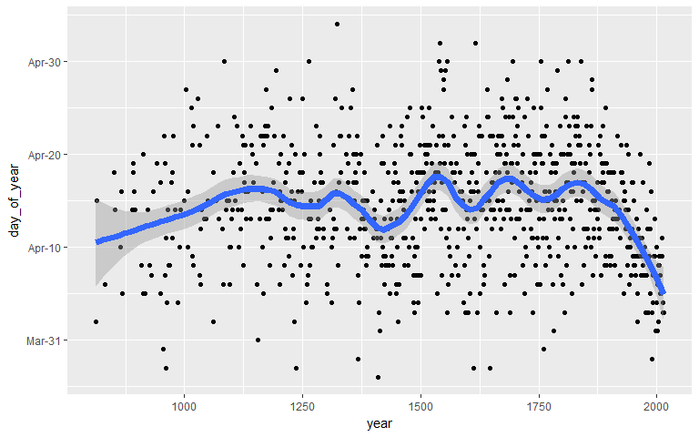
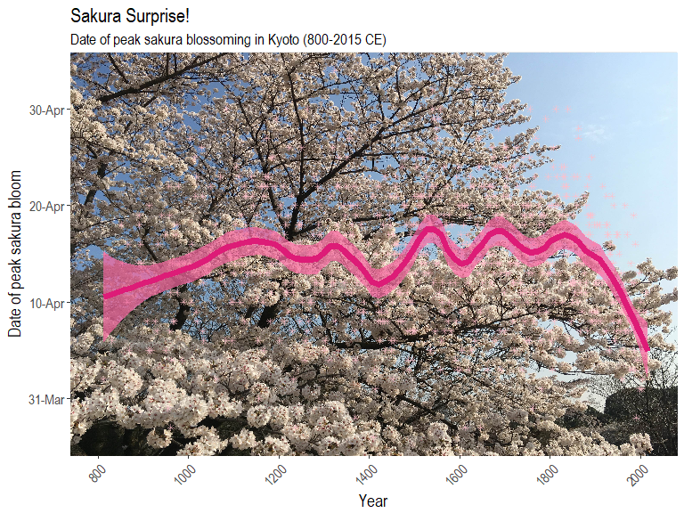

**April** in *Japan* is a time of new beginnings. Unlike most countries, the school year starts in April and is also the beginning of the fiscal year for the government and most corporations. This past April, The Economist presented an interesting article with a beautiful ggplot2 graphic depicting the steadily early blossoming of **"sakura" or "cherry blossom"** trees in Kyoto:


For this article I will try to recreate this graphic but with a few tricks of my own. Thankfully the raw data is made available by the original author of the research paper documenting this phenomenon, Dr. Yasuyuki Aono from Osaka Prefecture University. The data set can be downloaded from [here](http://atmenv.envi.osakafu-u.ac.jp/aono/kyophenotemp4/).

Let's get started by loading up our packages and data:

``` r
library(dplyr)
library(tidyr)
library(stringr)
library(scales)

# Load data ---------------------------------------------------------------

sakura <- read.csv(url("https://raw.githubusercontent.com/Ryo-N7/sakura_bloom/master/Kyoto_Flowers.csv"))

glimpse(sakura)
```

    ## Observations: 1,235
    ## Variables: 7
    ## $ AD                        <int> 801, 802, 803, 804, 805, 806, 807, 8...
    ## $ Full.flowering.date..DOY. <int> NA, NA, NA, NA, NA, NA, NA, NA, NA, ...
    ## $ Full.flowering.date       <int> NA, NA, NA, NA, NA, NA, NA, NA, NA, ...
    ## $ Source.code               <int> NA, NA, NA, NA, NA, NA, NA, NA, NA, ...
    ## $ Data.type.code            <int> NA, NA, NA, NA, NA, NA, NA, NA, NA, ...
    ## $ Reference.Name            <fct> -, -, -, -, -, -, -, -, -, -, -, NIH...
    ## $ X                         <lgl> NA, NA, NA, NA, NA, NA, NA, NA, NA, ...

From looking at the raw data, it appears that data is missing from a number of rows until **812 AD**, along with many other rows throughout the years. We might as well cut those rows out since we can manually specify the limits of our `year` variable when we start plotting. Let's also remove a few columns we won't be needing for our analysis and fix some of those column names...

``` r
# remove rows without flowering date
sakura <- sakura %>% filter(!is.na(Full.flowering.date)) 

# another way: use drop_na()
# sakura %>% drop_na(Full.flowering.date) 

colnames(sakura) <- sakura %>% 
  colnames() %>% 
  str_to_lower() %>%                  # to lower case letters
  str_replace_all("\\.", "_")         # replace . with _

sakura <- sakura %>% 
  select(-full_flowering_date__doy_, -x, -data_type_code, 
         -reference_name, -source_code)

sakura <- sakura %>% rename(year = ad)

glimpse(sakura)
```

    ## Observations: 827
    ## Variables: 2
    ## $ year                <int> 812, 815, 831, 851, 853, 864, 866, 869, 88...
    ## $ full_flowering_date <int> 401, 415, 406, 418, 414, 409, 416, 405, 41...

Much better! Now let's separate the column containing our three-digit date data into individual `month` and `day` columns. After converting the `full_flowering_date` column into **character** format, we can use regular expressions (**regex**) to parse the character strings of the date and then separate the `month` digits and `day` digits with a `.` period symbol.

``` r
# split into two backreferences on the first digit, then place a '.' in between
date_sep <- as.character(sakura$full_flowering_date) %>% 
  str_replace_all("(.{1})(.*)", "\\1.\\2") %>% 
  as_data_frame()

colnames(date_sep)[1] <- "date_fl"             # properly name column

# separate into 'month' and 'day' columns by '.'
date_sep <- date_sep %>% separate(date_fl, c("month", "day"), "\\.")  

glimpse(date_sep)
```

    ## Observations: 827
    ## Variables: 2
    ## $ month <chr> "4", "4", "4", "4", "4", "4", "4", "4", "4", "4", "4", "...
    ## $ day   <chr> "01", "15", "06", "18", "14", "09", "16", "05", "14", "1...

Now we can combine `date_sep` into `sakura` using `bind_cols()`:

``` r
sakura <- bind_cols(date_sep, sakura)   
```

Using the `make_date()` function in the `lubridate` package we can create a separate variable in YYYY/MM/DD format. You can also format the individual date components into their own variables if you wish.

``` r
library(lubridate)

sakura <- sakura %>% 
  mutate(bloom = make_date(year, month, day),
         day_of_year = as.numeric(format(bloom, "%j"))) %>% #  %j: decimal day of the year
  select(-full_flowering_date)                     

# Optional: Reformat date variables into specific date formats
# sakura$Year <- format(sakura$bloom, "%Y")                 #  %Y: 4 digit year
# sakura$Month <- format(sakura$bloom, "%b")                #  %b: abbreviated month
# sakura$Day <- format(sakura$bloom, "%d")                  #  %d: decimal date

glimpse(sakura)
```

    ## Observations: 827
    ## Variables: 5
    ## $ month       <chr> "4", "4", "4", "4", "4", "4", "4", "4", "4", "4", ...
    ## $ day         <chr> "01", "15", "06", "18", "14", "09", "16", "05", "1...
    ## $ year        <int> 812, 815, 831, 851, 853, 864, 866, 869, 889, 891, ...
    ## $ bloom       <date> 0812-04-01, 0815-04-15, 0831-04-06, 0851-04-18, 0...
    ## $ day_of_year <dbl> 92, 105, 96, 108, 104, 100, 106, 95, 104, 109, 108...

Now we are ready to plot! We can pass a function in the `labels` argument in `scale_y_continuous` to format the y-axis to show the date in a Day/Month format.

``` r
library(ggplot2)

ggplot(sakura, aes(x = year, y = day_of_year)) +
  geom_point() +
  scale_y_continuous(labels = function(x) format(as.Date(as.character(x), "%j"), "%d-%b")) 
```


We can't really tell what's happening from this sea of dots... So, let's add a [smoother](http://ggplot2.tidyverse.org/reference/geom_smooth.html) to help us better see the overall trend over time! Let's also change how the date appears on the y-axis as well...

``` r
ggplot(sakura, aes(x = year, y = day_of_year)) + 
  geom_point() +
  geom_smooth(span = 0.2, size = 2.5) +
  scale_y_continuous(labels = function(x) format(as.Date(as.character(x), "%j"), "%b-%d"))
```



Looks better! Now we can clearly see the trend of the sakura blooming date over time! But could we make it more... sakura-y?

``` r
library(extrafont)

ggplot(sakura, aes(x = year, y = day_of_year)) +  
  geom_point(shape = 8, size = 5, color = "pink") +
  geom_smooth(span = 0.2, color = "#dd1c77", fill = "red", size = 2.5) +
  scale_y_continuous(labels = function(x) format(as.Date(as.character(x), "%j"), "%b-%d"),
                     limits = c(84, 125)) +
  labs(x = "Year", y = "Date of peak sakura bloom") +
  theme(text = element_text(family = "Arial Narrow", size = 14))
```


Better! But, the colors don't look good on a drab grey background... So let's add a background image! Normally, you would **never** add in a background image to a plot as it would obscure the individual data points and other details. However, for this post I wanted do something *slightly* different from what *The Economist* did and I'll make it so that you can still clearly see the trend line despite the background image!

We can add in a background iamge by utilizing a variety of packages such as `jpeg`, `grid`, and `gridExtra` to download an image from the internet, turn it into a raster, and then place our ggplot on top of it!

**Steps:**

1.  Download an image and store it in a temporary file
2.  Save that image with the `readJPEG()` function
3.  Use `rasterGrob()` to render a raster object with the downloaded image
4.  Build up our ggplot visualization step-by-step

When I originally created this viz last year, I just used an image taken from Google, but this year I went to the [Imperial Palace East Gardens](https://www.japan-guide.com/e/e3018.html) and took a few pics of the beautiful cherry blossoms there to use for this plot!

``` r
library(jpeg)
library(grid)
library(gridExtra)
library(extrafont)

# Google image: https://i.imgur.com/CgwU1zb.jpg
# Imperial Gardens 1: https://i.imgur.com/eN3vc9g.jpg
# Imperial Gardens 2: https://i.imgur.com/dzMtEWz.jpg

img_url <- "https://i.imgur.com/dzMtEWz.jpg"
temp <- tempfile()
download.file(img_url, temp, mode = "wb")
img <- readJPEG(temp)
file.remove(temp)

rstr <- rasterGrob(img, width = unit(1, "npc"), height = unit(1, "npc"), interpolate = FALSE)

ggplot(data = sakura) + 
  annotation_custom(rstr, -Inf, Inf, -Inf, Inf) +
  geom_point(aes(x = year, y = day_of_year), alpha = 0.5, color = "pink", shape = 8) +
  geom_smooth(aes(x = year, y = day_of_year), 
              alpha = 0.7, color = "#dd1c77", span = 0.2, size = 2.5, fill = "#f768a1") +
  scale_y_continuous(labels = function(x) format(as.Date(as.character(x), "%j"), "%d-%b")) +
  scale_x_continuous(limits = c(800, 2020), breaks = seq(800, 2000, 200)) +
  labs(x = "Year", y = "Date of peak sakura bloom") +
  ggtitle("Sakura-ing Early!", subtitle = "Date of peak sakura blossoming in Kyoto (800-2015 CE)") +
  theme(axis.text.x = element_text(size = 11, angle = 45, hjust = 1),
        axis.text.y = element_text(size = 12),
        text = element_text(family = "Arial Narrow", size = 14))
```



We can see that the full or "peak" blossoming date for sakura has come earlier and earlier in the year since the 20th century! You can use the code above to try it out with other pictures as well.

Some other cool uses of Dr. Aono's sakura data set include [this](http://opiateforthemass.es/articles/sakura/) visualization done by Christoph Safferling from *"Opiate for the masses"* where he incorporated sakura emoji as the data point shapes; definitely much better than the ersatz `geom_point` shape I used as "sakura" for my own plot!

The date of peak blooming is different depending on the region, usually the northern parts of Japan have their peak blooming date earlier. It would be an interesting project/idea to make a visualization comparing the peak dates across Japan! Maybe as some kind of cascading animation?

To cap off, I'll leave you with some photos I took of sakura in Tokyo when I went back home for Spring Break back in April (2017)!


**A few more from this year, 2018!**


