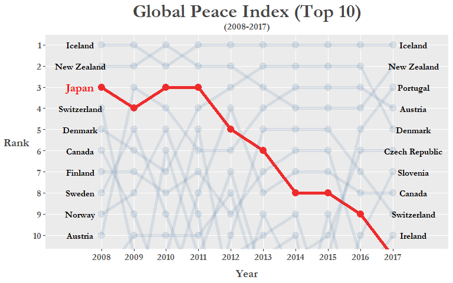
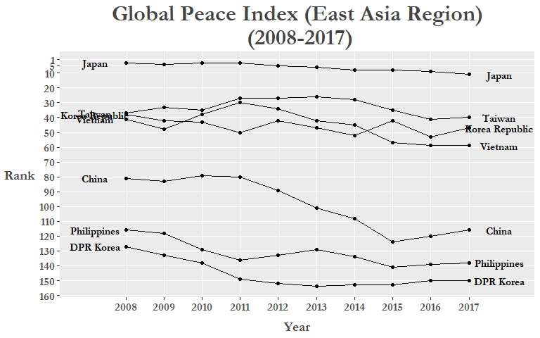
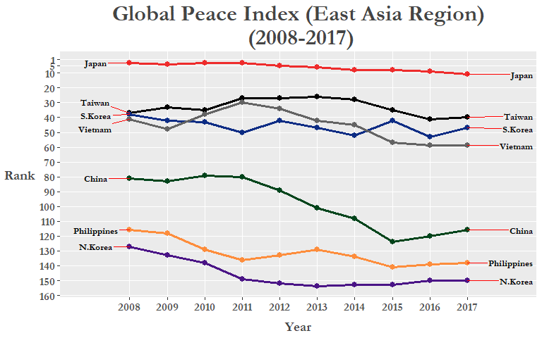
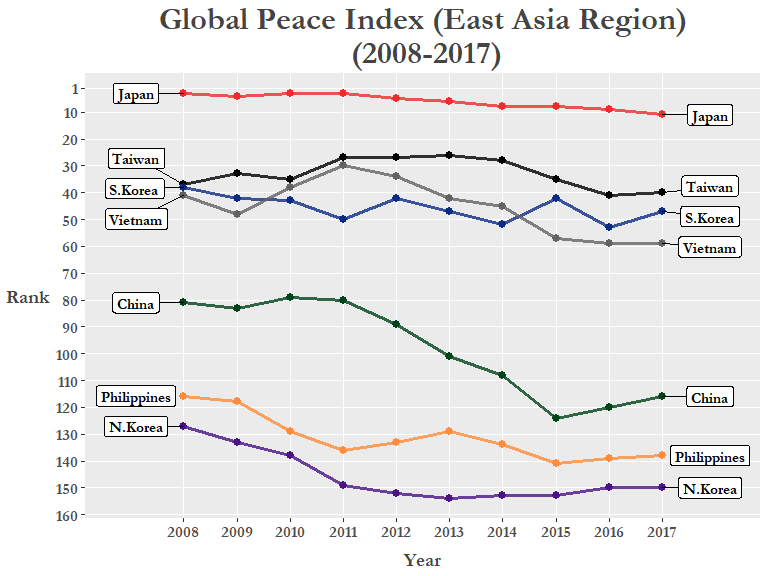

(Check out the English version of this blog post [here](https://ryo-n7.github.io/2017-09-18-global-peace-index/))!

世界平和度指数はInstitute for Economics and Peace (IEP)と呼ばれるシンクタンクが作った指数で、各国と地域の平和度を数値化する試みであります。このデータから何が読み取れるかと思っていれば、2017年度のデータから作成された地図を見てみましょう。 

GPIの[ウェブサイト](http://visionofhumanity.org/indexes/global-peace-index/)を見れば他にも参考になるビジュアリゼーションがあります。今回はこの世界平和度指数のデータを`rvest`パッケージでWikipediaからスクレープし、`dplyr`、`tidyr`、`stringr`などのTidyverseパッケージでデータクリーニングをして、最終的に**バンプチャート**という情報を知覚認識させることで可視化します。

この記事で、Rでのデータ分析ワークフローを一歩ずつ説明していきたいと思います。

では、始めましょう！

``` r
# Global Peace Index
library(tidyverse)          
library(scales)             
library(ggrepel)            
library(rvest)              
library(stringr)            
library(forcats)            

url <- "https://en.wikipedia.org/wiki/Global_Peace_Index"

GPI <- url %>% 
  read_html() %>% 
  html_nodes('table.wikitable:nth-child(71)') %>%
  .[[1]] %>% 
  html_table(header = TRUE)
```

上記の関数はWikipediaのリンクを保存し、それを`read_html()`の関数に通して、世界平和度指数のデータテーブルがある場所の**CSS Selector** ('table.wikitable:nth-child(71)'の部分)を使ってデータを確保します。この**CSS Selector**をどうやって見つければいいのかを順番に説明しましょう。

＊下記はMozilla Firefoxのブラウザーを使った方法です＊

1.　キーボードで**F12**か**Ctrl + Shift + C** を押し、**Inspector Tool**を出します。

2.　上部のポップアップバーの一番左側のボタンを押します。

3.　マウスでウェブページからスクレープしたい部分に置くとコンソールは自動的にその部分のhtmlコードに移動します。

4.　ハイライトされているコードを右クリックして、"Copy"、それで"CSS Selector"を押します。

5.　Rのスクリプトに戻り、上記の用に`html_nodes()`の関数の中にペーストします。

6.　データテーブルが入っているエレメントをセレクトします。(`.[[1]]`)

7.　データテーブルを`html_table()`の関数で引き抜きます。

[**Selector Gadget**](http://selectorgadget.com/)や他のやり方でウェブページからデータを引き抜く事もできます。

では、Wikipediaから引き抜いたデータを見てみましょう。

``` r
glimpse(GPI)
```

    ## Observations: 163
    ## Variables: 21
    ## $ Country               <chr> "Iceland", "New Zealand", "Portugal", "A...
    ## $ `2017 rank`           <chr> "1", "2", "3", "4", "5", "6", "7", "8", ...
    ## $ `2017 score[1]`       <dbl> 1.111, 1.241, 1.258, 1.265, 1.337, 1.360...
    ## $ `2016 rank`           <int> 1, 4, 5, 3, 2, 6, 10, 8, 7, 12, 9, 15, 1...
    ## $ `2016 score[57]`      <dbl> 1.192, 1.287, 1.356, 1.278, 1.246, 1.360...
    ## $ `2015 rank`           <int> 1, 4, 11, 3, 2, 10, 15, 7, 5, 12, 8, 9, ...
    ## $ `2015 score[58]`      <dbl> 1.148, 1.221, 1.344, 1.198, 1.150, 1.341...
    ## $ `2014 rank`           <int> 1, 4, 18, 3, 2, 11, 14, 7, 5, 13, 8, 15,...
    ## $ `2014 score[59]`      <dbl> 1.189, 1.236, 1.425, 1.200, 1.193, 1.381...
    ## $ `2013 rank`           <int> 1, 3, 18, 4, 2, 14, 13, 8, 5, 12, 6, 16,...
    ## $ `2013 score[60]`      <dbl> 1.162, 1.237, 1.467, 1.250, 1.207, 1.404...
    ## $ `2012 rank`           <int> 1, 2, 16, 6, 2, 13, 8, 4, 10, 6, 5, 22, ...
    ## $ `2012 score[61],[62]` <dbl> 1.113, 1.239, 1.470, 1.328, 1.239, 1.396...
    ## $ `2011 rank`           <int> 1, 2, 17, 6, 4, 5, 10, 8, 16, 11, 3, 18,...
    ## $ `2011 score[63]`      <dbl> 1.148, 1.279, 1.453, 1.337, 1.289, 1.320...
    ## $ `2010 rank`           <int> 2, 1, 13, 4, 7, 12, 11, 14, 18, 6, 3, 19...
    ## $ `2010 score[64]`      <dbl> 1.212, 1.188, 1.366, 1.290, 1.341, 1.360...
    ## $ `2009 rank`           <int> 1, 2, 15, 3, 6, 16, 10, 9, 11, 14, 4, 19...
    ## $ `2009 score`          <dbl> 1.203, 1.227, 1.426, 1.240, 1.263, 1.430...
    ## $ `2008 rank`           <int> 1, 2, 14, 10, 5, 18, 13, 6, 4, 11, 3, 16...
    ## $ `2008 score`          <dbl> 1.107, 1.190, 1.385, 1.291, 1.238, 1.435...

今回はランキングのデータだけを必要としますので、`select()`のユーティリティー関数、`ends_with()`を利用して"rank"がカラム名の終わりにあるカラムだけを選択します。これを新しいデータフレーム、"GPI\_rank"にセーブします。"rank"が入っているカラムを一つ一つ選ぶ必要がないので非常に便利な関数です。

``` r
GPI_rank <- GPI %>% select(Country, ends_with("rank"))

colnames(GPI_rank) <- colnames(GPI_rank) %>% tolower()   # 変数名をすべて小文字に変えます

glimpse(GPI_rank)
```

    ## Observations: 163
    ## Variables: 11
    ## $ country     <chr> "Iceland", "New Zealand", "Portugal", "Austria", "...
    ## $ `2017 rank` <chr> "1", "2", "3", "4", "5", "6", "7", "8", "9", "10="...
    ## $ `2016 rank` <int> 1, 4, 5, 3, 2, 6, 10, 8, 7, 12, 9, 15, 13, 17, 19,...
    ## $ `2015 rank` <int> 1, 4, 11, 3, 2, 10, 15, 7, 5, 12, 8, 9, 18, 17, 22...
    ## $ `2014 rank` <int> 1, 4, 18, 3, 2, 11, 14, 7, 5, 13, 8, 15, 16, 10, 2...
    ## $ `2013 rank` <int> 1, 3, 18, 4, 2, 14, 13, 8, 5, 12, 6, 16, 20, 11, 2...
    ## $ `2012 rank` <int> 1, 2, 16, 6, 2, 13, 8, 4, 10, 6, 5, 22, 19, 18, 17...
    ## $ `2011 rank` <int> 1, 2, 17, 6, 4, 5, 10, 8, 16, 11, 3, 18, 34, 9, 20...
    ## $ `2010 rank` <int> 2, 1, 13, 4, 7, 12, 11, 14, 18, 6, 3, 19, 36, 5, 2...
    ## $ `2009 rank` <int> 1, 2, 15, 3, 6, 16, 10, 9, 11, 14, 4, 19, 43, 8, 2...
    ## $ `2008 rank` <int> 1, 2, 14, 10, 5, 18, 13, 6, 4, 11, 3, 16, 19, 9, 2...

このデータフレームはご覧の通りwide型になっています。これをtidy化、すなわちデータの各列が個々の変数と各行が個々の観測、に加工するには`tidyr`パッケージの`gather()`関数を使います。もっと詳しくはHadley Wickhamの[論文](https://www.jstatsoft.org/article/view/v059i10/v59i10.pdf)を読んでください。

``` r
GPI_rank <- GPI_rank %>% gather(`2017 rank`:`2008 rank`, key = "year", value = "rank")

glimpse(GPI_rank)
```

    ## Observations: 1,630
    ## Variables: 3
    ## $ country <chr> "Iceland", "New Zealand", "Portugal", "Austria", "Denm...
    ## $ year    <chr> "2017 rank", "2017 rank", "2017 rank", "2017 rank", "2...
    ## $ rank    <chr> "1", "2", "3", "4", "5", "6", "7", "8", "9", "10=", "1...

次は"year"のカラムから"rank"の文字を消しましょう。`stringr`パッケージの`str_replace_all()`関数で"rank"を`""` (ブランク)に変え、`trimws()`で文字列に空白が無い用にしましょう。そのついでに"year"カラムをfactorに変えましょう。

``` r
GPI_rank <- GPI_rank %>% mutate(year = str_replace_all(year, "rank", "") %>% trimws())

GPI_rank <- GPI_rank %>% mutate(year = as.factor(year))

GPI_rank %>% filter(year == 2008) %>% slice(9:20) # levels(GPI_rank$year)
```

    ## # A tibble: 12 x 3
    ##    country     year  rank 
    ##    <chr>       <fct> <chr>
    ##  1 Switzerland 2008  4    
    ##  2 Ireland     2008  11   
    ##  3 Japan       2008  3    
    ##  4 Australia   2008  16   
    ##  5 Bhutan      2008  19   
    ##  6 Norway      2008  9    
    ##  7 Hungary     2008  20   
    ##  8 Germany     2008  15   
    ##  9 Finland     2008  7    
    ## 10 Sweden      2008  8    
    ## 11 Belgium     2008  13   
    ## 12 Netherlands 2008  28

またデータフレームを見てみると。。。少数の国々が同じGPIランクになっている事がわかります。その国の"rank"カラムには位置の値の前に"＝"が入っていますので、この記号を`stringr`の`str_replace()`関数で消しましょう。その次に"rank"をnumericに変えて、データフレームを`arrange()`で"year", "rank"の順に変えましょう(2008: Rank \#1 - \#163, 2009: Rank \#1 - \#163, etc.)。

``` r
GPI_rank <- GPI_rank %>% 
  mutate(rank = str_replace(rank, "\\=", ""),
         rank = as.numeric(rank)) %>% 
  arrange(year, rank)

glimpse(GPI_rank)
```

    ## Observations: 1,630
    ## Variables: 3
    ## $ country <chr> "Iceland", "New Zealand", "Japan", "Switzerland", "Den...
    ## $ year    <fct> 2008, 2008, 2008, 2008, 2008, 2008, 2008, 2008, 2008, ...
    ## $ rank    <dbl> 1, 2, 3, 4, 5, 6, 7, 8, 9, 10, 11, 13, 13, 14, 15, 16,...

記号を取り除いた後、`rank()`関数の"ties.method"引数で同じランクの国々をアルファベット順で並べ替えます。

``` r
# BosniaとBangladeshは同じランク("84")になっています。
GPI_rank %>% 
  group_by(year) %>% 
  filter(year == 2017) %>% 
  slice(84:85)
```

    ## # A tibble: 2 x 3
    ## # Groups:   year [1]
    ##   country                year   rank
    ##   <chr>                  <fct> <dbl>
    ## 1 Bangladesh             2017    84.
    ## 2 Bosnia and Herzegovina 2017    84.

``` r
# Bangladeshが84位とBosnia & Herzegovinaが85位になりました!
GPI_rank %>% 
  group_by(year) %>% 
  mutate(rank = rank(rank, ties.method = "first")) %>% 
  filter(year == 2017) %>% 
  slice(84:85)             
```

    ## # A tibble: 2 x 3
    ## # Groups:   year [1]
    ##   country                year   rank
    ##   <chr>                  <fct> <int>
    ## 1 Bangladesh             2017     84
    ## 2 Bosnia and Herzegovina 2017     85

``` r
GPI_rank <- GPI_rank %>% 
  group_by(year) %>% 
  mutate(rank = rank(rank, ties.method = "first"))
```

これで準備完了！

データクリーニングを終えてやっと`ggplot`を使うことができます。しかしグラフを作成する前に、このGPIデータ専用の`ggplot theme`, 名付けて`theme_peace`,を作りましょう！

``` r
# Create custom theme -----------------------------------------------------
library(extrafont)                 # for fonts in titles and labels

theme_peace <-  
  theme(text = element_text(family = "Garamond", color = "#444444", face = "bold"),
        plot.title = element_text(size = 24, hjust = 0.5),
        plot.subtitle = element_text(size = 12, hjust = 0.5),
        axis.title = element_text(size = 14),
        axis.title.y = element_text(angle = 0, vjust = 0.5, margin = margin(r = 5)),
        axis.text = element_text(size = 12),
        axis.title.x = element_text(margin = margin(t = 10)),
        panel.grid.minor.y = element_blank(),
        legend.title = element_blank(),
        legend.position = "none")
```

`theme()`の関数でグラフの様々な設定をdefaultから変更することができます。 `extrafont`パッケージであらゆるフォントを指定できます。`extrafont`のインストールの詳細は[これ](https://cran.r-project.org/web/packages/extrafont/README.html)をご覧ください。他に注目するオプションは`element_text()`の中のmargin引数です。この引数で文字列（この場合はaxis.title.yとaxis.title.x）のスペースを調整する事ができます。あとは`element_text()`でaxis, legend, title文字列のサイズを指定します。

これから作るグラフは"バンプチャート"（順位推移グラフ）と言い、主にはランキングの推移の経時変化を可視化する時に使います。最初は日本のランキングを重視できるよう線を赤色に、そして他の国の線はalphaの引数で透明度を変えましょう。

``` r
# Plotting ----------------------------------------------------------------

GPI_rank %>% 
  mutate(jpn = ifelse(country == "Japan", T, F)) %>% 
  ggplot(aes(year, rank, group = country)) +
  geom_line(aes(color = jpn, alpha = jpn), size = 2) +  
  geom_point(aes(color = jpn, alpha = jpn), size = 4) +
  geom_text(data = GPI_rank %>% filter(year == "2008", rank <= 10, country != "Japan"), 
            aes(label = country), color = "black", 
            family = "Garamond", fontface = "bold",
            size = 4, nudge_x = -0.65) +
  geom_text(data = GPI_rank %>% filter(year == "2008", rank <= 10, country == "Japan"), 
            aes(label = country), color = "red", 
            family = "Garamond", fontface = "bold",
            size = 5, nudge_x = -0.65) +
  geom_text(data = GPI_rank %>% filter(year == "2017", rank <= 10), 
            aes(label = country), color = "black", 
            family = "Garamond", fontface = "bold",
            size = 4, nudge_x = 0.65) +
  scale_y_reverse(breaks = pretty_breaks(10)) +
  scale_x_discrete(breaks = pretty_breaks(10), expand = c(0.025, 1.5)) +
  scale_color_manual(values = c("#104E8B", "#EE2C2C")) + 
  labs(x = "Year", y = "Rank") +
  ggtitle("Global Peace Index (Top 10)", subtitle = "(2008-2017)") +
  theme_peace +
  coord_cartesian(ylim = c(1, 10.2))
```



上記の`ggplot`コードを詳しく説明しましょう：

-   `geom_text()`の関数で両端のy-axisに国の名（2008年と2017年のトップ10位）を書き加えます。
-   `coord_cartesian()`で１位から１０位だけのy-axis描画領域を見せます。
-   `scale_y_reverse()`でy-axisを降順に表示できます。
-   `theme_peace`は先ほど作ったthemeです。
-   `scale_color_manual()`でラインの色を指定できます。
-   `scales::pretty_breaks()`の変数でx-axis/y-axisのティック数を指定できます。

可視化しますと日本のGPI順位が年々下がっている事が明らかになります（＊２０１７年はアイルランドと同位でしたが上記のデータクリーニングで日本が11位になりました＊）。これはもしかしたら近年の南シナ海・日本海での[領土問題](https://www.japantimes.co.jp/opinion/2017/08/29/commentary/japan-commentary/japans-maritime-diplomacy-mission-s-e-asia/)、日韓関係を揺さぶる[慰安婦問題](https://www.nytimes.com/2017/04/03/world/asia/japan-ambassador-south-korea-comfort-woman.html)、もしくは北朝鮮の[ミサイル発射実験](http://www.bbc.co.uk/news/world-asia-41281050)などの影響かもしれません。

日本の下降は東アジアの地方すべてを示す傾向か`filter()`を使って焦点を絞ってみましょう。このグループに南シナ海で領土・権益問題に加わっているフィリピンやベトナムも入れましょう。

``` r
# Subset custom "East Asia" region -----------------------------------------------

GPI_Asia <- GPI_rank %>% 
  filter(country %in% c("Japan", "China", "Korea Republic", "DPR Korea", 
                        "Philippines", "Taiwan", "Vietnam")) %>% 
  mutate(rank = as.numeric(rank))

# Plot "East Asia" region -------------------------------------------------

GPI_Asia %>%
  ggplot(aes(year, as.numeric(rank), group = country)) +
  geom_line() +
  geom_point() +
  geom_text(data = GPI_Asia %>% filter(year == "2008"), 
                  aes(label = country, x = "2008"), 
            color = "black", size = 4, nudge_x = -0.8, 
            family = "Garamond", fontface = "bold") +
  geom_text(data = GPI_Asia %>% filter(year == "2017"), 
                  aes(label = country, x = "2017"), 
            color = "black", size = 4, nudge_x = 0.8, 
            family = "Garamond", fontface = "bold") +
  scale_y_reverse(breaks = c(1, 5, seq(10, 160, by = 10))) +
  scale_x_discrete(expand = c(0.025, 1.5)) +
  labs(x = "Year", y = "Rank") +
  ggtitle("Global Peace Index (East Asia Region)\n (2008-2017)") +
  theme_peace
```



まだ改善できる所がありますね。特に文字列が重なり合っている事と各ラインに色を付けてもっと分かりやすくできると思います。最初の方は`gg_repel`パッケージで文字列が重なり合わない用にします。ついでに各国に色を指定しましょう。Rでは"red", "blue"等の色名だけではなく、HEX値も使えます、どの色を選ぶかを迷っていたら[このウェブページ](http://colorbrewer2.org/)か[このRStudio add-in](https://github.com/daattali/colourpicker)を見てください。

``` r
colors = c(
  Japan = "#EE2C2C",          # red
  S.Korea = "#0c2c84",        # dark blue
  China = "#00441b",          # green
  N.Korea = "#4a1486",        # purple
  Vietnam = "#636363",        # dark grey
  Philippines = "#fd8d3c",    # orange
  Taiwan = "#000000"          # black
)
```

次、"country"をfactor型に変え、`fct_recode()`関数で"Korea Republic"と"DPR Korea"をプロットで分かりやすい名前("S.Korea"と"N.Korea")に変えましょう。

``` r
GPI_Asia <- GPI_Asia %>% 
   mutate(country = as.factor(country),
          country = fct_recode(country,
                                 "S.Korea" = "Korea Republic",
                                 "N.Korea" = "DPR Korea"))

GPI_Asia %>%
  ggplot(aes(year, as.numeric(rank), group = country)) +
  geom_line(aes(color = country), size = 1.15) +
  geom_point(aes(color = country), size = 2.5) +
  geom_text_repel(data = GPI_Asia %>% filter(year == "2008"), 
                  aes(label = country, x = "2008"), family = "Garamond",
                  color = "black", size = 3.5, nudge_x = -0.9, 
                  fontface = "bold", segment.colour = "red") +
  geom_text_repel(data = GPI_Asia %>% filter(year == "2017"), 
                   aes(label = country, x = "2017"), family = "Garamond",
                   color = "black", size = 3.5, nudge_x = 1.5,
                   fontface = "bold", segment.colour = "red") +
  scale_y_reverse(breaks = c(1, 5, seq(10, 160, by = 10))) +
  scale_x_discrete(expand = c(0.2, 0.05)) +
  labs(x = "Year", y = "Rank") +
  ggtitle("Global Peace Index (East Asia Region)\n (2008-2017)") +
  theme_peace +
  scale_color_manual(values = colors)
```



勿論、ランキングの変化はすべて国際的な理由で変わっている訳では無く、「近隣国との関係」はGPIスコアを計算する23個の指標の一つでしかありません。他には殺人事件数、GDPに対する軍事費の比率、政治不安定さ等の項目からGPIが計算されています。詳細は最新の[GPIレポート](http://visionofhumanity.org/app/uploads/2018/06/Global-Peace-Index-2018-2.pdf)のアペンディックスBをご覧下さい。

今度はわざわざ新しいデータフレーム(例え`GPI_Asia`)を作るより、`ggplot()`関数の前に`magrittr`のパイプ( `%>%`)で`filter()`や`mutate()`の関数を繋いでいきましょう。最初に`mutate()`で"region"(地方)のカラムを作ります。"region"は`if_else()`関数でブーリアン型のカラムとして作り、"country"が先ほど定義した国々だと"East Asia"になり、他の国は"Other"になります。そして`filter()`で"East Asia"だけの国を選択し`ggplot`にパイプで 通します。今回は国の名前を表示するのに`geom_label_repel()`関数を使ってみましょう。

``` r
# Final plot: East Asia ---------------------------------------------------

GPI_rank %>%
  mutate(country = fct_recode(country,
                              "S.Korea" = "Korea Republic",
                              "N.Korea" = "DPR Korea"))　 %>% 
  mutate(region = if_else(
    country %in% c("Japan", "China", "S.Korea", "N.Korea", 
                   "Philippines", "Taiwan", "Vietnam"), 
    "East Asia", "Other")) %>% 
  filter(region == "East Asia") %>% 
  ggplot(aes(year, rank, group = country)) +
  geom_line(aes(color = country), size = 1.2, alpha = 0.8) +
  geom_point(aes(color = country), size = 2.5) +
  geom_label_repel(
    data = . %>% filter(year == "2008", region == "East Asia"), 
    aes(label = country), 
    color = "black", family = "Garamond", fontface = "bold",
    size = 4, nudge_x = -0.9) +
  geom_label_repel(
    data = . %>% filter(year == "2017", region == "East Asia"), 
    aes(label = country), 
    color = "black", family = "Garamond", fontface = "bold",
    size = 4, nudge_x = 0.9) +
  scale_y_reverse(breaks = c(1, seq(10, 160, by = 10))) +
  scale_x_discrete(expand = c(0.2, 0.05)) +
  labs(x = "Year", y = "Rank") +
  ggtitle("Global Peace Index (East Asia Region)\n (2008-2017)") +
  theme_peace +
  scale_color_manual(values = colors)
```



色付けした線とラベルで東・東南アジアのランクが徐々に下降している傾向が明らかに見えます。例外はランクを一上一下した台湾。`geom_label_repel()`を使いますと`geom_text_repel()`よりも国のラベルが一目瞭然なので便利ですね。

このブログ記事ではデータ収集から可視化までのワークフロー全てを記載しました。あんまり深く探りませんでしたが分析プロジェクトの第一歩、Exploratory Data Analysis (探索データ解析)、としてはいい例だと思っています。このデータでまだいろんな可視化もできますので是非挑戦してみてください(例えば`ggmap`とかで最初に表示したGPIデータの世界地図を再現してみるとか)。この記事がTidyverseやggplotを習っている方々に参考になれば幸いです。

英語も読める方はぜひ他のブログ記事も読んでください。次回は、昨年投稿した[Thrice Part 1](https://ryo-n7.github.io/2017-09-30-thrice-part-1/)のブログ記事を翻訳しようと思います。
