As the sakura bloomed in Tokyo, another [TokyoR User
Meetup](https://tokyor.connpass.com/event/125793/) was held, this time
at SONY City! On April 13th useRs from all over Tokyo (and some even
from further afield) flocked to Osaki, Tokyo for a special session
focused on beginner R users, **BeginneRs**. We’ve also had several special
“themed” sessions in the past like [TokyoR \#69: Bayesian
statistics](https://atnd.org/events/97016) in June last year as well as
the [TokyoR \#70: Hadley Wickham + Joe Rickert
Special!](https://tokyor.connpass.com/event/92522/) last July. Although
mainly for BeginneRs, the LTs for this session were applications of
R/case studies and may be of more interest to non-beginners if you want
to skip ahead to that section.

Like my previous round up posts (for [TokyoR
\#76](https://ryo-n7.github.io/2019-03-07-tokyoR-76-roundup/) and
[JapanR Conference
\#9](https://ryo-n7.github.io/2018-12-06-japanr-conference-roundup-blog-post/))
I will be going over around half of all the talks. Hopefully, my efforts
will help spread the vast knowledge of Japanese R users to the wider R
community. Throughout I will also post helpful blog posts and links from
other sources if you are interested in learning more about the topic of
a certain talk. You can follow **Tokyo.R** by searching for the
[\#TokyoR](https://twitter.com/hashtag/TokyoR) hashtag on Twitter.

BeginneR Session \#1
====================

These were the same set of beginner user focused talks that happens at
the start of every [TokyoR](http://tokyor.connpass.com/) meetup:

-   [Basics of R Programming by
    kotatyamtema](https://speakerdeck.com/kotatyamtema/tokyor77-beginnerssession2)
-   [Data munging with the tidyverse by
    y\_mattu](https://ymattu.github.io/TokyoR77/slide.html#/)
-   [Visualization with R by
    koriakane](https://speakerdeck.com/nozomi_miyazaki/tokyo-dot-r-number-77-chu-xin-zhe-setusiyon1-ke-shi-hua-pato)

BeginneR Session \#2
====================

Since this was a special **BeginneR** session, the main talks were all
focused on even more introductory stuff on top of the usual beginner’s
session in the previous section.

[kilometer00](https://twitter.com/kilometer00): Using R for Data Analysis
-------------------------------------------------------------------------

-   [Slides](https://speakerdeck.com/kilometer/tokyo-dot-r-number-77-beginnersession-data-analysis)

First up, `@kilometer00` talked about doing data analysis with R. As a
brief introduction he talked about what exactly IS data analysis, how we
might go about forming a research problem and hypothesis, and how these
steps are important in figuring out what kind of modeling we might
attempt to do on the data at hand. The modeling techniques
`@kilometer00` covered were just the basics such as single/multiple
linear regression and PCA.

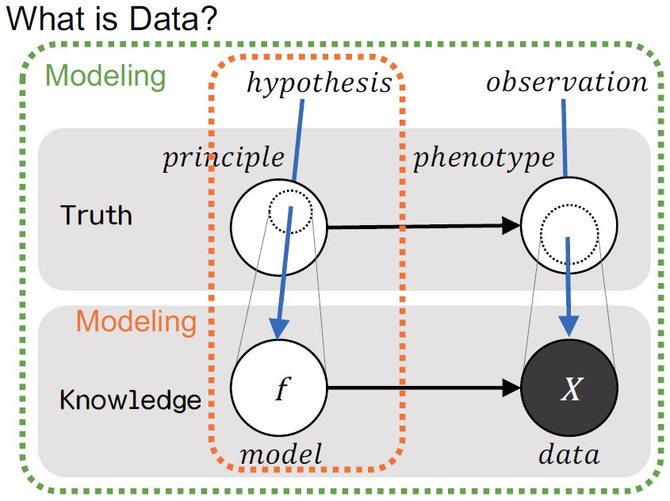
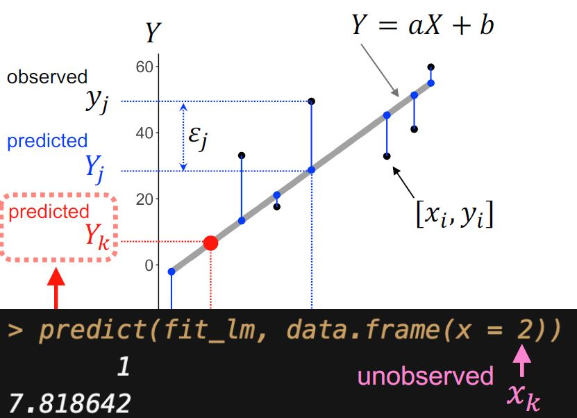

In the last part of the talk he covered nested data modelling. By using
`group_by()` and `nest()` we can create a data frame that has one row
per group (for example, a row for **each** species group in the iris
data set) with has a new column called `data` which is itself a data
frame. Now, instead of having to repeat the modelling code over and over
again for each subset of rows (a model for **each** species in the iris
data set), by using the `purrr::map_*()` family of functions you can
apply your model to each of the groups that you specified earlier.

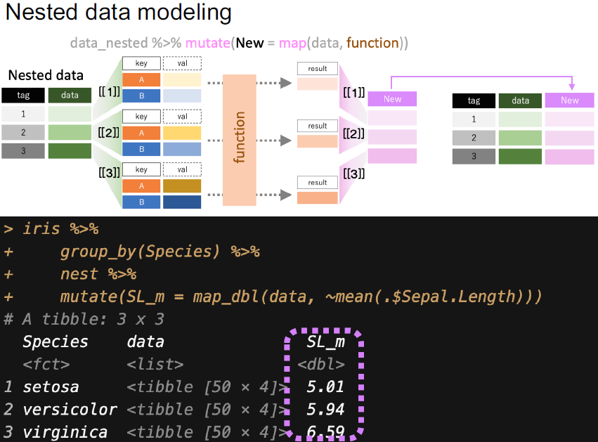
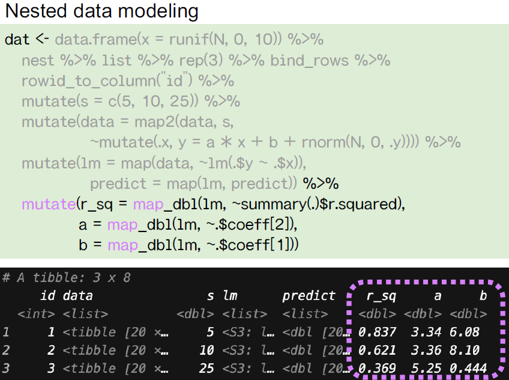

Filled with great explanatory graphics, plots, and code the slides are a
good example of teaching the basics of modelling with R.

Some other resources about modelling with R:

-   [Model buidling chapter in R for Data Science - Hadley
    Wickham](https://r4ds.had.co.nz/model-building.html)
-   [Picking the best model with caret - Rachael
    Tatman](https://www.kaggle.com/rtatman/picking-the-best-model-with-caret/)
-   [Introduction to Statistical Learning - Gareth James, Daniela
    Witten, Trevor Hastie, & Rob
    Tibshirani](http://www-bcf.usc.edu/~gareth/ISL/)
-   [Applied Predictive Modeling - Max Kuhn & Kjell
    Johnson](http://appliedpredictivemodeling.com/)

[aad34210](https://twitter.com/aad34210/): Become a useR with R Studio
----------------------------------------------------------------------

-   [Slides](https://www.slideshare.net/aad34210/rstudiorr-for-beginner-using-rstudio)

Another TokyoR organizer, `@aad34210`, talked about using the R Studio
IDE to maximize R’s strengths for programming and data analysis. After a
brief spiel on the early days of using R solely from the console he
talked about R Studio’s capabilities and the various options that can be
customized to suit your R needs. From installing R Studio, configuring
the four main panes, using R Projects, and using `Global options`,
`@aad34210` opened up his own R Studio window and pointed out the various
menu options in thorough detail to help beginneRs navigate without
getting overwhelmed. He rounded off the talk by showing the various
Cheat sheets (included one for R Studio itself) that can be obtained
from the `Help` tab.

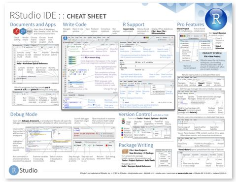

Some other resources one might consider to learn R Studio are:

-   [Introduction to RStudio - Software
    Carpentry](https://swcarpentry.github.io/r-novice-inflammation/09-supp-intro-rstudio/index.html)
-   [RStudio Essentials - RStudio](https://resources.rstudio.com/)
-   [RStudio IDE Cheat Sheet (shown above) -
    RStudio](https://github.com/rstudio/cheatsheets/raw/master/rstudio-ide.pdf)

[u\_ribo](https://twitter.com/u_ribo): Version Control and Project Management with R
------------------------------------------------------------------------------------

-   [Slides](https://speakerdeck.com/s_uryu/rstudio-for-team)

`@u_ribo` gave a talk about the benefits of creating a reproducible and
enclosed R environment using git and Docker. As an instructor who has
ran many R workshops, `@u_ribo` has ran into the problem of his learners
all having different OSs, versions of packages, and versions of R itself
causing much headache for all involved. This is also the case when
working in a team environment where analyses need to be shared and
reproducibility of results is essential.

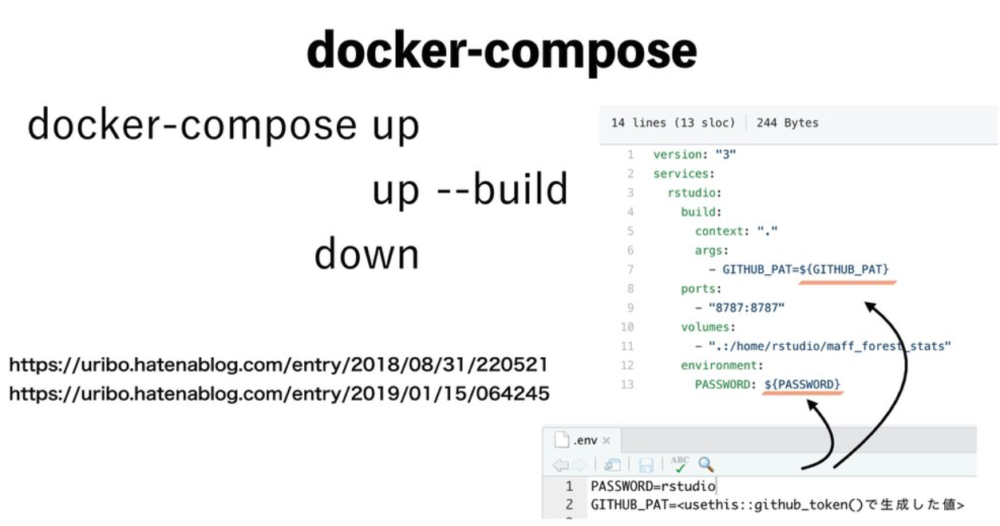

To reduce these problems he gave a live-demo using a variety of R tools
such as the `here` package, the `usethis` package, and managing a
project environment with R Studio Projects (`.Rproj`). To go further in
depth he also talked about using git (made very easy with its seamless
integration with R Studio) and the use of Docker. To run Docker you
need an Docker “image” and a Docker “container”. An image is a file,
called a `Dockerfile`, that has the information about and configures the
Operating System for the environment. The container is the the actual
running instance of the “image” that is defined by the Docker file.
Going back to the issue of running a workshop, using Docker allows all
of the participants to run R inside a specific container, an enclosed environment
set up by the instructor, so that all the different dependencies and
version differences won’t prevent you from running the code provided in
the workshop.

Other good introductions to Docker and R:

-   [Docker, R, And Reproducibility - Colin
    Fay](https://colinfay.me/docker-r-reproducibility/)
-   [R Docker Tutorial - rOpenSci
    Labs](https://ropenscilabs.github.io/r-docker-tutorial/)
-   [Docker and Packrat - Joel
    Nitta](https://www.joelnitta.com/post/docker-and-packrat/)

[niszet](https://twitter.com/niszet0/): Reproducible Reports with R Markdown
----------------------------------------------------------------------------

-   [Slides](https://speakerdeck.com/niszet/r-markdownwoshi-tutazai-xian-de-repoteingu)

`@niszet` talked about reproducible reporting with R Markdown. He was
certainly the right person to give a talk on this topic as he is the
author of the mini-books, “Create a Word document with R Markdown” and
“Create a PowerPoint presentation with R Markdown”. To begin, he talked
about cases where one writes a document, report, or any kind of output
and how it might be a good idea to be able to create it again for
“future me” or anybody else that might want to take a look. Normally,
you would run into problems such as “where did my data go?”, “how did I
pre-process my data?”, "" but you can mitigate these problems by using R
Markdown reports. Whether it’s importing your raw data, the
pre-processing/modelling/viz code, to the actual report and
documentation write-up R Markdown renders the document in a completely
clean environment each time so the results should be the same, every
time! As noted in the beginning, you can create many different kinds of
output such as Word document, PowerPoint presentation, html document,
presentation slides, and more - even business cards (with the pagedown
package)! Following an explanation of what you can do with R Markdown,
`@niszet` talked about **how** exactly one would use it to its best
capabilities. In a live-demo he took us through all the different
components of an R Markdown document:

-   YAML header: Where one defines the “how” of the RMD such as the
    title, template, output directory, output type, etc.
-   Code chunk and options: Where all your code (can be languages
    besides R) that you want to be run should be located. Chunk options such as
    whether to evaluate the code within, toggle showing the code, and
    many more are also specified here.
-   Markdown text: Regular text using markdown. Can also include inline
    code using \`\`.
-   Various buttons/shortcut keys: Such as `Ctrl + Shift + K` to Knit!

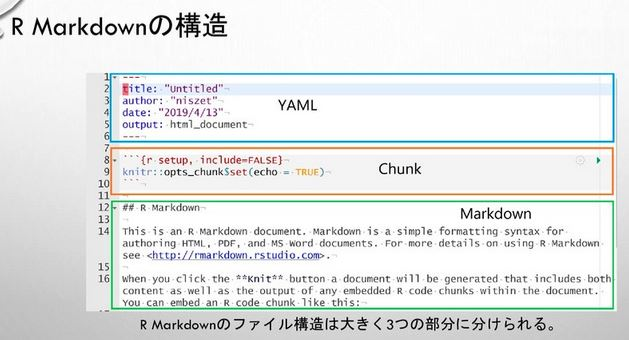

Some other intros to R Markdown:

-   [R Markdown: The Definitive Guide - Yihui Xie, JJ Allaire, Garrett
    Grolemund](https://bookdown.org/yihui/rmarkdown/)
-   [R Markdown Cheat Sheet -
    RStudio](https://github.com/rstudio/cheatsheets/raw/master/rmarkdown-2.0.pdf)
-   [R Markdown 入門 - Kazuhiro Maeda (in
    Japanese)](https://kazutan.github.io/kazutanR/Rmd_intro.html)

LTs
===

[GotaMorishita](https://twitter.com/GotaMorishita): Finding a New Place to Live with R
--------------------------------------------------------------------------------------

-   [Slides](https://speakerdeck.com/morishita/rdeomai-ide-wu-jian-wotan-se)

It’s only been 3 (three!) days since `@GotaMorishita` started learning R
yet here he was giving a LT on finding a new place to live in Tokyo
using R! Tired of living with his parents `@GotaMorishita` decided to
live by himself and started thinking about ways to use R and machine
learning to search for a place with an optimal price and location. After
web-scraping a housing website and pre-processing the data he came
across a problem: if he split the data into a training and test set for
selecting the best predictive model then he would be throwing away a
considerable amount of possible candidates for housing.

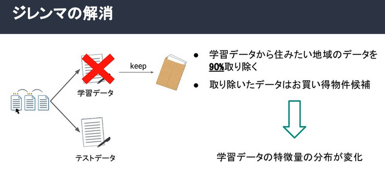

If `@GotaMorishita` took out 90% of the houses/apartments from the
training data and kept those as candidates for the test data, it would've meant
that the training data will have a markedly different distribution
compared to the test data set and the model created from the training
set wouldn’t be as accurate. This problem, called co-variate shifting, is when the training data and
test data have different distributions but the conditional distribution
of the output values given the input data is unchanged. Using standard
methods of model selection such as cross-validation or AIC in this
situation would lead to biasedness. However, this problem can be mitigated by
weighting the loss function by importance (the ratio of training and
test input densities). You can find a more detailed description in the
research papers below. `@GotaMorishita` used `xgboost` to implement his
models, one with importance weighting and another without, and used
group-wise cross-validation to tune the hyperparameters. The results are
shown below, comparing the overall test scores for all Tokyo districts
(left) and just the Sangenjaya district (right), the RMSE was smaller
when Importance Weighting was used.

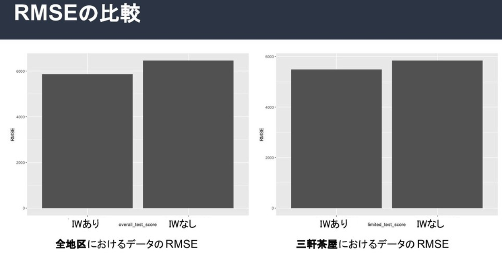

Some more info on co-variate shifting and importance weighting:

-   [Sugiyama, M., Krauledat, M., & Mueller, K. R. (2007). Covariate
    shift adaptation by importance weighted cross validation. Journal of
    Machine Learning Research, 8(May),
    985-1005](https://www.jmlr.org/papers/volume8/sugiyama07a/sugiyama07a.pdf)
-   [Sugiyama, M. (2012). Learning under non-stationarity: Covariate
    shift adaptation by importance weighting. In Handbook of
    Computational Statistics (pp. 927-952). Springer, Berlin,
    Heidelberg.](https://pdfs.semanticscholar.org/1629/eecfcfe6760ccb9081b39961a2517b06ec9c.pdf)

[sk\_bono36](https://twitter.com/sk_bono36): Creating Marketing Personas with R and rtweet
------------------------------------------------------------------------------------------

-   [Slides](https://www.slideshare.net/shinjikikuchi2/1904-r-twitter-140696864)

`@sk_bono36` gave a presentation on using R for marketing purposes with
the `rtweet` package. In marketing there is a concept called a “persona”,
which is a blueprint of what a certain type of person in your target
audience for your product/service is like. A basic persona template
can consist of their name, job title, demographic details, values, and
hobbies. You create these ideal customers through careful market
research involving both social media analytics and
interviewing/surveying the customers themselves. `@sk_bono36` focused on
creating a `persona` (with “自転車/Bicycle” as the keyword for this case
study) by using `rtweet` then running Japanese text analysis with
`RMeCab`. Visualizing the data with word clouds and network graphs of
bi-grams he was able to find a lot of information on Twitter users who
have “bicycle” on their profile or tweets and extract the common
characteristics of this type of person.

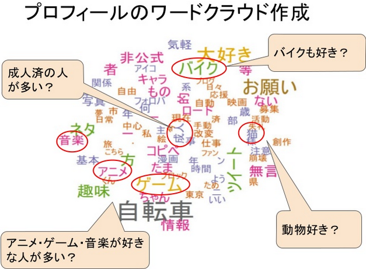

As a result of his analysis `@sk_bono36` was able to create a persona of
people who like bicycles:

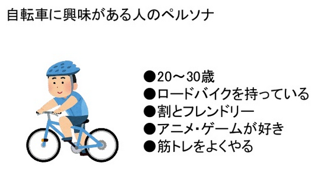

-   20\~30 Years Old
-   Owns a road bike
-   Friendly disposition
-   Likes Anime/video games
-   Does weight lifting

Some other intros to the `rtweet` package:

-   [rtweet workshop - Mike Kearney (author of
    rtweet)](https://rtweet-workshop.mikewk.com/)
-   [21 Recipes for Mining Twitter Data with rtweet - Bob
    Rudis](https://rud.is/books/21-recipes/)

[igjit](https://twitter.com/igjit): Create a type-checker package for R
-----------------------------------------------------------------------

-   [Slides](https://igjit.github.io/slides/2019/04/typrr/#/)

`@igjit`, who also presented at
[Japan.R](https://japanr.connpass.com/event/105802/) back in December on
[building an R compiler with
R](https://ryo-n7.github.io/2018-12-06-japanr-conference-roundup-blog-post/),
gave a talk about another recent project of his which is a package that
acts as a type checking system for R. A problem that he finds in R is
that errors relating to having the wrong data type in the arguments of R
functions are only found when code is executed, not before. Frustrated
by this `@igjit` created his own package called
[typrr](https://github.com/igjit/typrr) that type checks your code! The
underlying checker that `typrr` runs is
[Flycheck](https://www.flycheck.org/en/latest/) which is a syntax
checking extension for Emacs.

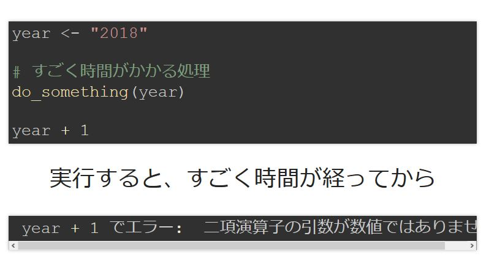

For now, the package only checks for the basic data types found in R,
integer, double, logical, and character and it can only check functions
with one argument only. He rounded off the talk by saying that he
created this package just for fun and he advised all the beginneRs in
the audience that people learn from **doing** rather than just
**reading** so to truly get better it’s best to go out and experiment!

Other Talks
===========

-   [ao053934144](): [R in the Healthcare Industry]()
-   [hana\_orin](https://twitter.com/hana_orin): [Using Hierarchical
    Linear Modeling to predict housing prices](https://note.mu/hanaori/n/na2e41f1d3b49)
-   [AsaKiriSun](https://twitter.com/AsaKiriSun): [Predicting sample
    size from Rbinom(n=10, size,
    prob)](https://www.slideshare.net/toirenomitorizudesu/rbinomn10-size-probsizeprobsize)

Food, Drinks, and Conclusion
============================

Following all of the talks, those who were staying for the after-party
were served sushi and drinks! With a loud rendition of “kampai!”
(cheers!) R users from all over Tokyo began to talk about their
successes and struggles with R. A fun tradition at `TokyoR` is a
**Rock-Paper-Scissors** tournament with the prize being __free__ data
science books (I still haven't won any nor even gotten close to the last rounds)!

The prizes for this month were:

-   A couple copies of “Create a Word document with R Markdown”
    mini-book by [niszet](https://twitter.com/niszet0/).
-   3 copies of the Japanese translation (by [Hoxo-m
    Inc.](https://hoxo-m.com/)) of “Feature Engineering for Machine
    Learning” by Alice Zheng and Amanda Casari provided by
    [uribo](https://twitter.com/u_ribo).

`TokyoR` happens almost monthly and it’s a great way to mingle with
Japanese R users as it’s the largest regular meetup here in Japan. Talks
in English are also welcome so if you’re ever in Tokyo come join us!
