This blog post will provide an intro to {tvthemes} as well as some
lessons learned (codecov, Github badges, creating a hexsticker,
`usethis::use_*()`, unit testing for `ggplot2`, etc.) and the future
direction of the package. What kick-started this idea was my [blog
post](https://ryo-n7.github.io/2019-02-15-visualize-brooklyn-nine-nine/)
looking at simple TV stats on my current favorite TV show, Brooklyn
Nine-Nine. I got a lot of good feedback on the colors I used for the
custom `ggplot2` theme and color palettes so I decided to expand it to
other shows that I love!

Suggestions and Pull Requests for palettes/themes are welcome, you can
find the Github repo for the package
[HERE](https://github.com/Ryo-N7/tvthemes)!

``` r
pacman::p_load(ggplot2, dplyr, tvthemes, extrafont, 
               glue, gapminder, emo, patchwork, cowplot)
loadfonts()
```

Current list of TV shows
------------------------

-   **Avatar: The Last Airbender**: theme + palettes (Fire Nation, Water
    Tribe, Earth Kingdom, & Air Nomads)
-   **Brooklyn Nine-Nine**: theme + palettes (regular & dark)
-   **Game of Thrones/A Song of Ice & Fire**: ‘The Palettes of Ice &
    Fire’ (currently: Stark, Lannister, Tully, Targaryen, Greyjoy, &
    Tyrell)
-   **Rick & Morty**: theme + palette
-   **Parks & Recreation**: two themes (light & dark) + palette
-   **The Simpsons**: theme + palette
-   **Spongebob Squarepants**: theme + palette + background images
-   *More in future releases…*

Installation
------------

`tvthemes` is currently available only on Github, you can install it by:

``` r
## install.packages(devtools)
devtools::install_github("Ryo-N7/tvthemes")
```

I hope to have a CRAN version soon!

Fonts
-----

The difficulty with a lot of the fonts used by TV shows in their logos
and other marketing media is that they are made by font foundries and
can be rather expensive (for a regular person like you or me) to
purchase. So I endeavored to find **free** fonts to use that were
somewhat similar to the real ones used by the shows from resources like
`Google Fonts`. In the documentation you can find the **actual** fonts
used by the TV shows if you are so inclined to buy them (some are just
my best guesses though)! In some cases there were fan-made fonts such as
“Some Time Later” for Spongebob or “Akbar” for The Simpsons that I
included with the package.

Instead of dealing with `extrafont` yourself, I re-purposed the
`import_*()` functions from the `hrbrthemes` package so you can import
the included fonts very easily. Do note that you still might need to
install the fonts directly on your computer from the `.ttf` files found
in `tvthemes/inst/fonts`. When you’re done running the functions and
installing the `.ttf` files on your computer, load the `extrafont`
library and then run `loadfonts()`. If you’re having problems check out
the documentation on `extrafont`’s [Github
repo](https://github.com/wch/extrafont) or on
[CRAN](https://cran.r-project.org/web/packages/extrafont/index.html).

The help files for each function tells you the recommended font names in
case you forget!

``` r
import_simpsons()         ## "Akbar" font
import_theLastAirbender() ## "Slayer" font
import_rickAndMorty()     ## "Get Schwifty" font
import_roboto_condensed() ## "Roboto Condensed" Google Font import from hrbrthemes
import_titillium_web()    ## "Titillium Web" Google Font import from hrbrthemes
import_spongeBob()        ## "Some Time Later" font
import_cinzel()           ## "Cinzel" font to use with 'The Palettes of Ice & Fire'

## install.packages("extrafont")
library(extrafont)
loadfonts() ## You need to do this at the beginning of a session.
```

Colors
------

I gathered the colors/hex codes by looking at images online or
re-watching some old episodes and then using various hex code websites
and hex code extraction websites. Most of the color palettes were pretty
straightforward as the characters or certain elements of the TV shows
naturally provided some kind of differentiation by color. The colors in
some of these palettes may still change from feedback and further
experimentation.

You can check out all the colors for each palette by running
`scales::show_col(tvthemes:::name_of_palette)`. Some examples below:

``` r
scales::show_col(tvthemes:::rickAndMorty_palette)
```

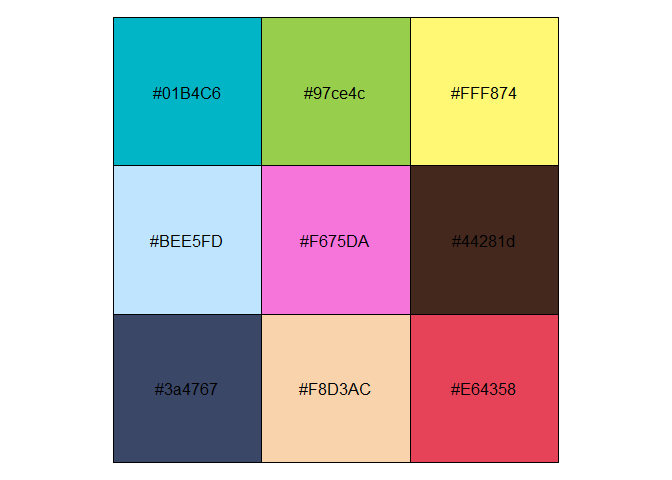

``` r
scales::show_col(tvthemes:::lannister_palette)
```

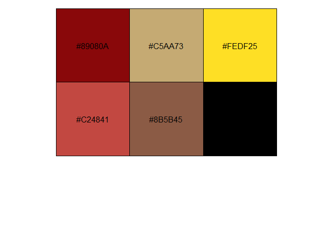

``` r
scales::show_col(tvthemes:::simpsons_palette)
```

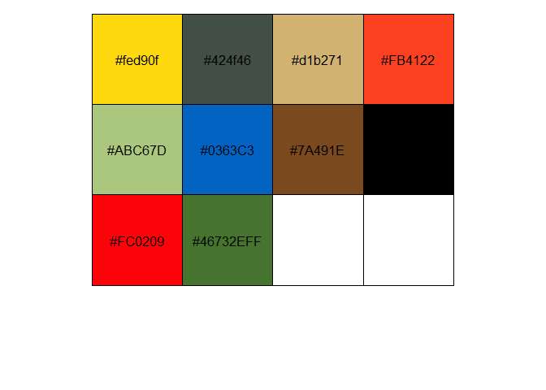

Example Plots
-------------

### Brooklyn Nine-Nine

For the most part this theme and palette are unchanged from the original
blog post. I just added a few more colors to both the normal palette
(shown below) and the dark palette.

``` r
mpg %>% 
  ggplot(aes(displ)) +
  geom_histogram(aes(fill = class), 
                 col = "black", size = 0.1,
                 binwidth = 0.1) +
  scale_fill_brooklyn99() +
  labs(title = "Do you know what it means to 'clap back', Raymond?",
       subtitle = glue::glue("BE- {emo::ji('clap')} -CAUSE {emo::ji('clap')} I {emo::ji('clap')} DO {emo::ji('clap')} !"),
       caption = "Pizza bagels? Pizza rolls? Pizza poppers? Pizzaritos? Pizza pockets?") +
  theme_brooklyn99(title.font = "Titillium Web",
                   text.font = "Calibri Light",
                   subtitle.size = 14)
```

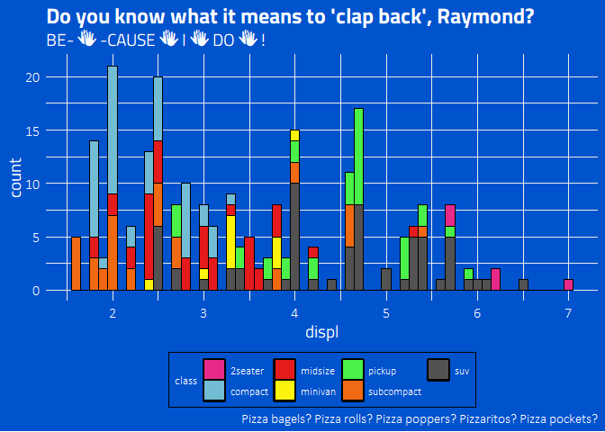

### Spongebob Squarepants

I had a lot of fun with this one. The colors are taken from the
characters and their clothes while I was able to find a fan-made font
that looks similar to the one used in the transition slides of the show.

``` r
bobspog_plot <- mpg %>% 
  ggplot(aes(displ)) +
  geom_histogram(aes(fill = class), col = "black", size = 0.1) +
  scale_fill_spongeBob() +
  labs(title = "F is for Fire that burns down the whole town!",
       subtitle = "U is for Uranium... bombs! N is for No survivors when you're-",
       caption = "Plankton, those things aren't what fun is about!") +
  theme_spongeBob(title.font = "Some Time Later",
                  text.font = "Some Time Later",
                  title.size = 22,
                  subtitle.size = 16,
                  axis.title.size = 16,
                  axis.text.size = 14,
                  legend.title.size = 14)

bobspog_plot
```

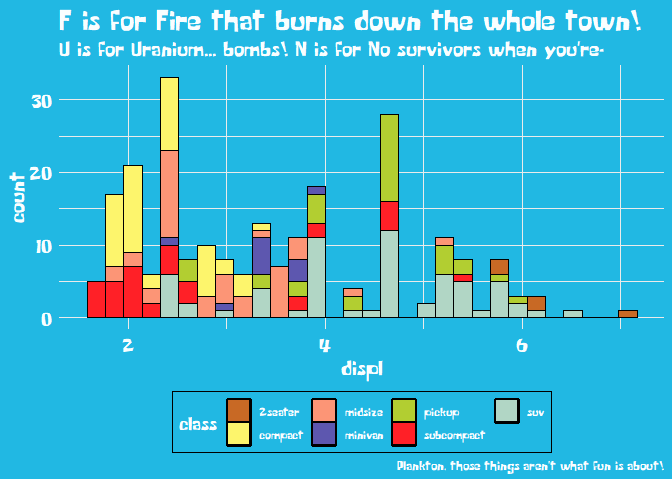

In addition I was inspired by `ggpomological::paint_pomological()` and
created a similar function that allows you to place your plot on top of
a Spongebob-themed background.

``` r
paintBikiniBottom(plot = bobspog_plot,
                  background = "background") ## or "floral"
```

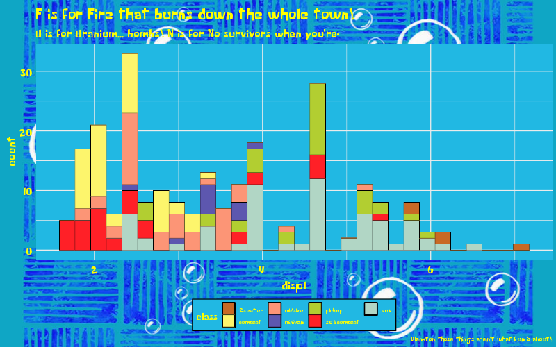

### The Simpsons

Pretty simple one to do and I’m sure many of you have seen other
Simpsons related color palettes around the internet. The blue background
and yellow title font for the theme was inspired by [Nathan
Cunningham’s](https://twitter.com/nathcun) cool blog posts on The
Simpsons like this one
[here](http://www.nathancunn.com/2017-07-16-simpsons-characters/).

``` r
data <- gapminder::gapminder %>% 
  filter(country %in% c("France", "Germany", "Ireland", "Italy", "Japan", "Norway", "Belarus")) %>% 
  mutate(year = as.Date(paste(year, "-01-01", sep = "", format='%Y-%b-%d')))

ggplot(data = data, aes(x = year, y = gdpPercap, fill = country)) +
  geom_area(alpha = 0.8) +
  scale_x_date(breaks = data$year, date_labels = "%Y") +
  scale_y_continuous(expand = c(0, 0), labels = scales::dollar) +
  scale_fill_simpsons() +
  labs(title = "The Simpsons",
       caption = glue::glue("
                      A 'Bake 'em Away, Toys!' Production"),
       x = "Wel-diddly-elcome neighborino!",
       y = "Price of Duff Beer") +
  theme_simpsons(title.font = "Akbar",
                 text.font = "Akbar",
                 axis.text.size = 8)
```

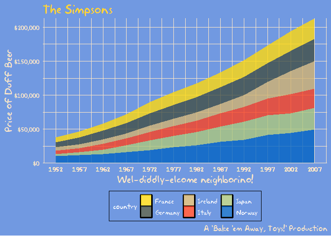

### Rick and Morty

The colors from the show make for a pretty good discrete color palette
while the font is a fan-made creation that tries to emulate co-creator
Justin Roiland’s handwriting that was used on the show.

``` r
ggplot(diamonds, aes(price, fill = cut)) +
  geom_histogram(binwidth = 500) +
  scale_fill_rickAndMorty() +
  labs(title = "Dammit Morty, You Know Diamonds Aren't Forever Right?",
       subtitle = "They're blood diamonds, Morty **burp**",
       caption = "Wubbalubbadubdub!") +
  theme_rickAndMorty(title.font = "Get Schwifty",
                     text.font = "Get Schwifty",
                     title.size = 14)
```

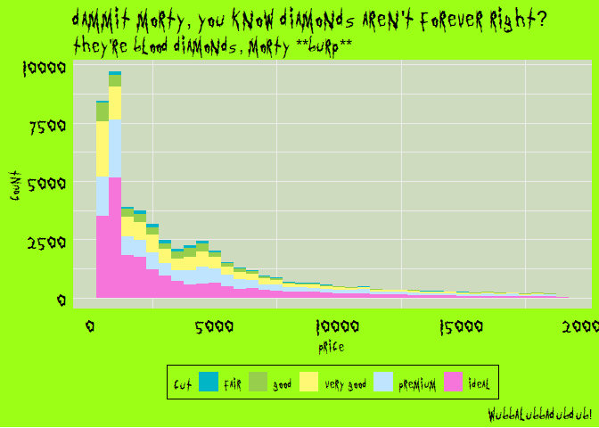

### Game of Thrones: Houses Stark, Lannister, Targaryen

As a fan of the books and medieval heraldry looking around for
inspiration for the Great Houses of Westeros was quite fun. I hope to
add others in the future (Martell, Arryn), even smaller houses if they have a great color
scheme, like House Bolton, Dayne, Flint (Widow’s Watch), etc.

``` r
mpg %>% 
  ggplot(aes(displ)) +
  geom_histogram(aes(fill = class), col = "black", size = 0.1) +
  labs(title = "The winters are hard, but the Starks will endure.",
       subtitle = "We always have...",
       caption = "Winter Is Coming...") +
  scale_y_continuous(expand = c(0,0)) +
  scale_x_continuous(expand = c(0,0)) +
  scale_fill_stark() +
  theme_minimal() +
  theme(text = element_text(family = "Cinzel", size = 14)) -> stark

colstully <- tully_pal()(5)

ggplot(diamonds, aes(price, fill = cut)) +
  geom_histogram(binwidth = 500) +
  scale_fill_manual(values = rev(colstully)) +
  #scale_fill_tully() +
  labs(title = "I've seen wet shits I like better than Walder Frey.",
       subtitle = "Pardon my lord, my lady. I need to find a tree to piss on.",
       caption = "- The Blackfish") +
  theme_minimal() +
  theme(text = element_text(family = "Cinzel", size = 10),
        title = element_text(family = "Cinzel", size = 14)) -> tully

ggplot(gapminder::gapminder, aes(x = log10(gdpPercap), y = lifeExp)) +
  geom_point(aes(color = continent)) + 
  scale_x_log10() +
  scale_color_targaryen() +
  labs(title = "I am the blood of the dragon. I must be strong.",
       subtitle = "I must have fire in my eyes when I face them, not tears.",
       caption = "- Fire & Blood.") +
  theme_minimal() +
  theme(text = element_text(family = "Cinzel", size = 10),
        title = element_text(family = "Cinzel", size = 14)) -> targaryen

## patchwork together:
stark + tully - targaryen + plot_layout(ncol = 1)
```

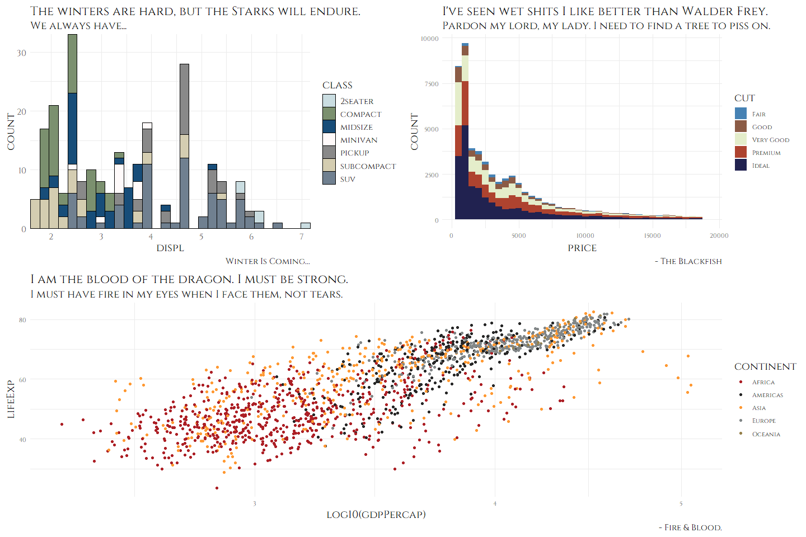

### Game of Thrones: Houses Tyrell, Tully, Greyjoy

``` r
data <- gapminder::gapminder %>% 
  filter(country %in% c("France", "Germany", "Ireland", "Italy", "Japan", "Norway", "Belarus")) %>% 
  mutate(year = as.Date(paste(year, "-01-01", sep = "", format='%Y-%b-%d')))

ggplot(data = data, aes(x = year, y = gdpPercap, fill = country)) +
  geom_area(alpha = 0.8) +
  scale_x_date(breaks = data$year, date_labels = "%Y") +
  scale_y_continuous(expand = c(0, 0), labels = scales::dollar) +
  scale_fill_tyrell() +
  labs(title = "All men are fools, if truth be told, but",
       subtitle = "the ones in motley are more amusing than ones with crowns.",
       caption = "- The Queen of Thorns") +
  theme_minimal() +
  theme(text = element_text(family = "Cinzel", size = 10),
        plot.title = element_text(family = "Cinzel", size = 16),
        plot.subtitle = element_text(family = "Cinzel", size = 12)) -> tyrell

cols <- lannister_pal()(5)

ggplot(diamonds, aes(price, fill = cut)) +
  geom_histogram(binwidth = 500) +
  labs(title = "You are done with whores.",
       subtitle = "The next one I find in your bed, I'll hang.",
       caption = "Rains of Castamere") +
  scale_fill_manual(values = rev(cols)) +
  #scale_fill_lannister() +
  theme_minimal() +
  theme(text = element_text(family = "Cinzel", size = 14)) -> lannister

airquality %>% 
  mutate(Month = as.factor(Month)) %>% 
  ggplot(aes(x = Day, y = Temp, group = Month, color = Month)) +
  geom_line(size = 1.5) +
  scale_color_greyjoy() +
  labs(title = "I am the storm, my lord.",
       subtitle = "The first storm, and the last.",
       caption = "- Euron 'The Crow's Eye' Greyjoy") +
  theme_minimal() +
  theme(text = element_text(family = "Cinzel", size = 10),
        title = element_text(family = "Cinzel", size = 14)) -> greyjoy

## patchwork together:
tyrell + lannister - greyjoy + plot_layout(ncol = 1)
```

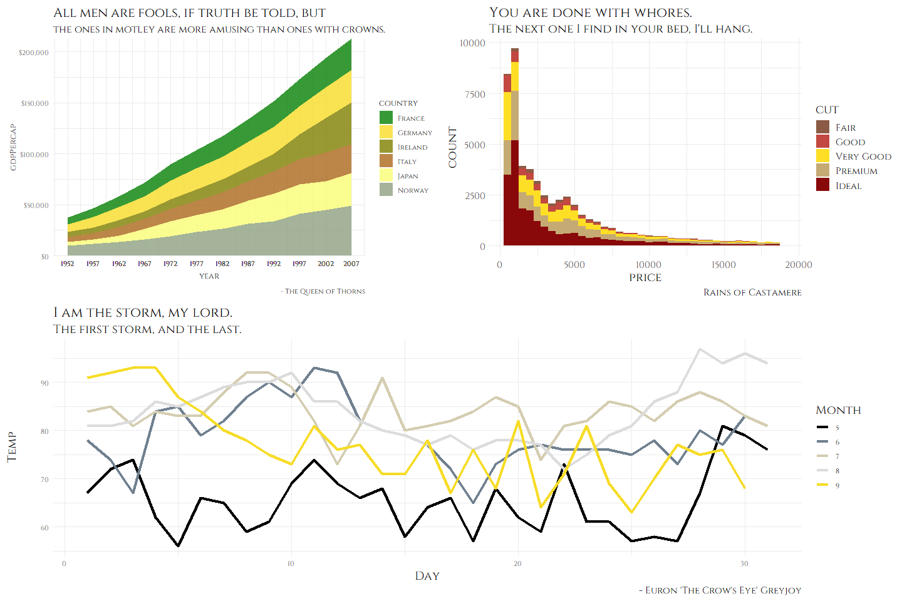

### Avatar: The Last Airbender

With four very distinct nations (each based on a certain natural
element) in the Avatar universe it was very easy to come up with color
palettes.

``` r
mpg %>% 
  ggplot(aes(displ)) +
  geom_histogram(aes(fill = class), col = "black", size = 0.1) +
  scale_fill_fireNation() +
  labs(title = "Flameo, Hotman!",
       subtitle = "Fire. Wang Fire. This is my wife, Sapphire.",
       x = "Lion Vultures Owned",
       y = "Agni Kai Participation") +
  theme_theLastAirbender(title.font = "Slayer",
                         text.font = "Slayer") -> firenation

airquality %>% 
  mutate(Month = as.factor(Month)) %>% 
  ggplot(aes(x = Day, y = Temp, group = Month, color = Month)) +
  geom_line(size = 1.5) +
  scale_color_airNomads() +
  labs(title = "Let's head to the Eastern Air Temple!",
       subtitle = "Appa, Yip Yip!") +
  theme_theLastAirbender(title.font = "Slayer",
                         text.font = "Slayer",
                         title.size = 10) -> airnomads

ggplot(gapminder::gapminder, aes(x = log10(gdpPercap), y = lifeExp)) +
  geom_point(aes(color = continent)) + 
  scale_x_log10() +
  scale_color_waterTribe() +
  labs(title = "I am thinking maybe we could... do an activity together?",
       subtitle = "... Do an activity?",
       x = "GDP per Otter-Penguins",
       y = "Life Expectancy of Arctic Camels") +
  theme_theLastAirbender(title.font = "Slayer",
                         text.font = "Slayer",
                         title.size = 8,
                         subtitle.size = 8) -> watertribe

mpg %>% 
  ggplot(aes(displ)) +
  geom_histogram(aes(fill = class), col = "black", size = 0.1) +
  scale_fill_earthKingdom() +
  labs(title = "There is no war in Ba Sing Se",
       subtitle = "(Welcome to Lake Laogai)") +
  theme_theLastAirbender(title.font = "Slayer",
                         text.font = "Slayer",
                         title.size = 14) -> earthkingdom

## plot together:
plot_grid(firenation, airnomads, watertribe, earthkingdom, ncol = 2)
```

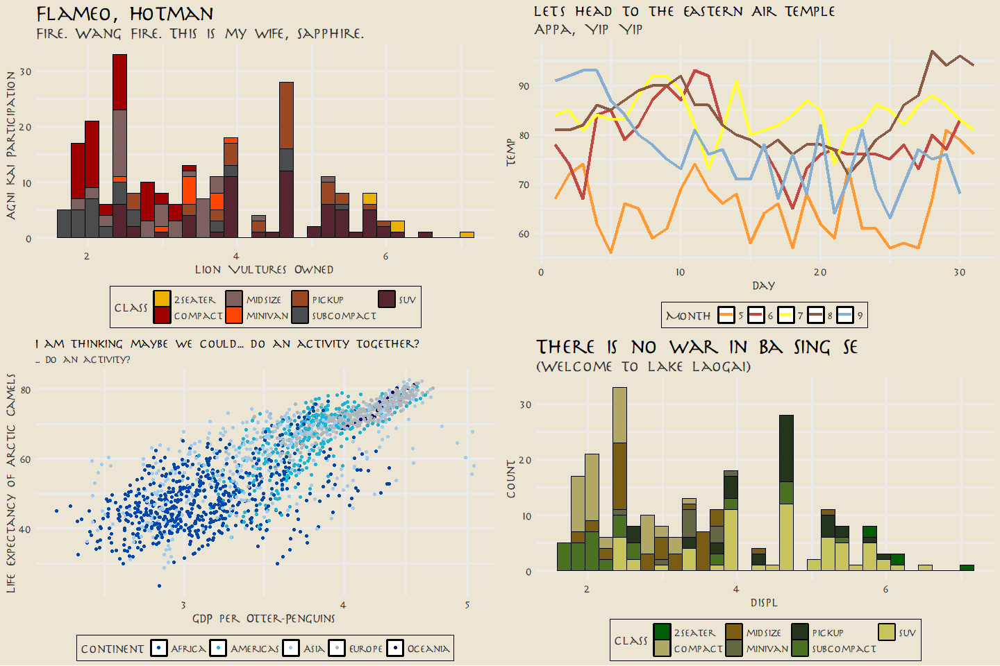

### Parks and Recreation

This is probably a more literal interpretation of “Parks and Recreation”
rather than any of the colors in the palette/theme representing the
characters. This one was the one I took the most liberties with and just
tried to use colors that felt very outdoorsy and “Parks”-like. The font
used with this theme, “Titillium Web” is similar to the typeface used in
the logo of “Parks and Rec”, “Champion HTF-Heavyweight”.

``` r
airquality %>% 
  mutate(Month = as.factor(Month)) %>% 
  ggplot(aes(x = Day, y = Temp, group = Month, color = Month)) +
  geom_point(size = 2.5) +
  labs(title = "Calzones are pointless.", subtitle = "They're just pizza that's harder to eat!",
       caption = "No one likes them. Good day, sir.") + 
  scale_color_parksAndRec() + 
  theme_minimal() +
  theme_parksAndRec(text.font = "Titillium Web",
                    title.font = "Titillium Web Black",
                    legend.font = "Titillium Web") -> parksandrec

mpg %>% 
  ggplot(aes(displ)) +
  geom_histogram(aes(fill = class), col = "black", size = 0.1) +
  labs(title = "Parks & Recreation",
       subtitle = "Gotta Spend Money To Make Money!",
       caption = "And I spent... all of my money!") +
  scale_fill_parksAndRec() + 
  theme_minimal() +
  theme_parksAndRec_light(title.font = "Titillium Web Black",
                    text.font = "Titillium Web") -> parksandreclight

## plot together:
plot_grid(parksandrec, parksandreclight, ncol = 2)
```

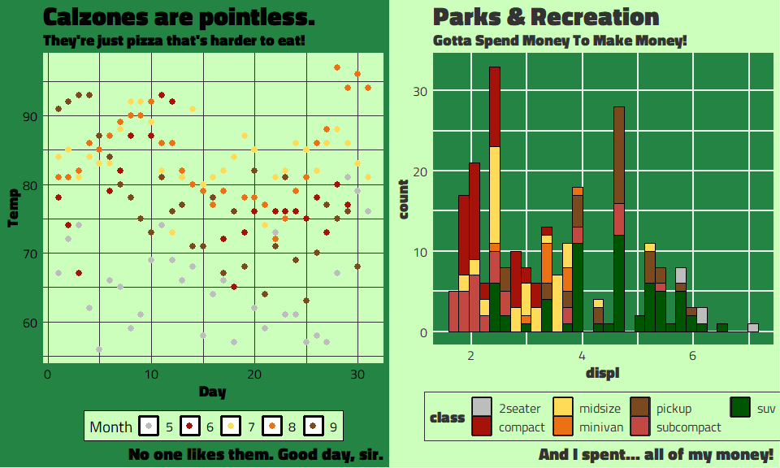

Lessons Learned & Future Steps
------------------------------

Although this package is mainly just for fun, I still learned quite a
lot from the experience. I was able to get more practice with `usethis`
and `devtools` for package development. Instead of manually creating
package files, be it the DESCRIPTION, R scripts, license, etc. the
`usethis::use_*()` set of functions creates them for you automatically
along with the correct directories and when relevant adds them to
`.gitignore` or makes a note of any changes in other relevant files.
Below is an example of a really nifty `usethis` function that creates a
unit test to run a spell check on all your documentation!

<center>

</center>

A lot of the best packages I’ve seen have always had the cool and
informative badges at the top of the README. The “Lifecycle” badges
described in detail [here](https://www.tidyverse.org/lifecycle/) are
pretty straightforward, it gives the viewer an idea of what stage of
development the R package is in. The other badges I have on `tvthemes`
are the ones for the license (GPL v3) and for codecov. I just used
`usethis::use_badge()` but there are alternative ways to produce the
badges such as the [badger](https://github.com/GuangchuangYu/badger)
package by Guangchuang Yu.

On the topic of testing, I create a lot of unit tests for the R packages
that I help maintain at the NGO I work for but until `tvthemes` I had
never created tests for `ggplot2` themes and palette objects before.
After looking around at other theme/palette packages such as
[vapoRwave](https://github.com/moldach/vapoRwave),
[hrbrthemes](https://github.com/hrbrmstr/hrbrthemes), and
[ggpomological](https://github.com/gadenbuie/ggpomological) I was able
to get a sense for what to test for such as:

``` r
test_that("theme_brooklyn99 works", {
  thm <- theme_brooklyn99()
  expect_s3_class(thm, "theme")
  expect_equal(thm$text$family, "")
})

test_that("brooklyn99_pal raises warning with number greater than colors available, x > 10", {
  expect_warning(brooklyn99_pal()(11))
})
```

In addition, I used [codecov](https://codecov.io/) to see the exact
percentage of my code that my tests covers.

<center>

</center>

Although all of the actual theme or palette functions are “covered” I
could still add more depth to them. Currently I only have a test that
checks for one component of the theme, the font family, but I should
expand this to include other key components of the particular theme I’m
testing for. For example, the exact color of the `panel.background` for
`theme_spongBob()` or the correct default size of the title. I also need
to figure out how to write tests for the `import_*()` functions and the
add-background-to-plot `paintBikiniBottom()` function!

The next thing I want to try out is to use the
[vdiffr](https://github.com/r-lib/vdiffr) package to test the outputted
plots themselves. From the README the steps are as follows:

1.  Add expectations to by including `expect_doppelganger()` in your
    test files.

2.  Run `manage_cases()` to generate the plots which vdiffr will test
    against in the future. This will launch a shiny gadget which will
    ask you to confirm that each plot is correct.

3.  Run `devtools::test()` to execute the tests as normal.

This can be extremely useful for `tvthemes` to check whether the
individual themes and palettes are being applied properly whenever I
make some changes in the code!

Last, but certainly not least, was the hex sticker for my package.
Originally I wanted to use a character from one of the TV shows in the
logo but in the end I went with something that wasn’t copyrighted. Also,
I didn’t really have the photoshop skills to make it work! What I ended
up choosing was using the popular Japanese site,
[irasutoya](https://www.irasutoya.com/), which provides thousands of
drawings for free use. It’s a great website that provides drawings for
any object, person, and situation! After finding the best image (a child
watching cartoons and sitting too close to the TV), I used the
`hexSticker` package by Guangchuang Yu to create it in R:

``` r
## Download image:
download.file("https://3.bp.blogspot.com/-kHda-2huAF8/WUdZKshMQkI/AAAAAAABFDM/sXt-PT9dKtYp2Y0Y_OV64TJzs7PvOLZmgCLcBGAs/s800/tv_boy_chikaku.png",
              destfile = paste0(tempdir() , ".png"), mode="wb")
## Create sticker:
hexSticker::sticker(subplot = paste0(tempdir() , ".png"), 
                    package = "tvthemes",
                    p_size = 14, p_color = "#8B4411", 
                    p_x = 1, p_y = 1.65, 
                    s_x = 1.0, s_y = 0.95,
                    s_width = 0.6, s_height = 0.6, 
                    h_fill = "#f5f5dc", h_color = "black",
                    filename = "tvthemes_hexsticker.png")
```

<center>

</center>

Besides adding more themes and palettes the next big step would be
releasing `tvthemes` to CRAN. I was rather confused by the process at
first but after watching [Jim
Hester’s](https://www.youtube.com/watch?v=-zID-rVDEHQ) video of prepping
`vroom` for a CRAN release, a lot of my hangups were cleared up for me.
I definitely recommend it as he carefully guides you through the
process!

I had a **LOT** of fun creating this package and I hope to continue with
it in my free time!

Suggestions and Pull Requests for palettes/themes are most welcome, you
can find the Github repo for the package
[HERE](https://github.com/Ryo-N7/tvthemes)!
