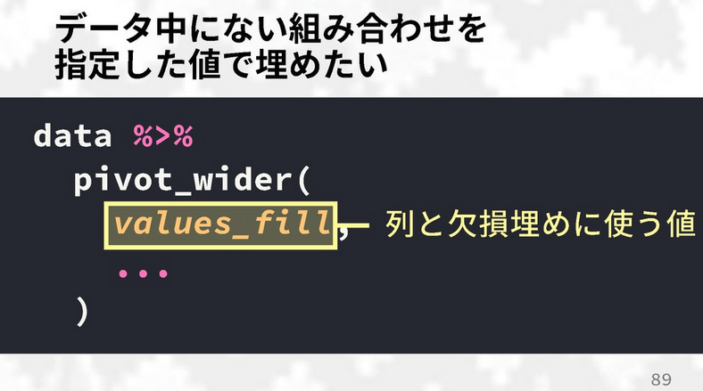

As the monsoon rains fall, another [TokyoR User
Meetup](https://tokyor.connpass.com/event/130254/)! On June 29th, useRs
from all over Tokyo flocked to Hanzomon, Tokyo for another jam-packed
session of \#rstats hosted by
[Infocom](https://www.infocom.co.jp/en/index.html).

In line with my previous round up posts:

-   [TokyoR
    \#76](https://ryo-n7.github.io/2019-03-07-tokyoR-76-roundup/)
-   [TokyoR \#77](https://ryo-n7.github.io/2019-04-24-tokyoR-77/)
-   [TokyoR
    \#78](https://ryo-n7.github.io/2019-05-31-tokyoR-78-roundup/)

I will be going over around half of all the talks. Hopefully, my efforts
will help spread the vast knowledge of Japanese R users to the wider R
community. Throughout I will also post helpful blog posts and links from
other sources if you are interested in learning more about the topic of
a certain talk. You can follow **TokyoR** by searching for the
[\#TokyoR](https://twitter.com/hashtag/TokyoR) hashtag on Twitter.

Anyways…

Let’s get started!

BeginneR Session
================

As with every [TokyoR](http://tokyor.connpass.com/) meetup, we began
with a set of beginner user focused talks:

-   [Reading in data with R by
    kotatyamtema](https://www.slideshare.net/kotora_0507/tokyor79-beginnerssession1/kotora_0507/tokyor79-beginnerssession1)
-   [Data handling & manipulation by
    y\_mattu](https://ymattu.github.io/TokyoR79/slide.html#/)
-   [(NEW!) Intro to Probability with R by
    kilometer00](https://speakerdeck.com/kilometer/tokyo-dot-r-number-79-beginnersession-que-lu-falseji-chu)

Main Talks
==========

[yutannihilation](https://twitter.com/yutannihilation): tidyr 1.0.0
-------------------------------------------------------------------

-   [Slides](https://speakerdeck.com/yutannihilation/tidyr-pivot)

`@yutannihilation`, co-author of `ggplot2`, gave a talk about the new
tidyr 1.0.0 version with special focus on the `pivot_longer()` and
`pivot_wider()` functions that are to take over from (but not erase) the
`gather()` and `spread()` functions respectively.

__1.__  `pivot_longer(data, columns, ...)`: Make datasets **longer** (more
    rows, less columns)

-   You can use the various `select()` helper functions to select
    columns
    -   ex. `starts_with("col")`, `contains("july")`, `matches(".t.")`
-   For multiple columns, you need to use `c()`
-   Other options such as `col1:col5` and `-col2` still exist as well
-   `names_to =` argument lets you set the name of the new column(s) that
    will be created by the function
-   `values_to =` argument lets you set the name of the new column(s) that will contain
    the "data value"
    -   if the column name does not already exist in the dataframe you
        have to wrap them in quotes, `""`

The above are pretty similar to what we had in `gather()` but some new
arguments I found interesting were:

-   `names_prefix =` argument which lets you remove
    -   Ex. Values in column look like “day1”, “day2”, “day3”, etc., if
        you set `names_prefix = 'day'` it will remove “day” from the
        values in the column.
-   `names_ptype =` argument lets you set the class type of the specified column(s)
    -   Ex. After taking out “day” from the values in the above example,
        the number values in the column are still class “character”. Set
        `names_ptype = list(day = integer())` to specify that the column
        should be an integer class (see below image).

-   `names_pattern =` and `names_sep =` work similarly in that you
    specify a regex or symbol on which you want to separate the values
    into the `names_to` columns you want to create.

__2.__  `pivot_wider(columns, ...)`: Make datasets **wider** (less rows,
    more columns)

-   `names_from =` and `values_from =` are like in `pivot_longer()`
    except the opposite way as we combine the column names and specify
    which column the values for the new column comes from.
-   `values_fill =`: use this argument to specify what each value should
    be when missing.

-   `names_sep =` and `names_prefix =`: Much like their counterparts in
    `pivot_longer()` except they create new column names using “sep” value
    to separate names and add a prefix, respectively
-   When there are multiple values for a certain row/group (see below
    image) you can now wrap up these values into a list. A definite
    upgrade from `spread()/gather()` where this action was not possible.

An alternative to the above is to use `values_fn =` argument to specify
a function to summarize a set of values in a column (such as taking the `mean()` of the three values), 
this may be the optimal strategy if you do not want list-columns everywhere in your data frame.

Some discussion followed on the `#TokyoR` hashtag as some questioned
whether the complicated gamut of arguments to the new `pivot_*()`
functions differs from the tidyverse style of simple verbs describing
the user’s action. Others commented that the very messy nature of real
world data necessitates the extra layer of complexity in the
`spread()/gather()/pivot_*()` functions.

It has been speculated that `tidyr 1.0.0` was going to be released by the
[useR\! Conference](http://user2019.r-project.org/) in early July, however more likely it will be the late
July if not early August. As this was only a 20 minute talk, 
`@yutannihilation` wasn't able to talk about every change such as
information regarding `specs` but I've listed resources for further
reading below. Do keep in mind that the vignettes below are still in development and
explanations and examples may change.

Additional resources:

-   [Pivoting functions vignette on
    tidyr.tidyverse.org](https://tidyr.tidyverse.org/dev/articles/pivot.html)
-   [Pivoting functions vignette (translated to Japanese by
    Atsusy)](https://blog.atusy.net/2019/06/29/pivoting-tidyr-1-0-0/)

LTs
===

[flaty13](https://twitter.com/flaty13): RMarkdown Template for Analytics Teams!
-------------------------------------------------------------------------------

-   [Slides](https://docs.google.com/presentation/d/1mDU3VgoaMgljEQj1zHSaDS5J0mzAu-MqlJd5jqHBt5I/edit#slide=id.p)

`@flaty13`, who has previously presented at both `Tokyo.R` and
`Japan.R`, gave a presentation on creating RMarkdown templates at his
workplace. The usual workflow at his company is that those that use `R` knit a RMD into a
`.html` file then upload it to their web server to share. However, every
team member has a different level of expertise of RMarkdown and as such
it can be difficult for others to understand the structure and flow of
another person’s report. To remedy this `@flaty13` decided to create a
RMarkdown **template** for everybody to use!

One of the main differences that needed to be standardized was how
people loaded packages as well as read in data so after a __"Summary"__
section at the top the next two sections were:

-   __"Preparation"__ section: Loaded all the libraries, configured RMD
    options, and defined any custom functions
-   __“Data Load & Check”__ sections: Reads in all the data, does the
    processing and checking as well. This sections makes it clear __where__
    the data is coming from.

He also took advantage of the “Table of Contents”, “Code folding”, and
“Tabset” options to create a report template that is easy to navigate
and reduces the amount of clutter. These options were all called in via
the template’s YAML header:

As a result of creating a standard template, `@flaty13` found that it
became a lot easier to understand other team members’ reports and it
also became easier for new employees to get integrated into the
RMarkdown reports workflow.

Additional resources:

-   [Chapter 17: Document Templates from RMarkdown: The Definitive Guide
    by Yihui Xie, JJ Allaire, & Garrett
    Grolemund](https://bookdown.org/yihui/rmarkdown/document-templates.html)
-   [RMarkdown Theme Gallery by Andrew
    Zieffler](http://www.datadreaming.org/post/r-markdown-theme-gallery/)
-   [{markdowntemplates} package by
    hrbrmstr](https://github.com/hrbrmstr/markdowntemplates)

[igjit](https://twitter.com/igjit): Creating images from RAW data using R!
--------------------------------------------------------------------------

-   [Slides](https://igjit.github.io/slides/2019/06/raw-processing-r/#/)

`@igjit` has come to present at `Tokyo.R` yet again, cooking up
another interesting way to use R, this time for processing/editing
images from RAW data! RAW is a certain file format that captures
**all** of the image data recorded by a camera’s sensor when you
take a photo. As no data is compressed in this format (compared to
say, a JPEG) you are able to get very high quality images. One
advantage of RAW is that it is able to record more levels of
brightness (“bits”) which means you can make more adjustments in
terms of exposure, contrast, and brightness when producing your
image.

To do this `@igjit` primarily used the `{imager}`, `{reticulate}`,
`{tidyverse}` packages while also using the Python library `rawpy` to
actually load the RAW data into R.

After loading in the data you can use functions from `{imager}` to edit
and process the image in different ways such as demosaic-ing and white
balance editing.

`@igjit` has created a `bookdown` of the how-to and various tutorials of
manipulating RAW images with R which you can find
[here](https://igjit.github.io/camera-raw-processing-r/index.html)!

In conclusion, `@igjit` talked about how R isn't **just** a tool for
statistical work and it can be used for other tasks too! Also, from
pursuing this project he realized that using R for RAW image processing
can be quite an advantage due to R’s non-standard evaluation capabilities, 
the `%>%`, and the ability to use vector operations on objects.

[soriente](): R Coding Styles
-----------------------------

At her first `Tokyo.R`, `@soriente`, talked about different R coding
styles. Coming from a PHP background she wondered if there were any
“official” or certain guidelines in writing R code. The resource she
came across was Google's [Style
Guide](https://google.github.io/styleguide/Rguide.xml).

One of the things she noted was that in R it doesn't seem to matter if
you wrap characters using single-quotes `'blah'` or double-quotes
`"blahblah"` which was odd for her as a PHP person as in that language
there is a significant difference. Another style guide many R users
maybe familiar with is the [tidyverse style
guide](https://style.tidyverse.org/):

Below are some other resources for coding styles:

-   [{lintr}: static code analysis (checks for adherence to specified
    coding style, syntax errors, etc.) - Jim
    Hester](https://github.com/jimhester/lintr)
-   [Automatic tools for improving R packages - Maëlle
    Salmon](https://masalmon.eu/2017/06/17/automatictools/)
-   [{styler}: print R source code adhering to tidyverse (and other
    style guides) formatting rules](https://github.com/r-lib/styler)

Other Talks
===========

-   [ill\_identified](https://twitter.com/ill_Identified): [(Main Talk
    \#2) Finding a New Rental Home with Machine Learning:
    Redux](https://speakerdeck.com/ktgrstsh/rethink-method-to-find-cheap-rental-houses-by-machine-learning)
-   [katoshoo](https://twitter.com/kat0_sh00): [Data Science at a JTBC
    (Japanese Traditional Big Company)!]()
-   [kur0cky\_y](https://twitter.com/kur0cky_y): [Rating movies with topic modelling in R\!](https://speakerdeck.com/kur0cky/detademotewohackseyo-ying-hua-detobian)
-   [0\_u0](https://twitter.com/0_u0): [Negative binomial modeling in
    marketing!](https://8-u8.github.io/TokyoR/20190525/Presentation.html#1)

Food, Drinks, and Conclusion
============================

This month’s food & drinks was an Italian-themed dinner with an
assortment of pasta and pizza available. With a loud rendition of
“kampai!” (cheers!) R users from all over Tokyo began to talk about
their successes and struggles with R. A fun tradition at `TokyoR` is a
**Rock-Paper-Scissors** tournament with the prize being **free** data
science books:

-   [Introduction to RStudio & the Tidyverse - Yuya Matsumura, Hiroaki
    Yutani, & Yasunori Kinosada, Kazuhiro
    Maeda](https://gihyo.jp/book/2018/978-4-7741-9853-8)
-   [Machine Learning in Python (Japanese version) - Michael
    Bowles, trans. Hiroyuki Tsuyuzaki, Kohei Yamamoto, & Kosuke Ohkusa](https://www.kyoritsu-pub.co.jp/bookdetail/9784320124387)
-   A few other titles I didn't quite catch (sorry), including a book on
    `Rust`

Unfortunately, there was an incident at the Rock-Paper-Scissors
Tournament when there was some “booing” heard when the `Python` book was
announced as one of the prizes. Although seemingly made in joking manner
it was still disrespectful not only to other Pythonistas at the meetup
but also to the person who took the time and effort to donate the book
for this event. What was good to see was that the organizers and others
came out to admonish this kind of behavior. In the time that I've been
going to `Tokyo.R`, the meetup has always been very welcoming of people
from all backgrounds including Python, Excel (many R users in Japan have
been trying to move their companies away from Excel to mixed success…), etc.
We have also had presentations featuring Python alongside R via
`reticulate` in the past, including a presentation in this session!

Despite this blip, it was another educational and fun-filled `TokyoR`
session where I again lost in the Rock-Paper-Scissors Tournament in the
first round… repeatedly. Someday I'll win a book...someday! `TokyoR` happens
almost monthly and it’s a great way to mingle with Japanese R users as
it’s the largest regular meetup here in Japan. Talks in English are also
welcome so if you’re ever in Tokyo come join us!
