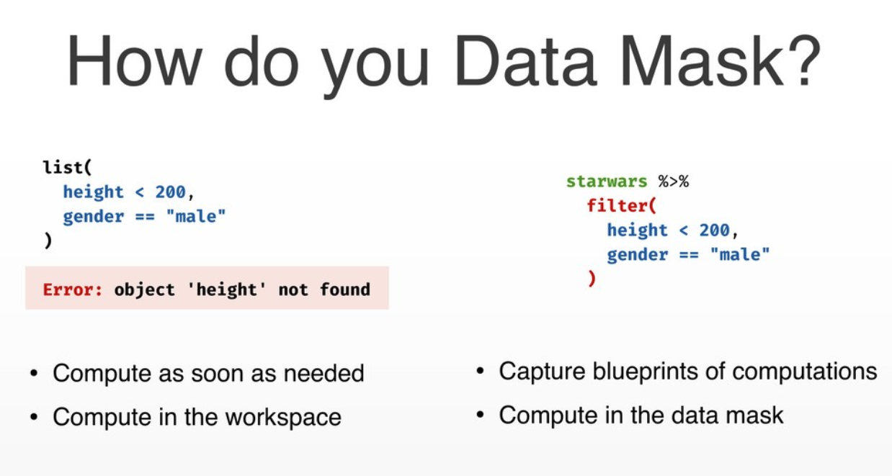

The useR! Conference was held in Toulouse, France and for me this
was my second useR! after my first in Brisbane last year. This time
around I wanted to write about my experiences and some highlights
similar to my post on the [RStudio::Conference 2019 & Tidyverse Dev
Day](https://ryo-n7.github.io/2019-01-25-tidyversedevday-rstudioconf-reflections/)
earlier this year. This blog post will be divided into 4 sections: **Programming**, **Shiny**, **{Packages}**, and **Touring Toulouse**.

You can find slides and videos (in a week or so) in:

-   [useR Materials Github Repo (also contains workshop
    stuff) courtesy of Suthira Owlarn](https://github.com/sowla/useR2019-materials)

-   [useR Official
    Website](https://user2019.r-project.org/talk_schedule/)

-   [Timestamps for the Keynote Presentations courtesy of David
    Smith](https://blog.revolutionanalytics.com/2019/07/user2019-keynotes.html)

As usual there were many talks that I didn’t get to go to as there are
around 3\~5 tracks across different rooms featuring talks on a certain
aspect of R such as Shiny, Modelling, Data handling, DevOps, Education,
etc. In the coming weeks I’ll also add video links to
the presentations below when they become available from R Consortium’s
Youtube channel.

Let’s begin!

Programming
===========

Enhancements to data tidying: Hadley Wickham
--------------------------------------------

Acknowledging the difficulty of `spread()` and `gather()` you might have heard of the creation of the `pivot_wider()` and `pivot_longer()` functions in recent
months. You really should take a look at the work-in-progress
[Vignette](https://tidyr.tidyverse.org/dev/articles/pivot.html) for a comprehensive understanding of the new functions but the
talk featured some live-coding by Hadley
([Code](https://gist.github.com/hadley/eb5c97bfbf257d133a7337b33d9f02d1))
and some cool spread/gather animations via [Charco Hui’s masters’
thesis](https://github.com/chrk623/dataAnim).

For more material you might be interested in Hiroaki Yutani’s [tidyr
1.0.0 presentation](https://speakerdeck.com/yutannihilation/tidyr-pivot)
from June’s Tokyo.R meetup. It’s mainly in Japanese but there are lots
of code and explanatory graphics that may aid you in visualizing how the
new functions work. You can also read a short English summary of the
talk [here](https://ryo-n7.github.io/2019-07-05-tokyoR-79-roundup/).

n() cool dplyr things: Romain Francois
--------------------------------------

* [Slides](https://speakerdeck.com/romainfrancois/n-cool-number-dplyr-things)

Taking the tidy data principles into account but for **grouped data**,
[Romain Francois](https://twitter.com/romain_francois) talked about the new `group_*()` functions in the
{dplyr} package.

While in previous versions of {dplyr} working in a tidy manner with
groups was done with `group_by()` then `dplyr::do()`, the latter
function has been deprecated and have been largely replaced by the
{purrr} family of functions instead. In this context the `group_map()`,
`group_modify()`, and `group_walk()` functions iterate like the {purrr}
functions but instead over groups. You can apply the functions you want
to apply to each group inline via a lambda, `~` (as below), or you can
specify a function directly without the lambda.

The `group_split()` operates similarly to `base::split()` but splits by
groups, the output being a list of sliced groups. The `group_keys()`
function returns you the exact grouping structure of the data you used
`group_by()` on, allowing you to check that the structure is right
before you start applying functions on your data. `group_data()` and
`group_rows()` gives you different kind of information about your
grouped data as can be seen below.

To shorten the `group_by() %>% summarize()` workflow you could instead
use the `summarize_at()` function. You can select specific columns with
`vars()`, then actions via a lambda, `~`, and you can specify multiple
functions with `list()`.

Romain also talked about the [{dance}](https://github.com/romainfrancois/dance) package which is mainly used to experiment and test out possible new {dplyr} functions by leveraging the
relatively new [{vctrs}](https://github.com/r-lib/vctrs) and [{rlang}](https://rlang.r-lib.org/) packages’ features. The package has a theme of using famous dance moves as the function names!

Reusing tidyverse code - Lionel Henry
-------------------------------------

* [Slides](https://user2019.r-project.org/static/pres/t258268.pdf)

[Lionel Henry](https://twitter.com/_lionelhenry) talked about programming using {tidyverse} functions. As an
introduction he went over data masking in {dplyr} and how it is
optimized for interactive coding and single-use `%>%`s. The usage of
non-standard evaluation (NSE) makes analyses easy as you can focus on the data rather than the
data structure. However, we hit a stumbling block when it comes to when
we want to create custom functions to program with {dplyr}. This is the
difference between computing in the work space (as needed) versus
computing in a data mask.

This is where `tidyeval` comes into play via [{rlang}](https://rlang.r-lib.org/) for flexible and robust programming in the tidyverse. However {rlang} confused a lot of
people due to the strange new syntax it introduced such as the `!!`,
`!!!`, and `enquo()`. Also, it introduced new concepts such as
quasi-quotation and quosures that made it hard to learn for people
especially with those without a programming background. Acknowledging
this obstacle, `{{ arg }}` was introduced to make creating tidyeval
functions easier. The new `{{ }}` (read as “curly-curly”) operator was
inspired by the {glue} package and is a short cut for `!!enquo(var)`.

Shiny
=====

Keynote \#2: Shiny apps and Reproducibility - Joe Cheng
-------------------------------------------------------

* [Slides](https://user2019.r-project.org/static/pres/keynote_201907110915.zip)

Compared to a R script or R Markdown document, reproducibility suffers
in Shiny apps as the outputs are transient and **not** archivable.
RStudio's [Joe Cheng](https://twitter.com/jcheng/) talked about how reproducible analysis with Shiny is inconvenient as reenacting the
user’s interaction steps is necessary. A case for having a simple
**CLICK** button to view/download a reproducible artifact can be seen in
various industries such as:

-   ex. Drug research/pharma validation (workflow)
-   ex. Teaching: statistical concepts and code snippets
-   ex. Gadgets/add-ins: building `ggplots`, regex, and SQL queries then
    insert the code into source/console editor

The different possible outputs we might want from a Shiny app are:

-   To download the RMD or R file as the artifact
-   To download a ZIP with source code & data, other supporting files,
    and the actual rendered result

From there Joe talks about how there are a number of options available
such as :

1.  Copy-paste: Have a Shiny app **and** RMD report
    - Pros: Copy-pasted code is high fidelity and easy to understand
    - Cons: Two copies must be kept in sync and method will not work for
      more dynamic apps

2.  Lexical analysis: automatically generate scripts from app source
    code (static analysis and heuristics)
    - Pros: Easy to add to app
    - Cons: Not ALL apps can be translated automatically
    - Generated code may **not** be camera ready as it may contain lots of
      code relating to the Shiny app’s structure

3.  Programmatic: Meta-programming techniques to write code for **dual**
    purposes (execute interactive **and** export static)
    - Pros: Flexible
    - Cons: **High** learning curve and significant effort needed to adapt
      old Shiny apps

In light of the various pros and cons of the above options Joe with the
help of [Carson Sievert](https://twitter.com/cpsievert) created the…

### {shinymeta} package

There are four main steps to follow when using {shinymeta}:

1.  Identify the domain logic inside the code and separate it from
    Shiny’s reactive structure
    - Activate meta mode with `withMetaMode()` or `expandChain()`
    - Use `metaReactive()` to create a `reactive()` that returns a code
      expression
    - Other functions to return code include `metaObserve()`,
      `metaRender()`, etc.
    - You can also wrap the code you want with `metaExpr()` inside
      function

2.  Within the domain logic you identified, identify references to
    reactive values and expressions that need to be replaced with static
    values and static code
    - De-reference reactive values with `!!`
    - Replace reactive values with the **actual** values

3.  At run time, choose **which** pieces of domain logic to expose to
    the user
    - `expandChain()`: turns `!!` code into variable and introduces code
      snippet above the function
    - The chain of variable declarations grow upwards as you sequentially
      expand the meta-objects

4.  Present the code to the user!
    - Use `outputCodeButton()` to add a button for a specific output
    - Use `displayCodeModal()` to display underlying code
    - Use `downloadButton()` to allow people to click and download a R
      script or RMD report
    - Use `buildScriptBundle` or `buidlRmdBundle()` to generate .zip
      bundles dynamically

Some of the limitations and future directions Joe, Carson, and the rest
of the Shiny team acknowledge are that:

-   The formatting of the code can be improved (white
    space not preserved)
-   Future compatibility with Shiny async
-   So far {shinymeta} only covers reproducing “snapshots” of the app
    state
-   More work and thinking needs to be done to reproduce a “notebook”
    style record of the how/why/what of the multiple iterations of
    interactive usage that was needed to get to a certain result and
    output

There’s a lot to take in (this was probably the toughest talk for me to
explain in this post…), so besides watching the [keynote
talk](https://www.youtube.com/watch?v=5KByRC6eqC8&t=687s) yourself you
can also take a look at the [shinymeta package
website](https://rstudio.github.io/shinymeta/).

{golem}: Shiny apps in production - Vincent Guyader
---------------------------------------------------

* [Slides](https://user2019.r-project.org/static/pres/t258268.pdf)
* [{golem}](https://github.com/ThinkR-open/golem)

[Vincent Guyader](https://twitter.com/VincentGuyader), from another French R organization
[ThinkR](https://github.com/ThinkR-open), talked about the new {golem}
package which creates a nice framework for building robust
production-ready Shiny apps.

One of the key principles in R is when you are repeatedly writing or
using the same code or functions then you should write a package, and
this is no different for Shiny apps as well. The reasons Vincent stated
were:

-   Easy dependency, version, documentation management
-   Easy installation and deployment

With the package infrastructure, you need to have the `ui.R` and
`server.R` (`app_ui.R` and `app_server.R` respectively in {golem}) in
the R directory and all you need to run your app is the `run_app()`
function.

{golem} also has functions that make it easy to deploy your app via R
Studio Connect, shinyproxy, Shiny server, heroku, etc.

For styling your app with customized JavaScript and CSS files you can
easily add them to your Shiny app package directory via the
`add_js_file()` and `add_css_file()` functions. You can do similar but
with modules with `add_module()`. As {golem} is a package you have all
the great attributes of an R package available to you such as unit
testing, documentation, and continuous integration/deployment!

Our journey with Shiny: Some packages to enhance your applications - Victor Perrier & Fanny Meyer
------------------------------------------------------------------------------------------------

* [Slides](https://dreamrs.github.io/talks/20190712_useR2019_OurJourneyWithShiny.pdf)

[Victor Perrier](https://twitter.com/_pvictorr) and [Fanny Meyer](https://twitter.com/_mfaan) from [dreamRs](https://github.com/dreamRs) talked about
the various Shiny packages that can extend the functionality of your
Shiny applications!

The first and probably the most well-known of this group is the
[{shinyWidgets}](https://github.com/dreamRs/shinyWidgets) package which gives you a variety of cool custom widgets that you can add to make your Shiny app via JavaScript and CSS.

Next, wondering about how exactly users interacted with their Shiny apps
and whether they used the included widgets the dreamRs team created the
[{shinylogs}](https://github.com/dreamRs/shinylogs) package. This packages records any and all inputs that are changed as well as the outputs and errors. This is done by storing the
JavaScript objects via the
[localForage](https://github.com/localForage/localForage) JavaScript
library. With this in place shiny developers can see the number of
connections per day, the user agent family, most viewed tabs, etc.

The [{shinybusy}](https://github.com/dreamRs/shinybusy) package gives a user feedback when a server operation running or busy such as a spinning circle, a moving bar, or even any
kind of gif you choose!

Last but not least is the [{shinymanager}](https://github.com/datastorm-open/shinymanager) package which allows you to administrate and manage who can access your application and protects the source code of your app until authentication is successful!

The dreamRs organization are also the organization that created the
[{esquisse}](https://github.com/dreamRs/esquisse) package that lets you interactively make ggplot2 graphs with an RStudio addin!

Talking about packages leads me to the next section…

Packages
========

Summary of developments in R’s data.table package - Arun Srinivasan
-------------------------------------------------------------------

* [Slides](https://user2019.r-project.org/static/pres/t258038.pdf)
* [{data.table}](https://github.com/Rdatatable/data.table)

I've been curious about data.table so I decided to go to this talk
to learn more from [Arun Srinivasan](https://twitter.com/arun_sriniv), one of the authors of the package. Starting off
with some trivia, I finally learned that the reason for the seal on the
hex sticker is because seals make an “aR! aR! aR!” sound according to
{data.table} creator Matt Dowle, which I thought was pretty great!

Compared to a year ago there has been a lot of change and progress in
{data.table}:

A key principle of {data.table} is that there are **no** dependencies or
imports in the package!

The general form of using {data.table} is as follows:

Arun also showed us some examples:

At the end he also talked about the new optimization and functionalities
in the package.

-   for ‘i’: auto-indexing and parallel subsets (columns processed in
    parallel)
-   for ‘j’: using GForce
-   for ‘by’: parallelization of radix ordering
-   new functionality: `froll()`, `coalesce()`, and `nafill()`

At the end of the talk Arun thanked the 69 people (among them [Michael
Chirico](https://twitter.com/michael_chirico), [Philippe Chataignon](https://twitter.com/phchataignon), Jan Gorecki, etc.) who have contributed a
lot to what {data.table} is today!

{polite} - Dmytro Perepolkin
----------------------------

* [Slides](https://github.com/dmi3kno/user19-polite) 
* [{polite}](https://github.com/dmi3kno/polite)

The {polite} package is one I've been using for over a year now (you
might’ve seen me use it in my soccer or TV data viz) and I was delighted
to hear that the creator was giving a LT on it! [Dmytro](https://twitter.com/dmi3k) began with a few do's and don'ts concerning user-agents and being explicit about them:

Secondly, you should always check the `robots.txt` for the website which is a file that
stipulates various conditions for scraping activity. This can be done
via [Peter Meissner](https://twitter.com/peterlovesdata)'s [{robotstxt}](https://github.com/ropenscilabs/robotstxt) package or by checking the output from `polite::bow("theWebsiteYouAreScraping.com")`(`polite::bow()` function
is what establishes the {polite} session)!

After getting permission you also need to limit the rate at which you
scrape, you don’t want to overload the servers of the website you are
using, so **no** parallelization! This can be done with the [{ratelimitr}](https://github.com/tarakc02/ratelimitr)
package, `purrr::slowly()` while the {polite} package automatically
delays by 5 seconds when you run `polite::scrape()`. 

After scraping, you should definitely cache your responses with [{memoise}](https://github.com/r-lib/memoise), which is what is used inside the `polite::scrape()` function. Also, wrap your scraper function
with something like `purrr:::safely()` so it returns a list of two
components, a “result” for successes and “error” object for errors in
your scraping.

You can also read his blog post on the talk
[here](https://www.ddrive.no/post/be-nice-on-the-web/) which explains a
bit more about the `polite::use_manners()` function that allows you to
include {polite} scrapers into your own R packages.

goodpractice: good pkg development Hannah Frick
-----------------------------------------------

* [Slides](https://github.com/hfrick/presentations/blob/master/2019-07-11_goodpractice/gp_lightning.pdf)
* [{goodpractice}](https://github.com/MangoTheCat/goodpractice)

[Hannah Frick](https://twitter.com/hfcfrick) from Mango Solutions talked about {goodpractice}, a package that gives you advice about good practices for building an R package. By
running `goodpractice::gp()` it does static code analysis and can run
around \~200 of the checks available.

A cool thing you can do is that you can customize the different checks
it runs, set your own standards beforehand and run the checks based on
those standards with the `make_check()` and `make_prep()` functions.
It’s a great package that I’ve used before at work and for my own
packages so definitely try it out!

R Community
===========

The development of {datos} package for the R4DS Spanish translation - Riva Quiroga
----------------------------------------------------------------------------------

* [Slides]() 
* [{datos}](https://cienciadedatos.github.io/datos/)

[Riva Quiroga](https://twitter.com/rivaquiroga) talked about translating
the “R for Data Science” book and R data sets into Spanish. This came
about as a fact that learning R (or any programming language) can be
tough for a non-English speaker as it means you have to not only learn
the programming but figuring out what the documentation and use cases in
English even mean. To address this language gap the R4DS Spanish
translation community project was born, [Ciencia de
Datos](https://github.com/cienciadedatos) on Github! Through Github and
slack the organization sought to translate both the book and the various
data sets available in base R, for example: turning “diamonds” into “dimantes”.
However, they found that simply trying to `rename()` everything was not
sustainable so they had to find an alternative. This alternative ended
up being the [{datalang}](https://github.com/edgararuiz/datalang)
package.

This package (created by RStudio’s Edgar Ruiz) uses a YAML spec file
translating to the language you want for the variable names, value
names, help files, etc. After creating the spec file you just have to
add it as an argument into the
`datalang::translate_data()/translate_folder()` function and you’ll have
a translated data set! The [R para Ciencia de Datos Twitter](https://twitter.com/R4DS_es) also hosts a Spanish version of \#TidyTuesday called \#DatosDeMiercoles so check it
out!

Another thought I had after this presentation was that maybe this might
be a good idea for Japanese?

R Consortium Working Groups - Joseph Rickert
--------------------------------------------

* [Slides]()

RStudio’s [Joe Rickert](https://twitter.com/RStudioJoe) talked about R
Consortium’s Workings Groups which is an initiative to foster innovation
among individuals and companies. Any individual or a group can apply to
create a working group to explore what R and other technologies can do
in a certain field of interest. Throughout the talk Joe gave examples of
successful workings groups such as:

-   [Census Working Group](https://github.com/RConsortium/censusguide)
-   [R in Pharma (which now has its own
    conference!)](http://rinpharma.com/)
-   R Validation Hub: enabling the usage of R in regulatory settings
-   [R Community Diversity and
    Inclusion](https://github.com/RConsortium/RCDI-WG/tree/master)
-   And more!

As advice for potential working groups Joe said that one should pick a
project with a very **wide** scope which can benefit from collaboration
between members and which can benefit a large portion of the R
community.

Keynote: \#3 ‘AI for Good’ in the R and Python ecosystems - Julien Cornebise
----------------------------------------------------------------------------

In the last keynote of the conference [Julien Cornebise](https://twitter.com/JCornebise) talked about using technology tools for good using lots of examples throughout his
life for both good and bad projects.

Here are some quotes I was able to jot down:

On using technology for good:

> "Technology is not a solution it is an accelerator, essentially you just have a better optimizer, you're just fitting better to the incentives we have around us a society."

On the motivation of getting involved in \#DataForGood projects:

> "Are you here to solve the problem or are you here for a really cool application of your fantastic new theory and algorithm?"

On “hackathon syndrome” of many solutions to \#DataForGood problems:

> "Github is a big cemetary of really good ideas ... where do we find software engineers, where do we find the designers, how do we go from the solution to the project to a real product that can be used by many many people?"

Some of the projects he talked about were:

-   [Decode
    Darfur](https://decoders.amnesty.org/projects/decode-darfur):
    Identifying remote burnt/destroyed villages in the Darfur region to
    provide credible evidence that they had been attacked by the
    Sudanese government and allies.
-   [Troll
    Patrol](https://decoders.amnesty.org/projects/troll-patrol/findings):
    Quantitative analysis of online abuse and violence against UK and US
    women on Twitter.

This is definitely a talk I would recommend everybody to watch and you
can do so from [here](https://youtu.be/G2SgOQv3PEM?t=3514)!

Tour Toulouse!
==============

As I was only heading home on the following Monday, I had the entire
weekend to explore Toulouse! I was staying near the Capitole and as
Toulouse is pretty walkable I didn’t have to use public transportation
at all during my stay. I think I just about walked every street in the
city center! Unfortunately, the Musee de Augustins was closed but I was
able to visit most of the other sites! My favorite sights were the [Couvent des Jacobins](https://www.jacobins.toulouse.fr/) (pictured bottom-left) and the [Musée Saint-Raymond](https://www.saintraymond.toulouse.fr/), an archeological museum full of Roman/Greek/Celtic artifacts! Below are some pictures:

Sunday was also Bastille Day so there were some fireworks on display as
well. All in all I had a great time in Toulouse!

Conclusion
==========

This was my second useR! Conference and I enjoyed it quite a lot, not to
mention I got to do some sightseeing which I wasn’t able to do much of
in Brisbane last year. I met a lot of people that I follow on Twitter
and I’ve had people come up to me who recognized me from all the data
viz/blog posts I do (a first for me) which was really cool (and it helps
as I'm very nervous about approaching people especially since they are
usually surrounded by other people and I don’t want to interrupt their
conversation and… “Oh no it’s time for the next session!”, etc.)!

During a post-conference dinner I had with a dozen or so random
R users that were still in Toulouse (including [Diane Cook](https://twitter.com/visnut), [Will Chase](https://twitter.com/W_R_Chase), [Saras Windecker](https://twitter.com/smwindecker), [Irene Steves](https://twitter.com/i_steves), [Alimi Eyitayo](https://twitter.com/alimieyitayo) among others - and some that I didn't even get to talk to because our group was so big) we all talked about how important the
**community** is. With how open everything is in regards to the talks
being recorded and the materials being put online you don’t necessarily
have to come all the way to the conference to be able to **learn** the material.
However, the important component of these conferences is being able to talk to the people and engaging with the community which
is something I’ve really felt to be a part of since I started R and
going to conferences in the past 2 years or so. I think nearly each one
of the people I sat with on the table at dinner that night came from a
different country and worked in completely different areas which made
for some real eye-opening discussion about how R is used worldwide and across industries. I
also learned about cultural differences in tech, especially women in tech
in Nigeria from [Alimi Eyitayo](https://twitter.com/alimieyitayo) (who
also gave a talk on [Scaling useR Communities with Engagement and
Retention
Models](https://user2019.r-project.org/static/pres/lt257977.pdf) at the
conference).

There were still a ton of great talks I missed so I'm excited to watch the rest on Youtube. I think I will be at RStudio::Conference next year in San Francisco so hopefully I'll see some of you there!
