Within a typhoon, another TokyoR Meetup! … well not really it turned out
to be a false alarm and the weather was a wonderful 30 degrees Celsius
with 800% humidity as usual in Tokyo. My gripes with the weather aside this
month’s meetup was held at [Cresco](https://www.cresco.co.jp/), an IT
management strategy company, in their headquarters in Shinagawa, Tokyo.

In line with my previous round up posts:

-   [TokyoR
    \#76](https://ryo-n7.github.io/2019-03-07-tokyoR-76-roundup/)
-   [TokyoR \#77](https://ryo-n7.github.io/2019-04-24-tokyoR-77/)
-   [TokyoR
    \#78](https://ryo-n7.github.io/2019-05-31-tokyoR-78-roundup/)
-   [TokyoR
    \#79](https://ryo-n7.github.io/2019-07-05-tokyoR-79-roundup/)

I will be going over around half of all the talks. Hopefully, my efforts
will help spread the vast knowledge of Japanese R users to the wider R
community. Throughout I will also post helpful blog posts and links from
other sources if you are interested in learning more about the topic of
a certain talk. You can follow **Tokyo.R** by searching for the
[\#TokyoR](https://twitter.com/hashtag/TokyoR) hashtag on Twitter.

Anyways…

Let’s get started!

BeginneR Session
================

As with every [TokyoR](http://tokyor.connpass.com/) meetup, we began
with a set of beginner user focused talks:

-   [Reading in data with R by
    kotatyamtema](https://www.slideshare.net/kotora_0507/tokyor79-beginnerssession1/kotora_0507/tokyor79-beginnerssession1)
-   [Data handling & manipulation by
    y\_mattu](https://ymattu.github.io/TokyoR80/slide.html)

Main Talks
==========

[ill\_identified](https://twitter.com/ill_Identified): Econometrics vs. Machine Learning
----------------------------------------------------------------------------------------

-   [Slides](https://speakerdeck.com/ktgrstsh/relation-between-econometrics-and-machine-learning-ai-is-the-plan-the-plan-is-counterfactual)

`@ill_identified` gave a talk on a more general industry topic rather
than about R specifically by talking about the differences between econometrics and
machine learning/A.I. To start off he listed some good resources (in
English) to read from the economics/econometrics side of the discussion:

-   [Machine Learning: An Applied Econometric Approach - S. Mullainathan
    & J. Spiess](https://www.aeaweb.org/articles?id=10.1257/jep.31.2.87)
-   [Big Data: New Tricks for Econometrics - H.
    Varian](https://www.aeaweb.org/articles?id=10.1257/jep.28.2.3)
-   [Machine Learning Methods Economists Should Know About - S. Athey
    & G. Imbens](https://arxiv.org/abs/1903.10075)

From looking at the methods that both fields use like multiple linear
regression, logistic regression (GLMs), Monte-Carlo Markov Chain (MCMC),
non-parametric regression, etc. it seems as though they might be the
same thing… but an important distinction can be made in that:

-   Economics/Econometrics == Causal Inference
-   Machine Learning == Prediction

Frank Harrell in [Road Map for Choosing Between Statistical Modeling and
Machine Learning](https://www.fharrell.com/post/stat-ml/) as well as
Miguel Hernan in [Data science is science’s second chance to get causal
inference right: A classification of data science
tasks](https://arxiv.org/abs/1804.10846) discuss this in length if you
want to take a look.

`@ill_identified` then took us through a couple examples of causal
inference from a variety of economics research focusing on the spread
and popularity of Randomized Control Trials (RCTs) and
Difference-In-Differences (DID) in the field.

-   [Mostly Harmless Economics - Angrist &
    Pischke](https://www.mostlyharmlesseconometrics.com/)
-   [Empirical Analysis - Morita (in
    Japanese)](https://www.nippyo.co.jp/shop/book/6554.html)

There was a talk on DID at last year’s [Japan.R
Conference](http://japanr.net/) that you can find
[here](https://ryo-n7.github.io/2018-12-06-japanr-conference-roundup-blog-post/)!

From the side of machine learning, [Athey
(2018)](https://www.nber.org/chapters/c14009.pdf) talked about how up to
the present, economists have been trying to fit their model to the
entirety of the data available to them, leading to potential problems of
over-fitting. To counteract this problem Athey notes how the field can
learn from machine learning by using cross-validation techniques and
penalized models.

For causal inference from the machine learning side of the discussion,
`@ill_identified` talked about Judea Pearl’s answer of Quora to the
question, [“What are the differences between econometrics, statistics,
and machine
learning?”](https://www.quora.com/What-are-the-differences-between-econometrics-statistics-and-machine-learning).

In the answer, Judea Pearl makes the distinction between standard ML and
advanced ML, namely that the former (while specifically including deep
learning and neural networks in this category) “fits a function to a
stream of data and plays the same role as statistical analysis, taking
us from samples to properties of distribution functions.” while the
latter “goes beyond distributions onto the process that generates the
data, and so, allows us to manage policy interventions and
counter-factual reasoning”. He then points to two of his works, [7 Tools
of Causal Inference with Reflections on Machine
Learning](http://ftp.cs.ucla.edu/pub/stat_ser/r481.pdf) and [The Book of
Why (written with Dana MacKenzie)](http://bayes.cs.ucla.edu/WHY/) for
further reading. It is in the former work that Judea Pearl talks about
the three levels of the causal hierarchy:

-   Level 1: Association
-   Level 2: Intervention
-   Level 3: Counterfactuals

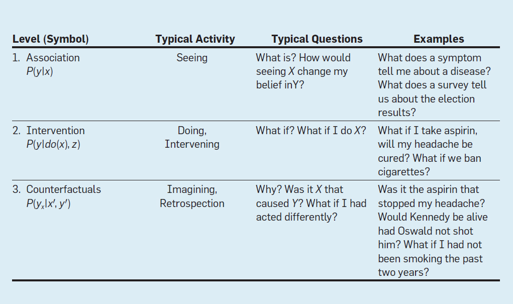

There is a lot of debate centered on “Potential Outcomes” theory posited
by Neyman & Rubin versus Pearl’s “Causal Graphs/SEM” approaches in the
past while Andrew Gelman has also talked about the issue
[here
(2009)](https://statmodeling.stat.columbia.edu/2009/07/05/disputes_about/)
and [here
(2011)](https://statmodeling.stat.columbia.edu/2009/07/05/disputes_about/).
Very recently, Guido Imbens submitted an article, [Potential Outcome and
Directed Acyclic Graph Approaches to Causality: Relevance for Empirical
Practice in Economics](https://arxiv.org/abs/1907.07271) that discusses
this in length that is probably worth checking out as well!

From the Rubin side of the debate Guido Imbens, Susan Athey, and Viktor
Chernozhukov stand out as the primary researchers.

__Athey__: 

-   [Causal Tree/Causal Forest - Wager & Athey (2018)](https://www.tandfonline.com/doi/full/10.1080/01621459.2017.1319839)
-   [Generalized Random Forest - Athey et al. (2019)](https://arxiv.org/abs/1610.01271) 
-   [{causalTree} R package](https://github.com/susanathey/causalTree)

__Chernozhukov__: 

-   [Double/Debiased/Neyman Machine Learning of Treatment Effects - Chernozhukov et al. (2017)](https://arxiv.org/abs/1701.08687)
-   [Double/Debiased Machine Learning for Treatment and Causal Parameters - Chernozhukov et al. (2018)](https://arxiv.org/abs/1608.00060)
-   [Estimation and Confidence Regions for Parameter Sets in Econometric Models - Chernozhukov et al. (2007)](https://www.jstor.org/stable/4502031/)

In the final section `@ill_identified` went over a few new methods in
A.I./ML that provided some evidence to show that A.I./ML does indeed
have similarities with econometrics mainly through the application of
the structural estimation approach to modeling. A good overview is
[Artificial Intelligence as Structural Estimation: Economic
Interpretations of Deep Blue, Bonanza, and AlphaGo - Mitsuru
Igami](https://arxiv.org/abs/1710.10967) while you can read about the
specific AIs discussed in more detail below.

-   [AlphaGo - Silver et
    al. (2016)](https://www.nature.com/articles/nature16961)
-   [Bonanza](https://www.kadokawa.co.jp/product/200704000327/)
-   [DeepBlue - Campbell et
    al. (2002)](https://www.sciencedirect.com/science/article/pii/S0004370201001291)

[kilometer00](https://twitter.com/kilometer00): R interface to Python
---------------------------------------------------------------------

-   [Slides](https://speakerdeck.com/kilometer/tokyo-dot-r-number-80-r-interface-to-python)

TokyoR organizer and frequent BeginneR session speaker `@kilometer00`
talked about using Python with R.

To familiarize the audience with Python he went over quite a number of
slides showing the similarities and differences in syntax between the
two languages.

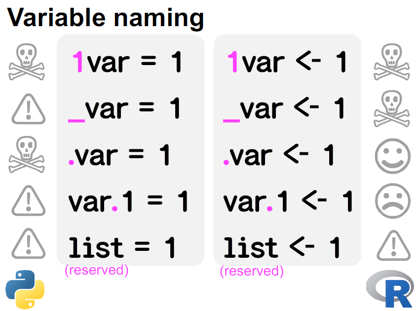
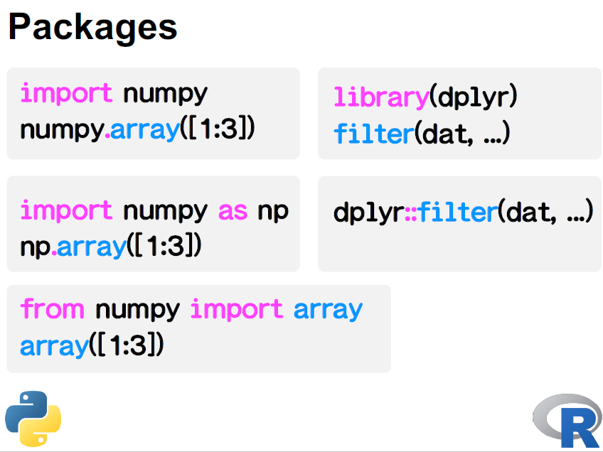

Next, `@kilometer00` talked about the {reticulate} package which allows
you to call Python from R and can provide translation between R and
Python objects (such as R and Pandas data frames or R matrices and NumPy
arrays). Using {reticulate} he talked about the importance of having an
isolated and independent environment, to keep Python in a “sandbox”-ed
virtual environment for security and reproducibility. To do this
`@kilometer00` likes to use [Pipenv](https://github.com/pypa/pipenv/).

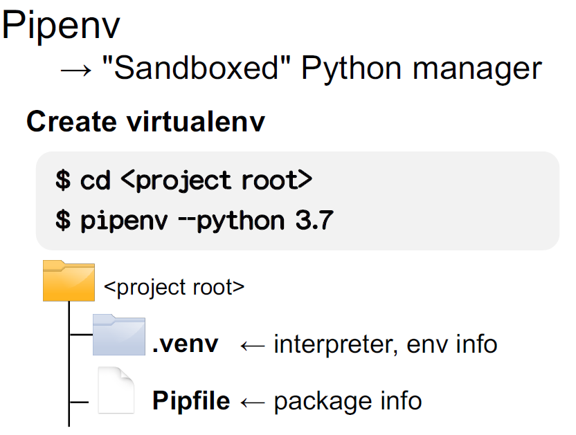
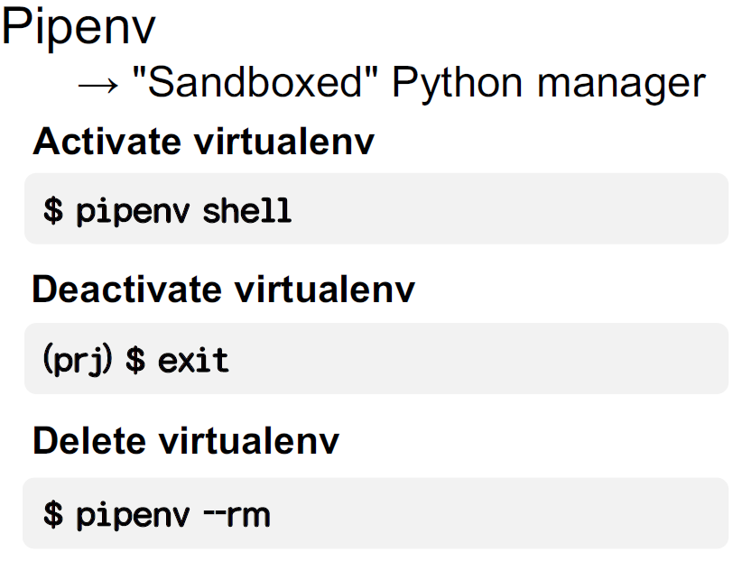

Once you’re done with all the set-up, you can install {reticulate} from
CRAN and attach your Python virtualenv with `reticulate::use_python()`
and then you can finally start doing stuff! But be wary of type errors
when you’re coding:

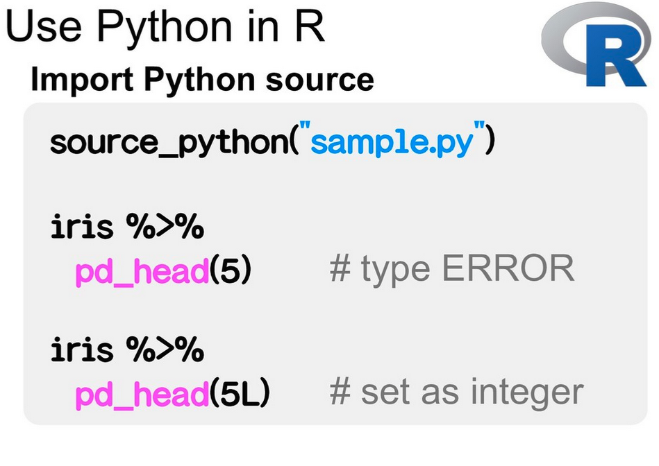

You can also use Python in a R Markdown document by setting the code
chunk to run it. With a recent development in RMD you can now also share
objects from different languages by putting a prefix in front of the
object name!

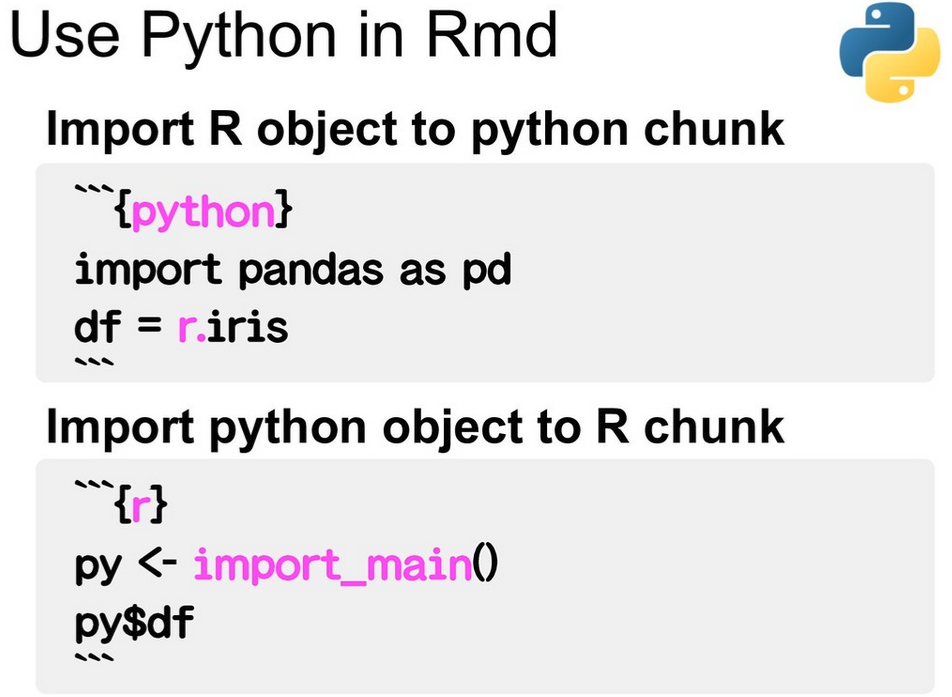

Funnily enough you can also run R in Python in R:

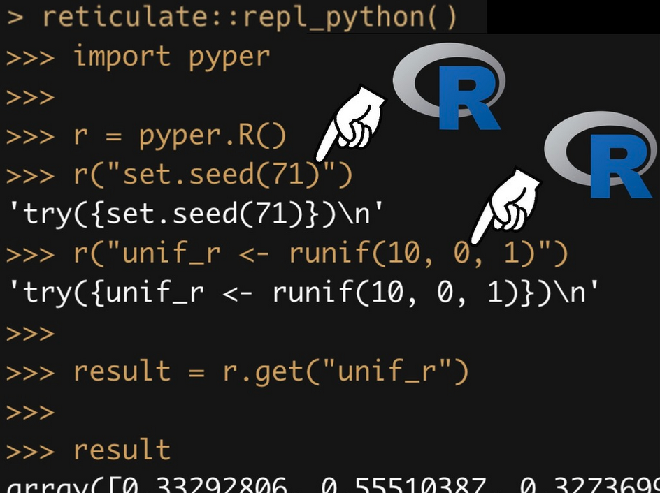

Pythonception!

More resources on {reticulate}: 
-   [{reticulate} package website](https://rstudio.github.io/reticulate/index.html) 
-   [R or Python? Why not both? Using Anaconda Python within R with {reticulate} - Bruno Rodrigues](https://www.brodrigues.co/blog/2018-12-30-reticulate/)
-   [R and Python: Using reticulate to get the best of both worlds - Manuel Tilgner](https://www.statworx.com/de/blog/r-and-python-using-reticulate-to-get-the-best-of-both-worlds/)

LTs
===

[wkwk\_soprano](https://twitter.com/wkwk_soprano): Creating network graphs with R!
----------------------------------------------------------------------------------

-   [Slides](https://speakerdeck.com/wmichi/rdegurahuzuo-rufalse)

It’s been a while since `@wkwk_soprano` used R (5 years!) but he’s come
back with aplomb by talking about network graphs at Tokyo.R! Network
graphs are used in all sorts of fields of study including physics,
chemistry, linguistics, and the social sciences. In industry you might
see them as part of a recommendation graph between a customer and
products on sale. Frustrated by the fact that he didn’t have a fun data
set to use the {network} package on, `@wkwk_soprano` decided to create
his own data set based on his favorite manga, One Piece!

By counting up the times a character appeared in one panel of the manga
with another he slowly built up a co-occurrence matrix of all the
characters from Volume 1 to Volume 23. It took him about one hour per
volume to create this data set, now that’s dedication!

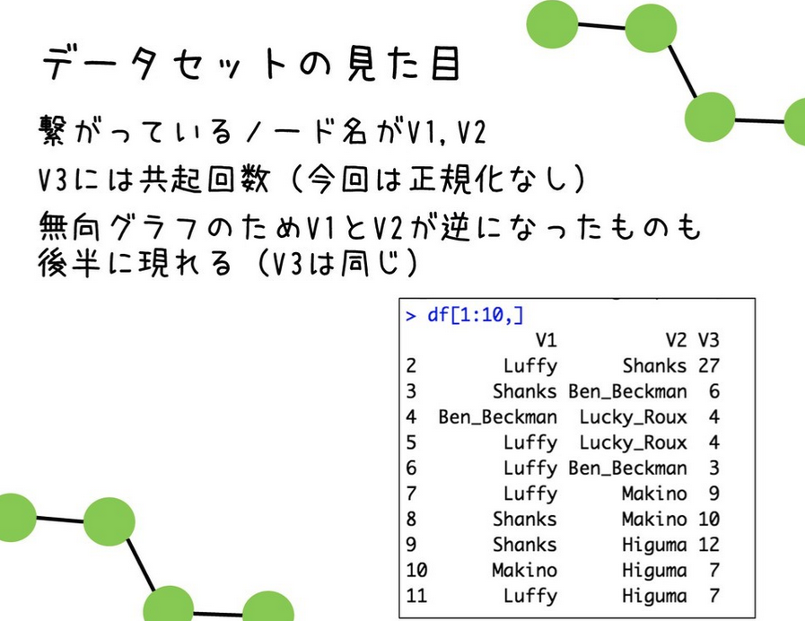

You can find the [gum-gum fruits](https://onepiece.fandom.com/wiki/Gomu_Gomu_no_Mi) of his labor [here](https://drive.google.com/file/d/1y0uDbPLsMBoC5KpjT9CDDmQLAuOmZK2N/view).

After creating the data `@wkwk_soprano` wanted to do some analysis on it
like graph embedding via DeepWalk or Large-scale Information Network
Embedding (LINE). There’s actually a R package called
[Rline](https://github.com/YosefLab/Rline) to implement this method but
he found that it was difficult to install and it hadn’t been updated in
a while so he went with the original [C++
implementation](https://github.com/tangjianpku/LINE) from Jian Tang et
al. The result was an output of the distributed representation of all
the characters in the data.

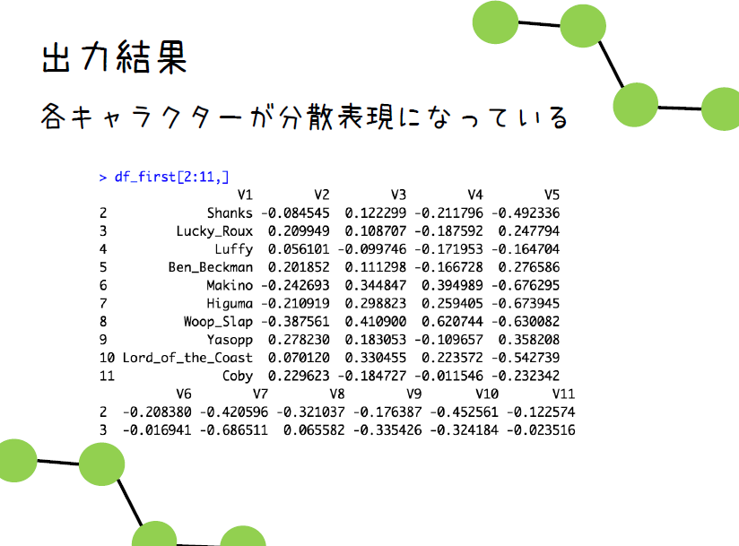

Lastly, `@wkwk_soprano` wanted to find similarities between One Piece
characters so he used cosine similarity using [this code
snippet](https://gist.github.com/wmichi/6b60b12543bfeb3205cff32d6adc3995)
which allows you to extract top ‘N’ similar items from network embedding
matrices. Taking a look at some popular characters he was somewhat
disappointed in the results as from his extensive knowledge of the story
he knew some of the character similarities just weren’t right!

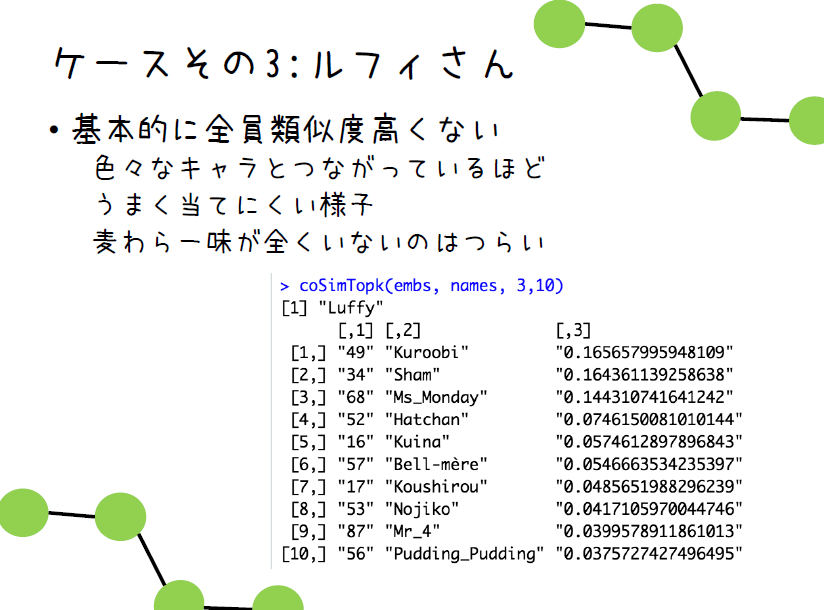

More resources on network analysis in R:

-   [Intro to Network Analysis with R - Jesse
    Sadler](https://www.jessesadler.com/post/network-analysis-with-r/)
-   [Network Centrality in R: An Introduction with {netrankr} - David
    Schoch](http://blog.schochastics.net/post/network-centrality-in-r-introduction/)

[gepuro](https://twitter.com/gepuro): Translating `tidyverse.org` into Japanese!
--------------------------------------------------------------------------------

-   [Slides](https://www.slideshare.net/gepuro/tidyverseorg)

After being involved in the Japanese translation of [Feature Engineering
for Machine Learning: Principles and Techniques for Data Scientists](http://shop.oreilly.com/product/0636920049081.do),
`@gepuro` thought about trying his hand at translating `tidyverse.org`
in Japanese!

In recent months there have been big changes in major `tidyverse`
packages such as {tidyr} and {ggplot2} with accompanying articles to
boot. These articles, especially the new pivot functions vignette, are
the ones `@gepuro` and fellow TokyoR community members such as `@Atsusy`
have started working on in the past few weeks. To do the translation
there are three key steps:

1.  Create a Github account
2.  Log into GitLocalize
3.  Access the specific GitLocalize repo where your translation project
    is located

GitLocalize looks like this:

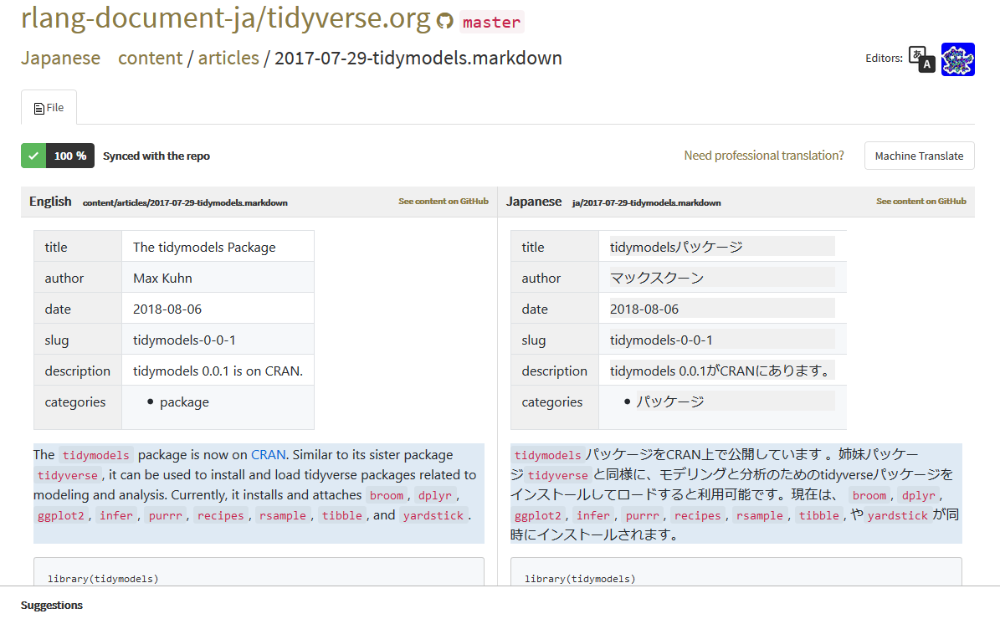

Once you’re done, you create a “Review Request” which is checked by the
maintainer `@gepuro` for any errors. He’ll receive the “Review Request”
as a Pull Request on the `R Lang Document JA` repo and if everything is
OK it’ll be merged in!

There are other ways to contribute to the project as well such as:

-   Helping to make the text sound more naturally Japanese
-   Create the blogdown website of the Japanese translation
-   Create a vocab list of common R terminology in Japanese to use as a
    reference
-   and more!

I enjoyed this talk as it was similar to the talk by Riva Quiroga on
translating the “R for Data Science” book and R data sets into Spanish
that I heard at user!2019 a few weeks ago (the talk is covered in my
[blogpost
here](https://ryo-n7.github.io/2019-07-21-user2019-reflections/)). If
you’re good at English and Japanese you can join the \#translation
channel on the [Tokyo.R slack](https://r-wakalang.slack.com)!

In other news, there was an announcement that this year’s [Japan.R
Conference](http://japanr.net/) will be on December 7th!

Other Talks
-----------

-   [airspace\_nobo: Use Python from
    R!](https://speakerdeck.com/airspace_nobo/use-r-from-python)
-   [kodachan: Proxy authentication with R!]()
-   [k871: R in a Traditional Japanese Manufacturing Company!]()

Food, Drinks, and Conclusion
============================

`TokyoR` happens almost monthly and it’s a great way to mingle with
Japanese R users as it’s the largest regular meetup here in Japan. We’re
finally taking a break next month so the next meetup will be on
__September 28__ and it will be a special session in **{Shiny}**!

Talks in English are also welcome so if you’re ever in Tokyo come join
us!
