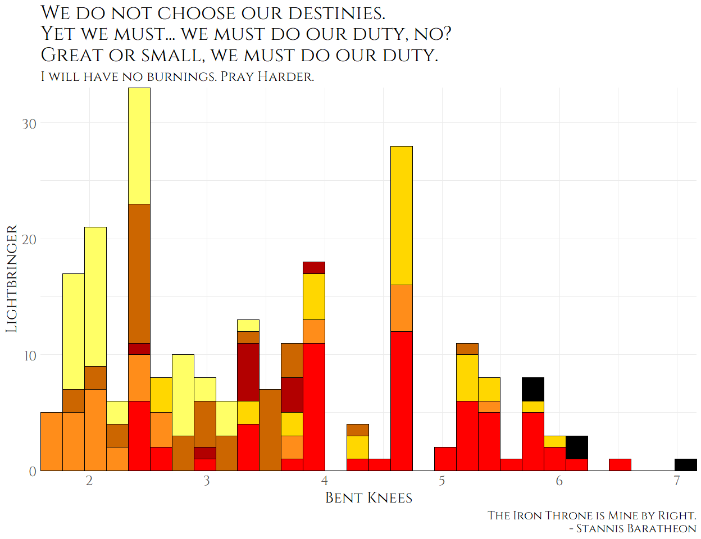
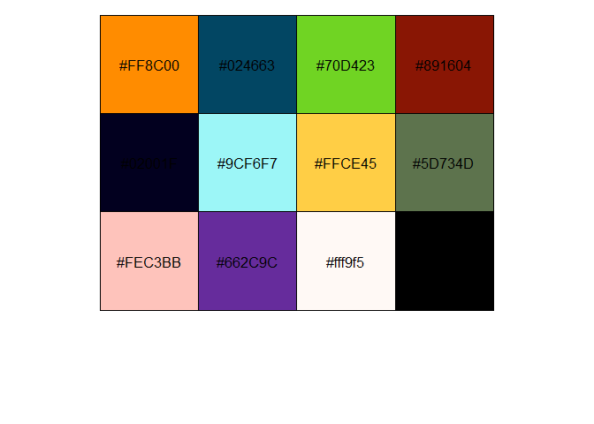
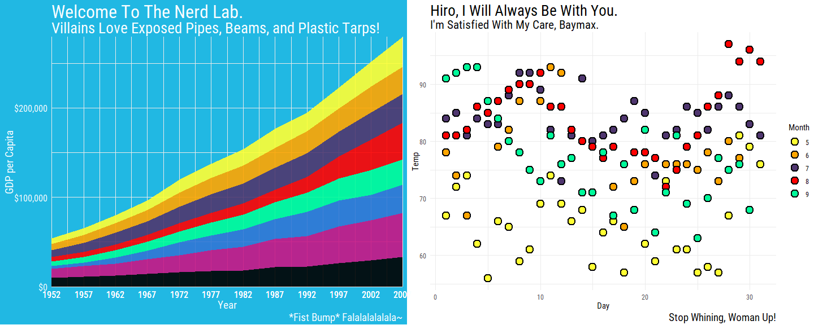
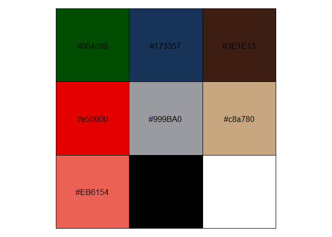
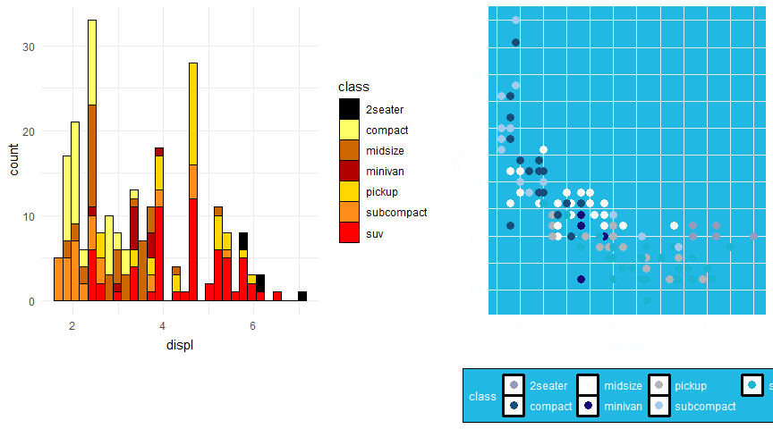
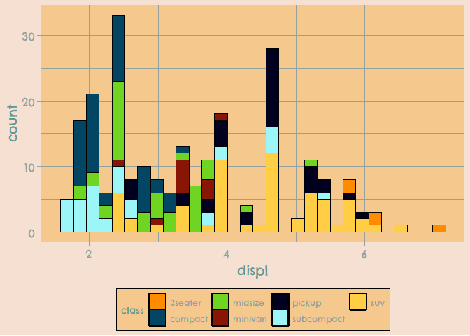

`tvthemes` v1.0.0 is **finally** on CRAN! After a long summer of
procrastination, [useR
Conference](https://ryo-n7.github.io/2019-07-21-user2019-reflections/),
[soccer
viz](https://ryo-n7.github.io/2019-08-21-visualize-soccer-statsbomb-part-1/),
etc. and a couple of back-and-forth submissions with CRAN to fix some
issues, as of September 3rd you can finally:

``` r
install.packages("tvthemes")
library(tvthemes)
```

My first CRAN package!


If this is your first time coming across {tvthemes} then you can read
the intro blog post
[here](https://ryo-n7.github.io/2019-05-16-introducing-tvthemes-package/).
Although this new version has been out for a bit more than a month on
GitHub, in the past week or so there has been more changes related to
documentation, examples, and code. However, I’ll start off with the main
additions of interest, new palettes and themes!

<table>
<colgroup>
<col style="width: 37%" />
<col style="width: 42%" />
<col style="width: 20%" />
</colgroup>
<thead>
<tr class="header">
<th>TV Show</th>
<th>Palette(s)</th>
<th>Theme(s)</th>
</tr>
</thead>
<tbody>
<tr class="odd">
<td><a href="https://en.wikipedia.org/wiki/Game_of_Thrones">Game of Thrones</a></td>
<td>Stannis Baratheon, House Martell, House Arryn, House Manderly</td>
<td>NA</td>
</tr>
<tr class="even">
<td><a href="https://en.wikipedia.org/wiki/Kim_Possible">Kim Possible</a></td>
<td>1</td>
<td>NA</td>
</tr>
<tr class="odd">
<td><a href="https://en.wikipedia.org/wiki/Big_Hero_6:_The_Series">Big Hero 6</a></td>
<td>1</td>
<td>NA</td>
</tr>
<tr class="even">
<td><a href="https://en.wikipedia.org/wiki/Hilda_(TV_series)">Hilda</a></td>
<td>Day, Dusk, Night</td>
<td>Day, Dusk, Night</td>
</tr>
<tr class="odd">
<td><a href="https://en.wikipedia.org/wiki/Attack_on_Titan">Attack on Titan</a></td>
<td>1</td>
<td>NA</td>
</tr>
</tbody>
</table>

The One True King and Some Other Houses
---------------------------------------

Let’s start with the new additions to the `Palettes of Ice & Fire`. When
I first created the palettes for the great houses of Westeros I
immediately ran into the problem of there being so many houses that used
similar color schemes. Namely, the combinations of red, black, and
yellow/orange used in varying quantities by House Lannister, House
Targaryen, House Martell, and House Baratheon of Dragonstone. Originally I just ran away from the problem by omitting House Martell and House Baratheon of Dragonstone but I came back to it mainly because I’m a huge Stannis fan. It’s definitely not perfect and there’s still some overlap but I tried to focus more on browns and oranges for  Martell while Stannis got more brighter versions of the orange and red colors.




I’m pretty happy with the line-up for the Westerosi houses although I
may add House Bolton and House Dayne later on. A RGB color-distance tool
may help in having less problems with similar looking palettes in the
future. (Stannis: fewer problems…)

Kim Possible
------------

This was a really fun one to work on due to the great color/style
diversity seen across the characters. I’m especially a fan of Shego’s
lime-green and Doctor Drakken’s midnight-blue/navy-ish colored outfits.
Paired against Kim’s orange-red hair and khaki cargo pants color with
Ron’s burgundy jersey and dark blue shirt it makes for a great palette of
colors!

``` r
scales::show_col(tvthemes:::kimPossible_palette)
```


Together with the Spongebob theme it makes for a great looking graph!

``` r
## library(ggplot2)
## library(magrittr)
## library(glue)
## library(cowplot)
## library(dplyr)
## library(extrafont)
## loadfonts(quiet = TRUE)

data <- gapminder::gapminder %>% 
  filter(country %in% c("France", "Germany", "Ireland", "Italy", 
                        "Japan", "Norway", "Belarus", "United Kingdom",
                        "Peru", "Spain")) %>% 
  mutate(year = as.Date(paste(year, "-01-01", sep = "", format = '%Y-%b-%d')))

ggplot(data = data, aes(x = year, y = gdpPercap, fill = country)) +
  geom_area(alpha = 0.9) +
  scale_x_date(expand = c(0, 0),
               breaks = data$year, 
               date_labels = "%Y") +
  scale_y_continuous(expand = c(0, 0), labels = scales::dollar) +
  scale_fill_kimPossible() +
  labs(title = "What's The Sitch, Wade?",
       subtitle = glue::glue("Call Me {emo::ji('call')} Beep Me {emo::ji('pager')}  If You Wanna Reach Me {emo::ji('clap')} !"),
       caption = "Stoppable... What Are You Doing In My House??",
       x = "Year", y = "GDP per Capita") +
  theme_spongeBob(title.font = "Roboto Condensed",
                  text.font = "Roboto Condensed",
                  title.size = 24,
                  subtitle.size = 20,
                  text.size = 18,
                  legend.title.size = 14,
                  legend.text.size = 12,
                  ticks = TRUE)
```


Hilda
-----

[Hilda](https://en.wikipedia.org/wiki/Hilda_(TV_series)) is actually a
TV show that was recommended to me in the comments section of the Reddit
post of my first `tvthemes` blog post. You might know the voice actress
for the main character, Bella Ramsey, who played Lyanna Mormont in Game
of Thrones. After Googling a few images, I saw how great the color
scheme was and watched a few episodes.

<p float="left" align="center">


</p>

As above, you can see three distinct themes: Day, Dusk, and Night. They
look fantastic and so I decided to include them for this release! With
some help from previous attempts by [Matt
Shanks](http://www.mattshanks.com.au/colour-palette-reference-hilda/)
and [ChevyRay](https://pbs.twimg.com/media/DoeR9edWwAMG2hW.png) I mixed
and combined to create my own versions for each stage of the day.

<p float="left" align="center">


</p>

Some example plots:

<p float="left" align="center">


</p>

Big Hero 6
----------

Most of ya’ll might have seen [the
movie](https://en.wikipedia.org/wiki/Big_Hero_6_(film)) a couple of
years ago, but you might not know that they’ve also got an [animated TV
show](https://en.wikipedia.org/wiki/Big_Hero_6:_The_Series) too! It’s
more drawn in anime form rather than the 3D form of the movie but it
still retained its charm, humor, and of course the vivid color scheme
for our heroes!



Attack on Titan
---------------

[Attack on Titan](https://en.wikipedia.org/wiki/Attack_on_Titan) took
the USA (and the rest of the world) by storm when the first season of
the anime came out. In light of the subsequent seasons coming out
recently I decided to create a palette too.

``` r
scales::show_col(tvthemes:::attackOnTitan_palette)
```



Code Improvements
-----------------

In addition to the new palettes and themes some of the code in
`tvthemes` has changed significantly, but don’t worry most of it was
under the hood with one major exception. In palettes for example, when
you are calling the palette functions via `scale_fill_*()` or
`scale_color_*()` you now have a lot more options:

-   `palette`: This is the **biggest change** in the code for this
    release. If multiple palettes are available for a TV show, you can
    now select the palette: “Stannis”, “FireNation”, “Dusk”, etc. You
    can leave this blank if only single palette available for a certain
    TV show. This reduces the amount of functions you have to remember
    as you only need the one main `scale_*()` function and then the
    actual palette from the TV show. You can see some examples below.
-   `n`: Specifies the number of colors. If left blank it defaults to
    the total number of colors available in the palette.
-   `type`: Specifies whether you want the palette to be “Discrete” or
    “Continuous”. **NOTE**: Most palettes are only optimized for
    “Discrete” at the present time so the “Continuous” option isn’t
    available.
-   `reverse`: Specifies (`TRUE`/`FALSE`) whether to reverse the order
    of colors.

For TV shows with multiple palettes they are now organized under a
single “palette list” from which you pass the specific palette that you
want. If you want to check out the colors for these specific palettes:

``` r
## Previously:
scales::show_col(tvthemes:::lannister_palette)
scales::show_col(tvthemes:::brooklyn99_dark_palette)

## Now:
scales::show_col(tvthemes:::westeros_palette$Lannister)
scales::show_col(tvthemes:::brooklyn99_palette$Dark)
```

The specific palettes (fill/color) that changed are:

-   **Brooklyn Nine-Nine**: `scale_color_brooklyn99()`; Default =
    “Regular”, “Dark”
-   **Avatar: The Last Airbender**: `scale_color_avatarTLA()`; Default
    = “FireNation”, “EarthKingdom”, “WaterTribe”, “AirNation”
-   **Hilda**: `scale_fill_hilda()`; Default = “Day”, “Dusk”, “Night”
-   **Game of Thrones/A Song of Ice & Fire**: `scale_color_westeros()`;
    Default = “Stark”, “Stannis”, “Tyrell”, “Lannister”, “Manderly”,
    “Martell”, “Arryn”, “Greyjoy”, “Targaryen”, “Tully”

Some example code:

``` r
mannis <- ggplot(mpg, aes(displ)) +
  geom_histogram(aes(fill = class), col = "black", size = 0.1) +
  scale_fill_westeros(palette = "Stannis", n = 7, reverse = TRUE) +
  theme_minimal()

yue <- ggplot(mpg, aes(x = displ, y = cty, color = class)) +
  geom_point(size = 3) +
  scale_color_avatarTLA(palette = "WaterTribe", n = 7, reverse = TRUE) +
  theme_spongeBob()

library(patchwork)

mannis + yue
```



For themes the one change is a toggle option for axis ticks via `ticks`
which you can set to either `TRUE` and the default `FALSE`.

``` r
mpg %>% 
  ggplot(aes(displ)) +
  geom_histogram(aes(fill = class), col = "black", size = 0.1) +
  scale_fill_kimPossible(n = 5, reverse = FALSE) +
  theme_hildaDay(ticks = TRUE)
```


CRAN Trial(s) and Error(s) and Future Releases
----------------------------------------------

I mentioned in the last {tvthemes} blog post about [Jim Hester’s
video](https://www.youtube.com/watch?v=-zID-rVDEHQ) on preparing and
going through with a CRAN release. I tried to emulate him using
`usethis::use_release()` but unfortunately it didn’t work as I don’t
think I had the `gh::gh()` credentials set up properly. Instead, I just
followed along Jim’s video as he checked items off on the Github issue
on his screen.

A problem I came up against initially was that I was using the {emo} and
{patchwork} packages in the example plots for the README and as you
might know, having packages via “remotes”/GitHub aren’t allowed as
dependencies for CRAN packages. So the workaround I had to do was keep
the code but **not** evaluate it (eval=FALSE in the RMD chunk) and add
imgur links for the plots so I could delete the packages from the
“Suggests” section in the DESCRIPTION.

Some other silly CRAN mistakes that I made:

-   The title in DESCRIPTION wasn’t in title case
-   Not wrapping names of packages/software/API names with ‘single
    quotes’
-   Using fully specified URL when including HTML links

The ‘fully specified URL’ thing took me a while to figure out as I
included a lot of links throughout the README and it was hard to find
where a `/` was needed!

I screwed up and had to resubmit quite a number of times but I think
it’s important to document failures and the bumps along the road as
well. Also, I did add a few more tests but as you can see from the
`codecov` badge there wasn’t much added in terms of breadth but more in
terms of depth!

In terms of function names you’ve all seen by now that they follow the
camelCase style after the initial `theme_` and `scale_*_`. However I
realized that not all the functions follow this styling which is …
rather embarrassing on my part. The prime culprits are all the
`import_font_*()` functions although I make the excuse that they started
off as imports of {hrbrthemes}’s font functions and grew out from there.
However, one egregious mishap happened with `theme_parksAndRec_light()`
which really should be `theme_parksAndRecLight()` instead. As a
solution, the former is now deprecated (via a `.Deprecated()` call) in
favor of the latter; the original `_light()` version will be deleted in
the next major release, `v2.0.0`.

This mistake had me really thinking hard about the naming conventions
used throughout the package and I will have to make some hard decisions
concerning whether to keep certain names or even do away with camelCase
for the next major release. For example, I have been thinking about
changing `theme_theLastAirbender()` to `theme_avatar()` or something a
lot shorter and memorable. My original intention was to use ‘Avatar’
more prominently in the names but well… for most people that evokes the
3D blue aliens from a certain James Cameron film… One thing I am more
sure about is changing `scale_*_avatarTLA()` to
`scale_*_lastAirbender()` as the current one just seems wonky to type.
Ultimately the solution might just be to rename both to use
`_lastAirbender()` instead!

Don’t worry though as these changes (if any) won’t be fully implemented
until the next big version change and I will make sure to deprecate the
old functions in the minor releases leading up to `v2.0.0`! If you feel
strongly about any of the above, have any suggestions for new TV shows,
or find any bugs then please let me know on
[GitHub](https://github.com/Ryo-N7/tvthemes/) or on
[Twitter](https://twitter.com/R_by_Ryo/). I hope you enjoy the new CRAN
version of {tvthemes}!
