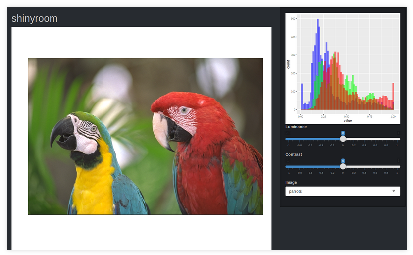

As another sweltering summer ends, another TokyoR Meetup! With global
warming in full swing and it still being around 30 degrees at the end of
September, this month’s meetup was held at [DIP
Corporation](https://www.dip-net.co.jp/), an personnel/recruitment
services company, in their headquarters in Roppongi, Tokyo. This month’s
session was another special-themed session involving [Shiny
apps](https://shiny.rstudio.com/)!

In line with my previous round up posts:

-   [TokyoR
    \#76](https://ryo-n7.github.io/2019-03-07-tokyoR-76-roundup/)
-   [TokyoR \#77](https://ryo-n7.github.io/2019-04-24-tokyoR-77/))
-   [TokyoR
    \#78](https://ryo-n7.github.io/2019-05-31-tokyoR-78-roundup/)
-   [TokyoR
    \#79](https://ryo-n7.github.io/2019-07-05-tokyoR-79-roundup/)
-   [TokyoR
    \#80](https://ryo-n7.github.io/2019-08-02-tokyoR-80-roundup/)

I will be going over around half of all the talks. Hopefully, my efforts
will help spread the vast knowledge of Japanese R users to the wider R
community. Throughout I will also post helpful blog posts and links from
other sources if you are interested in learning more about the topic of
a certain talk. You can follow **Tokyo.R** by searching for the
[\#TokyoR](https://twitter.com/hashtag/TokyoR) hashtag on Twitter.

Anyways…

Let’s get started!

BeginneR Session
================

As with every [TokyoR](http://tokyor.connpass.com/) meetup, we began
with a set of beginner user focused talks:

-   [R Basics by
    kilometer0101](https://speakerdeck.com/kilometer/tokyo-dot-r-number-81-introduction-and-demonstration)
-   [Shiny for Beginners by
    kyyonko](https://speakerdeck.com/kyyonko/di-81hui-tokyor-chu-xin-zhe-setusiyon2-hazimetefalseshiny-80e4f56b-198d-4d7d-a4e0-df1097aa226d)

Main Talks
==========

[hoxo\_m](https://twitter.com/hoxo_m): Asynchronous Programming for Shiny!
--------------------------------------------------------------------------

-   [Slides](https://www.slideshare.net/hoxo_m/shiny-177170789)

`@hoxo_m` of HOXO-M Inc. talked about asynchronous programming with
Shiny. Starting off with an introduction into the history of single and
multi-threading in both R and how the growing popularity of Shiny has
lead to a demand for multithreadedness to cater to the multitude of
users using a Shiny app at once!

The main package that facilitates this in both R and Shiny is the
{future} package which allows one to be able to evaluate R expressions
asynchronously (in parallel or concurrently on a cluster). By using
{future} in a Shiny context you can shift resource-intensive tasks (ex.
grabbing data from an API) activated by one user into another process
and free up time for other users’ tasks and reduce their waiting time.

The `plan()` function allows you to choose from a variety of options for
launching/attaching R processes. The choices are `multosession`,
`multicore`, and `multiprocess`. You can read more about it
[here](https://rstudio.github.io/promises/articles/futures.html#choosing-a-launch-method).

There’s not a whole lot you need to do to grab the results from another
process as all the `render_*()` are able to take “promise” objects. As a
reminder, a “promise” in this context is an object that takes a result
from an asynchronous process that happens later/slightly later. A
“promise” objects takes the result from a {future} code result and it
will wait until a result appears from another process finishes running
the code.

Another important component of the asynchronous framework in R is the
{promises} package. It’s this package that allows for the actual
abstractions within your R code for asynchronous programming such as the
“promise pipe”, `%...>%`! You insert whatever long task code you have
into the `future()` function then use the “promise pipe” to pass it to
the rest of the code. As a future/promise object is not a data frame you
can’t pass `filter()` or other functions to it, so you have to pass the
“promise pipe” first before other regular functions can be run.

In a Shiny context, you can’t use reactives inside a `future()` function
so one needs to assign a reactive as an object before the `future()`
code and then pass that object into the function.

You also need to carefully think about **WHERE** (as in which process)
the code is running. For example in the code below, the results are the
same in both the top and bottom code. The code in black is done by the
main process while the code in green is done by another process.

Although the above code works in both cases, for some functions such as
`plot()` and `print()` can be run in another process and but their
output can **not** be returned by the main process. The solution is to
use the “promise pipe” to make sure that `plot()`/`print()` is being run
by the main process instead. On the other hand you can still use
promises within `observer*()` and `eventReactive*()`/`reactive()` code,
you just have to remember to use the “promise pipes”.

-   [{promises} and
    Shiny](https://rstudio.github.io/promises/articles/shiny.html)
-   [{future} overview
    vignette](https://cran.r-project.org/web/packages/future/vignettes/future-1-overview.html)

[Np\_Ur](https://twitter.com/Np_Ur_): A Simple Shiny App in 30 Minutes!
-----------------------------------------------------------------------

-   [Slides](https://github.com/chan-ume/tokyoR81)

`@Np_Ur` is known in the Japan community for his love of {shiny}, he
even wrote a book on it called “Building Web Applications in R with
Shiny”. This presentation was largely a demonstration as `@Np_Ur`
explained, from the ground up, a lot of the basic functions that can get
you a working Shiny app in the space of 30 minutes! From creating a
navigation bar via `navbarPage()` to creating different drop-down
options for customizing a plot and talking about extra functionality
from other packages such as {DT} and {shinycssloaders}, `@Np_Ur` took us
through the code and showed us completed Shiny apps for each step of the
way.

I recommend going through his slides (also hosted on Shiny) as well as
checking out the code for each of the Shiny apps he made for all
different functionalities he talked about by clicking on the link below!

-   [Code for all Shiny Apps](https://github.com/chan-ume/tokyoR81)

[kashitan](https://twitter.com/kashitan/): Making {shiny} Maps with {leaflet}!
------------------------------------------------------------------------------

-   [Slides](https://www.slideshare.net/kashitan/shinyleaflettips-177070514)

`@kashitan` presented some tips (that you normally won’t see in
books/articles) for using {leaflet} with Shiny for map applications! He
took us through four different functions that he found very useful for
making {leaflet} maps with Japan census data.

The first function: `updateSelectInput()` allows you to update a
drop-down menu with new values after selecting a certain input. In
`@kashitan`’s case using the Japan census Shiny app, he wanted to be
able to update the choices of the city/district after choosing a
different prefecture on the app. Using the `updateSelectInput()`
function the list of choices from the drop down menu updates to the
city/districts of the newly chosen prefecture!

You can check out the documentation
[here](https://shiny.rstudio.com/reference/shiny/1.2.0/updateSelectInput.html).

The second function: `leafletProxy()` allows you to customize a
{leaflet} map even after it has been rendered by Shiny. For `@kashitan`
this was necessary as he didn’t want the map’s active zoom level and
center coordinates to change even after choosing a new prefecture to
look at.

The third function: `fitBounds()` allows you to set the boundaries of
the map. For `@kashitan` similar to the previous function shown, he
wanted the bounds to the view, following a change in the city/district,
to always be within a certain bounding box.

The last function: `input${id}shape_click` shows you information about
the polygon shape of the map you just clicked. {leaflet}’s “click” event
currently only shows you the coordinate and `id` values from this
function.

-   [RStudio’s {leaflet} Guide](https://rstudio.github.io/leaflet/)
-   [Leaflet in R: Tips & Tricks for Interactive Maps - Jindřich
    Lacko](https://www.jla-data.net/eng/leaflet-in-r-tips-and-tricks/index.html)

[okiyuki](https://twitter.com/okiyuki99): Software Engineering for Shiny!
-------------------------------------------------------------------------

-   [Slides](https://speakerdeck.com/okiyuki99/190928-tokyor81-shiny)

`@okiyuki` presented on the various R packages used for the software
engineering that goes into supporting Shiny apps.

-   [{memoise}](https://github.com/r-lib/memoise): Caches data when
    certain function is run for the first time (useful for dashboard
    shiny apps where similar use cases can be predicted)
-   [{pool}](https://github.com/rstudio/pool): Easy database connection
    management in an interactive context. After inserting/accessing SQL
    database connection info, the connection is closed when app itself
    closes!
-   [{shinyProxy}](https://www.shinyproxy.io/): Deploy Shiny apps with
    LDAP authentication/authorization and TLS protocols for an
    enterprise context. It uses Docker so that each user is using the
    app in their own single Docker container.
-   [{shinyloadtest}](https://rstudio.github.io/shinyloadtest/): Helps
    analyze load tests and Shiny app performance with multiple users.

`@okiyuki` also talked about some of his personal struggles and pitfalls
that he’s come across when building Shiny apps at work. These include:

-   Deployed on ShinyServer but there was an error! Even though it was
    working fine a minute ago!
    -   **Solution**: Use {Shinytest} and {testthat} to test deployment
        and other actions in Shiny
-   Unknowingly/unintentionally using functions from a different
    namespace
    -   **Solution**: Make sure to explicitly `::` your functions
    -   Also restart your app via altering `restart.txt` in your Shiny
        app directory

An extra section talked about various helpful packages for Shiny app
aesthetics such as:

-   [{shinycssloaders}](https://github.com/andrewsali/shinycssloaders):
-   [{shinyace}](https://github.com/trestletech/shinyAce):
-   [dreamRs](https://github.com/dreamRs)’ suite of Shiny packages such
    as {shinyWidgets}
-   I introduced some of dreamRs’ packages in my useR!2019 blog post
    [here](https://ryo-n7.github.io/2019-07-21-user2019-reflections/).
-   Various packages to create Shiny Templates: {bs4dash},
    {shinymaterial}, {fullpage}, {shiny.semantic}

LTs
===

[igjit](https://twitter.com/igjit): Edit Your Photos with {shinyroom}!
----------------------------------------------------------------------

-   [Slides](https://igjit.github.io/slides/2019/09/shinyroom/#/)

You might remember from a few months back, `@igjit` presented on “RAW
image processing with R” ([TokyoR
\#79](https://ryo-n7.github.io/2019-07-05-tokyoR-79-roundup/)).
Continuing where he left off he decided to create a photo-editing UI
using the power of {shiny}. Motivated by comments following the previous
presentation, `@igjit` decided to base it on “Adobe Lightroom”, and call
it the {shinyroom} package. You can take a look at it
[here](https://shinyroom.herokuapp.com/).

In terms of actually building the Shiny app he used the {imager} package
for the actual photo editing functionality while {golem} was used as the
package framework for the app. For appearances `@igjit` used the
{shinythemes} package

During the course of building the app, `@igjit` came across a peculiar
problem concerning the screen when the Shiny app was busy. By default, a
particular panel becomes slightly opaque when the server is busy doing
stuff in the background but this is annoying when you are working on
editing images. To get around this problem, `@igjit` created another
package called {shinyloadermessage} so that instead of the screen
graying out a small message will appear instead.

-   [Building Big Shiny Apps - A Workflow (Colin Fay, Vincent Guyader,
    Cervan Girard, Sebastien
    Rochette)](https://thinkr-open.github.io/building-shiny-apps-workflow/)
-   [{shinyloadermessage}: Loader messages for Shiny
    outputs](https://github.com/igjit/shinyloadermessage)
-   [{shinybusy}: For minimal busy indicator in Shiny
    apps](https://github.com/dreamRs/shinybusy)

[flaty13](https://twitter.com/flaty13): Reproducible Shiny with {shinymeta}!
----------------------------------------------------------------------------

-   [Slides](https://docs.google.com/presentation/d/1aHRVEE05L7HO90TsTTFNsJZsVH-oI2umYlNR3NuXbac/edit)

`@flaty13` talked about the recently made public {shinymeta} package and
reproducibility with Shiny apps. This is a topic that has taken a while
to develop due to the complexity of the issue, where the end goal was to
find a way to document and describe the actions of users who interacted
with very dynamic Shiny apps with many different features. With the
{shinymeta} package you can now download R scripts highlight the steps
you took in interacting with the app.

The next step that is currently in development is to output an `.RMD`
report among a number of other features as the package is still in the
experimental phase. See the resources below for more details, especially
Joe Cheng’s keynote for all the stuff under-the-hood that’s making this
exciting new development possible!

-   [{shinymeta} Github page](https://github.com/rstudio/shinymeta)
-   [Summary of {shinymeta} from useR!2019 blog
    post](https://ryo-n7.github.io/2019-07-21-user2019-reflections/)
-   [“Shiny’s Holy Grail: Interactivity with Reproducibility”: Joe
    Cheng’s useR!2019
    Keynote](https://www.youtube.com/watch?v=mhDxTIz0-0M)

Other talks
===========

-   [y\_\_mattu](https://twitter.com/y__mattu/): [Finding info about my
    favorite band]()
-   [Ikeda](): [A jack-of-all-trades statistic app for intra-company
    use!]()
-   [kos59125](https://twitter.com/kos59125/): [Interactive Presentation
    with
    Shiny](https://github.com/kos59125/interactive-presentation-shiny)
-   [ao](): [A Shiny app for pharmacokinetic simulations]()

Food, Drinks, and Conclusion
============================

`TokyoR` happens almost monthly and it’s a great way to mingle with
Japanese R users as it’s the largest regular meetup here in Japan. The
next meetup will be on [October
26](https://tokyor.connpass.com/event/150469/) and I will also be one of
the presenters!

Talks in English are also welcome so if you’re ever in Tokyo come join
us!
