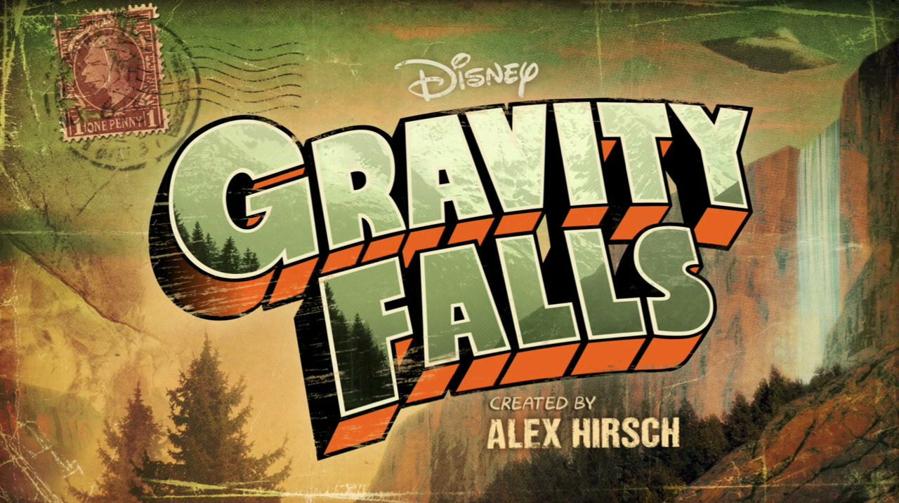
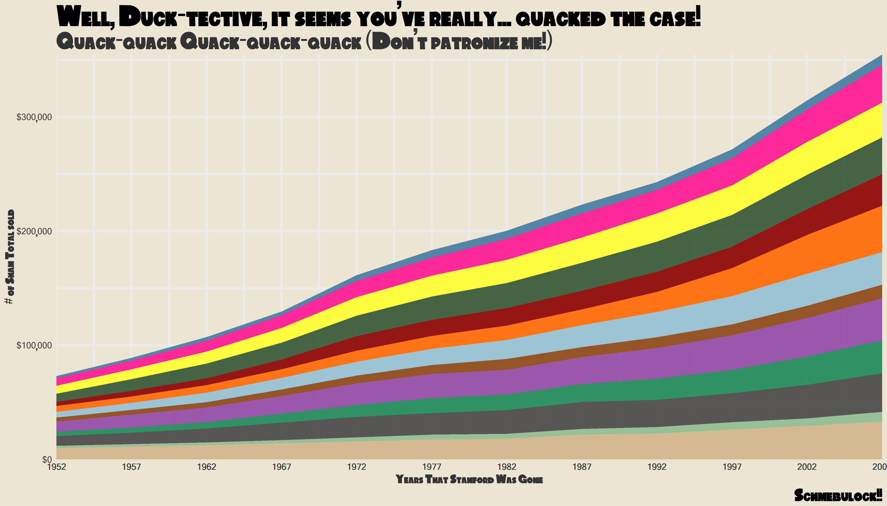
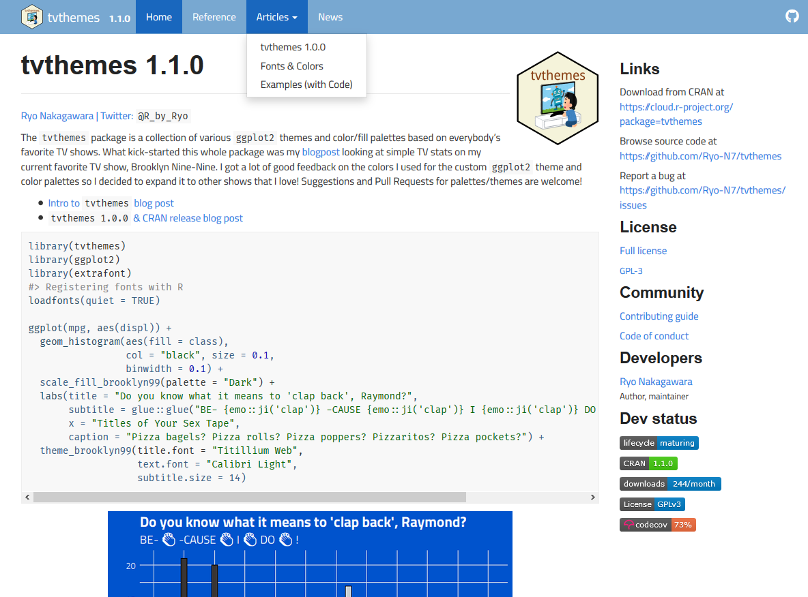
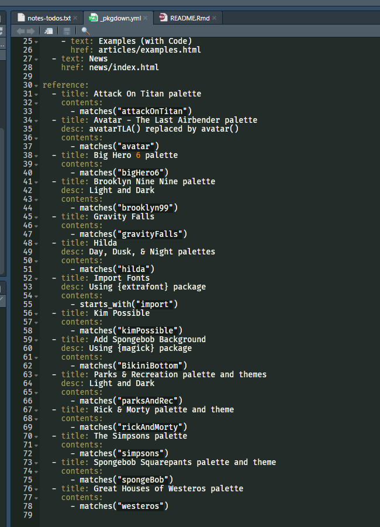
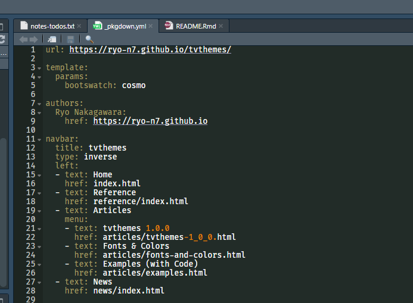
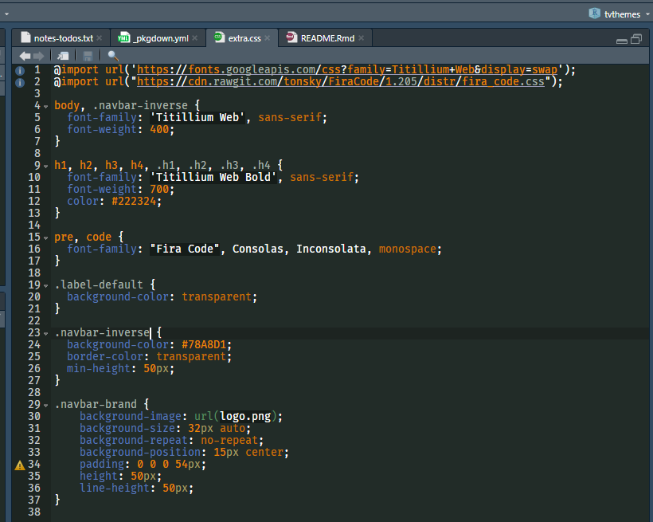

The newest version of {tvthemes} is now on CRAN! v1.1.0 features one new
palette (Gravity Falls), vignettes, renamed functions, and a [nice
pkgdown website](https://ryo-n7.github.io/tvthemes/).

``` r
install.packages("tvthemes") # v1.1.0
library(tvthemes)
```

Gravity Falls
-------------

Let’s start off with the main item of interest, the “Gravity Falls”
palette.



``` r
scales::show_col(tvthemes:::gravityFalls_palette)
```


A new font, “Gravitation Falls”, is also included which is a fan-made
font by [“MaxiGamer” on
DeviantArt](https://www.deviantart.com/maxigamer/art/Gravitation-Falls-FONT-Download-Now-570477154).
You can install it by running, `import_gravitationFalls()`.

Altogether what you get is something like this:

``` r
library(dplyr)
library(ggplot2)
library(extrafont)
loadfonts(quiet = TRUE)

data <- gapminder::gapminder %>% 
  filter(country %in% c("Ireland", "Italy", "Turkey", "France", "Germany", 
                        "Brazil", "Mexico", "Sweden", "Netherlands",
                        "Greece", "Spain", "Finland", "United Kingdom")) %>% 
  mutate(year = as.Date(paste(year, "-01-01", sep = "", format = '%Y-%b-%d')),
         image = "")

ggplot(data = data, aes(x = year, y = gdpPercap, fill = country)) +
  geom_area(alpha = 0.9) +
  scale_x_date(expand = c(0, 0), breaks = data$year, date_labels = "%Y") +
  scale_y_continuous(expand = c(0, 0), labels = scales::dollar) +
  scale_fill_gravityFalls(reverse = FALSE) +
  labs(title = stringr::str_wrap("Well, Duck-tective, it seems you've really... quacked the case!", width = 70),
       subtitle = "Quack-quack Quack-quack-quack (Don't patronize me!)",
       caption = "Schmebulock!!",
       x = "Years That Stanford Was Gone", y = "# of Sham Total sold") +
  theme_avatar(title.font = "Gravitation Falls",
               text.font = "Gravitation Falls",
               title.size = 24,
               subtitle.size = 20,
               text.size = 18,
               legend.position = "none")
```



Renamed functions
-----------------

I mentioned in the previous tvthemes post
[here](https://ryo-n7.github.io/2019-09-06-tvthemes-CRAN-announcement/)
about the fact that I needed to do some tinkering with some of the
function names as they were a bit inconsistent. This version goes a long
way to fixing some of those problems. Don’t worry though as the old
incorrect functions are only deprecated and won’t be completely deleted
until later.

The TV show that changed most was the “Avatar: The Last Airbender” set
of functions.

-   `scale_*_avatarTLA()` is now: `scale_*_avatar()`
-   `theme_theLastAirbender()` is now: `theme_avatar()`

Meanwhile a few font functions were renamed to fit the `*_camelCase()`
style:

-   `import_titillium_web()` is now: `import_titilliumWeb()`
-   `import_roboto_condensed()` is now: `import_robotoCondensed()`
-   `import_ChelseaMarket()` is now: `import_chelseaMarket()`

With the exception of `import_ChelseaMarket()` all the functions are
deprecated rather than deleted.

Vignettes
---------

Instead of having an abnormally long README on Github I chopped it up
into a few vignettes:

-   [Examples](https://ryo-n7.github.io/tvthemes/articles/examples.html):
    Shows the actual code used for the plots made with each
    palette/theme seen in the README
-   [Fonts &
    Colors](https://ryo-n7.github.io/tvthemes/articles/fonts-and-colors.html):
    A short explanation about installing fonts and accessing the color
    palettes
-   [tvthemes
    1.0.0](https://ryo-n7.github.io/tvthemes/articles/tvthemes-1_0_0.html):
    Short summary of the big changes made in the CRAN version 1.0.0

To create one you need to:

``` r
usethis::use_vignette(name = "name_of_vignette_file",
                      title = "title_of_vignette")
```

…and start typing away!

Creating a pkgdown website
--------------------------

Along with the vignettes I also created a pkgdown website to house all
of the documentation. Using {pkgdown} is an extremely easy process which
mainly takes two functions to get up and running (this is assuming you
have all your documentation written up of course).

``` r
usethis::use_pkgdown()
pkgdown::build_site()
```

You do need to go into your Github repo settings and set the “Github
pages” source to be set to your ‘master branch /docs’ folder but for
actual R related code the above is all you really need!



A nice template is already set up based on the documentation you have
already with:

-   Home: Taken from your `README.md` with extra package info (badges,
    licenses, download links, etc.) on a sidebar to the right
-   Reference: Houses all your function documentation
-   Articles: Houses your vignettes/articles
-   Changelog: Shows your `NEWS.md`

To optimize your website you can fiddle with the `_pkgdown.yml` and
`extra.css` files. You can set a number of things in the pkgdown YAML
file such as setting the exact URL of the website, assigning a CSS
template, and even reorganizing the contents in your pages. The last
part is especially helpful for {tvthemes} where a lot of functions need
to be grouped up in the documentation for clarity. You can set up each
group with a `title` and then making sure the contents match up using
the `matches()`, `starts_with()`, group of functions which you might be
familiar with from {dplyr}.



You can also configure the contents of the navigation bar along the top
from the YAML file. You can add a title to each item as well as order
the items in the bar and any drop-down menus in any way you like.



In terms of a CSS template I added in the [“Cosmo”
theme](https://bootswatch.com/cosmo/) from
[Bootswatch](https://bootswatch.com/). You can add these by specifying
the stylesheet and theme in the YAML file. Have a look around at other
packages’ `_pkgdown.yml` file to see what kind of stylesheets they use
as that’s how I found Bootswatch. You can also include an `extra.css`
file inside your `/docs` folder to customize your website template even
further.



The font I used for the code throughout the website are the “Fira Code”
ligatures which are the same ones that I use in RStudio, I highly
recommend it. I don’t know much about CSS so I basically just cobbled
this together from what a number of other packages had, lots of
trial-and-error!

Conclusion
----------

This version included only one new palette as it was largely focused on
correcting previous mistakes and improving the documentation
significantly with the creation of the package website. I am hoping for
the next few releases to have more palettes and themes.

You can find the new website [here](https://ryo-n7.github.io/tvthemes/)
and the CRAN page [here](https://cran.r-project.org/package=tvthemes)!
