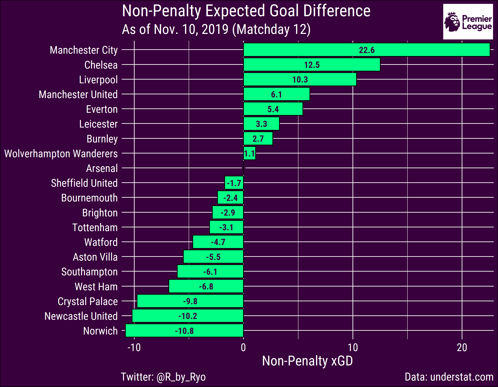
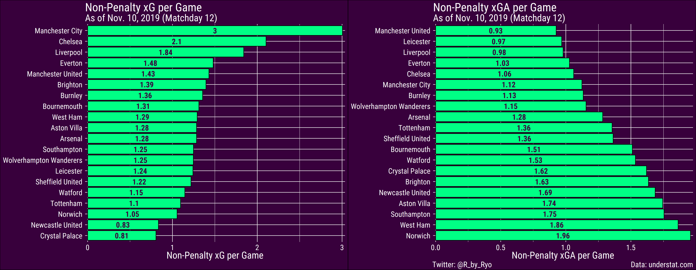
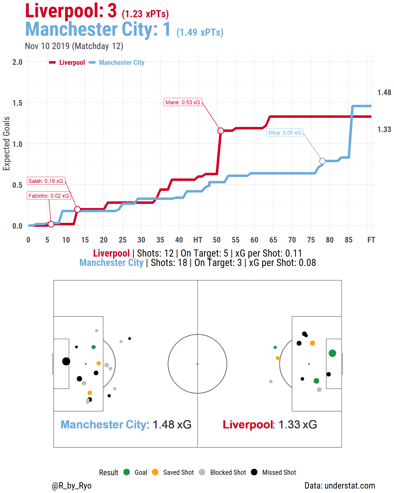
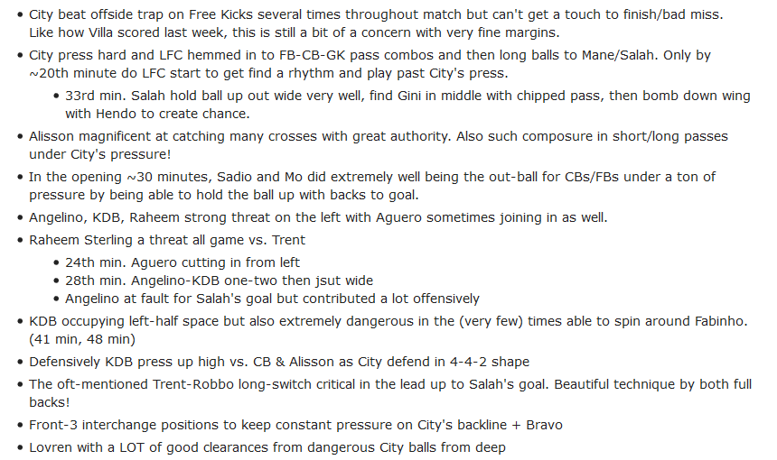

It’s the November International Break and we’re around a third of the
season through in the Premier League. To break the monotony I decided to
do a blog post exploring how teams are doing so far according to a
variety of metrics such as shots, goals, xG, xPts, etc. both for and
against. For this post specifically I talk about some overall graphs and
tables based on xG and xPts. Later parts (Parts 2, 3, etc.) will look
much more closely at how teams are doing in every 15 minute interval of
games, how they’re performing offensively and defensively across
different game situations, and more. It may still be a little **early**
to do something like this but I wanted to compare in the future how
things were before the hectic holiday schedule set in (and personally,
to get more practice writing about this stuff). In any case keep in mind
that there’s only been **12** games so far.

Learning from some of my previous soccer-related blog posts ( [Exhibit
A](https://ryo-n7.github.io/2019-08-21-visualize-soccer-statsbomb-part-1/),
[Exhibit B](https://ryo-n7.github.io/2019-06-18-visualize-copa-america/)
), many of which are lengthier than an `A Song of Ice & Fire` novel,
I’ve decided against doing another blog post that is simultaneously an
analysis **and** a R programming tutorial. I’ve elected to post the R
code to get the data and create the viz in a separate file this time. As
always all the data is gathered with R, tidied with the {tidyverse}, and
the viz are created with {ggplot2} and friends.

**You can follow along with the code:
[here](https://gist.github.com/Ryo-N7/e439c5da60bb80c8c9ce646e87149e56)**

Anyways, let get started!

xPts (Expected Points) Table
============================

Expected points (expected Points, xPts, etc.) are an extension of the
expected Goals (xG) models you might be familiar with if you’ve at least
touched the surface of footy analytics. If you’re not familiar with xG
then take a quick look at my [Copa
America](https://ryo-n7.github.io/2019-06-18-visualize-copa-america/)
blog post or this article from
[FBref](https://fbref.com/en/expected-goals-model-explained/) for a
primer. Given the expected goals values each team created during a
match, one can take these values and simulate it thousands of times to
calculate the probabilities that the game will result in a
win/draw/loss. From these probabilities (match odds) we can convert them
into how many points (anywhere between 0 and 3) that a team could win
given the xG they and their opponents accumulated.

<table class="table table-condensed table-responsive" style="width: auto !important; margin-left: auto; margin-right: auto;">
<caption>
League Table by xPts
</caption>
<thead>
<tr>
<th style="border-bottom:hidden" colspan="1">
</th>
<th style="border-bottom:hidden; padding-bottom:0; padding-left:3px;padding-right:3px;text-align: center; " colspan="3">

Points

</th>
<th style="border-bottom:hidden; padding-bottom:0; padding-left:3px;padding-right:3px;text-align: center; " colspan="3">

Result

</th>
<th style="border-bottom:hidden; padding-bottom:0; padding-left:3px;padding-right:3px;text-align: center; " colspan="3">

Goals

</th>
<th style="border-bottom:hidden; padding-bottom:0; padding-left:3px;padding-right:3px;text-align: center; " colspan="3">

Expected Goals

</th>
</tr>
<tr>
<th style="text-align:left;">
Team (Actual Rank)
</th>
<th style="text-align:right;">
xPts
</th>
<th style="text-align:right;">
Points
</th>
<th style="text-align:right;">
PD
</th>
<th style="text-align:right;">
W
</th>
<th style="text-align:right;">
D
</th>
<th style="text-align:right;">
L
</th>
<th style="text-align:right;">
For
</th>
<th style="text-align:right;">
Against
</th>
<th style="text-align:right;">
GD
</th>
<th style="text-align:right;">
xG
</th>
<th style="text-align:right;">
xGA
</th>
<th style="text-align:right;">
xGD
</th>
</tr>
</thead>
<tbody>
<tr>
<td style="text-align:left;font-weight: bold;font-weight: bold;color: white;background-color: green;">
Manchester City (4)
</td>
<td style="text-align:right;font-weight: bold;font-weight: bold;color: white;background-color: green;">
28.3
</td>
<td style="text-align:right;font-weight: bold;color: white;background-color: green;">
25
</td>
<td style="text-align:right;font-weight: bold;color: white;background-color: green;">
3.3
</td>
<td style="text-align:right;font-weight: bold;color: white;background-color: green;">
8
</td>
<td style="text-align:right;font-weight: bold;color: white;background-color: green;">
1
</td>
<td style="text-align:right;font-weight: bold;color: white;background-color: green;">
3
</td>
<td style="text-align:right;font-weight: bold;color: white;background-color: green;">
35
</td>
<td style="text-align:right;font-weight: bold;color: white;background-color: green;">
13
</td>
<td style="text-align:right;font-weight: bold;color: white;background-color: green;">
22
</td>
<td style="text-align:right;font-weight: bold;color: white;background-color: green;">
36.1
</td>
<td style="text-align:right;font-weight: bold;color: white;background-color: green;">
13.5
</td>
<td style="text-align:right;font-weight: bold;color: white;background-color: green;">
22.6
</td>
</tr>
<tr>
<td style="text-align:left;font-weight: bold;font-weight: bold;color: white;background-color: green;">
Liverpool (1)
</td>
<td style="text-align:right;font-weight: bold;font-weight: bold;color: white;background-color: green;">
23.9
</td>
<td style="text-align:right;font-weight: bold;color: white;background-color: green;">
34
</td>
<td style="text-align:right;font-weight: bold;color: white;background-color: green;">
-10.1
</td>
<td style="text-align:right;font-weight: bold;color: white;background-color: green;">
11
</td>
<td style="text-align:right;font-weight: bold;color: white;background-color: green;">
1
</td>
<td style="text-align:right;font-weight: bold;color: white;background-color: green;">
0
</td>
<td style="text-align:right;font-weight: bold;color: white;background-color: green;">
28
</td>
<td style="text-align:right;font-weight: bold;color: white;background-color: green;">
10
</td>
<td style="text-align:right;font-weight: bold;color: white;background-color: green;">
18
</td>
<td style="text-align:right;font-weight: bold;color: white;background-color: green;">
22.1
</td>
<td style="text-align:right;font-weight: bold;color: white;background-color: green;">
11.7
</td>
<td style="text-align:right;font-weight: bold;color: white;background-color: green;">
10.4
</td>
</tr>
<tr>
<td style="text-align:left;font-weight: bold;font-weight: bold;color: white;background-color: green;">
Chelsea (3)
</td>
<td style="text-align:right;font-weight: bold;font-weight: bold;color: white;background-color: green;">
23.3
</td>
<td style="text-align:right;font-weight: bold;color: white;background-color: green;">
26
</td>
<td style="text-align:right;font-weight: bold;color: white;background-color: green;">
-2.7
</td>
<td style="text-align:right;font-weight: bold;color: white;background-color: green;">
8
</td>
<td style="text-align:right;font-weight: bold;color: white;background-color: green;">
2
</td>
<td style="text-align:right;font-weight: bold;color: white;background-color: green;">
2
</td>
<td style="text-align:right;font-weight: bold;color: white;background-color: green;">
27
</td>
<td style="text-align:right;font-weight: bold;color: white;background-color: green;">
17
</td>
<td style="text-align:right;font-weight: bold;color: white;background-color: green;">
10
</td>
<td style="text-align:right;font-weight: bold;color: white;background-color: green;">
25.2
</td>
<td style="text-align:right;font-weight: bold;color: white;background-color: green;">
12.7
</td>
<td style="text-align:right;font-weight: bold;color: white;background-color: green;">
12.5
</td>
</tr>
<tr>
<td style="text-align:left;font-weight: bold;font-weight: bold;color: white;background-color: green;">
Manchester United (7)
</td>
<td style="text-align:right;font-weight: bold;font-weight: bold;color: white;background-color: green;">
23.2
</td>
<td style="text-align:right;font-weight: bold;color: white;background-color: green;">
16
</td>
<td style="text-align:right;font-weight: bold;color: white;background-color: green;">
7.2
</td>
<td style="text-align:right;font-weight: bold;color: white;background-color: green;">
4
</td>
<td style="text-align:right;font-weight: bold;color: white;background-color: green;">
4
</td>
<td style="text-align:right;font-weight: bold;color: white;background-color: green;">
4
</td>
<td style="text-align:right;font-weight: bold;color: white;background-color: green;">
16
</td>
<td style="text-align:right;font-weight: bold;color: white;background-color: green;">
12
</td>
<td style="text-align:right;font-weight: bold;color: white;background-color: green;">
4
</td>
<td style="text-align:right;font-weight: bold;color: white;background-color: green;">
17.2
</td>
<td style="text-align:right;font-weight: bold;color: white;background-color: green;">
11.1
</td>
<td style="text-align:right;font-weight: bold;color: white;background-color: green;">
6.1
</td>
</tr>
<tr>
<td style="text-align:left;font-weight: bold;font-weight: bold;color: grey;background-color: white;">
Everton (15)
</td>
<td style="text-align:right;font-weight: bold;font-weight: bold;color: grey;background-color: white;">
20.2
</td>
<td style="text-align:right;font-weight: bold;color: grey;background-color: white;">
14
</td>
<td style="text-align:right;font-weight: bold;color: grey;background-color: white;">
6.2
</td>
<td style="text-align:right;font-weight: bold;color: grey;background-color: white;">
4
</td>
<td style="text-align:right;font-weight: bold;color: grey;background-color: white;">
2
</td>
<td style="text-align:right;font-weight: bold;color: grey;background-color: white;">
6
</td>
<td style="text-align:right;font-weight: bold;color: grey;background-color: white;">
13
</td>
<td style="text-align:right;font-weight: bold;color: grey;background-color: white;">
18
</td>
<td style="text-align:right;font-weight: bold;color: grey;background-color: white;">
-5
</td>
<td style="text-align:right;font-weight: bold;color: grey;background-color: white;">
17.8
</td>
<td style="text-align:right;font-weight: bold;color: grey;background-color: white;">
12.3
</td>
<td style="text-align:right;font-weight: bold;color: grey;background-color: white;">
5.5
</td>
</tr>
<tr>
<td style="text-align:left;font-weight: bold;font-weight: bold;color: grey;background-color: white;">
Wolverhampton Wanderers (8)
</td>
<td style="text-align:right;font-weight: bold;font-weight: bold;color: grey;background-color: white;">
17.8
</td>
<td style="text-align:right;font-weight: bold;color: grey;background-color: white;">
16
</td>
<td style="text-align:right;font-weight: bold;color: grey;background-color: white;">
1.8
</td>
<td style="text-align:right;font-weight: bold;color: grey;background-color: white;">
3
</td>
<td style="text-align:right;font-weight: bold;color: grey;background-color: white;">
7
</td>
<td style="text-align:right;font-weight: bold;color: grey;background-color: white;">
2
</td>
<td style="text-align:right;font-weight: bold;color: grey;background-color: white;">
16
</td>
<td style="text-align:right;font-weight: bold;color: grey;background-color: white;">
15
</td>
<td style="text-align:right;font-weight: bold;color: grey;background-color: white;">
1
</td>
<td style="text-align:right;font-weight: bold;color: grey;background-color: white;">
15.0
</td>
<td style="text-align:right;font-weight: bold;color: grey;background-color: white;">
13.9
</td>
<td style="text-align:right;font-weight: bold;color: grey;background-color: white;">
1.1
</td>
</tr>
<tr>
<td style="text-align:left;font-weight: bold;font-weight: bold;color: grey;background-color: white;">
Leicester (2)
</td>
<td style="text-align:right;font-weight: bold;font-weight: bold;color: grey;background-color: white;">
17.8
</td>
<td style="text-align:right;font-weight: bold;color: grey;background-color: white;">
26
</td>
<td style="text-align:right;font-weight: bold;color: grey;background-color: white;">
-8.2
</td>
<td style="text-align:right;font-weight: bold;color: grey;background-color: white;">
8
</td>
<td style="text-align:right;font-weight: bold;color: grey;background-color: white;">
2
</td>
<td style="text-align:right;font-weight: bold;color: grey;background-color: white;">
2
</td>
<td style="text-align:right;font-weight: bold;color: grey;background-color: white;">
29
</td>
<td style="text-align:right;font-weight: bold;color: grey;background-color: white;">
8
</td>
<td style="text-align:right;font-weight: bold;color: grey;background-color: white;">
21
</td>
<td style="text-align:right;font-weight: bold;color: grey;background-color: white;">
14.9
</td>
<td style="text-align:right;font-weight: bold;color: grey;background-color: white;">
11.6
</td>
<td style="text-align:right;font-weight: bold;color: grey;background-color: white;">
3.3
</td>
</tr>
<tr>
<td style="text-align:left;font-weight: bold;font-weight: bold;color: grey;background-color: white;">
Burnley (10)
</td>
<td style="text-align:right;font-weight: bold;font-weight: bold;color: grey;background-color: white;">
17.7
</td>
<td style="text-align:right;font-weight: bold;color: grey;background-color: white;">
15
</td>
<td style="text-align:right;font-weight: bold;color: grey;background-color: white;">
2.7
</td>
<td style="text-align:right;font-weight: bold;color: grey;background-color: white;">
4
</td>
<td style="text-align:right;font-weight: bold;color: grey;background-color: white;">
3
</td>
<td style="text-align:right;font-weight: bold;color: grey;background-color: white;">
5
</td>
<td style="text-align:right;font-weight: bold;color: grey;background-color: white;">
17
</td>
<td style="text-align:right;font-weight: bold;color: grey;background-color: white;">
18
</td>
<td style="text-align:right;font-weight: bold;color: grey;background-color: white;">
-1
</td>
<td style="text-align:right;font-weight: bold;color: grey;background-color: white;">
16.3
</td>
<td style="text-align:right;font-weight: bold;color: grey;background-color: white;">
13.6
</td>
<td style="text-align:right;font-weight: bold;color: grey;background-color: white;">
2.7
</td>
</tr>
<tr>
<td style="text-align:left;font-weight: bold;font-weight: bold;color: grey;background-color: white;">
Brighton (11)
</td>
<td style="text-align:right;font-weight: bold;font-weight: bold;color: grey;background-color: white;">
16.5
</td>
<td style="text-align:right;font-weight: bold;color: grey;background-color: white;">
15
</td>
<td style="text-align:right;font-weight: bold;color: grey;background-color: white;">
1.5
</td>
<td style="text-align:right;font-weight: bold;color: grey;background-color: white;">
4
</td>
<td style="text-align:right;font-weight: bold;color: grey;background-color: white;">
3
</td>
<td style="text-align:right;font-weight: bold;color: grey;background-color: white;">
5
</td>
<td style="text-align:right;font-weight: bold;color: grey;background-color: white;">
15
</td>
<td style="text-align:right;font-weight: bold;color: grey;background-color: white;">
17
</td>
<td style="text-align:right;font-weight: bold;color: grey;background-color: white;">
-2
</td>
<td style="text-align:right;font-weight: bold;color: grey;background-color: white;">
16.7
</td>
<td style="text-align:right;font-weight: bold;color: grey;background-color: white;">
19.6
</td>
<td style="text-align:right;font-weight: bold;color: grey;background-color: white;">
-2.9
</td>
</tr>
<tr>
<td style="text-align:left;font-weight: bold;font-weight: bold;color: grey;background-color: white;">
Watford (18)
</td>
<td style="text-align:right;font-weight: bold;font-weight: bold;color: grey;background-color: white;">
16.1
</td>
<td style="text-align:right;font-weight: bold;color: grey;background-color: white;">
8
</td>
<td style="text-align:right;font-weight: bold;color: grey;background-color: white;">
8.1
</td>
<td style="text-align:right;font-weight: bold;color: grey;background-color: white;">
1
</td>
<td style="text-align:right;font-weight: bold;color: grey;background-color: white;">
5
</td>
<td style="text-align:right;font-weight: bold;color: grey;background-color: white;">
6
</td>
<td style="text-align:right;font-weight: bold;color: grey;background-color: white;">
8
</td>
<td style="text-align:right;font-weight: bold;color: grey;background-color: white;">
23
</td>
<td style="text-align:right;font-weight: bold;color: grey;background-color: white;">
-15
</td>
<td style="text-align:right;font-weight: bold;color: grey;background-color: white;">
13.8
</td>
<td style="text-align:right;font-weight: bold;color: grey;background-color: white;">
18.4
</td>
<td style="text-align:right;font-weight: bold;color: grey;background-color: white;">
-4.6
</td>
</tr>
<tr>
<td style="text-align:left;font-weight: bold;font-weight: bold;color: grey;background-color: white;">
Arsenal (6)
</td>
<td style="text-align:right;font-weight: bold;font-weight: bold;color: grey;background-color: white;">
15.3
</td>
<td style="text-align:right;font-weight: bold;color: grey;background-color: white;">
17
</td>
<td style="text-align:right;font-weight: bold;color: grey;background-color: white;">
-1.7
</td>
<td style="text-align:right;font-weight: bold;color: grey;background-color: white;">
4
</td>
<td style="text-align:right;font-weight: bold;color: grey;background-color: white;">
5
</td>
<td style="text-align:right;font-weight: bold;color: grey;background-color: white;">
3
</td>
<td style="text-align:right;font-weight: bold;color: grey;background-color: white;">
16
</td>
<td style="text-align:right;font-weight: bold;color: grey;background-color: white;">
17
</td>
<td style="text-align:right;font-weight: bold;color: grey;background-color: white;">
-1
</td>
<td style="text-align:right;font-weight: bold;color: grey;background-color: white;">
15.4
</td>
<td style="text-align:right;font-weight: bold;color: grey;background-color: white;">
15.4
</td>
<td style="text-align:right;font-weight: bold;color: grey;background-color: white;">
0.0
</td>
</tr>
<tr>
<td style="text-align:left;font-weight: bold;font-weight: bold;color: grey;background-color: white;">
Tottenham (14)
</td>
<td style="text-align:right;font-weight: bold;font-weight: bold;color: grey;background-color: white;">
15.3
</td>
<td style="text-align:right;font-weight: bold;color: grey;background-color: white;">
14
</td>
<td style="text-align:right;font-weight: bold;color: grey;background-color: white;">
1.3
</td>
<td style="text-align:right;font-weight: bold;color: grey;background-color: white;">
3
</td>
<td style="text-align:right;font-weight: bold;color: grey;background-color: white;">
5
</td>
<td style="text-align:right;font-weight: bold;color: grey;background-color: white;">
4
</td>
<td style="text-align:right;font-weight: bold;color: grey;background-color: white;">
18
</td>
<td style="text-align:right;font-weight: bold;color: grey;background-color: white;">
17
</td>
<td style="text-align:right;font-weight: bold;color: grey;background-color: white;">
1
</td>
<td style="text-align:right;font-weight: bold;color: grey;background-color: white;">
13.2
</td>
<td style="text-align:right;font-weight: bold;color: grey;background-color: white;">
16.3
</td>
<td style="text-align:right;font-weight: bold;color: grey;background-color: white;">
-3.1
</td>
</tr>
<tr>
<td style="text-align:left;font-weight: bold;font-weight: bold;color: grey;background-color: white;">
Bournemouth (9)
</td>
<td style="text-align:right;font-weight: bold;font-weight: bold;color: grey;background-color: white;">
14.8
</td>
<td style="text-align:right;font-weight: bold;color: grey;background-color: white;">
16
</td>
<td style="text-align:right;font-weight: bold;color: grey;background-color: white;">
-1.2
</td>
<td style="text-align:right;font-weight: bold;color: grey;background-color: white;">
4
</td>
<td style="text-align:right;font-weight: bold;color: grey;background-color: white;">
4
</td>
<td style="text-align:right;font-weight: bold;color: grey;background-color: white;">
4
</td>
<td style="text-align:right;font-weight: bold;color: grey;background-color: white;">
15
</td>
<td style="text-align:right;font-weight: bold;color: grey;background-color: white;">
15
</td>
<td style="text-align:right;font-weight: bold;color: grey;background-color: white;">
0
</td>
<td style="text-align:right;font-weight: bold;color: grey;background-color: white;">
15.7
</td>
<td style="text-align:right;font-weight: bold;color: grey;background-color: white;">
18.1
</td>
<td style="text-align:right;font-weight: bold;color: grey;background-color: white;">
-2.4
</td>
</tr>
<tr>
<td style="text-align:left;font-weight: bold;font-weight: bold;color: grey;background-color: white;">
Sheffield United (5)
</td>
<td style="text-align:right;font-weight: bold;font-weight: bold;color: grey;background-color: white;">
14.8
</td>
<td style="text-align:right;font-weight: bold;color: grey;background-color: white;">
17
</td>
<td style="text-align:right;font-weight: bold;color: grey;background-color: white;">
-2.2
</td>
<td style="text-align:right;font-weight: bold;color: grey;background-color: white;">
4
</td>
<td style="text-align:right;font-weight: bold;color: grey;background-color: white;">
5
</td>
<td style="text-align:right;font-weight: bold;color: grey;background-color: white;">
3
</td>
<td style="text-align:right;font-weight: bold;color: grey;background-color: white;">
13
</td>
<td style="text-align:right;font-weight: bold;color: grey;background-color: white;">
9
</td>
<td style="text-align:right;font-weight: bold;color: grey;background-color: white;">
4
</td>
<td style="text-align:right;font-weight: bold;color: grey;background-color: white;">
14.6
</td>
<td style="text-align:right;font-weight: bold;color: grey;background-color: white;">
16.4
</td>
<td style="text-align:right;font-weight: bold;color: grey;background-color: white;">
-1.8
</td>
</tr>
<tr>
<td style="text-align:left;font-weight: bold;font-weight: bold;color: grey;background-color: white;">
Southampton (19)
</td>
<td style="text-align:right;font-weight: bold;font-weight: bold;color: grey;background-color: white;">
13.7
</td>
<td style="text-align:right;font-weight: bold;color: grey;background-color: white;">
8
</td>
<td style="text-align:right;font-weight: bold;color: grey;background-color: white;">
5.7
</td>
<td style="text-align:right;font-weight: bold;color: grey;background-color: white;">
2
</td>
<td style="text-align:right;font-weight: bold;color: grey;background-color: white;">
2
</td>
<td style="text-align:right;font-weight: bold;color: grey;background-color: white;">
8
</td>
<td style="text-align:right;font-weight: bold;color: grey;background-color: white;">
11
</td>
<td style="text-align:right;font-weight: bold;color: grey;background-color: white;">
29
</td>
<td style="text-align:right;font-weight: bold;color: grey;background-color: white;">
-18
</td>
<td style="text-align:right;font-weight: bold;color: grey;background-color: white;">
15.0
</td>
<td style="text-align:right;font-weight: bold;color: grey;background-color: white;">
21.0
</td>
<td style="text-align:right;font-weight: bold;color: grey;background-color: white;">
-6.0
</td>
</tr>
<tr>
<td style="text-align:left;font-weight: bold;font-weight: bold;color: grey;background-color: white;">
Aston Villa (17)
</td>
<td style="text-align:right;font-weight: bold;font-weight: bold;color: grey;background-color: white;">
12.7
</td>
<td style="text-align:right;font-weight: bold;color: grey;background-color: white;">
11
</td>
<td style="text-align:right;font-weight: bold;color: grey;background-color: white;">
1.7
</td>
<td style="text-align:right;font-weight: bold;color: grey;background-color: white;">
3
</td>
<td style="text-align:right;font-weight: bold;color: grey;background-color: white;">
2
</td>
<td style="text-align:right;font-weight: bold;color: grey;background-color: white;">
7
</td>
<td style="text-align:right;font-weight: bold;color: grey;background-color: white;">
17
</td>
<td style="text-align:right;font-weight: bold;color: grey;background-color: white;">
20
</td>
<td style="text-align:right;font-weight: bold;color: grey;background-color: white;">
-3
</td>
<td style="text-align:right;font-weight: bold;color: grey;background-color: white;">
15.4
</td>
<td style="text-align:right;font-weight: bold;color: grey;background-color: white;">
20.9
</td>
<td style="text-align:right;font-weight: bold;color: grey;background-color: white;">
-5.5
</td>
</tr>
<tr>
<td style="text-align:left;font-weight: bold;font-weight: bold;color: grey;background-color: white;">
Crystal Palace (12)
</td>
<td style="text-align:right;font-weight: bold;font-weight: bold;color: grey;background-color: white;">
12.4
</td>
<td style="text-align:right;font-weight: bold;color: grey;background-color: white;">
15
</td>
<td style="text-align:right;font-weight: bold;color: grey;background-color: white;">
-2.6
</td>
<td style="text-align:right;font-weight: bold;color: grey;background-color: white;">
4
</td>
<td style="text-align:right;font-weight: bold;color: grey;background-color: white;">
3
</td>
<td style="text-align:right;font-weight: bold;color: grey;background-color: white;">
5
</td>
<td style="text-align:right;font-weight: bold;color: grey;background-color: white;">
10
</td>
<td style="text-align:right;font-weight: bold;color: grey;background-color: white;">
16
</td>
<td style="text-align:right;font-weight: bold;color: grey;background-color: white;">
-6
</td>
<td style="text-align:right;font-weight: bold;color: grey;background-color: white;">
9.7
</td>
<td style="text-align:right;font-weight: bold;color: grey;background-color: white;">
19.4
</td>
<td style="text-align:right;font-weight: bold;color: grey;background-color: white;">
-9.7
</td>
</tr>
<tr>
<td style="text-align:left;font-weight: bold;color: white;background-color: red;">
West Ham (16)
</td>
<td style="text-align:right;font-weight: bold;color: white;background-color: red;">
11.5
</td>
<td style="text-align:right;color: white;background-color: red;">
13
</td>
<td style="text-align:right;color: white;background-color: red;">
-1.5
</td>
<td style="text-align:right;color: white;background-color: red;">
3
</td>
<td style="text-align:right;color: white;background-color: red;">
4
</td>
<td style="text-align:right;color: white;background-color: red;">
5
</td>
<td style="text-align:right;color: white;background-color: red;">
14
</td>
<td style="text-align:right;color: white;background-color: red;">
20
</td>
<td style="text-align:right;color: white;background-color: red;">
-6
</td>
<td style="text-align:right;color: white;background-color: red;">
15.5
</td>
<td style="text-align:right;color: white;background-color: red;">
22.3
</td>
<td style="text-align:right;color: white;background-color: red;">
-6.8
</td>
</tr>
<tr>
<td style="text-align:left;font-weight: bold;color: white;background-color: red;">
Newcastle United (13)
</td>
<td style="text-align:right;font-weight: bold;color: white;background-color: red;">
9.5
</td>
<td style="text-align:right;color: white;background-color: red;">
15
</td>
<td style="text-align:right;color: white;background-color: red;">
-5.5
</td>
<td style="text-align:right;color: white;background-color: red;">
4
</td>
<td style="text-align:right;color: white;background-color: red;">
3
</td>
<td style="text-align:right;color: white;background-color: red;">
5
</td>
<td style="text-align:right;color: white;background-color: red;">
11
</td>
<td style="text-align:right;color: white;background-color: red;">
18
</td>
<td style="text-align:right;color: white;background-color: red;">
-7
</td>
<td style="text-align:right;color: white;background-color: red;">
10.0
</td>
<td style="text-align:right;color: white;background-color: red;">
20.2
</td>
<td style="text-align:right;color: white;background-color: red;">
-10.2
</td>
</tr>
<tr>
<td style="text-align:left;font-weight: bold;color: white;background-color: red;">
Norwich (20)
</td>
<td style="text-align:right;font-weight: bold;color: white;background-color: red;">
8.3
</td>
<td style="text-align:right;color: white;background-color: red;">
7
</td>
<td style="text-align:right;color: white;background-color: red;">
1.3
</td>
<td style="text-align:right;color: white;background-color: red;">
2
</td>
<td style="text-align:right;color: white;background-color: red;">
1
</td>
<td style="text-align:right;color: white;background-color: red;">
9
</td>
<td style="text-align:right;color: white;background-color: red;">
11
</td>
<td style="text-align:right;color: white;background-color: red;">
28
</td>
<td style="text-align:right;color: white;background-color: red;">
-17
</td>
<td style="text-align:right;color: white;background-color: red;">
12.7
</td>
<td style="text-align:right;color: white;background-color: red;">
23.5
</td>
<td style="text-align:right;color: white;background-color: red;">
-10.8
</td>
</tr>
</tbody>
<tfoot>
<tr>
<td style="padding: 0; border:0;" colspan="100%">
\* All xG values are non-Penalty xG
</td>
</tr>
</tfoot>
</table>

At the top of the table, City are clearly in the lead and their expected
numbers match up well with their actual numbers, scoring a whopping 35
goals (pretty close to their 36.1 xG). Liverpool are over performing
their xG by close to 6 goals, scoring 28 from 22.1 xG and posting the
biggest difference between xPts and actual points (10.1) having gained
34 points to lead the Premier League table when expected points had them
for 23.9 points. Meanwhile Chelsea might rue their bad luck/opponent’s
good finishing ability with having conceded a bit over 4 goals compared
to their xGA. In terms of xPts per game, City are gaining 1.9 xPts per
game far ahead of their rivals Chelsea and Liverpool (at 1 and 0.9 xPts
per game respectively).

The **biggest difference** between a club’s real rank and their xPts
rank is Everton who given their xG might be quite a lot higher up the
table than their current lowly 15th place in reality. Another struggling
club, Watford, could also be quite comfortable in mid-table if results
have gone the way their xG performance may have merited (especially in
attack, they’ve been awful at finishing their chances, only 8 goals from
13.8 xG).

The biggest movers downwards from the actual league table based on xPts
are newly promoted Sheffield United who tumble down from 5th to 14th.
Most of this may stem from the fact that they have conceded a lot less
goals compared to what their xGA might suggest. This difference between
xGA and goals conceded should catch up to them eventually and although
their 5th place position flatters them a bit, in my opinion they’ve been
doing well enough that they’ll end up in mid-table very comfortably.
They certainly are an interesting team tactically that you might want to
read up on (Edit: As I was typing this blog post StatsBomb came out with
[an article regarding the
Blades](https://statsbomb.com/2019/11/sheffield-united-are-an-unconventional-success-story/)).

Leicester’s actual numbers (29 goals scored, second most in the league),
while very good, do have to come with the caveat that a lot of their
goals scored have come when against ten men (13/29 goals or 44%). They
are around mid-table in terms of xG per game (see next few graphs below)
and they have been over performing their xG by a massive 14 goals so we
would expect the numbers to drop closer to their xG values sometime soon
(especially Jamie Vardy, who’s scored 11 goals from just 4.67 xG
according to
[infogol](https://www.infogol.net/en/blog/analysis/premier-league-2019-20-top-scorer-betting-15112019)).
However their good defensive record should keep them in fighting shape
for the **Champions League spots** (especially as the other
traditionally “top” teams look mediocre this season). If their numbers
do start declining it may be an interesting analysis to drill deeper to
figure out **why** as the numbers in the above table only give a very
broad overview of performance.

non-Penalty xGD (Expected Goal Difference) & xG per Game
========================================================

Goal difference as a stat is known to any fan and also used as a
tie-breaker for when teams have a similar amount of points in a league
table. However, as we know from the various “expected” stats looking at
something like goal difference only looks at the end results and not the
actual quality of chances a team created/conceded during games. We’ve
seen many team score lucky goals and/or concede under very unlucky
circumstances so looking at a team’s expected goal differential can
provide a better understanding as to which teams are **performing** well
overall (offensively and defensively).

City are well ahead of the pack while Arsenal are about even so far,
around 0.015 xGD to be more precise. Like in the xPts league table,
Everton are doing fairly well despite what their actual results might
suggest along with Manchester United.

Norwich, Newcastle, and Crystal Palace are the three worst teams mainly
due to their atrocious attacking numbers. On the defensive side
Newcastle and Crystal Palace are slightly better (but not by much) while
Norwich are leaking chances on their end of the pitch. Although the
Canaries won praise for their adventurous style at the start of the
season, a huge injury crisis has brought them to heel having conceded
**28** goals (second worst in the league just ahead of fellow strugglers
Southampton by 1 goal) from 23.5 xGA (also worst in the league).

Spurs are in the bottom half on xGD, mainly due to their awful attacking
numbers as they are **fourth from the bottom** for xG per game! Their
attacking numbers have steadily declined compared to two seasons ago and
last season’s Champions League final run slightly masked their poor
domestic record since the start of 2019 (11 Wins, 7 Draws, 12 Losses).

Match Reports
=============

If you follow me on Twitter you might’ve seen that I do xG timeline and
shot maps for certain games. I mainly do one for **Liverpool** as an
ongoing thread that I update every match day but I also do them for
other games (mainly Bundesliga) that I was able to watch on that weekend
as well. You can find the Liverpool matchday thread
[here](https://twitter.com/R_by_Ryo/status/1175774705967452160) and you
can find out how I create these by checking out my [StatsBomb Messi Data
Viz](https://ryo-n7.github.io/2019-08-21-visualize-soccer-statsbomb-part-1/)
blog post from a few months back.

Here’s an example:

In recent games I also started taking notes during the match and then
posting an edited version under the report viz. Basically, a rough
bullet-point summary of what I saw, some random thoughts, and trying to
find patterns among my match notes. Here’s an example from the Liverpool
- City game:

It’s weird, I’ve been watching all my life but never bothered taking
notes until I started doing all this data analysis stuff a year or so
ago. The closest I’ve come before was doing some self-analysis on my own
footage as well as a school project where I did play-by-play commentary
on a local game! It’s important to watch and learn from the game as well
as pouring over the stats so it’s a nice weekly exercise for me.

In terms of tactical stuff (rather than stats) you should check out  
[spielverlagerung.com](https://spielverlagerung.com/),
[zonalmarking.net](http://www.zonalmarking.net/),
[betweentheposts.net](https://betweentheposts.net/), and many more (the
first two were sites I used to read occasionally when I was a kid,
recommended by one of my coaches I think, and recently took up reading
again). Of course, there are tons of people on Twitter you might want to
follow as well (ask me or take a look at the [people I
follow](https://twitter.com/R_by_Ryo/following)).

Conclusion & Preview for Part 2
===============================

We are still **only** 12 games in and with the hectic holiday schedule
(especially Liverpool with the Club World Cup…) coming up **a lot** can
change in even a month from now. This was just a short appetizer for
what I have in store for this data that I got from
[understat.com](https://understat.com/) and I’ll be drilling deeper to
investigate some of the numbers that came up above in the next few blog
posts.

As mentioned, the next part will take a look at team stats based on
different game situations like from open play, free kicks, and corners.
Here’s a sample (still very much a **work-in-progress**):

