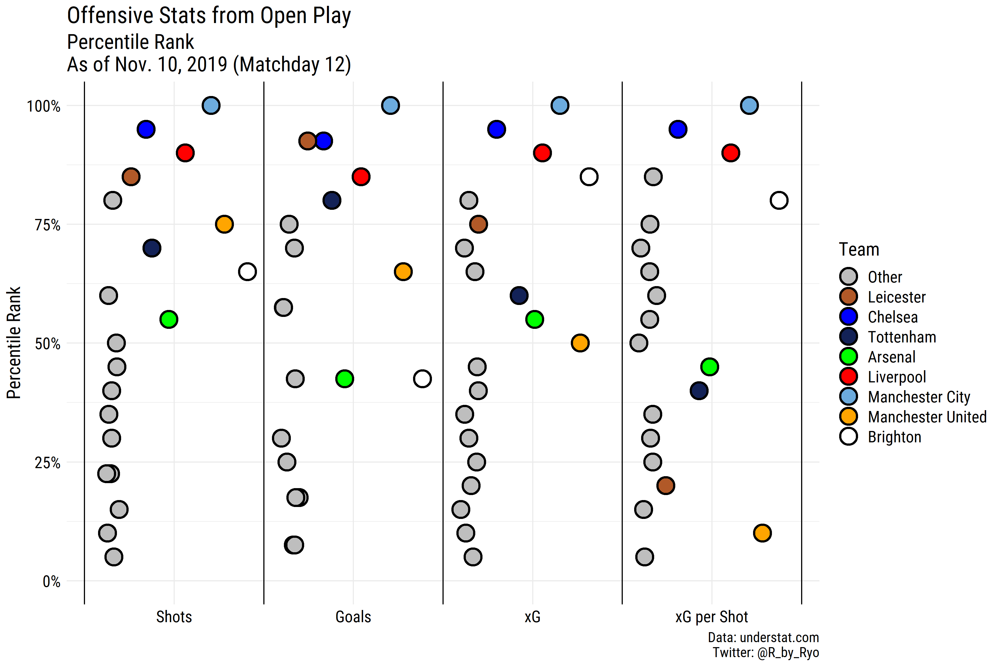
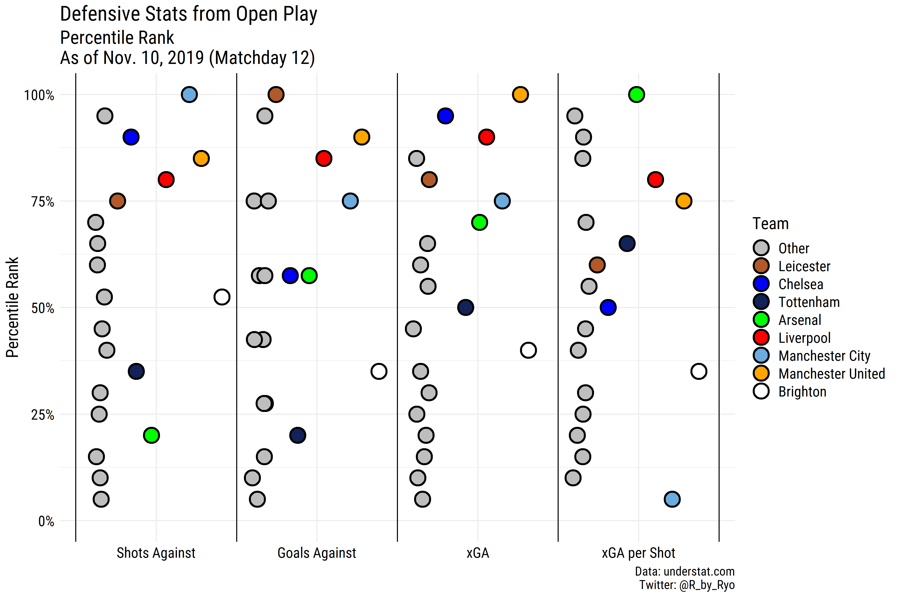
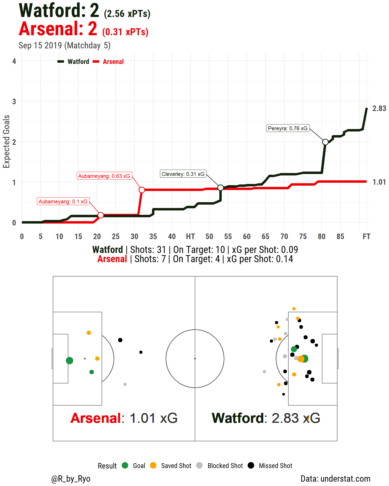
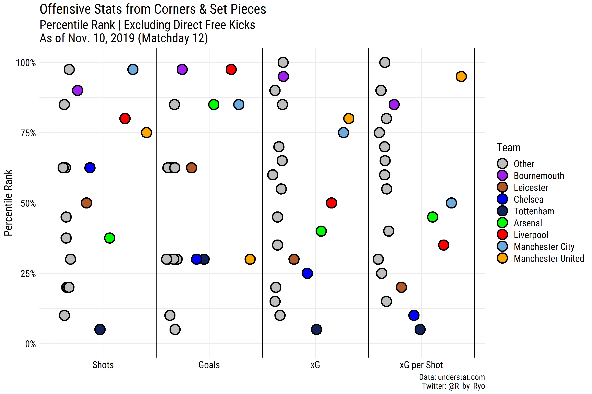
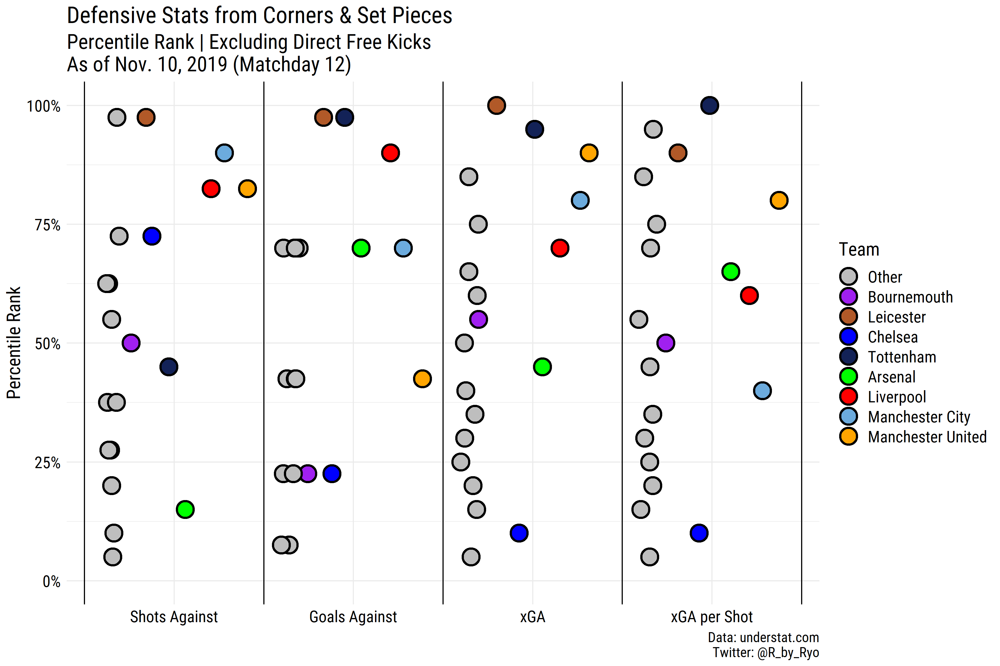
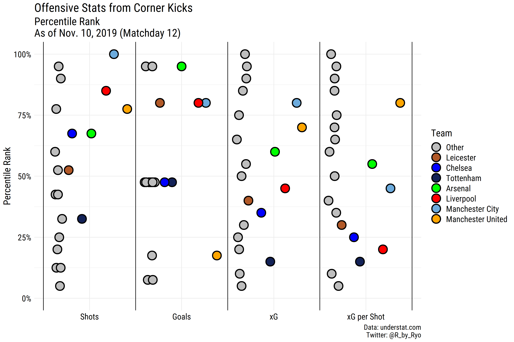
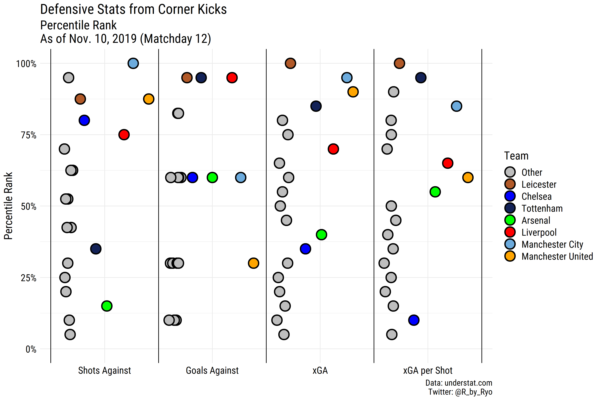
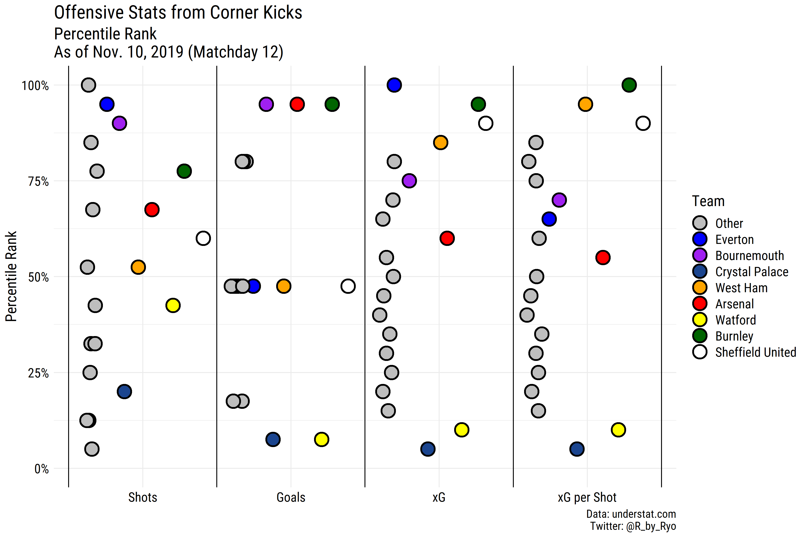
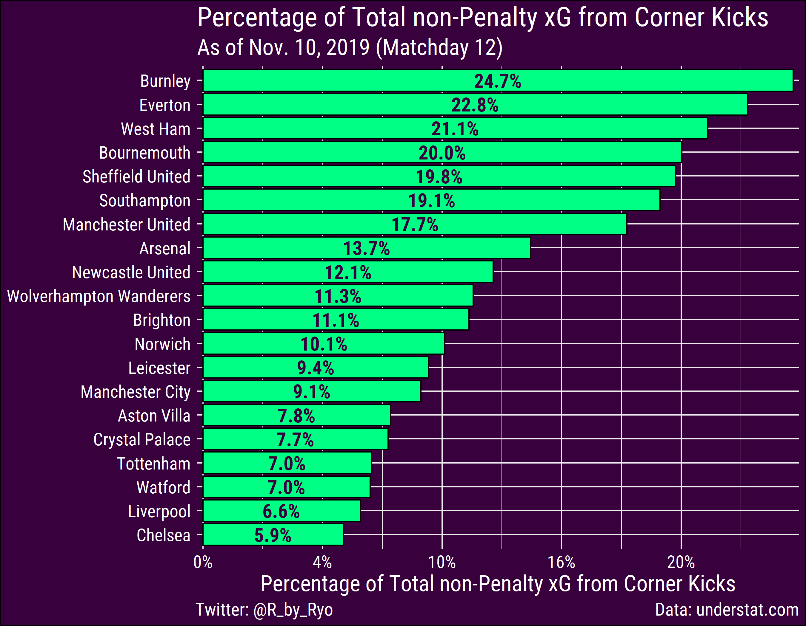

**"per shot" values from set pieces in the 'Set Pieces' section (and other places where mentioned) have been corrected. (11/30/2019)**

In Part 2, I will be looking into various statistics from different game
situations in the English Premier League, specifically from **open
play**, **set pieces**, and **corner kicks**. As with stats taken from
“special” situations, do keep in mind that some teams may not have taken
many shots from these situations. When talking about the numbers below
I’ll make sure to qualify any statements with the total amount of shots
taken or any other circumstance that I know of. As in [Part
1](https://ryo-n7.github.io/2019-11-21-visualize-EPL-part-1/) all the
data comes from [understat.com](https://understat.com/). Although I am
looking a bit deeper in regards to stats from specific situations this
is still more of a **broad overview** of different teams. I am hoping
that writing this mini-series, along with all the data cleaning and viz
work that I’ve already done, will be a springboard for more **specific**
topics in the future.

-   [Part 1: Overview with xPts Tables and xG
    Plots](https://ryo-n7.github.io/2019-11-21-visualize-EPL-part-1/)
-   [Part 2 (You’re reading
    it!)](https://ryo-n7.github.io/2019-11-28-visualize-EPL-part-2/)
-   [Part 3: TBA]()

Just a reminder that I am only using the data up to Matchday 12
(Nov. 10th).

**You can follow along with the code:
[here](https://gist.github.com/Ryo-N7/622fabee1cde074c1a1d8f2698bf56df)**

Let’s get started!

Open Play
=========

As you might expect the team far-and-away at the top in terms of xG
(30.77) and actual goals (27) scored is **Manchester City** (they lead
the second best team, Chelsea, by nearly 8 xG). In terms of shot
quantity at either end City are at the top with most shots taken and
least conceded from open play (198 For, 64 against). However, in **terms
of shot quality** things are drastically different as although City’s xG
per shot is still the best with 0.155, their 0.178 xGA per shot from
open play is the worst in the entire league! As you’ll see later on,
their defensive stats from other situations are generally good to OK so
the problem really comes from the fact that in open play, City become
terribly exposed once teams are able to get past their intense press.
You can check out a deeper analysis on this topic (from early October)
from [Grace Robertson](https://twitter.com/GraceOnFootball) on
[StatsBomb](https://statsbomb.com/2019/10/whats-up-with-manchester-city/).

What might surprise a few is that the team in the 85th percentile for xG
and 80th percentile for xG per shot is **Brighton**! The Seagulls
(highlighted in white) are only behind City, Chelsea, and Liverpool for
these stats, yet the difference is that their goals scored is only in
the 50th percentile with **only 10 open play goals from 15.07 xG**
(their games against West Ham and Burnley come to mind for missed
opportunities). If they can start converting their chances they could be
much higher than their current 12th place position although they might
still need to improve a bit on their league-average defense. They have
also been lucky defending set pieces as they are third worst in the league for
xGA per shot (0.17 from 29 shots) from these situations but have only
given up 2 goals from 5.06 total xGA.

In Unai Emery’s second full season with **Arsenal**, the Gunners are
hovering around the 50th percentile for all the offensive metrics shown
which is clearly not good enough for a team aspiring to get back into
the Champions League places. They are not shooting well enough (both in
quantity and quality) and they’re letting teams take a lot of shots on
their goal (fourth worst in the league with 143). On the other hand,
their xGA per shot is the best in the league at 0.08.

A match that provided a great example for these stats was Arsenal’s
**2-2 draw against Watford** back in September where they allowed a
jaw-dropping 31 shots (although only 10 were on target). Even with
Watford’s poor shot quality their **expected points** (xPts) from this
game was 2.56. Meanwhile, Arsenal still managed to do get 7 shots off (4
on target) but it was quite astonishing watching that second half and
seeing Arsenal escape with a point (especially when simulations had them
good for only 0.31 xPts)!

Set Pieces (Free Kicks and Corners excluding Direct FKs)
========================================================

~~**Under Revision** (11/30/2019): It seems I made some silly mistakes in regards to calculating the __per shot__ values in this section. Any other part of this blog post talking about the __per shot values from set pieces__ (free kicks + corners) should also be ignored until I fix this. The "corner kicks" section should be fine. Sorry!~~

**All fixed! Again, sorry. (11/30/2019)**

There isn’t a very large sample of shots from just free kicks so for
this section I will combine **free kicks and corners** (while still
excluding direct free kicks). It would have been very informative if the
total number of set piece attempts and coordinates for where these set
pieces took place were recorded but unfortunately `understat` doesn’t
have that info on hand. Maybe in the future I’ll try to combine it with
attempts data from another source.

**Liverpool** have only given up 24 shots (of which only 5 are from free
kicks) which is tied fourth best alongside Manchester United. In
general, Liverpool do well on both ends of the pitch concerning corners
and set pieces although they don’t seem to create many high quality
chances as they’re just about league average (median) for expected
goals, 2.65 xG from 39 shots. Results-wise they are tied first with
Bournemouth with 5 goals scored from these situations.

**Chelsea** are one of the worst teams defending set pieces with all of
their defensive metrics except shots conceded being below the 25th
percentile. Looking at the raw numbers they’ve conceded 4 goals from 5.33 xGA, from a total of 30
shots. They have also been conceding from set pieces in the Champions
League (not shown in the data) as well which has prompted Frank Lampard
to switch from a pure zonal marking system to a **mixed system** from
October.

Some special notice must be given to **Bournemouth** (who I’ve
highlighted in purple) who appear in the top four of **every**
offensive metric shown here! They are tied with Liverpool with 5 goals
from 5.75 xG and posting an decent 0.13 xG per shot (42 shots) from these
situations, fourth best behind Sheffield United, Manchester United, and Burnley. The
Cherries are heavily reliant on set pieces as they are below the 25th
percentile for shots, goals, and xG from open play. They lead the league
in **proportion of total xG from set pieces** (corners and free kicks,
excluding direct free kicks) with 35.1%. I’ll go into a specific example
of one of their attacking routines that have proved quite effective in
the next section.

However, this prowess in attack doesn’t translate on the **defensive**
side of things where Bournemouth are around the 50th percentile (shots
against: 33, xGA: 3.255) and downright bad in terms of xGA per shot
(0.09 xGA per shot) and goals conceded (4). Even with these stats only
17.5% of their total xGA come from their inability to defend set pieces,
8th best in the league!

Corner Kicks
============

**Manchester City** have gotten **45 shots** off from corner kicks
followed closely by Everton with 41. **Everton** lead the league in
total xG from corners with 4.3 while City are close by in 5th (3.29).
However, the similarities stop there as Everton have conceded the most
goals from corners (tied at 4 with Aston Villa and West Ham) from a
total xGA of 2.68 while City have conceded 2 from 0.5 xGA. This
**difference** mainly comes from the fact that Everton have the worst
xGA per Shot from corners in the league at 0.244 while City have the
fourth best with 0.05 xGA per shot. Everton’s stat comes from from 11
shots, second best in the league just behind Manchester City (10 shots
allowed from corners). These stats might suggest that although Everton
are good at preventing shots from corners, when opponents do breach the
defense, the resulting shot is usually of higher quality.

**Spurs** haven’t created a lot of chances from corner kicks (in quality
and quantity) yet they’ve still managed to score 2 goals, one of them
being **Lucas Moura’s header** (valued at just 0.04 xG) in that
controversial game against City back in August! On the other hand
they’ve been very good at preventing quality chances from corners having
conceded 0 goals so far from just 0.97 xGA (tied with Liverpool and
Leicester).

**Chelsea** has the worst record in xGA, not just among their fellow
“top” teams but the second worst in the league with 0.177 xGA per shot.
On the flip side, Leicester is probably the best team defending corner
kicks with none of their stats below the 75th percentile, they lead the
league in total xGA (0.38 from just 12 shots allowed) and xGA per shot
(0.032).

In terms of xG per shot from corners, **Burnley** lead with 0.15
followed by West Ham and Sheffield United. Burnley have scored 4 goals
from a total of 4.27 xG (so just around what understats’ model expected)
but for all of Everton’s efforts, the aforementioned 41 shots and with
4.3 xG in total, they’ve only managed to score 2 from corner kicks.
Meanwhile, **Crystal Palace** and **Watford** are the worst teams from
corners as they are the bottom two teams in every metric besides shots.

**Arsenal** are joint top (with Burnley and Bournemouth) with **4
goals** from corners but their other metrics don’t reflect this good
haul as the Gunners have created chances amounting to only 2.133 xG from
26 shots (Burnley: 4.27 xG, Bournemouth: 3.28 xG). The Gunners have only
accumulated 17.7% of their non-penalty xG from corner kicks while in
comparison Burnley and Bournemouth have 24.7% and 20% respectively.

Bournemouth showed up as one of the top teams in the previous section
and they seem to put a lot of hours on the training ground on various
maneuvers. A **good example** would be Harry Wilson’s goal vs. Newcastle
United, check out their routine
[here](https://youtu.be/SQJalkl3jlI?t=22):

-   A short corner from Ryan Fraser to Joshua King who immediately plays
    it back to Fraser first keeps the focus of the defenders towards the
    left sideline.

-   Harry Wilson (\#22) starts near the far post marked by Newcastle’s
    Jetro Willems (\#15). Ake (\#5) and Billing (\#29) both start out
    from halfway between the edge of the 18-yard box and the penalty
    spot.

-   With immaculate timing Ake (\#5) and Billing (\#29) storm into the
    6-yard box which opens a giant gap right around the penalty spot.

-   This space is exploited by Harry Wilson who circles back around
    every Newcastle player’s blindside to slot the ball in under no
    pressure at all.

-   If you look closely you can see how Callum Wilson (\#13) acts as a
    screen to block Wilson’s marker, Jetro Willems, from following him
    to the middle.

Conclusion
==========

In a game of **fine margins** having that **extra edge** in set pieces
or corners can really be the difference between relegation vs. safety,
Europe vs. mid-table, or even the title. The employment of specialist
coaches/consultants in this area in recent years, like [Stuart
Reid](https://twitter.com/from_the_wing), while the fact that clubs like
Brentford and FC Midtjylland also employ their own specialists (or even
for throw-ins, see [Thomas Gronnemark for
Liverpool](https://www.thisisanfield.com/2019/09/expert-analysis-shows-the-huge-impact-of-liverpools-throw-in-coach-thomas-gronnemark/)!)
are in part due to the growing influence of analytics in football
focusing on this aspect of the game.

Below are some articles regarding set-pieces if you’re interested:

-   [Mythbusting Set-pieces in Soccer (MIT Sloan Sports Analytics
    Conference
    paper)](http://www.sloansportsconference.com/wp-content/uploads/2018/02/2007.pdf)
-   [Why set pieces are such a weapon for Sheffield
    United](https://trainingground.guru/articles/why-set-pieces-are-such-a-weapon-for-sheffield-united)
-   [The secret to Liverpool’s success in 2018-19: why being good at set
    pieces can win you
    trophies](https://www.espn.com/soccer/english-premier-league/story/3905756/the-secret-to-liverpools-success-in-2018-19-why-being-good-at-set-pieces-can-win-you-trophies)
-   [Breaking Down Set Pieces: Picks, Packs, Stacks and
    More](https://statsbomb.com/2019/05/breaking-down-set-pieces-picks-packs-stacks-and-more/)

This was a very broad strokes overview on **where** and how much teams
are creating and conceding chances. Still, just looking at the xG data
from `understat` can give you some leads on what teams you might want to
look at more carefully and for that I’ll probably need to include data
from other sources as well. That will be a challenge to tackle in a
future part. In the more immediately future, the next part will look at
how stats look for teams across every 15-minute intervals of games.
