RStudio::Conference 2020 was held in San Francisco, California and kick
started a new decade for the R community with a bang! Following some
great workshops on a wide variety of topics such as [JavaScript for
Shiny Users](https://github.com/rstudio-conf-2020/js-for-shiny) to
[Designing the Data Science
Classroom](https://github.com/rstudio-conf-2020/design-ds-classroom)
there were two days full of great talks as well as the Tidyverse Dev Day
the day after the conference.

This was my third consecutive RStudio::Conf and I am delighted to have
gone again, especially as I grew up in the Bay Area. For the second year
running I am writing a roundup blog post on the conference (see last
year’s
[here](https://ryo-n7.github.io/2019-01-25-tidyversedevday-rstudioconf-reflections/)).

Another great resource for the conference (besides the \#rstats /
\#RStudioConf2020 Twitter) is the [RStudioConf 2020
Slides](https://github.com/EmilHvitfeldt/RStudioConf2020Slides) Github
repo curated by [Emil Hvitfeldt](https://twitter.com/Emil_Hvitfeldt).

Unfortunately, I arrived to the conference late as United Airlines being
the fantastic service that they are cancelled my flight. So, I came into
SFO right around when JJ Allaire was giving his fantastic keynote on
RStudio becoming a Public Benefit Corporation (read more about that
[here](https://blog.rstudio.com/2020/01/29/rstudio-pbc/)) among other
morning talks. I missed the first half of Day 1 and arrived extremely
tired to the conference venue for lunch.

Grousing about United Airlines aside, let’s get started!

NOTE: As with any conference there were a lot of great talks competing
against each other in the same time slot and I also wasn’t able to write
about all the talks I saw in this blog post.

Making the Shiny Contest!
=========================

[Mine Cetinkaya-Rundel](https://twitter.com/minebocek) talked about last
year’s first [Shiny
Contest](https://community.rstudio.com/t/take-part-in-the-shiny-contest-2019/22445).
For those who don’t know, this was a contest created by RStudio and
hosted on RStudio Community for creating the best Shiny apps. You can
check out all of last year’s (and soon this year’s) submissions from the
“shiny-contest” tag on RStudio Community
[here](https://community.rstudio.com/tags/shiny-contest). Last year’s
winners included Kevin Rue, Charlotte Soneson, Federico Marini, Aaron
Lun’s [iSEE (Interactive Summarized Experiment
Explorer)](https://kevinrue.shinyapps.io/isee-shiny-contest/) app for
`Most Technically Impressive`, [David
Smale](https://twitter.com/committedtotape/)’s [69 Love Songs: A Lyrical
Analysis](https://committedtotape.shinyapps.io/sixtyninelovesongs/) for
`Best Design`, [Victor Perrier](https://twitter.com/_pvictorr/)’s [Hex
Memory Game](https://dreamrs.shinyapps.io/memory-hex/) for `Most Fun`,
and [Jenna Allen](https://twitter.com/jallen1006/)’s [Pet
Records](https://jennadallen.shinyapps.io/pet-records-app/) app for
`The "Awww" Award`.

Mine gave a bit of background on the creation of the contest, mainly on
how it was inspired by the {bookdown} contest that [Yihui
Xie](https://twitter.com/xieyihui/) organized a few years prior.

For this year’s contest, taking place from January 29th to March 20th,
Mine talked about some of the requirements and nice-to-haves from
feedback and reflection on last year’s contest.

Requirements:

-   Code (Github repo)
-   RStudio Cloud hosted project
-   Deployed App

Nice To Have:

-   Summary (in submission post)
-   Highlights
-   Screenshot

Also Mine mentioned how participants should self-categorize themselves
by experience level, should start reviewing submissions earlier (HUGE
uptick in submissions in the last weeks of the contest), and that
organizers should give out better guidelines for what makes a “good”
submission. For evaluations, apps will be judged based on technical
and/or artistic achievement while also considering the feedback and
reaction from the RStudio Community submission post.

-   [Slides (Not yet available)]()
-   More Shiny apps have been added to a revamped [Shiny
    Gallery](https://shiny.rstudio.com/gallery/) page!

Technical Debt is a Social Problem
==================================

[Gordon Shotwell](https://twitter.com/gshotwell/) talked about how
technical debt is a social problem and not just a technical one.
Technical debt can be defined as taking shortcuts that make a
product/tool less stable and the social aspect of this is that it can
also be accumulated through bad documentation and/or bad project
organization. With some experience being in a position where he lacked
the necessary decision-making power to fix certain problems, Gordon’s
talk was heavily influenced by how he had to be strategic about creating
robust solutions and how he came to realize that technical debt was both
a failure of **communication** and **consideration**.

Communication:

-   Documentation (Use/Purpose of the Code)
-   Testing (Correctness of the Code)
-   Coding Style (Consistency/Legibility of the Code)
-   Project Organization (Organization of the Code)

Consideration:

-   Robustness (Accurate/Unambiguous Error Messages?)
-   Updated Easily
-   Solves Future Problems
-   Dependencies (Dependency Management)
-   Scale (Up/Down?)

From the above, Gordon asked everyone: **How well do you think about how
other people might use your code/software to fix problems?**

The key to answering this question is to build what Gordon called
“delightful products”:

-   One-step Setup
-   Clear Problem
-   Obvious First Action
-   Path to Mastery
-   Help is Available
-   Never Breaks

To build these “delightful products” Gordon went over 3 concepts, **find
the right beachhead**, **separate users and maintainers**, and
**empathize with the debtor**.

-   **Find the Right Beachhead**: You should pick the correct battle to
    fight and position yourself for smart deployment. If you can then
    accomplish the project, you build trust! To do this, make a big
    improvement in a small area, work on a small contained project.

-   **Separate Users & Maintainers: Users Get Coddled & Maintainers Get
    Opinions!**: A good maintainer has responsibility and authority for
    the “delightful” product. He/she does **not** blame the user or asks
    users to maintain the tool. A good user defines what makes the
    product “delightful” and asks maintainers about the problem rather
    than the solution.

-   **Empathize with the Debtor**: Technical debt can make people/you
    uncomfortable and its important to be supportive so everyone can
    learn from the experience!

In conclusion, Gordon said that you should **thank** your code and that
technical debt is a good thing. This is because even if there are some
problems there are people who care enough to have done something about
it in the first place and from there maintainers and users can work
together to review and improve your tools!

-   [Older blog post on this topic from Gordon
    Shotwell](https://blog.shotwell.ca/posts/2019-04-19-technical-debt-in-data-science/)
-   [Slides](https://techdebt.shotwell.ca/)

Object of Type Closure is Not Subsettable
=========================================

In her keynote talk to kick start Day 2, [Jenny
Bryan](https://twitter.com/JennyBryan/) talked about debugging your R
code. Jenny went over four key concepts: **hard reset**, **minimal
reprex**, **debugging**, **deterring**.

**Hard resetting** is basically the old “have you tried turning it off
and then on again?” and in the context of R it is restarting your R
session (you can set a keyboard shortcut via the “Tools” button in the
menu bar). However, it’s also very important that you make sure you are
**not** saving your `.Rdata` on exit. This is so you have a completely
clean slate when you restart your session. Another warning Jenny gave
was that you should **not** use `rm(list = ls())` as this doesn’t clean
any `library()` calls or `sys.setenv()` calls among a few other
important things that might be causing the issue.

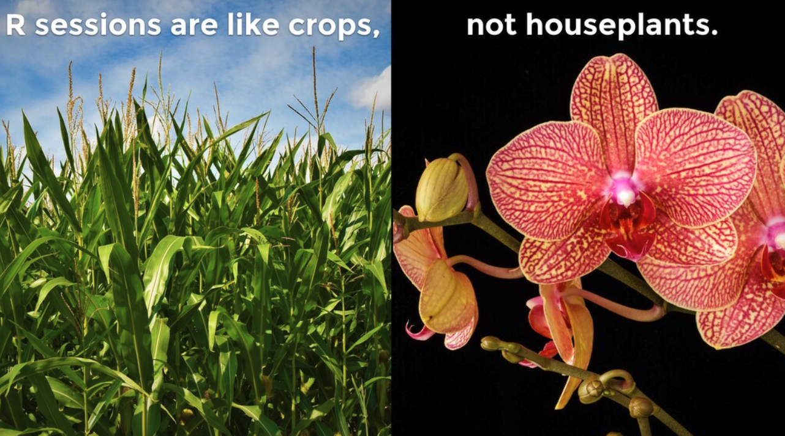

Making a **minimal reprex** means to make a small concrete reproducible
example that either reveals/confirms/eliminates something about your
issue. Jenny also described them as making
`a beautiful version of your pain that other people are more likely to engage with`.
Making one is very easy now with the {reprex} package and it helps those
people trying to help you with your problem on Stack Overflow, RStudio
Community, etc. Still, asking and formulating your question can be very
hard as you need to work hard on bridging the gap between what you
**think** is happening vs. what is **actually** happening.

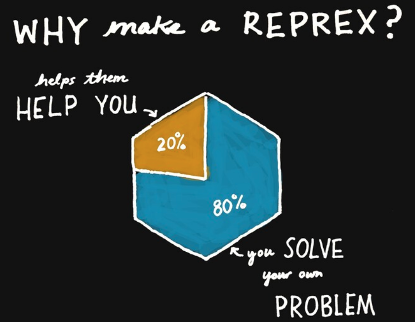

**Debugging** comprises of a few different steps and Jenny used death as
a metaphor. “Death certificate” was used for functions like
`traceback()` which shows exactly where and which functions were run to
produce the error. “Autopsy” was used for `option(error = recover)` for
when you need to look into the actual environment of certain function
calls when they errored. Finally, reanimation/resuscitation was used for
`browser()` and `debug()`/`debugonce()` as it allows you to re-enter the
code and its environment right before the error or to the very top of
the function (depending on where you insert the `browser()` call).

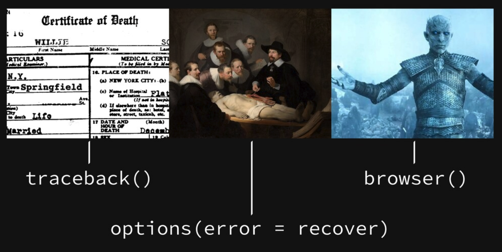

**Deterring** is that once you fix your code once you want to **keep**
it fixed. The best way to do this is to add tests and assertions using
packages like {testthat} and {assertr}. You can also automate these
checks using continuous integration methods such as Travis CI or Github
Actions. Lastly, Jenny talked about when writing code it’s important to
write error messages that are easy for humans to understand!

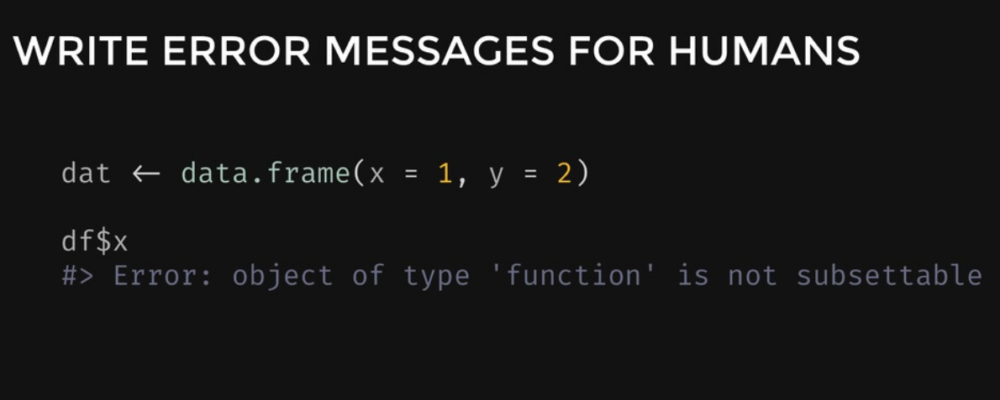
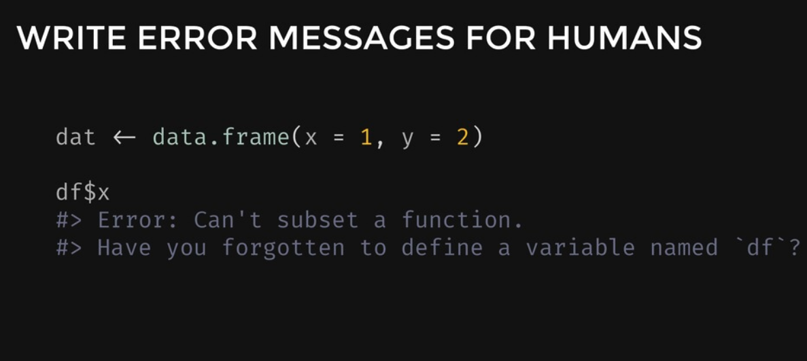

Other resources for debugging:

-   [Debugging keynote resources - Jenny
    Bryan](https://github.com/jennybc/debugging#readme)
-   [stop() - breathe - recover() (Debugging Video) - Miles
    McBain](https://www.youtube.com/watch?v=M5n_2jmdJ_8)
-   [Debugging your R code with the browser() function and a second pipe
    operator (Debugging Video) - Bruno
    Rodrigues](https://www.youtube.com/watch?v=ATIl_JlM9ko)
-   [Slides](https://speakerdeck.com/jennybc/object-of-type-closure-is-not-subsettable)

{renv}: Project Environments for R
==================================

The {renv} package (an RStudio project led by the presenter, [Kevin
Ushey](https://twitter.com/kevin_ushey)) is the spiritual successor to
{packrat} for dependency management in R. When we talk about libraries
in R, the most basic definition is “a directory into which packages are
installed”. Each R session is configured to use multiple library paths,
you can see for yourself using the `.libPaths()` function, and a “user”
and “system” library is usually the default that everybody has. You can
also use `find.package()` to find where exactly a package is located on
your system. The challenge with package management in R is that by
default, each R session uses the same set of library paths. For
different R projects you might have different package dependencies,
however if you install a new version of a package, it will change the
version of that package in **every** project.

The three key concepts of {renv} work to make your R projects more:

-   **Isolated**: Each project gets its own library of R packages, this
    allows you to upgrade and change packages within your project but
    not break your other projects!
-   **Portable**: {renv} captures the state of R packages in a project
    within a LOCKFILE. This LOCKFILE is easy share and makes
    collaborating with others easy as everybody working from a common
    base of R packages.
-   **Reproducible**: Using the `renv::snapshot()` function lets you
    save state of R library to LOCKFILE, called “renv.lock”.

The basic workflow for {renv} is as follows:

-   `renv::init()`: This function activates {renv} for your project. It
    forks the state of your default R libs into a **project-local**
    library and prepares infrastructure to use {renv} for the project. A
    project-local `.Rprofile` is created/amended for new R sessions for
    that project.
-   `renv::snapshot()`: This function captures the state of your project
    library and write that to a LOCKFILE, “renv.lock”.
-   `renv::restore()`: This function shows all the packages that are
    updated/installed in the project-local library as a list. It
    restores your project library with the state specified in the
    LOCKFILE that you created previously with `renv::snapshot()`.

{renv} can install packages from many sources, Github, Gitlab, CRAN,
Bioconductor, Bitbucket, and private repositories with authentication.
As there may be many duplicates of identical packages across projects,
{renv} also uses a global package cache to keep your disk space clean
and to lower installation times when restoring your packages.

-   [Initial {renv} announcement blog post (November
    6th, 2019)](https://blog.rstudio.com/2019/11/06/renv-project-environments-for-r/)
-   [Slides](https://kevinushey-2020-rstudio-conf.netlify.com/slides.html)

RStudio v1.3 Preview
====================

In another talk by an RStudio employee, [Jonathan
McPherson](https://twitter.com/jmcphers) talked about the exciting new
features in store for `RStudio version 1.3`.

For this version one of the key concepts was to increase accessibility
of RStudio for those with disabilities by targeting the WCAG 2.1 Level
AA:

-   Increased compatibility with screen readers (annotations, landmarks,
    navigation panel options)
-   Better focus management (where the keyboard focus is at any given
    moment)
-   Better keyboard navigation and usability (no more tab traps!)
-   Better UI readability (improve contrast ratios)

The **Spell Check** tool, which in the past did not provide real-time
feedback, could only read the entire document at a time, and the button
itself being hard to find, is significantly revamped with new features
many R users have been crying out for:

-   Real-time spell checking
-   Pre-loaded dictionary (“RStudio” is also included now!)
-   Right-click for suggestions
-   Works on comments and roxygen comments

In addition, the global replace tool is also improved in that you can
replace everything found with a new string, regex support, and that you
can preview your changes in real time.

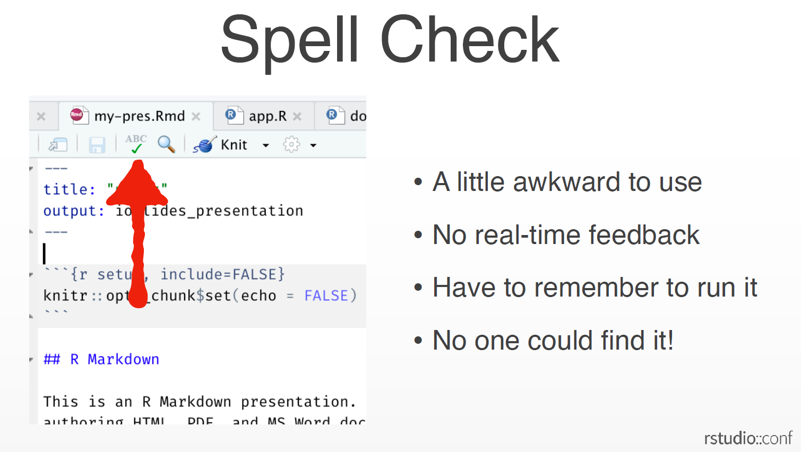
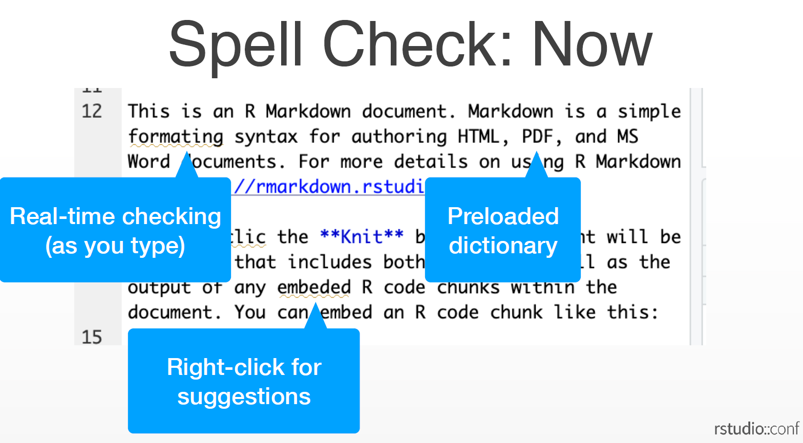

Although RStudio already worked in prior versions of the iPad the new OS
13 makes everything much more smoother and gives the user a much better
experience. In light of the fact that RStudio and the iPad work much
better together version 1.3 on the iPad will have much better keyboard
support (shortcuts and arrow-keys support)!

Another exciting feature is the ability to script all your RStudio
configurations. Every configurable option available from the “Global
options”, “workbench key bindings”, “themes”, “templates” are saved as
plain text (JSON) files in the `~/.config/rstudio` folder and can be set
by admins for all users on RStudio Server as well.

You can try out a preview version of 1.3 today
[here](https://rstudio.com/products/rstudio/download/preview/)!

-   [Slides](https://speakerdeck.com/jmcphers/rstudio-1-dot-3-sneak-preview)

Tidyverse 2019-2020
===================

In this afternoon talk, [Hadley
Wickham](https://twitter.com/hadleywickham/) talked about the big
tidyverse hits of 2019 and what’s to come in 2020.

Some of the highlights for 2019 included:

-   `citation("tidyverse")`: Which allows people to cite the tidyverse
    in their academic papers
-   The `{``{`  `}``}` (read: curly-curly) operator: Which reduces the cognitive
    load for many users confused about all of the new {rlang} syntax
-   {vctrs}: A developer-focused package for creating new classes of S3
    vectors
-   {vroom}: A fast delimited reader for R, using C++ 11 for
    multi-threaded computations, as well as the Altrep framework to
    lazy-load the data only when the user needs it
-   {tidymodels}: A group of packages for modelling with tidy principles
    ({rsample}, {recipes}, {parsnip}, etc.)

For 2020, Hadley was most excited about:

-   {dplyr 1.0.0}
-   A movement toward more problem oriented documentation.
-   Less {purrr}: replacement with more functions to handle tasks like
    importing multiple files at once or tuning multiple models.
-   {googlesheets4}: Reboot of the old {googlesheets}, improved R
    interface via the Sheets API v4.

Hadley then talked about some of the lessons learned from the new
`tidyeval` functionalities last year. Some of the mistakes that he
talked about was that a lot of previous `tidyeval` solutions were too
partial/piece-meal and that there was too much focus on theory relative
to the realities of most data science end-users. Most of the problems
identified could be traced to the fact that there was way too much new
vocabluary to learn regarding `tidyeval`. Going forward, Hadley says
that they want to get feedback without exposing a lot of new
functionality at once and to a specific set of test users while also
working to indicate that certain new concepts are still `Experimental`
more clearly.

To make it easier for users to keep track of all the changes happening
around the tidyverse packages, a lot more emphasis on the exact “life
cycle” of functions are now listed in the documentation. Starting out as
“Experimental” then going to “Stable”, if going under review to
“Questioning”, and finally to “Deprecated”, “Defunct”, or “Superseded”
these tags inform the user about the working status of functions in a
package.

The main differences between `deprecated` and `superseded` are:

-   `Deprecated`: A function that’s on its way out (at least in the near
    future, \< 2 years) and gives a warning when used. Ex.
    `dplyr::tbl_df()` & `dplyr::do()`
-   `Superseded`: There is an alternative approach that is easier to
    use/more powerful/faster. It is recommended that you learn new
    approach if you have spare time but it’s not going anywhere (however
    only critical bug fixes will be made to it). Ex. `spread()`&
    `gather()`

As we head into another decade of the {tidyverse} this presentation
provided a good overview of what’s been going on and what’s more to
come!

-   [Slides (Not yet available)]()

ggplot2 section
===============

In the afternoon session of Day 2 there was an entire section of talks
devoted to {ggplot2}.

First, there was [Dewey Dunnington](https://twitter.com/paleolimbot)’s
presentation on best practices for programming with {ggplot2}, a lot of
the material which you might be familiar with from his [Using ggplot2 in
packages](https://ggplot2.tidyverse.org/dev/articles/ggplot2-in-packages.html#using-aes-and-vars-in-a-package-function)
vignette (only available in the not-yet-released version 3.3.0
documentation) last year. In the first section Dewey talked about using
tidy evaluation in your mappings and facet specifications when you’re
creating custom functions and programming with {ggplot2}. For using
{ggplot2} in packages he talked about proper NAMESPACE specifications
and getting rid of pesky “undefined variable” notes in your R CMD check
results. Lastly, Dewey went over a demo on regression testing your
{ggplot2} output with the {vdiffr} package.

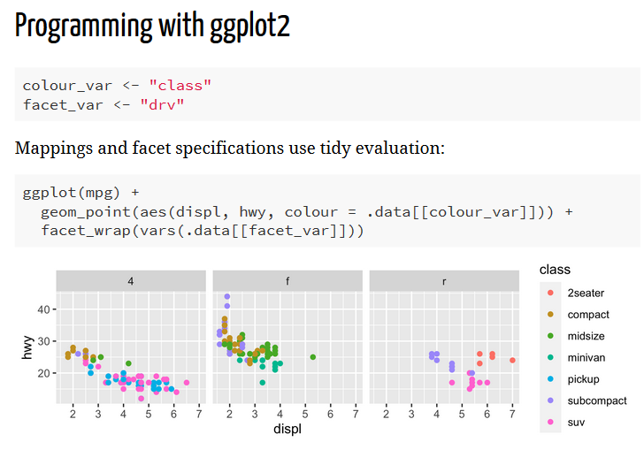
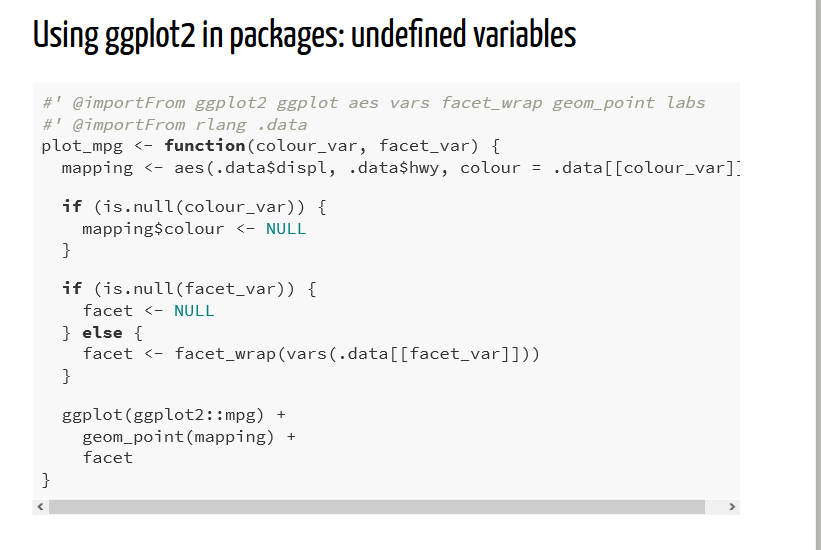

Next, [Claus Wilke](https://twitter.com/ClausWilke/) talked about his
{ggtext} package which adds a lot of functionality to {ggplot2} with the
addition of formatted text. With {ggtext} you can use markdown or HTML
syntax to format the text in any place where text can appear in a
ggplot. This is done via specifying `element_markdown()` instead of
`element_text()` in the `theme()` function in your ggplot2 code.
Synchronizing with the {glue} package you can refer to values inside
columns of your dataframe and style them in a very easy way.

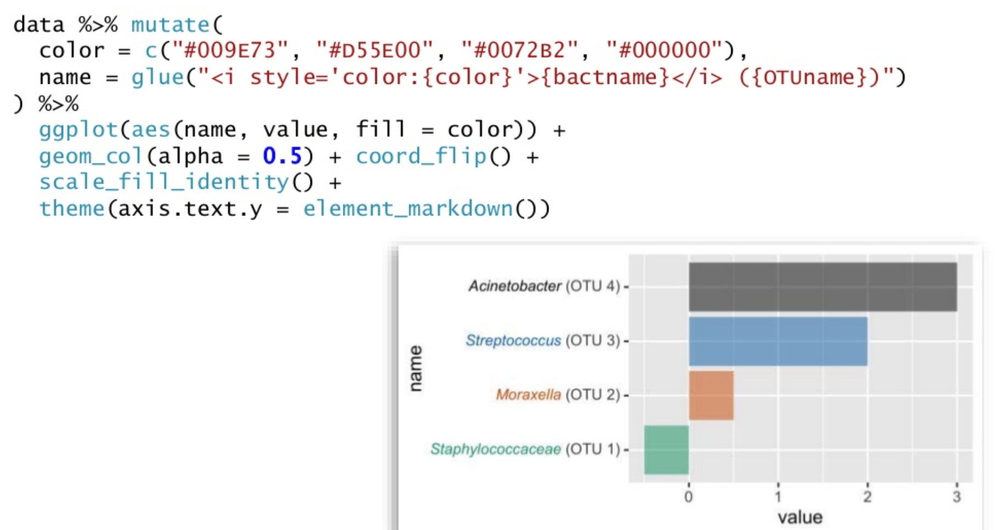

{ggtext} also allows you to insert images into the axes by supplying the
HTML tag for the picture into the label.

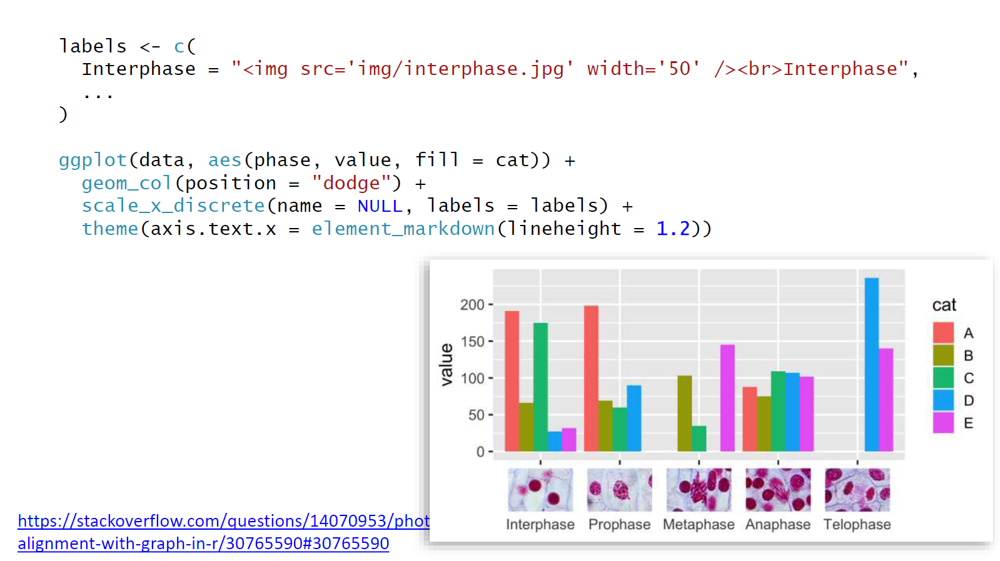

In conclusion, Claus mentioned that another package of his, {gridtext},
does a lot of the heavy lifting to render formatted text in the ‘grid’
graphics system. He also warned everybody to not get too carried away
with the awesome new functionalities to ggplot that {ggtext} introduces!

-   [{ggtext} examples with soccer
    data](https://twitter.com/R_by_Ryo/status/1222997840244305920)
-   [{ggtext} example using {datos}
    data](https://twitter.com/patriloto/status/1224561565128675330)

Next, [Dana Seidel](https://twitter.com/dpseidel) presented on version
1.1.0 of the {scales} package which provides the internal scaling
infrastructure for {ggplot2} (but also works with base R graphics as
well). The {scales} package focuses on five key aspects of data scales:
**transformations**, **bounds & rescaling**, **breaks**, **labels**, and
**palettes**.

Some of the notable changes in this new version include the renaming of
functions for better consistency and to make it easier to tab complete
functions in the package as well as providing more examples via the
`demo_*()` functions.

While most of the conventional data transformations are included in the
package such as arc-sin square root (`atanh_trans()`), Box-Cox
(`boxcox_trans()`), exponential (`exp_trans()`), Pseudo-log ), etc.
users can now define and build their own transformations using the
`trans_new()` function!

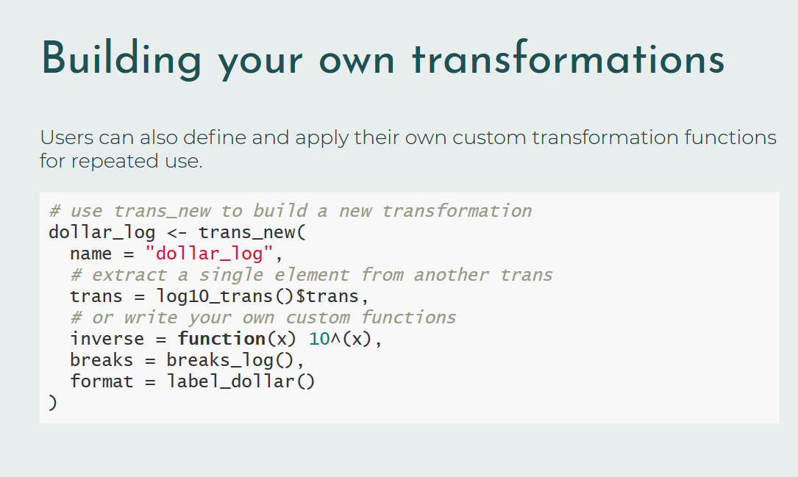

Next, Dana introduced some rescaling functions:

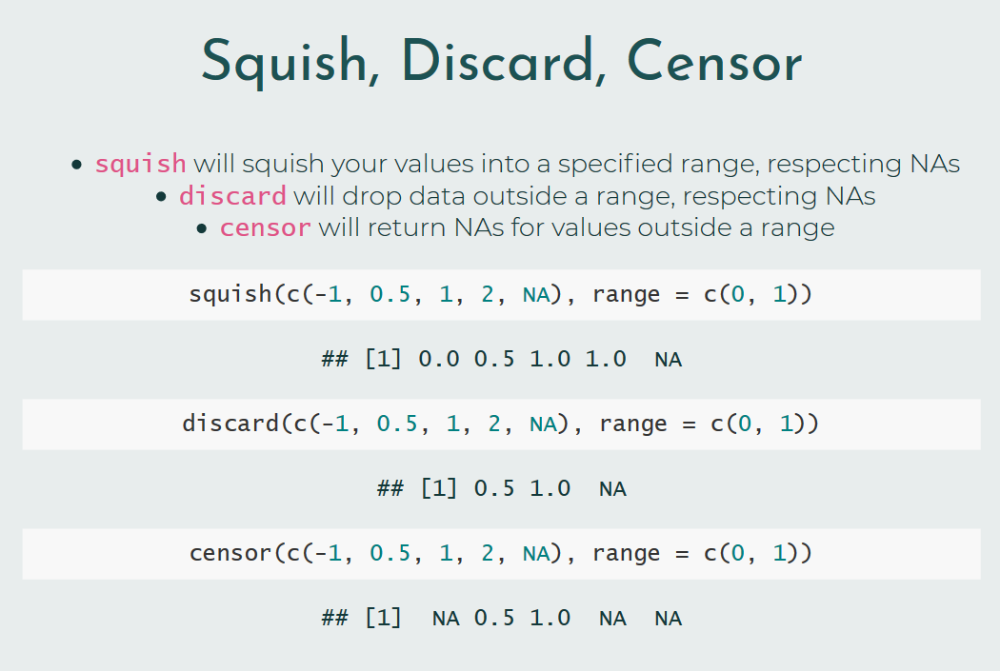

One of the things that got the crowd really excited was the
`scales::show_col()` function which allows you to check out colors
inside a palette. This function is well-known to a lot of {ggplot2}
color palette package creators (including myself for
[{tvthemes}](https://ryo-n7.github.io/2019-11-04-tvthemes-1.1.0-announcement/))
to showcase all the great new sets of colors we’ve made without having
to draw up an example plot!

Last but certainly not least, [Thomas
Pedersen](https://twitter.com/thomasp85/) presented on extending
{ggplot2} and really looking underneath the hood of a package most
people can use, but has been quite a challenge to work with the
internals.

This presentation got quite technical and a bit too advanced for me so
I’ll refrain from doing a bad explanation on it here. However, it was
still educational as developing my own {ggplot2} extension (creating
actual new geoms/stats rather than just using existing {ggplot2} code)
is something that I’ve been dying to do. There’s going to be a new
chapter in the new and under development version 3 of the {ggplot2} book
and more materials in the future on this so keep an eye out!

-   [Current “Extending ggplot2”
    vignette](https://cran.r-project.org/web/packages/ggplot2/vignettes/extending-ggplot2.html)
-   [Work-in-progress v3 ggplot2 book section on “Extending
    ggplot2”](https://ggplot2-book.org/programming.html)

**All slides**

-   [Best practices for programming with ggplot2 (Slides) - Dewey
    Dunnington](https://fishandwhistle.net/slides/rstudioconf2020/)
-   [Spruce up your ggplot2 viz with formatted text (Slides) - Claus
    Wilke](https://www.slideshare.net/ClausWilke/spruce-up-your-ggplot2-visualizations-with-formatted-text)
-   [The little package that could: {scales} package (Slides) - Dana
    Seidel](https://www.danaseidel.com/rstudioconf2020)
-   [Extending your ability to extend ggplot2 (Slides) - Thomas
    Pedersen](https://www.data-imaginist.com/slides/rstudioconf2020/assets/player/KeynoteDHTMLPlayer.html)

Lightning Talks
===============

Mexican electoral quick count night with R
------------------------------------------

In this lightning talk, [Maria Teresa
Ortiz](https://twitter.com/TeresaOM), talked about her {quickcountmx}
package which is a package that provides functions to help estimate
election results using Stan. As official counts from elections can take
weeks to process this package was used to take a proportional stratified
sample of polling stations to provide quick-count estimates (based on a
Bayesian hierarchical model) for the 2018 Mexican presidential election.

As part of one of the teams on the committee who provided the official
quick-count results, this package was created so that it would be easy
to share code amongst the team members and to provide some transparency
about the estimation process as well as to get feedback from other teams
(as all the teams in the committee used R!).

-   [{quickcountmx} package](https://github.com/tereom/quickcountmx)
-   [Stan model for Mexican 2018 presidential election
    quick-count](https://jovial-jepsen-cf1904.netlify.com/)
-   [Slides (Not yet available)]()

Analyzing the `R Ladies` Twitter Account
----------------------------------------

Katherine Simeon talked about analyzing the [R Ladies Official Twitter
account](https://twitter.com/WeAreRLadies) using {tidytext}. The
`@WeAreRLadies` account started in August 2018 and since then has
accumulated over 15.5K followers and has had 56 different curators from
19 different countries. These curators rotate on a weekly basis and
discuss via tweets their R experiences with the community on a variety
of topics such as how they use R, tips, tricks, favorite resources,
learning experiences, and other ways to engage with the
`#rstats`/`#RLadies` community online. Katherine then took a look at the
sentiments expressed in `@WeAreRLadies` tweets and made some nice
`ggplot`s to highlight certain emotions while also providing some
commentary on some of the best tweets from the account.

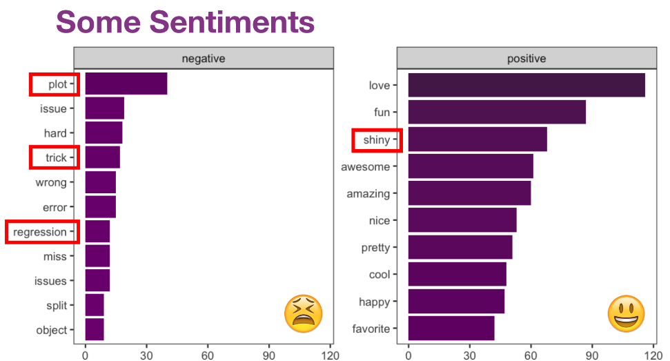

It was very cool seeing the different curators and the different things
the RLadies account talked about and Katherine provided a link to those
who want to curate the account in the slides!

-   [R Ladies Global Website](https://rladies.org/)
-   [R Ladies Twitter Account](https://twitter.com/WeAreRLadies)
-   [R Ladies Twitter Rotating Curation
    README](https://github.com/rladies/starter-kit/tree/master/RoCur-Twitter)
-   [Slides](https://github.com/katherinesimeon/WeAreRLadies-text-data/blob/master/slides/2020-01-30-rstudioconf.pdf)

Tidyverse Developer Day
=======================

As this was the third Tidy Dev Day there were some improvements
following lessons learnt from the first two iterations in Austin 2019
(my blog post on it
[here](https://ryo-n7.github.io/2019-01-25-tidyversedevday-rstudioconf-reflections/))
and in Toulouse 2019. This time around post-it notes were stuck on a
wall divided into groups of different {tidyverse} package and you had to
take the post-its to “claim” the issue. After you PR’d the issue you
were working on you can place your post-it under the “review” section of
the wall and wait while a tidyverse dev looked at your changes. Once
approved, they will move your sticker into the “merged” section. Once
you have your post-it in the “merged” section you can **SMASH** the gong
to raucous applause from everybody in the room, congratulations - you’ve
contributed to a {tidyverse} package!

-   [Gong video \#1: Laura
    Gabrysiak](https://twitter.com/lauragabrysiak/status/1223364117911592961)
-   [Gong video \#2: Gabriel
    Odom](https://twitter.com/RevDocGabriel/status/1223445860421230592)

What I also learned from this event was using the `pr_*()` family of
functions in the [{usethis}](https://usethis.r-lib.org/index.html)
package. I’m quite familiar with {usethis} as I use it at work often but
until TidyDev Day I hadn’t used the newer Pull Request (PR) functions as
I normally just did that manually on Github. The {usethis} workflow,
which was also posted on the [Tidy Dev Day
README](https://github.com/tidyverse/tidy-dev-day) in more detail, was
as follows:

-   Fork & clone repo with
    `usethis::create_from_github("{username}/{repo}")`.
-   Make sure all dependencies are installed with
    `devtools::install_dev_deps()`, restart R, then `devtools::check()`
    to see if everything is running OK.
-   Create a new branch of the repo where you’ll make all your fixes
    with `usethis::pr_init("very-brief-description")`
-   Make your changes: Be sure to document, test, and check your code.
-   Commit your changes
-   Push & Pull Request from R via `usethis::pr_push()`

For naming new branches I normally like to provide \~3 words starting
with an action verb (create/modify/edit/refactor/etc.) and then at the
end add the Github issue number. Example: `edit-count-docs-#2485`.

I was working on some documentation improvements for {ggplot2}. Getting
help and working next to both [Claus
Wilke](https://twitter.com/ClausWilke/) and [Thomas
Pedersen](https://twitter.com/thomasp85/) was delightful as I use
{cowplot} and {ggforce} extensively (not to mention {ggplot2},
obviously) but of course, I was very nervous at first!

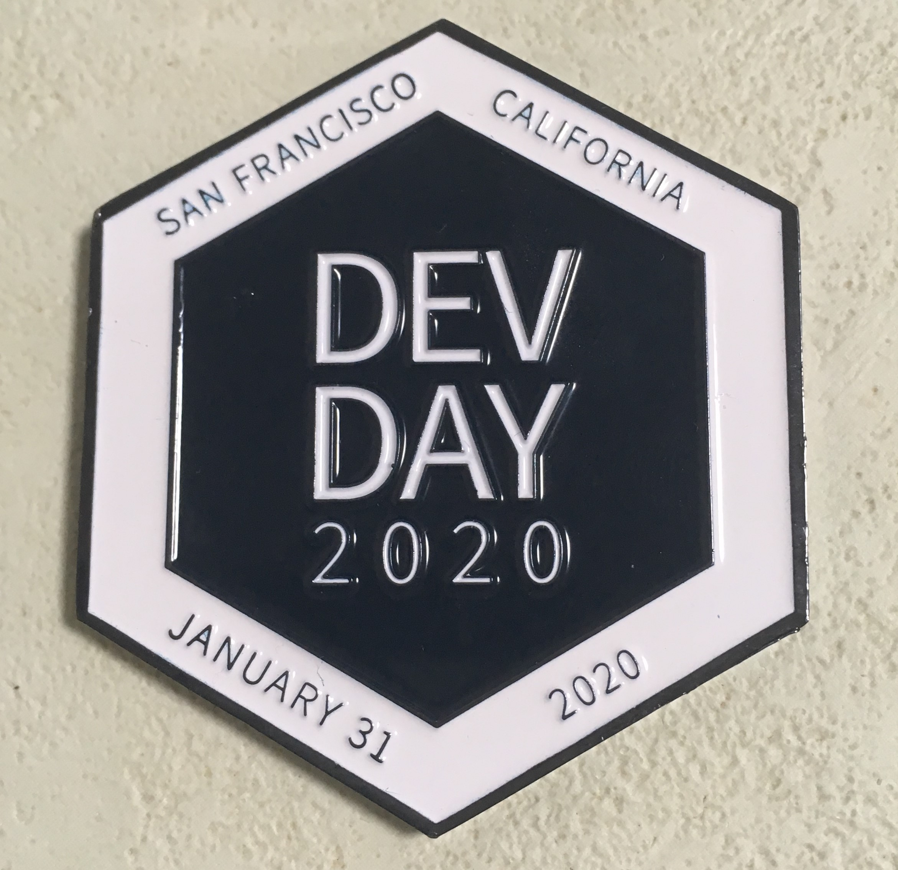

Conclusion
==========

Shoutout to some great presentations that I missed for a variety of
reasons like:

-   [Danielle Navarro: “Toward a grammar of behavioral
    experiments”](https://slides.com/djnavarro/rstudioconf2020#/)
-   [Will Chase: “The Glamour of
    Graphics”](https://www.williamrchase.com/slides/assets/player/KeynoteDHTMLPlayer.html)
-   [Nick Tierney: “Making Better Spaghetti (Plots): Exploring The
    Individuals In Longitudinal Data With The Brolgar
    Package”](https://njt-rstudio20.netlify.com/)
-   [Dani Chu: “Putting The Fun In Functional Data: A Tidy Pipeline To
    Identify Routes In NFL Tracking
    Data”](https://docs.google.com/presentation/d/1P9iT_TQUoxxCyvkfCLe5Y-9xBWpHh7btlP2mQ3XyNOM/edit)
-   **And many many more!**

I’m really looking forward to watching them on video soon!

On the evening/night of the first day of the conference was a special
reception event at the [California Academy of
Sciences](https://www.calacademy.org/)! After a long day everybody got
together for food, drink, and looking at all the flora/fauna on exhibit.
This was also where I met some of my fellow [R Weekly](rweekly.org/)
editorial team members for the first time! I also think this might have
been the first time that **four** editors were at the same place at the
same time!

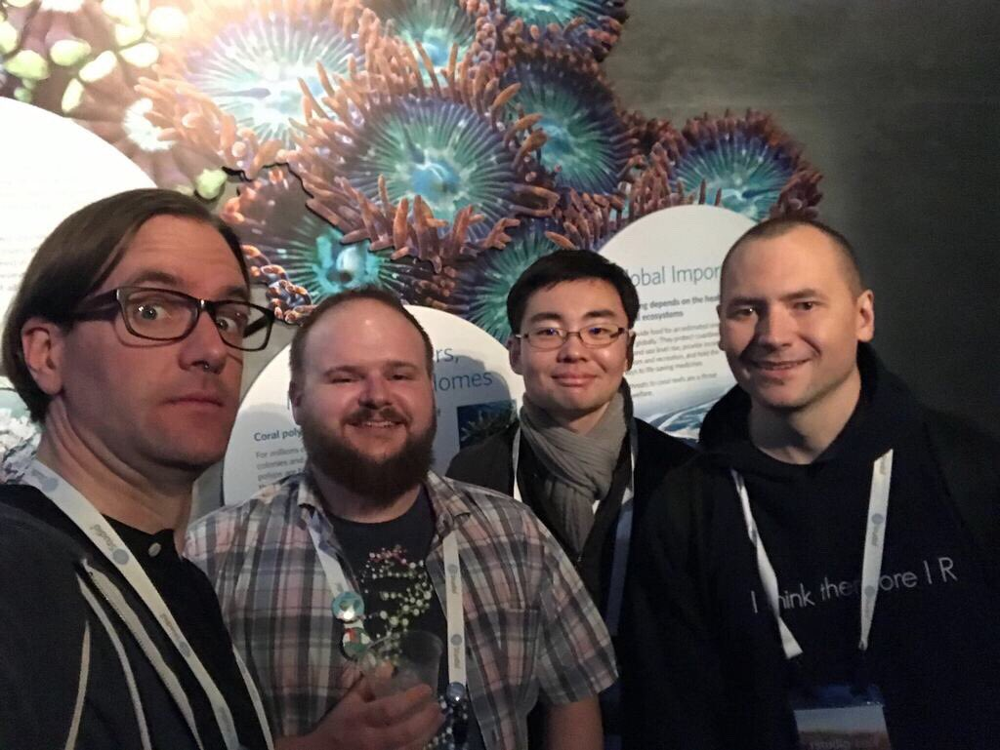

Outside of the conference I went to visit Alcatraz for the first time
since I was a little kid along with first-time visitors,
[Mitch](https://twitter.com/mitchoharawild) and
[Garth](https://twitter.com/garthtarr). That night I went to go see my
favorite hockey team, the San Jose Sharks, play live at the Shark Tank
for what feels like the first time in forever!

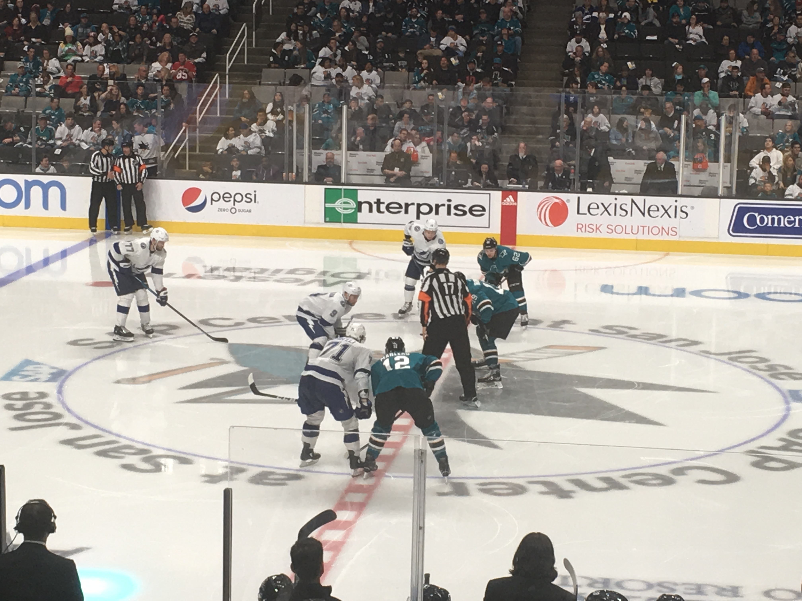

This was my third consecutive RStudio::Conf and I enjoyed it quite a
lot. As the years have gone by I’ve talked to a lot of people on
`#rstats` and it’s been a great opportunity to meet more and more of
these people in real life at these kind of events. The next conference
is in [Orlando, Florida](https://rstd.io/conf) from **January 18 to 21**
and I’ve already got my tickets, so I hope to see more of you all there!

 

