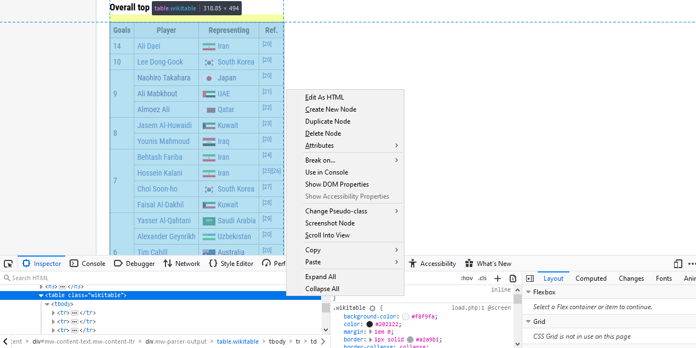
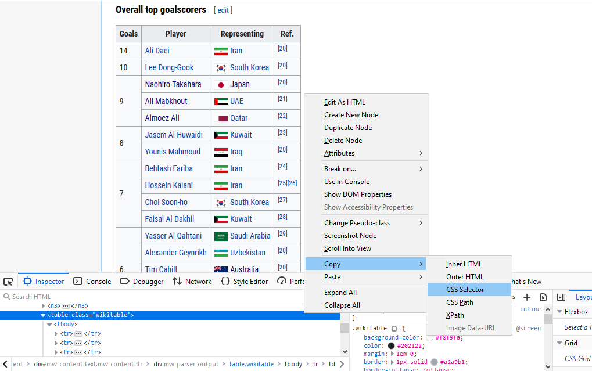
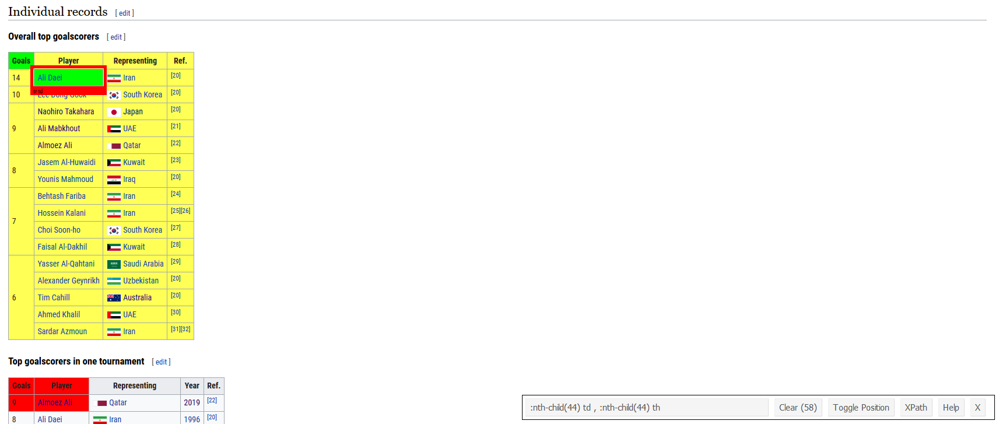
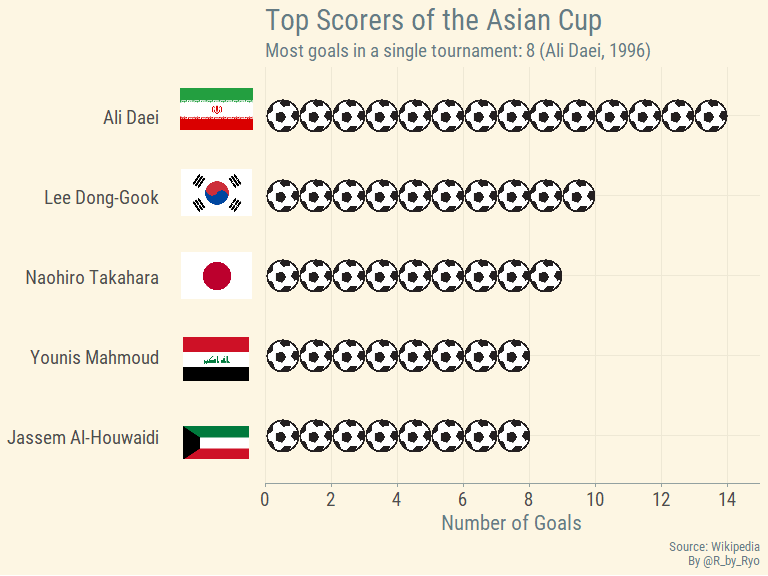
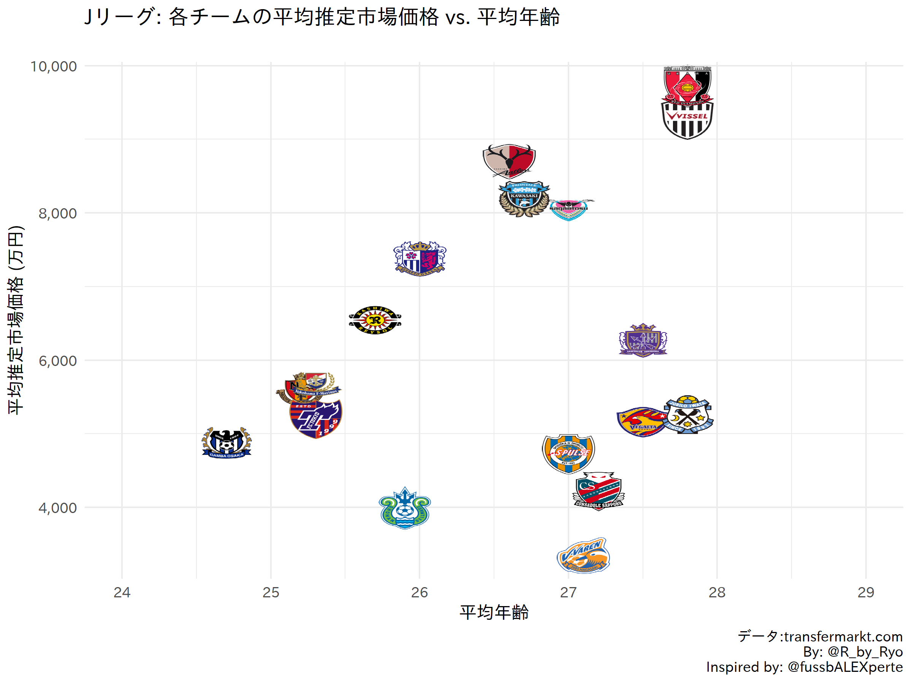
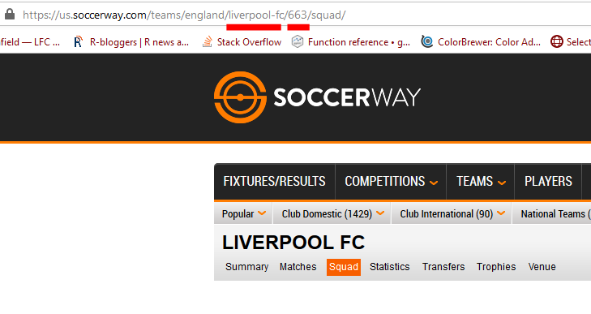
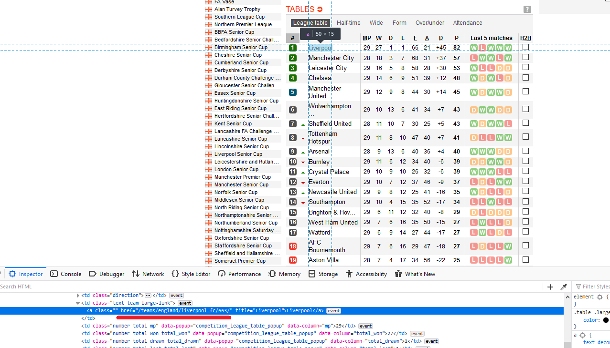
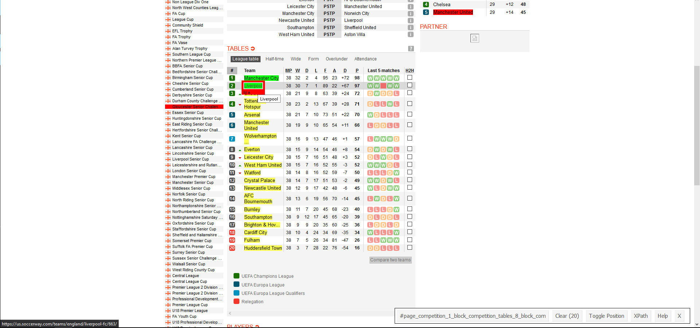
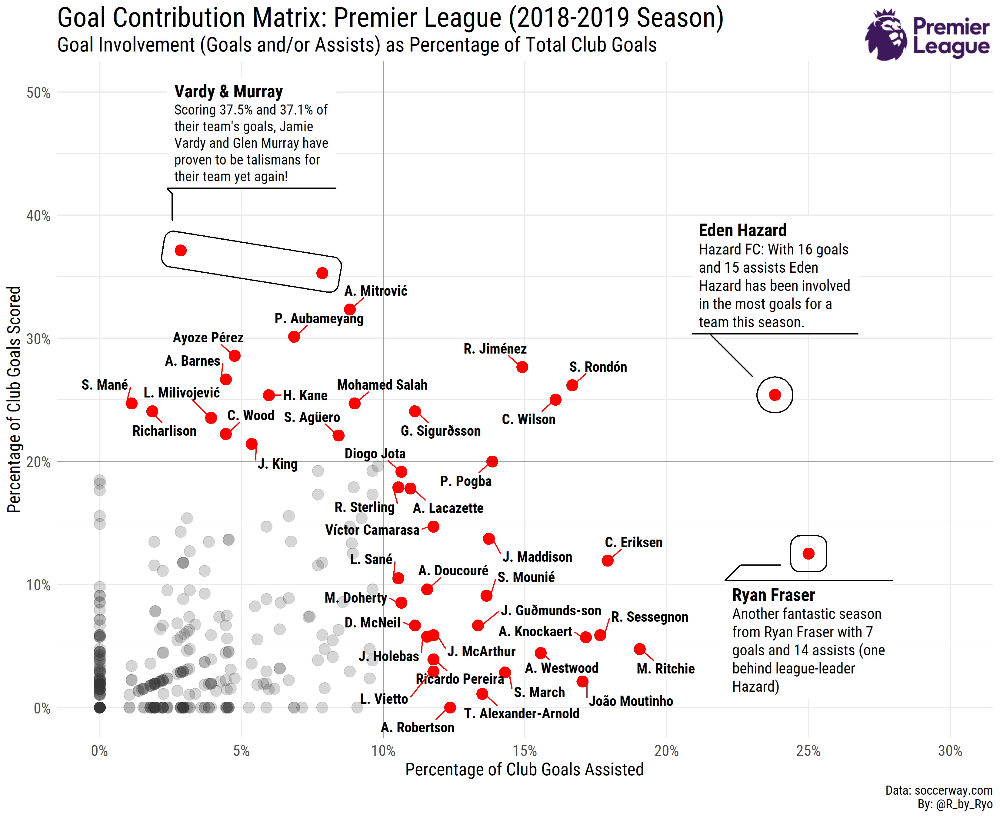
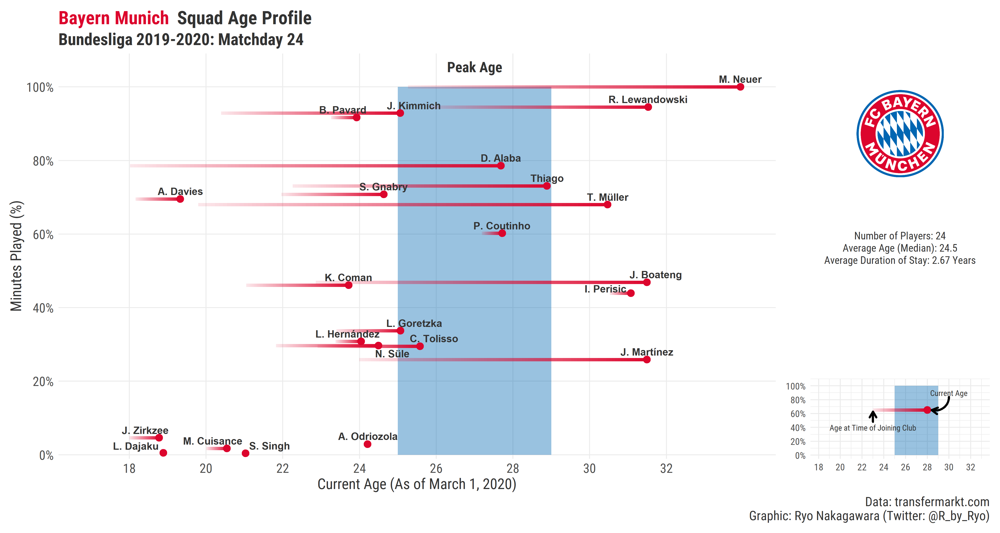

Fans of soccer/football have been left bereft of their prime form of
entertainment these past few months and I’ve seen a huge uptick in the
amount of casual fans and bloggers turning to learning programming
languages such as R or Python to augment their analytical toolkits. Free
and easily accessible data can be hard to find if you only just started
down this path and even when you do, you’ll find that eventually
dragging your mouse around and copying stuff into Excel just isn’t time
efficient or possible. The solution to this is web scraping! However, I
feel like a lot of people aren’t aware of the ethical conundrums
surrounding web scraping (especially if you’re coming from outside of a
data science/programming/etc. background …and even if you are I might
add). I am by **no means an expert** but since I started learning about
it all I’ve tried to **“web scrape responsibly”** and this tenet will be
emphasized throughout this blog post. I will be going over examples to
scrape soccer data from
[Wikipedia](https://en.wikipedia.org/wiki/Main_Page),
[soccerway.com](https://int.soccerway.com/), and
[transfermarkt.com](https://www.transfermarkt.com/). Do note this is
focused on the web-scraping part and won’t cover the visualization,
links to the viz code will be given at the end of each section and you
can always check out my
[soccer\_ggplot](https://github.com/Ryo-N7/soccer_ggplots) Github repo
for more soccer viz goodness!

Anyway, let’s get started!

Web Scraping Responsibly
========================

When we think about R and web scraping, we normally just think straight
to loading `{rvest}` and going right on our merry way. However, there
are quite a lot of things you should know about web scraping practices
before you start diving in. “Just because you can, doesn’t mean you
should.” `robots.txt` is a file in websites that describe the
permissions/access privileges for any bots and crawlers that come across
the site. Certain parts of the website may not be accessible for certain
bots (say Twitter or Google), some may not be available at all, and in
the most extreme case, web scraping may even be prohibited. However, do
note that just because there is no `robots.txt` file or that it is
permissive of web scraping does **not** automatically mean you are
allowed to scrape. You should always check the website’s **“Terms of
Use”** or similar pages.

Web scraping takes up bandwidth for a host, especially if it houses lots
of data. So writing web scraping bots and functions that are polite and
respectful of the hosting site is necessary so that we don’t
inconvenience websites that are **doing us a service** by making the
data available for us for **free**! There’s a lot of things we take for
granted, especially regarding free soccer data, so let’s make sure we
can keep it that way.

In R there are a number of different packages that facilitates
responsible web scraping packages, including:

-   [{robotstxt}](https://github.com/ropensci/robotstxt) is a package
    created by [Peter Meissner](https://github.com/petermeissner) and
    provides functions to parse `robots.txt` files in a clean way.

-   [{ratelimitr}](https://github.com/tarakc02/ratelimitr) created by
    [Tarak Shah](https://github.com/tarakc02) provides ways to limit the
    rate which functions are called. You can define a certain `n` calls
    per `period` of time to any function wrapped in
    `ratelimitr::limit_rate()`.

The [{polite}](https://dmi3kno.github.io/polite/) package takes a lot of
the things previously mentioned into one neat package that flows
seamlessly with the {rvest} API. I’ve been using this package almost
since its first release and it’s terrific! I got to see the package
author ([Dmytro Perepolkin](https://github.com/dmi3kno)) do a
presentation on it at [UseR
2019](https://ryo-n7.github.io/2019-07-21-user2019-reflections/) you can
find the video recording
[here](https://www.youtube.com/watch?v=6V_nu0K_3mk&list=PL4IzsxWztPdm9_UFnWOCG7Rmw3oW5Fgju&index=3&t=0s).
This blog post will mainly focus on using {rvest} in combination with
the {polite} package.

Single web-page (Wikipedia)
===========================

``` r
## On R 3.5.3
library(rvest)   # 0.3.5
library(polite)  # 0.1.1
library(dplyr)   # 0.8.5
library(tidyr)   # 1.0.2
library(purrr)   # 0.3.4
library(stringr) # 1.4.0
library(glue)    # 1.4.0
library(rlang)   # 0.4.6
```

For the first example, let’s start with scraping soccer data from
Wikipedia, specifically the top goal scorers of the Asian Cup.

We use `polite::bow()` to pass the URL for the Wikipedia article to get
a polite session object. This object will tell you about the
`robots.txt`, the recommended crawl delay between scraping attempts, and
tells you whether you are allowed to scrape this URL or not. You can
also add your own user name in the `user_agent` argument to introduce
yourself to the website.

``` r
topg_url <- "https://en.wikipedia.org/wiki/AFC_Asian_Cup_records_and_statistics"

session <- bow(topg_url,
               user_agent = "Ryo's R Webscraping Tutorial")

session
```

    ## <polite session> https://en.wikipedia.org/wiki/AFC_Asian_Cup_records_and_statistics
    ##     User-agent: Ryo's R Webscraping Tutorial
    ##     robots.txt: 454 rules are defined for 33 bots
    ##    Crawl delay: 5 sec
    ##   The path is scrapable for this user-agent

Of course, just to make sure, remember to read the “Terms of Use” page
as well. When it comes to Wikipedia though, you could just [download all
of Wikipedia’s
data](https://en.wikipedia.org/wiki/Wikipedia:Database_download)
yourself and do a text-search through those files but that’s
out-of-scope for this blog post, maybe another time!

Now to actually get the data from the webpage. You’ve got different
options depending on what browser you’re using but on Google Chrome or
Mozilla Firefox you can find the exact HTML element by right clicking on
it and then clicking on “Inspect” or “Inspect Element” in the pop-up
menu. By doing so, a new view will open up showing you the full HTML
content of the webpage with the element you chose highlighted. (See first two pics)

You might also want to try using a handy JavaScript tool called `SelectorGadget`,
you can learn how to use it
[here](https://rvest.tidyverse.org/articles/selectorgadget.html). It
allows you to click on different elements of the web page and
the gadget will try to ascertain the exact CSS Selector in the HTML. (See bottom pic)

Do be warned that web pages can change suddenly and the CSS Selector you
used in the past might not work anymore. I’ve had this happen more than a few times
as pages get updated with more info from new tournaments and such. This
is why you really should try to scrape from a more stable website, but a
lot of times for “simple” data Wikipedia is the easiest and best place
to scrape.







From here you can right-click again on the highlighted HTML code to
“Copy”, and then you can choose one of “CSS Selector”, “CSS Path”, or
“XPath”. I normally use “CSS Selector” and it will be the one I will use
throughout this tutorial. This is the exact reference within the HTML
code of the webpage of the object you want. I make sure to choose the
CSS Selector for the **table** itself and not just the info inside the
table.

With this copied, you can go to your R script/RMD/etc. After running the
`polite::scrape()` function on your `bow` object, paste in the CSS
Selector/Path/XPath you just copied into `html_nodes()`. The `bow`
object already has the recommended scrape delay as stipulated in a
website’s `robots.txt` so you don’t have to input it manually when you
scrape.

``` r
ac_top_scorers_node <- scrape(session) %>%
  html_nodes("table.wikitable:nth-child(44)")
```

Grabbing a HTML table is the easiest way to get data as you usually
don’t have to do too much work to reshape the data afterwards. We can do
that with the `html_table()` function. As the HTML object returns as a
list, we have to flatten it out one level using `purrr::flatten_df()` .
Finish cleaning it up by taking out the unnecessary “Ref” column with
`select()` and renaming the column names with `set_names()`.

``` r
ac_top_scorers <- ac_top_scorers_node %>% 
  html_table() %>% 
  flatten_df() %>% 
  select(-Ref.) %>% 
  set_names(c("total_goals", "player", "country"))
```

After adding some flag and soccer ball images to the data.frame we get
this:



Do note that the image itself is from **before** the 2019 Asian Cup but
the data we scraped in the code above is **updated**. As a visualization
challenge try to create a similar viz with the updated data! You can
take a look at my [Asian Cup 2019 blog
post](https://ryo-n7.github.io/2019-01-11-visualize-asian-cup/) for how
I did it. Alternatively you can try doing the same as above except with
the
[Euros](https://en.wikipedia.org/wiki/List_of_UEFA_European_Championship_records_and_statistics).
Try grabbing the top goal scorer table from that page and make your own
graph!

Single-page (Transfermarkt)
===========================

So now let’s try a soccer-specific website as that’s really the goal of
this blog post. This time we’ll go for one of the most famous soccer
websites around, `transfermarkt.com`. A website used as a data source
from your humble footy blogger to big news sites such as the [Financial
Times](https://twitter.com/jburnmurdoch/status/1058036551454724096) and
the [BBC](https://www.bbc.com/sport/football/52221463).

The example we’ll try is from an Age-Value graph for the J-League I made
around 2 years ago when I just started doing soccer data viz (how times
flies…).

``` r
url <- "https://www.transfermarkt.com/j-league-division-1/startseite/wettbewerb/JAP1/saison_id/2017"

session <- bow(url)

session
```

    ## <polite session> https://www.transfermarkt.com/j-league-division-1/startseite/wettbewerb/JAP1/saison_id/2017
    ##     User-agent: polite R package - https://github.com/dmi3kno/polite
    ##     robots.txt: 1 rules are defined for 1 bots
    ##    Crawl delay: 5 sec
    ##   The path is scrapable for this user-agent

-   [Terms of Use (in German)](https://www.transfermarkt.com/intern/anb)

The basic steps are the same as before but I’ve found that it can be
quite tricky to find the right nodes on `transfermarkt` even with the
CSS Selector Gadget or other methods we described in previous sections.
After a while you’ll get used to the quirks of how the website is
structured and know what certain assets (tables, columns, images) are
called easily. This is a website where the `SelectorGadget` really comes
in handy!

This time around I won’t be grabbing an entire table like I did with
Wikipedia but a number of elements from the webpage. You definitely
**can** scrape for the table like I showed above with `html_table()` but
in this case I didn’t because the table output was rather messy, gave me
way more info than I actually needed, and I wasn’t very good at
regex/stringr to clean the text 2 years ago. Try doing it the way below
and also by grabbing the entire table for more practice.

The way I did it back then also works out for this blog post because I
can show you a few other `html_*()` {rvest} functions:

-   `html_table()`: Get data from a HTML table
-   `html_text()`: Extract text from HTML
-   `html_attr()`: Extract attributes from HTML (`"src"` for image
    filename, `"href"` for URL link address)

``` r
team_name <- scrape(session) %>% 
  html_nodes("#yw1 > table > tbody > tr > td.zentriert.no-border-rechts > a > img") %>% 
  html_attr("alt")

# average age
avg_age <- scrape(session) %>% 
  html_nodes("tbody .hide-for-pad:nth-child(5)") %>% 
  html_text()

# average value
avg_value <- scrape(session) %>% 
  html_nodes("tbody .rechts+ .hide-for-pad") %>% 
  html_text()

# team image
team_img <- scrape(session) %>% 
  html_nodes("#yw1 > table > tbody > tr > td.zentriert.no-border-rechts > a > img") %>% 
  html_attr("src")
```

With each element collected we can put them into a list and reshape it
into a nice data frame.

``` r
# combine above into one list
resultados <- list(team_name, avg_age, avg_value, team_img)

# specify column names
col_name <- c("team", "avg_age", "avg_value", "img")

# Combine into one dataframe
j_league_age_value_raw <- resultados %>% 
  reduce(cbind) %>% 
  tibble::as_tibble() %>% 
  set_names(col_name)

glimpse(j_league_age_value_raw)
```

    ## Rows: 18
    ## Columns: 4
    ## $ team      <chr> "Vissel Kobe", "Urawa Red Diamonds", "Kawasaki Frontale",...
    ## $ avg_age   <chr> "25.9", "26.3", "25.5", "24.1", "25.4", "25.0", "25.0", "...
    ## $ avg_value <chr> "€1.02m", "€698Th.", "€577Th.", "€477Th.", "€524Th.", "€5...
    ## $ img       <chr> "https://tmssl.akamaized.net/images/wappen/tiny/3958.png?...

With some more cleaning and {ggplot2} magic (see
[here](https://gist.github.com/Ryo-N7/fcfbbfc229250a18c3694192f1c75b4c),
start from line 53) you will then get:



Some other examples by scraping single web pages:

-   transfermarkt: [simple age-utility plot from
    2018](https://gist.github.com/Ryo-N7/5309ba2496b4f75a0747166bfbc52270)
-   [“Winners of the Copa America” section of Visualizing the Copa
    America with
    R](https://ryo-n7.github.io/2019-06-18-visualize-copa-america/)

Multiple Web-pages (Soccerway, Transfermarkt, etc.)
===================================================

The previous examples looked at scraping from a single web page but
usually you want to collect data for each team in a league, each player
from each team, or each player from each team in every league, etc. This
is where the added complexity of web-scraping multiple pages comes in.
The most efficient way is to be able to programatically scrape across
multiple pages in one go instead of running the same scraping function
on different teams’/players’ URL link over and over again.

<center>
<b>Thinking About How to Scrape</b>
</center>

-   Understand the website structure: How it organizes its pages, check
    out what the CSS Selector/XPaths are like, etc.
-   Get a list of links: Team page links from league page, player page
    links from team page, etc.
-   Create your own R functions: Pinpoint exactly what you want to
    scrape as well as some cleaning steps post-scraping in one function
    or multiple functions.
-   Start small, then scale up: Test your scraping function on one
    player/team, then do entire team/league.
-   Iterate over a set of URL links: Use {purrr}, `for` loops,
    `lapply()` (whatever your preference).

Look at the URL link for each web page you want to gather. What are the
similarities? What are the differences? If it’s a proper website than
the web page for a certain data view for each team should be exactly the
same, as you’d expect it to contain exactly the same type of info just
for a different team. For this example each “squad view” page for each
Premier League team on `soccerway.com` are structured similarly:
“<a href="https://us.soccerway.com/teams/england/" class="uri">https://us.soccerway.com/teams/england/</a>”
and then the “team name/”, the “team number/” and finally the name of
the web page, “squad/”. So what we need to do here is to find out the
“team name” and “team number” for each of the teams and store them. We
can then feed each pair of these values in one at a time to scrape the
information for each team.



``` r
url <- "https://us.soccerway.com/national/england/premier-league/20182019/regular-season/r48730/"

session <- bow(url)

session
```

    ## <polite session> https://us.soccerway.com/national/england/premier-league/20182019/regular-season/r48730/
    ##     User-agent: polite R package - https://github.com/dmi3kno/polite
    ##     robots.txt: 4 rules are defined for 3 bots
    ##    Crawl delay: 5 sec
    ##   The path is scrapable for this user-agent

-   [Terms of Use](https://us.soccerway.com/terms/)

To find these elements we could just click on the link for each team and
jot them down … but wait we can just scrape those too! We use the
`html_attr()` function to grab the “href” part of the HTML, which
contains the hyperlink of that element. The left picture is looking at
the URL link of one of the buttons to a team’s page via “Inspect”. The
right picture is selecting every team’s link via the `SelectorGadget`.





``` r
team_links <- scrape(session) %>% 
  html_nodes("#page_competition_1_block_competition_tables_8_block_competition_league_table_1_table .large-link a") %>% 
  html_attr("href")

team_links[[1]]
```

    ## [1] "/teams/england/manchester-city-football-club/676/"

The URL given in the `href` of the HTML for the team buttons
unfortunately aren’t the **full** URL needed to access these pages. So
we have to cut out the important bits and re-create them ourselves. We
can use the {glue} package to combine the “team\_name” and “team\_num”
for each team in the incomplete URL into a complete URL in a new column
we’ll call `link`.

``` r
team_links_df <- team_links %>% 
  tibble::enframe(name = NULL) %>% 
  ## separate out each component of the URL by / and give them a name
  tidyr::separate(value, c(NA, NA, NA, "team_name", "team_num"), sep = "/") %>% 
  ## glue together the "team_name" and "team_num" into a complete URL
  mutate(link = glue("https://us.soccerway.com/teams/england/{team_name}/{team_num}/squad/"))

glimpse(team_links_df)
```

    ## Rows: 20
    ## Columns: 3
    ## $ team_name <chr> "manchester-city-football-club", "liverpool-fc", "chelsea...
    ## $ team_num  <chr> "676", "663", "661", "675", "660", "662", "680", "674", "...
    ## $ link      <glue> "https://us.soccerway.com/teams/england/manchester-city-...

Fantastic! Now we have the proper URL links for each team. Next we have
to actually look into one of the web pages itself to figure out what
exactly we need to scrape from the web page. This assumes that each web
page and the CSS Selector for the various elements we want to grab are
the same for every team. As this is for a very simple goal contribution
plot all we need to gather from each team’s page is the “player name”,
“number of goals”, and “number of assists”. Use the `Inspect element` or
the `SelectorGadget` tool to grab the HTML code for those stats.

Below, I’ve split each into its own mini-scraper function. When you’re
working on this part, you should try to use the URL link from one team
and build your scraper functions from that link (I usually use Liverpool
as my test example when scraping Premier League teams). Note that all
three of the mini-functions below could just be chucked into one large
function but I like keeping things compartmentalized.

``` r
player_name_info <- function(session) {
  
  player_name_info <- scrape(session) %>% 
    html_nodes("#page_team_1_block_team_squad_3-table .name.large-link") %>% 
    html_text()
}

num_goals_info <- function(session) {

  num_goals_info <- scrape(session) %>% 
    html_nodes(".goals") %>% 
    html_text()
  
  ## first value is blank so remove it
  num_goals_info_clean <- num_goals_info[-1]
}

num_assists_info <- function(session) {

  num_assists_info <- scrape(session) %>% 
    html_nodes(".assists") %>% 
    html_text()
  
  ## first value is blank so remove it
  num_assists_info_clean <- num_assists_info[-1]
}
```

Now that we have scrapers for each stat, we can combine these into a
larger function that will then gather them all up into a nice data frame
for each team that we want to scrape. If you input any one of the team
URLs from `team_links_df`, it will collect the “player name”, “number of
goals”, and “number of assists” for that team.

``` r
premier_stats_info <- function(link, team_name) {
  
  team_name <- rlang::enquo(team_name)
  ## `bow()` for every URL link
  session <- bow(link)
  
  ## scrape different stats
  player_name <- player_name_info(session = session)

  num_goals <- num_goals_info(session = session)

  num_assists <- num_assists_info(session = session)
  
  ## combine stats into a data frame
  resultados <- list(player_name, num_goals, num_assists)
  col_names <- c("name", "goals", "assists") 
  
  premier_stats <- resultados %>% 
    reduce(cbind) %>% 
    as_tibble() %>% 
    set_names(col_names) %>% 
    mutate(team = !!team_name)
  
  ## A little message to keep track of how the function is progressing:
  # cat(team_name, " done!")
  
  return(premier_stats)
}
```

Iteration Over a Set of Links
-----------------------------

OK, so now we have a function that can scrape the data for **ONE** team
but it would be extremely ponderous to re-run it another NINETEEN times
for all the other teams… so what can we do? This is where the
`purrr::map()` family of functions and iteration comes in! The `map()`
family of functions allows you to apply a function (an existing one from
a package or one that you’ve created yourself) to each element of a list
or vector that you pass as an argument to the mapping function. For our purposes, this
means we can use mapping functions to pass along a list of URLs (for
whatever number of players and/or teams) along with a scraping function
so that it scrapes it altogether in one go.

In addition, we can use `purrr::safely()` to wrap any function
(including custom made ones). This makes these functions return a list
with the components `result` and `error`. This is extremely useful for
debugging complicated functions as the function won’t just error out and
give you nothing, but at least the result of the parts of the function
that worked in `result` with what didn’t work in `error`.

So for example, say you are scraping data from the webpage of each team
in the Premier League (by iterating a single scraping function over each
teams’ web page) and by some weird quirk in the HTML of the web page or
in your code, the data from one team errors out (while the other 19
teams’ data are gathered without problems). Normally, this will mean the
data you gathered from **all** other web pages that **did** work
**won’t** be returned, which can be extremely frustrating. With a
`safely()` wrapped function, the data from the 19 teams’ data that the
function was able to scrape is returned in `result` component of the
list object while the one errored team and error message is returned in
the `error` component. This makes it very easy to debug when you know
exactly which iteration of the function failed.

``` r
safe_premier_stats_info <- safely(premier_stats_info)
```

We already have a nice list of team URL links in the data frame
`team_links_df`, specifically in the “link” column
(`team_links_df$link`). So we pass that along as an argument to `map2()`
(which is just a version of `map()` but for two argument inputs) and our
`premier_stats_info()` function so that the function will be applied to
**each** team’s URL link. This part may take a while depending on your
internet connection and/or if you put a large value for the crawl delay.

``` r
goal_contribution_df_ALL <- map2(.x = team_links_df$link, .y = team_links_df$team_name,
                             ~ safe_premier_stats_info(link = .x, team_name = .y))

## check out the first 4 results:
glimpse(head(goal_contribution_df_ALL, 4))
```

As you can see (the results/errors for the first four teams scraped),
for each team there is a list holding a “result” and “error” element.
For the first four, at least, it looks like everything was scraped
properly into a nice data.frame. We can check if any of the twenty teams
had an error by `purrr::discard()`-ing any elements of the list that
come out as NULL and seeing if there’s anything left.

``` r
## check to see if any failed:
goal_contribution_df_ALL %>% 
  map("error") %>% 
  purrr::discard(~is.null(.))
```

    ## list()

It comes out as a empty list which means were no errors in the “error”
elements. Now we can squish and combine individual team data.frames into
one data.frame using `dplyr::bind_rows()`.

``` r
goal_contribution_df <- goal_contribution_df_ALL %>% 
  map("result") %>% 
  bind_rows()

glimpse(goal_contribution_df)
```

    ## Rows: 622
    ## Columns: 4
    ## $ name    <chr> "C. Bravo", "Ederson Moraes", "S. Carson", "K. Walker", "J....
    ## $ goals   <chr> "0", "0", "0", "1", "0", "0", "0", "0", "0", "2", "0", "0",...
    ## $ assists <chr> "0", "0", "0", "2", "0", "0", "0", "2", "0", "0", "0", "0",...
    ## $ team    <chr> "manchester-city-football-club", "manchester-city-football-...

With that we can clean the data a bit and finally get on to the plotting! You can find the code [in the original
gist](https://gist.github.com/Ryo-N7/67ca1c364c342a82c4098918082ca445)
to see how I created the plot below. I really would like to go into
detail especially as I use one of my favorite plotting packages,
{ggforce}, here but it deserves its own separate blog post. __NOTE__: The data we scraped in the above section is for this season (2019-2020) so the annotations won't be the same as [in the original
gist](https://gist.github.com/Ryo-N7/67ca1c364c342a82c4098918082ca445) which is for 2018-2019. Try to play around with the different annotations options in R as practice!



As you can see, this one was for the 2018-2019 season. I made a similar
one but using `xG per 90` and `xA per 90` for the 2019-2020 season (as
per January 1st, 2020 at least) using [FBRef](https://fbref.com/) data
[here](https://twitter.com/R_by_Ryo/status/1213095273703952384). You can find the
code for it
[here](https://gist.github.com/Ryo-N7/a4b8799328debf335a055d52260f8d03).
However, I did **not** web scrape it as from their [Terms of
Use](https://www.sports-reference.com/termsofuse.html) page, FBRef (or
any of the SportsRef websites) do **not** allow web scraping
(“spidering”, “robots”). Thankfully, they make it **very easy** to
access their data as downloadable `.csv` files by just clicking on a few
buttons, so getting their data isn’t really a problem!

For practice, try doing it for a different season or for a different
league altogether!

For other examples of scraping multiple pages:

-   transfermarkt: [(Opta-inspired Age-Utility plot from February 28,
    2020)](https://gist.github.com/Ryo-N7/d5b481e1813670f88d67fe40d5295fe4)
- [Age-Utility plots for most major European teams (Twitter thread)](https://twitter.com/R_by_Ryo/status/1233375468952272898)



Conclusion
==========

This blog post went over web-scraping, focusing on getting soccer data
from soccer websites in a responsibly fashion. After a brief overview of
responsible scraping practices with R I went over several examples of
getting soccer data from various websites. I make no claims that its the
most efficient way, but importantly, it gets the job done and in a
polite way. More industrial-scale scraping over hundreds and thousands
of web pages is a bit out of scope for an introductory blog post and
it’s not something I’ve really done either, so I will pass along the
torch to someone else who wants to write about that. There are other
ways to scrape websites using R, especially websites that have dynamic
web pages, using [R Selenium](https://github.com/ropensci/RSelenium),
Headless Chrome ([crrri](https://github.com/RLesur/crrri)), and other
tools.

In regards to [FBRef](https://fbref.com/), as it is now a really popular
website to use (especially with their partnership with StatsBomb), there
is a blog post out there detailing a way of using R Selenium to get around
the terms stipulated and the reasoning seems OK but I am still not 100%
sure. This goes again into how a lot of web scraping can be in a rather
grey area at times, as for all the clear warnings on some websites you
have a lot more ambiguity and ability to use some expedient
interpretation in others. At the end of the day, you just have to do
your **due diligence**, ask **permission** directly if possible, and be
[{polite}](https://github.com/dmi3kno/polite) about it.

Some other web-scraping tutorials you might be interested in:

-   [Harvesting the web with rvest (rvest package
    vignette)](https://rvest.tidyverse.org/articles/harvesting-the-web.html)
-   [Web scraping the {polite}
    way](https://www.rostrum.blog/2019/03/04/polite-webscrape/)

As always, you can find more of my soccer-related stuff on this website
or on [soccer\_ggplots](https://github.com/Ryo-N7/soccer_ggplots) Github
repo!

**Happy (responsible) Web-scraping!**

<center>
<script type='text/javascript' src='https://storage.ko-fi.com/cdn/widget/Widget_2.js'></script><script type='text/javascript'>kofiwidget2.init('Buy Me A Coffee!', '#29abe0', 'O4O342A2A');kofiwidget2.draw();</script> 
<center/>
