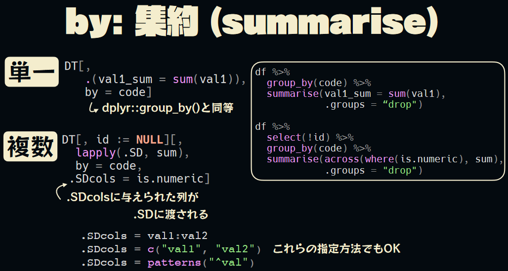
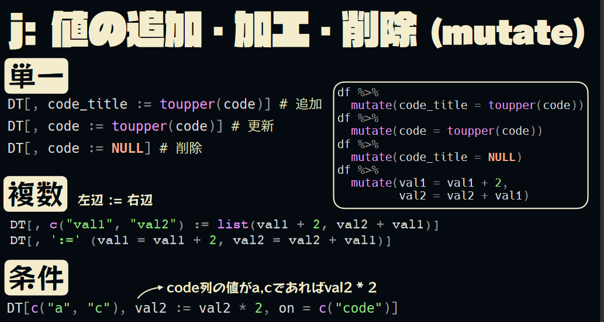
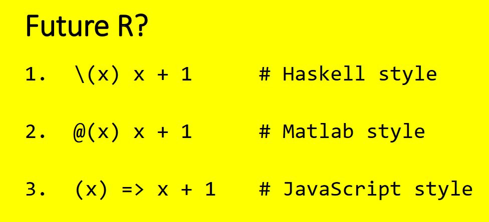
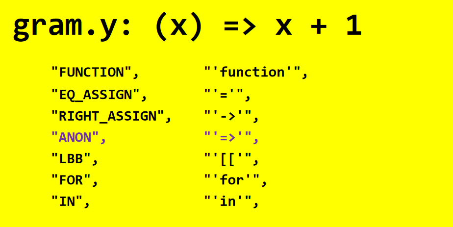
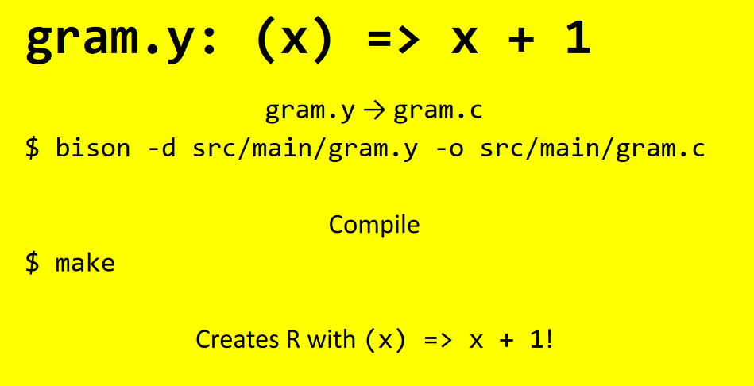
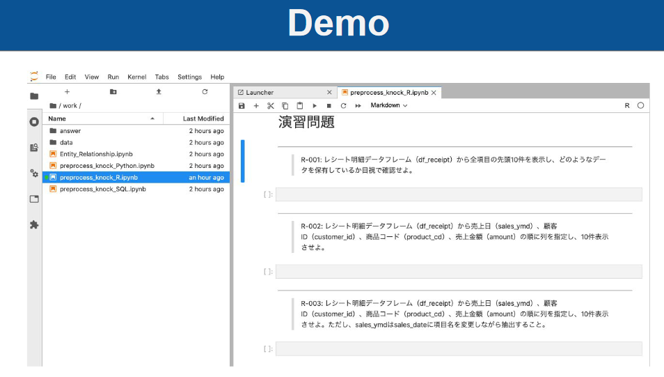
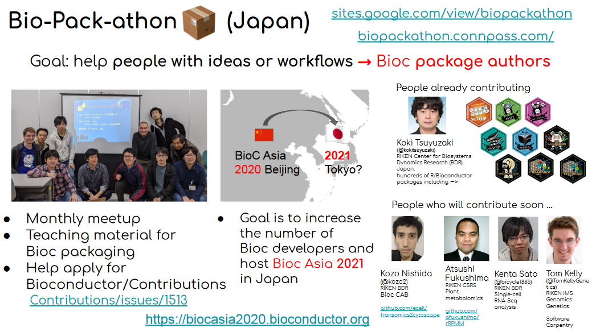

As the monsoon season (finally) ends, another TokyoR meetup! Since COVID
hit all of TokyoR’s meetups since February have been done online and the
transition has been seamless thanks to the efforts of the `TokyoR`
organizing team. It was my first `TokyoR` since January so it was great
to be back!

In line with my previous round up posts:

-   [TokyoR \#76: February
    2019](https://ryo-n7.github.io/2019-03-07-tokyoR-76-roundup/)
-   [TokyoR \#77: April
    2019](https://ryo-n7.github.io/2019-04-24-tokyoR-77/))
-   [TokyoR \#78: May
    2019](https://ryo-n7.github.io/2019-05-31-tokyoR-78-roundup/)
-   [TokyoR \#79: June
    2019](https://ryo-n7.github.io/2019-07-05-tokyoR-79-roundup/)
-   [TokyoR \#80: July
    2019](https://ryo-n7.github.io/2019-08-02-tokyoR-80-roundup/)

I will be going over around half of all the talks. Hopefully, my efforts
will help spread the vast knowledge of Japanese R users to the wider R
community. Throughout I will also post helpful blog posts and links from
other sources if you are interested in learning more about the topic of
a certain talk. You can follow **Tokyo.R** by searching for the
[\#TokyoR](https://twitter.com/hashtag/TokyoR) hashtag on Twitter.

Anyway…

Let’s get started!

BeginneR Session
================

As with every [TokyoR](http://tokyor.connpass.com/) meetup, we began
with a set of beginner user focused talks:

-   \[Data tidying by
    y\_\_mattu\](<a href="https://ymattu.github.io/TokyoR87/slide.html#/" class="uri">https://ymattu.github.io/TokyoR87/slide.html#/</a>)
-   \[Data visualization by
    yuta\_kanzawa\](<a href="https://ytknzw.github.io/TokyoR/%E5%88%9D%E5%BF%83%E8%80%85%E3%82%BB%E3%83%83%E3%82%B7%E3%83%A7%E3%83%B3_%E3%83%87%E3%83%BC%E3%82%BF%E5%8F%AF%E8%A6%96%E5%8C%96_TokyoR_20200801.pdf" class="uri">https://ytknzw.github.io/TokyoR/%E5%88%9D%E5%BF%83%E8%80%85%E3%82%BB%E3%83%83%E3%82%B7%E3%83%A7%E3%83%B3_%E3%83%87%E3%83%BC%E3%82%BF%E5%8F%AF%E8%A6%96%E5%8C%96_TokyoR_20200801.pdf</a>)

Main Talks
==========

[u\_ribo](https://twitter.com/u_ribo): Let’s learn {data.table}!
----------------------------------------------------------------

-   [Slides](https://speakerdeck.com/s_uryu/datatable1130)

`@u_ribo` gave an introduction to the {data.table} package. The
{data.table} package is a package that extends the `data.frame` and
allows you to do fast data manipulation, data aggregation, and more!
`@u_ribo`’s slides were very easy to understand and is probably a very
good intro to {data.table} for tidyverse users as the walk-through
included side-by-side comparisons with similar {dplyr} and {tidyr}
syntax (shown in detail below).

The 3 main differences he made to contrast with {dplyr} were: 
-   Lower \# of dependencies: {data.table} only uses {methods} 
-   Lower memory usage: deep-copy {dplyr} vs. shallow-copy {data.table} 
-   “Conservative” development: Try to minimize the amount of breaking changes in new code

Other {data.table} resources:

-   [data.table package
    Wiki](https://github.com/Rdatatable/data.table/wiki)
-   [Why I love
    data.table](https://eliocamp.github.io/codigo-r/en/2019/07/why-i-love-data-table/)
-   [Data cleaning and exploration with data.table - Megan
    Stodel](https://www.meganstodel.com/posts/using-data-table/)

Lightning Talks
===============

[soupcurry049](https://twitter.com/soupcurry049/): Introduction to {ggspatial}!
-------------------------------------------------------------------------------

-   [Slides](https://www.slideshare.net/kashitan/shinyleaflettips-177070514)

`@soupcurry049` gave a introduction to the {ggspatial} package which
provides the user with ggplot-like style for plotting spatial data. It
supports `sf`, `sp`, and `raster` objects and you have a lot of cool
options for annotations (spatial lines, a NORTH arrow, etc.), layers,
spatial geometries (in `ggplot2::geom_*()` style). `@soupcurry049`
finished off the LT with a quick demonstration of a map showing Onsen
locations in Hokkaido prefecture.

-   [{ggspatial} website](https://paleolimbot.github.io/ggspatial/)

[andrew\_cb2](https://twitter.com/andrew_cb2/): (x) =\> x + 1
-------------------------------------------------------------

-   [Slides](https://speakerdeck.com/andycraig/x-equals-x-plus-1)

`@andrew_cb2` talked about … not programming IN R but programming R
itself. Currently in R the syntax for creating a function requires
typing out `function(...) ...` but typing all 8 letters every time can
be annoying, couldn’t there be a way to make it shorter? Recently there
has been talk about creating a shorter anonymous function syntax and the
following 3 styles were discussed:

The reason why some implementations are harder than others is due to the
location of the special characters and R. `@andrew_cb2` then gave us a
quick tutorial of going into the R source files and adding in your own
anonymous function syntax into R.

`@andrew_cb2` has made the entire tutorial available on Github
[here](https://github.com/andycraig/r-anonymous-functions).

[flaty13](https://twitter.com/flaty13/): Data Science 100 Knocks!
-----------------------------------------------------------------

-   [Slides](https://docs.google.com/presentation/d/12ldjAA1IOWkbOhUtOmLL__IK1ANYFj4Z9_gJMYu7Z0Q/edit#slide=id.g8de40d2099_0_159)

`@flaty13` talked about a new initiative by the Japan Data Science
Society, the Data Science 100 Knocks for Data Pre-processing. It is a
series of problem solving exercises meant for beginner and intermediate
data scientists to practice their data pre-processing/handling skills in
`SQL`, `Python`, and `R`. The problems are all contained in a Docker
container so you are able to learn how to use it as well.

-   [The Japan Data Science Society’s Data Science 100 Knocks for Data
    Pre-processing](https://github.com/The-Japan-DataScientist-Society/100knocks-preprocess)

[kozo2](https://twitter.com/kozo2/): Introduction to BioConductor!
------------------------------------------------------------------

-   [Slides](https://docs.google.com/presentation/d/1sISzZurAxCYYJbsgHzVPiYgVYbv8HoBVLq7E-b3huAg/edit#slide=id.p)

`@kozo2` introduced Bioconductor and its community. Bioconductor is a
package repository for bioinformatics much like CRAN for most R users.
`@kozo2` talked about a number of differences with CRAN including:

-   A more rigid code review
-   A strict Bioconductor coding style
-   Github-based package submission and updating

To develop the local Japanese community, the
[Bio-Pack-athon](https://biopackathon.connpass.com/) monthly meetup was
created which helps bioinformatics developers with ideas and workflows
to nurture future Bioconductor authors. One of the bigger goals of this
meetup is to increase the number of Bioconductor devs in Japan so that
Tokyo could be a candidate to host the Bioc Asia conference in 2021.

Earlier this year a Community Advisor Board was also created which aims
to support training, outreach, and promote cooperation between users and
developers.

Other Bioconductor materials:

-   [Bioconductor Training
    Courses](https://bioconductor.org/help/course-materials/)
-   [Bioconductor 2020
    Workshops](http://bioc2020.bioconductor.org/workshops)
-   [BioPackathon Website](https://biopackathon.connpass.com/)

Other talks
===========

-   [ill\_identified](https://twitter.com/ill_identified/): [Artificial
    Intelligence, Simulations, &
    R](https://speakerdeck.com/ktgrstsh/applying-actuarial-method-to-marketing-science)
-   [kur0cky\_y](https://twitter.com/kur0cky_y/): [A Shiny app to
    improve your luck on (romantic)
    dates!](https://speakerdeck.com/kur0cky/motemote-data-science-2)
-   [wonder\_zone](https://twitter.com/wonder_zone/): [Docker &
    R](https://www.slideshare.net/cancolle/docker-tokyor87)

Conclusion
==========

`TokyoR` happens almost monthly and it’s a great way to mingle with
Japanese R users as it’s the largest regular meetup here in Japan. The
next meetup will be in [January](https://tokyor.connpass.com/)

For the time being meetups will continue to be conducted online. Talks
in English are also welcome so come join us!
