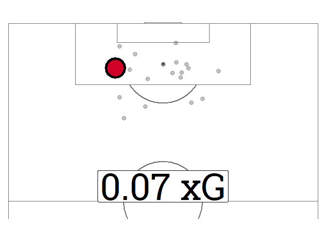

Introduction
============

In this blog post I’ll be talking about my submission to the 2020
RStudio Table contest: A xG and shots timeline table for soccer/football
matches powered by data from [understat.com](https://understat.com/)!

<iframe src="../assets/2020-11-02-xG-timeline-table-competition-tutorial_files/LivLee_match_gt_shotmap_final.html" width="100%" height="500" frameborder="0" marginheight="0" marginwidth="0">
</iframe>

I started out in soccer analytics mainly to practice my data cleaning
and visualization skills and over time it evolved into an entire
portfolio of plots and graphs that you can see in the [soccer\_ggplots
Github Repo](https://github.com/Ryo-N7/soccer_ggplots). At the beginning
of last season (summer of 2019) I figured out how to grab match-level
data from [understat.com](https://understat.com/) via [Ewen
Henderson](https://twitter.com/ewen_/)’s
[{understatr}](https://github.com/ewenme/understatr) package and started
creating a “match day summary graphic”. These were intended to visualize
the data understat.com provided in my own aesthetically-pleasing way for
the **general public** (mainly on soccer analytics Twitter). These
aren’t intended for **coaches/clubs** but are more **media/fan
oriented** pieces to help convey the flow of the match in a different
way than the usual box scores (number of shots, tackles, yellow cards,
total passes, etc.).

Version 1 (last year) looked like this:


In the past few months, after the Corona-extended-season ended, I
intended to make tweaks to the graph above but instead I just started
creating other viz with the data available while also incorporating some
other stuff that I couldn’t fit into the original match day viz. 


One of the new viz I created was a chronological table of shots during
the course of the match which provides the viewer with a lot more detail
about any individual shot. Besides the xG value, things like the
“situation” (open play? free kick? etc.), “shot type” (right, left,
header), etc. were added for more context. In general I wanted the next
series of viz to add a bit more context to the overall xG flow graph and
the shot maps.

So here are the new xG match summary viz in their entirety (minus the
timeline table which was the first image you saw on this blog post):


This blog post will **only** go over the {gt} time lines.

Design Choices
==============

I mostly make very simple designs in my soccer visualizations and I try
not to clutter each individual viz with too much info, but rather try to
peel layers of data apart and split them up into different component viz
(for more examples see [here](https://github.com/Ryo-N7/soccer_ggplots).
In reality, this table viz is only just one of a series of data viz
intended to capture details about a match using
[understat.com](https://understat.com/)’s data that I post on Twitter
but since this tutorial is for a table viz competition, I’ll keep the
following discussion to the table viz only.

The **color-coding** of the rows is intended to give you a clear idea of
who was dominating shots at any given time period at a glance, without
even having to look closely at the details. Of course, there may be a
ton of shots in a small period of time or vice-versa which can skew your
perception if you don’t look at the “minute” column closely. Still, I
think it’s cool that you can look at the table from far away and
identify time “chunks” of shot dominance. The previous few sentences
only touch on the info about the “quantity” of shots taken. The
“quality” of the shots can be gleaned from looking at the shot maps, as
well as the cumulative sum of a team’s xG as you travel down the table
chronologically.

Most of the **plots** you see inserted into {gt} or other R tables in
general are spark lines so I thought about including them in mine too.
However, I realized that the cumulative xG column covers that and the
line graph wasn’t very visible on the table. The chronological nature of
the table also means you get a feel for that perspective of the game
anyways (e.g. chunks of “red” rows means that team “red” was taking more
shots in that time period). In any case the line plot is already covered
by another viz in my series so I decided to focus on something that’s a
lot easier to see at first glance, the main protagonist of the table,
the actual shots themselves. The idea was to plot all of the shots of
that table row’s respective team on a soccer field plot and then
highlight the specific shot of that row along with its xG value.


For the **title headline text** I experimented with a few different
sizes depending on the text content (team name, xG value, score line).
The actual score being the biggest in size, then the team names, and
then the xG totals for either team in the smallest font at the far ends.
I’m still not sure how the text alignment (especially vertical) works so
I didn’t want to try anything too drastic. I’m still not very fond of
the fact that the parentheses around the xG values kind of dip below the
other letters, especially the larger text. I am also still vacillating
between adding a bit more color to either “xG” or the xG values
themselves along their respective team colors. I did all of this as I
wanted people to guide people’s focus on **actual** score line first and
then down across to the **xG** values. I have Expected Points (xPoints)
in the other match graphics so for the stand-alone version of the tables
it would make sense to include them somehow in a later version as well.

I made the **column header** color slightly gray to differentiate the
text from the title text but I’m still not 100% sure it provides a good
balance with the rest of the text in the table. For the text inside the
**table cells** I made sure they were thick bold text as it in the
version that I used to release with my other match viz they were a lot
thinner and harder to read. I tried to place emphasis on rows with goals
by switching the text to all-caps and adding the emoji alongside it. I
think there could be ways of adding more emphasis by coloring the border
of that row or something else. Unfortunately, for the PNG version in my
regular match summary viz that I post on Twitter, the emoji is a star
instead of a soccer ball as the soccer ball emoji doesn’t convert well
from HTML to PNG. I’ll be using the soccer ball emoji here as I’m aiming
for an HTML output and don’t really care about its ability to be
embedded in tweets.


Some other concerns I have are as follows. The large size of table is a
concern as it is not very mobile-friendly nor small-screen friendly,
even on computers. The size could still be tweaked but I’m not really
sure about making it any smaller or the shot map will be even less
visible than it already is. My own inexperience with HTML/CSS to get
team logos to slot in on either side of the title text. This was only
solved after hours upon hours of failed attempts and honestly took up
most of my time creating this viz. 

There is a need to be careful about what colors to use as the main team
colors (yellow for example is strictly off-limits). A dark theme design
could potentially be used to alleviate some of the concerns with using
yellow or other brighter colors that don’t work well with white bold
text. Another idea is to use an if-else statement to switch the text to
black if the color fill for that row is a certain set of bright colors
too.

The team logos are all taken from Wikipedia so the sizes may differ
slightly. I may try specifying a specific aspect ratio in the HTML/CSS
code but the logos can come in different shapes as well. I also wanted
to place the logos slightly inward closer to the text and not exactly in
the corners as they are now but setting margins around the logo images
caused other problems.

As this is a **static visualization** there aren’t any scrolling
elements embedded in the table itself nor are there freeze panels so
that the column labels follow you as you go down the table. I did try to
alleviate this problem by ordering the columns in a way so that its
immediately obvious what the column is showing. An interactive version
is the solution for a lot of these problems and it may be worth looking
into in the future.

Packages
========

THe packages we’ll be using are some of the usual tidyverse stalwarts
such as {dplyr}, {tidyr}, {ggplot2}, {forcats}, etc. For soccer-specific
packages we have the {understatr} package for downloading the data and
the {ggsoccer} package for creating soccer fields in {ggplot2}.

We also use the {extrafont} package to make use of some cool fonts for
the table/plots, they’re loaded in via the `loadfonts()` call. I’ll be
using the “Roboto Condensed” and “Roboto Slab” fonts that you can
download from [Google Fonts](https://fonts.google.com/). Please read the
instructions on [extrafont’s Github
repo](https://github.com/wch/extrafont/) and/or [CRAN
docs](https://cran.r-project.org/package=extrafont) for how to install
fonts on your computer and use them in R. If you don’t want to bother
with all that then just delete the code where I specify fonts throughout
the blog post.

Also attached is my `sessionInfo()`.

``` r
# Packages
pacman::p_load(dplyr, tidyr, stringr, janitor, purrr,
               tibble, lubridate, glue, rlang, 
               rvest, polite,
               ggplot2, 
               gt, forcats, ggtext, extrafont, 
               understatr, ggsoccer)
## Load fonts
loadfonts(quiet = TRUE)

sessionInfo()
```

    ## R version 3.5.3 (2019-03-11)
    ## Platform: x86_64-w64-mingw32/x64 (64-bit)
    ## Running under: Windows 10 x64 (build 19041)
    ## 
    ## Matrix products: default
    ## 
    ## locale:
    ## [1] LC_COLLATE=English_United States.1252 
    ## [2] LC_CTYPE=English_United States.1252   
    ## [3] LC_MONETARY=English_United States.1252
    ## [4] LC_NUMERIC=C                          
    ## [5] LC_TIME=English_United States.1252    
    ## 
    ## attached base packages:
    ## [1] stats     graphics  grDevices utils     datasets  methods   base     
    ## 
    ## other attached packages:
    ##  [1] ggsoccer_0.1.4        understatr_1.0.0.9000 extrafont_0.17       
    ##  [4] ggtext_0.1.0          forcats_0.5.0         gt_0.2.2             
    ##  [7] ggplot2_3.3.0         polite_0.1.1          rvest_0.3.5          
    ## [10] xml2_1.3.2            rlang_0.4.7           glue_1.4.1           
    ## [13] lubridate_1.7.4       tibble_3.0.1          purrr_0.3.4          
    ## [16] janitor_1.2.1         stringr_1.4.0         tidyr_1.1.0          
    ## [19] dplyr_1.0.1           goodshirt_0.2.2      
    ## 
    ## loaded via a namespace (and not attached):
    ##  [1] Rcpp_1.0.4.6      pillar_1.4.4.9000 compiler_3.5.3    tools_3.5.3      
    ##  [5] digest_0.6.25     robotstxt_0.6.2   jsonlite_1.7.0    gtable_0.3.0     
    ##  [9] evaluate_0.14     memoise_1.1.0     lifecycle_0.2.0   pkgconfig_2.0.3  
    ## [13] yaml_2.2.1        xfun_0.12.2       Rttf2pt1_1.3.8    withr_2.2.0      
    ## [17] httr_1.4.1        knitr_1.27        fs_1.4.1          generics_0.0.2   
    ## [21] vctrs_0.3.2       gridtext_0.1.0    grid_3.5.3        rprojroot_1.3-2  
    ## [25] tidyselect_1.1.0  here_0.1          R6_2.4.1          qdapRegex_0.7.2  
    ## [29] rmarkdown_2.1     pacman_0.5.1      extrafontdb_1.0   ratelimitr_0.4.1 
    ## [33] magrittr_1.5      scales_1.1.0      usethis_1.6.1     backports_1.1.8  
    ## [37] ellipsis_0.3.1    htmltools_0.5.0   assertthat_0.2.1  colorspace_1.4-1 
    ## [41] stringi_1.4.6     munsell_0.5.0     crayon_1.3.4

Data Source
===========

[understat.com](https://understat.com/) is a data source used by fans,
media, bloggers, and analysts alike as it is a free and open resource
for expected goals data across six European soccer leagues, the English
Premier League, La Liga (Spain), Bundesliga (Germany), Serie A (Italy),
Ligue 1 (France), and RFPL (Russia). The data goes back to the 2014-2015
season and has a lot of different xG and xG-adjacent data to look at on
tables, graphs, and pitch maps.

Definitions for the variables are provided by hovering over column names
on the website. Others are opaque but follow similar terminology set by
other data companies and websites. For the average Joe
[understat.com](https://understat.com/) along with the more recent
[FBref](fbref.com/) (with advanced metrics provided by StatsBomb) are
the best free and publicly available websites for obtaining this kind of
data that I know of.

Nothing is really stopping you from using StatsBomb, Opta, InStat,
WyScout, etc. data to create these tables, you just need a few extra
steps to prepare/structure the data sets similarly to how I’ve done it
the next few sections.

According to the website, the xG model that understat use to calculate
the values are done via a neural network on a data set of over 100,000
shots with over 10 parameters. The biggest concern with using the data
is that I’m not in control over the calculated outputs and I am merely
going to be using their data as given. It would be a point of interest
to create my own xG model based on the variables provided on understat
(as well as combining data from other sources) by following some of the
“how-to” blog posts around the \#rstats world such as:

-   [Fitting your own football xG model - Dato
    Futbol](https://www.datofutbol.cl/xg-model/) by [Ismael
    Gomez](https://twitter.com/DatoFutbol_cl)

-   [xG Model - Design and Implementation with R
    Tidymodels](https://www.thesignificantgame.com/portfolio/expected-goals-model-with-tidymodels/)
    by [Lars M.](https://twitter.com/thesignigame)

Code Breakdown (Part 1): Initial Data Gathering & Cleaning!
===========================================================

We can finally get to the real meat of this blog post which is the code
to create the visualization. We’ll be going through things almost
line-by-line and then at the end we’ll create a function out of the code
so it can be applied to other matches/teams as well!

Let’s get started!

Defining Variables
------------------

The variables defined below will be used throughout the code and some
are appended to the data frames we’ll be creating and cleaning. They’ll
also be used as arguments for a function we’ll create that takes in all
the code that’s be described throughout this blog post.

Make sure that the “home\_team” and “away\_team” variables are the exact
names for the teams on understat.com but without the `_` symbols
(e.g. “West\_Ham” should be “West Ham”, “Borussia\_M.Gladbach” should be
“Borussia M.Gladbach”). The underscores will be converted throughout the
code so don’t worry about them. You have to be careful as some teams on
understat.com are labeled with their full name
(“West\_Bromwich\_Albion”, “Parma\_Calcio\_1913”) while some other ones
aren’t (“Tottenham”, “Brighton”, “Leeds”).

The team color is your choice but the table will be using **white** text
so be sure to not choose yellow or white. For teams like Borussia
Dortmund I usually just choose **black**. There are a number of great
web sites for finding team colors such as:

-   [Encycolorpedia](https://encycolorpedia.com/)

-   [Team Color Codes](https://teamcolorcodes.com/)

-   [Team Colours App - FC Python](https://teamcolours.netlify.app/)

Finally you can set the match date, league, season, match day, and
source text to show in the table in whatever format you wish. You can
actually scrape the “match\_date” via {understatr} as well but I didn’t
want to bother reformatting with {lubridate} so I just set it manually
here.

``` r
home_team = "Liverpool"
away_team = "Leeds"
home_color = "#d00027" 
away_color = "#1D428A"

home_team_logo <- "https://i.imgur.com/RlXYW46.png"
away_team_logo <- "https://i.imgur.com/r6Y9lT8.png"

match_date <- "Sep. 12, 2020"
league_year <- "Premier League 2020-2021"
matchday <- 1
source_text <- "**Table**: Ryo Nakagawara (**Twitter**: @R_by_Ryo) | **Data**: understat"
```

{understatr} Package
--------------------

You can get the data via the {understatr} package from [Ewen
Henderson](https://twitter.com/ewen_/). There are a number of blog posts
that you may want to look into alongside the official documentation:

-   [Shot Data for Top 5 European
    Leagues](https://biscuitchaserfc.blogspot.com/2020/09/shot-data-for-top-5-european-leagues.html)
    by [Mark Wilkins](https://twitter.com/biscuitchaser/)

-   [Visualizing the Copa America
    2019](https://ryo-n7.github.io/2019-06-18-visualize-copa-america/)

To get match shot data for a match you need to find the match ID on
understat. There are a number of helper functions to help you find this
ID but you can just go to understat and find it yourself as the ID is
part of the URL for the match page. Another way is to scrape the team’s
page on understat and then you’ll have the match IDs for that team
(including for matches they haven’t played yet).
<https://understat.com/match/14090> is the URL for Liverpool vs. Leeds
United and the set of digits at the end, `14090`, is the match ID. You
use this ID as the input to the `get_match_shots()` function to get the
raw match shots data.

``` r
match_id <- 14090
raw_match_df <- understatr::get_match_shots(match_id = match_id)

glimpse(raw_match_df)
```

    ## Rows: 28
    ## Columns: 20
    ## $ id              <int> 376602, 376603, 376604, 376606, 376607, 376608, 376...
    ## $ minute          <int> 2, 3, 6, 19, 24, 28, 32, 39, 39, 48, 52, 52, 59, 61...
    ## $ result          <chr> "BlockedShot", "Goal", "BlockedShot", "Goal", "Save...
    ## $ X               <dbl> 0.875, 0.885, 0.860, 0.946, 0.734, 0.936, 0.870, 0....
    ## $ Y               <dbl> 0.347, 0.500, 0.322, 0.542, 0.374, 0.359, 0.392, 0....
    ## $ xG              <dbl> 0.06855621, 0.76116884, 0.06080124, 0.41931298, 0.0...
    ## $ player          <chr> "Mohamed Salah", "Mohamed Salah", "Mohamed Salah", ...
    ## $ h_a             <chr> "h", "h", "h", "h", "h", "h", "h", "h", "h", "h", "...
    ## $ player_id       <int> 1250, 1250, 1250, 833, 605, 5247, 1250, 838, 838, 7...
    ## $ situation       <chr> "OpenPlay", "Penalty", "OpenPlay", "FromCorner", "O...
    ## $ season          <int> 2020, 2020, 2020, 2020, 2020, 2020, 2020, 2020, 202...
    ## $ shotType        <chr> "LeftFoot", "LeftFoot", "LeftFoot", "Head", "RightF...
    ## $ match_id        <int> 14090, 14090, 14090, 14090, 14090, 14090, 14090, 14...
    ## $ h_team          <chr> "Liverpool", "Liverpool", "Liverpool", "Liverpool",...
    ## $ a_team          <chr> "Leeds", "Leeds", "Leeds", "Leeds", "Leeds", "Leeds...
    ## $ h_goals         <int> 4, 4, 4, 4, 4, 4, 4, 4, 4, 4, 4, 4, 4, 4, 4, 4, 4, ...
    ## $ a_goals         <int> 3, 3, 3, 3, 3, 3, 3, 3, 3, 3, 3, 3, 3, 3, 3, 3, 3, ...
    ## $ date            <chr> "2020-09-12 16:30:00", "2020-09-12 16:30:00", "2020...
    ## $ player_assisted <chr> "Sadio Mané", NA, "Sadio Mané", "Andrew Robertson",...
    ## $ lastAction      <chr> "Pass", "Standard", "Pass", "Cross", "None", "None"...

When I was first making these plots (around a year ago) the
`understatr::get_match_shots()` function didn’t exist so I had my own
way of scraping this data. I’ve kept using my own methods in my personal
scripts but for the purposes of this blog post I’ll use
`understatr::get_match_shots()` for your convenience.

The raw data we get is already in good shape thanks to {understatr} but
we still need to do some more cleaning and setting some variables the
way we want for our table.

``` r
shots_df <- raw_match_df %>% 
  ## 1. Take out 2 columns we don't really need.
  select(-h_goals, -a_goals) %>% 
  ## 2. Make sure the selected columns are set to numeric type.
  mutate(across(c(minute, xG, X, Y, 
                 player_id, match_id, season), as.numeric)) %>% 
  ## 3. If xG is `NA` then set it to 0.
  ## 4. Relabel the categories in "result", "situation", "lastAction", and "shotType" columns so they're more human-friendly and presentable.
  mutate(xG = if_else(is.na(xG), 0, xG),
         result = case_when(
           result == "SavedShot" ~ "Saved Shot",
           result == "BlockedShot" ~ "Blocked Shot",
           result == "MissedShots" ~ "Missed Shot",
           result == "ShotOnPost" ~ "On Post",
           result == "OwnGoal" ~ "Own Goal",
           TRUE ~ result),
         situation = case_when(
           situation == "OpenPlay" ~ "Open Play", 
           situation == "FromCorner" ~ "From Corner",
           situation == "DirectFreekick" ~ "From Free Kick",
           situation == "SetPiece" ~ "Set Piece",
           TRUE ~ situation),
         lastAction = case_when(
           lastAction == "BallRecovery" ~ "Ball Recovery",
           lastAction == "BallTouch" ~ "Ball Touch",
           lastAction == "LayOff" ~ "Lay Off",
           lastAction == "TakeOn" ~ "Take On",
           lastAction == "Standard" ~ NA_character_,
           lastAction == "HeadPass" ~ "Headed Pass",
           lastAction == "BlockedPass" ~ "Blocked Pass",
           lastAction == "OffsidePass" ~ "Offside Pass",
           lastAction == "CornerAwarded" ~ "Corner Awarded",
           lastAction == "Throughball" ~ "Through ball",
           lastAction == "SubstitutionOn" ~ "Subbed On",
           TRUE ~ lastAction),
         shotType = case_when(
           shotType == "LeftFoot" ~ "Left Foot",
           shotType == "RightFoot" ~ "Right Foot",
           shotType == "OtherBodyPart" ~ "Other",
           TRUE ~ shotType)) %>% 
  ## 5. Consolidate team name into a single column "team_name" based on the "h_a" column.
  mutate(team_name = case_when(
    h_a == "h" ~ h_team,
    h_a == "a" ~ a_team)) %>% 
  ## 6. Add team colors to the row depending on the team.
  mutate(team_color = if_else(team_name == h_team, home_color, away_color)) %>% 
  ## 7. Own Goal is set to the team that conceded it so swap it to the team that actually scored from it.
  mutate(team_name = case_when(
    result == "Own Goal" & team_name == home_team ~ away_team,
    result == "Own Goal" & team_name == away_team ~ home_team,
    TRUE ~ team_name)) %>% 
  ## 8. Set "team_name" as a factor variable.
  mutate(team_name = forcats::as_factor(team_name)) %>% 
  ## 9. Arrange the rows by `id` so that shots are in chronological order.
  arrange(id) %>% 
  ## 10. Separate "player" into two, then re-combine.
  separate(player, into = c("firstname", "player"), 
           sep = "\\s", extra = "merge") %>% 
  ## players like Fabinho are listed without a last name "Tavares"
  ## so just add their name in again if NA
  mutate(player = if_else(is.na(player), firstname, player),
         ## 11. Set a new and cleaner ID for shots so that it starts at 1 and goes to `n`.
         id = row_number())

glimpse(shots_df)
```

    ## Rows: 28
    ## Columns: 21
    ## $ id              <int> 1, 2, 3, 4, 5, 6, 7, 8, 9, 10, 11, 12, 13, 14, 15, ...
    ## $ minute          <dbl> 2, 3, 6, 11, 19, 24, 28, 29, 32, 39, 39, 48, 49, 52...
    ## $ result          <chr> "Blocked Shot", "Goal", "Blocked Shot", "Goal", "Go...
    ## $ X               <dbl> 0.875, 0.885, 0.860, 0.842, 0.946, 0.734, 0.936, 0....
    ## $ Y               <dbl> 0.347, 0.500, 0.322, 0.607, 0.542, 0.374, 0.359, 0....
    ## $ xG              <dbl> 0.06855621, 0.76116884, 0.06080124, 0.05824600, 0.4...
    ## $ firstname       <chr> "Mohamed", "Mohamed", "Mohamed", "Jack", "Virgil", ...
    ## $ player          <chr> "Salah", "Salah", "Salah", "Harrison", "van Dijk", ...
    ## $ h_a             <chr> "h", "h", "h", "a", "h", "h", "h", "a", "h", "h", "...
    ## $ player_id       <dbl> 1250, 1250, 1250, 8720, 833, 605, 5247, 822, 1250, ...
    ## $ situation       <chr> "Open Play", "Penalty", "Open Play", "Open Play", "...
    ## $ season          <dbl> 2020, 2020, 2020, 2020, 2020, 2020, 2020, 2020, 202...
    ## $ shotType        <chr> "Left Foot", "Left Foot", "Left Foot", "Right Foot"...
    ## $ match_id        <dbl> 14090, 14090, 14090, 14090, 14090, 14090, 14090, 14...
    ## $ h_team          <chr> "Liverpool", "Liverpool", "Liverpool", "Liverpool",...
    ## $ a_team          <chr> "Leeds", "Leeds", "Leeds", "Leeds", "Leeds", "Leeds...
    ## $ date            <chr> "2020-09-12 16:30:00", "2020-09-12 16:30:00", "2020...
    ## $ player_assisted <chr> "Sadio Mané", NA, "Sadio Mané", "Kalvin Phillips", ...
    ## $ lastAction      <chr> "Pass", NA, "Pass", "Take On", "Cross", "None", "No...
    ## $ team_name       <fct> Liverpool, Liverpool, Liverpool, Leeds, Liverpool, ...
    ## $ team_color      <chr> "#d00027", "#d00027", "#d00027", "#1D428A", "#d0002...

You have to adjust xG for a single sequence of possession so I regularly
use the code in [Joe Gallagher](https://twitter.com/joedgallagher)’s
[blog post](https://jogall.github.io/2019-01-16-adjusted-xG/) for
adjusting them whenever there’s a sequence with a rebound.

The xG totals (Liverpool `3.15 xG` vs. Leeds United `0.27 xG`) you see
on understats’ match pages are using the **ADJUSTED** values **BUT** the
xG values you see on their shot maps (when you hover over them with your
mouse) are the **RAW** values which are same as the ones downloaded via
{understatr}. So do be careful when you’re taking shot data from the
website. 99% of the time this discrepancy has been solved by applying
the below code from Joe’s blog post to rebound shots and other shots in
that possession sequence. Understat could be doing something else under
the hood but from my experience this usually matches the values up. Do
note that not all shots that were adjusted by understat for the box
score have the “rebound” shot result label which makes it much more
difficult to tease out which ones need the adjustment. This is why its
important you watch the match or have an easy way of checking every
shot/shot sequence.

``` r
shots_df %>% filter(team_name == "Liverpool") -> lfc_xg

lfc_adj <- lfc_xg %>% 
  filter(minute == 39) %>%
  mutate(xg_total = (1 - prod(1 - xG))) %>%
  mutate(xg_adj = xg_total * (xG / sum(xG))) %>% 
  select(minute, xG, xg_adj, player, situation, lastAction)

glimpse(lfc_adj)
```

    ## Rows: 2
    ## Columns: 6
    ## $ minute     <dbl> 39, 39
    ## $ xG         <dbl> 0.10687961, 0.08808844
    ## $ xg_adj     <dbl> 0.10171848, 0.08383471
    ## $ player     <chr> "Mané", "Mané"
    ## $ situation  <chr> "Open Play", "Open Play"
    ## $ lastAction <chr> "Pass", "Rebound"

Then we just overwrite the raw xG values with the adjusted values into
`shots_df`.

``` r
shots_df <- shots_df %>% 
  mutate(xG = case_when(
    minute == 39 & id == 10 ~ 0.10171848,
    minute == 39 & id == 11 ~ 0.08383471,
    TRUE ~ xG))
```

Rolling sum of xG
-----------------

This data frame calculates the rolling sum of xG values throughout the
match. Use the `cumsum()` function to calculate it along the order of
shots. This bit of code is actually used for creating the line plot
timeline viz you saw in the introduction but for the table viz we only
need the shot ID and the rolling sum values so that’s what we’ll
`select()` from the data frame.

``` r
## 1. Get minute of last shot
last_min <- shots_df$minute %>% unique() %>% last()

## 2. If last shot happened before 90th minute then change to 90
if (last_min < 90) {last_min <- 90}

## 3. Create index of every minute in the match
minute <- c(0:last_min)

## 4. Set team names in a list
team_name <- c(shots_df$h_team %>% unique(),
               shots_df$a_team %>% unique())

rollsum_df <- shots_df %>% 
  ## 5. Expand shots_df to include rows for every minute
  full_join(crossing(minute, team_name)) %>% 
  arrange(minute) %>% 
  group_by(team_name) %>% 
  ## 6. Change NAs to 0
  ## Apply rolling cumulative sum on xG
  mutate(xG = if_else(is.na(xG), 0, xG),
         rollsum = lag(cumsum(xG))) %>% 
  ungroup() %>% 
  ## 7. Change Player Labels (Not used for the table viz so can be ignored)
  mutate(rollsum_goal = rollsum + xG) %>% 
  ## for Minute == 0
  mutate(rollsum = if_else(is.na(rollsum), 0, rollsum),
         rollsum_goal = if_else(is.na(rollsum_goal), 0, rollsum_goal)) %>% 
  ## FOR THIS BLOGPOST // {gt} TABLE WE DON'T NEED MOST OF THESE COLUMNS
  ## We'll only use the shot order ID and the rolling sum of xG that we just calculated.
  filter(xG != 0.00) %>% 
  select(id, rollsum_goal)
```

    ## Joining, by = c("minute", "team_name")

``` r
glimpse(rollsum_df)
```

    ## Rows: 28
    ## Columns: 2
    ## $ id           <int> 1, 2, 3, 4, 5, 6, 7, 8, 9, 10, 11, 12, 13, 14, 15, 16,...
    ## $ rollsum_goal <dbl> 0.06855621, 0.82972505, 0.89052629, 0.05824600, 1.3098...

Team Stats (Box score data frame)
---------------------------------

This is the data you can see on the “Stats” tab on any [match
page](https://understat.com/match/15473) on understat.com. In my own
work flow this code is its own function along with a few additions which
aren’t pertinent to creating the tables. We’ll be scraping this directly
using the {polite} and {rvest} packages. Then we’ll slowly massage the
text data into a nice data frame.

``` r
match_url <- stringr::str_glue("https://understat.com/match/{match_id}")

match_page <- polite::bow(match_url)

team_stats_raw <- polite::scrape(match_page) %>% 
  html_nodes("div.scheme-block:nth-child(4)") %>% 
  html_text() %>% 
  str_remove_all(., "CHANCES") %>% 
  str_remove_all(., "([0-9]{2,}%)") %>% 
  str_replace_all(., "SHOTS ON TARGET", "ON-TARGET") %>% 
  str_squish()

## make sure that you set "home_team" and "away_team" in the beginning, exactly as they appear on understat.com
if (str_detect(home_team, " ") == TRUE | 
    str_detect(away_team, " ") == TRUE) {
  
  home_team_sp <- str_replace_all(home_team, " ", "-")
  away_team_sp <- str_replace_all(away_team, " ", "-")
  
  team_stats_raw <- team_stats_raw %>% 
    str_replace_all(., home_team, home_team_sp) %>% 
    str_replace_all(., away_team, away_team_sp)
}

home_team_sp <- str_replace_all(home_team, " ", "-")
away_team_sp <- str_replace_all(away_team, " ", "-")

team_stats <- team_stats_raw %>% 
  read.table(text = ., header = FALSE, sep = " ",
             col.names = c("var_name", "home", "away")) %>% 
  t() %>% 
  tibble::as_tibble(.name_repair = "minimal") %>% 
  janitor::row_to_names(row_number = 1) %>% 
  mutate_at(vars(-TEAMS), ~ as.numeric(.)) %>% 
  mutate(TEAMS = case_when(
    str_detect(TEAMS, home_team_sp) ~ home_team,
    str_detect(TEAMS, away_team_sp) ~ away_team,
    TRUE ~ TEAMS
  ))

## split team stats into "home" and "away"
home_stats <- team_stats[1,]

away_stats <- team_stats[2,]

## add colors based on defined variables for team's respective color
home_stats$home_team_color <- home_color
away_stats$away_team_color <- away_color

glimpse(team_stats)
```

    ## Rows: 2
    ## Columns: 8
    ## $ TEAMS       <chr> "Liverpool", "Leeds"
    ## $ GOALS       <dbl> 4, 3
    ## $ xG          <dbl> 3.15, 0.27
    ## $ SHOTS       <dbl> 22, 6
    ## $ `ON-TARGET` <dbl> 6, 3
    ## $ DEEP        <dbl> 19, 2
    ## $ PPDA        <dbl> 9.94, 9.33
    ## $ xPTS        <dbl> 2.93, 0.04

You can check out more on how to scrape websites responsibly with the
{rvest} and {polite} packages in my previous blog post
[here](https://ryo-n7.github.io/2020-05-14-webscrape-soccer-data-with-R/).

Data contents
=============

Now that we’ve got the basic data we need, let’s go over what each data
frame holds. We’ll still be doing a lot more data manipulation after
this section but it’s a good place to pause as we have the essential
columns we need. These are also the data frames we’ll pass as arguments
into the function we’ll create for the table. In my usual workflow the
above Part 1 are usually a few different functions and then the code in
Part 2 and Part 3 are in a different single function that creates the
{gt} tables. You can certainly shove Part 1 code into the overall
function as well but I use the data frames from Part 1 in other
visualizations so I have them split up.

1. shots\_df
------------

This data frame is the main protagonist for our table and holds pretty
much all the essential info we need. You can add/subtract any columns as
you see fit from understat or from your own data source here.

``` r
glimpse(shots_df)
```

    ## Rows: 28
    ## Columns: 21
    ## $ id              <int> 1, 2, 3, 4, 5, 6, 7, 8, 9, 10, 11, 12, 13, 14, 15, ...
    ## $ minute          <dbl> 2, 3, 6, 11, 19, 24, 28, 29, 32, 39, 39, 48, 49, 52...
    ## $ result          <chr> "Blocked Shot", "Goal", "Blocked Shot", "Goal", "Go...
    ## $ X               <dbl> 0.875, 0.885, 0.860, 0.842, 0.946, 0.734, 0.936, 0....
    ## $ Y               <dbl> 0.347, 0.500, 0.322, 0.607, 0.542, 0.374, 0.359, 0....
    ## $ xG              <dbl> 0.06855621, 0.76116884, 0.06080124, 0.05824600, 0.4...
    ## $ firstname       <chr> "Mohamed", "Mohamed", "Mohamed", "Jack", "Virgil", ...
    ## $ player          <chr> "Salah", "Salah", "Salah", "Harrison", "van Dijk", ...
    ## $ h_a             <chr> "h", "h", "h", "a", "h", "h", "h", "a", "h", "h", "...
    ## $ player_id       <dbl> 1250, 1250, 1250, 8720, 833, 605, 5247, 822, 1250, ...
    ## $ situation       <chr> "Open Play", "Penalty", "Open Play", "Open Play", "...
    ## $ season          <dbl> 2020, 2020, 2020, 2020, 2020, 2020, 2020, 2020, 202...
    ## $ shotType        <chr> "Left Foot", "Left Foot", "Left Foot", "Right Foot"...
    ## $ match_id        <dbl> 14090, 14090, 14090, 14090, 14090, 14090, 14090, 14...
    ## $ h_team          <chr> "Liverpool", "Liverpool", "Liverpool", "Liverpool",...
    ## $ a_team          <chr> "Leeds", "Leeds", "Leeds", "Leeds", "Leeds", "Leeds...
    ## $ date            <chr> "2020-09-12 16:30:00", "2020-09-12 16:30:00", "2020...
    ## $ player_assisted <chr> "Sadio Mané", NA, "Sadio Mané", "Kalvin Phillips", ...
    ## $ lastAction      <chr> "Pass", NA, "Pass", "Take On", "Cross", "None", "No...
    ## $ team_name       <fct> Liverpool, Liverpool, Liverpool, Leeds, Liverpool, ...
    ## $ team_color      <chr> "#d00027", "#d00027", "#d00027", "#1D428A", "#d0002...

-   **minute**: Minute of the game that the shot was taken. Note that
    this doesn’t contain seconds so you need to be careful when
    re-arranging rows. When you get the data via {understatr} the data
    should come in proper order so the first thing you should do is to
    create an ID variable so that you always have shots in the same
    minute in the proper order.

-   **result**: The result of the shot. “Goal”, “Blocked Shot”, “Saved
    Shot”, “Own Goal”, etc.

-   **X & Y**: Coordinates of the shot location.

-   **xG**: Expected Goals value of the shot taken per understat.com’s
    model.

-   **firstname** & **player**: Player name. firstname is a column I
    created myself for the shot timeline/shot maps in a previous step of
    my viz process. When you’re grabbing the data from understat
    yourself it should already be in one united column. We’ll go over
    the code to combine these together for the table.

-   **h\_a**: Home or away team. These are used for matching the team
    colors to their respective row and is in general useful when you
    have turned your code into a function and want to set certain
    conditions depending on whether the team is “home” or “away”.

-   **player\_id** & **match\_id**: understat IDs for players and
    matches. Not used here but good to keep if you’re going to be doing
    other stuff later on.

-   **situation**: The situation in which the shot took place. “Open
    Play”, “Set Piece”, “Penalty”, etc.

-   **season**: Season. Not used here but good to keep if you’re doing
    other stuff with this data.

-   **shotType**: Type of shot. “Left Foot”, “Right Foot”, & “Header”.

-   **date**: Date of match. We could use {lubridate} or something to
    make it look nice but for this example I just manually created a
    variable “match\_date”.

-   **player\_assisted**: Player that assisted the shot. Do note that
    “assisted” could mean very trivial things like a small touch or a
    deflection.

-   **lastAction**: Action that lead to the shot. “Pass”, “Dribble”,
    “Take On”, “Cross”, “Rebound”, etc. There are some mystery labels
    such as “Standard” but we’ll be removing them from the data in the
    code section.

-   **team\_name**: Team name used for labels.

2. rollsum\_df
--------------

Has the rolling sum of xG values for the match over every shot taken in
the match.

``` r
glimpse(rollsum_df)
```

    ## Rows: 28
    ## Columns: 2
    ## $ id           <int> 1, 2, 3, 4, 5, 6, 7, 8, 9, 10, 11, 12, 13, 14, 15, 16,...
    ## $ rollsum_goal <dbl> 0.06855621, 0.82972505, 0.89052629, 0.05824600, 1.3098...

3. home\_stats & away\_stats
----------------------------

The box score you see in the “Stats” tab of the match page on
understat.com. “home\_stats” and “away\_stats” is just “team\_stats”
divided into their respective teams. The data below are ONLY used for
labels and titles in the plot so if you’re not too fussed about scraping
the data in the previoius you could just manually insert them in the
text (we’ll be using `paste()`/`glue()` to insert this into the plot
text) or add the info as arguments to your plotting function and insert
this data that way as well.

``` r
glimpse(team_stats)
```

    ## Rows: 2
    ## Columns: 8
    ## $ TEAMS       <chr> "Liverpool", "Leeds"
    ## $ GOALS       <dbl> 4, 3
    ## $ xG          <dbl> 3.15, 0.27
    ## $ SHOTS       <dbl> 22, 6
    ## $ `ON-TARGET` <dbl> 6, 3
    ## $ DEEP        <dbl> 19, 2
    ## $ PPDA        <dbl> 9.94, 9.33
    ## $ xPTS        <dbl> 2.93, 0.04

Code Breakdown (Part 2): Creating the Shot Maps & Cleaning the Data!
====================================================================

Creating the soccer field plots
-------------------------------

For the actual soccer field I use the {ggsoccer} package. Along with the
pitch dimension specifications for data sources like Opta, WyScout, and
StatsBomb, the package also allows you to specify your own dimensions to
fit your own data. If you want a bit more of an in-depth code through
using the {ggsoccer} package, take a look at the package
[README](https://github.com/Torvaney/ggsoccer) or have a look at one of
my [first blog
posts](https://ryo-n7.github.io/2018-06-29-visualize-worldcup/) where I
create my own World Cup 2018 data and visualize it with {ggsoccer}.

After playing around with the dimensions on understat the below are the
measurements what I came up with and I defined it as a variable called
`pitch_custom`.

``` r
pitch_custom <- list(
  length = 587,
  width = 373,
  penalty_box_length = 101,
  penalty_box_width = 211,
  six_yard_box_length = 31,
  six_yard_box_width = 111,
  penalty_spot_distance = 66,
  goal_width = 45,
  origin_x = 0,
  origin_y = 0)
```

Since we are orienting the shot maps vertically we need to convert the
coordinates from the horizontal view to vertical. We are only using one
side of the pitch we don’t need to have different adjustments for the
“home” and “away” teams. The new coordinates will be defined to the
variables “X” and “Y” (capitalized), the coordinates in the lower-case
variables will be kept in just as a reference and for checking
positions. Then we `select()` only the variables we need then capitalize
“Goal” and “Own Goal” labels for the table (you could also use
`stringr::str_to_upper()` here). Also note that you can include most if
not **all** of these `mutate()` calls into **one** `mutate()` call but I
like to keep them separated so I can comment out blocks of code easier.

``` r
## create coords
match_df <- shots_df %>% 
  ## switch coordinates for vertical view
  mutate(
    x = case_when(
      h_a == "a" ~ X * 587,
      h_a == "h" ~ X * 587,
      TRUE ~ 0),
    y = case_when(
      h_a == "a" ~ Y * 373,
      h_a == "h" ~ Y * 373,
      TRUE ~ 0)) %>%
  ## edit result values
  mutate(result = case_when(
    result == "Goal" ~ "GOAL",
    result == "Own Goal" ~ "OWN GOAL",
    TRUE ~ result)) %>% 
  mutate(result = forcats::as_factor(result),
         result = forcats::fct_relevel(result, "GOAL", "Saved Shot",
                                       "On Post", "Blocked Shot", 
                                       "Missed Shots", "OWN GOAL"))
```

    ## Warning: Problem with `mutate()` input `result`.
    ## x Unknown levels in `f`: On Post, Missed Shots, OWN GOAL
    ## i Input `result` is `forcats::fct_relevel(...)`.

    ## Warning: Unknown levels in `f`: On Post, Missed Shots, OWN GOAL

This is how the data looks like now. There’s a row for every shot in
chronological order along with the coordinates for the shots.

``` r
glimpse(match_df)
```

    ## Rows: 28
    ## Columns: 23
    ## $ id              <int> 1, 2, 3, 4, 5, 6, 7, 8, 9, 10, 11, 12, 13, 14, 15, ...
    ## $ minute          <dbl> 2, 3, 6, 11, 19, 24, 28, 29, 32, 39, 39, 48, 49, 52...
    ## $ result          <fct> Blocked Shot, GOAL, Blocked Shot, GOAL, GOAL, Saved...
    ## $ X               <dbl> 0.875, 0.885, 0.860, 0.842, 0.946, 0.734, 0.936, 0....
    ## $ Y               <dbl> 0.347, 0.500, 0.322, 0.607, 0.542, 0.374, 0.359, 0....
    ## $ xG              <dbl> 0.06855621, 0.76116884, 0.06080124, 0.05824600, 0.4...
    ## $ firstname       <chr> "Mohamed", "Mohamed", "Mohamed", "Jack", "Virgil", ...
    ## $ player          <chr> "Salah", "Salah", "Salah", "Harrison", "van Dijk", ...
    ## $ h_a             <chr> "h", "h", "h", "a", "h", "h", "h", "a", "h", "h", "...
    ## $ player_id       <dbl> 1250, 1250, 1250, 8720, 833, 605, 5247, 822, 1250, ...
    ## $ situation       <chr> "Open Play", "Penalty", "Open Play", "Open Play", "...
    ## $ season          <dbl> 2020, 2020, 2020, 2020, 2020, 2020, 2020, 2020, 202...
    ## $ shotType        <chr> "Left Foot", "Left Foot", "Left Foot", "Right Foot"...
    ## $ match_id        <dbl> 14090, 14090, 14090, 14090, 14090, 14090, 14090, 14...
    ## $ h_team          <chr> "Liverpool", "Liverpool", "Liverpool", "Liverpool",...
    ## $ a_team          <chr> "Leeds", "Leeds", "Leeds", "Leeds", "Leeds", "Leeds...
    ## $ date            <chr> "2020-09-12 16:30:00", "2020-09-12 16:30:00", "2020...
    ## $ player_assisted <chr> "Sadio Mané", NA, "Sadio Mané", "Kalvin Phillips", ...
    ## $ lastAction      <chr> "Pass", NA, "Pass", "Take On", "Cross", "None", "No...
    ## $ team_name       <fct> Liverpool, Liverpool, Liverpool, Leeds, Liverpool, ...
    ## $ team_color      <chr> "#d00027", "#d00027", "#d00027", "#1D428A", "#d0002...
    ## $ x               <dbl> 513.625, 519.495, 504.820, 494.254, 555.302, 430.85...
    ## $ y               <dbl> 129.431, 186.500, 120.106, 226.411, 202.166, 139.50...

Using this data frame we can create shot map plots that will serve as
the base for a more detailed plot in a later section.

Function to define base shot map
--------------------------------

This function will take the `data` and `team_name` inputs that come from
the `match_df` data frame that we just created. This plot will plot
**all** shots per team for every row of the data frame. After using
`filter()` to only get the shots for the specific team,
`annotate_pitch()` is used to create the pitch object using the
dimensions we specified in `pitch_custom` earlier. The `theme_pitch()`
is a helper function for {ggsoccer} that removes all the background and
axes details while `coord_flip()` is used to flip the field so that the
goal is at the top of the plot. All the shots will be gray and
transparent (via the ‘alpha’ argument) as later on we will highlight the
actual shot for a specific row in our table in a different plotting
function.

``` r
create_shotmap_basic <- function(df = data, team_name = team_name) {
  
  shotxG_map_raw <- 
    ggplot(df %>% filter(team_name == team_name), 
           aes(x = x, y = y)) +
    annotate_pitch(dimensions = pitch_custom) +
    ## all shots in grey and transparent
    geom_point(aes(x = x, y = y), color = "grey20", 
               size = 3, alpha = 0.3) +
    #scale_x_continuous(expand = c(0.01, 0)) +
    theme_pitch(aspect_ratio = 373/587) +
    coord_flip(xlim = c(280, 590), 
               ylim = c(10, 365)) +
    theme(plot.margin = unit(c(0.1, 0.1, 0.1, 0.1), "pt"),
          text = element_markdown(family = "Roboto Condensed"),
          legend.position = "none")    
  
  return(shotxG_map_raw)
}
```

We `nest()` the data by “team\_name” so that when we plot our basic shot
maps each row will plot all the shots for each team in “team\_name”. By
“nesting” the data this way we can apply the plotting function to
**all** the data for a specific team team. This way we won’t be plotting
a basic shot map using shot data from both teams.

``` r
match_df %>% tibble::as_tibble() %>% group_by(team_name) %>% nest()
```

    ## # A tibble: 2 x 2
    ## # Groups:   team_name [2]
    ##   team_name data              
    ##   <fct>     <list>            
    ## 1 Liverpool <tibble [22 x 22]>
    ## 2 Leeds     <tibble [6 x 22]>

The “data” column contains **all** the data that we saw previously for
each team. If we `unnest()` the “data” column for the row with
“Liverpool” in the “team\_name” column we can see that it contains all
the data seen previously but **only** for Liverpool. The same will apply
if we “unpack” the “data” column for the row with Leeds United.

``` r
match_df %>% 
  tibble::as_tibble() %>% 
  group_by(team_name) %>% 
  nest() %>% 
  head(1) %>% 
  unnest(cols = c(data))
```

    ## # A tibble: 22 x 23
    ## # Groups:   team_name [1]
    ##    team_name    id minute result     X     Y     xG firstname player h_a  
    ##    <fct>     <int>  <dbl> <fct>  <dbl> <dbl>  <dbl> <chr>     <chr>  <chr>
    ##  1 Liverpool     1      2 Block~ 0.875 0.347 0.0686 Mohamed   Salah  h    
    ##  2 Liverpool     2      3 GOAL   0.885 0.5   0.761  Mohamed   Salah  h    
    ##  3 Liverpool     3      6 Block~ 0.86  0.322 0.0608 Mohamed   Salah  h    
    ##  4 Liverpool     5     19 GOAL   0.946 0.542 0.419  Virgil    van D~ h    
    ##  5 Liverpool     6     24 Saved~ 0.734 0.374 0.0191 Jordan    Hende~ h    
    ##  6 Liverpool     7     28 Block~ 0.936 0.359 0.0941 Naby      Keita  h    
    ##  7 Liverpool     9     32 GOAL   0.87  0.392 0.0624 Mohamed   Salah  h    
    ##  8 Liverpool    10     39 Block~ 0.849 0.557 0.102  Sadio     Mané   h    
    ##  9 Liverpool    11     39 Block~ 0.862 0.56  0.0838 Sadio     Mané   h    
    ## 10 Liverpool    12     48 Saved~ 0.891 0.543 0.121  Georginio Wijna~ h    
    ## # ... with 12 more rows, and 13 more variables: player_id <dbl>,
    ## #   situation <chr>, season <dbl>, shotType <chr>, match_id <dbl>,
    ## #   h_team <chr>, a_team <chr>, date <chr>, player_assisted <chr>,
    ## #   lastAction <chr>, team_color <chr>, x <dbl>, y <dbl>

With this data structure in hand, we apply the basic shot map plot
function to every row of data inside the “data” column for both teams.
We can do this by passing the “data” and “team\_name” columns as the
arguments to the shot map function which then iterates over every row in
each team’s “data” column.

``` r
## add blank shot map to all rows
match_df_basic_plot <- match_df %>% 
  tibble::as_tibble() %>% 
  ## nest by team
  group_by(team_name) %>% 
  nest() %>% 
  ## apply plots for all shots per team, for each row in their respective "data" column
  mutate(plot = map2(data, team_name, create_shotmap_basic)) %>% 
  ungroup()
```

When we take a `glimpse()` at our data frame we now see an additional
column, “plot” that houses plots for each row of shots for both teams.
So Liverpool took 22 total shots and therefore have 22 rows inside
“data” which results in 22 plots while for Leeds there are 6, 6, and 6
of the same. Both “data” and “plot” are now what are called
“list-columns”.

``` r
glimpse(match_df_basic_plot)
```

    ## Rows: 2
    ## Columns: 3
    ## $ team_name <fct> Liverpool, Leeds
    ## $ data      <list> [<tbl_df[22 x 22]>, <tbl_df[6 x 22]>]
    ## $ plot      <list> [<1, 2, 3, 5, 6, 7, 9, 10, 11, 12, 14, 15, 16, 17, 19, 2...

So now we have a data frame with a basic shot map for each team for each
row of shots. However, all of the detailed info we need for our table is
hidden inside the “data” column. We can get those back by `unnest()`-ing
the “data” column so all the other shot information is unpacked.

``` r
match_df_basic_plot <- match_df_basic_plot %>% 
  unnest(cols = "data") %>% 
  arrange(id)

glimpse(match_df_basic_plot)
```

    ## Rows: 28
    ## Columns: 24
    ## $ team_name       <fct> Liverpool, Liverpool, Liverpool, Leeds, Liverpool, ...
    ## $ id              <int> 1, 2, 3, 4, 5, 6, 7, 8, 9, 10, 11, 12, 13, 14, 15, ...
    ## $ minute          <dbl> 2, 3, 6, 11, 19, 24, 28, 29, 32, 39, 39, 48, 49, 52...
    ## $ result          <fct> Blocked Shot, GOAL, Blocked Shot, GOAL, GOAL, Saved...
    ## $ X               <dbl> 0.875, 0.885, 0.860, 0.842, 0.946, 0.734, 0.936, 0....
    ## $ Y               <dbl> 0.347, 0.500, 0.322, 0.607, 0.542, 0.374, 0.359, 0....
    ## $ xG              <dbl> 0.06855621, 0.76116884, 0.06080124, 0.05824600, 0.4...
    ## $ firstname       <chr> "Mohamed", "Mohamed", "Mohamed", "Jack", "Virgil", ...
    ## $ player          <chr> "Salah", "Salah", "Salah", "Harrison", "van Dijk", ...
    ## $ h_a             <chr> "h", "h", "h", "a", "h", "h", "h", "a", "h", "h", "...
    ## $ player_id       <dbl> 1250, 1250, 1250, 8720, 833, 605, 5247, 822, 1250, ...
    ## $ situation       <chr> "Open Play", "Penalty", "Open Play", "Open Play", "...
    ## $ season          <dbl> 2020, 2020, 2020, 2020, 2020, 2020, 2020, 2020, 202...
    ## $ shotType        <chr> "Left Foot", "Left Foot", "Left Foot", "Right Foot"...
    ## $ match_id        <dbl> 14090, 14090, 14090, 14090, 14090, 14090, 14090, 14...
    ## $ h_team          <chr> "Liverpool", "Liverpool", "Liverpool", "Liverpool",...
    ## $ a_team          <chr> "Leeds", "Leeds", "Leeds", "Leeds", "Leeds", "Leeds...
    ## $ date            <chr> "2020-09-12 16:30:00", "2020-09-12 16:30:00", "2020...
    ## $ player_assisted <chr> "Sadio Mané", NA, "Sadio Mané", "Kalvin Phillips", ...
    ## $ lastAction      <chr> "Pass", NA, "Pass", "Take On", "Cross", "None", "No...
    ## $ team_color      <chr> "#d00027", "#d00027", "#d00027", "#1D428A", "#d0002...
    ## $ x               <dbl> 513.625, 519.495, 504.820, 494.254, 555.302, 430.85...
    ## $ y               <dbl> 129.431, 186.500, 120.106, 226.411, 202.166, 139.50...
    ## $ plot            <list> [<1, 2, 3, 5, 6, 7, 9, 10, 11, 12, 14, 15, 16, 17,...

I like to think of it as “KABOOM”-ing the “data” column so all its
contents explode back out into your data frame.


Function to define specific shot map
------------------------------------

This second plotting function takes the plots we created with the
previous base shot map function and adds in the specific shot for each
row to the base plot. The “plot” that is being passed into this function
are all the plots we had saved in the “plot” column of the data frame.
We add in a new `geom_point()` for the specific shot recorded in a row
and make it bigger in size and color-coded according to the team to make
it stand out from the rest of the shots the team took. At the bottom we
add in a label for the xG value.

``` r
add_xG_shot <- function(x, y, xG, team_color, plot) {
  shotxG_map_point <- 
    plot +
    # specific shot point in black and bold
    geom_point(x = x, y = y, aes(fill = team_color),
               size = 12, stroke = 3, shape = 21) +
    scale_fill_identity() +
    #scale_x_continuous(expand = c(0.01, 0)) +
    ## label for shot point
    geom_label(x = 318, y = 186.5, 
               color = "black", size = 20,
               fill = "white", family = "Roboto Slab",
               label = glue::glue("{xG %>% round(digits = 2)} xG"))
  
  return(shotxG_map_point)
}
```

Combining plots to data frame
-----------------------------

Now we finally work with the data frame that has the rolling xG sums.
The IDs should match up with the IDs in `match_df_basic_plot` because
the `roll_sum_df` data frame is just an expanded version of
`match_df_basic_plot` that created empty rows for every minute. Once you
`filter()` out those rows without an xG value the rows for both should
match up. Be very careful when manipulating both of these data frames in
previous steps as it can become very easy for the IDs to get messed up
especially when there are multiple chances by either team in the same
minute. Make sure the row order of the shots data frame is exactly as
downloaded from `understat.com` before applying the IDs to the rows.

Since we have more than two arguments that we are passing to the
`add_xG_shot()` function we need to iterate over every row using the
`pmap()` function instead of `map2()`.

``` r
## map plot to df again with a shot point for each row/plot
dfdfdf <- match_df_basic_plot %>% 
  ## shot-per-row, using 'plot' as base pass along the 'x', 'y' coordinates and xG value
  ## to "add_xG_shot()` function for each row. 
  ## have empty 'ggplot' column for gt plot-insertion purposes
  mutate(complete_plot = pmap(list(x, y, xG, team_color, plot), add_xG_shot),
         ggplot = NA) %>% 
  select(-plot) %>% 
  left_join(rollsum_df, by = "id")
```

We can check the data frame for the plot in the first row, which is the
first shot in the game from Mo Salah in the 7th minute.

``` r
dfdfdf$complete_plot[[1]]
```



Now for a plot for a row where the team is Leeds United. You can see
that the plot is different from the Liverpool one as the “grey”-ed out
shots are Leeds’ other shots. This is because of what we did earlier in
creating the “basic” shot map for each team separately.

``` r
dfdfdf$complete_plot[[4]]
```


Tidying up to prep for table creation
-------------------------------------

We are now very close to the data frame we need to start making the
table.

``` r
glimpse(dfdfdf)
```

    ## Rows: 28
    ## Columns: 26
    ## $ team_name       <fct> Liverpool, Liverpool, Liverpool, Leeds, Liverpool, ...
    ## $ id              <int> 1, 2, 3, 4, 5, 6, 7, 8, 9, 10, 11, 12, 13, 14, 15, ...
    ## $ minute          <dbl> 2, 3, 6, 11, 19, 24, 28, 29, 32, 39, 39, 48, 49, 52...
    ## $ result          <fct> Blocked Shot, GOAL, Blocked Shot, GOAL, GOAL, Saved...
    ## $ X               <dbl> 0.875, 0.885, 0.860, 0.842, 0.946, 0.734, 0.936, 0....
    ## $ Y               <dbl> 0.347, 0.500, 0.322, 0.607, 0.542, 0.374, 0.359, 0....
    ## $ xG              <dbl> 0.06855621, 0.76116884, 0.06080124, 0.05824600, 0.4...
    ## $ firstname       <chr> "Mohamed", "Mohamed", "Mohamed", "Jack", "Virgil", ...
    ## $ player          <chr> "Salah", "Salah", "Salah", "Harrison", "van Dijk", ...
    ## $ h_a             <chr> "h", "h", "h", "a", "h", "h", "h", "a", "h", "h", "...
    ## $ player_id       <dbl> 1250, 1250, 1250, 8720, 833, 605, 5247, 822, 1250, ...
    ## $ situation       <chr> "Open Play", "Penalty", "Open Play", "Open Play", "...
    ## $ season          <dbl> 2020, 2020, 2020, 2020, 2020, 2020, 2020, 2020, 202...
    ## $ shotType        <chr> "Left Foot", "Left Foot", "Left Foot", "Right Foot"...
    ## $ match_id        <dbl> 14090, 14090, 14090, 14090, 14090, 14090, 14090, 14...
    ## $ h_team          <chr> "Liverpool", "Liverpool", "Liverpool", "Liverpool",...
    ## $ a_team          <chr> "Leeds", "Leeds", "Leeds", "Leeds", "Leeds", "Leeds...
    ## $ date            <chr> "2020-09-12 16:30:00", "2020-09-12 16:30:00", "2020...
    ## $ player_assisted <chr> "Sadio Mané", NA, "Sadio Mané", "Kalvin Phillips", ...
    ## $ lastAction      <chr> "Pass", NA, "Pass", "Take On", "Cross", "None", "No...
    ## $ team_color      <chr> "#d00027", "#d00027", "#d00027", "#1D428A", "#d0002...
    ## $ x               <dbl> 513.625, 519.495, 504.820, 494.254, 555.302, 430.85...
    ## $ y               <dbl> 129.431, 186.500, 120.106, 226.411, 202.166, 139.50...
    ## $ complete_plot   <list> [<1, 2, 3, 5, 6, 7, 9, 10, 11, 12, 14, 15, 16, 17,...
    ## $ ggplot          <lgl> NA, NA, NA, NA, NA, NA, NA, NA, NA, NA, NA, NA, NA,...
    ## $ rollsum_goal    <dbl> 0.06855621, 0.82972505, 0.89052629, 0.05824600, 1.3...

There are a lot of columns that we won’t really need for the table so
we’ll do some final cleaning up before we get to the {gt} table code. We
`select()` for the columns that hold the info that we really need and
then make edits to `lastAction` column to clean them up a bit. We
replace any `NA`s with a blank so they don’t show up in the table as
`NA` text. A new `player_name` column is created by concatenating the
`firstname` and `player` (which contains the player’s last name) columns
into one. Finally we use the new `relocate()` function to place the
newly created `player_name` column to be placed after the `team_name`
column.

``` r
## data creation for actual table
match_shots_table_df <- dfdfdf %>% 
  select(minute, team_name, result, xG, firstname, player, 
         ggplot, complete_plot, rollsum = rollsum_goal,
         situation, type = shotType, player_assisted, lastAction) %>% 
  ## player name labels, clean "lastAction"
  mutate(player_name = paste(firstname, player),
         lastAction = if_else(lastAction == "None", NA_character_, lastAction),
         xG = xG %>% round(digits = 2),
         rollsum = rollsum %>% round(digits = 2)) %>% 
  ## NAs as blanks
  mutate(across(where(is.character), ~ replace_na(., ""))) %>% 
  ## take out extraneous name vars and move to after team name
  select(-firstname, -player) %>% 
  relocate(player_name, .after = team_name) 

glimpse(match_shots_table_df)
```

    ## Rows: 28
    ## Columns: 12
    ## $ minute          <dbl> 2, 3, 6, 11, 19, 24, 28, 29, 32, 39, 39, 48, 49, 52...
    ## $ team_name       <fct> Liverpool, Liverpool, Liverpool, Leeds, Liverpool, ...
    ## $ player_name     <chr> "Mohamed Salah", "Mohamed Salah", "Mohamed Salah", ...
    ## $ result          <fct> Blocked Shot, GOAL, Blocked Shot, GOAL, GOAL, Saved...
    ## $ xG              <dbl> 0.07, 0.76, 0.06, 0.06, 0.42, 0.02, 0.09, 0.06, 0.0...
    ## $ ggplot          <lgl> NA, NA, NA, NA, NA, NA, NA, NA, NA, NA, NA, NA, NA,...
    ## $ complete_plot   <list> [<1, 2, 3, 5, 6, 7, 9, 10, 11, 12, 14, 15, 16, 17,...
    ## $ rollsum         <dbl> 0.07, 0.83, 0.89, 0.06, 1.31, 1.33, 1.42, 0.11, 1.4...
    ## $ situation       <chr> "Open Play", "Penalty", "Open Play", "Open Play", "...
    ## $ type            <chr> "Left Foot", "Left Foot", "Left Foot", "Right Foot"...
    ## $ player_assisted <chr> "Sadio Mané", "", "Sadio Mané", "Kalvin Phillips", ...
    ## $ lastAction      <chr> "Pass", "", "Pass", "Take On", "Cross", "", "", "",...

Code Breakdown (Part 3): The {gt} table!
========================================

Soccer ball emoji
-----------------

To give rows where the shots are goals a bit of ‘oomph’ in the table, we
will add a soccer ball emoji next to the all-caps “GOAL” text. We can
add in the unicode version of the emoji as an object that we’ll then
`paste()` into the text. From my attempts it only works well for the
`.HTML` output and for the `.PNG` output I use for my regular match
summary graphics I have to use a “star” emoji instead as the soccer ball
one doesn’t render too well in `.PNG`.

``` r
soccer_ball <- "<span style='color:white;font-size:25px'>&#9917;</span>"
```

Table Headline/Title & Team Logos
---------------------------------

To start off, we add in the title and team logo images via HTML.
Something very simple as getting the team logo images to be set to the
side of the text took a looooonnggg time and many many iterations
because I’m not very good at HTML/CSS but I got it done eventually…

You can define variables in text via `glue::glue()` and declaring
variables inside `{}` so it can be customized depending on the match
data you’re passing in. For this example `home_stats$xG` will equal to
`3.15` for Liverpool’s xG but if we were running this for a different
match with a different `home_stats` data frame it’ll evaluate to a
different xG value for the table title text automatically.

``` r
match_gt_xG_timeline <- 
  gt(match_shots_table_df) %>% 
  tab_header(   
    title = gt::html(glue::glue("<p><span style='font-size:35px'>({home_stats$xG} xG)</span> <b style='color:{home_stats$home_team_color}; font-size:55px'>{home_stats$TEAMS}</b> <span style='font-size:70px'>{home_stats$GOALS} - </span><span style='font-size:70px'>{away_stats$GOALS}</span> <b style='color:{away_stats$away_team_color}; font-size:55px'>{away_stats$TEAMS}</b> <span style='font-size:35px'>({away_stats$xG} xG)</span> 
</p><span style='font-size:40px'>{league_year}: Matchday {matchday} ({match_date})</span>")))
```

Table Text Style
----------------

Styling the individual cells of our {gt} table can be done via the
`tab_style()` function. Throughout the titles and headers we use the
font `Roboto Slab` which is a thicker version of the `Roboto Condensed`
font that I use for nearly all of my visualizations.

First, we add some styling to the title text that we just created above.
We can specify that the cells we want to style via the `locations`
argument and setting that to “title” via the `cells_title()` function.
For the actual styling via the `style` argument, we can specify font,
weight, color, etc. via the `cell_text()` function.

For styling the column headers we specify the `location` with the
`cells_column_labels()` function. The special `everything()` helper
function (from the {tidyselect} package) is used as we want to specify
the style for all column headers. We want the text in the column headers
to stand out so we make them extra big by specifying the size to be
`xx-large` and weight `bold`.

We also want to add some small vertical borders to the column headers so
they are divided up, styles for borders can be specified via the
`cells_borders()` function.

``` r
match_gt_xG_timeline <- 
  match_gt_xG_timeline %>% 
  ## title style
  tab_style(
    style = list(
      cell_text(
        font = "Roboto Slab",
        align = "center",
        weight = "bold",
        color = "#000000"
      )
    ),
    locations = list(
      cells_title(groups = "title")
    )
  ) %>% 
  ## column style
  tab_style(
    style = list(
      cell_text(font = "Roboto Slab", align = "center", 
                size = "xx-large", weight = "bold"),
      cell_borders(sides = c("left", "right"), 
                   color = "grey20", weight = px(2))
    ),
    locations = list(
      cells_column_labels(everything())
    )
  ) 
```

Table Row Color Fill
--------------------

To style the rows for either team we have to do a bit more in the
`locations` argument of `tab_style()`. Using `filter()`-style syntax we
specify the rows so that the `team_name` column matches the value of
either the `home_team` (Liverpool) or `away_team` (Leeds United). For
rows where Liverpool took a shot we fill the cells with `home_color`
“red” and for Leeds `away_color` or “blue”. We specified the
`home_color` and `away_color` variables at the beginning of the
tutorial. When all of this code is turned into a function, you would
have these variables set as arguments to the table-making function so
you can easily specify any color hex code as needed.

``` r
match_gt_xG_timeline <- 
  match_gt_xG_timeline %>% 
  ## HOME TEAM
  tab_style(
    style = cell_fill(color = home_color),
    locations = cells_body(
      rows = team_name == home_team)
  ) %>% 
  ## AWAY TEAM
  tab_style(
    style = cell_fill(color = away_color),
    locations = cells_body(
      rows = team_name == away_team)
  ) %>% 
  ## all cell text
  tab_style(
    style = cell_text(color = "white", align = "center", size = "x-large",
                      font = "Roboto Condensed", weight = "bold"),
    locations = cells_body(
      columns = TRUE) 
  ) 
```

Goal/Own Goal Rows
------------------

In this section of the {gt} code we go over the `text_transform()`
function for doing two very different operations, for appending the
soccer ball emoji unicode to the “GOAL” or “OWN GOAL” cells and for
adding the shot maps we created earlier into the table.

We can use the `text_transform()` function to pass a inline function
that appends the soccer ball emoji unicode next to either “GOAL” or “OWN
GOAL” text via `paste()`. In specifying the exact location, we have the
columns point to the “result” column and filter for rows that have
“GOAL” or “OWN GOAL” in the respective “result” column.

``` r
match_gt_xG_timeline <- 
  match_gt_xG_timeline %>% 
  ## add Goal result emoji by pasting in the emoji next to the 'result' text
  text_transform(
    locations = cells_body(
      columns = vars(result),
      rows = result %in% c("GOAL", "OWN GOAL")),
    fn = function(x) paste(x, soccer_ball)
  ) 
```

Appending Shot Map Plots
------------------------

To get our shot map plots to show up in the table we pass a different
inline function to `text_transform()`. We can use the `ggplot_image()`
helper function which generates an HTML fragment of a ggplot object. We
`map()` the function over every row in the table to generate the shot
maps for every row. The “height” and “aspect\_ratio” arguments are
passed along to `map()` to set the dimensions for the plot inside the
cells of the table.

``` r
match_gt_xG_timeline <- 
  match_gt_xG_timeline %>% 
  ## add plots into the empty 'ggplot' column
  ## use `ggplot_image()` function and set height and aspect ratio
  text_transform(
    locations = cells_body(columns = vars(ggplot)),
    fn = function(x) {
      map(match_shots_table_df$complete_plot, ggplot_image, height = px(150), aspect_ratio = 2)
    }
  )
```

Rename Columns
--------------

Using the `cols_label()` function we can easily re-name all of the
column headers to a more table-friendly name. The `cols_align()` is used
to align the text of columns.

``` r
match_gt_xG_timeline <- 
  match_gt_xG_timeline %>% 
  ## Rename cols
  cols_label(
    minute = "Minute", team_name = "Team", player_name = "Player", 
    result = "Result", xG = "xG", rollsum = "Cumulative xG", 
    ggplot = "Shot Map", situation = "Situation", 
    type = "Shot Type", lastAction = "Assist Action", player_assisted = "Assist Player"
  ) %>% 
  cols_align("center")
```

Other Table Options & Source Notes
----------------------------------

The `tab_options()` function is a very general function that gives you a
lot of options for styles similar to `tab_style()` except without having
to bother with specifying the location and such. For our purposes I’m
using this to add a thick gray border at the top and bottom of the
column headers. This can be done with `tab_style()` like we did for the
“left” and “right” vertical borders but I didn’t want to bother with the
whole `tab_style()` syntax all over again. You could just add another
`tab_style()` function and just specify the “sides” in `cells_borders()`
to “top” and “bottom” if you want to do it that way. We make the top and
bottom borders of the column labels a bit thicker to separate them from
the title and the body of the table by setting the width to be `px(5)`
(px stands for pixel).

The “data\_row.padding” argument sets the amount of vertical padding to
each row of the table while “source\_notes.font.size” is fairly
self-explanatory. We set the actual text for the source note via the
`tab_source_note()` function. Instead of using HTML to style the text,
we can use markdown via the `md()` function and style the text using
regular markdown syntax.

Finally we use the `cols_hide()` function to hide the columns that we
don’t want to show.

``` r
match_gt_xG_timeline <- 
  match_gt_xG_timeline %>% 
  ## general table options
  tab_options(
    column_labels.border.top.color = "grey",
    column_labels.border.top.width= px(5),
    column_labels.border.bottom.color = "grey",
    column_labels.border.bottom.width= px(5),
    data_row.padding = px(15),
    source_notes.font.size = 20
  ) %>% 
  tab_source_note(source_note = md(source_text)) %>% 
  cols_hide(vars(complete_plot, xG))
```

Complete function
=================

We can wrap this all up in a neat function that takes a few useful and
flexible arguments so that we can use the code and apply it to other
matches. We’ll use the inputs we created up to Part 1 as the arguments
to pass to the function, the function will contain all the code from
**Part 2** and **Part 3**.

``` r
home_team = "Liverpool"
away_team = "Leeds"
home_color = "#d00027" 
away_color = "#1D428A"
match_date <- "Sep. 12, 2020"
league_year <- "Premier League 2020-2021"
matchday <- 1
source_text <- "**Table**: Ryo Nakagawara (**Twitter**: @R_by_Ryo) | **Data**: understat"

## shots_df, rollsum_df, home_stats, away_stats are all created in Part 1!

create_timeline_table <- function(shots_df, rollsum_df, home_stats, away_stats,
                                  home_team, away_team, home_color, away_color, 
                                  match_date, league_year, matchday,
                                  source_text) {
  
  pitch_custom <- list(
    length = 587,
    width = 373,
    penalty_box_length = 101,
    penalty_box_width = 211,
    six_yard_box_length = 31,
    six_yard_box_width = 111,
    penalty_spot_distance = 66,
    goal_width = 45,
    origin_x = 0,
    origin_y = 0)
  
  ## create coords
  match_df <- shots_df %>% 
    ## switch coordinates for vertical view
    mutate(
      x = case_when(
        h_a == "a" ~ X * 587,
        h_a == "h" ~ X * 587,
        TRUE ~ 0),
      y = case_when(
        h_a == "a" ~ Y * 373,
        h_a == "h" ~ Y * 373,
        TRUE ~ 0)) %>%
    ## edit result values
    mutate(result = case_when(
      result == "Goal" ~ "GOAL",
      result == "Own Goal" ~ "OWN GOAL",
      TRUE ~ result)) %>% 
    mutate(result = forcats::as_factor(result),
           result = forcats::fct_relevel(result, "GOAL", "Saved Shot",
                                         "On Post", "Blocked Shot", 
                                         "Missed Shots", "OWN GOAL"))
  
  create_shotmap_basic <- function(df = data, team_name = team_name) {
    
    shotxG_map_raw <- 
      ggplot(df %>% filter(team_name == team_name), 
             aes(x = x, y = y)) +
      annotate_pitch(dimensions = pitch_custom) +
      ## all shots in grey and transparent
      geom_point(aes(x = x, y = y), color = "grey20", 
                 size = 3, alpha = 0.3) +
      #scale_x_continuous(expand = c(0.01, 0)) +
      theme_pitch(aspect_ratio = 373/587) +
      coord_flip(xlim = c(280, 590), 
                 ylim = c(10, 365)) +
      theme(plot.margin = unit(c(0.1, 0.1, 0.1, 0.1), "pt"),
            text = element_markdown(family = "Roboto Condensed"),
            legend.position = "none")    
    
    return(shotxG_map_raw)
  }
  
  ## add blank shot map to all rows
  match_df_basic_plot <- match_df %>% 
    tibble::as_tibble() %>% 
    ## nest by team
    group_by(team_name) %>% 
    nest() %>% 
    ## apply plots for all shots per team, for each row in their respective "data" column
    mutate(plot = map2(data, team_name, create_shotmap_basic)) %>% 
    ungroup() %>% 
    unnest(cols = "data") %>% 
    arrange(id)
  
  add_xG_shot <- function(x, y, xG, team_color, plot) {
    shotxG_map_point <- 
      plot +
      # specific shot point in black and bold
      geom_point(x = x, y = y, aes(fill = team_color),
                 size = 12, stroke = 3, shape = 21) +
      scale_fill_identity() +
      #scale_x_continuous(expand = c(0.01, 0)) +
      ## label for shot point
      geom_label(x = 318, y = 186.5, 
                 color = "black", size = 20,
                 fill = "white", family = "Roboto Slab",
                 label = glue::glue("{xG %>% round(digits = 2)} xG"))
    
    return(shotxG_map_point)
  }
  
  ## map plot to df again with a shot point for each row/plot
  dfdfdf <- match_df_basic_plot %>% 
    ## shot-per-row, using 'plot' as base pass along the 'x', 'y' coordinates and xG value
    ## to "add_xG_shot()` function for each row. 
    ## have empty 'ggplot' column for gt plot-insertion purposes
    mutate(complete_plot = pmap(list(x, y, xG, team_color, plot), add_xG_shot),
           ggplot = NA) %>% 
    select(-plot) %>% 
    left_join(rollsum_df, by = "id")
  
  ## data creation for actual table
  match_shots_table_df <- dfdfdf %>% 
    select(minute, team_name, result, xG, firstname, player, 
           ggplot, complete_plot, rollsum = rollsum_goal,
           situation, type = shotType, player_assisted, lastAction) %>% 
    ## player name labels, clean "lastAction"
    mutate(player_name = paste(firstname, player),
           lastAction = if_else(lastAction == "None", NA_character_, lastAction),
           xG = xG %>% round(digits = 2),
           rollsum = rollsum %>% round(digits = 2)
    ) %>% 
    ## NAs as blanks
    mutate(across(where(is.character), ~ replace_na(., ""))) %>% 
    ## take out extraneous name vars and move to after team name
    select(-firstname, -player) %>% 
    relocate(player_name, .after = team_name) 
  
  ## TABLE!!!
  soccer_ball <- "<span style='color:white;font-size:25px'>&#9917;</span>"
  
  match_gt_xG_timeline <- 
    gt(match_shots_table_df) %>% 
      tab_header(   
    title = gt::html(glue::glue("<p><span style='font-size:35px'>({home_stats$xG} xG)</span> <b style='color:{home_stats$home_team_color}; font-size:55px'>{home_stats$TEAMS}</b> <span style='font-size:70px'>{home_stats$GOALS} - </span><span style='font-size:70px'>{away_stats$GOALS}</span> <b style='color:{away_stats$away_team_color}; font-size:55px'>{away_stats$TEAMS}</b> <span style='font-size:35px'>({away_stats$xG} xG)</span> 
</p><span style='font-size:40px'>{league_year}: Matchday {matchday} ({match_date})</span>"))) %>% 
    ## title style
    tab_style(
      style = list(
        cell_text(
          font = "Roboto Slab",
          align = "center",
          weight = "bold",
          color = "#000000"
        )
      ),
      locations = list(
        cells_title(groups = "title")
      )
    ) %>% 
    ## column style
    tab_style(
      style = list(
        cell_text(font = "Roboto Slab", align = "center", 
                  size = "xx-large", weight = "bold"),
        cell_borders(sides = c("left", "right"), 
                     color = "grey20", weight = px(2))
      ),
      locations = list(
        cells_column_labels(everything())
      )
    ) %>% 
    ## HOME TEAM
    tab_style(
      style = cell_fill(color = home_color),
      locations = cells_body(
        rows = team_name == home_team)
    ) %>% 
    ## AWAY TEAM
    tab_style(
      style = cell_fill(color = away_color),
      locations = cells_body(
        rows = team_name == away_team)
    ) %>% 
    ## all cell text
    tab_style(
      style = cell_text(color = "white", align = "center", size = "x-large",
                        font = "Roboto Condensed", weight = "bold"),
      locations = cells_body(
        columns = TRUE) 
    ) %>% 
    ## add Goal result emoji by pasting in the emoji next to the 'result' text
    text_transform(
      locations = cells_body(
        columns = vars(result),
        rows = result %in% c("GOAL", "OWN GOAL")),
      fn = function(x) paste(x, soccer_ball)
    ) %>% 
    ## add plots into the empty 'ggplot' column
    ## use `ggplot_image()` function and set height and aspect ratio
    text_transform(
      locations = cells_body(columns = vars(ggplot)),
      fn = function(x) {
        map(match_shots_table_df$complete_plot, ggplot_image, height = px(150), aspect_ratio = 2)
      }
    ) %>% 
    ## Rename cols
    cols_label(
      minute = "Minute", team_name = "Team", player_name = "Player", 
      result = "Result", xG = "xG", rollsum = "Cumulative xG", 
      ggplot = "Shot Map", situation = "Situation", 
      type = "Shot Type", lastAction = "Assist Action", player_assisted = "Assist Player"
    ) %>% 
    cols_align("center") %>% 
    ## general table options
    tab_options(
      column_labels.border.top.color = "grey",
      column_labels.border.top.width= px(5),
      column_labels.border.bottom.color = "grey",
      column_labels.border.bottom.width= px(5),
      data_row.padding = px(15),
      source_notes.font.size = 20
    ) %>% 
    tab_source_note(source_note = md(source_text)) %>% 
    cols_hide(vars(complete_plot, xG))
  
  return(match_gt_xG_timeline)
}
```

``` r
match_gt_xG_timeline <- create_timeline_table(shots_df, rollsum_df, home_stats, away_stats,
                                              home_team, away_team, home_color, away_color, 
                                              home_team_logo, away_team_logo,
                                              match_date, league_year, matchday,
                                              source_text)

match_gt_xG_timeline
```

-   [Full Image Link](https://rpubs.com/Ryo-N7/lfc-leeds-gt-table)

<iframe src="../assets/2020-11-02-xG-timeline-table-competition-tutorial_files/LivLee_match_gt_shotmap_final.html" width="100%" height="500" frameborder="0" marginheight="0" marginwidth="0">
</iframe>

Save Online to RPubs
====================

Taking the first three letters of the home and away team via `str_sub()`
and then pasting them in to the file name with `glue()` we can save our
table with the `gtsave()` function with a uniform naming style. If you
want to save tables for an entire team’s matches in a season I recommend
you put the Match Day number or some other identifier first so you can
sort it nicely in a folder.

``` r
hom <- str_sub(home_stats$TEAMS, 1, 3)
awa <- str_sub(away_stats$TEAMS, 1, 3)

## Save the table in the RMD/output folder in your directory or whatever path you prefer:
gtsave(match_gt_xG_timeline, here::here(glue("RMD/output/{hom}{awa}_match_gt_shotmap.html")))
```

Alternatively you can upload it directly to your RPub account on the web
using `markdown::rpubsUpload()`. It’ll direct you to the RPubs website
where you’ll be required to log-in or create an account. It’s free and
its a nice place to host your R web related stuff. Most people use it to
host their presentations or analyses notebooks.

``` r
markdown::rpubsUpload(title = title = glue::glue("gt-{hom}{awa}_match_gt_shotmap.html"), 
                      htmlFile = here::here(glue("RMD/output/{hom}{awa}_match_gt_shotmap.html")))
```

Examples (Full Image & Code)
============================

We can run the same function for other matches from understat. You can
modify the inputs/code a bit and use your own data or other data sources
as well. Below is a screen shot, links to both the **full** table image
and the code to create examples for other matches.

El Clasico: Barcelona vs. Real Madrid
-------------------------------------

<iframe src="../assets/2020-11-02-xG-timeline-table-competition-tutorial_files/BarRea_match_gt_shotmap.html" width="100%" height="500" frameborder="0" marginheight="0" marginwidth="0">
</iframe>

-   [Full Image
    Link](https://rpubs.com/Ryo-N7/barca-realmadrid-gt-table)

-   [Code
    link](https://github.com/Ryo-N7/soccer_gt_timelines/blob/master/RMD/Examples.Rmd)

Inter Milan vs. Fiorentina
--------------------------

<iframe src="../assets/2020-11-02-xG-timeline-table-competition-tutorial_files/IntFio_match_gt_shotmap.html" width="100%" height="500" frameborder="0" marginheight="0" marginwidth="0">
</iframe>

-   [Full Image
    Link](https://rpubs.com/Ryo-N7/inter-fiorentina-gt-table)

-   [Code
    link](https://github.com/Ryo-N7/soccer_gt_timelines/blob/master/RMD/Examples.Rmd)

Acknowledgements
================

-   [Ewen Henderson](https://twitter.com/ewen_/) for the
    [{understatr}](https://github.com/ewenme/understatr) package.

-   [Rich Iannone](https://twitter.com/riannone) for the
    [{gt}](https://github.com/rstudio/gt) package.

-   [Joe Gallagher](https://twitter.com/joedgallagher) for the R code
    for adjusting xG per possession sequence.

-   [David Smale](https://twitter.com/committedtotape) for providing the
    inspiration and initial \#TidyTuesday code example for inserting
    ggplots into {gt} via the `text_transform()` function.

-   Twitter friends (\#rstats & football analytics Twitter) for
    providing feedback on my stuff.

-   Countless Stack Overflow and miscellaneous Google searches.

Conclusion & Future Steps
=========================

This blog post was a tutorial for how to create xG and shot time lines
using data from [understat.com](https://understat.com/). I also
described the data source and my design choices along with a code
breakdown. Using the code available you can try to make your own or even
modify the code so that you can create these tables using other data
sources that you may have access to.

Writing up this blog post also helped me re-factor my code, so a good
chunk of the stuff you saw above are going to be incorporated into my
own scripts in some shape or another in the near future. 

If you made it all the way through, thanks for reading and happy coding!

-   [R Table Viz Competition Submission
    Thread](https://community.rstudio.com/t/expected-goals-xg-shot-timeline-for-soccer-football-with-gt-table-contest-submission/86449)

-   [socer\_ggplots](https://github.com/Ryo-N7/soccer_ggplots): Github
    Repo for other soccer viz examples using R

-   Links to {gt} examples shown in the blog post: [Inter
    vs. Fiorentina](https://rpubs.com/Ryo-N7/inter-fiorentina-gt-table),
    [Barcelona vs. Real
    Madrid](https://rpubs.com/Ryo-N7/barca-realmadrid-gt-table),
    [Liverpool vs. Leeds
    United](https://rpubs.com/Ryo-N7/lfc-leeds-gt-table)

-   [soccer\_gt\_timeline](https://github.com/Ryo-N7/soccer_gt_timelines):
    Github repo of this tutorial and other examples.
