2020 brought another exciting, if temporarily suspended, season of
Japanese soccer with the 28th season of the J.League managing to
complete all of its games amidst the backdrop of COVID-19. Kawasaki
Frontale went on a barn storming run to win the title with 4 games left
and accumulating 83 points (both J.League records) as many of the
previous years top teams struggled with a compact schedule due to the
numerous Asian Champions League schedule changes. Still, there’s
absolutely no doubt that the men in blue & black deserved the title.

<table class="table table-condensed table-responsive" style="width: auto !important; margin-left: auto; margin-right: auto;">
<caption>
J.League 2020 Table
</caption>
<thead>
<tr>
<th style="border-bottom:hidden" colspan="1">
</th>
<th style="border-bottom:hidden; padding-bottom:0; padding-left:3px;padding-right:3px;text-align: center; " colspan="4">

Result

</th>
<th style="border-bottom:hidden; padding-bottom:0; padding-left:3px;padding-right:3px;text-align: center; " colspan="3">

Goals

</th>
<th style="border-bottom:hidden; padding-bottom:0; padding-left:3px;padding-right:3px;text-align: center; " colspan="3">

Expected Goals

</th>
</tr>
<tr>
<th style="text-align:left;">
Team
</th>
<th style="text-align:right;">
W
</th>
<th style="text-align:right;">
D
</th>
<th style="text-align:right;">
L
</th>
<th style="text-align:right;">
Pts
</th>
<th style="text-align:right;">
GF
</th>
<th style="text-align:right;">
GA
</th>
<th style="text-align:right;">
GDiff
</th>
<th style="text-align:right;">
xG
</th>
<th style="text-align:right;">
xGA
</th>
<th style="text-align:right;">
xGDiff
</th>
</tr>
</thead>
<tbody>
<tr>
<td style="text-align:left;font-weight: bold;font-weight: bold;color: white !important;background-color: green !important;">
Kawasaki Frontale
</td>
<td style="text-align:right;font-weight: bold;font-weight: bold;color: white !important;background-color: green !important;">
26
</td>
<td style="text-align:right;font-weight: bold;color: white !important;background-color: green !important;">
5
</td>
<td style="text-align:right;font-weight: bold;color: white !important;background-color: green !important;">
3
</td>
<td style="text-align:right;font-weight: bold;color: white !important;background-color: green !important;">
83
</td>
<td style="text-align:right;font-weight: bold;color: white !important;background-color: green !important;">
88
</td>
<td style="text-align:right;font-weight: bold;color: white !important;background-color: green !important;">
31
</td>
<td style="text-align:right;font-weight: bold;color: white !important;background-color: green !important;">
57
</td>
<td style="text-align:right;font-weight: bold;color: white !important;background-color: green !important;">
82.21
</td>
<td style="text-align:right;font-weight: bold;color: white !important;background-color: green !important;">
35.05
</td>
<td style="text-align:right;font-weight: bold;color: white !important;background-color: green !important;">
47.16
</td>
</tr>
<tr>
<td style="text-align:left;font-weight: bold;font-weight: bold;color: grey !important;background-color: lightgreen !important;">
Gamba Osaka
</td>
<td style="text-align:right;font-weight: bold;font-weight: bold;color: grey !important;background-color: lightgreen !important;">
20
</td>
<td style="text-align:right;font-weight: bold;color: grey !important;background-color: lightgreen !important;">
5
</td>
<td style="text-align:right;font-weight: bold;color: grey !important;background-color: lightgreen !important;">
9
</td>
<td style="text-align:right;font-weight: bold;color: grey !important;background-color: lightgreen !important;">
65
</td>
<td style="text-align:right;font-weight: bold;color: grey !important;background-color: lightgreen !important;">
46
</td>
<td style="text-align:right;font-weight: bold;color: grey !important;background-color: lightgreen !important;">
42
</td>
<td style="text-align:right;font-weight: bold;color: grey !important;background-color: lightgreen !important;">
4
</td>
<td style="text-align:right;font-weight: bold;color: grey !important;background-color: lightgreen !important;">
49.44
</td>
<td style="text-align:right;font-weight: bold;color: grey !important;background-color: lightgreen !important;">
56.95
</td>
<td style="text-align:right;font-weight: bold;color: grey !important;background-color: lightgreen !important;">
-7.51
</td>
</tr>
<tr>
<td style="text-align:left;font-weight: bold;font-weight: bold;color: grey !important;background-color: lightgreen !important;">
Nagoya Grampus
</td>
<td style="text-align:right;font-weight: bold;font-weight: bold;color: grey !important;background-color: lightgreen !important;">
19
</td>
<td style="text-align:right;font-weight: bold;color: grey !important;background-color: lightgreen !important;">
6
</td>
<td style="text-align:right;font-weight: bold;color: grey !important;background-color: lightgreen !important;">
9
</td>
<td style="text-align:right;font-weight: bold;color: grey !important;background-color: lightgreen !important;">
63
</td>
<td style="text-align:right;font-weight: bold;color: grey !important;background-color: lightgreen !important;">
45
</td>
<td style="text-align:right;font-weight: bold;color: grey !important;background-color: lightgreen !important;">
28
</td>
<td style="text-align:right;font-weight: bold;color: grey !important;background-color: lightgreen !important;">
17
</td>
<td style="text-align:right;font-weight: bold;color: grey !important;background-color: lightgreen !important;">
40.29
</td>
<td style="text-align:right;font-weight: bold;color: grey !important;background-color: lightgreen !important;">
37.43
</td>
<td style="text-align:right;font-weight: bold;color: grey !important;background-color: lightgreen !important;">
2.86
</td>
</tr>
<tr>
<td style="text-align:left;font-weight: bold;font-weight: bold;color: grey !important;background-color: white !important;">
Cerezo Osaka
</td>
<td style="text-align:right;font-weight: bold;font-weight: bold;color: grey !important;background-color: white !important;">
18
</td>
<td style="text-align:right;font-weight: bold;color: grey !important;background-color: white !important;">
6
</td>
<td style="text-align:right;font-weight: bold;color: grey !important;background-color: white !important;">
10
</td>
<td style="text-align:right;font-weight: bold;color: grey !important;background-color: white !important;">
60
</td>
<td style="text-align:right;font-weight: bold;color: grey !important;background-color: white !important;">
46
</td>
<td style="text-align:right;font-weight: bold;color: grey !important;background-color: white !important;">
37
</td>
<td style="text-align:right;font-weight: bold;color: grey !important;background-color: white !important;">
9
</td>
<td style="text-align:right;font-weight: bold;color: grey !important;background-color: white !important;">
42.87
</td>
<td style="text-align:right;font-weight: bold;color: grey !important;background-color: white !important;">
47.60
</td>
<td style="text-align:right;font-weight: bold;color: grey !important;background-color: white !important;">
-4.73
</td>
</tr>
<tr>
<td style="text-align:left;font-weight: bold;font-weight: bold;color: grey !important;background-color: white !important;">
Kashima Antlers
</td>
<td style="text-align:right;font-weight: bold;font-weight: bold;color: grey !important;background-color: white !important;">
18
</td>
<td style="text-align:right;font-weight: bold;color: grey !important;background-color: white !important;">
5
</td>
<td style="text-align:right;font-weight: bold;color: grey !important;background-color: white !important;">
11
</td>
<td style="text-align:right;font-weight: bold;color: grey !important;background-color: white !important;">
59
</td>
<td style="text-align:right;font-weight: bold;color: grey !important;background-color: white !important;">
55
</td>
<td style="text-align:right;font-weight: bold;color: grey !important;background-color: white !important;">
44
</td>
<td style="text-align:right;font-weight: bold;color: grey !important;background-color: white !important;">
11
</td>
<td style="text-align:right;font-weight: bold;color: grey !important;background-color: white !important;">
61.03
</td>
<td style="text-align:right;font-weight: bold;color: grey !important;background-color: white !important;">
42.64
</td>
<td style="text-align:right;font-weight: bold;color: grey !important;background-color: white !important;">
18.39
</td>
</tr>
<tr>
<td style="text-align:left;font-weight: bold;font-weight: bold;color: grey !important;background-color: white !important;">
FC Tokyo
</td>
<td style="text-align:right;font-weight: bold;font-weight: bold;color: grey !important;background-color: white !important;">
17
</td>
<td style="text-align:right;font-weight: bold;color: grey !important;background-color: white !important;">
6
</td>
<td style="text-align:right;font-weight: bold;color: grey !important;background-color: white !important;">
11
</td>
<td style="text-align:right;font-weight: bold;color: grey !important;background-color: white !important;">
57
</td>
<td style="text-align:right;font-weight: bold;color: grey !important;background-color: white !important;">
47
</td>
<td style="text-align:right;font-weight: bold;color: grey !important;background-color: white !important;">
42
</td>
<td style="text-align:right;font-weight: bold;color: grey !important;background-color: white !important;">
5
</td>
<td style="text-align:right;font-weight: bold;color: grey !important;background-color: white !important;">
50.66
</td>
<td style="text-align:right;font-weight: bold;color: grey !important;background-color: white !important;">
41.72
</td>
<td style="text-align:right;font-weight: bold;color: grey !important;background-color: white !important;">
8.94
</td>
</tr>
<tr>
<td style="text-align:left;font-weight: bold;font-weight: bold;color: grey !important;background-color: white !important;">
Kashiwa Reysol
</td>
<td style="text-align:right;font-weight: bold;font-weight: bold;color: grey !important;background-color: white !important;">
15
</td>
<td style="text-align:right;font-weight: bold;color: grey !important;background-color: white !important;">
7
</td>
<td style="text-align:right;font-weight: bold;color: grey !important;background-color: white !important;">
12
</td>
<td style="text-align:right;font-weight: bold;color: grey !important;background-color: white !important;">
52
</td>
<td style="text-align:right;font-weight: bold;color: grey !important;background-color: white !important;">
60
</td>
<td style="text-align:right;font-weight: bold;color: grey !important;background-color: white !important;">
46
</td>
<td style="text-align:right;font-weight: bold;color: grey !important;background-color: white !important;">
14
</td>
<td style="text-align:right;font-weight: bold;color: grey !important;background-color: white !important;">
46.04
</td>
<td style="text-align:right;font-weight: bold;color: grey !important;background-color: white !important;">
52.05
</td>
<td style="text-align:right;font-weight: bold;color: grey !important;background-color: white !important;">
-6.01
</td>
</tr>
<tr>
<td style="text-align:left;font-weight: bold;font-weight: bold;color: grey !important;background-color: white !important;">
Sanfrecce Hiroshima
</td>
<td style="text-align:right;font-weight: bold;font-weight: bold;color: grey !important;background-color: white !important;">
13
</td>
<td style="text-align:right;font-weight: bold;color: grey !important;background-color: white !important;">
9
</td>
<td style="text-align:right;font-weight: bold;color: grey !important;background-color: white !important;">
12
</td>
<td style="text-align:right;font-weight: bold;color: grey !important;background-color: white !important;">
48
</td>
<td style="text-align:right;font-weight: bold;color: grey !important;background-color: white !important;">
46
</td>
<td style="text-align:right;font-weight: bold;color: grey !important;background-color: white !important;">
37
</td>
<td style="text-align:right;font-weight: bold;color: grey !important;background-color: white !important;">
9
</td>
<td style="text-align:right;font-weight: bold;color: grey !important;background-color: white !important;">
47.91
</td>
<td style="text-align:right;font-weight: bold;color: grey !important;background-color: white !important;">
39.17
</td>
<td style="text-align:right;font-weight: bold;color: grey !important;background-color: white !important;">
8.74
</td>
</tr>
<tr>
<td style="text-align:left;font-weight: bold;font-weight: bold;color: grey !important;background-color: white !important;">
Yokohama F. Marinos
</td>
<td style="text-align:right;font-weight: bold;font-weight: bold;color: grey !important;background-color: white !important;">
14
</td>
<td style="text-align:right;font-weight: bold;color: grey !important;background-color: white !important;">
5
</td>
<td style="text-align:right;font-weight: bold;color: grey !important;background-color: white !important;">
15
</td>
<td style="text-align:right;font-weight: bold;color: grey !important;background-color: white !important;">
47
</td>
<td style="text-align:right;font-weight: bold;color: grey !important;background-color: white !important;">
69
</td>
<td style="text-align:right;font-weight: bold;color: grey !important;background-color: white !important;">
59
</td>
<td style="text-align:right;font-weight: bold;color: grey !important;background-color: white !important;">
10
</td>
<td style="text-align:right;font-weight: bold;color: grey !important;background-color: white !important;">
61.54
</td>
<td style="text-align:right;font-weight: bold;color: grey !important;background-color: white !important;">
46.14
</td>
<td style="text-align:right;font-weight: bold;color: grey !important;background-color: white !important;">
15.40
</td>
</tr>
<tr>
<td style="text-align:left;font-weight: bold;font-weight: bold;color: grey !important;background-color: white !important;">
Urawa Reds
</td>
<td style="text-align:right;font-weight: bold;font-weight: bold;color: grey !important;background-color: white !important;">
13
</td>
<td style="text-align:right;font-weight: bold;color: grey !important;background-color: white !important;">
7
</td>
<td style="text-align:right;font-weight: bold;color: grey !important;background-color: white !important;">
14
</td>
<td style="text-align:right;font-weight: bold;color: grey !important;background-color: white !important;">
46
</td>
<td style="text-align:right;font-weight: bold;color: grey !important;background-color: white !important;">
43
</td>
<td style="text-align:right;font-weight: bold;color: grey !important;background-color: white !important;">
56
</td>
<td style="text-align:right;font-weight: bold;color: grey !important;background-color: white !important;">
-13
</td>
<td style="text-align:right;font-weight: bold;color: grey !important;background-color: white !important;">
48.86
</td>
<td style="text-align:right;font-weight: bold;color: grey !important;background-color: white !important;">
61.64
</td>
<td style="text-align:right;font-weight: bold;color: grey !important;background-color: white !important;">
-12.78
</td>
</tr>
<tr>
<td style="text-align:left;font-weight: bold;font-weight: bold;color: grey !important;background-color: white !important;">
Oita Trinita
</td>
<td style="text-align:right;font-weight: bold;font-weight: bold;color: grey !important;background-color: white !important;">
11
</td>
<td style="text-align:right;font-weight: bold;color: grey !important;background-color: white !important;">
10
</td>
<td style="text-align:right;font-weight: bold;color: grey !important;background-color: white !important;">
13
</td>
<td style="text-align:right;font-weight: bold;color: grey !important;background-color: white !important;">
43
</td>
<td style="text-align:right;font-weight: bold;color: grey !important;background-color: white !important;">
36
</td>
<td style="text-align:right;font-weight: bold;color: grey !important;background-color: white !important;">
45
</td>
<td style="text-align:right;font-weight: bold;color: grey !important;background-color: white !important;">
-9
</td>
<td style="text-align:right;font-weight: bold;color: grey !important;background-color: white !important;">
40.05
</td>
<td style="text-align:right;font-weight: bold;color: grey !important;background-color: white !important;">
44.40
</td>
<td style="text-align:right;font-weight: bold;color: grey !important;background-color: white !important;">
-4.35
</td>
</tr>
<tr>
<td style="text-align:left;font-weight: bold;font-weight: bold;color: grey !important;background-color: white !important;">
Consadole Sapporo
</td>
<td style="text-align:right;font-weight: bold;font-weight: bold;color: grey !important;background-color: white !important;">
10
</td>
<td style="text-align:right;font-weight: bold;color: grey !important;background-color: white !important;">
9
</td>
<td style="text-align:right;font-weight: bold;color: grey !important;background-color: white !important;">
15
</td>
<td style="text-align:right;font-weight: bold;color: grey !important;background-color: white !important;">
39
</td>
<td style="text-align:right;font-weight: bold;color: grey !important;background-color: white !important;">
47
</td>
<td style="text-align:right;font-weight: bold;color: grey !important;background-color: white !important;">
58
</td>
<td style="text-align:right;font-weight: bold;color: grey !important;background-color: white !important;">
-11
</td>
<td style="text-align:right;font-weight: bold;color: grey !important;background-color: white !important;">
53.21
</td>
<td style="text-align:right;font-weight: bold;color: grey !important;background-color: white !important;">
51.88
</td>
<td style="text-align:right;font-weight: bold;color: grey !important;background-color: white !important;">
1.33
</td>
</tr>
<tr>
<td style="text-align:left;font-weight: bold;font-weight: bold;color: grey !important;background-color: white !important;">
Sagan Tosu
</td>
<td style="text-align:right;font-weight: bold;font-weight: bold;color: grey !important;background-color: white !important;">
7
</td>
<td style="text-align:right;font-weight: bold;color: grey !important;background-color: white !important;">
15
</td>
<td style="text-align:right;font-weight: bold;color: grey !important;background-color: white !important;">
12
</td>
<td style="text-align:right;font-weight: bold;color: grey !important;background-color: white !important;">
36
</td>
<td style="text-align:right;font-weight: bold;color: grey !important;background-color: white !important;">
37
</td>
<td style="text-align:right;font-weight: bold;color: grey !important;background-color: white !important;">
43
</td>
<td style="text-align:right;font-weight: bold;color: grey !important;background-color: white !important;">
-6
</td>
<td style="text-align:right;font-weight: bold;color: grey !important;background-color: white !important;">
42.47
</td>
<td style="text-align:right;font-weight: bold;color: grey !important;background-color: white !important;">
44.06
</td>
<td style="text-align:right;font-weight: bold;color: grey !important;background-color: white !important;">
-1.59
</td>
</tr>
<tr>
<td style="text-align:left;font-weight: bold;font-weight: bold;color: grey !important;background-color: white !important;">
Vissel Kobe
</td>
<td style="text-align:right;font-weight: bold;font-weight: bold;color: grey !important;background-color: white !important;">
9
</td>
<td style="text-align:right;font-weight: bold;color: grey !important;background-color: white !important;">
9
</td>
<td style="text-align:right;font-weight: bold;color: grey !important;background-color: white !important;">
16
</td>
<td style="text-align:right;font-weight: bold;color: grey !important;background-color: white !important;">
36
</td>
<td style="text-align:right;font-weight: bold;color: grey !important;background-color: white !important;">
50
</td>
<td style="text-align:right;font-weight: bold;color: grey !important;background-color: white !important;">
59
</td>
<td style="text-align:right;font-weight: bold;color: grey !important;background-color: white !important;">
-9
</td>
<td style="text-align:right;font-weight: bold;color: grey !important;background-color: white !important;">
51.51
</td>
<td style="text-align:right;font-weight: bold;color: grey !important;background-color: white !important;">
48.18
</td>
<td style="text-align:right;font-weight: bold;color: grey !important;background-color: white !important;">
3.33
</td>
</tr>
<tr>
<td style="text-align:left;font-weight: bold;font-weight: bold;color: grey !important;background-color: white !important;">
Yokohama FC
</td>
<td style="text-align:right;font-weight: bold;font-weight: bold;color: grey !important;background-color: white !important;">
9
</td>
<td style="text-align:right;font-weight: bold;color: grey !important;background-color: white !important;">
6
</td>
<td style="text-align:right;font-weight: bold;color: grey !important;background-color: white !important;">
19
</td>
<td style="text-align:right;font-weight: bold;color: grey !important;background-color: white !important;">
33
</td>
<td style="text-align:right;font-weight: bold;color: grey !important;background-color: white !important;">
38
</td>
<td style="text-align:right;font-weight: bold;color: grey !important;background-color: white !important;">
60
</td>
<td style="text-align:right;font-weight: bold;color: grey !important;background-color: white !important;">
-22
</td>
<td style="text-align:right;font-weight: bold;color: grey !important;background-color: white !important;">
37.33
</td>
<td style="text-align:right;font-weight: bold;color: grey !important;background-color: white !important;">
60.42
</td>
<td style="text-align:right;font-weight: bold;color: grey !important;background-color: white !important;">
-23.09
</td>
</tr>
<tr>
<td style="text-align:left;font-weight: bold;color: white !important;background-color: red !important;">
Shimizu S-Pulse
</td>
<td style="text-align:right;font-weight: bold;color: white !important;background-color: red !important;">
7
</td>
<td style="text-align:right;color: white !important;background-color: red !important;">
7
</td>
<td style="text-align:right;color: white !important;background-color: red !important;">
20
</td>
<td style="text-align:right;color: white !important;background-color: red !important;">
28
</td>
<td style="text-align:right;color: white !important;background-color: red !important;">
48
</td>
<td style="text-align:right;color: white !important;background-color: red !important;">
70
</td>
<td style="text-align:right;color: white !important;background-color: red !important;">
-22
</td>
<td style="text-align:right;color: white !important;background-color: red !important;">
43.59
</td>
<td style="text-align:right;color: white !important;background-color: red !important;">
54.50
</td>
<td style="text-align:right;color: white !important;background-color: red !important;">
-10.91
</td>
</tr>
<tr>
<td style="text-align:left;font-weight: bold;color: white !important;background-color: red !important;">
Vegalta Sendai
</td>
<td style="text-align:right;font-weight: bold;color: white !important;background-color: red !important;">
6
</td>
<td style="text-align:right;color: white !important;background-color: red !important;">
10
</td>
<td style="text-align:right;color: white !important;background-color: red !important;">
18
</td>
<td style="text-align:right;color: white !important;background-color: red !important;">
28
</td>
<td style="text-align:right;color: white !important;background-color: red !important;">
36
</td>
<td style="text-align:right;color: white !important;background-color: red !important;">
61
</td>
<td style="text-align:right;color: white !important;background-color: red !important;">
-25
</td>
<td style="text-align:right;color: white !important;background-color: red !important;">
40.60
</td>
<td style="text-align:right;color: white !important;background-color: red !important;">
58.14
</td>
<td style="text-align:right;color: white !important;background-color: red !important;">
-17.54
</td>
</tr>
<tr>
<td style="text-align:left;font-weight: bold;color: white !important;background-color: red !important;">
Shonan Bellmare
</td>
<td style="text-align:right;font-weight: bold;color: white !important;background-color: red !important;">
6
</td>
<td style="text-align:right;color: white !important;background-color: red !important;">
9
</td>
<td style="text-align:right;color: white !important;background-color: red !important;">
19
</td>
<td style="text-align:right;color: white !important;background-color: red !important;">
27
</td>
<td style="text-align:right;color: white !important;background-color: red !important;">
29
</td>
<td style="text-align:right;color: white !important;background-color: red !important;">
48
</td>
<td style="text-align:right;color: white !important;background-color: red !important;">
-19
</td>
<td style="text-align:right;color: white !important;background-color: red !important;">
34.54
</td>
<td style="text-align:right;color: white !important;background-color: red !important;">
52.02
</td>
<td style="text-align:right;color: white !important;background-color: red !important;">
-17.48
</td>
</tr>
</tbody>
<tfoot>
<tr>
<td style="padding: 0; border:0;" colspan="100%">
 Data: FBref.com & Football-Lab.jp \| Note: No relegation in
2020 season
</td>
</tr>
</tfoot>
</table>

There’s not a whole lot of good free data available for the J.League,
especially **advanced stats** so I haven’t been able to do too much on
this blog or on Twitter besides some simple stuff using *transfermarkt*
data. However, I’m finally writing about the J.League now because in the
past month or so I was able to find some good data websites! This is
more of an analytical piece than an R tutorial so I won’t be showing all
of my R code here. I will post the code used to create **most** of the
graphics as well as the data sets in my
[soccer\_ggplot](https://github.com/Ryo-N7/soccer_ggplots) Github repo
as per usual (R code is [here](https://github.com/Ryo-N7/soccer_ggplots/blob/master/J-League%202020/jleague_2020_review_code.Rmd)). 

This is more of a brief survey of the stats than an in-depth review of
**every** team (breadth over depth). I won’t talk about the viz for
every team in each section but I have provided links to the viz images
for every team. I’ve also included links to the actual **data** for
every section so that you can go exploring yourself! I’ll be using data
from websites such as [Transfermarkt](https://www.transfermarkt.com/),
[FBref](https://fbref.com/en/comps/25/J1-League-Stats), and
[Football-Lab](https://www.football-lab.jp/). Please see the bottom
right caption on each viz for details.

I’ll be very happy if any J.League bloggers (as long as there’s no pay
wall or anything) want to use any of the viz I’ve made in this blog post
with proper credit along with a link to their work (as I’d love to read
more English J.League content). **Some** of the viz can be created for
J2 and J3 teams as well so please don’t hesitate to reach out if you
want me to do so!

This blog post will cover:

-   Squad Age Profiles
-   Goal Scored/Conceded by Time Intervals
-   Goals Scored/Conceded by Match Situations
-   Team Shooting
-   Team-level xG
-   Individual-level xG
-   Bonus: xG Timeline and Shot Map for Kawasaki Frontale vs. Gamba
    Osaka
-   Random Rambles: My own general thoughts on \~8 J.League teams about
    this past season and speculations about next season.

Without further ado,

Let’s get started!

Squad Age Graph
===============

First, let’s go through some of the squad compositions and playing time
for J.League teams this season. These viz tell you the age of each
player and what percentage of all possible league minutes they played
in. It’s a good quick look at how teams are built and how minutes are
distributed across different age groups within a squad.

Here are the image links for each team:

\|<a href="https://raw.githubusercontent.com/Ryo-N7/soccer_ggplots/master/J-League%202020/output/2020_review/Squad%20Age%20profile/SquadAge_KawasakiFrontale_2020_EN.png">Kawasaki
Frontale</a> \|
<a href="https://raw.githubusercontent.com/Ryo-N7/soccer_ggplots/master/J-League%202020/output/2020_review/Squad%20Age%20profile/SquadAge_GambaOsaka_2020_EN.png">Gamba
Osaka</a> \|
<a href="https://raw.githubusercontent.com/Ryo-N7/soccer_ggplots/master/J-League%202020/output/2020_review/Squad%20Age%20profile/SquadAge_NagoyaGrampus_2020_EN.png">Nagoya
Grampus</a> \|
<a href="https://raw.githubusercontent.com/Ryo-N7/soccer_ggplots/master/J-League%202020/output/2020_review/Squad%20Age%20profile/SquadAge_CerezoOsaka_2020_EN.png">Cerezo
Osaka</a> \|
<a href="https://raw.githubusercontent.com/Ryo-N7/soccer_ggplots/master/J-League%202020/output/2020_review/Squad%20Age%20profile/SquadAge_KashimaAntlers_2020_EN.png">Kashima
Antlers</a> \|
<a href="https://raw.githubusercontent.com/Ryo-N7/soccer_ggplots/master/J-League%202020/output/2020_review/Squad%20Age%20profile/SquadAge_FCTokyo_2020_EN.png">FC
Tokyo</a> \| \|
<a href="https://raw.githubusercontent.com/Ryo-N7/soccer_ggplots/master/J-League%202020/output/2020_review/Squad%20Age%20profile/SquadAge_KashiwaReysol_2020_EN.png">Kashiwa
Reysol</a> \|
<a href="https://raw.githubusercontent.com/Ryo-N7/soccer_ggplots/master/J-League%202020/output/2020_review/Squad%20Age%20profile/SquadAge_SanfrecceHiroshima_2020_EN.png">Sanfrecce
Hiroshima</a> \|
<a href="https://raw.githubusercontent.com/Ryo-N7/soccer_ggplots/master/J-League%202020/output/2020_review/Squad%20Age%20profile/SquadAge_YokohamaFMarinos_2020_EN.png">Yokohama
F. Marinos</a> \|
<a href="https://raw.githubusercontent.com/Ryo-N7/soccer_ggplots/master/J-League%202020/output/2020_review/Squad%20Age%20profile/SquadAge_UrawaReds_2020_EN.png">Urawa
Reds</a> \|
<a href="https://raw.githubusercontent.com/Ryo-N7/soccer_ggplots/master/J-League%202020/output/2020_review/Squad%20Age%20profile/SquadAge_OitaTrinita_2020_EN.png">Oita
Trinita</a> \|
<a href="https://raw.githubusercontent.com/Ryo-N7/soccer_ggplots/master/J-League%202020/output/2020_review/Squad%20Age%20profile/SquadAge_ConsadoleSapporo_2020_EN.png">Consadole
Sapporo</a> \|
<a href="https://raw.githubusercontent.com/Ryo-N7/soccer_ggplots/master/J-League%202020/output/2020_review/Squad%20Age%20profile/SquadAge_SaganTosu_2020_EN.png">Sagan
Tosu</a> \|
<a href="https://raw.githubusercontent.com/Ryo-N7/soccer_ggplots/master/J-League%202020/output/2020_review/Squad%20Age%20profile/SquadAge_VisselKobe_2020_EN.png">Vissel
Kobe</a> \|
<a href="https://raw.githubusercontent.com/Ryo-N7/soccer_ggplots/master/J-League%202020/output/2020_review/Squad%20Age%20profile/SquadAge_YokohamaFC_2020_EN.png">Yokohama
FC</a> \|
<a href="https://raw.githubusercontent.com/Ryo-N7/soccer_ggplots/master/J-League%202020/output/2020_review/Squad%20Age%20profile/SquadAge_ShimizuSPulse_2020_EN.png">Shimizu
S-Pulse</a> \|
<a href="https://raw.githubusercontent.com/Ryo-N7/soccer_ggplots/master/J-League%202020/output/2020_review/Squad%20Age%20profile/SquadAge_VegaltaSendai_2020_EN.png">Vegalta
Sendai</a> \|
<a href="https://raw.githubusercontent.com/Ryo-N7/soccer_ggplots/master/J-League%202020/output/2020_review/Squad%20Age%20profile/SquadAge_ShonanBellmare_2020_EN.png">Shonan
Bellmare</a> \|

The data for this section is titled:
[“jleague\_age\_utility\_df\_2020.csv”](https://raw.githubusercontent.com/Ryo-N7/soccer_ggplots/master/data/J-League_2020_review/jleague_age_utility_df_2020.csv).

Using this data you can also get a quick look at some of the most
promising young J.League players, purely from the “if they’re good
enough, age doesn’t matter” perspective. The criteria I chose was “less
than or equal to 23 years old and has played 60% or more of total league
minutes” but you can play around with the data yourself if you want by
using the link above.

Many of these players have already secured moves to bigger teams since
the season ended last month (Iwata to Marinos, Koki Saito to Lommel SK,
Keiya Shiihashi to Reysol, and several others played their first season
with a “big” J.League club this past season) or will already be on the
radars of some teams in Europe. A lot of the players shown below have
already played for the national team at the Copa America back in 2019 as
well (where Japan brought a U-23 team to prepare for the Tokyo Olympics
that would’ve happened if not for COVID). The more keen observers of
youth soccer reading this blog post would recognize some of these names
from the Japan team that excelled at the 2019 Toulon Tournament.

<table class="table table-condensed table-responsive" style="width: auto !important; margin-left: auto; margin-right: auto;">
<thead>
<tr>
<th style="text-align:left;">
Name
</th>
<th style="text-align:left;">
Team
</th>
<th style="text-align:right;">
Age
</th>
<th style="text-align:right;">
Minutes
</th>
<th style="text-align:right;">
% of Total Minutes Played
</th>
</tr>
</thead>
<tbody>
<tr>
<td style="text-align:left;">
Taiyo Koga
</td>
<td style="text-align:left;">
Kashiwa Reysol
</td>
<td style="text-align:right;">
22
</td>
<td style="text-align:right;">
2969
</td>
<td style="text-align:right;">
97.0
</td>
</tr>
<tr>
<td style="text-align:left;">
Keiya Shiihashi
</td>
<td style="text-align:left;">
Vegalta Sendai
</td>
<td style="text-align:right;">
23
</td>
<td style="text-align:right;">
2754
</td>
<td style="text-align:right;">
90.0
</td>
</tr>
<tr>
<td style="text-align:left;">
Daiki Hashioka
</td>
<td style="text-align:left;">
Urawa Red Diamonds
</td>
<td style="text-align:right;">
21
</td>
<td style="text-align:right;">
2745
</td>
<td style="text-align:right;">
89.7
</td>
</tr>
<tr>
<td style="text-align:left;">
Tomoki Iwata
</td>
<td style="text-align:left;">
Oita Trinita
</td>
<td style="text-align:right;">
23
</td>
<td style="text-align:right;">
2700
</td>
<td style="text-align:right;">
88.2
</td>
</tr>
<tr>
<td style="text-align:left;">
Daiki Matsuoka
</td>
<td style="text-align:left;">
Sagan Tosu
</td>
<td style="text-align:right;">
19
</td>
<td style="text-align:right;">
2689
</td>
<td style="text-align:right;">
87.9
</td>
</tr>
<tr>
<td style="text-align:left;">
Ryoya Morishita
</td>
<td style="text-align:left;">
Sagan Tosu
</td>
<td style="text-align:right;">
23
</td>
<td style="text-align:right;">
2470
</td>
<td style="text-align:right;">
80.7
</td>
</tr>
<tr>
<td style="text-align:left;">
Shunta Tanaka
</td>
<td style="text-align:left;">
Consadole Sapporo
</td>
<td style="text-align:right;">
23
</td>
<td style="text-align:right;">
2435
</td>
<td style="text-align:right;">
79.6
</td>
</tr>
<tr>
<td style="text-align:left;">
Tsukasa Morishima
</td>
<td style="text-align:left;">
Sanfrecce Hiroshima
</td>
<td style="text-align:right;">
23
</td>
<td style="text-align:right;">
2428
</td>
<td style="text-align:right;">
79.3
</td>
</tr>
<tr>
<td style="text-align:left;">
Daiki Kaneko
</td>
<td style="text-align:left;">
Shonan Bellmare
</td>
<td style="text-align:right;">
22
</td>
<td style="text-align:right;">
2398
</td>
<td style="text-align:right;">
78.4
</td>
</tr>
<tr>
<td style="text-align:left;">
Tsuyoshi Watanabe
</td>
<td style="text-align:left;">
FC Tokyo
</td>
<td style="text-align:right;">
23
</td>
<td style="text-align:right;">
2392
</td>
<td style="text-align:right;">
78.2
</td>
</tr>
<tr>
<td style="text-align:left;">
Hirokazu Ishihara
</td>
<td style="text-align:left;">
Shonan Bellmare
</td>
<td style="text-align:right;">
21
</td>
<td style="text-align:right;">
2382
</td>
<td style="text-align:right;">
77.8
</td>
</tr>
<tr>
<td style="text-align:left;">
Tatsuki Seko
</td>
<td style="text-align:left;">
Yokohama FC
</td>
<td style="text-align:right;">
23
</td>
<td style="text-align:right;">
2355
</td>
<td style="text-align:right;">
77.0
</td>
</tr>
<tr>
<td style="text-align:left;">
Teruki Hara
</td>
<td style="text-align:left;">
Sagan Tosu
</td>
<td style="text-align:right;">
22
</td>
<td style="text-align:right;">
2350
</td>
<td style="text-align:right;">
76.8
</td>
</tr>
<tr>
<td style="text-align:left;">
Yugo Tatsuta
</td>
<td style="text-align:left;">
Shimizu S-Pulse
</td>
<td style="text-align:right;">
22
</td>
<td style="text-align:right;">
2307
</td>
<td style="text-align:right;">
75.4
</td>
</tr>
<tr>
<td style="text-align:left;">
Mitsuki Saito
</td>
<td style="text-align:left;">
Shonan Bellmare
</td>
<td style="text-align:right;">
21
</td>
<td style="text-align:right;">
2264
</td>
<td style="text-align:right;">
74.0
</td>
</tr>
<tr>
<td style="text-align:left;">
Kosei Tani
</td>
<td style="text-align:left;">
Shonan Bellmare
</td>
<td style="text-align:right;">
20
</td>
<td style="text-align:right;">
2250
</td>
<td style="text-align:right;">
73.5
</td>
</tr>
<tr>
<td style="text-align:left;">
Yuki Kobayashi
</td>
<td style="text-align:left;">
Yokohama FC
</td>
<td style="text-align:right;">
20
</td>
<td style="text-align:right;">
2234
</td>
<td style="text-align:right;">
73.0
</td>
</tr>
<tr>
<td style="text-align:left;">
Daiki Suga
</td>
<td style="text-align:left;">
Consadole Sapporo
</td>
<td style="text-align:right;">
22
</td>
<td style="text-align:right;">
2225
</td>
<td style="text-align:right;">
72.7
</td>
</tr>
<tr>
<td style="text-align:left;">
Ayumu Seko
</td>
<td style="text-align:left;">
Cerezo Osaka
</td>
<td style="text-align:right;">
20
</td>
<td style="text-align:right;">
2217
</td>
<td style="text-align:right;">
72.5
</td>
</tr>
<tr>
<td style="text-align:left;">
Ao Tanaka
</td>
<td style="text-align:left;">
Kawasaki Frontale
</td>
<td style="text-align:right;">
22
</td>
<td style="text-align:right;">
2182
</td>
<td style="text-align:right;">
71.3
</td>
</tr>
<tr>
<td style="text-align:left;">
Yuya Oki
</td>
<td style="text-align:left;">
Kashima Antlers
</td>
<td style="text-align:right;">
21
</td>
<td style="text-align:right;">
2160
</td>
<td style="text-align:right;">
70.6
</td>
</tr>
<tr>
<td style="text-align:left;">
Shuto Abe
</td>
<td style="text-align:left;">
FC Tokyo
</td>
<td style="text-align:right;">
23
</td>
<td style="text-align:right;">
2131
</td>
<td style="text-align:right;">
69.6
</td>
</tr>
<tr>
<td style="text-align:left;">
Takuma Ominami
</td>
<td style="text-align:left;">
Kashiwa Reysol
</td>
<td style="text-align:right;">
23
</td>
<td style="text-align:right;">
1980
</td>
<td style="text-align:right;">
64.7
</td>
</tr>
<tr>
<td style="text-align:left;">
Koki Saito
</td>
<td style="text-align:left;">
Yokohama FC
</td>
<td style="text-align:right;">
19
</td>
<td style="text-align:right;">
1941
</td>
<td style="text-align:right;">
63.4
</td>
</tr>
</tbody>
</table>

Anyway, let’s take a look at the playing time distribution for some
J.League squads this past season.

We can take a quick look at the average (mean) age of J.League squads
with Shonan and FC Tokyo the youngest and Yokohama FC as the oldest.
This is just taking all squad players who played **any** amount of
minutes so it is a bit skewed (King Kazu and Shunsuke Nakamura for
Yokohama FC for example).

<table class="table table-condensed table-responsive" style="width: auto !important; margin-left: auto; margin-right: auto;">
<thead>
<tr>
<th style="text-align:left;">
Team
</th>
<th style="text-align:right;">
Average Age
</th>
</tr>
</thead>
<tbody>
<tr>
<td style="text-align:left;">
Yokohama FC
</td>
<td style="text-align:right;">
29.28125
</td>
</tr>
<tr>
<td style="text-align:left;">
Kawasaki Frontale
</td>
<td style="text-align:right;">
28.22727
</td>
</tr>
<tr>
<td style="text-align:left;">
Urawa Red Diamonds
</td>
<td style="text-align:right;">
27.89286
</td>
</tr>
<tr>
<td style="text-align:left;">
Cerezo Osaka
</td>
<td style="text-align:right;">
27.39130
</td>
</tr>
<tr>
<td style="text-align:left;">
Sanfrecce Hiroshima
</td>
<td style="text-align:right;">
27.36000
</td>
</tr>
<tr>
<td style="text-align:left;">
Vissel Kobe
</td>
<td style="text-align:right;">
27.30769
</td>
</tr>
<tr>
<td style="text-align:left;">
Shimizu S-Pulse
</td>
<td style="text-align:right;">
27.26667
</td>
</tr>
<tr>
<td style="text-align:left;">
Oita Trinita
</td>
<td style="text-align:right;">
27.20000
</td>
</tr>
<tr>
<td style="text-align:left;">
Kashiwa Reysol
</td>
<td style="text-align:right;">
27.06452
</td>
</tr>
<tr>
<td style="text-align:left;">
Nagoya Grampus
</td>
<td style="text-align:right;">
27.04762
</td>
</tr>
<tr>
<td style="text-align:left;">
Consadole Sapporo
</td>
<td style="text-align:right;">
27.00000
</td>
</tr>
<tr>
<td style="text-align:left;">
Sagan Tosu
</td>
<td style="text-align:right;">
26.50000
</td>
</tr>
<tr>
<td style="text-align:left;">
Vegalta Sendai
</td>
<td style="text-align:right;">
26.50000
</td>
</tr>
<tr>
<td style="text-align:left;">
Yokohama F. Marinos
</td>
<td style="text-align:right;">
26.40000
</td>
</tr>
<tr>
<td style="text-align:left;">
Kashima Antlers
</td>
<td style="text-align:right;">
26.33333
</td>
</tr>
<tr>
<td style="text-align:left;">
Gamba Osaka
</td>
<td style="text-align:right;">
26.31034
</td>
</tr>
<tr>
<td style="text-align:left;">
FC Tokyo
</td>
<td style="text-align:right;">
25.83871
</td>
</tr>
<tr>
<td style="text-align:left;">
Shonan Bellmare
</td>
<td style="text-align:right;">
25.53125
</td>
</tr>
</tbody>
</table>

### FC Tokyo

FC Tokyo along with the condensed schedule as a result of their ACL
campaign also had to contend with key starting XI players leaving during
the season, such as Sei Muroya (Right back, Hannover 96) and Kento
Hashimoto (Center midfielder, FC Rostov) along with a major injury to
captain Keigo Higashi. This led to a large contingent of youth players
being brought into the fold such as Manato Shinada (defensive
midfielder), Takuya Uchida (wide midfielder), the (unrelated) fullbacks
Hotaka and Takumi Nakamura, Shuto Abe (center midfielder), Kyosuke
Tagawa (forward), Taichi Hara (forward), and Go Hatano (goalkeeper).
Some of these players like Shuto Abe, Go Hatano, and the Nakamuras
really stepped up and have definitely staked a claim in the starting XI
this season and onward, which bodes well for the long term.

On the other hand, it is worrying that the Tokyo Gasmen only have
**two** players in the “peak age” bracket (Muroya and Hashimoto having
left early in the season while Yajima barely played and has now left the
club), Arthur Silva and Leandro, along with the fact that a lot of key
players (Morishige, Diego, Mita, Nagai, Takahagi, etc.) are all well
past 30.

### Shonan Bellmare

The Hiratsuka side have an extremely young core of players including
Mitsuki Saito, Daiki Kaneko, Kosei Tani (on loan from Gamba - extended
for next season) that really turned heads with good performances that
belie their age. However, a lot of these players are being plucked away
by stronger J.League clubs or even European teams in the case of Mitsuki
Saito (Rubin Kazan), Toichi Suzuki (Lausanne), Daiki Kaneko (Urawa
Reds), and Yamato Wakatsuki (FC Sion). It’ll be a big task for Shonan’s
recruitment team to continuously find players as quickly as they are
selling them (their track record in recent years has been very good
though).

### Kawasaki Frontale

Veteran goalkeeper Jung Sung-ryong played every single minute of every
single league game for Kawasaki. He is **one of only eight** other
players to have achieved this feat alongside fellow goalkeepers Masashi
Higashiguchi of Gamba Osaka, Shusaku Nishikawa of Urawa Reds, Kim
Jin-hyeon of Cerezo Osaka, Mitch Langerak (Nagoya Grampus), along with
several defenders of the two latter teams - Matej Jonjic, Yuichi
Maruyama, and Shinnosuke Nakatani!

We can clearly see how well-balanced Kawasaki’s squad is, their good
recruitment strategy paying off in the past few years. Even without any
continental commitments the Kanagawa side utilized their depth very
well, especially in attack, as players like Kaoru Mitoma, Tatsuya
Hasegawa, Akihiro Ienaga, Yu Kobayashi, Manabu Saito, and Leandro Damiao
frequently rotated in the attacking trident without a drop in quality.
We frequently were able to see Mitoma coming off the bench to terrorize
tiring J.League defenses in the 2nd half with his dribbling and pace.

It took until late August for long time veteran Kengo Nakamura to make
his return from injury but he was still able to make his mark having
contributed to another league title and Emperor’s Cup victory before his
retirement.

All eyes will be on Kawasaki next season and it’ll be interesting what
in/out transfers happen as some young stars (Ao Tanaka? Kaoru Mitoma?)
could leave while some reinforcements in defense will be critical with
the ACL schedule and a 20 team J.League next season.

Goals by Time Interval
======================

In my search, I managed to find data about the number of goals scored in
10 minute intervals. If you can also find data about **game state** (was
the team winning/losing/drawing when they scored a goal?) somewhere to
go along with the data below, I think you’ll be able to gain some really
good insights.

Here are the image links for each team:

\|<a href="https://raw.githubusercontent.com/Ryo-N7/soccer_ggplots/master/J-League%202020/output/2020_review/interval/interval_goaltimes_KawasakiFrontale.png">Kawasaki
Frontale</a> \|
<a href="https://raw.githubusercontent.com/Ryo-N7/soccer_ggplots/master/J-League%202020/output/2020_review/interval/interval_goaltimes_GambaOsaka.png">Gamba
Osaka</a> \|
<a href="https://raw.githubusercontent.com/Ryo-N7/soccer_ggplots/master/J-League%202020/output/2020_review/interval/interval_goaltimes_NagoyaGrampus.png">Nagoya
Grampus</a> \|
<a href="https://raw.githubusercontent.com/Ryo-N7/soccer_ggplots/master/J-League%202020/output/2020_review/interval/interval_goaltimes_CerezoOsaka.png">Cerezo
Osaka</a> \|
<a href="https://raw.githubusercontent.com/Ryo-N7/soccer_ggplots/master/J-League%202020/output/2020_review/interval/interval_goaltimes_KashimaAntlers.png">Kashima
Antlers</a> \|
<a href="https://raw.githubusercontent.com/Ryo-N7/soccer_ggplots/master/J-League%202020/output/2020_review/interval/interval_goaltimes_FCTokyo.png">FC
Tokyo</a> \| \|
<a href="https://raw.githubusercontent.com/Ryo-N7/soccer_ggplots/master/J-League%202020/output/2020_review/interval/interval_goaltimes_KashiwaReysol.png">Kashiwa
Reysol</a> \|
<a href="https://raw.githubusercontent.com/Ryo-N7/soccer_ggplots/master/J-League%202020/output/2020_review/interval/interval_goaltimes_SanfrecceHiroshima.png">Sanfrecce
Hiroshima</a> \|
<a href="https://raw.githubusercontent.com/Ryo-N7/soccer_ggplots/master/J-League%202020/output/2020_review/interval/interval_goaltimes_YokohamaMarinos.png">Yokohama
F. Marinos</a> \|
<a href="https://raw.githubusercontent.com/Ryo-N7/soccer_ggplots/master/J-League%202020/output/2020_review/interval/interval_goaltimes_UrawaReds.png">Urawa
Reds</a> \|
<a href="https://raw.githubusercontent.com/Ryo-N7/soccer_ggplots/master/J-League%202020/output/2020_review/interval/interval_goaltimes_OitaTrinita.png">Oita
Trinita</a> \|
<a href="https://raw.githubusercontent.com/Ryo-N7/soccer_ggplots/master/J-League%202020/output/2020_review/interval/interval_goaltimes_ConsadoleSapporo.png">Consadole
Sapporo</a> \| \|
<a href="https://raw.githubusercontent.com/Ryo-N7/soccer_ggplots/master/J-League%202020/output/2020_review/interval/interval_goaltimes_SaganTosu.png">Sagan
Tosu</a> \|
<a href="https://raw.githubusercontent.com/Ryo-N7/soccer_ggplots/master/J-League%202020/output/2020_review/interval/interval_goaltimes_VisselKobe.png">Vissel
Kobe</a> \|
<a href="https://raw.githubusercontent.com/Ryo-N7/soccer_ggplots/master/J-League%202020/output/2020_review/interval/interval_goaltimes_YokohamaFC.png">Yokohama
FC</a> \|
<a href="https://raw.githubusercontent.com/Ryo-N7/soccer_ggplots/master/J-League%202020/output/2020_review/interval/interval_goaltimes_ShimizuSPulse.png">Shimizu
S-Pulse</a> \|
<a href="https://raw.githubusercontent.com/Ryo-N7/soccer_ggplots/master/J-League%202020/output/2020_review/interval/interval_goaltimes_VegaltaSendai.png">Vegalta
Sendai</a> \|
<a href="https://raw.githubusercontent.com/Ryo-N7/soccer_ggplots/master/J-League%202020/output/2020_review/interval/interval_goaltimes_ShonanBellmare.png">Shonan
Bellmare</a> \|

The data for this section is titled:
[“interval\_goaltimes\_all\_df\_jleague\_2020.csv”](https://raw.githubusercontent.com/Ryo-N7/soccer_ggplots/master/data/J-League_2020_review/interval_goaltimes_all_df_jleague_2020.csv).

### FC Tokyo

FC Tokyo seems to have a bad habit of losing concentration at the end of
the 1st half / beginning of the 2nd half (based on my experiences
watching the team I feel like its more of the former?). Tokyo games also
don’t produce many goals at either end in the first 10 minutes of a
match. Is it just chance or by design?

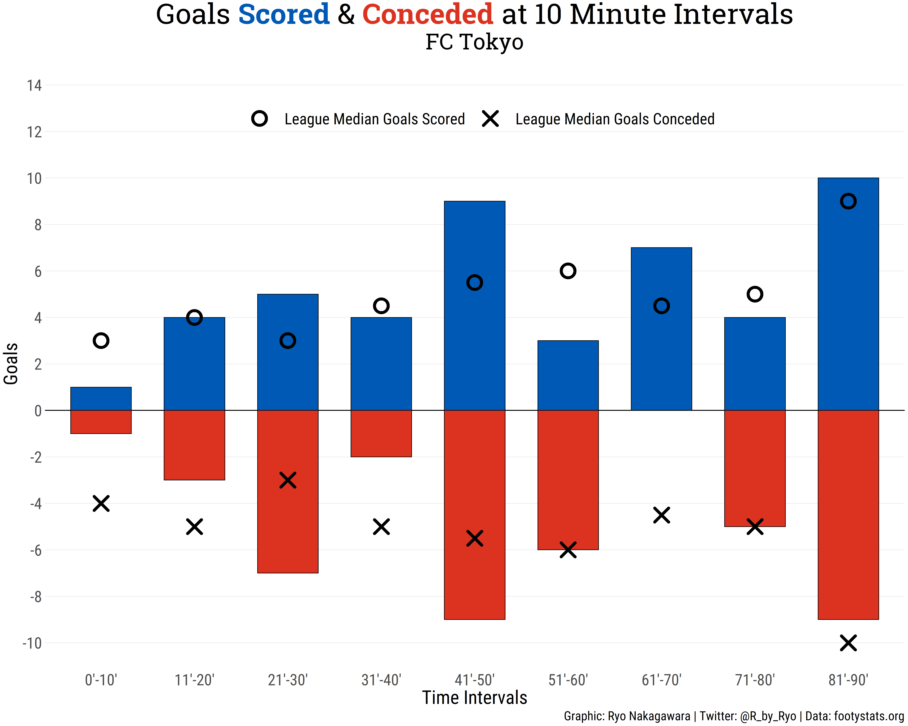

### Kawasaki Frontale

Champions Kawasaki scored lots of late goals compared to the league
average and were also extremely good at keeping it tight at the back
after the hour mark!

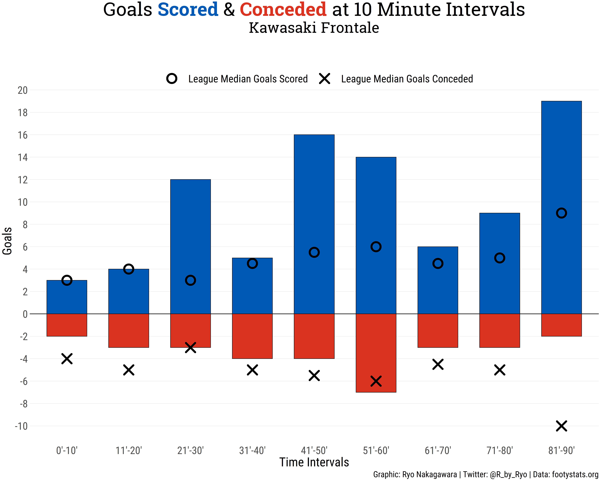

### Shimizu S-Pulse

Lots of late goals scored by Shimizu, knowing their performances this
season I surmise it being most likely consolation goals after their
opponents took their foot off the gas in the final 10 minutes.
Unfortunately, things were still very leaky at the other end as well!

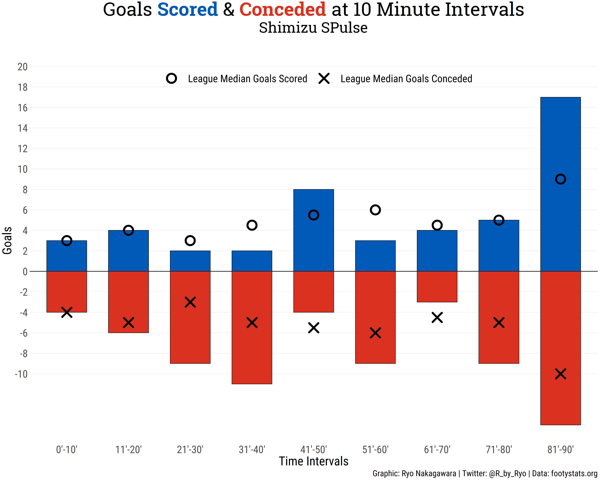

### Kashiwa Reysol

For Kashiwa we get a really interesting visualization, a real game of
two halves. Extremely good 1st half defensive performances paired with a
league average or below league average performance in the 2nd half.

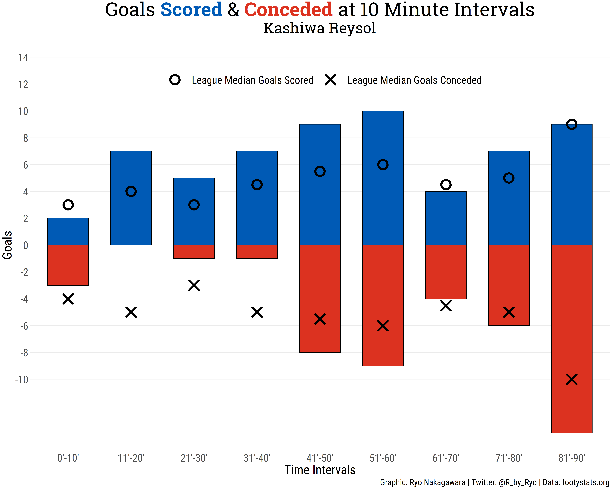

### Yokohama FC

For J1 returnees Yokohama FC, performances on both ends of the pitch
really tanked near the end of their games…

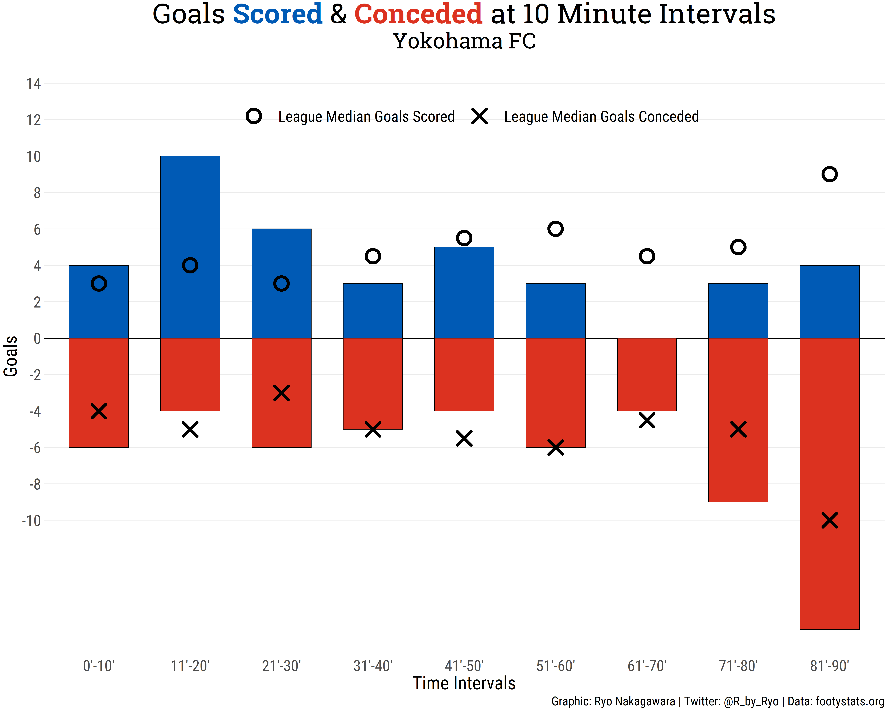

Goal Situations
===============

It’s nice to know **when** goals were scored during a game for different
teams but just as important is **how** teams scored goals. Different
data providers have different definitions for “situations” so I’ve
translated (to the best of my ability) the terms used by
[Football-Lab](https://www.football-lab.jp/summary/team_ranking/j1/?year=2020&data=goal)
below:

-   Through Ball: Any goal scored from a through ball.
-   Short Pass: Passes below 30 meters in length (Set plays, crosses,
    through balls not included).
-   Long Pass: Passes over 30 meters in length (Set plays, crosses,
    through balls not included).
-   Set Piece (Direct): Free kicks and corner kicks that directly
    resulted in a goal.
-   Set Piece: Any goal scored within 10 seconds of the set piece being
    taken.
-   Penalty: Any goal scored from a penalty.
-   Loose Ball: Any goal where the goalscorer gained possession of a
    loose ball (balls off the post/bar, clearances, blocks included).
-   Dribble: Any goal where the goalscorer took a shot following their
    own dribble.
-   Cross: Any goal from crosses (set pieces excluded).
-   Other: Any goals that do not fit with any of the above definitions.

You can turn this data into a series of tables to check out the stats
from different situations and see how your team compares in the league
like below for “crossing” situations:

<table class="table table-condensed table-responsive" style="width: auto !important; margin-left: auto; margin-right: auto;">
<thead>
<tr>
<th style="text-align:left;">
Team
</th>
<th style="text-align:right;">
Goals Against
</th>
<th style="text-align:right;">
Total Goals Against
</th>
<th style="text-align:left;">
Proportion of Total Goals Against
</th>
<th style="text-align:right;">
League Average Goals Against
</th>
</tr>
</thead>
<tbody>
<tr>
<td style="text-align:left;">
Urawa Reds
</td>
<td style="text-align:right;">
17
</td>
<td style="text-align:right;">
64
</td>
<td style="text-align:left;">
27%
</td>
<td style="text-align:right;">
9
</td>
</tr>
<tr>
<td style="text-align:left;">
Vegalta Sendai
</td>
<td style="text-align:right;">
16
</td>
<td style="text-align:right;">
61
</td>
<td style="text-align:left;">
26%
</td>
<td style="text-align:right;">
9
</td>
</tr>
<tr>
<td style="text-align:left;">
Yokohama Marinos
</td>
<td style="text-align:right;">
15
</td>
<td style="text-align:right;">
59
</td>
<td style="text-align:left;">
25%
</td>
<td style="text-align:right;">
9
</td>
</tr>
<tr>
<td style="text-align:left;">
Vissel Kobe
</td>
<td style="text-align:right;">
14
</td>
<td style="text-align:right;">
59
</td>
<td style="text-align:left;">
24%
</td>
<td style="text-align:right;">
9
</td>
</tr>
<tr>
<td style="text-align:left;">
Shimizu S-Pulse
</td>
<td style="text-align:right;">
13
</td>
<td style="text-align:right;">
70
</td>
<td style="text-align:left;">
19%
</td>
<td style="text-align:right;">
9
</td>
</tr>
<tr>
<td style="text-align:left;">
Gamba Osaka
</td>
<td style="text-align:right;">
11
</td>
<td style="text-align:right;">
42
</td>
<td style="text-align:left;">
26%
</td>
<td style="text-align:right;">
9
</td>
</tr>
<tr>
<td style="text-align:left;">
Yokohama FC
</td>
<td style="text-align:right;">
10
</td>
<td style="text-align:right;">
60
</td>
<td style="text-align:left;">
17%
</td>
<td style="text-align:right;">
9
</td>
</tr>
<tr>
<td style="text-align:left;">
Kashiwa Reysol
</td>
<td style="text-align:right;">
9
</td>
<td style="text-align:right;">
46
</td>
<td style="text-align:left;">
20%
</td>
<td style="text-align:right;">
9
</td>
</tr>
<tr>
<td style="text-align:left;">
Kashima Antlers
</td>
<td style="text-align:right;">
9
</td>
<td style="text-align:right;">
44
</td>
<td style="text-align:left;">
20%
</td>
<td style="text-align:right;">
9
</td>
</tr>
<tr>
<td style="text-align:left;">
Sagan Tosu
</td>
<td style="text-align:right;">
9
</td>
<td style="text-align:right;">
43
</td>
<td style="text-align:left;">
21%
</td>
<td style="text-align:right;">
9
</td>
</tr>
<tr>
<td style="text-align:left;">
Shonan Bellmare
</td>
<td style="text-align:right;">
9
</td>
<td style="text-align:right;">
48
</td>
<td style="text-align:left;">
19%
</td>
<td style="text-align:right;">
9
</td>
</tr>
<tr>
<td style="text-align:left;">
FC Tokyo
</td>
<td style="text-align:right;">
8
</td>
<td style="text-align:right;">
42
</td>
<td style="text-align:left;">
19%
</td>
<td style="text-align:right;">
9
</td>
</tr>
<tr>
<td style="text-align:left;">
Kawasaki Frontale
</td>
<td style="text-align:right;">
7
</td>
<td style="text-align:right;">
31
</td>
<td style="text-align:left;">
23%
</td>
<td style="text-align:right;">
9
</td>
</tr>
<tr>
<td style="text-align:left;">
Sanfrecce Hiroshima
</td>
<td style="text-align:right;">
7
</td>
<td style="text-align:right;">
37
</td>
<td style="text-align:left;">
19%
</td>
<td style="text-align:right;">
9
</td>
</tr>
<tr>
<td style="text-align:left;">
Consadole Sapporo
</td>
<td style="text-align:right;">
6
</td>
<td style="text-align:right;">
58
</td>
<td style="text-align:left;">
10%
</td>
<td style="text-align:right;">
9
</td>
</tr>
<tr>
<td style="text-align:left;">
Cerezo Osaka
</td>
<td style="text-align:right;">
5
</td>
<td style="text-align:right;">
37
</td>
<td style="text-align:left;">
14%
</td>
<td style="text-align:right;">
9
</td>
</tr>
<tr>
<td style="text-align:left;">
Nagoya Grampus
</td>
<td style="text-align:right;">
5
</td>
<td style="text-align:right;">
28
</td>
<td style="text-align:left;">
18%
</td>
<td style="text-align:right;">
9
</td>
</tr>
<tr>
<td style="text-align:left;">
Oita Trinita
</td>
<td style="text-align:right;">
4
</td>
<td style="text-align:right;">
45
</td>
<td style="text-align:left;">
9%
</td>
<td style="text-align:right;">
9
</td>
</tr>
</tbody>
</table>

As mentioned before, all the data sets are uploaded in the
[soccer\_ggplot](https://github.com/Ryo-N7/soccer_ggplots) Github repo.
The data for this section is titled:
[“jleague\_2020\_situation\_all\_df.csv”](https://raw.githubusercontent.com/Ryo-N7/soccer_ggplots/master/data/J-League_2020_review/jleague_2020_situation_all_df.csv).

Here are the image links for each team:

\|<a href="https://raw.githubusercontent.com/Ryo-N7/soccer_ggplots/master/J-League%202020/output/2020_review/situation/goal_sitch_KawasakiFrontale.png">Kawasaki
Frontale</a> \|
<a href="https://raw.githubusercontent.com/Ryo-N7/soccer_ggplots/master/J-League%202020/output/2020_review/situation/goal_sitch_GambaOsaka.png">Gamba
Osaka</a> \|
<a href="https://raw.githubusercontent.com/Ryo-N7/soccer_ggplots/master/J-League%202020/output/2020_review/situation/goal_sitch_NagoyaGrampus.png">Nagoya
Grampus</a> \|
<a href="https://raw.githubusercontent.com/Ryo-N7/soccer_ggplots/master/J-League%202020/output/2020_review/situation/goal_sitch_CerezoOsaka.png">Cerezo
Osaka</a> \|
<a href="https://raw.githubusercontent.com/Ryo-N7/soccer_ggplots/master/J-League%202020/output/2020_review/situation/goal_sitch_KashimaAntlers.png">Kashima
Antlers</a> \|
<a href="https://raw.githubusercontent.com/Ryo-N7/soccer_ggplots/master/J-League%202020/output/2020_review/situation/goal_sitch_FCTokyo.png">FC
Tokyo</a> \| \|
<a href="https://raw.githubusercontent.com/Ryo-N7/soccer_ggplots/master/J-League%202020/output/2020_review/situation/goal_sitch_KashiwaReysol.png">Kashiwa
Reysol</a> \|
<a href="https://raw.githubusercontent.com/Ryo-N7/soccer_ggplots/master/J-League%202020/output/2020_review/situation/goal_sitch_SanfrecceHiroshima.png">Sanfrecce
Hiroshima</a> \|
<a href="https://raw.githubusercontent.com/Ryo-N7/soccer_ggplots/master/J-League%202020/output/2020_review/situation/goal_sitch_YokohamaMarinos.png">Yokohama
F. Marinos</a> \|
<a href="https://raw.githubusercontent.com/Ryo-N7/soccer_ggplots/master/J-League%202020/output/2020_review/situation/goal_sitch_UrawaReds.png">Urawa
Reds</a> \|
<a href="https://raw.githubusercontent.com/Ryo-N7/soccer_ggplots/master/J-League%202020/output/2020_review/situation/goal_sitch_OitaTrinita.png">Oita
Trinita</a> \|
<a href="https://raw.githubusercontent.com/Ryo-N7/soccer_ggplots/master/J-League%202020/output/2020_review/situation/goal_sitch_ConsadoleSapporo.png">Consadole
Sapporo</a> \| \|
<a href="https://raw.githubusercontent.com/Ryo-N7/soccer_ggplots/master/J-League%202020/output/2020_review/situation/goal_sitch_SaganTosu.png">Sagan
Tosu</a> \|
<a href="https://raw.githubusercontent.com/Ryo-N7/soccer_ggplots/master/J-League%202020/output/2020_review/situation/goal_sitch_VisselKobe.png">Vissel
Kobe</a> \|
<a href="https://raw.githubusercontent.com/Ryo-N7/soccer_ggplots/master/J-League%202020/output/2020_review/situation/goal_sitch_YokohamaFC.png">Yokohama
FC</a> \|
<a href="https://raw.githubusercontent.com/Ryo-N7/soccer_ggplots/master/J-League%202020/output/2020_review/situation/goal_sitch_ShimizuSPulse.png">Shimizu
S-Pulse</a> \|
<a href="https://raw.githubusercontent.com/Ryo-N7/soccer_ggplots/master/J-League%202020/output/2020_review/situation/goal_sitch_VegaltaSendai.png">Vegalta
Sendai</a> \|
<a href="https://raw.githubusercontent.com/Ryo-N7/soccer_ggplots/master/J-League%202020/output/2020_review/situation/goal_sitch_ShonanBellmare.png">Shonan
Bellmare</a> \|

### FC Tokyo

FC Tokyo scored considerably more than league average from through ball
situations, which makes sense given Tokyo’s style of play of long
counter attacks led by Leandro, Diego, and Adailton.

The gaping hole in defensive midfield after Kento Hashimoto left and
filled in by Yojiro Takahagi (who showed he definitely is not a lone
defensive midfielder) is probably good reason why Tokyo conceded the
most goals from conventional “short pass” situations, although you would
want to see a shot/pass map of chances conceded to confirm (I wish I had
that kind of data). Otherwise, most Tokyo fans would recognize some of
the poor marking and inattentiveness in defense being the probable
reasons for conceding so many from “cross” and “loose ball” situations.

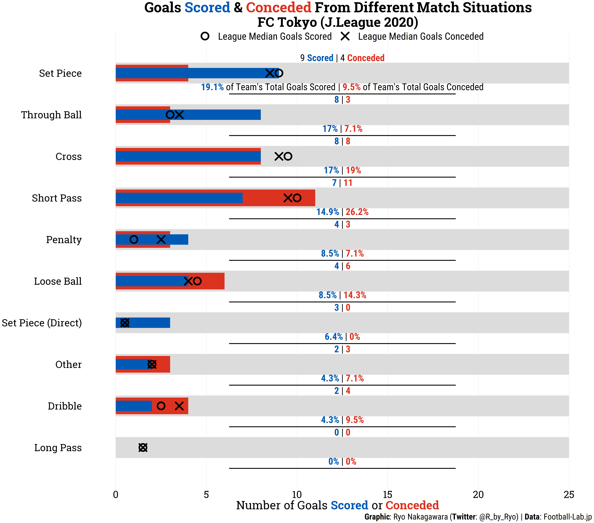

### Yokohama Marinos

Despite Marinos’ defensive frailties this season, their great possession
play was left intact from last season as their 69 goals scored was only
bettered by champions Kawasaki and nearly a third of these coming from
“short pass” situations. Their Achilles’ Heel proved to be defending
crosses as they conceded more than a quarter of their 59 goals conceded
(tied 4th worst in the league) from that type of situation.

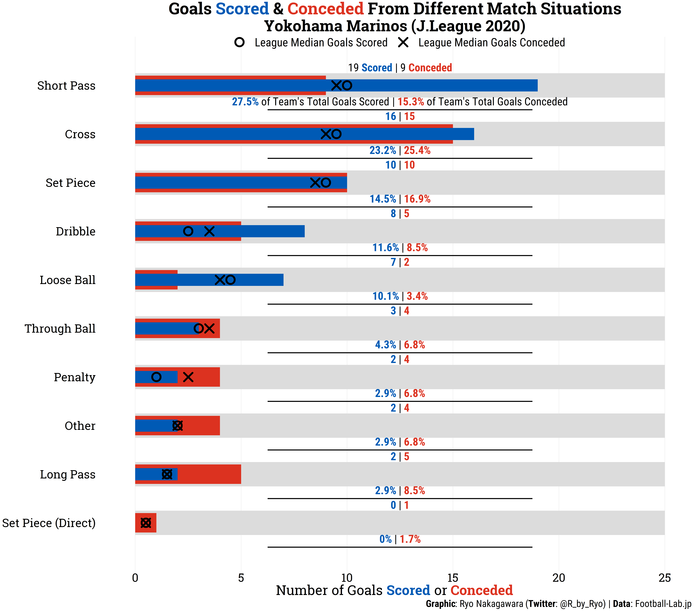

### Nagoya Grampus

The team with the best defense in the league conceded well below league
average in almost every situation category.

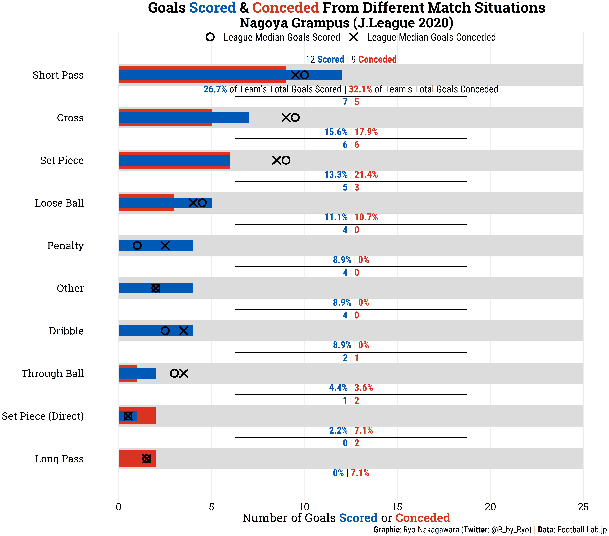

### Shimizu S-Pulse

Shimizu conceded the most amount of goals in the 2020 season having let
in a whopping 70 goals. At the other end they were the 2nd most lethal
team in the league from set pieces, only 1 goal behind Kawasaki Frontale
with 15 goals.

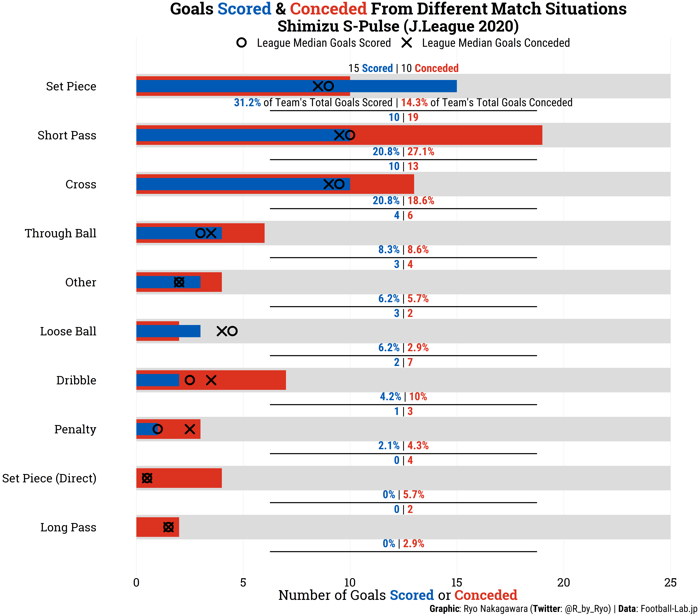

Team-Level Shooting
===================

In the previous few sections we got to know a lot about the **goals**
that J.League teams scored. However, in a sport like soccer/football
**goals are hard to come by**, they might not really accurately
represent a team’s actual ability or performance (even if ultimately,
it’s the end result that matters). To take things one step further I was
able to gather data from `FBref.com` on **shot quantity** to dive a bit
more into team performances.

The data for this section is titled:
[“jleague\_2020\_shooting\_df.csv”](https://raw.githubusercontent.com/Ryo-N7/soccer_ggplots/master/data/J-League_2020_review/jleague_2020_shooting_df.csv).

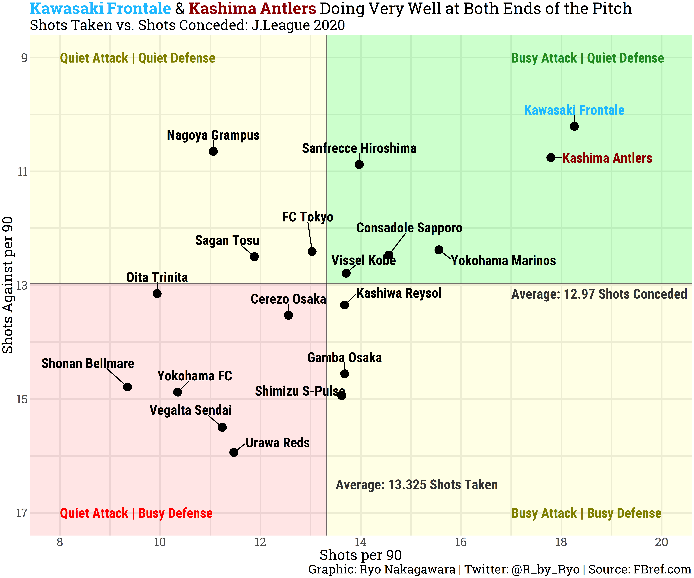

Of course, as this is only looking at the **quantity** of shots, we
can’t really tell about the actual quality of them from this chart. When
we analyze a team’s performance all too often we only look at their
**results** when its really their **process** (quality of chances
created/conceded over multiple games) that we want to focus on. This is
where we can use **expected goals (xG)** models to look at the
**quality** of shots taken/conceded by teams (and individuals, which
we’ll get to in a later section). Usually, you’d take a rolling average
over 10 matches to plot out xG, xGA, xGDiff (expected goal difference)
to assess teams performance over the course of the season but I don’t
have data at that granular level so I’ll be showing some viz using the
end-of-season numbers instead.

Team-Level xG
=============

So, what exactly is **expected goals** (xG)? Expected goals is a
statistic where a model assigns a probability (between 0 and 1) that a
shot taken will result in a goal based on a variety of variables and is
used for evaluating the quality of chances and predicting players’ and
teams’ future performances. A xG model only looks at the variables up to
the point that the player touches the ball for a shot. Post-shot xG
models covers the information about where in the frame of the goal the
shot went (“post” as in all the information after the player touches the
ball for the shot) but I won’t cover that here.

For some quick primers on xG check the links below:

-   [Expected Goals in Context
    (StatsPerform)](https://www.statsperform.com/resource/expected-goals-in-context/)
-   [What is xG?
    (TifoFootball)](https://www.youtube.com/watch?v=zSaeaFcm1SY)

The following two sections use xG data from Football-Lab. I’m not privy
to all of what goes into their model but the [explanation page on their
website (in Japanese)](https://www.football-lab.jp/pages/expected_goal/)
tells us about some of the information they used:

-   Distance from goal?
-   Angle from goal line?
-   Aerial duel?
-   Body part used?
-   Number of touches? (one touch, more than two touches, set plays,
    etc.)
-   Play situation? (Corner kick, direct/indirect free kick, open play,
    etc.)

So, the usual variables that you might recognize from other xG models
are being considered.

The data for this section is titled:
[“team\_xG\_J-League-2020.csv”](https://raw.githubusercontent.com/Ryo-N7/soccer_ggplots/master/data/J-League_2020_review/team_xG_J-League-2020.csv).

xG vs. xGA
----------

Instead of the “Top-right Messi” thing we see in many soccer analytics
graphs, we get “Top-right Kawasaki”! They were far-and-away the best
side in both the offensive and defensive sides of the game this season,
2.42 xG per game and 1.03 xGA per game.

What’s interesting here is to see Kashiwa below league average in terms
of their xG numbers despite being the team that scored the **3rd most
goals** (60, behind Marinos and Kawasaki) in the J.League this season. A
lot of this can be attributed to Michael Olunga’s great finishing record
(scoring far more goals than the xG model expected an “average” striker
would score) which we’ll explore in the next section for individual xG
leaders.

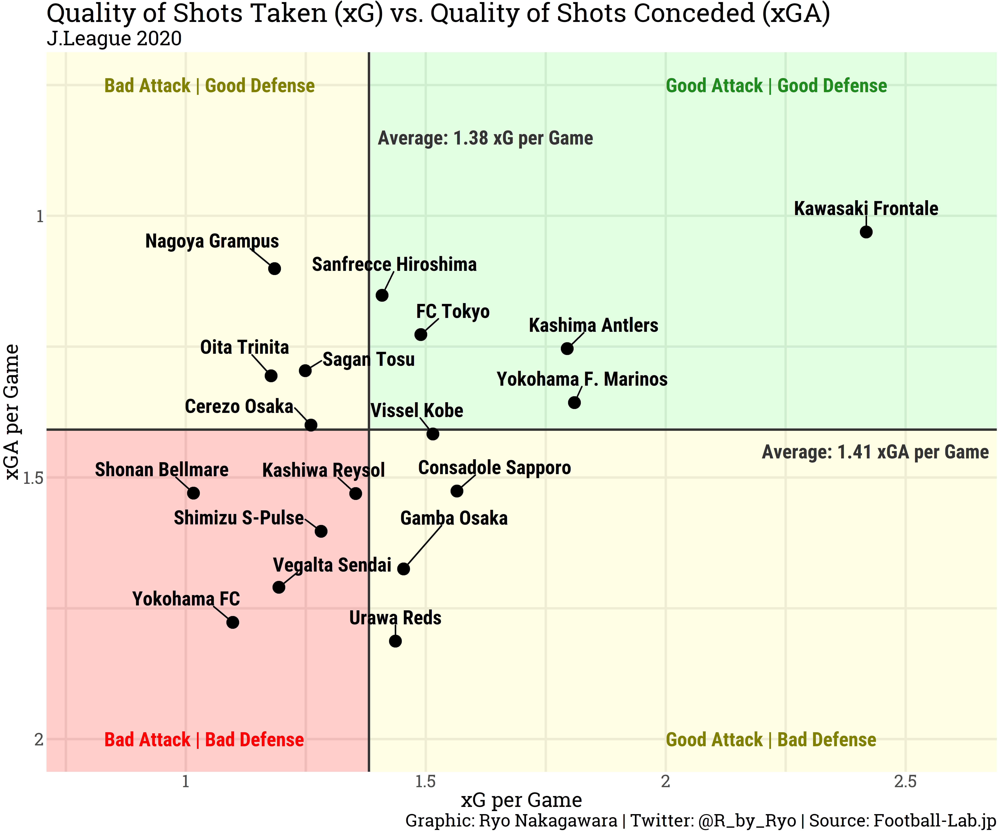

Individual-Level xG
===================

The following is based on a sample of the top 20 or so **expected goals
leaders** as evaluated by Football-Lab’s xG model, so unfortunately
players like Erik Lima and Kyogo Furuhashi miss out despite the fact
that they’ve scored more goals than some of the players that appear
below. You’ll also want to look at shot maps where xG values and shot
locations are plotted on a field but unfortunately I don’t have that
granular data, although I’ll show a team-level example in the next
section.

The data for this section is titled:
[“jleague\_2020\_individual\_xG.csv”](https://raw.githubusercontent.com/Ryo-N7/soccer_ggplots/master/data/J-League_2020_review/jleague_2020_individual_xG.csv).

Goals vs. xG
------------

We can chart out how well this small sample of J.League players finished
their chances in comparison to their shot quality (as quantified by the
expected goals model).

Michael Olunga again leads the pack, having scored \~9 goals more than
what Football-Lab’s xG model expected an average league player to score
from the chances Olunga took. The 2nd highest top scorer, Everaldo, very
slightly underperformed his xG numbers, scoring 17 non-penalty goals
from 17.78 non-penalty xG. Kaoru Mitoma also showed a very clinical side
to his game having scored 13 goals from an xG of only 8! Out of this
selection of players the Kawasaki winger had the highest overperformance
by scoring \~160% of his xG.

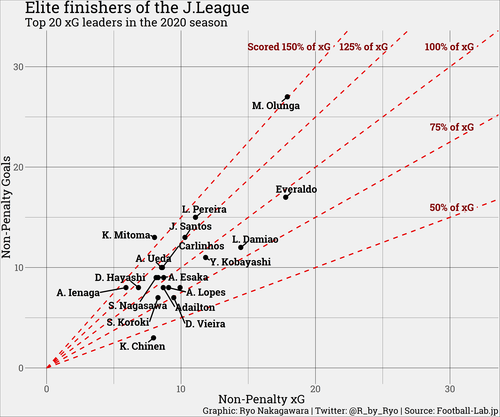

Shot Volume vs. xG per Shot
---------------------------

In this chart I compare shot volume per game against shot quality per
shot for the sample of J.League players provided by Football-Lab. Using
this data we can begin to understand whether a player is taking and/or
scoring from high quality chances (close to the goal and at a good
angle) or shots from outside the box or at bad angles and compare them
with their shot volume output.

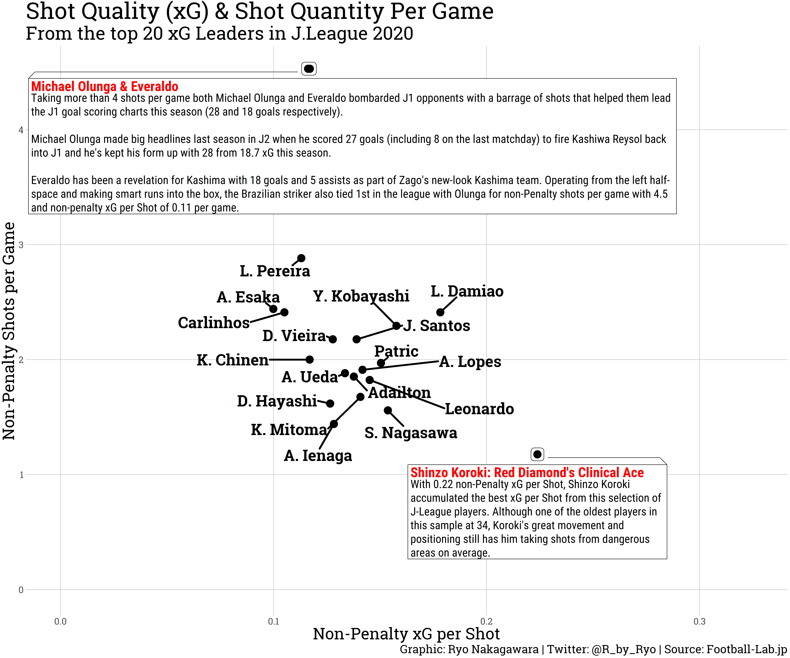

Kawasaki Frontale vs. Gamba Osaka xG Match Report
=================================================

As a little bonus viz, I personally re-watched the **title-deciding**
match between Kawasaki Frontale vs. Gamba Osaka and collected shot data
from the match footage with the help of the [Expected Goals
Calculator](https://futbolakademi.shinyapps.io/golbeklentisi/) app
created by [AkademiScouting](https://twitter.com/AkademiScouting). To
get the expected points (xPoints) I used [Danny Page’s
calculator](https://danny.page/expected_goals.html). In addition to
getting some more experience manually collecting this kind of data,
after using the app I am now completely fluent in Turkish… at least for
football related terms!

This viz will be familiar to those of you that have seen the match
report viz I do for European leagues, courtesy of
[understat.com’s](https://understat.com/) data, you can see a thread for
Liverpool’s league games -
[here](https://twitter.com/R_by_Ryo/status/1304854482786816000).

Random Rambles
==============

This last bit will be some scatter shot musings on various J.League
teams. I’m incorporating some transfer rumors and my own speculations as
well so take these opinions with a pinch of salt!

FC Tokyo
--------

Next season will see the return of Diego Oliveira (in time for the Cup
Final? - Update: No, but they won it anyways!) while they still have
Nagai, Leandro, and Adailton all ready to go in attack. The two
youngsters (well OK, they’re 23 now) who were mainly competing as
rotation options for the 4 aforementioned players, Taichi Hara and
Kyosuke Tagawa, still need to improve more to break into the starting XI
on a consistent basis. There are also plenty of rumors of Hara heading
to Gornik Zabreze in Poland which might give Kazuya Konno a better
chance after some bright cameos near the end of the season. It will be
interesting where exactly the latest signing (as of January 13), Ryoma
Watanabe, will fit in. For Montedio Yamagata last season he primarily
played on the Right Midfielder/Winger where he contributed 7 goals and 5
assists so he could fill in Taichi Hara’s spot in the rotation on the
wings or he could be another wide option in a 4 man midfield as well.

The other major addition to the team in the off-season, Takuya Aoki, is
clearly supposed to fill in the defensive midfield void that plagued FC
Tokyo last season. Along with the most likely departure of Joan Oumari
(which is a bit disappointing for me), it looks like Morishige will be
moving back into CB alongside Tsuyoshi Watanabe after doing a pretty
decent job as the “6” in the last few months of the season. I’m not
quite so sure about Aoki, especially as he’s on the wrong side of 30 as
well so I can only hope that it’ll be better than some of the poor
performances Takahagi and Shinada did there last season.

As I showed in the “Squad Age Graph” section, this Tokyo team is very
old, especially in center midfield with Mita and Higashi also on the
books. The only under-30 central midfielders are Manato Shinada, Arthur
Silva, and Shuto Abe - of whom only Abe can be said to be a truly nailed
on starter! Out wide (in terms of wide midfielders rather than the group
of strikers/wingers discussed at the beginning of this section) there is
a bit more youth with Kazuya Konno, Takuya Uchida, and the
aforementioned Ryoma Watanabe.

In defense it’ll be Tsuyoshi Watanabe partnered by Morishige while
neither Joan Oumari or Daiki Niwa’s contracts have been renewed as of
yet so I’m intrigued as to who will become the new rotation options
especially as youth prospect Seiji Kimura (who played 3 full league
games last season) is heading to Kyoto on loan next season. So it seems
like FC Tokyo will actually use the versatile Makoto Okazaki after all,
when despite being brought back from loan last season he ended up not
playing a single minute.

On a brighter note for the “Gas Men”, the team has plenty of options at
fullback with the two unrelated Nakamuras (Takumi and Hotaka) performing
admirably after Sei Muroya left for Hannover last season. On the left
side, Ryoya Ogawa remains as a main cog in defense while Kashif
Bangunagande will be hoping for more opportunities after receiving his
debut back in September.

In goal the future is bright with Go Hatano making a good case for a
starting role for Japan in the delayed Olympics this year after some
good-to-great performances filling in for the injured Akihiro Hayashi
since late October. With Hayashi only returning from injury this summer,
Hatano has a really good chance to consolidate the starting position for
club and country (U-23) for years to come. Regular 3rd option Tsuyoshi
Kodama will provide back up duties in the mean time.

All in all the squad composition for next season is still no where near
set with center back options in particular looking thin. Whether that
means Oumari and/or Niwa renewing (which looks unlikely given the
scuttlebutt) or a dip into the transfer market remains to be seen. In
the medium-to-long term I am still concerned with how old this team is
especially in center midfield and Tokyo’s best players up top besides
Leandro are all over 30 as well. There is still a rather glaring gap
between the veterans and the younglings as seen in the Squad Age graph
viz although players like Ryoya Ogawa, Tsuyoshi Watanabe, Ryoma Watanabe
are getting close to that “peak age” section.

As an aside, I did a few tactical breakdowns/match notes for FC Tokyo
games this past season:

-   FC Tokyo’s 2nd goal vs. Shimizu S-Pulse (great example of a
    counterattack): [1](https://i.imgur.com/BC8iMuT.png),
    [2](https://i.imgur.com/VoZqV0G.png),
    \[3\](<a href="https://i.imgur.com/2U9CtUP.p" class="uri">https://i.imgur.com/2U9CtUP.p</a>
-   FC Tokyo vs. Nagoya Grampus (Aug. 15, 2020): [General match
    notes](https://twitter.com/R_by_Ryo/status/1294618664730161163)
-   FC Tokyo vs. Shonan Bellmare (Aug. 23, 2020): [General match
    notes](https://twitter.com/R_by_Ryo/status/1297545141914234885) ng),
    [4](https://i.imgur.com/01yefrE.png)
-   FC Tokyo vs. Kashima Antlers (Aug. 26, 2020): [General match
    notes](https://twitter.com/R_by_Ryo/status/1298630286603767810),
    [Tactical breakdown of first conceded
    goal](https://twitter.com/R_by_Ryo/status/1298934328160739330),
    [Tactical breakdown of second conceded
    goal](https://twitter.com/R_by_Ryo/status/1298934884199575552)
-   FC Tokyo vs. Gamba Osaka (Aug. 30, 2020): [General match
    notes](https://twitter.com/R_by_Ryo/status/1299982703446507521)
-   Lots of other shorter tweets…

Kawasaki Frontale
-----------------

We saw how the ludicrous schedule for ACL teams impacted Marinos, FC
Tokyo, and Vissel Kobe this past season so how will Kawasaki Frontale
fare with ACL commitments? With Kengo’s retirement, Hidemasa Morita
leaving for Europe, and backup Hokuto Shimoda leaving and with Joao
Schmidt from Nagoya and Kazuki Kozuka from Oita coming in to replace
them, there has been quite a lot of churn in Frontale’s midfield engine
room.

While Kawasaki have been very good in the transfer market, it still
won’t be easy if Kaoru Mitoma or Ao Tanaka leave for Europe this winter
or in the summer. Some backups in defense (another CB and/or possibly
fullback) would help the team cope with a busier schedule next season as
having Reo Hatate (who also rotated in midfield and on the wing) fill in
at LB wasn’t ideal, even if he did do all right there.

Gamba Osaka
-----------

Tsuneyasu Miyamoto’s promising managerial career continues as the team
from the blue half of Osaka finished 2nd, although a rather distant one
at that with a giant 18 point gap separating Gamba from Kawasaki
Frontale. Starting out in a 3-5-2 before moving to a 4-4-2 later in the
season, a lot of their problems have centered on finding the right
balance in midfield. Problems there have had repercussions in both
attack and defense, which was compounded when Yosuke Ideguchi got
injured in November. Yuki Yamamoto and Shinya Yajima didn’t work too
well as a holding pair, most glaringly seen in losses to Kawasaki in the
league and Emperor’s Cup final.

Up front, Takashi Usami and Patric complement each other well and with
backup striker Kazuma Watanabe leaving and Ademilson fired for drunk
driving it will be interesting how Kazunari Ichimi fits into Miyamoto’s
plans after good loan spells with Kyoto Sanga (J2) and Yokohama FC (J1).
However, Gamba only scored more than 2 goals in a game **once** last
season (4-1 win against Sendai) and 16 of their 20 league wins were by a
**single goal margin**. They need to be able to score more goals as
those are very fine margins that aren’t necessarily sustainable over
multiple seasons. Especially when you consider the fact that given their
“shots against” and “xGA” (expected goals against) statistics, their
defense isn’t as great as you might be led to believe to actually hold
onto slim leads (although having Higashiguchi in goal does help).

With a good balanced squad as seen in their Squad Age profile with many
promising youth players raring for an opportunity, the onus is on
Miyamoto to fix their tactical issues to fight a closer title battle
next season.

Cerezo Osaka
------------

All things considered a good season from the purple half of Osaka
although they just missed out on a ACL place by 3 points. Unfortunately,
their more defensive style under Miguel Lotina (tied 3rd least amount of
goals) wasn’t favored by the higher ups and he was dismissed to much
uproar from Cerezo fans. For the fourth time, the Cerezo front office
have brought in Levir Culpi for a more “attacking” brand of football.
It’ll be interesting what kind of shake-up Culpi will bring as Cerezo
have one of the oldest squads in the J.League and key players from last
season such as Eiichi Katayama, Yasuki Kimoto, Yoichiro Kakitani, and
Bruno Mendes have already left the club. Incoming transfers as of
January sees Adam Taggart (like-for-like target man swap for Mendes?)
and Riki Harakawa to the Osaka club while the “prodigal son, Shinji
Kagawa, returns!” campaign by the front office won’t stop anytime soon.

Yokohama Marinos
----------------

Swashbuckling Marinos had a much harder season this time around as their
grueling schedule as an ACL team took a toll on their pressing ability
and the cohesiveness of their starting XI as a unit due to squad
rotations and injuries. Although they conceded the 3rd most goals in the
league, they maintained their attacking flair with 69 goals scored (2nd
best in the league only behind league winners Kawasaki). Marinos’ ACL
campaign also ended in disappointment as they couldn’t finish off Suwon
Bluewings in the 1st half as the Korean side eventually came back from
behind to win the Round of 16 clash.

Although surprisingly letting Junior Santos move on after a good season
notching 13 goals, Marinos have brought in Oita Trinita’s Iwata to help
shore up their back line in a good start to their transfer window, with
the host of departures especially up front you’d expect another
Brazilian import to be coming in soon.

**UPDATE** (1/12/21): Erik left as well so I do wonder if Ado Onaiwu
might be given the starting striker role from next season onward.

Nagoya Grampus
--------------

An impressive season especially in defense as Grampus let in the fewest
goals in the league with just 28 going past Mitch Langerak. The Aussie
goalkeeper and the fantastic back four of Yutaka Yoshida, Shinnosuke
Nakatani, Yuichi Maruyama, and Shumpei Naruse also kept a J.League
record of 17 clean sheets out of 34 games! However, there is still some
work to be done as Nagoya need back-up striker or better replacement for
Mu Kanazaki. It was very clear after Kanazaki’s injury that Nagoya
really struggled to score goals with none of Naoki Maeda, Ryogo
Yamasaki, and Hiroyuki Abe really able to fill in to score chances
created by the clever Mateus and Gabriel Xavier. Although they still
managed to grind out results to finish 3rd (having only conceded 3
(THREE!) goals in the last 10 matches of the season), if they can solve
issues up front Massimo Ficcadenti’s side will be in prime position for
a title fight next season.

**UPDATE**: Since I started writing this up Nagoya have acquired
Yoichiro Kakitani from Cerezo Osaka and Manabu Saito from Kawasaki
Frontale. It’ll be interesting if Kakitani can rediscover his form there
as he hasn’t been at his best in the past few years. They’ve even
reinforced their already formidable defense with the acquisition of
center back Kimoto from Cerezo as well!

Shonan Bellmare
---------------

It was another disappointing season for the Hiratsuka side who finished
bottom of the league. Even still, their ability to assimilate young
promising players into the J.League is notable with Mitsuki Saito and
Daiki Kaneko capturing a lot of attention this past season. They join a
long list of departures from the club (to Rubin Kazan and Urawa Reds
respectively) after also letting go of Toichi Suzuki (Lausanne Sport)
and Yamato Wakatsuki (FC Sion) earlier in the season. With an
unprecedented **four** teams slated for relegation next year it will be
a huge task for manager Bin Ukishima to overhaul this squad on a budget
and lead them to safety. They have gotten started with the incoming
transfers of veteran midfielder Shuto Yamamoto and defender Shintaro
Nago from Kashima Antlers. A lot of eyes will be on which teenagers,
such as Taiga Hata and Satoshi Tanaka, could be the next players to step
up and then be snapped up by bigger clubs.

Vissel Kobe
-----------

Despite winning the Emperor’s Cup last January, terrible league form led
to the “mutual consent termination”/sacking/etc. of Thorsten Fink (yes,
the former Bayern midfielder). The German was replaced in the dug out by
sporting director Atsuhiro Miura who, as of now, looks like he’ll be
continuing in the role next season. Their league form gave the
impression that they gave up on it to focus on the ACL quite a few
months before their campaign restarted in December. Although they
advanced to the semifinals, Kobe’s maiden continental campaign ended in
heartbreak and a painful injury to Iniesta. This past league season has
left Kobe as an organization, from top to bottom, with quite a lot of
thinking to do.

They need to balance trying to squeeze out what remains of Iniesta’s
time as a player there (up to 2 seasons at most?) with some more
medium\~long term plans for success going forward. These include
figuring out their playing style (moving away from the slow turgid
possession football they’ve been trying these past few seasons) and to
make transfer decisions that fit with whatever style and manager they
ultimately choose. A lot of their best players bar Kyogo Furuhashi and
Sergi Samper are close to or over 30 (Hotaru Yamaguchi, Gotoku Sakai,
Daigo Nishi, Leo Osaki, and Andres Iniesta). While they’ve also focused
on developing younger players as well (with Yuta Goke, Takuya Yasui, and
Ryuho Kikuchi seeing a decent chunk of game time last season), it
remains to be seen if they can be relied upon immediately. The
“**Rakuten Rovers**” have a very important off-season ahead.

Kashiwa Reysol
--------------

Well, the main story is definitely Michael Olunga leaving for Al-Duhail
in rather odd circumstances. Kashiwa Reysol had to scramble to release
an official statement after Olunga was photographed by the Qatari side’s
social media warming up for a league game! This leaves a gaping hole in
Reysol’s attack as Olunga accounted for nearly half (28 of 60) of
Kashiwa’s goals this past season. Reysol’s xG numbers aren’t actually
all that great and were reliant on Olunga’s elite finishing ability as
he scored 150% of his xG numbers (as seen in the individual goal leaders
section). This is made even worse by the fact that their defensive
numbers aren’t very good to fall back on either with slightly below
league average shots against per game and xGA per game.

Their immediate back up option in Hiroto Goya (who is the only player in
the Kashiwa squad that gets anywhere near Olunga’s 4.91 shots per 90
with 4.07, although with having only played 10.1 90s as per FBref)
doesn’t seem like someone who can fully replicate Olunga’s scoring
output. I really do wonder if there was no way they could have kept
Junior Santos (who permanently moved to Hiroshima weeks earlier) after
he impressed on loan at Yokohama Marinos this past season. There is the
option of playing Cristiano up top with Ataru Esaka playing as the 10
which still leaves players like Hiroto Goya, Hayato Nakama, Yuta Kamiya,
and new signing Ippei Shinozuka having to drastically increase their
shooting and scoring output to make up for Olunga’s departure.

On the positive side though is the acquisition of Sendai youngster Keiya
Shiihashi, who’ll look to supplement Kashiwa’s aging center midfield of
Masatoshi Mihara, Hidekasu Otani, and Richardson while Reysol will also
hope Sachiro Toshima can get back into good form after a bad injury
ended his season back in September.

Conclusion
==========

It was an extremely turbulent J.League season but all games were played
without any cancellations. There will be **20 teams** next season due to
*promotion but no relegation* throughout the J.League pyramid. It looks
like it will be a tough schedule for all teams to navigate (even more so
for ACL clubs again), especially if there are any more COVID enforced
quarantines like what we saw happen to Kashiwa Reysol and Sagan Tosu
this past season.

Next season will see the addition of Tokushima Vortis and Avispa
Fukuoka. Tokushima Vortis will be making the step up into J1 since the
2014 season as champions of J2. Unfortunately, their man with the plan,
manager Ricardo Rodriguez will be taking the helm at Urawa Reds instead
next season (if you’re interested the J-Talk Podcast had an interview
with him in December,
[link](https://jtalkpod.podbean.com/e/j-talk-special-ricard-rodriguez-interview/)).
Avispa Fukuoka return after relegation in the 2016 season.

This blog post gathered data from a variety of sources to create some
insights about teams and individuals in the J.League this past season.
Although I do think that a lot of my speculations and theories on some
of the patterns/quirks seen in the data could be confirmed if more
granular data were available. To be honest, for better analyses and more
solid evidence-based conclusions, it might be time for me to finally
cough up the money for a WyScout/InStat account!

For tactical write-ups, this past season I focused on one team (FC
Tokyo) while also slowly starting watching more games of other teams (I
mainly took notes on Kashiwa Reysol and Kawasaki Frontale). I hope to
release this kind of content for other teams when the J.League resumes!

Even with the doom and gloom it turned out to be an entertaining season
of soccer in Japan as although Kawasaki Frontale wrapped up the title
early, there was still a lot to play for the rest of the pack up until
the final matchday. I hope this blog post was informative as well as
entertaining and encouraged some of you to watch the J.League.

Thanks for reading and see you next season!

Some English-Language J.League Content!
=======================================

-   [J-Talk Podcast](https://jtalkpod.podbean.com/): Weekly roundups and
    discussion of all the J1, J2, and J3 soccer action!

-   [FC Tokyo Kai-guys](https://fctokyokaiguys.wordpress.com/): FC Tokyo
    content in English.

-   [Gamba Osaka English blog](https://gambaosakaenglish.blog/): Gamba
    Osaka content in English.

-   [J.League Regista](https://jleagueregista.wordpress.com/): Special
    features on past and current players and teams.

-   [Dan Orlowitz](https://twitter.com/aishiterutokyo), [Sam
    Robson](https://twitter.com/FRsoccerSam/), [Michael
    Angioli](https://twitter.com/Michael_Master) on Twitter for general
    Japanese soccer news.

-   …and more!
