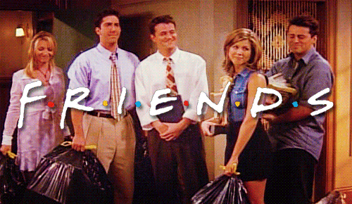
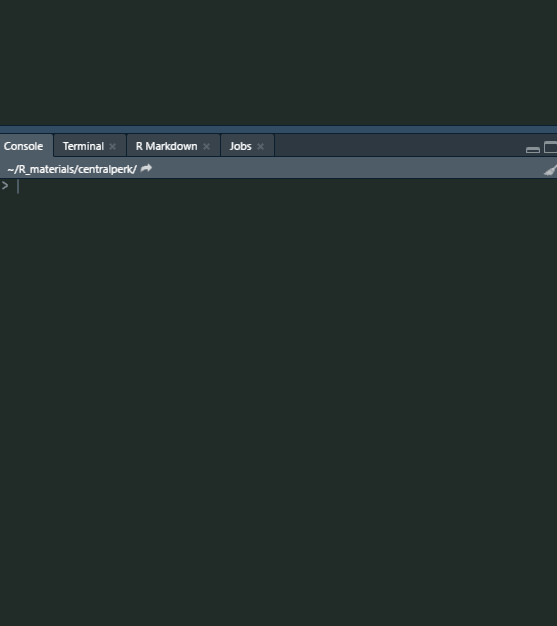

My latest package is a R client for [Melanie
Seltzer](https://github.com/melanieseltzer)’s
[“friends-quotes-api”](https://friends-quotes-api.herokuapp.com/),
called [{centralperk}](https://github.com/Ryo-N7/centralperk)! This was
mainly a way for me to continue learning about APIs, specifically using
APIs with R. I’ve been doing some work with an API powered by {plumber}
for data collection at work and wanted to explore more. {centralperk} is
**massively** influenced (and many code chunks taken from) by the
[{goodshirt}](https://github.com/adam-gruer/goodshirt) package by [Adam
Gruer](https://github.com/adam-gruer) which I use every time I start up
RStudio.



To use {centralperk} you can just call the functions directly:



But in my opinion the best usage of {centralperk} is to insert it into your R profile
file. Whenever you open up a new RStudio instance (or just restart your
R session if you’re in the mood to procrastinate) a new quote from
Friends will pop up in your console to brighten your day!

You can do this by first installing {centralperk}:

``` r
devtools::install_github("Ryo-N7/centralperk")
```

Get a random quote via `centralperk()`:

``` r
library(centralperk)

centralperk()
```

    ## 
    ##  But they don't know that we know they know we know! 
    ## 
    ##  > Phoebe

Get a quote from any of the main characters with `ross()`, `rachel()`,
`joey()`, `chandler()`, `phoebe()`, `monica()`!

``` r
ross()
```

    ## 
    ##  I grew up in a house with Monica, okay. If you didn't eat fast, you didn't eat. 
    ## 
    ##  > Ross

``` r
rachel()
```

    ## 
    ##  I got off the plane. 
    ## 
    ##  > Rachel

``` r
joey()
```

    ## 
    ##  How you doin? 
    ## 
    ##  > Joey

``` r
chandler()
```

    ## 
    ##  I'm not so good with the advice. Can I interest you in a sarcastic comment? 
    ## 
    ##  > Chandler

``` r
phoebe()
```

    ## 
    ##  But they don't know that we know they know we know! 
    ## 
    ##  > Phoebe

``` r
monica()
```

    ## 
    ##  Guys can fake it? Unbelievable! The one thing that’s ours! 
    ## 
    ##  > Monica

Then to access your R profile file (it will create one for you if you
don’t have one already):

``` r
usethis::edit_r_profile()
```

Finally you can put the line of code below in the file (`message()` is
so that it appears in orange in the console). Then just restart R
(**Ctrl+Shift+F10** in RStudio) and you’ll have a quote in your console!

``` r
if (interactive() & require("centralperk", quietly = TRUE)) { message(centralperk()) }
```

This is a method I learned via \#rstats Twitter but… I can’t find the
original tweet, sorry! You could also add a bit of color to the output
with the [{crayon}](https://cran.r-project.org/package=crayon) package
as well.

From making this package and reading a lot of code from other API R
packages out in the wild I learned quite a lot. At work I was mainly
working from the API side of things rather than the client side. So
creating an R client for an API naturally meant that I had to get used
to using the {httr} package. From there it’s dealing with the outputs
which mainly come in the form of lists which made me revisit some of my
favorite {purrr} functions like `map()` and `pluck()`. I found out later
that you can also pass URLs to the `jsonlite::fromJSON()` function which
returns a data.frame but I didn’t end up using it as staying within
{httr} felt more natural as there are a lot of built-in features that
you can use to handle various API responses compared to converting from
the JSON content directly.

Going through the code of {goodshirt} I saw how Adam created S3 classes
and methods which was something I learned about going through [Advanced
R](https://adv-r.hadley.nz/s3.html) last year but not something I got to
practice because I never needed it at work or any personal projects.
However, for quote generation having specific classes and methods are a
big help because you can specify how the quote strings appear for the
user. For a package like a quote generator you want to present the
quotes in a nice way, with new lines, separate line for the quoted
character (and other meta info), and maybe some indentation.

A limitation of {centralperk} is that the API its calling only has 18
quotes, and only one each for Monica and Chandler. My learning goals for
this year are to learn more about APIs with R and web dev stuff (doing
Javascript right now), so for this package my intermediate/long term
goal is to create my own Friends Quotes API using {plumber} or
Javascript (…or both for practice)!

The time consuming part is probably going to be the actual data
collection part as I’m going to be downloading subtitle transcripts and
then re-watching the show to find good quotes to choose from. I’ve been
doing this with another show that I want to do stuff with (plumber APIs,
shiny apps, ggplots, websites, the whole shabang) and well… yeah all of
this is just an excuse on my part to re-watch TV shows under the guise
of “this is useful for my programming projects!”.

I can’t really put a timeline on when any of this stuff will come out
since there are tons of new shows/movies coming out recently for me to
watch but stay tuned!


