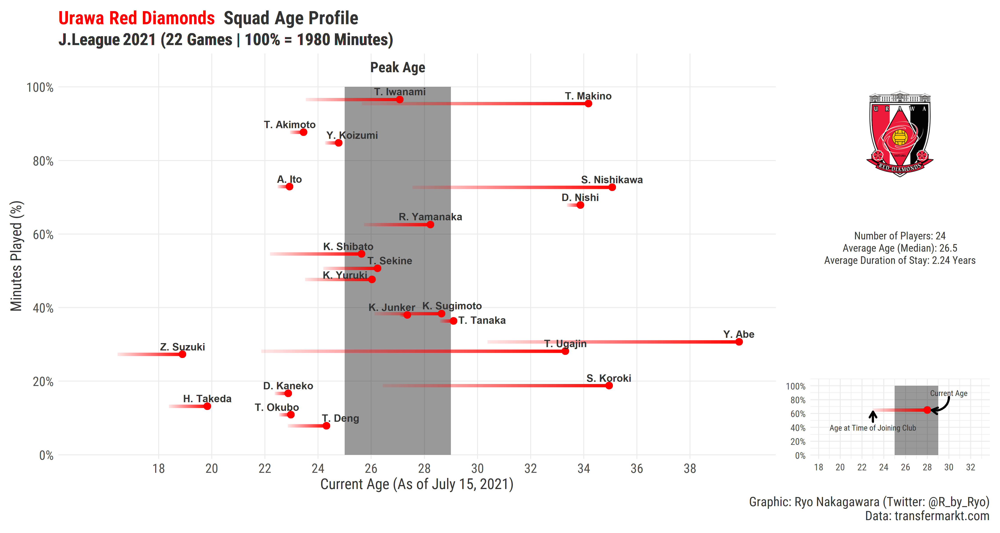

Introduction
============

The 29th season of the J.League is slightly different compared to a
normal season as for the first time there are 20 teams fighting for the
league title and 4 teams facing relegation into J2 as no teams were
relegated last season due to impact of COVID on football finances.
Kawasaki Frontale remain at the top of the table as they are still
**undefeated**. Due to there being no relegation last season due to
COVID having a huge impact on match day revenue from loyal fans, this
season sees an unprecedented 4 teams relegated as Japanese football
deals with an unprecedented 20 team league (promotion from J2 was still
in effect) along side another packed schedule that has to allow for a 1
month break due to the Olympics. We are only a bit over half way through
the season but fans have already seen some surprises such as the rapid
rise of Sagan Tosu and the fall of some strong teams from last year like
Kashiwa Reysol and Gamba Osaka.

League Table
------------

<details>
  <summary>Click to show code!</summary>
  <pre>

``` r
jleague_table_2021_mid <- read.csv(file = "https://raw.githubusercontent.com/Ryo-N7/soccer_ggplots/master/data/J-League_2021_mid_review/J-League_2021_mid_league_table.csv", 
                               stringsAsFactors = FALSE) %>% 
  mutate(team_name = case_when(
    Squad == "Kawa Frontale" ~ "Kawasaki Frontale",
    Squad == "Grampus" ~ "Nagoya Grampus",
    Squad == "Sanfrecce" ~ "Sanfrecce Hiroshima", 
    Squad == "Marinos" ~ "Yokohama F. Marinos",
    Squad == "Consa Sapporo" ~ "Consadole Sapporo",
    Squad == "S-Pulse" ~ "Shimizu S-Pulse",
    Squad == "Vortis" ~ "Tokushima Vortis", 
    TRUE ~ Squad
  )) %>% 
  select(Rk, team_name, W, D, L, GF, GA, GD, Pts)

xG_all_df <- read.csv(file = "https://raw.githubusercontent.com/Ryo-N7/soccer_ggplots/master/data/J-League_2021_mid_review/team_xG_J-League-2021_mid.csv") %>% 
  mutate(xG = round(xG, 2),
         xGA = round(xGA, 2),
         xGDiff = (xG - xGA) %>% round(., 2) ) %>% 
  select(Squad, xG, xGA, xGDiff)

jleague_table_2021_mid_cleaned <- jleague_table_2021_mid %>% 
  left_join(xG_all_df, by = c("team_name" = "Squad")) %>% 
  select(Team = team_name, W, D, L, Pts, GF, GA, GD, xG, xGA, xGDiff)

jleague_kable_table <- jleague_table_2021_mid_cleaned %>% 
  knitr::kable(format = "html", 
               caption = "J.League 2021 Table (As of July 26, 2021)") %>% 
  kable_styling(full_width = FALSE,
                bootstrap_options = c("condensed", "responsive")) %>% 
  add_header_above(c(" ", "Result" = 4, "Goals" = 3,
                     "Expected Goals" = 3)) %>% 
  column_spec(1:2, bold = TRUE) %>% 
  row_spec(1, bold = TRUE, color = "white", background = "green") %>% 
  row_spec(2:3, bold = TRUE, color = "grey", background = "lightgreen") %>% 
  row_spec(4:16, bold = TRUE, color = "grey", background = "white") %>% 
  row_spec(17:20, color = "white", background = "red") %>% 
  add_footnote(label = "Data: FBref.com & Football-Lab.jp | Note: 4 teams relegated to return J1 to 18 teams in 2022",
               notation = "none")

#kable_material_dark(kable_input = jleague_kable_table)
jleague_kable_table
```

</pre>
</details>

<table class="table table-condensed table-responsive" style="width: auto !important; margin-left: auto; margin-right: auto;">
<caption>
J.League 2021 Table (As of July 26, 2021)
</caption>
<thead>
<tr>
<th style="empty-cells: hide;border-bottom:hidden;" colspan="1">
</th>
<th style="border-bottom:hidden;padding-bottom:0; padding-left:3px;padding-right:3px;text-align: center; " colspan="4">

Result

</th>
<th style="border-bottom:hidden;padding-bottom:0; padding-left:3px;padding-right:3px;text-align: center; " colspan="3">

Goals

</th>
<th style="border-bottom:hidden;padding-bottom:0; padding-left:3px;padding-right:3px;text-align: center; " colspan="3">

Expected Goals

</th>
</tr>
<tr>
<th style="text-align:left;">
Team
</th>
<th style="text-align:right;">
W
</th>
<th style="text-align:right;">
D
</th>
<th style="text-align:right;">
L
</th>
<th style="text-align:right;">
Pts
</th>
<th style="text-align:right;">
GF
</th>
<th style="text-align:right;">
GA
</th>
<th style="text-align:right;">
GD
</th>
<th style="text-align:right;">
xG
</th>
<th style="text-align:right;">
xGA
</th>
<th style="text-align:right;">
xGDiff
</th>
</tr>
</thead>
<tbody>
<tr>
<td style="text-align:left;font-weight: bold;font-weight: bold;color: white !important;background-color: green !important;">
Kawasaki Frontale
</td>
<td style="text-align:right;font-weight: bold;font-weight: bold;color: white !important;background-color: green !important;">
18
</td>
<td style="text-align:right;font-weight: bold;color: white !important;background-color: green !important;">
4
</td>
<td style="text-align:right;font-weight: bold;color: white !important;background-color: green !important;">
0
</td>
<td style="text-align:right;font-weight: bold;color: white !important;background-color: green !important;">
58
</td>
<td style="text-align:right;font-weight: bold;color: white !important;background-color: green !important;">
53
</td>
<td style="text-align:right;font-weight: bold;color: white !important;background-color: green !important;">
15
</td>
<td style="text-align:right;font-weight: bold;color: white !important;background-color: green !important;">
38
</td>
<td style="text-align:right;font-weight: bold;color: white !important;background-color: green !important;">
36.79
</td>
<td style="text-align:right;font-weight: bold;color: white !important;background-color: green !important;">
15.64
</td>
<td style="text-align:right;font-weight: bold;color: white !important;background-color: green !important;">
21.15
</td>
</tr>
<tr>
<td style="text-align:left;font-weight: bold;font-weight: bold;color: grey !important;background-color: lightgreen !important;">
Yokohama F. Marinos
</td>
<td style="text-align:right;font-weight: bold;font-weight: bold;color: grey !important;background-color: lightgreen !important;">
14
</td>
<td style="text-align:right;font-weight: bold;color: grey !important;background-color: lightgreen !important;">
4
</td>
<td style="text-align:right;font-weight: bold;color: grey !important;background-color: lightgreen !important;">
2
</td>
<td style="text-align:right;font-weight: bold;color: grey !important;background-color: lightgreen !important;">
46
</td>
<td style="text-align:right;font-weight: bold;color: grey !important;background-color: lightgreen !important;">
39
</td>
<td style="text-align:right;font-weight: bold;color: grey !important;background-color: lightgreen !important;">
16
</td>
<td style="text-align:right;font-weight: bold;color: grey !important;background-color: lightgreen !important;">
23
</td>
<td style="text-align:right;font-weight: bold;color: grey !important;background-color: lightgreen !important;">
38.20
</td>
<td style="text-align:right;font-weight: bold;color: grey !important;background-color: lightgreen !important;">
22.80
</td>
<td style="text-align:right;font-weight: bold;color: grey !important;background-color: lightgreen !important;">
15.40
</td>
</tr>
<tr>
<td style="text-align:left;font-weight: bold;font-weight: bold;color: grey !important;background-color: lightgreen !important;">
Vissel Kobe
</td>
<td style="text-align:right;font-weight: bold;font-weight: bold;color: grey !important;background-color: lightgreen !important;">
11
</td>
<td style="text-align:right;font-weight: bold;color: grey !important;background-color: lightgreen !important;">
8
</td>
<td style="text-align:right;font-weight: bold;color: grey !important;background-color: lightgreen !important;">
3
</td>
<td style="text-align:right;font-weight: bold;color: grey !important;background-color: lightgreen !important;">
41
</td>
<td style="text-align:right;font-weight: bold;color: grey !important;background-color: lightgreen !important;">
35
</td>
<td style="text-align:right;font-weight: bold;color: grey !important;background-color: lightgreen !important;">
21
</td>
<td style="text-align:right;font-weight: bold;color: grey !important;background-color: lightgreen !important;">
14
</td>
<td style="text-align:right;font-weight: bold;color: grey !important;background-color: lightgreen !important;">
28.44
</td>
<td style="text-align:right;font-weight: bold;color: grey !important;background-color: lightgreen !important;">
22.40
</td>
<td style="text-align:right;font-weight: bold;color: grey !important;background-color: lightgreen !important;">
6.04
</td>
</tr>
<tr>
<td style="text-align:left;font-weight: bold;font-weight: bold;color: grey !important;background-color: white !important;">
Sagan Tosu
</td>
<td style="text-align:right;font-weight: bold;font-weight: bold;color: grey !important;background-color: white !important;">
10
</td>
<td style="text-align:right;font-weight: bold;color: grey !important;background-color: white !important;">
8
</td>
<td style="text-align:right;font-weight: bold;color: grey !important;background-color: white !important;">
4
</td>
<td style="text-align:right;font-weight: bold;color: grey !important;background-color: white !important;">
38
</td>
<td style="text-align:right;font-weight: bold;color: grey !important;background-color: white !important;">
30
</td>
<td style="text-align:right;font-weight: bold;color: grey !important;background-color: white !important;">
15
</td>
<td style="text-align:right;font-weight: bold;color: grey !important;background-color: white !important;">
15
</td>
<td style="text-align:right;font-weight: bold;color: grey !important;background-color: white !important;">
22.36
</td>
<td style="text-align:right;font-weight: bold;color: grey !important;background-color: white !important;">
18.88
</td>
<td style="text-align:right;font-weight: bold;color: grey !important;background-color: white !important;">
3.48
</td>
</tr>
<tr>
<td style="text-align:left;font-weight: bold;font-weight: bold;color: grey !important;background-color: white !important;">
Nagoya Grampus
</td>
<td style="text-align:right;font-weight: bold;font-weight: bold;color: grey !important;background-color: white !important;">
11
</td>
<td style="text-align:right;font-weight: bold;color: grey !important;background-color: white !important;">
4
</td>
<td style="text-align:right;font-weight: bold;color: grey !important;background-color: white !important;">
6
</td>
<td style="text-align:right;font-weight: bold;color: grey !important;background-color: white !important;">
37
</td>
<td style="text-align:right;font-weight: bold;color: grey !important;background-color: white !important;">
23
</td>
<td style="text-align:right;font-weight: bold;color: grey !important;background-color: white !important;">
16
</td>
<td style="text-align:right;font-weight: bold;color: grey !important;background-color: white !important;">
7
</td>
<td style="text-align:right;font-weight: bold;color: grey !important;background-color: white !important;">
18.66
</td>
<td style="text-align:right;font-weight: bold;color: grey !important;background-color: white !important;">
14.60
</td>
<td style="text-align:right;font-weight: bold;color: grey !important;background-color: white !important;">
4.06
</td>
</tr>
<tr>
<td style="text-align:left;font-weight: bold;font-weight: bold;color: grey !important;background-color: white !important;">
Kashima Antlers
</td>
<td style="text-align:right;font-weight: bold;font-weight: bold;color: grey !important;background-color: white !important;">
10
</td>
<td style="text-align:right;font-weight: bold;color: grey !important;background-color: white !important;">
5
</td>
<td style="text-align:right;font-weight: bold;color: grey !important;background-color: white !important;">
7
</td>
<td style="text-align:right;font-weight: bold;color: grey !important;background-color: white !important;">
35
</td>
<td style="text-align:right;font-weight: bold;color: grey !important;background-color: white !important;">
35
</td>
<td style="text-align:right;font-weight: bold;color: grey !important;background-color: white !important;">
23
</td>
<td style="text-align:right;font-weight: bold;color: grey !important;background-color: white !important;">
12
</td>
<td style="text-align:right;font-weight: bold;color: grey !important;background-color: white !important;">
31.06
</td>
<td style="text-align:right;font-weight: bold;color: grey !important;background-color: white !important;">
20.66
</td>
<td style="text-align:right;font-weight: bold;color: grey !important;background-color: white !important;">
10.40
</td>
</tr>
<tr>
<td style="text-align:left;font-weight: bold;font-weight: bold;color: grey !important;background-color: white !important;">
Urawa Reds
</td>
<td style="text-align:right;font-weight: bold;font-weight: bold;color: grey !important;background-color: white !important;">
10
</td>
<td style="text-align:right;font-weight: bold;color: grey !important;background-color: white !important;">
5
</td>
<td style="text-align:right;font-weight: bold;color: grey !important;background-color: white !important;">
7
</td>
<td style="text-align:right;font-weight: bold;color: grey !important;background-color: white !important;">
35
</td>
<td style="text-align:right;font-weight: bold;color: grey !important;background-color: white !important;">
26
</td>
<td style="text-align:right;font-weight: bold;color: grey !important;background-color: white !important;">
23
</td>
<td style="text-align:right;font-weight: bold;color: grey !important;background-color: white !important;">
3
</td>
<td style="text-align:right;font-weight: bold;color: grey !important;background-color: white !important;">
27.90
</td>
<td style="text-align:right;font-weight: bold;color: grey !important;background-color: white !important;">
26.27
</td>
<td style="text-align:right;font-weight: bold;color: grey !important;background-color: white !important;">
1.63
</td>
</tr>
<tr>
<td style="text-align:left;font-weight: bold;font-weight: bold;color: grey !important;background-color: white !important;">
FC Tokyo
</td>
<td style="text-align:right;font-weight: bold;font-weight: bold;color: grey !important;background-color: white !important;">
10
</td>
<td style="text-align:right;font-weight: bold;color: grey !important;background-color: white !important;">
5
</td>
<td style="text-align:right;font-weight: bold;color: grey !important;background-color: white !important;">
7
</td>
<td style="text-align:right;font-weight: bold;color: grey !important;background-color: white !important;">
35
</td>
<td style="text-align:right;font-weight: bold;color: grey !important;background-color: white !important;">
31
</td>
<td style="text-align:right;font-weight: bold;color: grey !important;background-color: white !important;">
30
</td>
<td style="text-align:right;font-weight: bold;color: grey !important;background-color: white !important;">
1
</td>
<td style="text-align:right;font-weight: bold;color: grey !important;background-color: white !important;">
23.79
</td>
<td style="text-align:right;font-weight: bold;color: grey !important;background-color: white !important;">
27.34
</td>
<td style="text-align:right;font-weight: bold;color: grey !important;background-color: white !important;">
-3.55
</td>
</tr>
<tr>
<td style="text-align:left;font-weight: bold;font-weight: bold;color: grey !important;background-color: white !important;">
Sanfrecce Hiroshima
</td>
<td style="text-align:right;font-weight: bold;font-weight: bold;color: grey !important;background-color: white !important;">
7
</td>
<td style="text-align:right;font-weight: bold;color: grey !important;background-color: white !important;">
9
</td>
<td style="text-align:right;font-weight: bold;color: grey !important;background-color: white !important;">
6
</td>
<td style="text-align:right;font-weight: bold;color: grey !important;background-color: white !important;">
30
</td>
<td style="text-align:right;font-weight: bold;color: grey !important;background-color: white !important;">
24
</td>
<td style="text-align:right;font-weight: bold;color: grey !important;background-color: white !important;">
22
</td>
<td style="text-align:right;font-weight: bold;color: grey !important;background-color: white !important;">
2
</td>
<td style="text-align:right;font-weight: bold;color: grey !important;background-color: white !important;">
30.62
</td>
<td style="text-align:right;font-weight: bold;color: grey !important;background-color: white !important;">
22.75
</td>
<td style="text-align:right;font-weight: bold;color: grey !important;background-color: white !important;">
7.87
</td>
</tr>
<tr>
<td style="text-align:left;font-weight: bold;font-weight: bold;color: grey !important;background-color: white !important;">
Consadole Sapporo
</td>
<td style="text-align:right;font-weight: bold;font-weight: bold;color: grey !important;background-color: white !important;">
8
</td>
<td style="text-align:right;font-weight: bold;color: grey !important;background-color: white !important;">
5
</td>
<td style="text-align:right;font-weight: bold;color: grey !important;background-color: white !important;">
7
</td>
<td style="text-align:right;font-weight: bold;color: grey !important;background-color: white !important;">
29
</td>
<td style="text-align:right;font-weight: bold;color: grey !important;background-color: white !important;">
27
</td>
<td style="text-align:right;font-weight: bold;color: grey !important;background-color: white !important;">
26
</td>
<td style="text-align:right;font-weight: bold;color: grey !important;background-color: white !important;">
1
</td>
<td style="text-align:right;font-weight: bold;color: grey !important;background-color: white !important;">
30.70
</td>
<td style="text-align:right;font-weight: bold;color: grey !important;background-color: white !important;">
28.40
</td>
<td style="text-align:right;font-weight: bold;color: grey !important;background-color: white !important;">
2.30
</td>
</tr>
<tr>
<td style="text-align:left;font-weight: bold;font-weight: bold;color: grey !important;background-color: white !important;">
Avispa Fukuoka
</td>
<td style="text-align:right;font-weight: bold;font-weight: bold;color: grey !important;background-color: white !important;">
8
</td>
<td style="text-align:right;font-weight: bold;color: grey !important;background-color: white !important;">
5
</td>
<td style="text-align:right;font-weight: bold;color: grey !important;background-color: white !important;">
9
</td>
<td style="text-align:right;font-weight: bold;color: grey !important;background-color: white !important;">
29
</td>
<td style="text-align:right;font-weight: bold;color: grey !important;background-color: white !important;">
23
</td>
<td style="text-align:right;font-weight: bold;color: grey !important;background-color: white !important;">
27
</td>
<td style="text-align:right;font-weight: bold;color: grey !important;background-color: white !important;">
-4
</td>
<td style="text-align:right;font-weight: bold;color: grey !important;background-color: white !important;">
22.78
</td>
<td style="text-align:right;font-weight: bold;color: grey !important;background-color: white !important;">
27.01
</td>
<td style="text-align:right;font-weight: bold;color: grey !important;background-color: white !important;">
-4.23
</td>
</tr>
<tr>
<td style="text-align:left;font-weight: bold;font-weight: bold;color: grey !important;background-color: white !important;">
Cerezo Osaka
</td>
<td style="text-align:right;font-weight: bold;font-weight: bold;color: grey !important;background-color: white !important;">
6
</td>
<td style="text-align:right;font-weight: bold;color: grey !important;background-color: white !important;">
8
</td>
<td style="text-align:right;font-weight: bold;color: grey !important;background-color: white !important;">
7
</td>
<td style="text-align:right;font-weight: bold;color: grey !important;background-color: white !important;">
26
</td>
<td style="text-align:right;font-weight: bold;color: grey !important;background-color: white !important;">
29
</td>
<td style="text-align:right;font-weight: bold;color: grey !important;background-color: white !important;">
27
</td>
<td style="text-align:right;font-weight: bold;color: grey !important;background-color: white !important;">
2
</td>
<td style="text-align:right;font-weight: bold;color: grey !important;background-color: white !important;">
24.43
</td>
<td style="text-align:right;font-weight: bold;color: grey !important;background-color: white !important;">
24.79
</td>
<td style="text-align:right;font-weight: bold;color: grey !important;background-color: white !important;">
-0.36
</td>
</tr>
<tr>
<td style="text-align:left;font-weight: bold;font-weight: bold;color: grey !important;background-color: white !important;">
Shimizu S-Pulse
</td>
<td style="text-align:right;font-weight: bold;font-weight: bold;color: grey !important;background-color: white !important;">
5
</td>
<td style="text-align:right;font-weight: bold;color: grey !important;background-color: white !important;">
8
</td>
<td style="text-align:right;font-weight: bold;color: grey !important;background-color: white !important;">
9
</td>
<td style="text-align:right;font-weight: bold;color: grey !important;background-color: white !important;">
23
</td>
<td style="text-align:right;font-weight: bold;color: grey !important;background-color: white !important;">
22
</td>
<td style="text-align:right;font-weight: bold;color: grey !important;background-color: white !important;">
30
</td>
<td style="text-align:right;font-weight: bold;color: grey !important;background-color: white !important;">
-8
</td>
<td style="text-align:right;font-weight: bold;color: grey !important;background-color: white !important;">
23.35
</td>
<td style="text-align:right;font-weight: bold;color: grey !important;background-color: white !important;">
24.40
</td>
<td style="text-align:right;font-weight: bold;color: grey !important;background-color: white !important;">
-1.05
</td>
</tr>
<tr>
<td style="text-align:left;font-weight: bold;font-weight: bold;color: grey !important;background-color: white !important;">
Shonan Bellmare
</td>
<td style="text-align:right;font-weight: bold;font-weight: bold;color: grey !important;background-color: white !important;">
4
</td>
<td style="text-align:right;font-weight: bold;color: grey !important;background-color: white !important;">
9
</td>
<td style="text-align:right;font-weight: bold;color: grey !important;background-color: white !important;">
9
</td>
<td style="text-align:right;font-weight: bold;color: grey !important;background-color: white !important;">
21
</td>
<td style="text-align:right;font-weight: bold;color: grey !important;background-color: white !important;">
21
</td>
<td style="text-align:right;font-weight: bold;color: grey !important;background-color: white !important;">
28
</td>
<td style="text-align:right;font-weight: bold;color: grey !important;background-color: white !important;">
-7
</td>
<td style="text-align:right;font-weight: bold;color: grey !important;background-color: white !important;">
23.34
</td>
<td style="text-align:right;font-weight: bold;color: grey !important;background-color: white !important;">
29.70
</td>
<td style="text-align:right;font-weight: bold;color: grey !important;background-color: white !important;">
-6.36
</td>
</tr>
<tr>
<td style="text-align:left;font-weight: bold;font-weight: bold;color: grey !important;background-color: white !important;">
Kashiwa Reysol
</td>
<td style="text-align:right;font-weight: bold;font-weight: bold;color: grey !important;background-color: white !important;">
6
</td>
<td style="text-align:right;font-weight: bold;color: grey !important;background-color: white !important;">
2
</td>
<td style="text-align:right;font-weight: bold;color: grey !important;background-color: white !important;">
14
</td>
<td style="text-align:right;font-weight: bold;color: grey !important;background-color: white !important;">
20
</td>
<td style="text-align:right;font-weight: bold;color: grey !important;background-color: white !important;">
22
</td>
<td style="text-align:right;font-weight: bold;color: grey !important;background-color: white !important;">
32
</td>
<td style="text-align:right;font-weight: bold;color: grey !important;background-color: white !important;">
-10
</td>
<td style="text-align:right;font-weight: bold;color: grey !important;background-color: white !important;">
30.80
</td>
<td style="text-align:right;font-weight: bold;color: grey !important;background-color: white !important;">
25.23
</td>
<td style="text-align:right;font-weight: bold;color: grey !important;background-color: white !important;">
5.57
</td>
</tr>
<tr>
<td style="text-align:left;font-weight: bold;font-weight: bold;color: grey !important;background-color: white !important;">
Tokushima Vortis
</td>
<td style="text-align:right;font-weight: bold;font-weight: bold;color: grey !important;background-color: white !important;">
5
</td>
<td style="text-align:right;font-weight: bold;color: grey !important;background-color: white !important;">
5
</td>
<td style="text-align:right;font-weight: bold;color: grey !important;background-color: white !important;">
12
</td>
<td style="text-align:right;font-weight: bold;color: grey !important;background-color: white !important;">
20
</td>
<td style="text-align:right;font-weight: bold;color: grey !important;background-color: white !important;">
18
</td>
<td style="text-align:right;font-weight: bold;color: grey !important;background-color: white !important;">
28
</td>
<td style="text-align:right;font-weight: bold;color: grey !important;background-color: white !important;">
-10
</td>
<td style="text-align:right;font-weight: bold;color: grey !important;background-color: white !important;">
19.91
</td>
<td style="text-align:right;font-weight: bold;color: grey !important;background-color: white !important;">
26.42
</td>
<td style="text-align:right;font-weight: bold;color: grey !important;background-color: white !important;">
-6.51
</td>
</tr>
<tr>
<td style="text-align:left;font-weight: bold;color: white !important;background-color: red !important;">
Gamba Osaka
</td>
<td style="text-align:right;font-weight: bold;color: white !important;background-color: red !important;">
4
</td>
<td style="text-align:right;color: white !important;background-color: red !important;">
5
</td>
<td style="text-align:right;color: white !important;background-color: red !important;">
9
</td>
<td style="text-align:right;color: white !important;background-color: red !important;">
17
</td>
<td style="text-align:right;color: white !important;background-color: red !important;">
9
</td>
<td style="text-align:right;color: white !important;background-color: red !important;">
17
</td>
<td style="text-align:right;color: white !important;background-color: red !important;">
-8
</td>
<td style="text-align:right;color: white !important;background-color: red !important;">
13.61
</td>
<td style="text-align:right;color: white !important;background-color: red !important;">
23.67
</td>
<td style="text-align:right;color: white !important;background-color: red !important;">
-10.06
</td>
</tr>
<tr>
<td style="text-align:left;font-weight: bold;color: white !important;background-color: red !important;">
Vegalta Sendai
</td>
<td style="text-align:right;font-weight: bold;color: white !important;background-color: red !important;">
3
</td>
<td style="text-align:right;color: white !important;background-color: red !important;">
8
</td>
<td style="text-align:right;color: white !important;background-color: red !important;">
10
</td>
<td style="text-align:right;color: white !important;background-color: red !important;">
17
</td>
<td style="text-align:right;color: white !important;background-color: red !important;">
18
</td>
<td style="text-align:right;color: white !important;background-color: red !important;">
35
</td>
<td style="text-align:right;color: white !important;background-color: red !important;">
-17
</td>
<td style="text-align:right;color: white !important;background-color: red !important;">
21.29
</td>
<td style="text-align:right;color: white !important;background-color: red !important;">
33.37
</td>
<td style="text-align:right;color: white !important;background-color: red !important;">
-12.08
</td>
</tr>
<tr>
<td style="text-align:left;font-weight: bold;color: white !important;background-color: red !important;">
Oita Trinita
</td>
<td style="text-align:right;font-weight: bold;color: white !important;background-color: red !important;">
4
</td>
<td style="text-align:right;color: white !important;background-color: red !important;">
4
</td>
<td style="text-align:right;color: white !important;background-color: red !important;">
13
</td>
<td style="text-align:right;color: white !important;background-color: red !important;">
16
</td>
<td style="text-align:right;color: white !important;background-color: red !important;">
13
</td>
<td style="text-align:right;color: white !important;background-color: red !important;">
30
</td>
<td style="text-align:right;color: white !important;background-color: red !important;">
-17
</td>
<td style="text-align:right;color: white !important;background-color: red !important;">
18.56
</td>
<td style="text-align:right;color: white !important;background-color: red !important;">
27.82
</td>
<td style="text-align:right;color: white !important;background-color: red !important;">
-9.26
</td>
</tr>
<tr>
<td style="text-align:left;font-weight: bold;color: white !important;background-color: red !important;">
Yokohama FC
</td>
<td style="text-align:right;font-weight: bold;color: white !important;background-color: red !important;">
2
</td>
<td style="text-align:right;color: white !important;background-color: red !important;">
5
</td>
<td style="text-align:right;color: white !important;background-color: red !important;">
15
</td>
<td style="text-align:right;color: white !important;background-color: red !important;">
11
</td>
<td style="text-align:right;color: white !important;background-color: red !important;">
14
</td>
<td style="text-align:right;color: white !important;background-color: red !important;">
51
</td>
<td style="text-align:right;color: white !important;background-color: red !important;">
-37
</td>
<td style="text-align:right;color: white !important;background-color: red !important;">
20.48
</td>
<td style="text-align:right;color: white !important;background-color: red !important;">
44.95
</td>
<td style="text-align:right;color: white !important;background-color: red !important;">
-24.47
</td>
</tr>
</tbody>
<tfoot>
<tr>
<td style="padding: 0; border:0;" colspan="100%">
<sup></sup> Data: FBref.com & Football-Lab.jp \| Note: 4 teams relegated
to return J1 to 18 teams in 2022
</td>
</tr>
</tfoot>
</table>

For this blog post I would ideally use data from WyScout or InStat to be
able to take advantage of a lot of their detailed stats (expected goals,
progressive passes, etc.) especially to look at player-level data and
match that up with my own notes from watching the games. Unfortunately,
all of that costs *$$$*. I do all of this as a hobby and I can’t justify
the expense (not just the $ but also the time to make full use of
purchasing an account). So, I am only using data from free websites
which do not have as much detail. Thankfully, I have been able to find a
bit more on a player and team level from a variety of new sources since
the [2020 season review I did in January](https://ryo-n7.github.io/2021-01-14-jleague-2020-season-review-with-r/). A big *arigato* to websites
like [Transfermarkt](https://www.transfermarkt.com/),
[Sporteria](https://sporteria.jp/),
[Football-Lab](https://www.football-lab.jp/),
[FBref](https://fbref.com/en/), and more! As always, you can always
check **where** I got the **data** from my taking a look at the bottom
right corner of any viz.

The data used below is up to what officially should be **Matchday 22**
for all teams, or the games that took place on **July 10** and **11**.
There are make-up games for ACL teams during what is supposed to be the
“Olympics Break” while Gamba Osaka also have many games in hand due to
their COVID outbreak. I set a hard stop there because I wanted to
establish a clear date to stop re-running all my code and just focus on
the write-up. With a lot of teams playing a different amount of games I
have tried my best to contextualize both player and team-level
statistics on a **per 90** basis.

I’ll be very happy if any J.League bloggers (as long as there’s no pay
wall or anything) want to use any of the viz I’ve made in this blog post
with proper credit along with a link to their work (as I’d love to read
more English J.League content). Some of the viz can be created for J2
and J3 teams as well so please don’t hesitate to reach out if you want
me to do so!

I’ll start by talking about the **data and the graphs** and then I’ll
give my **opinions** on various teams and players that I’ve found
interesting.

Contents
--------

-   Squad Age Profiles
-   Goals Scored/Conceded by 10-minute Time Intervals
-   Goals Scored/Conceded by Match Situations
-   Rolling Average: Goals vs. Goals Against
-   Rolling Average: xG vs. xGA
-   Team Shot Quantity: Shots per 90 vs. Shots Against per 90
-   Team Shot Quality (xG): xG per 90 vs. xGA per 90
-   Team-level Shot Quality vs. Quantity: Shots per 90 vs. xG Per Shot &
    Shots Against per 90 vs. xGA per Shot
-   Player xG: Goals vs. xG & Shots per 90 vs. xG per shot
-   Mid-season Team Reports & Player Scouting Reports

Below are the some of the major R packages I used to create all these
graphics:

``` r
pacman::p_load(
  dplyr, tidyr, purrr,
  stringr, tibble,
  glue, extrafont,
  ggplot2, magick,
  cowplot, patchwork,
  rvest, polite,
  knitr, kableExtra
)

extrafont::loadfonts() ## I'm hoping to switch over to {systemfonts} for the next J.League review...
```

Let’s get started!

Data Visualizations
===================

U-23 Players
------------

<details>
  <summary>Click to show code!</summary>
  <pre>

``` r
jleague_age_utility_df <- read.csv(file = "https://raw.githubusercontent.com/Ryo-N7/soccer_ggplots/master/data/J-League_2021_mid_review/jleague_age_utility_df_2021_mid.csv") ## change to URL

jleague_age_utility_df %>% 
  filter(age <= 23, min_perc >= 0.6) %>% 
  arrange(desc(min_perc)) %>% 
  select(contains("name"), age, -fname, minutes, min_perc) %>% 
  mutate(min_perc = min_perc * 100) %>% 
  unite("Name", first_name, last_name, sep = " ") %>% 
  rename(Team = team_name, Age = age, Minutes = minutes,
         `% of Total Minutes Played` = min_perc) %>% 
  knitr::kable()
```

</pre>
</details>

<table>
<thead>
<tr>
<th style="text-align:left;">
Name
</th>
<th style="text-align:left;">
Team
</th>
<th style="text-align:right;">
Age
</th>
<th style="text-align:right;">
Minutes
</th>
<th style="text-align:right;">
% of Total Minutes Played
</th>
</tr>
</thead>
<tbody>
<tr>
<td style="text-align:left;">
Yuya Oki
</td>
<td style="text-align:left;">
Kashima Antlers
</td>
<td style="text-align:right;">
21
</td>
<td style="text-align:right;">
1890
</td>
<td style="text-align:right;">
100.0
</td>
</tr>
<tr>
<td style="text-align:left;">
Taiyo Koga
</td>
<td style="text-align:left;">
Kashiwa Reysol
</td>
<td style="text-align:right;">
22
</td>
<td style="text-align:right;">
1890
</td>
<td style="text-align:right;">
95.5
</td>
</tr>
<tr>
<td style="text-align:left;">
Takeru Kishimoto
</td>
<td style="text-align:left;">
Tokushima Vortis
</td>
<td style="text-align:right;">
23
</td>
<td style="text-align:right;">
1891
</td>
<td style="text-align:right;">
95.5
</td>
</tr>
<tr>
<td style="text-align:left;">
Keisuke Osako
</td>
<td style="text-align:left;">
Sanfrecce Hiroshima
</td>
<td style="text-align:right;">
21
</td>
<td style="text-align:right;">
1890
</td>
<td style="text-align:right;">
95.5
</td>
</tr>
<tr>
<td style="text-align:left;">
Hirokazu Ishihara
</td>
<td style="text-align:left;">
Shonan Bellmare
</td>
<td style="text-align:right;">
22
</td>
<td style="text-align:right;">
1890
</td>
<td style="text-align:right;">
95.5
</td>
</tr>
<tr>
<td style="text-align:left;">
Koki Machida
</td>
<td style="text-align:left;">
Kashima Antlers
</td>
<td style="text-align:right;">
23
</td>
<td style="text-align:right;">
1800
</td>
<td style="text-align:right;">
95.2
</td>
</tr>
<tr>
<td style="text-align:left;">
Takuro Kaneko
</td>
<td style="text-align:left;">
Hokkaido Consadole Sapporo
</td>
<td style="text-align:right;">
23
</td>
<td style="text-align:right;">
1670
</td>
<td style="text-align:right;">
92.8
</td>
</tr>
<tr>
<td style="text-align:left;">
Daiki Matsuoka
</td>
<td style="text-align:left;">
Sagan Tosu
</td>
<td style="text-align:right;">
20
</td>
<td style="text-align:right;">
1650
</td>
<td style="text-align:right;">
91.7
</td>
</tr>
<tr>
<td style="text-align:left;">
Takahiro Akimoto
</td>
<td style="text-align:left;">
Urawa Red Diamonds
</td>
<td style="text-align:right;">
23
</td>
<td style="text-align:right;">
1736
</td>
<td style="text-align:right;">
87.7
</td>
</tr>
<tr>
<td style="text-align:left;">
Ao Tanaka
</td>
<td style="text-align:left;">
Kawasaki Frontale
</td>
<td style="text-align:right;">
22
</td>
<td style="text-align:right;">
1652
</td>
<td style="text-align:right;">
87.4
</td>
</tr>
<tr>
<td style="text-align:left;">
Kosei Tani
</td>
<td style="text-align:left;">
Shonan Bellmare
</td>
<td style="text-align:right;">
20
</td>
<td style="text-align:right;">
1710
</td>
<td style="text-align:right;">
86.4
</td>
</tr>
<tr>
<td style="text-align:left;">
Yuta Goke
</td>
<td style="text-align:left;">
Vissel Kobe
</td>
<td style="text-align:right;">
22
</td>
<td style="text-align:right;">
1508
</td>
<td style="text-align:right;">
83.8
</td>
</tr>
<tr>
<td style="text-align:left;">
Tetsushi Yamakawa
</td>
<td style="text-align:left;">
Vissel Kobe
</td>
<td style="text-align:right;">
23
</td>
<td style="text-align:right;">
1484
</td>
<td style="text-align:right;">
82.4
</td>
</tr>
<tr>
<td style="text-align:left;">
Daizen Maeda
</td>
<td style="text-align:left;">
Yokohama F. Marinos
</td>
<td style="text-align:right;">
23
</td>
<td style="text-align:right;">
1477
</td>
<td style="text-align:right;">
82.1
</td>
</tr>
<tr>
<td style="text-align:left;">
Takumi Mase
</td>
<td style="text-align:left;">
Vegalta Sendai
</td>
<td style="text-align:right;">
23
</td>
<td style="text-align:right;">
1550
</td>
<td style="text-align:right;">
82.0
</td>
</tr>
<tr>
<td style="text-align:left;">
Takuma Ominami
</td>
<td style="text-align:left;">
Kashiwa Reysol
</td>
<td style="text-align:right;">
23
</td>
<td style="text-align:right;">
1620
</td>
<td style="text-align:right;">
81.8
</td>
</tr>
<tr>
<td style="text-align:left;">
Taisei Miyashiro
</td>
<td style="text-align:left;">
Tokushima Vortis
</td>
<td style="text-align:right;">
21
</td>
<td style="text-align:right;">
1610
</td>
<td style="text-align:right;">
81.3
</td>
</tr>
<tr>
<td style="text-align:left;">
Go Hatano
</td>
<td style="text-align:left;">
FC Tokyo
</td>
<td style="text-align:right;">
23
</td>
<td style="text-align:right;">
1440
</td>
<td style="text-align:right;">
76.2
</td>
</tr>
<tr>
<td style="text-align:left;">
Koki Tachi
</td>
<td style="text-align:left;">
Shonan Bellmare
</td>
<td style="text-align:right;">
23
</td>
<td style="text-align:right;">
1493
</td>
<td style="text-align:right;">
75.4
</td>
</tr>
<tr>
<td style="text-align:left;">
Shuto Abe
</td>
<td style="text-align:left;">
FC Tokyo
</td>
<td style="text-align:right;">
23
</td>
<td style="text-align:right;">
1408
</td>
<td style="text-align:right;">
74.5
</td>
</tr>
<tr>
<td style="text-align:left;">
Shinya Nakano
</td>
<td style="text-align:left;">
Sagan Tosu
</td>
<td style="text-align:right;">
17
</td>
<td style="text-align:right;">
1324
</td>
<td style="text-align:right;">
73.6
</td>
</tr>
<tr>
<td style="text-align:left;">
Reo Hatate
</td>
<td style="text-align:left;">
Kawasaki Frontale
</td>
<td style="text-align:right;">
23
</td>
<td style="text-align:right;">
1379
</td>
<td style="text-align:right;">
73.0
</td>
</tr>
<tr>
<td style="text-align:left;">
Atsuki Ito
</td>
<td style="text-align:left;">
Urawa Red Diamonds
</td>
<td style="text-align:right;">
22
</td>
<td style="text-align:right;">
1444
</td>
<td style="text-align:right;">
72.9
</td>
</tr>
<tr>
<td style="text-align:left;">
Tatsuki Seko
</td>
<td style="text-align:left;">
Yokohama Fc
</td>
<td style="text-align:right;">
23
</td>
<td style="text-align:right;">
1432
</td>
<td style="text-align:right;">
72.3
</td>
</tr>
<tr>
<td style="text-align:left;">
Satoshi Tanaka
</td>
<td style="text-align:left;">
Shonan Bellmare
</td>
<td style="text-align:right;">
18
</td>
<td style="text-align:right;">
1368
</td>
<td style="text-align:right;">
69.1
</td>
</tr>
<tr>
<td style="text-align:left;">
Ryotaro Araki
</td>
<td style="text-align:left;">
Kashima Antlers
</td>
<td style="text-align:right;">
19
</td>
<td style="text-align:right;">
1283
</td>
<td style="text-align:right;">
67.9
</td>
</tr>
<tr>
<td style="text-align:left;">
Shunki Higashi
</td>
<td style="text-align:left;">
Sanfrecce Hiroshima
</td>
<td style="text-align:right;">
20
</td>
<td style="text-align:right;">
1333
</td>
<td style="text-align:right;">
67.3
</td>
</tr>
<tr>
<td style="text-align:left;">
Ryuya Nishio
</td>
<td style="text-align:left;">
Cerezo Osaka
</td>
<td style="text-align:right;">
20
</td>
<td style="text-align:right;">
1086
</td>
<td style="text-align:right;">
67.0
</td>
</tr>
<tr>
<td style="text-align:left;">
Yota Maejima
</td>
<td style="text-align:left;">
Yokohama Fc
</td>
<td style="text-align:right;">
23
</td>
<td style="text-align:right;">
1324
</td>
<td style="text-align:right;">
66.9
</td>
</tr>
<tr>
<td style="text-align:left;">
Shuto Machino
</td>
<td style="text-align:left;">
Shonan Bellmare
</td>
<td style="text-align:right;">
21
</td>
<td style="text-align:right;">
1282
</td>
<td style="text-align:right;">
64.7
</td>
</tr>
<tr>
<td style="text-align:left;">
Ryoma Kida
</td>
<td style="text-align:left;">
Vegalta Sendai
</td>
<td style="text-align:right;">
23
</td>
<td style="text-align:right;">
1203
</td>
<td style="text-align:right;">
63.7
</td>
</tr>
<tr>
<td style="text-align:left;">
Tomoki Takamine
</td>
<td style="text-align:left;">
Hokkaido Consadole Sapporo
</td>
<td style="text-align:right;">
23
</td>
<td style="text-align:right;">
1133
</td>
<td style="text-align:right;">
62.9
</td>
</tr>
</tbody>
</table>

Some players have “aged out” of this list like Tsuyoshi Watanabe (who
was still eligible for the U-23/24 Olympic squad) while others just
haven’t kicked on from last season, along with several exciting new
additions. Notable exclusions include players like **Daiki Kaneko**,
**Keiya Shiihashi**, and **Tomoki Iwata** none of whom have been able to
quite replicate their form and status to translate into significant
minutes at their new teams (although Iwata has been finding success in
the past month or so playing in the double pivot for Marinos).

There are a lot of young goalkeepers making a name for themselves this
season which meant a very tight race for the 2 spots on the Olympics
squad. In the end it was **Keisuke Osako** and **Kosei Tani** in the
final squad but good performances from likes of **Go Hatano**, **Yuya
Oki**, and **Zion Suzuki** (not shown in table above) have Japan fans
excited for the future in a position where the nation has had
longstanding problems.

Squad Age Profiles
------------------

Some players have left during the season and therefore their “join” and
“departure” data is erased on the Transfermarkt’s team page, for example
Ao Tanaka who recently moved to Fortuna Düsseldorf. For some notable
players like Ao Tanaka and Sapporo’s Anderson Lopes, I filled them in
manually but I might be missing some others who have already left for
greener pastures.

Here are the image links for each team:

\|<a href="../assets/2021-07-26-jleague-2021-midseason-review_files/squad_age_profile/SquadAge_KawasakiFrontale_2021_mid_EN.png">Kawasaki
Frontale</a> \|
<a href="../assets/2021-07-26-jleague-2021-midseason-review_files/squad_age_profile/SquadAge_GambaOsaka_2021_EN.png">Gamba
Osaka</a> \|
<a href="../assets/2021-07-26-jleague-2021-midseason-review_files/squad_age_profile/SquadAge_NagoyaGrampus_2021_mid_EN.png">Nagoya
Grampus</a> \|
<a href="../assets/2021-07-26-jleague-2021-midseason-review_files/squad_age_profile/SquadAge_CerezoOsaka_2021_EN.png">Cerezo
Osaka</a> \|
<a href="../assets/2021-07-26-jleague-2021-midseason-review_files/squad_age_profile/SquadAge_KashimaAntlers_2021_mid_EN.png">Kashima
Antlers</a> \|
<a href="../assets/2021-07-26-jleague-2021-midseason-review_files/squad_age_profile/SquadAge_FCTokyo_2021_mid_EN.png">FC
Tokyo</a> \| \|
<a href="../assets/2021-07-26-jleague-2021-midseason-review_files/squad_age_profile/SquadAge_KashiwaReysol_2021_EN.png">Kashiwa
Reysol</a> \|
<a href="../assets/2021-07-26-jleague-2021-midseason-review_files/squad_age_profile/SquadAge_SanfrecceHiroshima_2021_EN.png">Sanfrecce
Hiroshima</a> \|
<a href="../assets/2021-07-26-jleague-2021-midseason-review_files/squad_age_profile/SquadAge_YokohamaFMarinos_2021_EN.png">Yokohama
F. Marinos</a> \|
<a href="../assets/2021-07-26-jleague-2021-midseason-review_files/squad_age_profile/SquadAge_UrawaReds_2021_EN.png">Urawa
Reds</a> \|
<a href="../assets/2021-07-26-jleague-2021-midseason-review_files/squad_age_profile/SquadAge_OitaTrinita_2021_EN.png">Oita
Trinita</a> \|
<a href="../assets/2021-07-26-jleague-2021-midseason-review_files/squad_age_profile/SquadAge_ConsadoleSapporo_2021_EN.png">Consadole
Sapporo</a> \| \|
<a href="../assets/2021-07-26-jleague-2021-midseason-review_files/squad_age_profile/SquadAge_SaganTosu_2021_EN.png">Sagan
Tosu</a> \|
<a href="../assets/2021-07-26-jleague-2021-midseason-review_files/squad_age_profile/SquadAge_VisselKobe_2021_EN.png">Vissel
Kobe</a> \|
<a href="../assets/2021-07-26-jleague-2021-midseason-review_files/squad_age_profile/SquadAge_YokohamaFC_2021_EN.png">Yokohama
FC</a> \|
<a href="../assets/2021-07-26-jleague-2021-midseason-review_files/squad_age_profile/SquadAge_ShimizuSPulse_2021_EN.png">Shimizu
S-Pulse</a> \|
<a href="../assets/2021-07-26-jleague-2021-midseason-review_files/squad_age_profile/SquadAge_VegaltaSendai_2021_EN.png">Vegalta
Sendai</a> \|
<a href="../assets/2021-07-26-jleague-2021-midseason-review_files/squad_age_profile/SquadAge_AvispaFukuoka_2021_EN.png">Avispa
Fukuoka</a> \|
<a href="../assets/2021-07-26-jleague-2021-midseason-review_files/squad_age_profile/SquadAge_ShonanBellmare_2021_mid_EN.png">Shonan
Bellmare</a> \|
<a href="../assets/2021-07-26-jleague-2021-midseason-review_files/squad_age_profile/SquadAge_TokushimaVortis_2021_EN.png">Tokushima
Vortis</a>

### Yokohama FC

A large group of +32 year olds (and Kleber) have been playing plenty of
minutes in tandem or rotation for the Kanagawa side and this is even
without a cameo from Kazuyoshi Miura, who has only appeared for one
whole minute in the league this season. On the bright side they have
quite a number of young exciting prospects that they’ve brought in the
past two seasons, **Yuya Takagi**, **Yota Maejima **, and others, whom
they’ll need to rely on to make a promotion push from J2 next season
(yes, I am unfortunately already writing them off as they really have
been terrible).


### Avispa Fukuoka

A big chunk of their regular squad members are right within the “peak
age” sweet-spot supplemented by a number of veterans with varied playing
time. It may be worrying in the intermediate-to-long term that they
haven’t given playing time in the league for any players under the age
of 25 except **Yuji Kitajima**, and even then he’s only played 62
minutes.


### Kashima Antlers

I am still rather disappointed at Kashima letting go of manager Zago so
early in the season, especially when their underlying numbers suggested
their poor results weren’t representative of their actual performances
(more on that later…). Regardless, there are a **lot** of young players
on this team that I am excited about. **Yuya Oki**, **Ayase Ueda**, and
**Koki Machida** have all won plaudits in the past 2 seasons while
**Keigo Tsunemoto** has started to cement his place at right back.
Another mercurial young talent is attacking midfielder **Ryotaro Araki**
who has become the fulcrum of the team with 6 goals and 5 assists at the
tender age of 19 (you can check out a StatsBomb radar plot from last
season
[here](https://twitter.com/StatsBombES/status/1330809565403697152), and
imagine how better it’ll look considering how much he’s improved this
season!).


Time interval
-------------

I would be very careful of crafting narratives based solely on these
plots below, especially since we’re only halfway through the season.
Ideally I would use a 15 minute interval so I could get rid of that one
weird section straddling both halves (40-50th minute) but this was the
easiest data set I could get. Still, there are some interesting bits you
can pick out so I’ve included them again for this review.

Here are the image links for each team:

\|<a href="../assets/2021-07-26-jleague-2021-midseason-review_files/interval/interval_goaltimes_KawasakiFrontale.png">Kawasaki
Frontale</a> \|
<a href="../assets/2021-07-26-jleague-2021-midseason-review_files/interval/interval_goaltimes_GambaOsaka.png">Gamba
Osaka</a> \|
<a href="../assets/2021-07-26-jleague-2021-midseason-review_files/interval/interval_goaltimes_NagoyaGrampus.png">Nagoya
Grampus</a> \|
<a href="../assets/2021-07-26-jleague-2021-midseason-review_files/interval/interval_goaltimes_CerezoOsaka.png">Cerezo
Osaka</a> \|
<a href="../assets/2021-07-26-jleague-2021-midseason-review_files/interval/interval_goaltimes_KashimaAntlers.png">Kashima
Antlers</a> \|
<a href="../assets/2021-07-26-jleague-2021-midseason-review_files/interval/interval_goaltimes_FCTokyo.png">FC
Tokyo</a> \| \|
<a href="../assets/2021-07-26-jleague-2021-midseason-review_files/interval/interval_goaltimes_KashiwaReysol.png">Kashiwa
Reysol</a> \|
<a href="../assets/2021-07-26-jleague-2021-midseason-review_files/interval/interval_goaltimes_SanfrecceHiroshima.png">Sanfrecce
Hiroshima</a> \|
<a href="../assets/2021-07-26-jleague-2021-midseason-review_files/interval/interval_goaltimes_YokohamaMarinos.png">Yokohama
F. Marinos</a> \|
<a href="../assets/2021-07-26-jleague-2021-midseason-review_files/interval/interval_goaltimes_UrawaReds.png">Urawa
Reds</a> \|
<a href="../assets/2021-07-26-jleague-2021-midseason-review_files/interval/interval_goaltimes_OitaTrinita.png">Oita
Trinita</a> \|
<a href="../assets/2021-07-26-jleague-2021-midseason-review_files/interval/interval_goaltimes_ConsadoleSapporo.png">Consadole
Sapporo</a> \| \|
<a href="../assets/2021-07-26-jleague-2021-midseason-review_files/interval/interval_goaltimes_SaganTosu.png">Sagan
Tosu</a> \|
<a href="../assets/2021-07-26-jleague-2021-midseason-review_files/interval/interval_goaltimes_VisselKobe.png">Vissel
Kobe</a> \|
<a href="../assets/2021-07-26-jleague-2021-midseason-review_files/interval/interval_goaltimes_YokohamaFC.png">Yokohama
FC</a> \|
<a href="../assets/2021-07-26-jleague-2021-midseason-review_files/interval/interval_goaltimes_ShimizuSPulse.png">Shimizu
S-Pulse</a> \|
<a href="../assets/2021-07-26-jleague-2021-midseason-review_files/interval/interval_goaltimes_VegaltaSendai.png">Vegalta
Sendai</a> \|
<a href="../assets/2021-07-26-jleague-2021-midseason-review_files/interval/interval_goaltimes_AvispaFukuoka.png">Avispa
Fukuoka</a> \|
<a href="../assets/2021-07-26-jleague-2021-midseason-review_files/interval/interval_goaltimes_ShonanBellmare.png">Shonan
Bellmare</a> \|
<a href="../assets/2021-07-26-jleague-2021-midseason-review_files/interval/interval_goaltimes_TokushimaVortis.png">Tokushima
Vortis</a>

### Avispa Fukuoka

Avispa Fukuoka are very slow starters.


### Yokohama F. Marinos

Marinos seem to have a penchant for late goals as their high-intensity
press slowly attrition defending teams.


### Kawasaki Frontale

Kawasaki’s dominance usually sees them put the game to bed by halftime
although there has been a trend of letting the foot off the gas a bit
too much from the 60th minute onward.


### Shimizu S-Pulse

Whether it’s not being able to defend a narrow lead (and they usually
are narrow!) or going behind in the last few minutes of the game,
Shimizu S-Pulse have a league-leading 10 goals against in the last 10
minutes of the game. Not a league-leading stat to be proud of.


Match situation
---------------

Ideally, I would have data that concerns all shots or xG accumulated
from different match situations as that would mean a much larger sample
of data to power any insights (as goals are only the end result and may
not give us information about actual performance) but like in last
season’s review these viz are what you get.

Here are the image links for each team:

\|<a href="../assets/2021-07-26-jleague-2021-midseason-review_files/situation/goal_situation_plot_2021_mid_KawasakiFrontale.png">Kawasaki
Frontale</a> \|
<a href="../assets/2021-07-26-jleague-2021-midseason-review_files/situation/goal_situation_plot_2021_mid_GambaOsaka.png">Gamba
Osaka</a> \|
<a href="../assets/2021-07-26-jleague-2021-midseason-review_files/situation/goal_situation_plot_2021_mid_NagoyaGrampus.png">Nagoya
Grampus</a> \|
<a href="../assets/2021-07-26-jleague-2021-midseason-review_files/situation/goal_situation_plot_2021_mid_CerezoOsaka.png">Cerezo
Osaka</a> \|
<a href="../assets/2021-07-26-jleague-2021-midseason-review_files/situation/goal_situation_plot_2021_mid_KashimaAntlers.png">Kashima
Antlers</a> \|
<a href="../assets/2021-07-26-jleague-2021-midseason-review_files/situation/goal_situation_plot_2021_mid_FCTokyo.png">FC
Tokyo</a> \| \|
<a href="../assets/2021-07-26-jleague-2021-midseason-review_files/situation/goal_situation_plot_2021_mid_KashiwaReysol.png">Kashiwa
Reysol</a> \|
<a href="../assets/2021-07-26-jleague-2021-midseason-review_files/situation/goal_situation_plot_2021_mid_SanfrecceHiroshima.png">Sanfrecce
Hiroshima</a> \|
<a href="../assets/2021-07-26-jleague-2021-midseason-review_files/situation/goal_situation_plot_2021_mid_YokohamaMarinos.png">Yokohama
F. Marinos</a> \|
<a href="../assets/2021-07-26-jleague-2021-midseason-review_files/situation/goal_situation_plot_2021_mid_UrawaReds.png">Urawa
Reds</a> \|
<a href="../assets/2021-07-26-jleague-2021-midseason-review_files/situation/goal_situation_plot_2021_mid_OitaTrinita.png">Oita
Trinita</a> \|
<a href="../assets/2021-07-26-jleague-2021-midseason-review_files/situation/goal_situation_plot_2021_mid_ConsadoleSapporo.png">Consadole
Sapporo</a> \| \|
<a href="../assets/2021-07-26-jleague-2021-midseason-review_files/situation/goal_situation_plot_2021_mid_SaganTosu.png">Sagan
Tosu</a> \|
<a href="../assets/2021-07-26-jleague-2021-midseason-review_files/situation/goal_situation_plot_2021_mid_VisselKobe.png">Vissel
Kobe</a> \|
<a href="../assets/2021-07-26-jleague-2021-midseason-review_files/situation/goal_situation_plot_2021_mid_YokohamaFC.png">Yokohama
FC</a> \|
<a href="../assets/2021-07-26-jleague-2021-midseason-review_files/situation/goal_situation_plot_2021_mid_ShimizuSPulse.png">Shimizu
S-Pulse</a> \|
<a href="../assets/2021-07-26-jleague-2021-midseason-review_files/situation/goal_situation_plot_2021_mid_VegaltaSendai.png">Vegalta
Sendai</a> \|
<a href="../assets/2021-07-26-jleague-2021-midseason-review_files/situation/goal_situation_plot_2021_mid_AvispaFukuoka.png">Avispa
Fukuoka</a> \|
<a href="../assets/2021-07-26-jleague-2021-midseason-review_files/situation/goal_situation_plot_2021_mid_ShonanBellmare.png">Shonan
Bellmare</a> \|
<a href="../assets/2021-07-26-jleague-2021-midseason-review_files/situation/goal_situation_plot_2021_mid_TokushimaVortis.png">Tokushima
Vortis</a>

### Shonan Bellmare

Shonan are a team that are heavily reliant on wing play maximizing the
utility of their wing backs and its shown clearly here with a whopping
42.9% of their goals coming from crosses and a further 14.3% from set
piece situations.


### Kawasaki Frontale

While Frontale are known for their possession game with midfielders
camped out around the box to circulate possession and rotating with
other attackers to pull defenders away from position, they have actually
scored a greater proportion of their goals this season through crosses
by a single goal. While the main benefactor of these crosses is the
obvious Leandro Damiao-shaped target in the box, Kawasaki also score
from a lot of smart cut backs from their wingers and full backs.


### Kashima Antlers

Antlers have proven to be one of the most dangerous sides from set
pieces, although ironically it seems that it’s their Achilles’ heel as
well!


### Gamba Osaka

While a lot of Gamba’s problems this season can be blamed on their lack
of attacking edge, they have a clear vulnerability when defending
crosses into the box which is rather puzzling given the imperious
presence of **Genta Miura** and **Gen Shoji**.


### Shimizu S-Pulse

Like Kashima Antlers, S-Pulse are another team that have a Jekyll-&-Hyde
relationship with set pieces and crossing.


### Yokohama F. Marinos

As Marinos are a high pressing team that seeks to disrupt the opponent’s
build-up, it makes perfect sense that a significant chunk of their goals
come from pouncing on loose balls. They lead the league in this category
with 8 goals from these type of situations.


Team Shot Quantity: Shots per 90 vs. Shots Against per 90
---------------------------------------------------------

In the previous few sections we got to know a lot about the goals that
J.League teams scored. However, in a sport like soccer/football goals
are hard to come by, they might not really accurately represent a team’s
actual ability or performance (even if ultimately, it’s the end result
that matters). To take things one step further I was able to gather data
from FBref.com on shot quantity to dive a bit more into team
performances. I’ve reversed the order of some of the stats in these next
few plots so that in all cases the **top right** is **best** and
**bottom left** is the **worst** teams when looking at their respective
stats.

As per last season **Kawasaki Frontale** and **Kashima Antlers** remain
the teams who are both good at preventing shots as well as taking many
shots themselves. On the opposite spectrum, **Nagoya Grampus** keep up
their iron fortress from last season but not improving on their shot
output from last season at all. **Consadole Sapporo** and to a lesser
extent **Cerezo Osaka** play a very open game that gets many shots in
attack but also leaves them vulnerable at the back.


Team Shot Quality (Expected Goals): xG per 90 vs. xGA per 90
------------------------------------------------------------

So, what exactly is **expected goals** (xG)? Expected goals is a
statistic where a model assigns a probability (between 0 and 1) that a
shot taken will result in a goal based on a variety of variables and is
used for evaluating the quality of chances and predicting players’ and
teams’ future performances. A xG model only looks at the variables up to
the point that the player touches the ball for a shot. Post-shot xG
models covers the information about where in the frame of the goal the
shot went (“post” as in all the information after the player touches the
ball for the shot) but I won’t cover that here.

For some quick primers on xG check the links below:

-   [Expected Goals in Context
    (StatsPerform)](https://www.statsperform.com/resource/expected-goals-in-context/)
-   [What is xG?
    (TifoFootball)](https://www.youtube.com/watch?v=zSaeaFcm1SY)

The following two sections use xG data from Football-Lab. I’m not privy
to all of what goes into their model but the [explanation page on their
website (in Japanese)](https://www.football-lab.jp/pages/expected_goal/)
tells us about some of the information they used:

-   Distance from goal?
-   Angle from goal line?
-   Aerial duel?
-   Body part used?
-   Number of touches? (one touch, more than two touches, set plays,
    etc.)
-   Play situation? (Corner kick, direct/indirect free kick, open play,
    etc.)

So, the usual variables that you might recognize from other xG models
are being considered.

Although the **quantity** of shots conceded didn’t look too bad for
**Consadole Sapporo** in the previous graph, when looking at the
**quality** of shots conceded (using expected goals against) we clearly
see the downsides of manager Mihailo Petrovic’s playing style as they
are guilty of being the team that concedes the 4th most xGA per Game so
far this season. **Yokohama FC** not only concede the most amount of
shots but concede almost half an expected goal more per game than the
next worse team, highlighting how porous their defense has been in not
just giving away shots in general but those that are good opportunities
to score from as well.

Nagoya have kept their rock-solid defense from last season but the thing
that prevents them from becoming true title contenders has been the fact
that they don’t create many shots in the first place, and even of those
that they do, they aren’t necessarily guilt-edged chances that you might
expect any player to score from easily.


Shots per 90 vs. xG per Shot
----------------------------

**Kawasaki Frontale** and **Yokohama F. Marinos** create a high number
of high quality chances while on the opposite spectrum a lot of the
bottom clubs bar **Nagoya Grampus** take a low number of low quality
shots.


Shots Against per 90 vs. xGA per Shot
-------------------------------------

One the defensive side of things **Nagoya Grampus** shine as they only
allow the 3rd least shots against per 90 while keeping the quality of
chances (as measured by expected goals) down to a league-best \_\_ xGA
per Shot.


Rolling Averages: Goals vs. Goals Against & xG vs. xGA
------------------------------------------------------

**NOTE**: Unfortunately, the expected goals values **include
penalties**, so please be aware of that when reading these graphs.

Here are the image links for each team:

### Goals & Goals Against:

\|<a href="../assets/2021-07-26-jleague-2021-midseason-review_files/rolling_average/goals/KawasakiFrontale_2021_mid_rollingGGA_logo.png">Kawasaki
Frontale</a> \|
<a href="../assets/2021-07-26-jleague-2021-midseason-review_files/rolling_average/goals/GambaOsaka_2021_mid_rollingGGA_logo.png">Gamba
Osaka</a> \|
<a href="../assets/2021-07-26-jleague-2021-midseason-review_files/rolling_average/goals/NagoyaGrampus_2021_mid_rollingGGA_logo.png">Nagoya
Grampus</a> \|
<a href="../assets/2021-07-26-jleague-2021-midseason-review_files/rolling_average/goals/CerezoOsaka_2021_mid_rollingGGA_logo.png">Cerezo
Osaka</a> \|
<a href="../assets/2021-07-26-jleague-2021-midseason-review_files/rolling_average/goals/KashimaAntlers_2021_mid_rollingGGA_logo.png">Kashima
Antlers</a> \|
<a href="../assets/2021-07-26-jleague-2021-midseason-review_files/rolling_average/goals/FCTokyo_2021_mid_rollingGGA_logo.png">FC
Tokyo</a> \| \|
<a href="../assets/2021-07-26-jleague-2021-midseason-review_files/rolling_average/goals/KashiwaReysol_2021_mid_rollingGGA_logo.png">Kashiwa
Reysol</a> \|
<a href="../assets/2021-07-26-jleague-2021-midseason-review_files/rolling_average/goals/SanfrecceHiroshima_2021_mid_rollingGGA_logo.png">Sanfrecce
Hiroshima</a> \|
<a href="../assets/2021-07-26-jleague-2021-midseason-review_files/rolling_average/goals/YokohamaMarinos_2021_mid_rollingGGA_logo.png">Yokohama
F. Marinos</a> \|
<a href="../assets/2021-07-26-jleague-2021-midseason-review_files/rolling_average/goals/UrawaReds_2021_mid_rollingGGA_logo.png">Urawa
Reds</a> \|
<a href="../assets/2021-07-26-jleague-2021-midseason-review_files/rolling_average/goals/OitaTrinita_2021_mid_rollingGGA_logo.png">Oita
Trinita</a> \|
<a href="../assets/2021-07-26-jleague-2021-midseason-review_files/rolling_average/goals/ConsadoleSapporo_2021_mid_rollingGGA_logo.png">Consadole
Sapporo</a> \| \|
<a href="../assets/2021-07-26-jleague-2021-midseason-review_files/rolling_average/goals/SaganTosu_2021_mid_rollingGGA_logo.png">Sagan
Tosu</a> \|
<a href="../assets/2021-07-26-jleague-2021-midseason-review_files/rolling_average/goals/VisselKobe_2021_mid_rollingGGA_logo.png">Vissel
Kobe</a> \|
<a href="../assets/2021-07-26-jleague-2021-midseason-review_files/rolling_average/goals/YokohamaFC_2021_mid_rollingGGA_logo.png">Yokohama
FC</a> \|
<a href="../assets/2021-07-26-jleague-2021-midseason-review_files/rolling_average/goals/ShimizuSPulse_2021_mid_rollingGGA_logo.png">Shimizu
S-Pulse</a> \|
<a href="../assets/2021-07-26-jleague-2021-midseason-review_files/rolling_average/goals/VegaltaSendai_2021_mid_rollingGGA_logo.png">Vegalta
Sendai</a> \|
<a href="../assets/2021-07-26-jleague-2021-midseason-review_files/rolling_average/goals/AvispaFukuoka_2021_mid_rollingGGA_logo.png">Avispa
Fukuoka</a> \|
<a href="../assets/2021-07-26-jleague-2021-midseason-review_files/rolling_average/goals/ShonanBellmare_2021_mid_rollingGGA_logo.png">Shonan
Bellmare</a> \|
<a href="../assets/2021-07-26-jleague-2021-midseason-review_files/rolling_average/goals/TokushimaVortis_2021_mid_rollingGGA_logo.png">Tokushima
Vortis</a>

### Expected Goals & Expected Goals Against:

\|<a href="../assets/2021-07-26-jleague-2021-midseason-review_files/rolling_average/xG/KawasakiFrontale_2021_mid_rollingxGGA_logo.png">Kawasaki
Frontale</a> \|
<a href="../assets/2021-07-26-jleague-2021-midseason-review_files/rolling_average/xG/GambaOsaka_2021_mid_rollingxGGA_logo.png">Gamba
Osaka</a> \|
<a href="../assets/2021-07-26-jleague-2021-midseason-review_files/rolling_average/xG/NagoyaGrampus_2021_mid_rollingxGGA_logo.png">Nagoya
Grampus</a> \|
<a href="../assets/2021-07-26-jleague-2021-midseason-review_files/rolling_average/xG/CerezoOsaka_2021_mid_rollingxGGA_logo.png">Cerezo
Osaka</a> \|
<a href="../assets/2021-07-26-jleague-2021-midseason-review_files/rolling_average/xG/KashimaAntlers_2021_mid_rollingxGGA_logo.png">Kashima
Antlers</a> \|
<a href="../assets/2021-07-26-jleague-2021-midseason-review_files/rolling_average/xG/FCTokyo_2021_mid_rollingxGGA_logo.png">FC
Tokyo</a> \| \|
<a href="../assets/2021-07-26-jleague-2021-midseason-review_files/rolling_average/xG/KashiwaReysol_2021_mid_rollingxGGA_logo.png">Kashiwa
Reysol</a> \|
<a href="../assets/2021-07-26-jleague-2021-midseason-review_files/rolling_average/xG/SanfrecceHiroshima_2021_mid_rollingxGGA_logo.png">Sanfrecce
Hiroshima</a> \|
<a href="../assets/2021-07-26-jleague-2021-midseason-review_files/rolling_average/xG/YokohamaMarinos_2021_mid_rollingxGGA_logo.png">Yokohama
F. Marinos</a> \|
<a href="../assets/2021-07-26-jleague-2021-midseason-review_files/rolling_average/xG/AvispaFukuoka_2021_mid_rollingxGGA_logo.png">Urawa
Reds</a> \|
<a href="../assets/2021-07-26-jleague-2021-midseason-review_files/rolling_average/xG/OitaTrinita_2021_mid_rollingxGGA_logo.png">Oita
Trinita</a> \|
<a href="../assets/2021-07-26-jleague-2021-midseason-review_files/rolling_average/xG/ConsadoleSapporo_2021_mid_rollingxGGA_logo.png">Consadole
Sapporo</a> \| \|
<a href="../assets/2021-07-26-jleague-2021-midseason-review_files/rolling_average/xG/SaganTosu_2021_mid_rollingxGGA_logo.png">Sagan
Tosu</a> \|
<a href="../assets/2021-07-26-jleague-2021-midseason-review_files/rolling_average/xG/VisselKobe_2021_mid_rollingxGGA_logo.png">Vissel
Kobe</a> \|
<a href="../assets/2021-07-26-jleague-2021-midseason-review_files/rolling_average/xG/YokohamaFC_2021_mid_rollingxGGA_logo.png">Yokohama
FC</a> \|
<a href="../assets/2021-07-26-jleague-2021-midseason-review_files/rolling_average/xG/ShimizuSPulse_2021_mid_rollingxGGA_logo.png">Shimizu
S-Pulse</a> \|
<a href="../assets/2021-07-26-jleague-2021-midseason-review_files/rolling_average/xG/VegaltaSendai_2021_mid_rollingxGGA_logo.png">Vegalta
Sendai</a> \|
<a href="../assets/2021-07-26-jleague-2021-midseason-review_files/rolling_average/xG/AvispaFukuoka_2021_mid_rollingxGGA_logo.png">Avispa
Fukuoka</a> \|
<a href="../assets/2021-07-26-jleague-2021-midseason-review_files/rolling_average/xG/ShonanBellmare_2021_mid_rollingxGGA_logo.png">Shonan
Bellmare</a> \|
<a href="../assets/2021-07-26-jleague-2021-midseason-review_files/rolling_average/xG/TokushimaVortis_2021_mid_rollingxGGA_logo.png">Tokushima
Vortis</a>

### FC Tokyo

I was first motivated to create some viz with the new J.League xG data I
found due to FC Tokyo’s horrific form. By match day 13 things were
looking **reaaaalyyy baaaad**:


But following that rough patch FC Tokyo have really tightened things at
the back while not necessarily creating more quality chances on average.


### Yokohama Marinos

After a rough start to the season, especially in the season opener
against Kawasaki, **Ange Postecoglou** managed to turn things around and
slowly rise up to table due to their games in hand. Although Ange has
now left for Celtic and caretaker Hideki Matsunaga has more or less kept
things the same for the past month or so, only time will tell if
incoming manager **Kevin Muscat** will be able to keep this form up to
challenge Kawasaki for the title.

Although given that their xG is exceeding their goals tally you might
even say they can still pack a bit more punch if they can start scoring
more goals from the high value opportunities they are managing to create
for themselves.


### Gamba Osaka

In recent matches, before they jetted off to their ACL campaign, Gamba
were finally scoring some goals… yet the quality of chances they were
creating has still stayed pretty much the same, suggesting some fortune
and/or Gamba players being far more clinical than the average player in
recent weeks. One important thing to note is that 2 of their paltry 7
goals have come from penalties (as of Matchday 22 \| July 11).


### Kashima Antlers

I mentioned before how I didn’t like the decision to sack Zago after the
8th match (a draw versus Consadole Sapporo) and you can see why here.
While a record of 2 Wins, 2 Draws, and 4 Losses looks extremely poor on
paper it was quite clear that Kashima had no problems creating chances
as well as limiting opponents at the same time. Unfortunately, the
reality was that while this was happening, Kashima just weren’t able to
turn those chances into goals while opponents were able to score off the
small amount of low quality chances they got. While you could say that
by the time of the Sapporo game their underlying performances (as
quantified by expected goals) were indeed getting worse, the rumors and
discontent had started long before. It can be said that Zago’s last game
vs. Sapporo was genuinely the first really bad defensive performance
they had this season by the metric of expected goals against (quality of
chances conceded).

It just seems extremely unfortunate that Zago’s exciting Kashima project
was extinguished due to a run of games where the variance of
scoring/conceding goals just weren’t going in their favor. Of course,
since I’m not a Kashima fan I don’t have a lot of information regarding
the relationship Zago had with the team and the management so it could
very well have been a combination of the poor results (regardless of
actual performances) along with a deterioration of said relationships
that led to his sacking.


### Sagan Tosu

Started off the season in terrific defensive form as they kept a clean
sheet every game until matchday 7 when Park Il-Gyu was beaten by a
30-yard screamer from Cerezo Osaka’s Okuno. Things have taken a slight
bobble in recent games, having only won once in the last five, but with
the sandstone club allowing only 0.938 xGA per Game (3rd best) and 15
goals conceded (tied 1st) across the entire season they are still one of
the most formidable defenses in the league!


### Yokohama FC

Bottom side Yokohama FC have been consistently poor at both ends of the
pitch. In terms of their average numbers across the entire season
(expected goals numbers from Football-Lab) they are 5th from bottom in
xG per Game (0.931) and 3rd from bottom in goals scored (14), last in
xGA per Game (2.043) and last in goals conceded (51). The J2 abyss
awaits.


Player xG: Goals vs. xG, Shots per 90 vs. xG per shot
-----------------------------------------------------

Now let’s dig a little deeper and look at individual-level stats.

The following is based on a sample of the top 20 or so expected goals
leaders as evaluated by Football-Lab’s xG model, so unfortunately some
players that have scored more goals may not appear below. You’ll also
want to look at shot maps where xG values and shot locations are plotted
on a field but unfortunately I don’t have that granular data.

### Goals vs. xG

Top goalscorer Kyogo Furuhashi’s reputation as a clinical finisher is
shown here as he has scored 14 goals (at the time this data was
gathered) from 8.34 non-penalty xG. This means that he’s scored almost 6
goals more than what Football-Lab’s xG model expected an average league
player to score from the chances he took.


### Shots per 90 vs. xG per Shot

In this chart I compare shot volume per game against shot quality per
shot for the sample of top 20 J.League players ranked by expected goals
provided by [Football-Lab](https://www.football-lab.jp/). Using this
data we can begin to understand whether a player is taking and/or
scoring from high quality chances (close to the goal and at a good
angle) or shots from outside the box or at bad angles and compare them
with their shot volume output.


Teams & Players Report
======================

In this section I’ll talk about some teams and players I mentioned in
the [2020 season
review](https://ryo-n7.github.io/2021-01-14-jleague-2020-season-review-with-r/)
and see whether I got things right or wrong, and generally talk about
what those teams and a few other interesting ones. Consider the player
sections to be less of the “best” players but more of an assortment of
interesting players that I happened to be able to watch in detail since
the season started. I would love to have been able to do a deep dive on
other players someday, especially the young guys at Kashima Antlers or
some of the Sagan Tosu players making their mark.

Vissel Kobe
-----------

Vissel Kobe started off the season without **Andres Iniesta** and
reverted to a 4-4-2 with **Hotaru Yamaguchi** and **Sergi Samper** in
the middle and **Kyogo Furuhashi** mainly playing out wide instead of as
a striker. In defense **Ryuho Kikuchi** snatched away a Center Back
berth from last season’s starter **Leo Osaki** and partnered **Thomas
Vermaelen**, until he left for the Euros and was in turn replaced by
Left Footed **Yuki Kobayashi**.

The return of Andres Iniesta in May brought a few different ideas such
as the Spaniard at the \#10 in a 4-2-3-1. However, in the past 2 months
or so a slight tweak to 4-4-2 diamond with Kyogo Furuhashi and
**Douglas** up top has led to good performances (albeit against teams in
the lower half) that has propelled them up to 3rd in the table. Vissel
Kobe’s build-up heavily relies on either Sergi Samper splitting the
Center Backs or the Full Backs combining with the diamond to progress up
field. A lot of passes from both Kobe Center Backs go to their
respective fullbacks ( **Ryo Hatsuse** and **Gotoku Sakai**) who are
then tasked with finding the midfielders in the diamond centrally, in
the half-spaces, or lofting balls down the line for one of the strikers
making a run. In the final 3rd, Hotaru Yamaguchi makes great runs into
space and into the box, supplementing the movements of Douglas and Kyogo
Furuhashi (I’ll talk about the latter in more detail soon).

Vissel Kobe’s more recent Center Back pairing is a good example of a
“Dog” and “Cat” Center Back so I’ll talk a bit more about **Ryuho
Kikuchi** and **Yuki Kobayashi**.

**Dog**: A type of center back who is very aggressive and loves to press
or chase an attacker. **Cat**: A type of center back who is more
patient, steps back and covers. Carefully positioning themselves to be
able to recover the ball.

Of course, Center Backs aren’t all either 100% Dog or 100% Cat and most
players have characteristics of both that can depend on the teammates
around them. For a bit more information take a look at [“The dutiful dog
and cool cat: Why Soyuncu and Evans are a perfect
partnership”](https://theathletic.com/1909441/2020/07/06/caglar-soyuncu-jonny-evans-leicester-city/)
(warning: pay wall) from [Michael
Cox](https://twitter.com/Zonal_Marking/) as he’s the man who I believe
coined these terms or [this handy
graphic](https://twitter.com/GoalAnalysis/status/1412430437008478214)
made by [Sam](https://twitter.com/GoalAnalysis) on Twitter.

### Ryuho Kikuchi

**Ryuho Kikuchi** (Right Center Back): Extremely aggressive and is a
strong aerial presence standing at 1.88 meters / 6 ft. 1 complemented by
a big leap from standing and running starts. Kikuchi frequently pushes
up and prevent players from turning forwards as he is very aggressive in
following forwards who drop deep, even into their own half. He isn’t
very fast, so when forced to cover out wide for full backs can get
beaten for pace easily by a winger 1 v 1, especially if he can’t trap
them against the sideline. He is much better in 1 v 1 situations where
the opponent hasn’t built up a lot of speed yet and uses his big body to
block or intercept passes going past him on either side. Kikuchi scans
his surroundings frequently and keeps track of his markers when static
in the box and when retreating back to the box against multiple runners.

He keeps his passing very simple, mainly targetted to Center Back
partner Yuki Kobayashi or Thomas Vermalen, the Right Back Gotoku
Sakai/Tetsushi Yamakawa, and to the dropping pivot Sergi Samper. Still,
there are rare occasions when he does pull out an accurate long pass or
through ball that breaks lines but his role in possession is
conservative in general. When there is some space available he can drive
forward with the ball into midfield. The end result usually ends up
being a simple pass out wide or to a central midfielder but his
movements up field can serve to pull out opponent players from their
lines, which can help Kobe’s creative midfield find spaces to exploit.
On the other hand his first touch can be suspect at times, letting the
ball bobble and needlessly inviting pressure on himself as a result. He
mostly uses his right foot, I don’t think he actively avoids using his
left but doesn’t use it as much.

### Yuki Kobayashi

**Yuki Kobayashi** (Left Center Back): The more cautious of the pair, he
is the one covering the spaces in behind while Kikuchi charges up and
gets into duels in the air or ground. There are obviously times where
Kobayashi is the one that has to push up to challenge, and while
competent he is nowhere near the physical force that Kikuchi is,
especially in the air. While still not the quickest player, positions
himself well to recover loose balls and intercept through balls.

Kobayashi does a lot more of “progressive” passing compared to Kikuchi
although, from what I’ve been seeing, a lot of it is 15\~20 meter
diagonals to Left Back Ryo Hatsuse stationed close to the left sideline
rather than through balls into gaps in the central areas. Still, there
are times when he has both the vision and execution to play
line-breaking passes into the likes of Iniesta, Yamaguchi or one of the
strikers from the left halfspace.

### Kyogo Furuhashi

In the past year, **Kyogo Furuhashi** has made great leaps and has
rightfully earned call ups to the Japan national team. In the prime of
his career, the rapid winger/striker has a great understanding with
Sergi Samper and Andres Iniesta, who love sliding through balls into the
path of his smart runs in behind the opposition defense. As he is very
fast, he can start his run several meters in front of defenders and
still latch on to passes while his good touch on the ball allows him to
deftly maneuver goalwards. Kyogo Furuhashi is also very good at driving
forward with the ball himself and can be seen leading counterattacks
after dropping deep to receive or when recovering loose balls from
tracking back. While not the strongest with his back to goal, he can
still produce lay offs and then burst quickly into space or take the
ball on the half-turn and drive up the field. He can play vertical
“progressive” passes for overlapping fullbacks or fellow attackers in
the mid-to-final 3rd, but he’s not exactly a player that can play a
defense-splitting pass.

Unlike many Japanese strikers in the past who have been notoriously
fickle with their finishing, Kyogo Furuhashi is very clinical especially
when 1 on 1 with the goalkeeper. He can cut in from either wing and is
comfortable shooting with his weaker left foot when cutting in from the
right.

A concern one might have after reading the above is, whether he’ll be
able to thrive when Celtic, who routinely play against teams who deny
the space in behind that Furuhashi loves. While it is true that he’ll be
much less involved on the ball in these sort of games, he does still
have value in being able to combine with teammates with one-twos and
flicks around the box and his good crossing ability is something that’s
not talked about as much in my opinion. His smart runs aren’t limited to
getting in behind the defense as his good movement inside the box lets
him evade a defender’s marking. There are also situations where he
delays his runs and lurks outside the area, knowing that with his pace
he’ll still be able to get on the end of crosses. Furuhashi can also
rely on a striker (usually Douglas) or another attacker to make a run
first to drag the opponent’s defense line back toward their own goal,
leaving space in front for Furuhashi to receive cut backs in the box.

Furuhashi is also very diligent in defending, pressing high and using
his speed to try to nip the ball from the feet of defenders and is
intelligent in cutting out passing lanes. His departure for Ange
Postecoglou’s Celtic makes perfect sense and I do think he’ll be a good
fit. The number of sprints he performs every game (in defense and
offense) is usually the most out of not just his own team but of the
opponent as well. I can’t think of any other player that does this
volume of intense running besides Marinos’ Daizen Maeda.

Vissel Kobe
-----------

Back to Kobe, Kyogo Furuhashi’s departure could mean a potential big
money transfer for a replacement. However, Vissel also have two players
who they bought during the offseason that may now come into the
limelight, **Ayub Masika** and **Lincoln**. To me, Masika looks to be
the best replacement for now. Although stylistically he is a bit
different to Furuhashi, the Kenyan has had a few bright cameos but the
real test is whether he can now cement a starting spot in the team.

In the intermediate term, Vissel Kobe’s squad looks pretty good. Lots of
players coming into their prime in the next season or two with flexible
midfielder **Yuta Goke**, Center or Right Back **Testushi Yamakawa**,
and towering Center Back **Ryuho Kikuchi** looking the most promising of
the bunch. In the older group Kobe have veteran Japanese internationals
**Hotaru Yamaguchi** and **Gotoku Sakai** alongside seasoned European
stars **Thomas Vermaelen** and **Andres Iniesta** taking leadership
roles on and off the pitch.


I voiced my doubts about **Atsuhiro Miura** being retained as a
permanent choice in the dugout after **Thorsten Fink**’s departure in
last season’s review but I’ve been proven wrong so far. The lack of
identity I talked about seems to be dissipating, a lot of the dead wood
is gone, and more emphasis is placed on integrating the superstars to
work with the team rather than the other way around. If the “Rakuten
Rovers” can ride out this speed bump of Furuhashi leaving, they can
definitely continue their challenge for the Asian Champions League
places this season.


Gamba Osaka
-----------

(I wrote most of this prior to Gamba Osaka’s make-up games over the
Olympics break and will provide an update as Gamba play some games in
the next few weeks)

Many victories from narrow margins last season masked some very sub-par
attacking performances and it has come to haunt them this season as
despite boasting the talents of **Patric** and **Takashi Usami** only
Oita Trinita have a worse expected goals per game and are also third
from bottom in expected goals against per game (as of Matchday 22 \|
July 11). With a horrid start to the season (3 GF \| 9 GA in 10 games),
Japan and Gamba legend Tsuneyasu Miyamoto’s managerial tenure ended in
May under huge clouds of uncertainty. Although some of the blame can be
attributed to him, he was also not helped by a COVID breakout in the
squad after the Matchday 2 significantly disrupting their season.

Caretaker **Masanobu Matsunami** hasn’t made too much progress either as
the Osaka side still languish in the relegation spots and have just
recently crashed out of the Asian Champions League. Due to the fact that
Gamba have 5 games in hand compared to the rest of the league due to
their COVID outbreak, the more optimistic fans will opine that “if we
win our games in hand, we’ll be comfortably mid-table” but as the bad
results continue this is still a big “if”. The next 2 months will be the
real test of Gamba’s mettle as they will be making up their games in
hand over the Olympic break that will consist of a grueling schedule in
the middle of a blistering Japanese summer playing a game every 3 days
for over 2 months.


**Update**: (To be written a few weeks after this blog post’s release,
after Gamba have played their games in hand over the Olympics break)

Shonan Bellmare
---------------

After yet another year of losing some of their best young talents,
Shonan are… just about keeping their neck above water. **Taiga Hata**
and **Satoshi Tanaka**, two players I hinted in [last season’s
review](https://ryo-n7.github.io/2021-01-14-jleague-2020-season-review-with-r/)
that could be in the limelight this season, have really established
themselves in the team.

### Taiga Hata

**Taiga Hata** had a slow start to the season as he was out with injury
until late May but he’s provided value with his versatility as he is
able to play on either side as a wing back. His runs from deep provide
Shonan with a much needed out ball for their Center Backs. His
directness and crossing ability have already paid dividends with 2
assists so far. Although he’s still quite young at 19 years old and his
physical strength and speed is quite good, I don’t think he’ll be a
world-beater. I’m not so sure of his utility beyond being a wingback: he
is rather limited in dribbling technique (mainly kick-and-rush past
opponents), and I feel like his strengths will be mitigated and
deficiencies highlighted more if he was playing in a back 4.

### Satoshi Tanaka

**Satoshi Tanaka** was already making waves last season but he was
mainly forced to play at Left Center Back due to the established duo of
Daiki Kaneko and Mitsuki Saito playing in midfield. This season he has
made the \#6 position himself using his strength and aggression that
belie his age to bully more experienced professionals off the ball. On
the ball, Satoshi Tanaka is able to set the tempo for the Shonan side,
playing neat one-twos with the center backs and midfielders to evade
pressure and circulating the ball out wide. I really like the way he
uses his body on the ball too, the aforementioned strength to shield the
ball being the most obvious. However, he also has the agility and quick
thinking (including reactions to loose balls from passes or bad touches)
to be able to shift the ball between different parts of his body to then
release a pass with ease under pressure. He is not one to take too many
unnecessary touches on the ball which helps Shonan move up field as
quickly or as slowly as they need.

Shonan Bellmare
---------------

Other players I’ve liked on this Shonan team are the young captain,
**Hirokazu Ishihara**, who plays as the libero in their back 3 and
**Masaki Ikeda** who has made a huge jump from playing in J3 last season
and doesn’t look out of place in J1 combining well with his teammates on
the right. Forward **Shuto Machino** has also stepped up from J2 with
good performances, dropping into space and laying the ball off to the
likes of **Naoki Yamada** or playing longer balls into the box for
strike partner Wellington, or release the wingbacks down the wing for a
crossing opportunity. He is also a threat from his long throw-ins as
well.


FC Tokyo
--------

FC Tokyo were mired in poor form after an initial wild start to the
season with multiple 5 goal games. With pass-savvy center back **Masato
Morishige** moved to become the single pivot in a 3 man midfield, as was
tested out in the last few months of last season, FC Tokyo sought to
evolve from the side that struggled when the team had a majority of the
possession in games. However, after 5 losses in a row between matchday 9
and 13 that left the Tokyo side teetering just above the relegation
zone, which was compounded by an awful cup loss against non-pro side
(Juntendo University) in the Emperor’s Cup a month later, there were big
calls for manager **Kenta Hasegawa** to be sacked.


Despite **Leandro**’s heroics in securing a first trophy for FC Tokyo in
nearly a decade, he was inexplicably left out of the line up for the
majority of the season despite forming the the “O Tridente” with **Diego
Oliveira** and **Adailton** that has produced some scintillating
football in the past 2 years. The understanding the three have is almost
telepathic at times as they can rip apart a team on the counter attack
with deft flicks and complementary runs. As the poor performances
mounted though, he was eventually placed back in the starting line-up in
June as the team returned to a 4-2-3-1 // 4-4-2 with **Masato
Morishige** returning to Center Back alongside **Tsuyoshi Watanabe**.
Good form for the past month or so have FC Tokyo within touching
distance of 3rd place and a gateway back into the Asian Champions
League. I do have some concerns about the amount of work the shift back
to 2 central midfielders puts on the usual double pivot of **Takuya
Aoki** and **Shuto Abe**, especially as **Arthur Silva** left on loan to
Yokohama FC for more playing time. On a slightly more optimistic note,
**Manato Shinada** has had some more promising performances in midfield
since coming back from injury showcasing a more expansive passing range
compared to last season.

**Go Hatano** has grasped at the opportunity presented by veteran
Akihiro Hayashi’s long term injury as his strong performances throughout
the season means he’ll be keeping his spot for the long haul, as long as
he doesn’t make any more foolish off-the-field decisions like breaking
COVID protocols… He was also a long shot for the Olympics squad and was
ultimately not picked.

There’s been a lot of churn in the fullback position this season,
especially after Right Back **Hotaka Nakamura** suffered a long term
injury back in April. With **Makoto Okazaki**, midfielder **Takuya
Uchida**, and **Takumi Nakamura** all tried with mild-to-little success
it’s been a problem position for FC Tokyo. Since June, however, 19 year
old **Kashif Bangunagande** has caught the eye as he took up the Left
Back position which shifted regular Left Back Ryoya Ogawa to the right.

I’ve tweeted about him a [few
times](https://twitter.com/R_by_Ryo/status/1414178640816861191) already
and I have been excited about his performances. However my enthusiasm is
tempered by the fact that he’s been mainly playing against teams from
the bottom half so he hasn’t been tested defensively by the best wingers
in the league (small sample size and all). Even still, his offensive
skills are a real boon to the team so I took a deep dive below.

### Kashif Bangunagande

The biggest positives for Kashif Bangunagande is when the team is in
possession. He makes a lot of runs on the overlap which gives him the
space to hit a variety of different crosses (different heights,
positions, cut backs) in with his first touch from his natural left
foot. He has the speed to be able to start well in front of defenders
and still be able to beat them onto the ball and his timing is very good
as I don’t think he’s ever been caught offside and makes it hard for
opponents to keep track of him. He usually hugs the touchline in the
build-up and in the final 3rd but makes outside-to-in runs toward the
edge of the box to receive the ball over the top from teammates.
Kashif’s runs on the outside can also drag defenders away, giving strong
dribblers such as Adailton or Diego Oliveira an advantage in 1 v 1
situations against their nearest defender and lets them cut inside
easier.

On the other hand, when he is forced to take more touches, Kashif’s lack
of ability to take players on 1 v 1 is made pretty clear. Kashif doesn’t
seem to have many tricks up his sleeve to beat a defender head-on and
doesn’t utilize his good body strength (for his age) and speed to good
effect which limits his effectiveness in attack on the ball. While he
can still manipulate the ball to gain a bit of space to curl in a cross,
he is no where near as dangerous as when he is able to run onto the ball
behind the opponent’s defensive line. It does show good decision-making
to not force the issue and get himself into a situation he knows he’s
not comfortable with but it can make him rather predictable and slow
down attacks. For FC Tokyo this usually isn’t a problem as he can hand
it off to other players in the team who thrive on the dribble either
from standing or running starts, which then frees him up again to make a
run in behind.

Kashif is quite involved in the build-up phase as FC Tokyo as a team
primarily work the ball through the wide areas. In these situations
Kashif will usually look to play quick combinations with the ball-near
central midfielder (usually Shuto Abe) and the left winger (usually
Adailton). It is also in this phase that his comfort playing with both
feet is quite evident. As teams try to trap FC Tokyo against the
sideline, this requires their fullbacks to have quick thinking and feet
to evade pressure. Along with his use of his right foot to control
difficult balls under pressure, Kashif’s confidence in his weaker foot
allows him to be able to easily slip balls inside to a striker or an
attacking midfielder in central areas or when they drift over into the
left halfspace. While many can be fairly straightforward passes, he does
have the ability to hit players into feet or into space quite accurately
in tight windows.

As said previously, Kashif hasn’t faced the best attacks in the league
yet but he has played well enough defensively against what come at him
so far. He scans his surroundings frequently and is aware of potential
late runners on his blind side. His physical traits allow him to track
down and recover through and long balls. Has decent body strength to
shield and box-out opponents for a throw-in or goal kick.

**Update**: While Kashif started the game all right against Sakamoto,
out-muscling him on a few occasions and getting some crosses off from
his usual runs, he really got worse as the game went on. Near the end of
the half Sakamoto skillfully dribbled past him and got a cut back in and
then in the 2nd half Sakamoto was able to sneak behind Kashif to bundle
in a goal. It was disappointing as Kashif had been pretty aware of
runners over his shoulder but he seems to have switched off when the
cross came to the near post. Kato and Watanabe were fighting for it and
so he thought they were going to get to it but the ball slipped by them
and kept going across to the far post, by which time Kashif was too late
to recover. With new Right Back, Junya Suzuki, making his debut it looks
like Ryoya Ogawa will return to Left Back from hereon out. Still, it is
a long season and despite a bad game, Kashif will still feature plenty
as the back up. I’ll keep an eye on him.

### Shuto Abe

With the departure of key midfielder, **Kento Hashimoto**, to FC Rostov
and the physical decline of **Yojiro Takahagi** last season, FC Tokyo
needed new blood to power their midfield and they had a
ready-replacement in youth player **Shuto Abe**. After a good rookie
season he hoped to continue his performances to possibly get into the
Olympic team. Unfortunately, Abe is suited to a more transition game
rather than a possession-heavy team, which is probably why he didn’t
really get a look in at any point (among other reasons) despite playing
the majority of minutes as a starter in the league this season and the
last.

Shuto Abe is one of the smallest players in the team, standing at 1.71
meters and while as a result he doesn’t win many aerials, he has a very
good engine. Regularly the player with the most distance ran for FC
Tokyo he covers a lot of ground and never gives up. In defense he
hassles and harries the opposition, using his agility he can nip in to
steal the ball from the toes of opponent as they are receiving. He can
arrive late and he does commit fouls a lot but is also fouled fairly
often in return by using his low center of gravity and shielding the
ball well despite his size.

With how aggressive Tokyo’s wingers and full backs are, Shuto Abe is
usually tasked to hang back and guard the half space for any counter
attacks and also to recover clearances or loose balls to recycle
possession. This is even more the case now with the fact that FC Tokyo
have moved back to a double pivot instead of a 3 man midfield when
Morishige was playing as the 6. He does make the occasional underlapping
run but only when there is cover behind. If he was the one to dispossess
the opponent in the high press, he’ll naturally continue moving up the
field with the Brazilians in the counterattack.

On the ball he is more of a link-up man, shifting over to the fullback
on his side and being the facilitator between defense and attack by
providing quick give-and-go or wall passes. With his conservative
positioning, he doesn’t make many creative or incisive passes in the
final 3rd. Shuto Abe doesn’t do a lot of play-making from central areas
as FC Tokyo place a lot of emphasis on wing play. It is only from short
counters from winning the ball back high, that are the times when he is
really involved in those areas as he is good at jumping out of the
midfield line to trap opponent midfielders receiving the ball.

FC Tokyo
--------

Rounded up, FC Tokyo have the youngest squad at age 24, as the
metropolitan side prefer to supplement their depth with young talents
from their large academy. The off-season brought reinforcements in a few
key positions without instigating wholesale changes with the arrivals of
**Takuya Aoki**, **Ryoma Watanabe**, and **Bruno Uvini** being the
non-youth transfers.

Unfortunately, early in the season, FC Tokyo lost two young squad
members in new signing Ryoma Watanabe and Hotaka Nakamura which has led
to some reshuffling in the squad. As mentioned before, the biggest
problem has been filling the Right Back shaped hole of Hotaka Nakamura.
You can see in the bottom left corner of the squad age graphic all of
the various players that have been tested in that position as cover.

There is a curious gap of “peak age” players in this Tokyo squad with
the exception of star attacker Leandro who featured very little until
recently. With a core of young and “pre-peak” players such as Go Hatano,
Shuto Abe, Tsuyoshi Watanabe, and Kyosuke Tagawa supplemented by
veterans like Diego Oliveira, Adailton, and Kensuke Nagai, FC Tokyo hope
Kenta Hasegawa can spur this squad onto greater heights to follow their
League Cup victory last season.


Kawasaki Frontale
-----------------

The incumbent champions keep trucking along, undefeated in the league so
far. Despite the loss of influential anchor **Hidemasa Morita** to Santa
Clara, the Kanagawa side replaced him with Nagoya’s **Joao Schmidt**,
who has taken to Kawasaki’s slick passing side like a duck to water. Up
top, **Leandro Damiao** has had a career renaissance since he arrived in
the J.League back in 2018 and he has cranked it up another notch this
season with 12 goals and 8 assists in 21 games, including a lovely
overhead effort against Shonan Bellmare ([video
link](https://twitter.com/J_League_En/status/1397519766521217031)).
**Reo Hatate** continued to deputize at Left Back at the start of the
season until **Kyohei Noborizato**’s return in April. Since then he’s
played a lot more in central midfield and it looks like he won’t be
played as a winger much anymore.

With **Ao Tanaka** leaving for Fortuna Dusseldorf and news of **Kaoru
Mitoma**’s potential switch to the Belgian league (on loan from Brighton
to gain immigration points) there is a bit of concern among Frontale
fans of whether they can keep their forward momentum going. I did a
mini-report on Ao Tanaka on Twitter a month back in his last ever league
game for Frontale
[here](https://twitter.com/R_by_Ryo/status/1408797532776386561) (it was
based on that one game but it’s fairly representative of his general
quality of play).

On the bright side, **Ryota Oshima** is back following a long injury
spell and in the past few weeks he used the ACL group stages as a sort
of pre-season training. He’ll be a welcome sight back in midfield. He
also scored on his first J.League start of the season in a match against
Shimizu S-Pulse after Frontale returned to Japan. Even still with these
departures, Frontale will have to hope that newer players such as **Ten
Miyagi**, **Daiya Tono**, **Kento Tachibanada**, can fill the boots of
those moving on (Tono has already shown some promise in cameos this
season).

Kawasaki still have a healthy lead and along with key departures to
their nearest competitors, Vissel Kobe and Yokohama Marinos will hope
they can keep up the momentum to win another historic league title as
they are still undefeated this season. In continental competition, with
China sending their youth teams and Australian teams pulling out
entirely, it really is **the** best chance for Kawasaki to erase their
Asian Champions League voodoo. The Champions league has been the one
competition that they haven’t been able to crack yet in Tohru Oniki’s
tenure as manager.


Kashiwa Reysol
--------------

The big **Michael Olunga** shaped hole in their offense has taken yet
another big hit recently with the sale of effervescent fantasista,
**Ataru Esaka**, to Urawa Reds. To offset Olunga’s departure, a large
contingent of Brazilian nationals (Dodi, Pedro Raul, Rodrigo Angelotti,
and Emerson Santos) were called upon as reinforcements but they were
delayed due to COVID immigration protocols. As such they have only been
integrated into the squad in the past 1\~2 months. Nelsinho has been
constantly tinkering with this team switching between many different
formations and shapes and hasn’t really been able to get any consistency
out of his side. With **Taiyo Koga**, **Keiya Shiihashi**, **Takuya
Ominami**, **Takumi Kamijima**, among others, Reysol have a good core of
young and peak age players to build the squad around but whether it’ll
be Nelsinho at the helm to fine tune the squad in the next few years
remains to be seen…


Nagoya Grampus
--------------

For a good chunk of the season it looked like a real two-way battle for
the title between Nagoya and Kawasaki… that is until a rather weird
scheduling quirk led to a double-header between the two sides within a
week in April/May that all but showcased the gulf in class between the
two sides (0-4 and 2-3 losses). Nagoya still boast a formidable defense
but with the loss of Center back and captain **Yuichi Maruyama** for the
season, there are concerns of whether they can keep it up without such a
key figure. Despite some reinforcements over the winter offseason,
Nagoya still look noticeably thin as **Yasuki Kimoto** now has to cover
as the main Center Back alongside **Shinnosuke Nakatani**, which then
has the knock-on effect of leaving center midfield cover bare with only
**Kazuki Nagasawa** available to stand-in for **Takuji Yonemoto** and
**Sho Inagaki**. Nagoya are greatly relying on Yonemoto and Inagaki to
pull yet another iron man season (the latter played nearly 100% of
minutes while Yonemoto played in about 70%).

One of Nagoya’s biggest challenges in the winter offseason was to try to
find a goal-scoring striker, as although Nagoya finished last season
quite strong, a lot of their victories after they lost **Mu Kanazaki**
to injury were by razor thin margins. Their solution was… to buy
**Yoichiro Kakitani**, who is more of an attacking midfielder than a
goal getter (not to mention Nagoya already have good \#10s in **Gabriel
Xavier** and **Hiroyuki Abe**). Most of their threat still comes from
**Mateus** and **Yuki Soma** out wide and with Mu Kanazaki still looking
far from fitness, **Ryogo Yamasaki** has continued as their main
striker. While he does well holding the ball up and bringing their other
attackers into the final 3rd, he is still lacking in the goals
department with a measly 3 goals so far this season.

UPDATE: **Jakub Świerczok** has been brought in as Grampus finally pull
the trigger on a much needed striker!

One of the smallest squads in the J League, **Massimo Ficcadenti** has
preferred to stick to a very small set of handpicked men. Last season 5
players of Nagoya’s usual XI [finished the season having played 95% or
more of total league
minutes](https://raw.githubusercontent.com/Ryo-N7/soccer_ggplots/master/J-League%202020/output/2020_review/Squad%20Age%20profile/SquadAge_NagoyaGrampus_2020_EN.png)
and a similar number have been doing the same so far this season. While
Nagoya do have a couple of important young or pre-peak players like
Olympics-bound **Yuki Soma** along with **Shumpei Naruse**, Ficcadenti
places a lot of trust into an aging core of +30 year olds. Grampus have
the highest un-weighted average age at 28.8 years old.


Yokohama F. Marinos
-------------------

It took a while for Yokohama F. Marinos to get going especially after a
rough loss against Kawasaki Frontale on opening day but in the past 2
months they have blasted up the table as they had several games in hand
compared to their rivals. As last season’s stars **Junior Santos** and
**Erik Lima** left, Marinos had big shoes to fill up top. However, **Ado
Onaiwu** (12 goals) and **Daizen Maeda** (10 goals) were able to find
their shooting boots, notching double figures in the goal scoring charts
already. At the other end of the pitch things have improved massively as
they have the joint 4th **least** goals conceded (as of July 21)
compared to last season when they let in a whopping 59 for joint 4th
**most**. As Marinos press high, they have a lot of trust in Center Back
pairing, **Thiago Martins** and **Shinnosuke Hatanaka** to win their 1
vs. 1 duels as Marinos usually don’t leave a spare man to help.

### Ado Onaiwu

**Ado Onaiwu** has just recently earned himself a move to Ligue 2 side,
Toulouse FC. He has really exploded in his second season after a
promising start at Yokohama Marinos having scored 8 goals in all
competitions (4 in the league) last season despite not being the
starting striker. With the departure of Junior Santos up top, Onaiwu has
taken the striker position for his own. His fine form with 15 goals in
27 games (12 in the league) was rewarded with a call up to the national
team last month where he scored a hattrick against Kyrgyzstan in the
World Cup qualifiers.

What I’ve really liked from watching him is his play-making ability when
dropping deep, an improved aspect of his play since his move to Marinos
and playing under Ange Postecoglou’s possession-heavy football. He does
have good strength with his back toward goal and while most passes
received come into his feet, he can chest down, use his thighs, or
provide flick-ons with his head from higher balls. Sometimes he does
take a heavy touch with his feet when receiving under pressure but is
generally sound.

It’s not just simple lay-offs you might expect a striker to do in these
situations as Onaiwu (**\#45** in the image below) good at sweeping the
ball on the half-turn into space behind the defense for overlapping
wingers or Marcos Junior (**\#10** in the image below) drifting into the
half space with both his right and left foot.


He makes good runs in behind defenders from their blind side off their
shoulder and also from further back as he has the speed to outpace most
Center Backs. With the help of wingers like Daizen Maeda (**\#38**) or
Elber (**\#7**) that keep the width and pin the opponent fullback out
wide, Onaiwu (**\#45**) is very aware of the opportunities to make
penetrating runs in between the gaps of defenders that appear due to
Marinos’ positional play. Following a lay off, his vertical runs also
serve to push opposition defense lines back and create space in between
the lines for Marcos Junior or an inverted fullback to exploit.


Ado Onaiwu (**\#45**) can also drop much wider to help Marinos
progressive the ball around the opposition block.


We see Yokohama taking advantage of opponent 4-4-2 in other games in
this fashion, like in the game vs. Avispa Fukuoka (Right-Winger, Elber
frequently drops into these zones on the outside of the midfield 4).
Opponent’s defensive line don’t want to push up due to being afraid of
Marinos’ threat in behind from fast wingers like Daizen Maeda and Elber
but also Ado Onaiwu as well.

While Ado Onaiwu can drive forward after facing forward on the half-turn
it’s not often that he drives forward with the ball or challenge
defenders 1 v 1. While in and around the box, he has good body feints
and quick turns to create that little bit of space to get a shot or
cross off, with 0.5 successful dribbles per match and around 1 dribble
attempt per match (per FotMob’s data) he doesn’t take on players very
often.

Comfortable with both feet in shooting as well (4 goals with left / 6
with right / 2 with his head). I don’t have data for shots but from
watching him play he’s comfortable with cutting inside and using his
left without reservations. He averages 3.49 Shots per 90 (as of his last
match, data: FBRef) putting him in the top 10 in the J.League. Most of
his goals come from inside the box after snaking runs that evade his
marker or quick reactions from rebounds and loose balls in the area. See
10 of his 12 league goals [here](https://youtu.be/0xiAdImILYc),
especially note his good in-box movement for his goals against FC Tokyo
[from 4:02](https://youtu.be/0xiAdImILYc?t=242).

Yokohama F. Marinos
-------------------

Marinos’ attacking instincts have not been blunted, as last season’s 2nd
most prolific goal scorers still remain the 2nd most scoring team in the
league this season (behind Kawasaki on both season). Their underlying
metrics show that they are actually first in xG per Game with 1.91
compared to Kawasaki’s 1.698 while in defense their xGA per Game of 1.14
is slightly less impressive ranking 8th in the league (source:
Football-Lab).


The biggest (?) news of the J.League season came through in June when
manager **Ange Postecoglou** confirmed his move to Celtic FC. While more
recently it was announced that the team’s top scorer **Ado Onaiwu** was
on the move, surprisingly not to follow in Ange’s footsteps, but to
Ligue 2 side Toulouse. As for his replacement up top it’s most likely
going to be **Leo Ceara**, who has found minutes hard to come by as he
joined up with the team quite late but he’s looked lively in a couple
cameos with 2 goals and 1 assist. A more effective signing for Marinos
has been **Elber** who, in my opinion, has been one of the best wingers
in the J.League this season. While 3 goals and 4 assists is nothing to
scoff at for a winger, it doesn’t do justice to how well he has fit in
tactically at Marinos and his smart positioning, link-up play, and his
on-the-ball abilities (dribbling & crossing) have really impressed me.
It was a slow start for **Tomoki Iwata** but he’s been excellent in the
center of midfield the past 2 months providing equal amounts of
aggression and passing acumen. Of course, there is still time for other
Marinos players to go to Europe (Daizen Maeda?) which leaves the
incoming manager, **Kevin Muscat**, with quite the job to do to keep the
ship steady and provide some of his own spark to challenge leaders
Kawasaki.


Urawa Reds
----------

**Ricardo Rodriguez**’s Reds Revolution! Amidst much fanfare and praise
over Ricardo Rodriguez’s work at Tokushima Vortis which ended with a
promotion for the Kyushu club to J1 and a semifinal appearance in the
Emperor’s Cup, the Spaniard was faced with the daunting task of
re-awakening the sleeping giants of traditional J.League power house
Urawa Red Diamonds. Although still a work-in-progress, the Saitama side
have shown clear improvements over last year’s team, some aspects were
even evident when I watched their opening game against FC Tokyo back in
February. At the forefront has been **Yoshio Koizumi**, the ambidextrous
attacking midfielder who was brought over from FC Ryukyu in the
offseason, providing a much better link between defense and attack with
his ability to find space and playing through balls with both feet.
While Urawa looked good in possession they were clearly lacking in a
striker as **Kenyu Sugimoto** struggled and **Shinzo Koroki**’s powers
finally waning due to age. Then along came **Kasper Junker**…! The
Danish striker has been a huge hit as he’s scored 7 goals in 10 games (9
starts) showing the clinical edge that Urawa had been missing for the
first quarter of the season.

There are still some holes in the squad, in my opinion at Left Back,
Center Midfield, and Center Back. While center midfielder **Takahiro
Akimoto** has filled in admirably at Left Back he is definitely not the
long term answer. Lo and behold in early June, Urawa Reds announced the
signing of Marseille man **Hiroki Sakai** but due to his commitments
with the Olympics squad, he still hasn’t linked up with the squad yet.
One would imagine this would solve all their problems there as he is
probably the best option available (right-footed but has regularly
played at Left Back in Europe) but since he hasn’t actually played for
them yet, I’ll still leave it as a question mark for now.

Center midfield has been a bit of an issue, where Ricardo Rodriguez has
even had to pull Koizumi down a line to make up for the unavailability
or poor form of others. **Kai Shibato** is the only consistently
reliable option as Urawa sold both **Takuya Aoki** (FC Tokyo) and
**Kazuki Nagasawa** (Nagoya). Meanwhile **Daiki Kaneko** hasn’t really
impressed since his big move to Saitama and I’m still unconvinced by
**Atsuki Ito** although he has had a good game here or there. Otherwise,
Reds are left with 38 year old former Leicester man **Yuki Abe**, who is
still a quality player but not a viable option week-in week-out.

At Center Back, it was announced in late May that FC Midtylland and
Danish league MVP, **Alexander Scholz** would be joining the Reds.
However, due to government COVID protocols he has not joined up with the
squad yet so the question remains whether a pairing of **Tomoaki
Makino** and **Takuya Iwanami**, back up by Aussie Olympian **Thomas
Deng**, are really good enough to challenge for the top.

In late June, Kashiwa’s star man **Ataru Esaka** joined the Reds in a
surprising transfer. While there is no doubting his skill as one of the
best creators in the league, with Koizumi as an undisputed starter (and
first name on the teamsheet), where does he fit in? I can imagine it’ll
be something like fellow new signing, **Tatsuya Tanaka**, shifting over
to the left with Koizumi and Esaka rotating between the right and center
throughout the busy league schedule.



After a rough start to the season at both ends of the pitch the Saitama
side have risen up the table in recent months. Over the Olympic break
Ricardo Rodriguez will endeavor to further ingrain his team to his style
of play and make a real statement to the rest of the league when it
resumes in August. With their offseason and mid-season signings Urawa
have been making news on and off the pitch. I feel an ACL spot (up to
3rd place in the league standings) may still be a bit soon and largely
depends on whether Marinos and Kobe can keep up their current momentum
in light of key departures. Nevertheless, we are already seeing the
foundations of something very exciting from Urawa Reds this season.


Promoted teams: Avispa Fukuoka & Tokushima Vortis
-------------------------------------------------

I’ll be honest, I didn’t have high hopes for either team but they have
exceeded my expectations, less so Tokushima Vortis though after some
initial promise.

My reasoning were as follows:

-   **Avispa Fukuoka** lost a good chunk of their players that made
    their league best defense so formidable: Center Back **Takumi
    Uejima** who returned to parent club Kashiwa and beloved goalkeeper
    **Jon Ander Serantes**.

A very functional rather than stylish side, Avispa Fukuoka have managed
to keep their defensive solidity despite their personnel losses and step
up to a more rigorous league as they are only mid-table in goals
conceded (27) and in expected goals against per game (1.261, source:
Football-Lab). **Emil Salomonsson** has been one of the best Right Backs
of the season so far and also is pretty active in fan engagement on
Twitter while **Masaaki Murakami** has stepped up to fill Serantes’
boots in goal (with the occasional mistake)! While they have lost their
last 5 league games and slid back to a more realistic mid-table
position, there was a time in late May when they were up to around 5th
in the table after 6 consecutive wins!

-   **Tokushima Vortis** lost **Ricardo Rodriguez** and incoming manager
    **Dani Poyatos** was only able to interact with the squad virtually
    until a few months into the season.

They’ve been going through a rough patch of form as of late but most of
their games have been very close affairs with their expected goal
differential averaged across the games since their last league victory
(in mid-May against Sanfrecce Hiroshima) coming to -0.02. Under Dani
Poyatos they seem to be espousing a very possession-heavy style that can
be frustrating to watch at times. A lot of their troubles are also down
to not cutting down on mistakes during their careful build-up which has
let quite a few high-pressing sides steal the ball and score.
Nonetheless, there are good players that have excited fans in this team
such as energetic Center Midfielder **Joel Chima**, on-loan attacking
midfielder **Taisei Miyashiro** who is their top scorer with 5 goals,
and the marauding presence of Right Back **Takeru Kishimoto**.

While both Avispa Fukuoka and Tokushima Vortis have shown shaky form
over the last month, there’s still reason to believe both teams can
finish outside of the relegation places, which would be a satisfactory
result for two promoted teams that went into the season with big
question marks.

Conclusion
==========

If you’ve read this far, thank you! A lot of work went into this on the
data side and video side so I am glad you enjoyed it. For the future,
besides watching more J.League games, I’ll be hoping to further refine
my data pipeline over the next few months so I can focus more on writing
and watching games rather than dealing with the minutiae of
standardizing x-axis code in functions and reading {ggplot2}
documentation.

This J.League season is unique with a record 20 teams fighting it out.
There have been events that have been surprising and expected throughout
the first 6 months of the season as the J.League really leans into the
\#ChaosEnergyJLeague moniker put forth by observers on Twitter. The
biggest stories going into the 2nd half of the season will be:

-   Can Kawasaki keep up their form to win a 2nd straight league title,
    if not remain undefeated?
-   Can Gamba Osaka dig themselves out of the hole they created
    themselves?
-   Despite the losses in key personnel, can Vissel Kobe and Yokohama F.
    Marinos provide Frontale with some kind of challenge for the title
    race?
-   Will Nagoya be able to find a way to score more goals? (**Update**:
    Can new striker Jakub Świerczok hit the ground running?)
-   Can Kashiwa move on from the losses of Michael Olunga and Ataru
    Esaka by fully integrating their new Brazilian imports?
-   and more…!

I hope this mid-season review has got you interested in the J.League or
if you were already a fan that it was informative and entertaining. I
will be writing an end-of-the-season review so goodbye for now and…

See you at the end of the season!

Some English-Language J.League Content!
=======================================

-   [J-Talk Podcast](https://jtalkpod.podbean.com/): Weekly roundups and
    discussion of all the J1, J2, and J3 soccer action!

-   [FC Tokyo Kai-guys](https://fctokyokaiguys.wordpress.com/): FC Tokyo
    content in English.

-   [Gamba Osaka English blog](https://gambaosakaenglish.blog/): Gamba
    Osaka content in English.

-   [J.League Regista](https://jleagueregista.wordpress.com/): Special
    features on players and teams, past and current.

-   [Dan Orlowitz](https://twitter.com/aishiterutokyo), [Sam
    Robson](https://twitter.com/FRsoccerSam/), [Michael
    Angioli](https://twitter.com/Michael_Master) on Twitter for general
    Japanese soccer news.

-   …and more!
