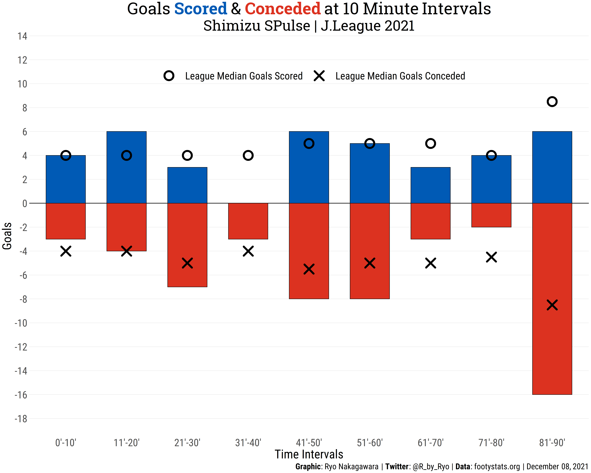
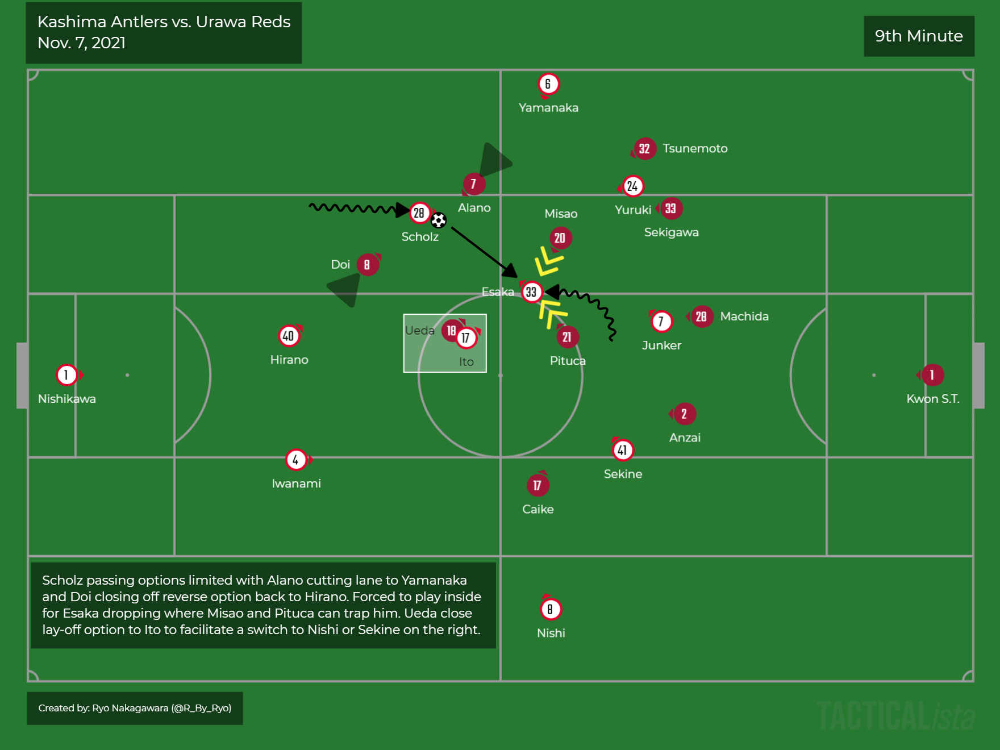
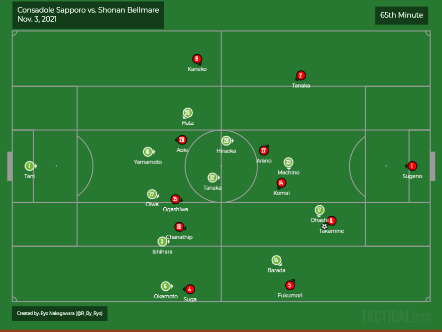
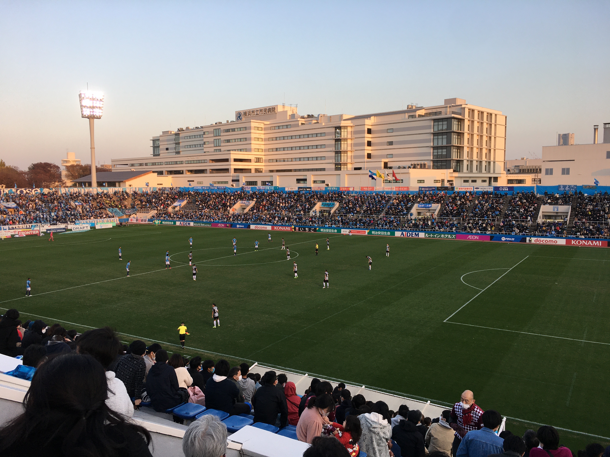

Introduction
============

The 29th season of the J.League was won, yet again, by **Kawasaki
Frontale** who have now won 4 times out of the past 5 seasons. They
still have some way to go to overcome Kashima Antler’s record of 8
league titles but this is still a monumental achievement. At the other
end of the table, due to there being no relegation last season because
of COVID having a huge impact on match day revenue from loyal fans, this
season saw 4 teams relegated as Japanese football deals with an
unprecedented 20 team league (promotion from J2 was still in effect)
along side another packed schedule that had to allow for a 1 month break
due to the Olympics. These four unlucky teams ended up being **Tokushima
Vortis**, **Oita Trinita**, **Vegalta Sendai**, and **Yokohama FC**. On
the domestic cup front, **Nagoya Grampus** won their first title in 11
years with a victory over Cerezo Osaka in the League Cup while **Urawa
Reds** won the Emperor’s Cup in a tight game against Oita Trinita. Yet
again, all J.League teams disappointed on the international front,
especially Kawasaki Frontale, as no Japanese team even got to the
semi-finals!

Unlike in the [mid-season
review](https://ryo-n7.github.io/2021-07-26-jleague-2021-midseason-review/),
I’m going to switch it up and talk more about the teams/players and **tactics** first and then dive into the **data**. It’s been a bit of a
struggle trying to balance things out from the tactical and data
perspectives, just from my Twitter interactions I get a feeling my
audience is very diverse so it’s hard to decide in what kind of “voice”
I want to write these blog posts in. But anyway…

Let’s get started!

League Table
------------

<details>
  <summary><b>Click to show R code!</b></summary>
  <pre>


``` r
# library(dplyr)
# library(knitr)
# library(kableExtra)

jleague_table_2021_cleaned <- read.csv(
  file = "https://raw.githubusercontent.com/Ryo-N7/soccer_ggplots/master/data/jleague_2021_END/jleague_table_2021_end_cleaned.csv")

jleague_kable_table <- jleague_table_2021_cleaned %>% 
  knitr::kable(format = "html", 
               caption = "J.League 2021 - Final League Table") %>% 
  kable_styling(full_width = FALSE,
                bootstrap_options = c("condensed", "responsive")) %>% 
  add_header_above(c(" ", "Result" = 4, "Goals" = 3,
                     "Expected Goals" = 3)) %>% 
  column_spec(1:2, bold = TRUE) %>% 
  row_spec(1, bold = TRUE, color = "white", background = "green") %>% 
  row_spec(2:3, bold = TRUE, color = "grey", background = "lightgreen") %>% 
  row_spec(4:16, bold = TRUE, color = "grey", background = "white") %>% 
  row_spec(17:20, color = "white", background = "red") %>% 
  add_footnote(label = "Data: FBref.com & Football-Lab.jp | Note: 4 teams relegated to return J1 to 18 teams in 2022",
               notation = "none")

jleague_kable_table
```

</pre>
</details>

<table class="table table-condensed table-responsive" style="width: auto !important; margin-left: auto; margin-right: auto;">
<caption>
J.League 2021 - Final League Table
</caption>
<thead>
<tr>
<th style="empty-cells: hide;border-bottom:hidden;" colspan="1">
</th>
<th style="border-bottom:hidden;padding-bottom:0; padding-left:3px;padding-right:3px;text-align: center; " colspan="4">

Result

</th>
<th style="border-bottom:hidden;padding-bottom:0; padding-left:3px;padding-right:3px;text-align: center; " colspan="3">

Goals

</th>
<th style="border-bottom:hidden;padding-bottom:0; padding-left:3px;padding-right:3px;text-align: center; " colspan="3">

Expected Goals

</th>
</tr>
<tr>
<th style="text-align:left;">
Team
</th>
<th style="text-align:right;">
W
</th>
<th style="text-align:right;">
D
</th>
<th style="text-align:right;">
L
</th>
<th style="text-align:right;">
Pts
</th>
<th style="text-align:right;">
GF
</th>
<th style="text-align:right;">
GA
</th>
<th style="text-align:right;">
GD
</th>
<th style="text-align:right;">
xG
</th>
<th style="text-align:right;">
xGA
</th>
<th style="text-align:right;">
xGDiff
</th>
</tr>
</thead>
<tbody>
<tr>
<td style="text-align:left;font-weight: bold;font-weight: bold;color: white !important;background-color: green !important;">
Kawasaki Frontale
</td>
<td style="text-align:right;font-weight: bold;font-weight: bold;color: white !important;background-color: green !important;">
28
</td>
<td style="text-align:right;font-weight: bold;color: white !important;background-color: green !important;">
8
</td>
<td style="text-align:right;font-weight: bold;color: white !important;background-color: green !important;">
2
</td>
<td style="text-align:right;font-weight: bold;color: white !important;background-color: green !important;">
92
</td>
<td style="text-align:right;font-weight: bold;color: white !important;background-color: green !important;">
81
</td>
<td style="text-align:right;font-weight: bold;color: white !important;background-color: green !important;">
28
</td>
<td style="text-align:right;font-weight: bold;color: white !important;background-color: green !important;">
53
</td>
<td style="text-align:right;font-weight: bold;color: white !important;background-color: green !important;">
64.98
</td>
<td style="text-align:right;font-weight: bold;color: white !important;background-color: green !important;">
35.11
</td>
<td style="text-align:right;font-weight: bold;color: white !important;background-color: green !important;">
29.87
</td>
</tr>
<tr>
<td style="text-align:left;font-weight: bold;font-weight: bold;color: grey !important;background-color: lightgreen !important;">
Yokohama F. Marinos
</td>
<td style="text-align:right;font-weight: bold;font-weight: bold;color: grey !important;background-color: lightgreen !important;">
24
</td>
<td style="text-align:right;font-weight: bold;color: grey !important;background-color: lightgreen !important;">
7
</td>
<td style="text-align:right;font-weight: bold;color: grey !important;background-color: lightgreen !important;">
7
</td>
<td style="text-align:right;font-weight: bold;color: grey !important;background-color: lightgreen !important;">
79
</td>
<td style="text-align:right;font-weight: bold;color: grey !important;background-color: lightgreen !important;">
82
</td>
<td style="text-align:right;font-weight: bold;color: grey !important;background-color: lightgreen !important;">
35
</td>
<td style="text-align:right;font-weight: bold;color: grey !important;background-color: lightgreen !important;">
47
</td>
<td style="text-align:right;font-weight: bold;color: grey !important;background-color: lightgreen !important;">
71.29
</td>
<td style="text-align:right;font-weight: bold;color: grey !important;background-color: lightgreen !important;">
44.31
</td>
<td style="text-align:right;font-weight: bold;color: grey !important;background-color: lightgreen !important;">
26.98
</td>
</tr>
<tr>
<td style="text-align:left;font-weight: bold;font-weight: bold;color: grey !important;background-color: lightgreen !important;">
Vissel Kobe
</td>
<td style="text-align:right;font-weight: bold;font-weight: bold;color: grey !important;background-color: lightgreen !important;">
21
</td>
<td style="text-align:right;font-weight: bold;color: grey !important;background-color: lightgreen !important;">
10
</td>
<td style="text-align:right;font-weight: bold;color: grey !important;background-color: lightgreen !important;">
7
</td>
<td style="text-align:right;font-weight: bold;color: grey !important;background-color: lightgreen !important;">
73
</td>
<td style="text-align:right;font-weight: bold;color: grey !important;background-color: lightgreen !important;">
62
</td>
<td style="text-align:right;font-weight: bold;color: grey !important;background-color: lightgreen !important;">
36
</td>
<td style="text-align:right;font-weight: bold;color: grey !important;background-color: lightgreen !important;">
26
</td>
<td style="text-align:right;font-weight: bold;color: grey !important;background-color: lightgreen !important;">
50.65
</td>
<td style="text-align:right;font-weight: bold;color: grey !important;background-color: lightgreen !important;">
43.40
</td>
<td style="text-align:right;font-weight: bold;color: grey !important;background-color: lightgreen !important;">
7.25
</td>
</tr>
<tr>
<td style="text-align:left;font-weight: bold;font-weight: bold;color: grey !important;background-color: white !important;">
Kashima Antlers
</td>
<td style="text-align:right;font-weight: bold;font-weight: bold;color: grey !important;background-color: white !important;">
21
</td>
<td style="text-align:right;font-weight: bold;color: grey !important;background-color: white !important;">
6
</td>
<td style="text-align:right;font-weight: bold;color: grey !important;background-color: white !important;">
11
</td>
<td style="text-align:right;font-weight: bold;color: grey !important;background-color: white !important;">
69
</td>
<td style="text-align:right;font-weight: bold;color: grey !important;background-color: white !important;">
62
</td>
<td style="text-align:right;font-weight: bold;color: grey !important;background-color: white !important;">
36
</td>
<td style="text-align:right;font-weight: bold;color: grey !important;background-color: white !important;">
26
</td>
<td style="text-align:right;font-weight: bold;color: grey !important;background-color: white !important;">
60.23
</td>
<td style="text-align:right;font-weight: bold;color: grey !important;background-color: white !important;">
36.59
</td>
<td style="text-align:right;font-weight: bold;color: grey !important;background-color: white !important;">
23.64
</td>
</tr>
<tr>
<td style="text-align:left;font-weight: bold;font-weight: bold;color: grey !important;background-color: white !important;">
Nagoya Grampus
</td>
<td style="text-align:right;font-weight: bold;font-weight: bold;color: grey !important;background-color: white !important;">
19
</td>
<td style="text-align:right;font-weight: bold;color: grey !important;background-color: white !important;">
9
</td>
<td style="text-align:right;font-weight: bold;color: grey !important;background-color: white !important;">
10
</td>
<td style="text-align:right;font-weight: bold;color: grey !important;background-color: white !important;">
66
</td>
<td style="text-align:right;font-weight: bold;color: grey !important;background-color: white !important;">
44
</td>
<td style="text-align:right;font-weight: bold;color: grey !important;background-color: white !important;">
30
</td>
<td style="text-align:right;font-weight: bold;color: grey !important;background-color: white !important;">
14
</td>
<td style="text-align:right;font-weight: bold;color: grey !important;background-color: white !important;">
38.08
</td>
<td style="text-align:right;font-weight: bold;color: grey !important;background-color: white !important;">
36.10
</td>
<td style="text-align:right;font-weight: bold;color: grey !important;background-color: white !important;">
1.98
</td>
</tr>
<tr>
<td style="text-align:left;font-weight: bold;font-weight: bold;color: grey !important;background-color: white !important;">
Urawa Reds
</td>
<td style="text-align:right;font-weight: bold;font-weight: bold;color: grey !important;background-color: white !important;">
18
</td>
<td style="text-align:right;font-weight: bold;color: grey !important;background-color: white !important;">
9
</td>
<td style="text-align:right;font-weight: bold;color: grey !important;background-color: white !important;">
10
</td>
<td style="text-align:right;font-weight: bold;color: grey !important;background-color: white !important;">
63
</td>
<td style="text-align:right;font-weight: bold;color: grey !important;background-color: white !important;">
45
</td>
<td style="text-align:right;font-weight: bold;color: grey !important;background-color: white !important;">
38
</td>
<td style="text-align:right;font-weight: bold;color: grey !important;background-color: white !important;">
7
</td>
<td style="text-align:right;font-weight: bold;color: grey !important;background-color: white !important;">
48.79
</td>
<td style="text-align:right;font-weight: bold;color: grey !important;background-color: white !important;">
44.80
</td>
<td style="text-align:right;font-weight: bold;color: grey !important;background-color: white !important;">
3.99
</td>
</tr>
<tr>
<td style="text-align:left;font-weight: bold;font-weight: bold;color: grey !important;background-color: white !important;">
Sagan Tosu
</td>
<td style="text-align:right;font-weight: bold;font-weight: bold;color: grey !important;background-color: white !important;">
16
</td>
<td style="text-align:right;font-weight: bold;color: grey !important;background-color: white !important;">
11
</td>
<td style="text-align:right;font-weight: bold;color: grey !important;background-color: white !important;">
11
</td>
<td style="text-align:right;font-weight: bold;color: grey !important;background-color: white !important;">
59
</td>
<td style="text-align:right;font-weight: bold;color: grey !important;background-color: white !important;">
43
</td>
<td style="text-align:right;font-weight: bold;color: grey !important;background-color: white !important;">
35
</td>
<td style="text-align:right;font-weight: bold;color: grey !important;background-color: white !important;">
8
</td>
<td style="text-align:right;font-weight: bold;color: grey !important;background-color: white !important;">
44.16
</td>
<td style="text-align:right;font-weight: bold;color: grey !important;background-color: white !important;">
43.66
</td>
<td style="text-align:right;font-weight: bold;color: grey !important;background-color: white !important;">
0.50
</td>
</tr>
<tr>
<td style="text-align:left;font-weight: bold;font-weight: bold;color: grey !important;background-color: white !important;">
Avispa Fukuoka
</td>
<td style="text-align:right;font-weight: bold;font-weight: bold;color: grey !important;background-color: white !important;">
14
</td>
<td style="text-align:right;font-weight: bold;color: grey !important;background-color: white !important;">
12
</td>
<td style="text-align:right;font-weight: bold;color: grey !important;background-color: white !important;">
12
</td>
<td style="text-align:right;font-weight: bold;color: grey !important;background-color: white !important;">
54
</td>
<td style="text-align:right;font-weight: bold;color: grey !important;background-color: white !important;">
42
</td>
<td style="text-align:right;font-weight: bold;color: grey !important;background-color: white !important;">
37
</td>
<td style="text-align:right;font-weight: bold;color: grey !important;background-color: white !important;">
5
</td>
<td style="text-align:right;font-weight: bold;color: grey !important;background-color: white !important;">
42.75
</td>
<td style="text-align:right;font-weight: bold;color: grey !important;background-color: white !important;">
41.76
</td>
<td style="text-align:right;font-weight: bold;color: grey !important;background-color: white !important;">
0.99
</td>
</tr>
<tr>
<td style="text-align:left;font-weight: bold;font-weight: bold;color: grey !important;background-color: white !important;">
FC Tokyo
</td>
<td style="text-align:right;font-weight: bold;font-weight: bold;color: grey !important;background-color: white !important;">
15
</td>
<td style="text-align:right;font-weight: bold;color: grey !important;background-color: white !important;">
8
</td>
<td style="text-align:right;font-weight: bold;color: grey !important;background-color: white !important;">
15
</td>
<td style="text-align:right;font-weight: bold;color: grey !important;background-color: white !important;">
53
</td>
<td style="text-align:right;font-weight: bold;color: grey !important;background-color: white !important;">
49
</td>
<td style="text-align:right;font-weight: bold;color: grey !important;background-color: white !important;">
53
</td>
<td style="text-align:right;font-weight: bold;color: grey !important;background-color: white !important;">
-4
</td>
<td style="text-align:right;font-weight: bold;color: grey !important;background-color: white !important;">
47.16
</td>
<td style="text-align:right;font-weight: bold;color: grey !important;background-color: white !important;">
49.67
</td>
<td style="text-align:right;font-weight: bold;color: grey !important;background-color: white !important;">
-2.51
</td>
</tr>
<tr>
<td style="text-align:left;font-weight: bold;font-weight: bold;color: grey !important;background-color: white !important;">
Consadole Sapporo
</td>
<td style="text-align:right;font-weight: bold;font-weight: bold;color: grey !important;background-color: white !important;">
14
</td>
<td style="text-align:right;font-weight: bold;color: grey !important;background-color: white !important;">
9
</td>
<td style="text-align:right;font-weight: bold;color: grey !important;background-color: white !important;">
15
</td>
<td style="text-align:right;font-weight: bold;color: grey !important;background-color: white !important;">
51
</td>
<td style="text-align:right;font-weight: bold;color: grey !important;background-color: white !important;">
48
</td>
<td style="text-align:right;font-weight: bold;color: grey !important;background-color: white !important;">
50
</td>
<td style="text-align:right;font-weight: bold;color: grey !important;background-color: white !important;">
-2
</td>
<td style="text-align:right;font-weight: bold;color: grey !important;background-color: white !important;">
58.14
</td>
<td style="text-align:right;font-weight: bold;color: grey !important;background-color: white !important;">
54.00
</td>
<td style="text-align:right;font-weight: bold;color: grey !important;background-color: white !important;">
4.14
</td>
</tr>
<tr>
<td style="text-align:left;font-weight: bold;font-weight: bold;color: grey !important;background-color: white !important;">
Sanfrecce Hiroshima
</td>
<td style="text-align:right;font-weight: bold;font-weight: bold;color: grey !important;background-color: white !important;">
12
</td>
<td style="text-align:right;font-weight: bold;color: grey !important;background-color: white !important;">
13
</td>
<td style="text-align:right;font-weight: bold;color: grey !important;background-color: white !important;">
13
</td>
<td style="text-align:right;font-weight: bold;color: grey !important;background-color: white !important;">
49
</td>
<td style="text-align:right;font-weight: bold;color: grey !important;background-color: white !important;">
44
</td>
<td style="text-align:right;font-weight: bold;color: grey !important;background-color: white !important;">
42
</td>
<td style="text-align:right;font-weight: bold;color: grey !important;background-color: white !important;">
2
</td>
<td style="text-align:right;font-weight: bold;color: grey !important;background-color: white !important;">
48.72
</td>
<td style="text-align:right;font-weight: bold;color: grey !important;background-color: white !important;">
43.89
</td>
<td style="text-align:right;font-weight: bold;color: grey !important;background-color: white !important;">
4.83
</td>
</tr>
<tr>
<td style="text-align:left;font-weight: bold;font-weight: bold;color: grey !important;background-color: white !important;">
Cerezo Osaka
</td>
<td style="text-align:right;font-weight: bold;font-weight: bold;color: grey !important;background-color: white !important;">
13
</td>
<td style="text-align:right;font-weight: bold;color: grey !important;background-color: white !important;">
9
</td>
<td style="text-align:right;font-weight: bold;color: grey !important;background-color: white !important;">
16
</td>
<td style="text-align:right;font-weight: bold;color: grey !important;background-color: white !important;">
48
</td>
<td style="text-align:right;font-weight: bold;color: grey !important;background-color: white !important;">
47
</td>
<td style="text-align:right;font-weight: bold;color: grey !important;background-color: white !important;">
51
</td>
<td style="text-align:right;font-weight: bold;color: grey !important;background-color: white !important;">
-4
</td>
<td style="text-align:right;font-weight: bold;color: grey !important;background-color: white !important;">
54.45
</td>
<td style="text-align:right;font-weight: bold;color: grey !important;background-color: white !important;">
49.48
</td>
<td style="text-align:right;font-weight: bold;color: grey !important;background-color: white !important;">
4.97
</td>
</tr>
<tr>
<td style="text-align:left;font-weight: bold;font-weight: bold;color: grey !important;background-color: white !important;">
Gamba Osaka
</td>
<td style="text-align:right;font-weight: bold;font-weight: bold;color: grey !important;background-color: white !important;">
12
</td>
<td style="text-align:right;font-weight: bold;color: grey !important;background-color: white !important;">
8
</td>
<td style="text-align:right;font-weight: bold;color: grey !important;background-color: white !important;">
18
</td>
<td style="text-align:right;font-weight: bold;color: grey !important;background-color: white !important;">
44
</td>
<td style="text-align:right;font-weight: bold;color: grey !important;background-color: white !important;">
33
</td>
<td style="text-align:right;font-weight: bold;color: grey !important;background-color: white !important;">
49
</td>
<td style="text-align:right;font-weight: bold;color: grey !important;background-color: white !important;">
-16
</td>
<td style="text-align:right;font-weight: bold;color: grey !important;background-color: white !important;">
44.12
</td>
<td style="text-align:right;font-weight: bold;color: grey !important;background-color: white !important;">
62.59
</td>
<td style="text-align:right;font-weight: bold;color: grey !important;background-color: white !important;">
-18.47
</td>
</tr>
<tr>
<td style="text-align:left;font-weight: bold;font-weight: bold;color: grey !important;background-color: white !important;">
Shimizu S-Pulse
</td>
<td style="text-align:right;font-weight: bold;font-weight: bold;color: grey !important;background-color: white !important;">
10
</td>
<td style="text-align:right;font-weight: bold;color: grey !important;background-color: white !important;">
12
</td>
<td style="text-align:right;font-weight: bold;color: grey !important;background-color: white !important;">
16
</td>
<td style="text-align:right;font-weight: bold;color: grey !important;background-color: white !important;">
42
</td>
<td style="text-align:right;font-weight: bold;color: grey !important;background-color: white !important;">
37
</td>
<td style="text-align:right;font-weight: bold;color: grey !important;background-color: white !important;">
54
</td>
<td style="text-align:right;font-weight: bold;color: grey !important;background-color: white !important;">
-17
</td>
<td style="text-align:right;font-weight: bold;color: grey !important;background-color: white !important;">
42.52
</td>
<td style="text-align:right;font-weight: bold;color: grey !important;background-color: white !important;">
43.13
</td>
<td style="text-align:right;font-weight: bold;color: grey !important;background-color: white !important;">
-0.61
</td>
</tr>
<tr>
<td style="text-align:left;font-weight: bold;font-weight: bold;color: grey !important;background-color: white !important;">
Kashiwa Reysol
</td>
<td style="text-align:right;font-weight: bold;font-weight: bold;color: grey !important;background-color: white !important;">
12
</td>
<td style="text-align:right;font-weight: bold;color: grey !important;background-color: white !important;">
5
</td>
<td style="text-align:right;font-weight: bold;color: grey !important;background-color: white !important;">
21
</td>
<td style="text-align:right;font-weight: bold;color: grey !important;background-color: white !important;">
41
</td>
<td style="text-align:right;font-weight: bold;color: grey !important;background-color: white !important;">
37
</td>
<td style="text-align:right;font-weight: bold;color: grey !important;background-color: white !important;">
56
</td>
<td style="text-align:right;font-weight: bold;color: grey !important;background-color: white !important;">
-19
</td>
<td style="text-align:right;font-weight: bold;color: grey !important;background-color: white !important;">
49.17
</td>
<td style="text-align:right;font-weight: bold;color: grey !important;background-color: white !important;">
46.02
</td>
<td style="text-align:right;font-weight: bold;color: grey !important;background-color: white !important;">
3.15
</td>
</tr>
<tr>
<td style="text-align:left;font-weight: bold;font-weight: bold;color: grey !important;background-color: white !important;">
Shonan Bellmare
</td>
<td style="text-align:right;font-weight: bold;font-weight: bold;color: grey !important;background-color: white !important;">
6
</td>
<td style="text-align:right;font-weight: bold;color: grey !important;background-color: white !important;">
16
</td>
<td style="text-align:right;font-weight: bold;color: grey !important;background-color: white !important;">
15
</td>
<td style="text-align:right;font-weight: bold;color: grey !important;background-color: white !important;">
37
</td>
<td style="text-align:right;font-weight: bold;color: grey !important;background-color: white !important;">
36
</td>
<td style="text-align:right;font-weight: bold;color: grey !important;background-color: white !important;">
41
</td>
<td style="text-align:right;font-weight: bold;color: grey !important;background-color: white !important;">
-5
</td>
<td style="text-align:right;font-weight: bold;color: grey !important;background-color: white !important;">
42.94
</td>
<td style="text-align:right;font-weight: bold;color: grey !important;background-color: white !important;">
46.09
</td>
<td style="text-align:right;font-weight: bold;color: grey !important;background-color: white !important;">
-3.15
</td>
</tr>
<tr>
<td style="text-align:left;font-weight: bold;color: white !important;background-color: red !important;">
Tokushima Vortis
</td>
<td style="text-align:right;font-weight: bold;color: white !important;background-color: red !important;">
10
</td>
<td style="text-align:right;color: white !important;background-color: red !important;">
6
</td>
<td style="text-align:right;color: white !important;background-color: red !important;">
22
</td>
<td style="text-align:right;color: white !important;background-color: red !important;">
36
</td>
<td style="text-align:right;color: white !important;background-color: red !important;">
34
</td>
<td style="text-align:right;color: white !important;background-color: red !important;">
55
</td>
<td style="text-align:right;color: white !important;background-color: red !important;">
-21
</td>
<td style="text-align:right;color: white !important;background-color: red !important;">
37.24
</td>
<td style="text-align:right;color: white !important;background-color: red !important;">
46.74
</td>
<td style="text-align:right;color: white !important;background-color: red !important;">
-9.50
</td>
</tr>
<tr>
<td style="text-align:left;font-weight: bold;color: white !important;background-color: red !important;">
Oita Trinita
</td>
<td style="text-align:right;font-weight: bold;color: white !important;background-color: red !important;">
9
</td>
<td style="text-align:right;color: white !important;background-color: red !important;">
8
</td>
<td style="text-align:right;color: white !important;background-color: red !important;">
21
</td>
<td style="text-align:right;color: white !important;background-color: red !important;">
35
</td>
<td style="text-align:right;color: white !important;background-color: red !important;">
31
</td>
<td style="text-align:right;color: white !important;background-color: red !important;">
55
</td>
<td style="text-align:right;color: white !important;background-color: red !important;">
-24
</td>
<td style="text-align:right;color: white !important;background-color: red !important;">
35.72
</td>
<td style="text-align:right;color: white !important;background-color: red !important;">
54.99
</td>
<td style="text-align:right;color: white !important;background-color: red !important;">
-19.27
</td>
</tr>
<tr>
<td style="text-align:left;font-weight: bold;color: white !important;background-color: red !important;">
Vegalta Sendai
</td>
<td style="text-align:right;font-weight: bold;color: white !important;background-color: red !important;">
5
</td>
<td style="text-align:right;color: white !important;background-color: red !important;">
13
</td>
<td style="text-align:right;color: white !important;background-color: red !important;">
20
</td>
<td style="text-align:right;color: white !important;background-color: red !important;">
28
</td>
<td style="text-align:right;color: white !important;background-color: red !important;">
31
</td>
<td style="text-align:right;color: white !important;background-color: red !important;">
62
</td>
<td style="text-align:right;color: white !important;background-color: red !important;">
-31
</td>
<td style="text-align:right;color: white !important;background-color: red !important;">
36.90
</td>
<td style="text-align:right;color: white !important;background-color: red !important;">
63.84
</td>
<td style="text-align:right;color: white !important;background-color: red !important;">
-26.94
</td>
</tr>
<tr>
<td style="text-align:left;font-weight: bold;color: white !important;background-color: red !important;">
Yokohama FC
</td>
<td style="text-align:right;font-weight: bold;color: white !important;background-color: red !important;">
6
</td>
<td style="text-align:right;color: white !important;background-color: red !important;">
9
</td>
<td style="text-align:right;color: white !important;background-color: red !important;">
23
</td>
<td style="text-align:right;color: white !important;background-color: red !important;">
27
</td>
<td style="text-align:right;color: white !important;background-color: red !important;">
32
</td>
<td style="text-align:right;color: white !important;background-color: red !important;">
77
</td>
<td style="text-align:right;color: white !important;background-color: red !important;">
-45
</td>
<td style="text-align:right;color: white !important;background-color: red !important;">
35.11
</td>
<td style="text-align:right;color: white !important;background-color: red !important;">
66.88
</td>
<td style="text-align:right;color: white !important;background-color: red !important;">
-31.77
</td>
</tr>
</tbody>
<tfoot>
<tr>
<td style="padding: 0; border:0;" colspan="100%">
<sup></sup> Data: FBref.com & Football-Lab.jp \| Note: 4 teams relegated
to return J1 to 18 teams in 2022
</td>
</tr>
</tfoot>
</table>

For this blog post I would ideally use data from WyScout, InStat, etc.
to take advantage of their detailed stats (expected goals, progressive
passes, etc.) especially to look at player-level data and match that up
with my own notes from watching the games. Unfortunately, all of that
costs *$$$*. I do all of this as a hobby and I can’t justify the expense
(not just the $ but also the time to make full use of purchasing an
account). So, I am only using data from free websites which do not have
as much detail. Thankfully, I have been able to find a bit more on a
player and team level from a variety of new sources this season. Once
again, a big *arigato* to websites like
[Transfermarkt](https://www.transfermarkt.com/),
[Sporteria](https://sporteria.jp/),
[Football-Lab](https://www.football-lab.jp/),
[FBref](https://fbref.com/en/), and more! As always, you can always
check **where** I got the **data** from my taking a look at the bottom
corners of any viz.

Going forward, I’ll be relying heavily on the
[TACTICALista](https://app.tacticalista.com/#/) app (NOTE: only works on
Chrome browsers) to create tactics diagrams/animations. You’ll see a lot
of them in the team summary sections and I urge you to check it out,
it’s really great. For those of you familiar with [my previous
work](https://ryo-n7.github.io/2018-06-29-visualize-worldcup/), I would've liked to remain on brand and create soccer-related diagrams/animations with {ggplot2} and {gganimate}
but… that would’ve taken a loooong time so I opted to use a program
that’s actually built for this kind of thing.

I’ll be very happy if any J.League bloggers (as long as there’s no pay
wall or anything) want to use any of the viz I’ve made in this blog post
with proper credit along with a link to their work (as I’d love to read
more English J.League content). Some of the viz can be created for J2
and J3 teams as well so please don’t hesitate to reach out if you want
me to do so!

Performance Change: Points
--------------------------

The teams with the largest points increase were **Yokohama Marinos** and
Vissel Kobe. Marinos’ 2020 went rather horribly, as their famed press
kept getting broken way too easily and their defenders were left
vulnerable on the counter (very much like Manchester City in the
2019/2020 season) on top of the condensed schedule taking its toll on
the squad.

**Vissel Kobe** on the other hand had sneaked into the Asian Champions
League in 2020 due to winning the Emperor’s Cup in 2019. Going toward
the final few months of the season it really did seem that Kobe had
absolutely no interest in the league and were just making preparations
for the condensed group stage and knock-out stage of the Champions
League at the end of the 2020 season.

It’s quite notable that **Kawasaki Frontale** improved upon their
brilliant 2020 season, with the obvious caveat that there were 4 more
games to play in 2021. Nevertheless, it is important to note that by
Matchday 34 this season, Kawasaki had already accumulated 1 more point
than their 2020 league total of 83 points!

Other teams that notably dropped a significant amount of points compared
to last year were the two Osaka clubs, **Gamba** and **Cerezo**. I’ve
talked last year of how Gamba’s results were unsustainable and their
actual mediocre-to-just-OK performances seem to have caught up with them
this year. For Cerezo, a rather unnecessary style reverse from Lotina
back to Levir Culpi (returning for a 4th time in the dugout which is
worth a whole blog post in of itself) as the Cerezo front office
disagreed with the playing style of Lotina. Which really makes me
question the Cerezo front office’s decision to hire Lotina in the first
place, it’s not like they didn’t know his style of play!

**Urawa**’s resurgence under Ricardo Rodriguez can be summed pretty
succinctly by their 17 point increase. To contextualize this better, as
all teams played 4 more games this season, Urawa went from 1.3 Points
per Game in 2020 to 1.6 Points per Game in 2021. In any case, the Reds
jumped up the table to 6th (and fighting for 3rd for a good chunk of the
season) from a mediocre mid-table position in 2020.


But that’s enough about last year…

Discussion Points from the Mid-season Review
============================================

At the end of the [mid-season
review](https://ryo-n7.github.io/2021-12-20-jleague-2021-midseason-review/)
I threw out a couple of discussion points. Now that we’re at the end of
the season, I can go back and talk about them! What happened? Did things
work out? Find out below!

-   Can Kawasaki keep up their form to win a 2nd straight league title,
    if not remain undefeated?

**Short version**: Didn’t quite remain undefeated but ran out as
comfortable winners yet again.

**Long version**: Even before Ao Tanaka and Kaoru Mitoma went there was
quite a bit of uneasiness among Frontale fans who, while not being able
to put a finger on exactly why, didn’t feel as though Kawasaki were
dominating the match as they did in the 2020 season. Even though the xG
charts don’t match up with my recollection of their games, it personally
felt like to me that they were “grinding” out wins a lot more this
season.

-   Can Gamba Osaka dig themselves out of the hole they created
    themselves?

**Short version**: Yes.

**Long version**: It wasn’t pretty but they did manage it. Gamba started
scoring more goals in line with the quality of shots they were creating
(which wasn’t much but still) which helped a very mediocre defense that
stayed mediocre for most of the season. Whatever the performances, the
important thing is they **did** survive and with Katanosaka coming in as
the new manager, Gamba will likely improve from here on out as their
squad (when fit) is more than capable of being in the upper half of the
table.

-   Despite the losses in key personnel, can Vissel Kobe and Yokohama F.
    Marinos provide Frontale with some kind of challenge for the title
    race?

**Short version**: No and no.

**Long version**: Marinos not only lost Ado Onaiwu but then lost
Hatanaka for the last 11 games of the season. This meant some shuffling
around on top of the changes that Kevin Muscat wanted to implement,
which ultimately didn’t pan out at all as Marinos sputtered in the last
few games of the season. On the other hand, Kobe did a really good job
integrating Osako and Muto into the team to replace Furuhashi’s output.
Even still, the points gap was far too big and some poor losses to FC
Tokyo, Kashiwa Reysol, and Marinos leaves Kobe with a few more things to
tweak if they want to challenge for the title next season.

-   Will Nagoya be able to find a way to score more goals? (**Update**:
    Can new striker Jakub Świerczok hit the ground running?)

**Short version**: Yes.

**Long version**: Not only did Świerczok score 7 goals in 9 starts (14
total league appearances) but also his presence allowed other players to
score as well. You can see Nagoya’s xG and goals numbers shoot up from
when he got his fitness up to speed to start games consistently. More
details will follow in the Nagoya section.

-   Can Kashiwa move on from the losses of Michael Olunga and Ataru
    Esaka by fully integrating their new Brazilian imports?

**Short version** No.

**Long version**: No, they still managed to create a good amount of
chances per game to offset their rather bad defense but they also had
the rub of the green in quite a few games in my opinion. Their new
Brazilian imports were very hit and miss while Matheus Savio was rather
disappointing after returning from loan.

In the next section I’ll go much deeper into some of the teams that I
found interesting this season. Unfortunately, I couldn’t go in-depth on
every team so only about 13 teams are covered here (and two of the
promoted sides have much smaller sections). I’ll be focusing more on the
teams that I couldn’t go into depth in the data viz sections instead.

Teams & Players Report
======================

Kawasaki Frontale
-----------------

Another year, another title! Kawasaki’s 4 league title in the past 5
years means that they are now the most dominant team over any 5 year
period in the history of the J.League. Their **92 points** is a record
in the J.League, although it should be noted that this is in an
unprecedented 20 team J.League season, meaning there were 38 games
played. As I mentioned previously, after Matchday 34 in October, they
had already picked up 84 points, 1 point more than their total in the 34
game 2020 season!

I feel that in lots of games, even when Ao Tanaka and Kaoru Mitoma were
still around, that they weren’t necessarily poor but struggling
especially in attack. But the fact that they have such decisive players,
the individual quality of **Damiao**’s finishing, **Jesiel**’s 1v1
defending, **Joao Schmidt**/**Kento Tachibanada**’s awareness and
anticipation, etc. has gotten them over the line in many games this
season where the scoreline may have flattered them. They are just a
juggernaut that just keeps grinding and grinding through opponents. Even
though it did feel like they struggled, overall they have been able to
continuously create good chances while not letting the opponent carve
out many quality chances. Well, until the final few games of the season
but that was after their title victory was already confirmed.


Cup competitions is where things went very awry for Frontale as they
were dumped out of all cup competitions… all without losing a game in
normal time! The big challenge for Frontale this season was a serious
run in the Asian Champions League, a competition where despite their
domestic dominance, they have never really gotten to grips with in the
past. This year proved so again as they were dumped out by Ulsan
Hyundai. Injuries to key players such as Reo Hatate, Shogo Taniguchi,
and Ryota Oshima hit at the worst time but with **Kaoru Mitoma** and
**Ao Tanaka**’s departures still fresh on everybody’s mind, the
narrative shifted toward the latter rather than the former. What made
things especially worse was this all happened right after getting dumped
out in the League Cup on away goals just a week prior. In the past
month, hopes of a double were dashed as Kawasaki Frontale completely
forgot their shooting boots and let Oita Trinita steal a monumental
result to reach the final of the Emperor’s Cup on penalties.

This season most of Kawasaki’s goals came from “crossing” game
situations with a league leading 26 goals (8 more than the next best
team) followed by goals from “short passes” (19 goals, tied for first in
the league).


The above makes sense when you realize that Kawasaki’s game plan is to
get the ball into the “pockets” (the half-space areas inside the box)
for crosses and cut-backs to create and score from high quality chances.
As they are also one of the best teams playing quick combinations in
tight spaces through the midfield and even against packed defenses in
the box, Kawasaki are able to get into these positions frequently.


A more direct approach is something we saw in the second half of the
season as Frontale may instead play a through ball or long pass for
**Marcinho** (who has been a pretty good replacement for Kaoru Mitoma,
even if a bit one-dimensional) to chase and dribble. This can be done by
aiming for gaps left between defenders as Kawasaki’s Full Backs or
midfielders pull wide to drag opponent defenders toward the sideline. In
the below example Marcinho does both!


Once they have players in and around the box to lay siege to it,
Frontale players create space to not only pass in triangles in wide
areas but also spread the ball from half-space to half-space.


The midfielders, wingers, full backs, and the ball-near midfielders all
rotate around as Frontale patiently seek out optimal positions inside
the box for a cut-back.


Or for crosses into the far post or through balls from the edges of the
box inside the area for late midfield runners.


There’s been quite a lot of turnover in the squad, especially in
midfield. **Joao Schmidt** had been a fantastic addition to the midfield
void left by Hidemasa Morita’s departure to Santa Clara in Portugal.
However, he has completely disappeared from the squad since September
and **Kento Tachibanada**, who had only played a minor squad role up to
that point (notably playing Right Back a few times to give Miki Yamane a
rest), took over with aplomb. What was very surprising to most was how
great he looked, almost as if it was he who had been playing in the
single pivot role all season and not **Joao Schmidt** up to that point.
He is fantastic at recovering loose balls and starting attacks or being
more pro-active and getting involved in pass interceptions and tackles
as well. The other new signings in midfield were curiously absent in the
second half of the season as both **Koki Tsukagawa** and **Kazuki
Kozuka** barely got any minutes. It was rather surprising to see manager
**Toru Oniki** preferring to keep playing Daiya Tono or Akihiro Ienaga
in the box-to-box roles in Frontale’s midfield three instead.

Of course, the main star of the midfield (with apologies to the
perennially overlooked **Yasuto Wakizaka**…) is **Reo Hatate**, heavily
linked to Ange Postecoglu’s Celtic FC. To make things very clear, his
main position is in midfield (although he started off his career as a
winger) and **not** as a Left Back. It was mainly due to Kyohei
Noborizato’s injury at the tail end of the 2020 season and the beginning
of the 2021 season that he was required to play there. Reo Hatate is a
versatile box-to-box midfielder, able to make smart runs into the box
and position himself well in the half-spaces to progress the ball from
midfield and into the final 3rd or penalty box. When in-and-around the
box his good ball control in tight areas allows him to combine with the
strikers and wingers to create chances while his 2.11 shots per 90 and
chipping in with 5 league goals also points to his abilities as a direct
goal threat.


Hatate has also showcased a lot of great touches, smart use of his body
to protect the ball, and dribbling which I can’t really do justice with
these diagrams/animations so you’ll just have to watch actual footage of
him. On the defensive side of things, he is very active defensively as
part of a midfield unit that is probably the best team at
counter-pressing in the league.


In regards to chance-creation, Right Back **Miki Yamane** got 12 assists
this season (most in the league), doubling his number from the 2020
season. I talked in the 2020 season about [how he was the best low-key
transfers in the J.League on
Twitter](https://twitter.com/R_by_Ryo/status/1307980202832584704) but
this season he’s turned that up by another notch into Trent
Alexander-Arnold territory (while still playing as a more traditional
attacking Full Back)! His performances in the past two seasons have
earned him a deserved call up to the national team.

Another special player is veteran **Akihiro Ienaga**, whose wicked left
foot from the Right Wing has created or scored many goals throughout his
time at Kawasaki, where he has played a part in all four of Kawasaki
Frontale’s league titles. Ienaga had an interesting quirk at times where
he would drift over to the complete opposite wing to create overloads
and use his underrated ability to play with his back to goal to progress
the ball into the final 3rd when Frontale were having problems in
midfield. Unfortunately, as fit as he is, he is also 35 years old now
which leads me into talking about squad turnover.

While **Reo Hatate**’s seemingly inevitable exit puts a spanner in the
works, its not all bad as long-term casualty of the treatment table,
**Ryota Oshima** may just be able to fill in provided he can get back to
his best. He looked a bit shaky after coming back after such a long time
out but he slowly started to improve his form in the last few games of
the season. Also, players like **Koki Tsukagawa** and **Kazuki Kozuka**
still exist despite their disappearing act in the 2nd half of the season
while **Daiya Tono** might be able to emulate Reo Hatate’s career path
by being converted full time into a midfielder from a winger (Tono has
appeared in midfield a few times this season already).

Out on the wings, **Ten Miyagi** and the aforementioned Tono can
continue to gobble up more minutes alongside **Marcinho** while there is
also the question of where the returning **Taisei Miyashiro** will fit
in after a very good campaign with relegated side Tokushima Vortis (7
goals and 2 assists playing out wide or as a striker). The need to fit
in Miyashiro becomes all the more apparent with only **Kei Chinen** able
to fill in as the striker when **Leandro Damiao** is out as **Yu
Kobayashi** has been mainly playing out wide on the right in his
super-sub appearances this season.

An unfortunately big gaping hole is still in defense as **Jesiel** has
been struck down with a major injury. With **Shogo Taniguchi**, **Kazuya
Yamamura**, **Kyohei Noborizato**, and **Shintaro Kurumaya** are all
close to or over 30 there will be a need for some reinforcement
especially as Reo Hatate might not be around to provide cover in the
Full Back positions as well.

Another triumphant league title for Kawasaki Frontale but they will hope
to dispel their cup competition curse in 2022.


Vissel Kobe
-----------

After giving up on the league in the 2020 season to fully focus on their
maiden Asian Champions League campaign, Vissel Kobe surprised many this
season by keeping caretaker manager **Atsuhiro Miura** permanently and
he has finally been able to find a way to incorporate Andres Iniesta in
a way that tries to mitigate his lack of mobility. However, the main
star of this side up to the halfway point of the season was **Kyogo
Furuhashi**, who continued his fine form in 2020 (12 goals and 5
assists) into 2021 by tallying up 15 goals and 2 assists in just 20
games. He took 82 shots, which amounted to around 4.21 shots per 90. At
the end of the season, this tally still left him as the 6th best and
tied 3rd best in the league for these metrics despite only playing half
a season!

I don’t want to keep repeating all the superlatives I’ve showered him in
the past so please refer to the [mid-season
review](https://ryo-n7.github.io/2021-07-26-jleague-2021-midseason-review/)
for a more detailed analysis of him as well as **Ryuho Kikuchi** (who
was probably my favorite defender in the league this season).


Vissel Kobe started the first few months of the season without **Andres
Iniesta** and looked quite the better for it, lining up in a functional
4-4-2/4-2-3-1 with Furuhashi generally leading the line. As Iniesta
worked himself back into fitness however, it became apparent something
needed to be done as… well, there really wasn’t a way of **not** playing
him for various reasons. After some trial-and-error including him
playing as a \#10 in a 4-2-3-1, what manager Atsuhiro Miura stumbled
upon was the **4-4-2 diamond**!

How do Vissel Kobe play?

-   **Andres Iniesta** at the tip of the diamond.
-   **Sergi Samper** at the base (with Yamaguchi and Leo Osaki as
    rotation options), drops between Center Backs in the build-up and
    allow Full Backs to push high and wide.
-   Two strikers of different profiles: Target man that can also drop to
    receive, the other to make movements behind the defense to stretch
    the gap between the opponent defensive and midfield lines. First
    performed by **Kyogo Furuhashi** and **Douglas**, in the latter half
    of the season these roles were performed very well by **Yuya Osako**
    and **Yoshinori Muto**.
-   Cover all 5 lanes of the pitch with various rotating players:
    Strikers, Midfielders, or Full Backs.
-   Quick 1-2s/Wall passes to escape pressure and create space.


There was a short period between **Kyogo Furuhashi** leaving and **Yuya
Osako** and **Yoshinori Muto** getting back to fitness/integrating
(around August-September) where Kobe looked very flat. In years prior
Kobe had been accused of being very much a “possession for possession’s
sake” team and unfortunately that reared its ugly head again in this
period. Everybody wanted to receive to feet, there was only one slow
tempo, and due to a variety of reasons Iniesta was playing deeper which
mean that Kobe were also quite vulnerable on counterattacks during this
time, among other defensive problems. In these matches only **Gotoku
Sakai** and **Ryo Hatsuse**, the Full Backs, were the ones trying to
make behind the defense and it just wasn’t great to watch.

However, with **Yuya Osako** and **Yoshinori Muto** fully integrated
into the team by October, this changed significantly with more vertical
and horizontal movements by the strikers accompanied by Iniesta playing
at the tip more often than not. The fantastic ability of Muto and Osako
to settle long balls, beat players physically, and hold-up the ball with
their backs to goal allowed Kobe’s midfielders to push up to support. As
a result Kobe were able to gain a foothold in the opponent’s half and
then start spreading wide or switch field of play and advance into the
final 3rd. The players within the “diamond” built better
chemistry with each other over time and the rotating midfielders helped
create “spaces” better by dragging tightly wound blocks apart and
increasing the distance between opponent’s supporting players with their
wider range of movement. These gaps could then be exploited by players
looking to receive between the lines.


It also helps that players like **Daiju Sasaki** became much better at
making runs deeper into the spaces vacated by strikers and midfielders
dropping deeper.


**Andres Iniesta** has been excellent in his role at the tip of the
diamond, with full freedom to drift around and provide a +1 in various
parts of the field. This position means he doesn't have to cover large amounts of space to position himself properly in defense most of the time and he can instead focus on finding space in for the next attacking phase (mostly focusing on cutting out the closest passing lane around him). As the highlights below might show, he’s still got it when coming
up with great through balls and dribbling under pressure in tight areas.

-   [Video clip: Assist for Osako vs. Yokohama
    FC](https://youtu.be/8LdekMKZYKY?t=70)


Their structure defensively, especially against fast transitions, still
isn’t great, however. **Sergi Samper** for all of his attributes, also
isn’t the most mobile and with Kobe’s tendency to press up high it can
leave him a bit vulnerable as he has to cover a lot of ground that he
isn’t physically suited for. Other times the diamond can be shattered by
opponent players receiving in all of the gaps that can appear between
players, this is especially more apparent when Kobe’s high press is
broken through quickly or Kobe turn the ball over right after they
started their attack and players are still mid-movement in attacking
transition.


With Kobe’s Full Backs providing the width and pushing up very high,
Ryuho Kikuchi and the other Center Backs have to do a lot of covering to
defend the spaces left behind by the marauding full backs.

I still do feel as though this Kobe side need another defensive
midfielder as their other options this season were **Leo Osaki** (a
Center Back), **Tatsunori Sakurai** (a youth player), and **Hotaru
Yamaguchi**. Yamaguchi has been used the most in this role but I do feel
as though that’s a waste of his talents in higher areas of the pitch.
With **Takahiro Ogihara**’s arrival from Marinos confirmed, it does look
like Yamaguchi will continue as the back up option, as Ogihara is more
of a passer and Ogihara’s weakness in Marinos’ midfield is/was similar
to Samper’s: a distinct lack of mobility.

Not every transfer turned out like **Yoshinori Muto** and **Yuya Osako**
with **Ayub Masika** and **Lincoln** turning out to be duds this season,
with Masika even leaving the club in the summer. Lincoln has shown
flashes of potential as he endured a hard season of getting acclimatized
and some injury problems so much more is expected of him next season.
Kobe fans will also hope to see improvements from **Shion Inoue**, who
earned a move after sparkling in J2 for Tokyo Verdy while the young
star, **Tatsunori Sakurai**, finally made his debut this season.
**Bojan** looked exciting, but as many would have guessed by now, he
suffered yet another injury in late October which ruled him out for the
rest of the season.

Now the time is ripe for Vissel Kobe to mount a title challenge next
year. A full pre-season for the summer arrivals and strengthening the
squad for another ACL run through Rakuten’s slush fund will have Kobe
fans salivating for some more silverware to add onto their solitary
Emperor’s Cup in 2019. 

**Note**: Vissel Kobe have strengthened their
squad by adding Marinos’ midfielder **Ogihara** while **Tomoaki Makino**
has come in to replace Thomas Vermaelen leaving on a free.


Shimizu S-Pulse
---------------

**Miguel Angel Lotina**’s vision to revitalize S-Pulse did not come to
pass as his rigid 4-4-2 did not inspire at either end of the pitch. Key
defender, **Yoshinori Suzuki**, got injured for nearly 6 months in May
and while the quality of shots they conceded were low for the most part,
teams were still able to find a way to score eventually. S-Pulse’s
bend-but-don’t-break strategy didn’t work at all as they conceded the
most goals in the league (16) in the final 10 minutes of games.



Despite S-Pulse being able to suppress the quality of shots as they
packed their own box, they also let in more than double the league
average from set pieces (20) and above league average from open-play
crosses (12).


At the other end of the pitch things were hardly any better as despite
**Thiago Santana** being a huge hit with 13 goals, the next highest goal
scorer were 8 different players tied at a paltry 2 goals… and 4 of the 8
players were defenders! On top of that he never scored more than once a
game and you can start to understand S-Pulse’s problems in attack.

To sum up: when you’re not great defensively, pinned in your own
defensive 3rd for large chunks of games, and on top of that you’re
really only ever going to score at most 1 goal, you are walking an
extreme tight rope every game hoping that **variance** doesn’t kill you.
And for most of the season S-Pulse just kept rolling awful outcomes
(offensively and defensively) and its cost them dearly.


With Lotina under hot water there was a lot done during the summer
transfer window to solve their problems. In came **Benjamin Cololli**
and **Noriaki Fujimoto** to bolster the attack while in defense a
veteran stop-gap Center Back was signed in the form of Hiroshima’s out
of favor **Akira Ibayashi**. However, the most notable and surprising
transfer was of Sagan Tosu’s **Daiki Matsuoka**, a Japan youth
international and a large part of Tosu’s success in the first half of
the season.

These signings did a number of positive things. In the first half of the
season, Thiago Santana’s strike partner was **Yuito Suzuki**, who is
more of a dribbler and ball progressor via carries rather than an
out-and-out striker. He still has some work to do in regards to his
passing and shooting but is very good at receiving on the half-turn and
finding pockets of space in between the lines. Due to S-Pulse’s problems
in the build-up and just getting hemmed into their own half, both
players would drop to receive the ball a lot. This not only exacerbated
S-Pulse’s problems getting out of their own half but also meant they had
no presence up front for runs in behind the opponent defense nor were
they available for holding up the ball from long balls or clearances.
Most of Thiago Santana’s hold-up play was done on the halfway line or
even below which was not optimal.

With the arrival of Cololli and Fujimoto, however, this meant Fujimoto
would play up front along side Santana while Cololli and Yuito Suzuki
would play as the wide midfielders. This allowed S-Pulse to have more
options in between the lines as Yuito Suzuki was still very good at
finding space but more crucially allowed Santana to stay up top and push
defenses back toward their own goal. This then had the knock-on effect
of S-Pulse being able to get more numbers into the final 3rd.

S-Pulse also became a bit better in possession with **Ronaldo**’s
passing range and **Daiki Matsuoka** connecting defense to attack but
even with these improvements, they couldn’t make the better chances
created count and poor results continued. The final straw was a 0-4 loss
against FC Tokyo off a run of 6 losses in their previous 10 matches
which led to Lotina tendering in his resignation.

Even with the big investment over the summer, the team really failed to
get tangible results until the last few matches of the season. There
lies big questions ahead over who their new manager will be and the
S-Pulse front office will need to get it right as many vultures will be
swooping for potential targets such as **Shuichi Gonda**, **Daiki
Matsuoka**, **Thiago Santana**, and **Teruki Hara**.


**Note: S-Pulse have confirmed that caretaker manager Hiroaki Hiraoka
will take the reins permanently next season.**

FC Tokyo
--------

It was yet another disappointing year for FC Tokyo, to add to a poor
2020 season where the only solace was winning the League Cup. The
“Morishige as a \#6” experiment that was ran out in the latter half of
the 2020 season proved poor and was quickly done away with, leaving
**Kenta Hasegawa** without a lot of ideas besides leaning on the
creativity of the Brazilian “O Tridente” (**Leandro**, **Adailton**, and
**Diego Oliveira**) in a 4-2-3-1.

The end result was a season of “Jekyll & Hyde” performances. Lowlights
include the 5 game losing streak that nearly cost Hasegawa his job
earlier in the season in April/May and the horrific 0-8 loss to Yokohama
Marinos in November which led to Hasegawa’s actual departure from the
team.


In the [mid-season
review](https://ryo-n7.github.io/2021-07-26-jleague-2021-midseason-review/)
I talked about how unbalanced the squad was in terms of age, and with
**Yuto Nagatomo** coming back it only got worse.


A good chunk of the minutes are being taken up by 30+ year olds such as
**Hirotaka Mita**, **Keigo Higashi**, **Kensuke Nagai**, **Yojiro
Takahagi**, **Masato Morishige**, and the Brazilians except **Leandro**
not getting any younger. I would like to imagine a few will be released,
especially in light of new management and change in playing style (more
on that later). At the bottom left corner you can see a boat load of
various young players playing some minutes as FC Tokyo scrambled to fill
holes in the squad from injury problems throughout the season,
especially at full back.

At the beginning of the season, things looked OK at full back with
**Hotaka Nakamura** looking dependable and while question marks remained
over **Ryoya Ogawa** on the defensive side of things, he was still a
positive contributor in attack. Meanwhile there was hope that players
like **Takumi Nakamura** and **Makoto Okazaki** would improve as good
squad players throughout the season. Unfortunately, a season-ending
injury for Hotaka in early April would spell the beginning of a curse
over the full back positions. Takumi Nakamura, Makoto Okazaki, and
converted midfielder **Takuya Uchida** all filled in to extremely poor
results at Right Back and it became clear a different solution was
needed. That solution turned out to be a surprise as **Kashif
Bangunagande** stepped up to the plate, coming into play Left Back and
forcing Ryoya Ogawa over to the right with some very promising
performances (for a full review of Kashif, please see the [mid-season
review](https://ryo-n7.github.io/2021-07-26-jleague-2021-midseason-review/)
where I wrote an entire section on him). During the summer transfer
window, **Junya Suzuki** was also plucked from J2 side, Blaublitz Akita
but the jury still remains out on him as he also got injured after a run
of games. While the return of Yuto Nagatomo was welcome in a side
completely devoid of fit full backs, in the medium-to-long term it
really doesn’t strike me as a good transfer considering the fact that
when all players are fit, FC Tokyo have 6 players for 2 positions (and
this is leaving out Makoto Okazaki and Takuya Uchida).

While FC Tokyo have had success with blooding in their youth players in
the past few seasons with **Shuto Abe**, **Go Hatano**, **Ryoya Ogawa**,
and **Tsuyoshi Watanabe** being the highlights, it was clear that there
were quite a few players that clearly didn’t have the necessary quality
to be playing at the J1 level.

**Kyosuke Tagawa** will really need to step up next season as most of FC
Tokyo’s attacking players age out in the coming years. Despite beating
his personal goal record (4 goals when he was a 17 year old for Sagan
Tosu) by scoring 5 goals this season, he definitely could be scoring
more as he is extraordinarily quick, presses a lot, and gets into good
scoring positions (his misses against Gamba and Frontale come to mind).
FC Tokyo fans will have to hope that since he is always getting into
good positions, that the goals will come and that he will also be
another player that would hopefully stop getting injured.

**Leandro** is a real “maverick” of this team, his fantastic creativity
and set piece delivery are the main positives but his disciplinary
issues and frosty relationship with now former manager Kenta Hasegawa
have soured the past two seasons. His strengths come from his ability to
find space between the lines, exploiting the gaps opened up by other
attackers such as Diego or Nagai pushing the opponent defense lines
deeper toward their own goal. This is especially potent on the
counterattack where his almost telepathic understanding with Brazilian
teammates **Diego Oliveira** and **Adailton** shines.


Now that Hasegawa is gone, the main question is will Leandro get along
with the new boss?

Continuing on the discussion on the squad age is the issue of Central
Midfield. I wasn’t a particular fan of **Takuya Aoki**’s signing but
although he hasn’t exactly been amazing, he also hasn’t really been the
problem for FC Tokyo this season. Aoki will count himself lucky as he
really was the main benefactor of the “Morishige as a \#6” project being
scrapped very early in the season as he was able to build a not flashy
but functional partnership with **Shuto Abe** in the middle of the park.
Even in the intermediate term it’s not optimal… but in terms of his
performances they’ve been … mediocre-to-fine. Nevertheless, age is still
an issue with the only real backup being Hirotaka Mita and an experiment
to play Keigo Higashi there ended predictably poorly. With younger
options such as **Manato Shinada** and **Arthur Silva** looking as
though they won’t quite cut it at this level, FC Tokyo will be desperate
to secure a young/prime-age midfielder. My list for potential signings
include **Tatsuki Seko** (unlikely due to suitors from much better teams
than FC Tokyo) or out-of-favor Urawa signing **Daiki Kaneko** (largely
dependent on whether Ricardo Rodriguez still considers him as a depth
option if Urawa make it to the ACL next season). (**NOTE: FC Tokyo have
confirmed the signing of 28 year old CB/CM Yasuki Kimoto from Nagoya Grampus**)

Besides the much-heralded return of Nagatomo to the capital club and to
a lesser extent the emergency signing of Junya Suzuki, I haven’t talked
a whole lot about the other signings made by FC Tokyo. **Ryoma
Watanabe** came from J2 side Montedio Yamagata as an attacking
midfielder capable of playing on either side (but mostly from the right
wing). It was a stop-start campaign due to injury but he has looked
decent and one would hope he’ll be one of the main players FC Tokyo
build around in the medium term. **Bruno Uvini** was signed to much
fanfare but for some incomprehensible reasons which will most likely
never be known, he hardly got a kick of the ball all season. While he
had a slow start due to his delayed arrival due to COVID immigration
protocols, the fact that he only played a grand total of 51 league
minutes was very perplexing to nearly all FC Tokyo fans. **Joan Oumari**
was brought back after being released last December because of Uvini’s
delayed arrival and was OK for the most part. It’s quite clear what
you’re going to get from Oumari: strong in aerial/ground duels, decent
passing from his left foot, but a lack of pace that needs to be
compensated for by the rest of the team (unfortunately in certain games
that protection was no where to be seen). With Uvini’s continued
absence, the Lebanese international played significant minutes and even
replaced Tsuyoshi Watanabe as Morishige’s primary CB partner at the tail
end of the season.

So, the Kenta Hasegawa era is over and a new dawn arrives for FC Tokyo
on and off the pitch with the takeover of the club by social networking
company “Mixi” and the arrival of Albirex Niigata manager and
ex-Barcelona academy director, **Albert Puig**. As one might expect from
a former Barca man, Puig’s Albirex Niigata side were all about
possession, which is a drastic change of style from the Hasegawa reign.
With such a major change in philosophy, the next few transfer windows
will become even more important adding on to all the squad age issues
that I’ve highlighted throughout this section. The main questions then
are, who will benefit and who will miss out?

A very large cloud hangs over the fate of the three Brazilian players
who all look more suited to the fast transition game employed by
Hasegawa. There is still some possibility that **Leandro** could fit in
but regardless of the stylistic fit, both **Diego** and **Adailton** are
over 30… It will be hard for FC Tokyo to make too many changes in just
the winter off-season so it still looks likely that a good chunk of the
squad, regardless of fit, will stay on.

Sagan Tosu
----------

Sagan Tosu started the season off red-hot and then slowly simmered away
from around the half-way point of the season both in terms of xG and
goals. The attack was fairly consistent throughout but in defense they
went from 3rd best in the league around the midway point to 6th best in
the league without their numbers changing too much (0.938 xGA per Game
to 0.94 xGA per Game). The **average** shot quality conceded didn’t drop
but one can look at the graph to see how they did have a bit of a rocky
time defensively whereas they were a bit more consistent in the first
half of the season.


A key point to Tosu’s rise and… stumble were the mid-season departure of
two key players, **Daiki Matsuoka** (Shimizu S-Pulse) and **Daichi
Hayashi** (Sint-Truiden). Incoming transfers were **Ryohei Shirasaki**
and **Kei Koizumi** from Kashima Antlers, both players who are very
versatile which on paper made them perfect to fill in different roles
within the Tosu system. However, it wouldn’t prove to be so
straightforward.

So how do Sagan Tosu play?

-   Out of possession: 3-5-2 or 5-4-1
-   In possession: 4-4-2 or 3-4-3
-   Most of positional changes on the Left as Left Wing Back Yoshihiro
    Nakano moves into midfield to occupy the left half-space while the
    Left-sided Center Back becomes a Left Back to keep the width on the
    outside lane.
-   Different variations can occur depending on how the opposition is
    set up.


While Tosu usually played with two strikers in the first half of the
season, this sort of stopped after **Daichi Hayashi** left for Europe.
In the second half of the season they usually only had one act as a
target man (**Noriyoshi Sakai** or **Keita Yamashita**), with the other
“striker” can be an extra midfielder as well depending on the opposition
(**Yuto Iwasaki**, Ryohei Shirasaki, or Tomoya Koyamatsu). This
variability is why in possession Tosu can look like they have a front 3
or 2 supporting midfielders behind a lone striker as well.

In center midfield is usually from left-to-right, **Keiya Sento**,
**Yuta Higuchi**, and then a revolving cast of one of **Ryohei
Shirasaki**, **Kei Koizumi**, **Toshio Shimakawa**, or **Tomoya
Koyamatsu**. With the major positional rotations occurring on the left
side, it is usually Sento and Higuchi playing as a double pivot or
spread out in the half-spaces (Sento on the left, Higuchi on the right)
to combine with the strikers or wing backs. If an extra player is needed
to evade the opponent’s press in the build-up phase, one of the
midfielders is tasked to drop into back line (in the half-spaces rather
than splitting the Center Backs usually) .


Most of the time Tosu use short, quick passes and cut apart opposition
blocks in between the lines. They can also launch it long to the likes
of **Noriyoshi Sakai** when needed. Tosu also have a high work rate off
the ball and they use their high press to win the ball and counter
quickly as they are very good in attacking transitions.


In previous sections you might have noticed that **Tomoya Koyamatsu**
pops up anywhere from wing back, to midfield, to up top. I really do
think he is one of their best players and his versatility allows him to
pop up in all sorts of spaces in a team where fluidity is important to
create numerical mismatches and create quick passing sequences into the
final 3rd and box.


On the defensive side of things, especially in the latter half of the
season, Tosu have been a bit too easy to carve right through the middle
as there really isn’t a defined defensive role player there. With how
the players in the double pivot can move wider toward the half-spaces
and sometimes to make runs out wide ahead of the wing backs, a gap can
appear due to the lack of midfield cover in rest defense which can leave
the two Center Backs exposed when a Tosu attack breaks down in the
attacking or middle 3rd of the pitch. This poor record in defensive
transitions can partly explain why Tosu gave up the 2nd most goals from
“through ball” situations in the league according to [Football-Lab]() as
whoever is covering in the middle in front of the defenders has a large
amount of area to patrol.


In terms of off-season transfers, a lot of teams will no doubt have eyes
on various Tosu players. Young Center Back/Full Back hybrid **Shinya
Nakano** and **Ayumu Ohata** impressed on the left this season and at
the young ages of 18 and 20 respectively, the Japanese youth national
team members have a lot of upside. The midfielders, **Yuta Higuchi** and
**Keiya Sento** will also be prime targets while Eduardo has turned
quite a few heads with his defensive prowess this season.

The fate of the manager **Kim Myung-Hwi** is up in the air due to the
power harassment investigation that hung over as a dark cloud over
Tosu’s otherwise bright season. While there may be lots of turbulence
ahead, its not an unusual situation for Tosu and they’ll have to once
again rely on their famed youth academy to provide replacements next
year.


Yokohama F. Marinos
-------------------

Yokohama Marinos looked to be in top form in **Ange Postecoglou**’s 4th
season in charge. However, Europe came calling in the form of Celtic FC
and the Australian left for a new challenge in June. **Hideki
Matsunaga** largely kept the ship sailing for a month with 4 straight
wins until **Kevin Muscat** took over the reins in late July. Despite a
red-hot start, something seemed a bit different about Marinos and some
poor games in September-October all but ended their hopes for catching
up to Kawasaki Frontale. Nevertheless, the team still finished fairly
comfortably as the second best team in the league in both results and in
performances when taking all of the games into account.


Marinos’ attack was once again the highlight, finishing the season with
the most amount of goals scored, one goal above champions Kawasaki
Frontale. This was, in part, helped by a astounding 8-0 victory over a
woeful FC Tokyo side in November, however. Interestingly, Marinos
scoring a league-record 19 goals in the last 10 minutes of the game,
highlighting how their relentless attacking pressure took its toll on
weary defenses.


**How do Marinos play?**

-   **Marcos Junior** between the lines and providing support on either
    wing as +1 option for overloads.


-   Full Backs inverted in the half-spaces, positioning themselves in
    gaps in opponent’s midfield to receive directly from Center Backs.


-   Wingers keep width and stretch the gap between the opponent’s Full
    Back and Center Back. Can dribble inside in possession.
-   Winger on ball-far side makes diagonal runs into the box toward the
    far post for crosses and cut backs.


With so much movement happening between players, this has led them to be
a bit vulnerable in counterattacking situations especially when they are
caught in transition with the Center Midfielders supporting the play out
wide or making their own runs into the box from the half-spaces. Usually
their intense counter-press can prevent crises, while Marinos’ Center
Backs are very comfortable in dealing with 1v1 situations as they are as
adept in physical confrontations as they are on the ball in possession.
Nevertheless, the role requires considerable mobility and
decision-making which is why **Tomoki Iwata** excelled in the role
mid-season until he was forced to partner **Thiago Martins** in defense
following **Shinnosuke Hatanaka**’s injury.


A key part of Marinos’ attack is **Daizen Maeda**, who is more of a
player that gets on the end of moves or attacking sequences as a
finisher rather than as a creator. When he was primarily playing on the
Left Wing in Postecoglou and Matsunaga’s time at the helm, his crossing
on his weaker left foot was still decent enough though. Just his sheer
speed to get on the end of what would be hopeless balls for many players
allowed Marinos to keep the pressure on the opponent and even if his
crosses weren’t successful, it was still useful in facilitating chances
to win loose balls and counter-press to keep the opponent pinned in
their defensive 3rd. It’s not just his speed but the good timing of the
runs as well as he hardly gets called offside relative to the amount of
sprints he makes. His diagonal runs cutting inside are hard for
defenders to track because he can wait until the very last second before
changing direction and bursting into the box to either post or central
in the 6 yard box. When it comes to his involvement in the build-up,
Maeda doesn’t do a whole lot when moving deeper, mainly keeping it
simple with a lay off or pass, simply waiting for the right time to
strike with his running. What’s changed the most from the section I
wrote on Marinos in the [mid-season
review](https://ryo-n7.github.io/2021-07-26-jleague-2021-midseason-review/)
is Kevin Muscat’s preference for using Daizen Maeda as a Striker rather
than out on the wing. With Muscat’s emphasis on having Marinos pin the
opponent in their own half, Maeda’s running is needed centrally to push
the opponent defense line back to gain territory and allow more Marinos
players to push into the final 3rd.

Yokohama Marinos’ transfer dealings were a mixed bag with **Ryo
Miyaichi** and **Kenyu Sugimoto** struggling… unsurprisingly to most
J.League fans but on the other hand **Tomoki Iwata** (after a tough
start), **Elber** (although he tailed off a bit under Kevin Muscat), and
**Leo Ceara** have all been quite good. Leo Ceara was good both as a
creator and goal scorer after a slow start but also due to the presence
of Ado Onaiwu hogging the spotlight and playing time. The Brazilian
finished the season with 10 goals and 5 assists in 14.9 90s.

Out on the wing, super sub **Kota Mizunuma** had a phenomenal year
despite only getting 1 start in his 36 league appearances as he finished
the season with 3 goals and 9 assists in just 7.8 90s! Meanwhile,
**Teruhito Nakagawa** slowly put his injury woes behind him as he
finished the season with 2 goals and 7 assists.

With Kevin Muscat really establishing his mark on the team in the final
few months of the season as well as the departure of coach John
Hutchinson, the big question is how exactly will Muscat evolve this
clearly talented team?

To start things off there are lots of incoming and outgoing transfers to
be made as the manager has had time to assess the squad. With Daizen
Maeda looking very likely to leave, on top of existing squad options
Marinos have acquired winger **Takumi Nishimura** from relegated Vegalta
Sendai. Things are likely to get shaken up in midfield with the
departure of **Takahiro Ogihara** to Vissel Kobe leaving the Yokohama
side a bit bare in central midfield with only **Takuya Kida**, veteran
**Takuya Wada**, the young **Kota Watanabe** in the squad, especially
more so as Tomoki Iwata looks likely to remain at Center Back with
Hatanaka still some time away from recovery. While Center Back options
are still up in the air, beloved Thai defender **Theerathon Bunmathan**
has moved back home to Thailand which has led Marinos to pluck Left Back
**Katsuya Nagato** from rivals Kashima Antlers to replace him.

With a return to the Asian Champions League next season, Kevin Muscat
has his work cut out for him to assemble a squad that can compete on
multiple fronts.


**Note: Marinos have acquired Tokushima’s Joel Fujita to replace
Ogihara. A really exciting transfer!**

Kashima Antlers
---------------

Kashima Antlers finished the season in 4th, on 69 points. 10 behind 2nd
place Marinos and 23 behind champions Kawasaki. To say that this season
was a disappointment would be an understatement for a team that was
being ear marked to challenge for the title in **Antonio Zago**’s second
season at the helm. A big mix of things went off in a terrible start to
the season with star striker **Everaldo** misfiring in a major way as he
went from scoring 18 goals from 18.54 xG in the 2020 season to just 1
(one!) goal from 8.26 xG!

By their metrics it looked like Kashima were just under-performing xG on
the attacking end while opponent teams were just really good at
finishing their chances in the beginning few matches right around to
where Zago was fired after a Matchday 8 draw against Consadole Sapporo.
Results improved after **Naoki Soma** took charge but to me it just
seemed like they started to actually score the chances they had been
consistently creating since the beginning of the season and a certain
Brazilian striker was injured during this initial managerial “honeymoon”
period which I also think helped. As the season went by, the underlying
numbers and the actual numbers aligned for the most part without too
much changes from Naoki Soma (aside from toning down the press by a
couple of notches).


One of the highlights this season was the continued growth of **Ryotaro
Araki** and **Ayase Ueda** (started together up top in 12 matches). With
10 goals and 7 assists for the former and 14 goals and 1 assist for the
latter, both have earned call ups to the national team (Ueda for the
Olympics and Araki for the friendly game in late January next year).

**Ayase Ueda**’s movement is top notch, whether it is to create space
for himself, dropping deep to receive, or opening up passing/dribbling
lanes for his teammates. 4.21 shots per 90, 3rd best in the league and
scored his 13 non-penalty goals from 10.2 non-penalty xG. Ueda’s 0.13 xG
per Shot 0.52 non-penalty xG per 90 show how much of a consistent threat
he was inside and outside the box.


**Ryotaro Araki** has improved on his good rookie 2020 season, where he
scored 2 and assisted 2 (in minutes equivalent to 10.1 90s), starting a
majority of league games and being named the “Best Young Player” in the
league. He is constantly looking for good spaces to receive and is a
threat on the dribble or through passing when on the ball.


(Big thanks to [James Yorke](https://twitter.com/jair1970/) for
procuring Araki’s radar viz for me)


Kashima are an interesting team in that even if they aren’t playing well
on either side of the ball… they have several players that sparkle,
suddenly, in certain moments and in those moments of brilliance they can
completely turn the tide of the game by scoring a goal! These “moments”
players include **Diego Pituca**, **Juan Alano**, **Arthur Caike**, and
**Ryotaro Araki** who can turn something from absolutely nothing.

On the defensive side of things, their blocks of 4 are tasked with
sliding from side-to-side quite heavily. Although under Naoki Soma they
don’t go with the extremely high pressing system Antlers had under Zago,
they still like to squeeze the opponent in their build-up. Either
trapping them along the sidelines or luring them into the central areas,
Kashima are filled with players who are very strong in tackles and
physical duels that allow them to regain possession and then
counterattack effectively.




Against Kashima’s 4-4-2, the opposition usually tries to switch the ball
quickly before this sliding can occur, however they still have to
contend with Kashima’s strong Center Backs, **Ikuma Sekigawa** and
**Koki Machida**, who have usually been equal to the task of covering
large amounts of space and bumping opponents off the ball with their
speed, aggression, and strength. The two young Center Backs were
partnered up in defense consistently in the last few months of the
season following **Tomoya Inukai**’s injury in October. The pair have
been absolute rocks in defense while also being very good passers to
start attacks as well.


The key for Kashima’s opponents then, isn’t only forcing the Center
Backs out wide to cover, but then pushing up other players in support to
make runs into the vacated space to take advantage of Kashima’s Center
Backs’ absence in central areas. Even in those cases, Kashima’s Center
Midfielders are usually able to cover those gaps.


A surprise for me was how good **Keigo Tsunemoto** looked defensively in
his first professional season. He is strong at 1v1s and was a good
counterbalance in the 2nd half of the season for the returning Left
Back, **Koki Anzai** (Portimonense), whose advanced positioning on the
left wing meant that someone had to be slightly more conservative on the
opposite side.

In regards to potential ins and outs… **Everaldo**, given his very high
wages (in the higher echelons of J.League players) and the fact that he
is already 29, might even make sense to let him go. Especially if they
can just bring back **Yuki Kakita** (on loan from Vortis) into the team
as a younger, cheaper replacement with a good goal scoring record and a
slightly different profile compared to Ayase Ueda. **Ryotaro Araki**
will be on the eye of many European teams as his first full season
proved even better than the cameos he made in the 2020 season.

**Rene Weiler** comes in as the new manager for next season and a lot of
expectation will be on him to get Kashima back into the ACL and
challenging for the title as this squad is more than capable of it.


Shonan Bellmare
---------------

Bellmare just about survived on the last day of the season. They could
have clinched their survival weeks beforehand but a limp draw while
being one man up for most of the game against Hiroshima as well as
losing an absolutely vital clash against fellow relegation candidates
Tokushima Vortis at home meant that they had to better Vortis’ result on
the last matchday of the season. Shonan’s final match against Gamba,
which ended 0 - 0 really was a good summation of their season, they
really had trouble scoring despite creating lots of good chances
throughout and being “relatively” secure at the back.

Just looking at “goals for” and “goals against”, Shonan finished the
season with -5 goal difference. A team with only a **single digit
negative goal difference** don’t usually get relegated! You can just
flip through past league tables in most leagues on Wikipedia or
something to check! In the J.League, Kashiwa went down with -7 GD a few
years ago, a bizarre set of teams in the 2012 season, and FC Tokyo -5 in
2010.

Out of the 15 games where their xG difference (Shonan’s xG for a match
minus the opponent’s xG) was positive, they only won **2** and drew
**9** of those games. While a good chunk of this may just be due to the
game state of their matches, i.e. the opponent took the lead early and
therefore Shonan racked up a lot of chances (both in terms of quality
and quantity of shots) because the opponent was happy to sit back on an
early lead (as one example of the effect of game state on xG). For those
curious, [here](https://twitter.com/jcperez_/status/1466740820992839680)
is a great thread on how game state can impact xG when looking at La
Liga numbers.


Despite their continuous finishing woes, with the change in manager
mid-season to **Satoshi Yamaguchi**, Shonan were able to swing games
more to their favor by improving their defensive record, even if results
still didn’t go their way. Many tight games lost by a solitary goal
while some harsh VAR decisions didn’t go their way either in the first
half of the season.


**How do Shonan Bellmare play?**

-   3-5-2 formation with their midfield 3 arranged in an inverted
    triangle.
-   Long passes or switches of play to Wing Backs to gain territory in
    the opposition half or defensive 3rd.


As you’d expect from their playing style, Shonan Bellmare scored 13
goals from crossing situations and 8 from set pieces.


-   Multiple “waves” of players shifting over to support: Center
    Midfielders, ball-near Center Back, and Striker(s).


-   Depending on the opposition and the pair of strikers Shonan are
    playing: One or both strikers make runs in behind to push the
    opponent’s defense line deeper while the other searches for pockets
    of space to receive on the half-turn or with their back-to-goal.


-   Close support of players allows for counter-pressing when Shonan
    lose the ball or when opponent is in build-up phase.


-   The three-man midfield is tasked to cover a lot of ground, shifting
    over from side-to-side. When opponents are able to quickly switch
    play and work their way up the field however, this can leave
    Shonan’s defense exposed and force their high line to retreat.


Some examples:

**vs. Consadole Sapporo, 21st Minute**

-   High line, high press.
-   Strikers playing with their back-to-goal and play lay offs to
    forward-facing midfielders in close support.
-   3rd man runs from the Wing Backs.


**vs. Consadole Sapporo, 65th Minute**

-   Shonan’s aggressive Center Backs follow Sapporo’s forwards dropping
    to receive the ball.
-   After a bit of a scuffle with one of Shonan’s strikers also pressing
    back, they are able to regain possession on the half line.
-   Taiga Hata is already starting his run from a deep position from the
    moment the ball is won.
-   After some build-up, Shonan are able to play Hata through the left.
    The pass is a bit strong but Hata has the speed to catch up and make
    the cross.



For a more general overview of how a 3-5-2 works I recommend [this
video](https://twitter.com/CarlonCarpenter/status/1468923374927765505)
explaining the principles of the formation using RB Leipzig as the
example from [Carlon Carpenter]().

In terms of Shonan players, I already did a pretty in-depth profile on
several players in the [mid-season
review](https://ryo-n7.github.io/2021-07-26-jleague-2021-midseason-review/)
but I’ll go over some of them again here.

Following the managerial change from **Bin Ukishima** to **Satoshi
Yamaguchi**, **Hirokazu Ishihara**’s role in the team changed as he
moved from Center Back to the right-sided CB. **Kazuki Oiwa** was
swapped in as the central defender as Yamaguchi preferred Oiwa’s
strength and dueling ability to Ishihara’s build-up play in the central
role. As the right-sided Center Back, Ishihara positioned like a Right
Back at times, utilizing his long range passing from a better angle to
hit diagonal switches or for the strikers up top (sort of like Akito
Fukumori for Consadole but on the right side). However, some
game-defining errors on his part meant that in the closing stages of the
season, Ishihara lost his place on the team altogether. Shonan fans will
hope that he will grow from this experience.

**Taiga Hata** finished the season pretty strong playing down the left
wing although it took a bit of time to get back up to speed as he missed
the first third of the season. He’s been very good in his role at wing
back, and also acting as a “safety valve” for defense through his
lightning quick recovery pace and physicality. Only talking about his
physical traits would do him a disservice as his decision-making has
been good too from knowing when to rush up-field to close down an
opponent full back and when to hang back or retreat. Hata is very alert
and switched on during both attacking and defensive transitions, the
timing of his overlapping runs being a huge asset to Shonan Bellmare
this season (some examples of which I showed in the previous section).


**Satoshi Tanaka** is another player I’ve talked about at length in blog
posts and on
[Twitter](https://twitter.com/R_by_Ryo/status/1433364815821430787). His
biggest strength is still his ability to take possession of ball when it
is loose or in direct duels vs. opponents by lunging and getting his
body in between the ball and the opponent. When on the ball he is tasked
with keeping things ticking, recycle the ball after regaining
possession, and shifting over from side-to-side as the reverse option
for players out wide in the half space or centrally. This season Tanaka
has been able to show more of his ability to play through balls in the
attacking 3rd while also making late runs in the half-spaces in these
areas too. He can’t perform the latter often because he is the defensive
pivot in a three-man midfield, but his decision-making and risk
calculation has been very good in these situations. I wouldn’t be
surprised if he can play as more of a box-to-box midfielder in the
future too.


I’ll make note of yet another new young player to shine for Shonan in
the latter part of this season, **Taiyo Hiraoka**. He has taken up one
of the center midfield roles with aplomb, taking over from veteran Naoki
Yamada. Very good dribbler with close control in tight spaces around the
box as well as being a progressive ball carrier in the half-spaces from
deeper areas of the field.

Now, even with safety secured for another season, it’ll be another tough
offseason as bigger teams in J1, if not Europe will be looking to pluck
their best young talents away. With the return to a 18 team J.League the
big question for Shonan is: how long can they keep this up?

*R.I.P. Riuler Oliveira, who passed away due to a heart attack in late
November.*

Nagoya Grampus
--------------

Although Nagoya won silverware in the form of the League Cup, there
would be some disappointment among people who expected a lot more in
both the league and the Asian Champions League. With a lot of the early
hype surrounding a two-horse title race between Nagoya and Kawasaki,
those hopes were dashed in a double-header between the teams in
April/May that led to disastrous defeats (the games were supposed to be
Matchday 12 and 22 respectively but was re-scheduled in this weird
fashion due to the Asian Champions League group stage postponement).
Their defensive record remained stellar like the previous season,
however the same problems in attack remained.


In cup competitions, a lot of eyes were on their first ACL appearances
since 2012 but it would end in disappointment as Nagoya went out pretty
limply against eventual runner-up Pohang Steelers in the quarter finals.
Even still they did get farther than the rest of the Japanese teams.
While Nagoya also went out in the quarter finals in the Emperor’s Cup,
they came out of the season as worthy winners of the **League Cup**,
their first piece of silverware since their first and only league title
in 2010.

Nagoya were given quite a scare when one of the bedrocks of their
defense in Center Back and captain, **Yuichi Maruyama**, suffered an ACL
injury in May and was ruled out for the season. However, some shrewd
transfer business assuaged this loss as **Kim Min-Tae** came in on loan
from Consadole Sapporo. He took to Nagoya’s defensive unit immediately
and helped them to conceding only 30 goals, 2nd least in the league. His
acquisition also allowed **Yasuki Kimoto** to keep filling in as a
Center Midfielder instead and lessen the burden on the squad in general
(especially as **Takuji Yonemoto** was also ruled out for the season
with an injury in late September).

Although **Yoichiro Kakitani** playing up top had some merits
(chance-creation and as part of the first line of defense), it was still
very apparent that Nagoya lacked a goal scorer especially with **Mu
Kanazaki** not coming back into the team until very late in the season
and **Ryogo Yamasaki** also flattering to deceive in front of goal. In
the summer, Nagoya’s answers were answered with the arrival of **Jakub
Swierczok**. His strength coupled with his fantastic finishing ability
(see his goals against Gamba Osaka in late November for a sample)
reinvigorated Nagoya Grampus as he scored 7 goals in 9 league starts
(8.7 90s). Elsewhere, **Yuki Soma** had a very good year despite only
playing minutes totaling up to 18.2 90s with 8 assists in a season where
his performances earned him appearances in the Olympics. In Center
Midfield, **Sho Inagaki** had his best season ever with his everlasting
stamina, defensive actions, and knack for scoring goals earning him a
national team debut and a place on the “Team of the Season”.

Some bad news have hit Grampus fans since the season ended as contract
negotiations broke down with manager **Massimo Ficcadenti**, which led
the club to hire former FC Tokyo manager **Kenta Hasegawa**. Ficcadenti
has built quite a good foundation especially in defense, so Hasegawa
should have a solid head start compared to other new managers coming
into the 2022 season. Another massive blow came in mid-December as it
was reported by the Asian Football Confederation announced that Jakub
Swierczok had tested positive for some illegal substance in Nagoya’s ACL
quarterfinal vs. Pohang Steelers. He is banned from playing in any
competition until further investigation is complete.

**Note**: Not long after writing this section, it was announced that
regular wide midfielder, **Naoki Maeda**, would move on loan to FC
Utrecht until the summer. Another blow for Kenta Hasegawa before he even
steps into the dug out!


Urawa Reds
----------

It was a rough start to the season for Urawa Reds, as the squad was
still full of players who either weren’t good enough or were the right
tactical fit despite a busy winter transfer window. This led to some
oddities such as veteran midfielder **Yuki Abe** playing at Right Back
while promising midfielder **Akihiro Akimoto** ended up making a lot of
appearances at Left Back. A lot of Urawa’s transfer business was from J2
as new manager **Ricardo Rodriguez** used his experience in the 2nd tier
of Japanese soccer to pick up some hidden gems such as **Yoshio
Koizumi** and the aforementioned Akimoto while talent from J1 such as
**Tatsuya Tanaka** and **Daiki Kaneko** notably struggled to hit the
ground running. Meanwhile the Saitama club’s recruitment from the
university teams were very fruitful with the acquisitions of Tomoaki
Okubo and Atsuki Ito. Even so what really got Urawa going were the
signing made in the summer transfer window with the arrivals of Danish
league pair **Kasper Junker** and **Alexander Scholz**, Japan
international **Hiroki Sakai**, **Yuichi Hirano**, and Kashiwa star
**Ataru Esaka**.

How do Urawa Reds play?


A lot of emphasis is made on occupying all 5 lanes of the field with the
Full Backs in particular being tasked to keep the width. **Ryosuke
Yamanaka** took a while to get used to the demands of the new system but
with his return to the starting line-up in October he was very good as a
outlet on the left flank.


It is quite remarkable how **Yuichi Hirano** became such an integral in
the build-up in a short amount of time. With his movements to drop into
the defensive line, it then gives space for **Yoshio Koizumi** and
**Ataru Esaka** to drop into pockets of space in midfield to receive and
then turn to lay the ball off to progress into the final 3rd. Koizumi is
equally comfortable with either foot and he has been very good at being
able to switch the ball to the far side from either half-space that he
drifts into to receive.


Ataru Esaka has been brilliant playing nominally in the “Striker” role
but really he is more of a drifting \#10 or a false \#9, popping up into
gaps between the lines and either turning of laying the ball off to
deeper players in support.


For all their good build-up however, a consistent problem when the likes
of Kasper Junker or Shinzo Koroki (a.k.a. actual strikers) aren’t
playing is that there wasn’t enough threat from players making runs in
behind the defense so they couldn’t get into the box easily in the first
half of the season. Especially with Koizumi and Esaka playing as the
“double false 9s”, it’s become absolutely vital that the Red’s wide
midfielders can make diagonal runs into the penalty area and push the
opponent back toward their own goal. In general, they need their wide
midfielders to become a bigger goal threat and while **Takahiro Sekine**
and **Koya Yuruki** have improved throughout the season in this regard,
they need to be contributing even more.

Another reason why Ricardo Rodriguez has persisted with the Koizumi -
Esaka “false 9” pairing is due to their work rate and understanding on
the defensive side of things. They work together really well in cutting
out passing lanes, forcing passes backwards, and then launching short
counterattacks in the opponent’s defensive 3rd or midfield.


Other players who have impressed is **Atsuki Ito** (I personally was a
bit skeptical of him at the beginning of the season but he’s won me over
now) who is very active defensively in terms of pressing, tackles,
duels, and all sorts of defensive actions but on the other hand isn’t
much in the way of a ball progressor through carries or passes.

**Zion Suzuki** actually managed to wrest the Goalkeeper position away
from veteran **Shusaku Nishikawa** until an unfortunate incident
regarding registration forced him to sit out and lose his place as
Nishikawa had a really good run of form throughout the rest of the
season.

Urawa have progressed a lot further than some fans expected as I don’t
think many were expecting the Reds to be in the fight for a Asian
Champions League spot for a good chunk of the season already. What
should be relieving for Urawa fans is that even for all of Ricardo
Rodriguez’s emphasis on his footballing philosophy, he has shown a
willingness to change the tactics to get the result like in the game
against Yokohama Marinos. The Spanish manager has been quite good at
finding solutions when the usual methods of build-up don’t work (ex. 2nd
Half adjustments in the Kashima game in November) but the fact remains
that they don’t score enough goals even if they are able to improve upon
getting the ball into the final 3rd in games where they’ve initially
struggled. Unlike quite a few managers in the J.League who are quite
rigid in their philosophy, this bodes well for Urawa who will be facing
many difficult challenges in the league and the ACL next year as they
were able to win the Emperor’s Cup in December.


Gamba Osaka
-----------

This was truly a season to forget for Gamba as club legend **Tsuneyasu
Miyamoto** was fired after 10 games that were marred by both poor
performances exacerbated by a COVID breakout which lead to enormous
fixture congestion that would trouble Gamba until the final months of
the season. In addition to the COVID situation, Gamba faced an injury
crisis as well, most notably to players out wide in defense and
midfield. Pretty much everybody except **Masaaki Higashiguchi**, Takashi
Usami, **Shu Kurata**, Kohei Okuno (who had to fill in at wingback in
many games), and Patric all had to miss a sizable chunk of games for one
reason or another.

This year the coin flips just didn’t land their way in tight games like
it did in the 2020 season as they severely under-performed relative to
their xG in the first third-to-half of the season. Even so, neither
Gamba’s xG per 90 nor their average shot quality were any good, with
their 0.99 xG per 90 and 1.67 xGA per 90 being the 8th worst and worst
in the league respectively.


While slightly above league average in xGA per Shot, they were giving up
a league worst over 16 shots per game as opponents peppered Masaaki
Higashiguchi’s goal. They were giving up nearly 2 shots per game more
than the 2nd worse team in the league on this metric, the woeful Vegalta
Sendai.


Both **Miyamoto** and caretaker **Matsunami** tried many different
approaches (some of which were definitely forced by the lack of
personnel available to be fair), as they switched between 3-5-2, 4-4-2,
and 4-3-3 constantly. Whatever the formation was, defensively Gamba were
really poor as their pressing structure was non-existent, particularly
awful examples that come to mind were the Tokushima Vortis game in
August and the Consadole Sapporo game in October. It wasn’t until
**Takashi Kiyama** came in to help Gamba in the last few months of the
season did Gamba settle on a 4-4-2 and things began looking slightly
better, especially in defense.

Takashi Kiyama implemented a very solid 4-4-2 mid-block with **Yuki
Yamamoto** and **Yosuke Ideguchi** as the double pivot while the wide
midfielders were chosen for their work-rate rather than their creativity
as they were tasked with a lot of tracking back and supporting their
full backs. This has meant **Wellington Silva**, a very useful
progressive ball carrier to become the odd one out. Even so, opponents
were able to find gaps in Gamba’s new found armor as smart opponents
would find ways to create mismatches in Gamba’s pressing shape and also
exploit gaps between the blocks of 4 in midfield and defense.


There isn’t much structure in terms of the attack, as Gamba mostly rely
on star man **Takashi Usami** popping up into pockets of space to
combine and play 1-2s, particularly toward the left side where he has
good chemistry with **Hiroki Fujiharu** and **Yuya Fukuda**. There is
also the tried and true tactic of lumping it to target man **Patric** to
lay it off for advancing midfielders.


What amounts to a plan is a by-product of Gamba’s defensive scheme as
they try to press and make interceptions centrally. From there, one of
the center midfielders would try to play up-field as quickly as
possible. Gamba is very good in these attacking transitions with Usami
and the wide players suited to ad-lib-ing their way into the final 3rd
and then the box.


These counterattacks can be effective on the occasions Gamba decide to
take the risk of throwing men forward but otherwise they have trouble
when they are forced to lay siege to their opponent in the final 3rd
and/or box.


So what happens now? Survival has been achieved and it is very likely
Oita Trinita’s manager **Tomohiro Katanosaka** is going to be coming in
to take over (the announcement not being made yet as Oita are still in
the fight to win the Emperor’s Cup). Despite all the injuries in the
past season there is a lot of clean up of a rather bloated squad that
needs to be done. The injury prone **Yuji Ono** will most likely leave
while **Kim Y.G.** has already left. **Shinya Yajima**, while a useful
squad option is nowhere near the quality of a team aspiring to be
challenging for the ACL places, yet alone a title. Lots of questions
surrounding the Brazilian strikers (the ones not named Patric) as they
got injured in the last few months of the season and hadn’t really
inspired confidence before that. On the other hand, some positive news
are some of the young talent that will be hoping to take another step up
next season such as **Hiroto Yamami** who I have been impressed with on
his cameo appearances while there’s still room to grow for the likes of
Yuya Fukuda, Yota Sato, and Kohei Okuno.


Avispa Fukuoka
--------------

Avispa Fukuoka were the surprise of the season for me, more so than
Tosu, but really this is in part due to my ignorance of J2. Manager
**Shigetoshi Hasebe** has been able to stick to his solid 4-4-2 system
despite losing some key defensive talents in the off-season such as
beloved goalkeeper **Jon Ander Serantes** and **Takumi Uejima** who
returned to Kashiwa after his loan period ended. Up top saw a rotating
cast of big hard working strikers such as **Bruno Mendes** in the first
half of the season, followed by **John Mary** to complement the existing
duo of **Yuya Yamagishi** and **Juanma Delgado**. The latter three
strikers would contribute with 5 goals each. In midfield, **Hiroyuki
Mae** won many admirers from other J1 teams with his great defensive
work-rate while in defense, **Emil Salomonsson** gave Miki Yamane a run
for the best Right Back in the league.

Their attack was very poor and averaged 0.84 xG per game which was the
3rd worst in the league but when you have such a rock solid defense that
only gave up 0.9 xGA per 90 (4th best record in the league) then there
really shouldn’t be too many complaints! For a newly promoted side, with
no where near the amount of investment for a regular J1 team, it’s simply a job well done!


Tokushima Vortis
----------------

As for the other promoted team from J2, Tokushima Vortis did not fare as
well as they have been sent straight back down on the last day of the
season. It was a tough gig for **Dani Poyatos** coming in as the new
manager of a promoted team especially as his actual arrival into the
country was delayed due to immigration protocols due to COVID. Even
after his arrival, the team just did not get going with a series of
consecutive defeats throughout the season dragging them back into the
relegation battle time and time again. They did show some spirit after
changing to a 4-3-3/4-1-4-1 from their regular 4-2-3-1 in the last few
games of the season. A victory over Shonan in the second-to-last
matchday of the season sent Vortis on a do-or-die mission against
Sanfrecce Hiroshima, but those hopes were dashed despite Shonan only
drawing with Gamba as Vortis were defeated 2-4. Despite the
disappointing end to the season, many Tokushima players made a good
account of themselves at the top level. Besides quality players such as
**Yuki Kakita** and **Taisei Miyashiro** who were only at Vortis on loan
from the top J1 clubs, I particularly liked the performances of
rampaging Right Back **Takeru Kishimoto** (5 goals, 2 assists), tricky
dribbler **Kazuki Nishiya**, and the midfield trio of **Tokuma Suzuki**,
veteran **Ken Iwao**, and the young **Joel Fujita**. Considering how
much worse the other relegated teams are compared to Vortis, I can
imagine the Shikoku-based side would be in a good position to come back
up next season but of course, there are no guarantees.


Data Visualizations
===================

Squad Age Profiles
------------------

### U-23 Table

<details>
  <summary><b>Click to show R code!</b></summary>
  <pre>

``` r
jleague_age_utility_df <- read.csv(
  file = "https://raw.githubusercontent.com/Ryo-N7/soccer_ggplots/master/data/jleague_2021_END/jleague_age_utility_df_2021_end.csv")

jleague_age_utility_df %>% 
  filter(age <= 23, min_perc >= 0.5) %>% 
  arrange(desc(min_perc)) %>% 
  select(contains("name"), age, -fname, minutes, min_perc) %>% 
  mutate(min_perc = min_perc * 100) %>% 
  tidyr::unite("Name", first_name, last_name, sep = " ") %>% 
  rename(Team = team_name, Age = age, Minutes = minutes,
         `% of Total Minutes Played` = min_perc) %>% 
  knitr::kable()
```

</pre>
</details>


<table>
<thead>
<tr>
<th style="text-align:left;">
Name
</th>
<th style="text-align:left;">
Team
</th>
<th style="text-align:right;">
Age
</th>
<th style="text-align:right;">
Minutes
</th>
<th style="text-align:right;">
% of Total Minutes Played
</th>
</tr>
</thead>
<tbody>
<tr>
<td style="text-align:left;">
Taiyo Koga
</td>
<td style="text-align:left;">
Kashiwa Reysol
</td>
<td style="text-align:right;">
23
</td>
<td style="text-align:right;">
3325
</td>
<td style="text-align:right;">
97.2
</td>
</tr>
<tr>
<td style="text-align:left;">
Kosei Tani
</td>
<td style="text-align:left;">
Shonan Bellmare
</td>
<td style="text-align:right;">
21
</td>
<td style="text-align:right;">
3060
</td>
<td style="text-align:right;">
89.5
</td>
</tr>
<tr>
<td style="text-align:left;">
Hirokazu Ishihara
</td>
<td style="text-align:left;">
Shonan Bellmare
</td>
<td style="text-align:right;">
22
</td>
<td style="text-align:right;">
3061
</td>
<td style="text-align:right;">
89.5
</td>
</tr>
<tr>
<td style="text-align:left;">
Yuya Oki
</td>
<td style="text-align:left;">
Kashima Antlers
</td>
<td style="text-align:right;">
22
</td>
<td style="text-align:right;">
2970
</td>
<td style="text-align:right;">
86.8
</td>
</tr>
<tr>
<td style="text-align:left;">
Takumi Mase
</td>
<td style="text-align:left;">
Vegalta Sendai
</td>
<td style="text-align:right;">
23
</td>
<td style="text-align:right;">
2836
</td>
<td style="text-align:right;">
82.9
</td>
</tr>
<tr>
<td style="text-align:left;">
Go Hatano
</td>
<td style="text-align:left;">
FC Tokyo
</td>
<td style="text-align:right;">
23
</td>
<td style="text-align:right;">
2790
</td>
<td style="text-align:right;">
81.6
</td>
</tr>
<tr>
<td style="text-align:left;">
Tatsuki Seko
</td>
<td style="text-align:left;">
Yokohama Fc
</td>
<td style="text-align:right;">
23
</td>
<td style="text-align:right;">
2782
</td>
<td style="text-align:right;">
81.3
</td>
</tr>
<tr>
<td style="text-align:left;">
Satoshi Tanaka
</td>
<td style="text-align:left;">
Shonan Bellmare
</td>
<td style="text-align:right;">
19
</td>
<td style="text-align:right;">
2671
</td>
<td style="text-align:right;">
78.1
</td>
</tr>
<tr>
<td style="text-align:left;">
Tomoki Takamine
</td>
<td style="text-align:left;">
Hokkaido Consadole Sapporo
</td>
<td style="text-align:right;">
23
</td>
<td style="text-align:right;">
2635
</td>
<td style="text-align:right;">
77.0
</td>
</tr>
<tr>
<td style="text-align:left;">
Takuma Ominami
</td>
<td style="text-align:left;">
Kashiwa Reysol
</td>
<td style="text-align:right;">
23
</td>
<td style="text-align:right;">
2607
</td>
<td style="text-align:right;">
76.2
</td>
</tr>
<tr>
<td style="text-align:left;">
Takahiro Akimoto
</td>
<td style="text-align:left;">
Urawa Red Diamonds
</td>
<td style="text-align:right;">
23
</td>
<td style="text-align:right;">
2580
</td>
<td style="text-align:right;">
75.4
</td>
</tr>
<tr>
<td style="text-align:left;">
Ryuya Nishio
</td>
<td style="text-align:left;">
Cerezo Osaka
</td>
<td style="text-align:right;">
20
</td>
<td style="text-align:right;">
2556
</td>
<td style="text-align:right;">
74.7
</td>
</tr>
<tr>
<td style="text-align:left;">
Taisei Miyashiro
</td>
<td style="text-align:left;">
Tokushima Vortis
</td>
<td style="text-align:right;">
21
</td>
<td style="text-align:right;">
2556
</td>
<td style="text-align:right;">
74.7
</td>
</tr>
<tr>
<td style="text-align:left;">
Teruki Hara
</td>
<td style="text-align:left;">
Shimizu S-Pulse
</td>
<td style="text-align:right;">
23
</td>
<td style="text-align:right;">
2553
</td>
<td style="text-align:right;">
74.6
</td>
</tr>
<tr>
<td style="text-align:left;">
Shunki Higashi
</td>
<td style="text-align:left;">
Sanfrecce Hiroshima
</td>
<td style="text-align:right;">
21
</td>
<td style="text-align:right;">
2475
</td>
<td style="text-align:right;">
72.4
</td>
</tr>
<tr>
<td style="text-align:left;">
Yuta Goke
</td>
<td style="text-align:left;">
Vissel Kobe
</td>
<td style="text-align:right;">
22
</td>
<td style="text-align:right;">
2451
</td>
<td style="text-align:right;">
71.7
</td>
</tr>
<tr>
<td style="text-align:left;">
Keisuke Osako
</td>
<td style="text-align:left;">
Sanfrecce Hiroshima
</td>
<td style="text-align:right;">
22
</td>
<td style="text-align:right;">
2430
</td>
<td style="text-align:right;">
71.1
</td>
</tr>
<tr>
<td style="text-align:left;">
Ayumu Seko
</td>
<td style="text-align:left;">
Cerezo Osaka
</td>
<td style="text-align:right;">
21
</td>
<td style="text-align:right;">
2353
</td>
<td style="text-align:right;">
68.8
</td>
</tr>
<tr>
<td style="text-align:left;">
Tsuyoshi Ogashiwa
</td>
<td style="text-align:left;">
Hokkaido Consadole Sapporo
</td>
<td style="text-align:right;">
23
</td>
<td style="text-align:right;">
2341
</td>
<td style="text-align:right;">
68.5
</td>
</tr>
<tr>
<td style="text-align:left;">
Ryotaro Araki
</td>
<td style="text-align:left;">
Kashima Antlers
</td>
<td style="text-align:right;">
19
</td>
<td style="text-align:right;">
2293
</td>
<td style="text-align:right;">
67.0
</td>
</tr>
<tr>
<td style="text-align:left;">
NA Cacá
</td>
<td style="text-align:left;">
Tokushima Vortis
</td>
<td style="text-align:right;">
22
</td>
<td style="text-align:right;">
2276
</td>
<td style="text-align:right;">
66.5
</td>
</tr>
<tr>
<td style="text-align:left;">
Atsuki Ito
</td>
<td style="text-align:left;">
Urawa Red Diamonds
</td>
<td style="text-align:right;">
23
</td>
<td style="text-align:right;">
2263
</td>
<td style="text-align:right;">
66.2
</td>
</tr>
<tr>
<td style="text-align:left;">
Daiki Suga
</td>
<td style="text-align:left;">
Hokkaido Consadole Sapporo
</td>
<td style="text-align:right;">
23
</td>
<td style="text-align:right;">
2239
</td>
<td style="text-align:right;">
65.5
</td>
</tr>
<tr>
<td style="text-align:left;">
Keigo Tsunemoto
</td>
<td style="text-align:left;">
Kashima Antlers
</td>
<td style="text-align:right;">
23
</td>
<td style="text-align:right;">
2132
</td>
<td style="text-align:right;">
62.3
</td>
</tr>
<tr>
<td style="text-align:left;">
Koki Tachi
</td>
<td style="text-align:left;">
Shonan Bellmare
</td>
<td style="text-align:right;">
23
</td>
<td style="text-align:right;">
2081
</td>
<td style="text-align:right;">
60.8
</td>
</tr>
<tr>
<td style="text-align:left;">
Hisashi Appiah
</td>
<td style="text-align:left;">
Vegalta Sendai
</td>
<td style="text-align:right;">
23
</td>
<td style="text-align:right;">
2073
</td>
<td style="text-align:right;">
60.6
</td>
</tr>
<tr>
<td style="text-align:left;">
Yuito Suzuki
</td>
<td style="text-align:left;">
Shimizu S-Pulse
</td>
<td style="text-align:right;">
20
</td>
<td style="text-align:right;">
2009
</td>
<td style="text-align:right;">
58.7
</td>
</tr>
<tr>
<td style="text-align:left;">
Tomoya Fujii
</td>
<td style="text-align:left;">
Sanfrecce Hiroshima
</td>
<td style="text-align:right;">
23
</td>
<td style="text-align:right;">
1857
</td>
<td style="text-align:right;">
54.3
</td>
</tr>
<tr>
<td style="text-align:left;">
Chihiro Kato
</td>
<td style="text-align:left;">
Vegalta Sendai
</td>
<td style="text-align:right;">
22
</td>
<td style="text-align:right;">
1835
</td>
<td style="text-align:right;">
53.7
</td>
</tr>
<tr>
<td style="text-align:left;">
Daiki Matsuoka
</td>
<td style="text-align:left;">
Sagan Tosu
</td>
<td style="text-align:right;">
20
</td>
<td style="text-align:right;">
1830
</td>
<td style="text-align:right;">
53.5
</td>
</tr>
<tr>
<td style="text-align:left;">
Shinya Nakano
</td>
<td style="text-align:left;">
Sagan Tosu
</td>
<td style="text-align:right;">
18
</td>
<td style="text-align:right;">
1790
</td>
<td style="text-align:right;">
52.3
</td>
</tr>
<tr>
<td style="text-align:left;">
Shuto Machino
</td>
<td style="text-align:left;">
Shonan Bellmare
</td>
<td style="text-align:right;">
22
</td>
<td style="text-align:right;">
1784
</td>
<td style="text-align:right;">
52.2
</td>
</tr>
<tr>
<td style="text-align:left;">
NA Ezequiel
</td>
<td style="text-align:left;">
Sanfrecce Hiroshima
</td>
<td style="text-align:right;">
23
</td>
<td style="text-align:right;">
1782
</td>
<td style="text-align:right;">
52.1
</td>
</tr>
<tr>
<td style="text-align:left;">
Ayumu Ohata
</td>
<td style="text-align:left;">
Sagan Tosu
</td>
<td style="text-align:right;">
20
</td>
<td style="text-align:right;">
1767
</td>
<td style="text-align:right;">
51.7
</td>
</tr>
<tr>
<td style="text-align:left;">
Ayase Ueda
</td>
<td style="text-align:left;">
Kashima Antlers
</td>
<td style="text-align:right;">
23
</td>
<td style="text-align:right;">
1754
</td>
<td style="text-align:right;">
51.3
</td>
</tr>
<tr>
<td style="text-align:left;">
Yuya Takagi
</td>
<td style="text-align:left;">
Yokohama Fc
</td>
<td style="text-align:right;">
23
</td>
<td style="text-align:right;">
1754
</td>
<td style="text-align:right;">
51.3
</td>
</tr>
<tr>
<td style="text-align:left;">
Reo Yasunaga
</td>
<td style="text-align:left;">
Yokohama Fc
</td>
<td style="text-align:right;">
21
</td>
<td style="text-align:right;">
1738
</td>
<td style="text-align:right;">
50.8
</td>
</tr>
</tbody>
</table>


Leading the pack are mainly defensive players, with **Taiyo Koga**,
**Kosei Tani**, and **Hirokazu Ishihara** playing close to or nearly 90%
of total league minutes. The first attacking players to appear are the
likes of **Taisei Miyashiro** who shined on loan from Kawasaki Frontale,
Midfielder-turned-Left-Back-turned-Striker **Takahiro Akimoto**, as well
as “J.League Young Player of the Year” **Ryotaro Araki**, and Sapporo
rookie **Tsuyoshi Ogashiwa**. The latter two’s performances this season
have earned them a call-up to the national team for the January 2022
game vs. Uzbekistan. As you may have noticed there are quite a few
players from the relegated or bottom-half teams which may be a good
chance for some of the bigger teams to swoop in for some bargains!

Here are the image links for each team:

\|<a href="../assets/2021-12-20-jleague-2021-endseason-review_files/squad_age_profile/SquadAge_KawasakiFrontale_2021_end_EN.png">Kawasaki
Frontale</a> \|
<a href="../assets/2021-12-20-jleague-2021-endseason-review_files/squad_age_profile/SquadAge_GambaOsaka_2021_end_EN.png">Gamba
Osaka</a> \|
<a href="../assets/2021-12-20-jleague-2021-endseason-review_files/squad_age_profile/SquadAge_NagoyaGrampus_2021_end_EN.png">Nagoya
Grampus</a> \|
<a href="../assets/2021-12-20-jleague-2021-endseason-review_files/squad_age_profile/SquadAge_CerezoOsaka_2021_end_EN.png">Cerezo
Osaka</a> \|
<a href="../assets/2021-12-20-jleague-2021-endseason-review_files/squad_age_profile/SquadAge_KashimaAntlers_2021_end_EN.png">Kashima
Antlers</a> \|
<a href="../assets/2021-12-20-jleague-2021-endseason-review_files/squad_age_profile/SquadAge_FCTokyo_2021_end_EN.png">FC
Tokyo</a> \| \|
<a href="../assets/2021-12-20-jleague-2021-endseason-review_files/squad_age_profile/SquadAge_KashiwaReysol_2021_end_EN.png">Kashiwa
Reysol</a> \|
<a href="../assets/2021-12-20-jleague-2021-endseason-review_files/squad_age_profile/SquadAge_SanfrecceHiroshima_2021_end_EN.png">Sanfrecce
Hiroshima</a> \|
<a href="../assets/2021-12-20-jleague-2021-endseason-review_files/squad_age_profile/SquadAge_YokohamaFMarinos_2021_end_EN.png">Yokohama
F. Marinos</a> \|
<a href="../assets/2021-12-20-jleague-2021-endseason-review_files/squad_age_profile/SquadAge_UrawaReds_2021_end_EN.png">Urawa
Reds</a> \|
<a href="../assets/2021-12-20-jleague-2021-endseason-review_files/squad_age_profile/SquadAge_OitaTrinita_2021_end_EN.png">Oita
Trinita</a> \|
<a href="../assets/2021-12-20-jleague-2021-endseason-review_files/squad_age_profile/SquadAge_ConsadoleSapporo_2021_end_EN.png">Consadole
Sapporo</a> \| \|
<a href="../assets/2021-12-20-jleague-2021-endseason-review_files/squad_age_profile/SquadAge_SaganTosu_2021_end_EN.png">Sagan
Tosu</a> \|
<a href="../assets/2021-12-20-jleague-2021-endseason-review_files/squad_age_profile/SquadAge_VisselKobe_2021_end_EN.png">Vissel
Kobe</a> \|
<a href="../assets/2021-12-20-jleague-2021-endseason-review_files/squad_age_profile/SquadAge_YokohamaFC_2021_end_EN.png">Yokohama
FC</a> \|
<a href="../assets/2021-12-20-jleague-2021-endseason-review_files/squad_age_profile/SquadAge_ShimizuSPulse_2021_end_EN.png">Shimizu
S-Pulse</a> \|
<a href="../assets/2021-12-20-jleague-2021-endseason-review_files/squad_age_profile/SquadAge_VegaltaSendai_2021_end_EN.png">Vegalta
Sendai</a> \|
<a href="../assets/2021-12-20-jleague-2021-endseason-review_files/squad_age_profile/SquadAge_AvispaFukuoka_2021_end_EN.png">Avispa
Fukuoka</a> \|
<a href="../assets/2021-12-20-jleague-2021-endseason-review_files/squad_age_profile/SquadAge_ShonanBellmare_2021_end_EN.png">Shonan
Bellmare</a> \|
<a href="../assets/2021-12-20-jleague-2021-endseason-review_files/squad_age_profile/SquadAge_TokushimaVortis_2021_end_EN.png">Tokushima
Vortis</a>

### Avispa Fukuoka

I mentioned them in the [mid-season
review](https://ryo-n7.github.io/2021-07-26-jleague-2021-midseason-review/)
where I talked about how they have a squad full of peak-age and veteran
players. This has very much been a “win now” cycle for manager
**Shigetoshi Hasebe** as they have climbed their way up from J2 to
finishing very comfortably in mid-table this season. There is some worry
that other J1 teams might take fancy to players like **Hiroyuki Mae**
which might leave them in a tight spot, especially with the complete
lack of young talents within the squad that look ready to replace any
departures.


### Kashiwa Reysol

A quick glance at Reysol’s profile tells a story of their season…
constant chopping and changing of personnel and formation as manager
Nelsinho scrambled to effectively manage a team that lost their two star
players in Ataru Esaka and Michael Olunga. The replacements that came in
were… mediocre to put it nicely and many were discarded within months of
arrival due to poor form or in the case of Pedro Raul, disagreements
with the manager. With Reysol surviving the relegation battle,
supporters will hope for a better off-season and some kind of road map
for the future.


### Consadole Sapporo

Consadole chart is a bit elongated by outliers in regular goalkeeper
**Takanori Sugeno**, fan favorite **Jay Bothroyd** (who sadly returned
to England at the end of the season), and **Shinji Ono** (who you might
remember for his UEFA Cup exploits with Feyenoord 20 years ago!). Aside
from those veterans, Sapporo have a vibrant squad of exciting talent
both young and in their peak. Most notably is Thai superstar **Chanathip
Songkrasin**, dazzling dribbler **Takuro Kaneko**, and Japan
international (or at least a called up for next year’s friendlies)
**Tsuyoshi Ogashiwa**. While Consadole Sapporo play attractive football,
they never really look like challenging for any titles and the vultures
will be circling in the off season for some of their bright young
players like Kaneko and Ogashiwa.


### Oita Trinita

It was nearly a fairy tale end to **Tomohiro Katanosaka**’s reign as
Oita Trinita’s manager as the Kyushu based side valiantly fought as
underdogs for the past few seasons in J1. Their run culminated in an
Emperor’s Cup final appearance this December as they nearly took Urawa
Reds to extra time but their luck ran out as they had to settle for 2nd
place. A lot of question marks arise now with both their relegation and
the loss of their charismatic manager.


Time Interval
-------------

Ideally I would use a 15 minute interval so I could get rid of that one
weird section straddling both halves (40-50th minute) but this was the
easiest data set I could get. What’s noticeable from this data set is
that the **good** teams generally know how to close out a game and don’t
concede many goals in the last 10\~20 minutes.

Here are the image links for each team:

\|<a href="../assets/2021-12-20-jleague-2021-endseason-review_files/interval/interval_goaltimes_end_KawasakiFrontale.png">Kawasaki
Frontale</a> \|
<a href="../assets/2021-12-20-jleague-2021-endseason-review_files/interval/interval_goaltimes_end_GambaOsaka.png">Gamba
Osaka</a> \|
<a href="../assets/2021-12-20-jleague-2021-endseason-review_files/interval/interval_goaltimes_end_NagoyaGrampus.png">Nagoya
Grampus</a> \|
<a href="../assets/2021-12-20-jleague-2021-endseason-review_files/interval/interval_goaltimes_end_CerezoOsaka.png">Cerezo
Osaka</a> \|
<a href="../assets/2021-12-20-jleague-2021-endseason-review_files/interval/interval_goaltimes_end_KashimaAntlers.png">Kashima
Antlers</a> \|
<a href="../assets/2021-12-20-jleague-2021-endseason-review_files/interval/interval_goaltimes_end_FCTokyo.png">FC
Tokyo</a> \| \|
<a href="../assets/2021-12-20-jleague-2021-endseason-review_files/interval/interval_goaltimes_end_KashiwaReysol.png">Kashiwa
Reysol</a> \|
<a href="../assets/2021-12-20-jleague-2021-endseason-review_files/interval/interval_goaltimes_end_SanfrecceHiroshima.png">Sanfrecce
Hiroshima</a> \|
<a href="../assets/2021-12-20-jleague-2021-endseason-review_files/interval/interval_goaltimes_end_YokohamaMarinos.png">Yokohama
F. Marinos</a> \|
<a href="../assets/2021-12-20-jleague-2021-endseason-review_files/interval/interval_goaltimes_end_UrawaReds.png">Urawa
Reds</a> \|
<a href="../assets/2021-12-20-jleague-2021-endseason-review_files/interval/interval_goaltimes_end_OitaTrinita.png">Oita
Trinita</a> \|
<a href="../assets/2021-12-20-jleague-2021-endseason-review_files/interval/interval_goaltimes_end_ConsadoleSapporo.png">Consadole
Sapporo</a> \| \|
<a href="../assets/2021-12-20-jleague-2021-endseason-review_files/interval/interval_goaltimes_end_SaganTosu.png">Sagan
Tosu</a> \|
<a href="../assets/2021-12-20-jleague-2021-endseason-review_files/interval/interval_goaltimes_end_VisselKobe.png">Vissel
Kobe</a> \|
<a href="../assets/2021-12-20-jleague-2021-endseason-review_files/interval/interval_goaltimes_end_YokohamaFC.png">Yokohama
FC</a> \|
<a href="../assets/2021-12-20-jleague-2021-endseason-review_files/interval/interval_goaltimes_end_ShimizuSPulse.png">Shimizu
S-Pulse</a> \|
<a href="../assets/2021-12-20-jleague-2021-endseason-review_files/interval/interval_goaltimes_end_VegaltaSendai.png">Vegalta
Sendai</a> \|
<a href="../assets/2021-12-20-jleague-2021-endseason-review_files/interval/interval_goaltimes_end_AvispaFukuoka.png">Avispa
Fukuoka</a> \|
<a href="../assets/2021-12-20-jleague-2021-endseason-review_files/interval/interval_goaltimes_end_ShonanBellmare.png">Shonan
Bellmare</a> \|
<a href="../assets/2021-12-20-jleague-2021-endseason-review_files/interval/interval_goaltimes_end_TokushimaVortis.png">Tokushima
Vortis</a>

### Avispa Fukuoka

Avispa kept things tight at both ends of the pitch to start games. They
scored quite a few goals late on and were relatively good at shutting
teams down in the final 20 minutes as well.


### Kashima Antlers

Interesting pattern that they just seem to give up more goals (but also
score quite a few themselves compared to the league average) as more
time passes during a game.


### Sagan Tosu

Tosu’s players seem to only stick around to play for 80 minutes out of
the 90.


Scoring Situations
------------------

Ideally, I would have data that concerns all shots or xG accumulated
from different match situations as that would mean a much larger sample
of data to power any insights (as goals are only the end result and may
not give us information about a team’s actual performance).

Here are the image links for each team:

\|<a href="../assets/2021-12-20-jleague-2021-endseason-review_files/situation/goal_situation_plot_2021_end_KawasakiFrontale.png">Kawasaki
Frontale</a> \|
<a href="../assets/2021-12-20-jleague-2021-endseason-review_files/situation/goal_situation_plot_2021_end_GambaOsaka.png">Gamba
Osaka</a> \|
<a href="../assets/2021-12-20-jleague-2021-endseason-review_files/situation/goal_situation_plot_2021_end_NagoyaGrampus.png">Nagoya
Grampus</a> \|
<a href="../assets/2021-12-20-jleague-2021-endseason-review_files/situation/goal_situation_plot_2021_end_CerezoOsaka.png">Cerezo
Osaka</a> \|
<a href="../assets/2021-12-20-jleague-2021-endseason-review_files/situation/goal_situation_plot_2021_end_KashimaAntlers.png">Kashima
Antlers</a> \|
<a href="../assets/2021-12-20-jleague-2021-endseason-review_files/situation/goal_situation_plot_2021_end_FCTokyo.png">FC
Tokyo</a> \| \|
<a href="../assets/2021-12-20-jleague-2021-endseason-review_files/situation/goal_situation_plot_2021_end_KashiwaReysol.png">Kashiwa
Reysol</a> \|
<a href="../assets/2021-12-20-jleague-2021-endseason-review_files/situation/goal_situation_plot_2021_end_SanfrecceHiroshima.png">Sanfrecce
Hiroshima</a> \|
<a href="../assets/2021-12-20-jleague-2021-endseason-review_files/situation/goal_situation_plot_2021_end_YokohamaMarinos.png">Yokohama
F. Marinos</a> \|
<a href="../assets/2021-12-20-jleague-2021-endseason-review_files/situation/goal_situation_plot_2021_end_UrawaReds.png">Urawa
Reds</a> \|
<a href="../assets/2021-12-20-jleague-2021-endseason-review_files/situation/goal_situation_plot_2021_end_OitaTrinita.png">Oita
Trinita</a> \|
<a href="../assets/2021-12-20-jleague-2021-endseason-review_files/situation/goal_situation_plot_2021_end_ConsadoleSapporo.png">Consadole
Sapporo</a> \| \|
<a href="../assets/2021-12-20-jleague-2021-endseason-review_files/situation/goal_situation_plot_2021_end_SaganTosu.png">Sagan
Tosu</a> \|
<a href="../assets/2021-12-20-jleague-2021-endseason-review_files/situation/goal_situation_plot_2021_end_VisselKobe.png">Vissel
Kobe</a> \|
<a href="../assets/2021-12-20-jleague-2021-endseason-review_files/situation/goal_situation_plot_2021_end_YokohamaFC.png">Yokohama
FC</a> \|
<a href="../assets/2021-12-20-jleague-2021-endseason-review_files/situation/goal_situation_plot_2021_end_ShimizuSPulse.png">Shimizu
S-Pulse</a> \|
<a href="../assets/2021-12-20-jleague-2021-endseason-review_files/situation/goal_situation_plot_2021_end_VegaltaSendai.png">Vegalta
Sendai</a> \|
<a href="../assets/2021-12-20-jleague-2021-endseason-review_files/situation/goal_situation_plot_2021_end_AvispaFukuoka.png">Avispa
Fukuoka</a> \|
<a href="../assets/2021-12-20-jleague-2021-endseason-review_files/situation/goal_situation_plot_2021_end_ShonanBellmare.png">Shonan
Bellmare</a> \|
<a href="../assets/2021-12-20-jleague-2021-endseason-review_files/situation/goal_situation_plot_2021_end_TokushimaVortis.png">Tokushima
Vortis</a>

### Yokohama FC

Bottom club Yokohama FC were woefully bad at defending crosses (tied 3rd
worst) and set pieces (tied worst in the league) which spelled their
doom.


### Vegalta Sendai

Vegalta Sendai scored 15 goals from set pieces, which was the 3rd
highest in the league but the fact that 48.4% of their entire goal total
(highest proportion in the league by some margin) came from these
situations paints a very vivid picture of their struggles to score goals
from open play. Their set piece prowess unfortunately didn’t extend to
defending them as they gave up 17 (3rd worst in the league) and a
majority of their goals conceded came from these situations (and
crossing situations) as well…


### Nagoya Grampus

For a team that prides itself on defensive solidity, Nagoya will be
disappointed at how many goals they gave up from set piece situations.
While allowing 9 goals was still below league average, it contributed to
30% of their goals conceded (3rd worst in the league). All the more
weird in that they were quite good at preventing goals from open-play
crosses. A further investigation into their set piece defense as well as
shooting opportunities (and not just looking at goals) from these
situations will be needed to bolster their league renowned defense for
next season.


### Cerezo Osaka

Cerezo scored 17 goals from set-pieces, the 2nd highest total in the
league.


Team Shot Quantity: Shots per 90 vs. Shots Against per 90
---------------------------------------------------------

In the previous few sections we got to know a lot about the goals that
J.League teams scored. However, in a sport like soccer/football goals
are hard to come by, they might not really accurately represent a team’s
actual ability or performance (even if ultimately, it’s the end result
that matters). To take things one step further I was able to gather data
from FBref.com on shot quantity to dive a bit more into team
performances. I’ve reversed the order of some of the stats in these next
few plots so that in all cases the **top right** is **best** and
**bottom left** is the **worst** teams when looking at their respective
stats.

Games involving the busiest teams in both attack and defense such as
Cerezo Osaka or Consadole Sapporo might be ones to watch for neutrals
wanting to be entertained. Of course, the number of shots don’t really
give any description of the actual quality of these chances so in the
next section I’ll dive a little deeper into some **expected goals**
stats and how we can use shot quality and quantity to look at things in
greater detail.


Team Shot Quality (Expected Goals): xG per 90, xG per Shot, etc.
----------------------------------------------------------------

So, what exactly is **expected goals** (xG)? Expected goals is a
statistic where a model assigns a probability (between 0 and 1) that a
shot taken will result in a goal based on a variety of variables and is
used for evaluating the quality of chances and predicting players’ and
teams’ future performances. A xG model only looks at the variables up to
the point that the player touches the ball for a shot. Post-shot xG
models covers the information about where in the frame of the goal the
shot went (“post” as in all the information after the player touches the
ball for the shot) but I won’t cover that here.

For some quick primers on xG check the links below:

-   [Expected Goals in Context
    (StatsPerform)](https://www.statsperform.com/resource/expected-goals-in-context/)
-   [What is xG?
    (TifoFootball)](https://www.youtube.com/watch?v=zSaeaFcm1SY)

The following two sections use xG data from Football-Lab. I’m not privy
to all of what goes into their model but the [explanation page on their
website (in Japanese)](https://www.football-lab.jp/pages/expected_goal/)
tells us about some of the information they used:

-   Distance from goal?
-   Angle from goal line?
-   Aerial duel?
-   Body part used?
-   Number of touches? (one touch, more than two touches, set plays,
    etc.)
-   Play situation? (Corner kick, direct/indirect free kick, open play,
    etc.)

So, the usual variables that you might recognize from other xG models
are being considered.

**Note**: This is still the first season I’m using these stats (also the
first season this is even available) so I’m still evaluating whether I
am OK to continue using this xG model going forward. Of course, the fact
that this is one of the few xG models for Japanese football that’s
available for free does tie my hands somewhat.

Combining shot quantity and shot quality numbers gives you a much better
idea about a team’s performance on either side of the ball. For
instance, while Urawa were giving up a bit above the league-average
number of shots, the actual quality of shots were quite low, showing
that they were good at suppressing chances from good goal scoring
positions and possibly forcing teams to take shots from outside the box
or other poor positions.

Both **Vissel Kobe** and **Urawa Reds** playing more carefully and
trying to craft shots from good positions, even if at the expense of
shot quantity. While **Kawasaki Frontale** and **Marinos** were able to
take good quality shots and many of them, which makes sense given their
dominant positions in the league table this season.

On the other hand, teams like **Kashima Antlers** and **Marinos**, who
are well known for their aggressive pressing styles seem to give up
fewer shots than your average J.League team but when they do give up
shots, they were usually of better quality. It is quite possible these
are coming from situations where these team’s press is broken and
opponents are able to attack in speed and numbers.


Rolling Averages: Goals vs. Goals Against & xG vs. xGA
------------------------------------------------------

**NOTE**: Unfortunately, the expected goals values **include
penalties**, so please be aware of that when reading these graphs.

Here are the image links for each team:

### Goals & Goals Against:

\|<a href="../assets/2021-12-20-jleague-2021-endseason-review_files/rolling_average/goals/KawasakiFrontale_2021_end_rollingGGA_logo.png">Kawasaki
Frontale</a> \|
<a href="../assets/2021-12-20-jleague-2021-endseason-review_files/rolling_average/goals/GambaOsaka_2021_end_rollingGGA_logo.png">Gamba
Osaka</a> \|
<a href="../assets/2021-12-20-jleague-2021-endseason-review_files/rolling_average/goals/NagoyaGrampus_2021_end_rollingGGA_logo.png">Nagoya
Grampus</a> \|
<a href="../assets/2021-12-20-jleague-2021-endseason-review_files/rolling_average/goals/CerezoOsaka_2021_end_rollingGGA_logo.png">Cerezo
Osaka</a> \|
<a href="../assets/2021-12-20-jleague-2021-endseason-review_files/rolling_average/goals/KashimaAntlers_2021_end_rollingGGA_logo.png">Kashima
Antlers</a> \|
<a href="../assets/2021-12-20-jleague-2021-endseason-review_files/rolling_average/goals/FCTokyo_2021_end_rollingGGA_logo.png">FC
Tokyo</a> \| \|
<a href="../assets/2021-12-20-jleague-2021-endseason-review_files/rolling_average/goals/KashiwaReysol_2021_end_rollingGGA_logo.png">Kashiwa
Reysol</a> \|
<a href="../assets/2021-12-20-jleague-2021-endseason-review_files/rolling_average/goals/SanfrecceHiroshima_2021_end_rollingGGA_logo.png">Sanfrecce
Hiroshima</a> \|
<a href="../assets/2021-12-20-jleague-2021-endseason-review_files/rolling_average/goals/YokohamaMarinos_2021_end_rollingGGA_logo.png">Yokohama
F. Marinos</a> \|
<a href="../assets/2021-12-20-jleague-2021-endseason-review_files/rolling_average/goals/UrawaReds_2021_end_rollingGGA_logo.png">Urawa
Reds</a> \|
<a href="../assets/2021-12-20-jleague-2021-endseason-review_files/rolling_average/goals/OitaTrinita_2021_end_rollingGGA_logo.png">Oita
Trinita</a> \|
<a href="../assets/2021-12-20-jleague-2021-endseason-review_files/rolling_average/goals/ConsadoleSapporo_2021_end_rollingGGA_logo.png">Consadole
Sapporo</a> \| \|
<a href="../assets/2021-12-20-jleague-2021-endseason-review_files/rolling_average/goals/SaganTosu_2021_end_rollingGGA_logo.png">Sagan
Tosu</a> \|
<a href="../assets/2021-12-20-jleague-2021-endseason-review_files/rolling_average/goals/VisselKobe_2021_end_rollingGGA_logo.png">Vissel
Kobe</a> \|
<a href="../assets/2021-12-20-jleague-2021-endseason-review_files/rolling_average/goals/YokohamaFC_2021_end_rollingGGA_logo.png">Yokohama
FC</a> \|
<a href="../assets/2021-12-20-jleague-2021-endseason-review_files/rolling_average/goals/ShimizuSPulse_2021_end_rollingGGA_logo.png">Shimizu
S-Pulse</a> \|
<a href="../assets/2021-12-20-jleague-2021-endseason-review_files/rolling_average/goals/VegaltaSendai_2021_end_rollingGGA_logo.png">Vegalta
Sendai</a> \|
<a href="../assets/2021-12-20-jleague-2021-endseason-review_files/rolling_average/goals/AvispaFukuoka_2021_end_rollingGGA_logo.png">Avispa
Fukuoka</a> \|
<a href="../assets/2021-12-20-jleague-2021-endseason-review_files/rolling_average/goals/ShonanBellmare_2021_end_rollingGGA_logo.png">Shonan
Bellmare</a> \|
<a href="../assets/2021-12-20-jleague-2021-endseason-review_files/rolling_average/goals/TokushimaVortis_2021_end_rollingGGA_logo.png">Tokushima
Vortis</a>

### Expected Goals & Expected Goals Against:

\|<a href="../assets/2021-12-20-jleague-2021-endseason-review_files/rolling_average/xG/KawasakiFrontale_2021_end_rollingxGGA_logo.png">Kawasaki
Frontale</a> \|
<a href="../assets/2021-12-20-jleague-2021-endseason-review_files/rolling_average/xG/GambaOsaka_2021_end_rollingxGGA_logo.png">Gamba
Osaka</a> \|
<a href="../assets/2021-12-20-jleague-2021-endseason-review_files/rolling_average/xG/NagoyaGrampus_2021_end_rollingxGGA_logo.png">Nagoya
Grampus</a> \|
<a href="../assets/2021-12-20-jleague-2021-endseason-review_files/rolling_average/xG/CerezoOsaka_2021_end_rollingxGGA_logo.png">Cerezo
Osaka</a> \|
<a href="../assets/2021-12-20-jleague-2021-endseason-review_files/rolling_average/xG/KashimaAntlers_2021_end_rollingxGGA_logo.png">Kashima
Antlers</a> \|
<a href="../assets/2021-12-20-jleague-2021-endseason-review_files/rolling_average/xG/FCTokyo_2021_end_rollingxGGA_logo.png">FC
Tokyo</a> \| \|
<a href="../assets/2021-12-20-jleague-2021-endseason-review_files/rolling_average/xG/KashiwaReysol_2021_end_rollingxGGA_logo.png">Kashiwa
Reysol</a> \|
<a href="../assets/2021-12-20-jleague-2021-endseason-review_files/rolling_average/xG/SanfrecceHiroshima_2021_end_rollingxGGA_logo.png">Sanfrecce
Hiroshima</a> \|
<a href="../assets/2021-12-20-jleague-2021-endseason-review_files/rolling_average/xG/YokohamaMarinos_2021_end_rollingxGGA_logo.png">Yokohama
F. Marinos</a> \|
<a href="../assets/2021-12-20-jleague-2021-endseason-review_files/rolling_average/xG/AvispaFukuoka_2021_end_rollingxGGA_logo.png">Urawa
Reds</a> \|
<a href="../assets/2021-12-20-jleague-2021-endseason-review_files/rolling_average/xG/OitaTrinita_2021_end_rollingxGGA_logo.png">Oita
Trinita</a> \|
<a href="../assets/2021-12-20-jleague-2021-endseason-review_files/rolling_average/xG/ConsadoleSapporo_2021_end_rollingxGGA_logo.png">Consadole
Sapporo</a> \| \|
<a href="../assets/2021-12-20-jleague-2021-endseason-review_files/rolling_average/xG/SaganTosu_2021_end_rollingxGGA_logo.png">Sagan
Tosu</a> \|
<a href="../assets/2021-12-20-jleague-2021-endseason-review_files/rolling_average/xG/VisselKobe_2021_end_rollingxGGA_logo.png">Vissel
Kobe</a> \|
<a href="../assets/2021-12-20-jleague-2021-endseason-review_files/rolling_average/xG/YokohamaFC_2021_end_rollingxGGA_logo.png">Yokohama
FC</a> \|
<a href="../assets/2021-12-20-jleague-2021-endseason-review_files/rolling_average/xG/ShimizuSPulse_2021_end_rollingxGGA_logo.png">Shimizu
S-Pulse</a> \|
<a href="../assets/2021-12-20-jleague-2021-endseason-review_files/rolling_average/xG/VegaltaSendai_2021_end_rollingxGGA_logo.png">Vegalta
Sendai</a> \|
<a href="../assets/2021-12-20-jleague-2021-endseason-review_files/rolling_average/xG/AvispaFukuoka_2021_end_rollingxGGA_logo.png">Avispa
Fukuoka</a> \|
<a href="../assets/2021-12-20-jleague-2021-endseason-review_files/rolling_average/xG/ShonanBellmare_2021_end_rollingxGGA_logo.png">Shonan
Bellmare</a> \|
<a href="../assets/2021-12-20-jleague-2021-endseason-review_files/rolling_average/xG/TokushimaVortis_2021_end_rollingxGGA_logo.png">Tokushima
Vortis</a>

#### Consadole Sapporo

Fun to watch as a neutral!


#### FC Tokyo

An up-and-down-and-up-and-down season for FC Tokyo…


#### Kashima Antlers

Kashima finished off the season quite strong defensively, only allowing
8 in the last 10 games of the season which includes 4 straight clean
sheets in the last 5 games.


#### Vegalta Sendai

Vegalta’s attack was consistently bad while a defense that was even
worse led them down into J2.


xG Difference
-------------

A new chart type based heavily on a StatsBomb visualization to have a
slightly different way of looking at overall team performance in a
season. xG Difference is pretty much the same thing as Goal Difference
except that we use xG and xGA rather than goals and goals against. This
lets us see very quickly which teams generally outperformed their
opponents in terms of quality of chances created to quality of chances
conceded based on a xG model.

<details>
    <summary><b>Click to show R code!</b></summary>
    <pre>

``` r
xg_clean_all <- read.csv(
  file = "https://raw.githubusercontent.com/Ryo-N7/soccer_ggplots/master/data/jleague_2021_END/xGDiff_all_matches_per_team.csv")

create_xGD_plot <- function(data, team) {
  the_team <- rlang::enquo(team)
  
  xgd_filtered_df <- data %>%
    dplyr::filter(team_name == !!the_team) %>%
    dplyr::select(team_name, opponent, md_act, contains("goal"), contains("xg"), -xG_graphic_link)
  
  xgdmed <- round(unique(xgd_filtered_df$xgd_med), 2)
  xgdvar <- round(unique(xgd_filtered_df$xgd_var), 2)
  xgdsd <- round(unique(xgd_filtered_df$xgd_sd), 2)
  teamname <- unique(xgd_filtered_df$team_name)
  
  xmax <- round(max(xgd_filtered_df$xG))
  ymax <- round(max(xgd_filtered_df$xGA))
  
  # fill_pal <- c('#67001f', '#b2182b', '#d6604d', '#f4a582', '#fddbc7', '#f7f7f7', '#d1e5f0', '#92c5de', '#4393c3', '#2166ac', '#053061')
  
  xgdiff_plot <- ggplot2::ggplot(xgd_filtered_df,
                                 ggplot2::aes(x = xG, y = xGA)) +
    ggplot2::geom_abline(slope = 1, intercept = 0, size = 1.5) +
    ggplot2::geom_point(aes(fill = xGdiff), size = 15, shape = 21, color = "black", stroke = 1.5) +
    ggplot2::scale_x_continuous(limits = c(0, xmax)) +
    ggplot2::scale_y_continuous(limits = c(0, ymax)) +
    # scale_fill_gradient2(name = "xGD") +
    ggplot2::scale_fill_gradient2(low = '#67001f', mid = '#f7f7f7', high = '#053061',
                                  midpoint = 0, name = "xGD") +
    ggplot2::labs(
      #title = glue::glue("{teamname}: xGD Var {xgdvar}, Std {xgdsd}"),
      title = glue::glue("**{teamname}**: Expected Goal Difference (xGD) per Match"),
      subtitle = glue::glue("J.League 2021 Season (Matchday 1 - 38)\nMedian: {xgdmed} | Variance: {xgdvar} | Standard Deviation: {xgdsd}"),
      x = "xG (Expected Goals)",
      y = "XGA (Expected Goals Against)",
      caption = "Data: Sporteria | Created by: Ryo Nakagawara (Twitter: @R_by_Ryo)"
    ) +
    ggplot2::theme_minimal() +
    ggplot2::theme(text = ggplot2::element_text(family = "Roboto Condensed"),
                   plot.title = ggtext::element_markdown(family = "Roboto Slab", size = 35),
                   plot.subtitle = element_text(family = "Roboto Slab",
                                                size = 33),
                   plot.caption = element_markdown(hjust = 0, size = 25),
                   legend.title = element_text(size = 35),
                   legend.text = element_text(size = 30),
                   legend.key.size = unit(40, "points"),
                   axis.title = element_text(size = 30),
                   axis.text = element_text(size = 30))
  
  return(xgdiff_plot)
}

create_xGD_plot(xg_clean_all, "Kawasaki Frontale")
```

</pre>
</details>

\|<a href="../assets/2021-12-20-jleague-2021-endseason-review_files/xGDiff/KawasakiFrontale_2021_end_xgdiff_logo.png">Kawasaki
Frontale</a> \|
<a href="../assets/2021-12-20-jleague-2021-endseason-review_files/xGDiff/GambaOsaka_2021_end_xgdiff_logo.png">Gamba
Osaka</a> \|
<a href="../assets/2021-12-20-jleague-2021-endseason-review_files/xGDiff/NagoyaGrampus_2021_end_xgdiff_logo.png">Nagoya
Grampus</a> \|
<a href="../assets/2021-12-20-jleague-2021-endseason-review_files/xGDiff/CerezoOsaka_2021_end_xgdiff_logo.png">Cerezo
Osaka</a> \|
<a href="../assets/2021-12-20-jleague-2021-endseason-review_files/xGDiff/KashimaAntlers_2021_end_xgdiff_logo.png">Kashima
Antlers</a> \|
<a href="../assets/2021-12-20-jleague-2021-endseason-review_files/xGDiff/FCTokyo_2021_end_xgdiff_logo.png">FC
Tokyo</a> \| \|
<a href="../assets/2021-12-20-jleague-2021-endseason-review_files/xGDiff/KashiwaReysol_2021_end_xgdiff_logo.png">Kashiwa
Reysol</a> \|
<a href="../assets/2021-12-20-jleague-2021-endseason-review_files/xGDiff/SanfrecceHiroshima_2021_end_xgdiff_logo.png">Sanfrecce
Hiroshima</a> \|
<a href="../assets/2021-12-20-jleague-2021-endseason-review_files/xGDiff/YokohamaMarinos_2021_end_xgdiff_logo.png">Yokohama
F. Marinos</a> \|
<a href="../assets/2021-12-20-jleague-2021-endseason-review_files/xGDiff/AvispaFukuoka_2021_end_xgdiff_logo.png">Urawa
Reds</a> \|
<a href="../assets/2021-12-20-jleague-2021-endseason-review_files/xGDiff/OitaTrinita_2021_end_xgdiff_logo.png">Oita
Trinita</a> \|
<a href="../assets/2021-12-20-jleague-2021-endseason-review_files/xGDiff/ConsadoleSapporo_2021_end_xgdiff_logo.png">Consadole
Sapporo</a> \| \|
<a href="../assets/2021-12-20-jleague-2021-endseason-review_files/xGDiff/SaganTosu_2021_end_xgdiff_logo.png">Sagan
Tosu</a> \|
<a href="../assets/2021-12-20-jleague-2021-endseason-review_files/xGDiff/VisselKobe_2021_end_xgdiff_logo.png">Vissel
Kobe</a> \|
<a href="../assets/2021-12-20-jleague-2021-endseason-review_files/xGDiff/YokohamaFC_2021_end_xgdiff_logo.png">Yokohama
FC</a> \|
<a href="../assets/2021-12-20-jleague-2021-endseason-review_files/xGDiff/ShimizuSPulse_2021_end_xgdiff_logo.png">Shimizu
S-Pulse</a> \|
<a href="../assets/2021-12-20-jleague-2021-endseason-review_files/xGDiff/VegaltaSendai_2021_end_xgdiff_logo.png">Vegalta
Sendai</a> \|
<a href="../assets/2021-12-20-jleague-2021-endseason-review_files/xGDiff/AvispaFukuoka_2021_end_xgdiff_logo.png">Avispa
Fukuoka</a> \|
<a href="../assets/2021-12-20-jleague-2021-endseason-review_files/xGDiff/ShonanBellmare_2021_end_xgdiff_logo.png">Shonan
Bellmare</a> \|
<a href="../assets/2021-12-20-jleague-2021-endseason-review_files/xGDiff/TokushimaVortis_2021_end_xgdiff_logo.png">Tokushima
Vortis</a>

### Kawasaki Frontale

Clearly a class above.


### Yokohama FC

A very consistently bad season all around for Yokohama FC. Although a
lot of their performances did pick up in the 2nd half of the season,
they had dug themselves too large of a hole to climb out of.


### Tokushima Vortis

Some decent performances along with many more games that were on a
knife’s edge (in which they lost more often than not), but when they
were bad they were **really bad**.


Player xG
---------

Now let’s dig a little deeper and look at individual-level stats.

The following is based on a sample of the top 20 or so expected goals
leaders as evaluated by Football-Lab’s xG model, so unfortunately some
players that have scored more goals during the season may not appear
below. You’ll also want to look at shot maps where xG values and shot
locations are plotted on a field but unfortunately I don’t have that
granular data. I’ve elected not to show the “shots per 90 vs. xG per
shot” plot this time around because I feel that really needs the context
of all the other players in the league to get a proper grasp of how
good/bad players have been. Having only 20 data points doesn’t really
let you do that.

### Goals vs. xG

The clear highlight here is… **Everaldo**. After a sterling debut season
in the J.League where he scored 17 non-penalty goals from 17.78 non-pen
xG, a lot of big things were expected for him as Antonio Zago’s Kashima
Antlers hoped to challenge for the title at the beginning of this
season. Unfortunately, Everaldo had a real cold streak in front of goal…
In the end, the Brazilian finished with a solitary goal from 8.76 xG
despite taking 80 shots, the 9th most in the league. His place was taken
by rising star, **Ayase Ueda** who also shows up here having scored 14
goals from 10.97 xG from 82 shots. At the opposite end of the spectrum,
joint-top goal scorers **Leandro Damiao** and **Daizen Maeda** finished
the season on 23 goals apiece, from 13.6 and 18.3 xG respectively.


Conclusion
==========

So that concludes another great year of the J.League season. Despite the
potential of many possible challengers, Kawasaki Frontale easily
shrugged them off to win another championship. Other clubs made great
strides coming up from J2 and others labored heavily under a multitude
of changes to their teams. Next year will see the return of J1 to 18
teams and hopefully will be a bit easier schedule-wise for all despite
the early start due to the winter 2022 World Cup. Next season will see
the return of some historic J.League clubs in Jubilo Iwata and Kyoto
Sanga for the first time in 2 years and 12 years respectively. For a
nice review of Jubilo’s season I hand things over to [this
piece](https://jleagueregista.wordpress.com/2021/12/18/regista-awards-2021-j2-best-team-jubilo-iwata/)
from J.League Regista. On a personal note, I finally felt comfortable
enough to watch a live match in a stadium after I got fully vaccinated
in September. So I’ll conclude this blog post with some pictures from
the Yokohama FC vs. Vissel Kobe game and the Emperor’s Cup Final between
Urawa Reds and Oita Trinita. Try to spot Iniesta in the first picture!





See you next season… Merry Christmas and a Happy New Year!

Some English-Language J.League Content!
=======================================

-   [J-Talk Podcast](https://jtalkpod.podbean.com/): Weekly roundups and
    discussion of all the J1, J2, and J3 soccer action!

-   [FC Tokyo Kai-guys](https://fctokyokaiguys.wordpress.com/): FC Tokyo
    content in English.

-   [Gamba Osaka English blog](https://gambaosakaenglish.blog/): Gamba
    Osaka content in English.

-   [J.League Regista](https://jleagueregista.wordpress.com/): Special
    features on players and teams, past and current.

-   [Dan Orlowitz](https://twitter.com/aishiterutokyo), [Sam
    Robson](https://twitter.com/FRsoccerSam/), [Michael
    Angioli](https://twitter.com/Michael_Master) on Twitter for general
    Japanese soccer news.

-   …and more!

<center>
<script type='text/javascript' src='https://storage.ko-fi.com/cdn/widget/Widget_2.js'></script><script type='text/javascript'>kofiwidget2.init('Buy Me A Coffee!', '#29abe0', 'O4O342A2A');kofiwidget2.draw();</script> 
<center/>
