Welcome back to {tvthemes}, an R package for color palettes and ggplot2
themes from your favorite TV shows! The [1.3.0
release](https://cran.r-project.org/package=tvthemes) is now on CRAN.
It’s been a very long time since the last update to {tvthemes}. Even
version 1.2.0 was just updates on the back-end of things to implement
Github Actions into my package workflow.

I’ve been shifting my focus more heavily over to
[soccer](https://ryo-n7.github.io/2021-12-20-jleague-2021-endseason-review/)
[analytics](https://ryo-n7.github.io/2021-09-23-CanPL-GoogleDrive-GithubActions-Tutorial/)
[stuff](https://ryo-n7.github.io/2020-05-14-webscrape-soccer-data-with-R/)
since the pandemic started as an alternative way of escaping reality.
While I did start watching **Steven Universe** and had mostly completed
the palettes for it a year ago, I never actually released it… so that’s
the main addition to version 1.3.0. What y’all get are more than 30
(thirty!) palettes based off of the various colorful “Gem” characters
from **Steven Universe**!

Let’s get started!

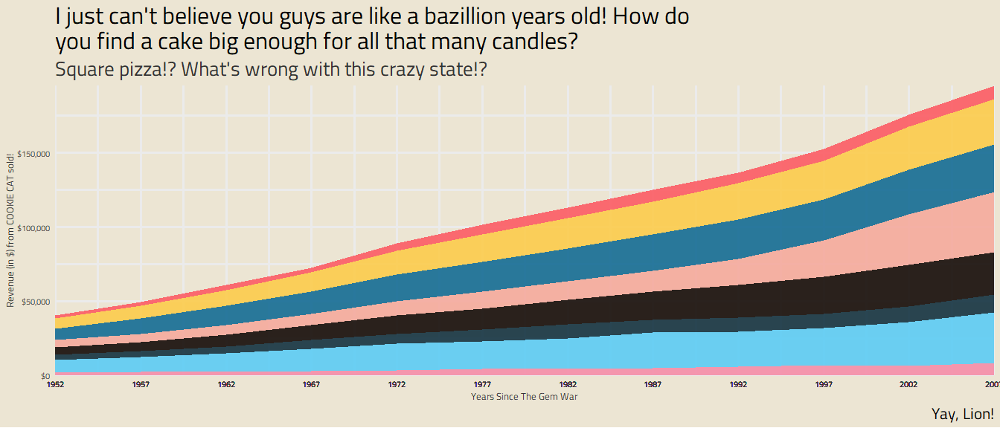

``` r
library(tvthemes)
library(ggplot2)
library(dplyr)
library(extrafont)
loadfonts(quiet = TRUE)
```

You can use the `scales::show_col()` function to take a peek at the
palettes available inside `stevenUniverse_palette`. Character palettes
range from friends…!

``` r
scales::show_col(tvthemes:::stevenUniverse_palette$Peridot)
```

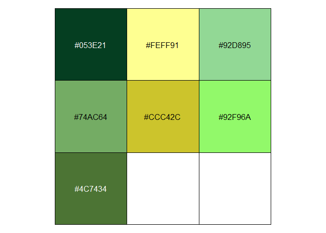

``` r
scales::show_col(tvthemes:::stevenUniverse_palette$LapisLazuli)
```

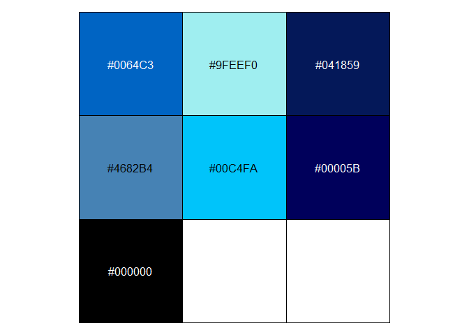

``` r
scales::show_col(tvthemes:::stevenUniverse_palette$Sardonyx)
```

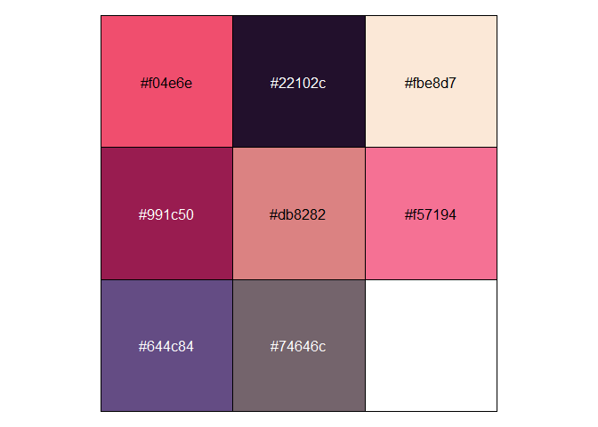

``` r
scales::show_col(tvthemes:::stevenUniverse_palette$Bismuth)
```

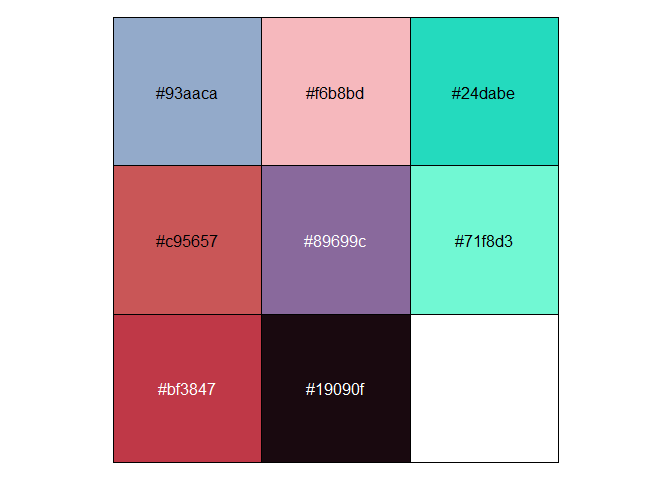

… to foes!

``` r
scales::show_col(tvthemes:::stevenUniverse_palette$Jasper)
```

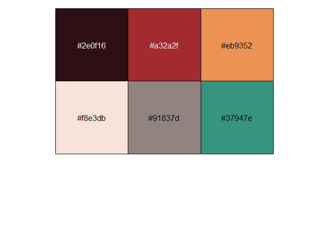

``` r
scales::show_col(tvthemes:::stevenUniverse_palette$Aquamarine)
```

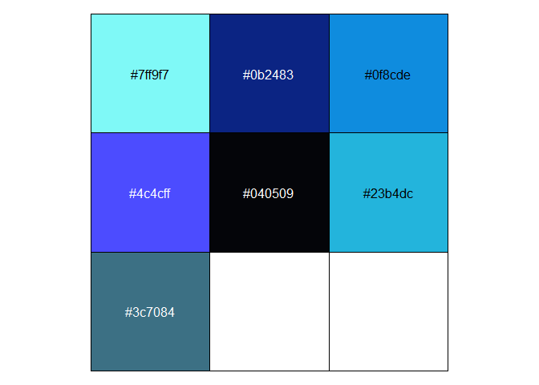

``` r
scales::show_col(tvthemes:::stevenUniverse_palette$Spinel)
```

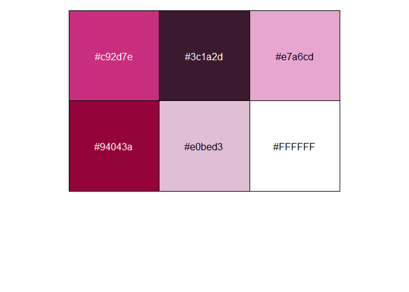

``` r
scales::show_col(tvthemes:::stevenUniverse_palette$Topaz)
```

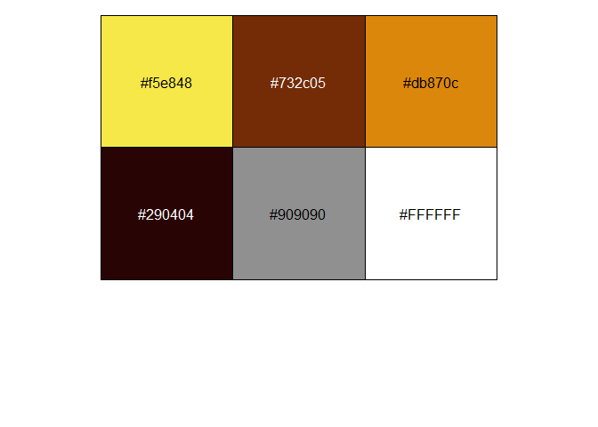

You can also show all 31 at once in the ‘Plots’ pane using the code
below. It will show the last palette in the list after you run it but
you can click the ‘back arrow’ to flip through the others. It might be
easier if you run it inside a **RMarkdown chunk** as that way it’ll show
all the output in a single window.

``` r
pal_name <- names(tvthemes:::stevenUniverse_palette)

show_all_pal <- function(pal_name) {
  exp_pal <- paste0("tvthemes:::stevenUniverse_palette$", pal_name)
  
  pal_call <- eval(expr = parse(text = exp_pal))
  
  return(scales::show_col(pal_call))
}

purrr::walk(pal_name, ~ show_all_pal(pal_name = .x))
```

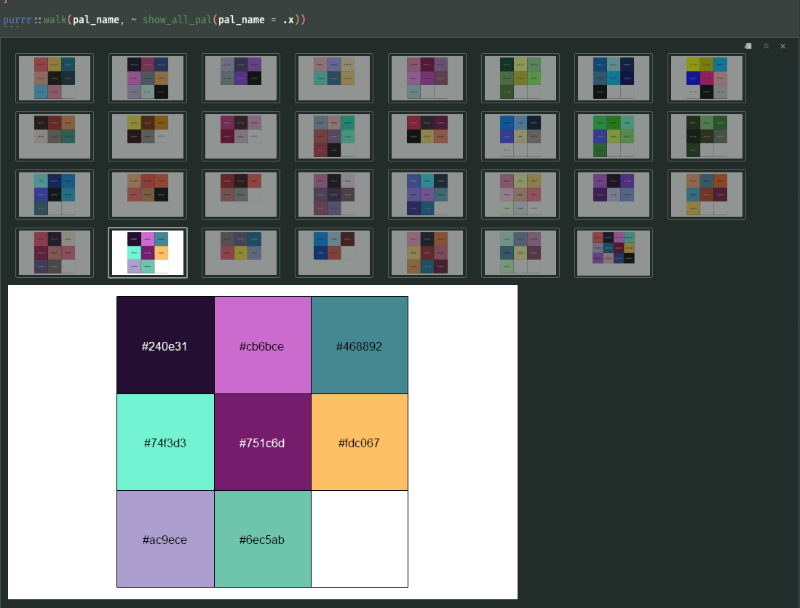

Now here are some examples using actual plots!

``` r
data <- gapminder::gapminder %>% 
  filter(country %in% c("Ireland", "Italy", "Turkey", "France", "Germany", 
                        "Brazil", "Mexico", "Sweden")) %>% 
  mutate(year = as.Date(paste(year, "-01-01", sep = "", format = '%Y-%b-%d')),
         image = "")

ggplot(data = data, aes(x = year, y = gdpPercap, fill = country)) +
  geom_area(alpha = 0.9) +
  scale_x_date(expand = c(0, 0), breaks = data$year, date_labels = "%Y") +
  scale_y_continuous(expand = c(0, 0), labels = scales::dollar) +
  scale_fill_stevenUniverse(palette = "Steven", reverse = FALSE) +
  labs(title = stringr::str_wrap("I just can't believe you guys are like a bazillion years old! How do you find a cake big enough for all that many candles?", width = 70),
       subtitle = "Square pizza!? What's wrong with this crazy state!?",
       caption = "Yay, Lion!",
       x = "Years Since The Gem War", y = "Revenue (in $) from COOKIE CAT sold!") +
  theme_avatar(title.size = 24,
               subtitle.size = 20,
               text.font = "Titillium Web", 
               text.size = 20,
               legend.position = "none")
```


You can mix-and-match with other themes in the package, other packages,
or your own custom ones. It should fit seamlessly into your **ggplot2**
workflow!

``` r
ggplot(diamonds, aes(price, fill = cut)) +
  geom_histogram(binwidth = 500) +
  scale_fill_stevenUniverse(palette = "CrystalGems") +
  labs(title = stringr::str_wrap("We... Are The Crystal Gems! We'll Always Save The Day! And If You Think We Can't, We'll Always Find A Way!", width = 70),
       subtitle = stringr::str_wrap("That's Why The People Of This World... Believe In: Garnet, Amethyst... Aaand Pearl!", width = 70),
       caption = "... AND STEVEN!") +
  theme_spongeBob(title.size = 24,
                  subtitle.size = 20,
                  text.font = "Titillium Web",
                  text.size = 18,
                  legend.position = "none")
```

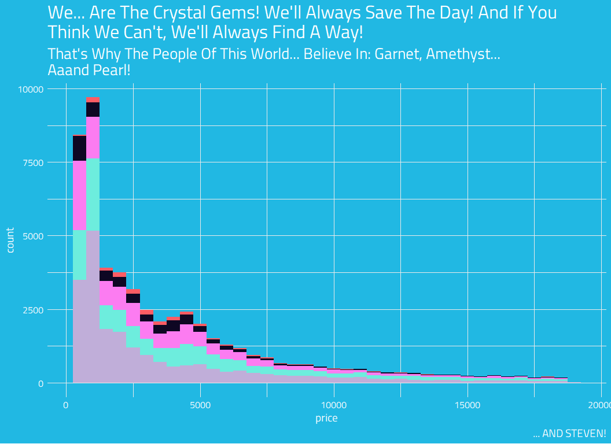

What’s been surprising for me since making this package is how many
people use it for educational purposes in their classrooms/workshops. It
was originally just for fun and a way to practice creating a simple R
package but I can see how it can be a fun educational tool for learning
about ggplot2 colors and theme-ing, so thank you to all the users!

As always feel free to suggest new themes/palettes for TV shows via
[Twitter](https://twitter.com/R_by_Ryo) or by commenting on the [main
Github issue](https://github.com/Ryo-N7/tvthemes/issues/2)!

<center>
<script type='text/javascript' src='https://storage.ko-fi.com/cdn/widget/Widget_2.js'></script>
<script type='text/javascript'>kofiwidget2.init('Buy Me A Coffee!', '#29abe0', 'O4O342A2A');kofiwidget2.draw();</script>
<center/>
