[{ggshakeR} 0.1.2, a package for soccer analytics visualizations for
R](https://github.com/abhiamishra/ggshakeR), is released! Users will
most likely not see anything changed from their perspective as this
version was all about implementing `Github Actions` CI tools and making
changes in the back-end of things for the package. For more on the
visualizations possible with {ggshakeR}, please take a look at the
[package website](https://abhiamishra.github.io/ggshakeR/)!

The main changes in `0.1.2` were as follows…

-   Build pkgdown website automatically with `Github Actions`
-   R Package Build checks with `Github Actions`
-   codecov test coverage checks with `Github Actions`
-   lintr checks with `Github Actions`
-   Reduced the number of package dependencies

Now let’s go a bit into detail about what these tools do and how they
help maintain a R package.

The various `Github Actions` flows for R packages can be seen in the
[Actions](https://github.com/r-lib/actions/tree/v2/examples) repository
and can be inserted into your package through various
[{usethis}](https://usethis.r-lib.org/)) package commands that I’ll go
over in this blogpost. A few of these also add badges to the README so
people will be able to tell at a glance the status of your package.

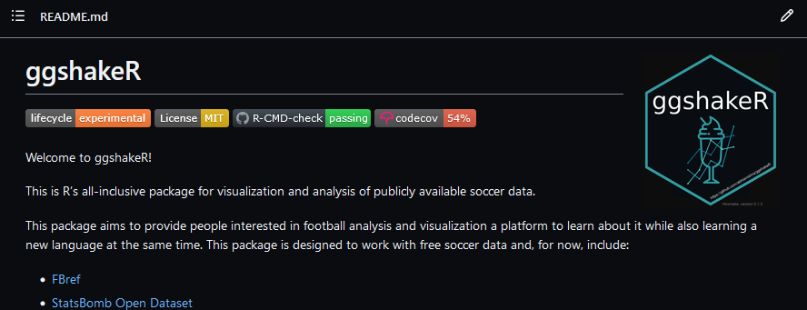

Let’s get started!

Automatically build the {pkgdown} website
=========================================

The previous version of {ggshakeR} was my first contribution to the
package, where I built out the {pkgdown} website to house all of the
documentation and vignettes. Now using `Github Actions`, it will
automatically build and deploy the website for us on every push.

``` r
usethis::use_github_action("pkgdown")
usethis::use_pkgdown_github_pages()
```

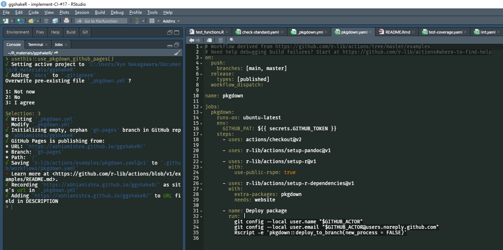

R Package build checks
======================

Similarly to how we’d use `devtools::check()`, now with `Github Actions`
every time we push or PR on Github the package will be built and run all
the tests. Using the [{usethis}](https://usethis.r-lib.org/) package it
is very easy to implement this workflow into your package:

``` r
usethis::use_github_action_check_standard()

## Also available is a more basic check using:
usethis::use_github_action_check_release()
```

This creates a new `R-CMD-check.yaml` file in your `.github` folder,
using the ‘standard’ version has the workflow check on the Linux, Mac,
and Windows platforms for both the latest version of R and R-devel.

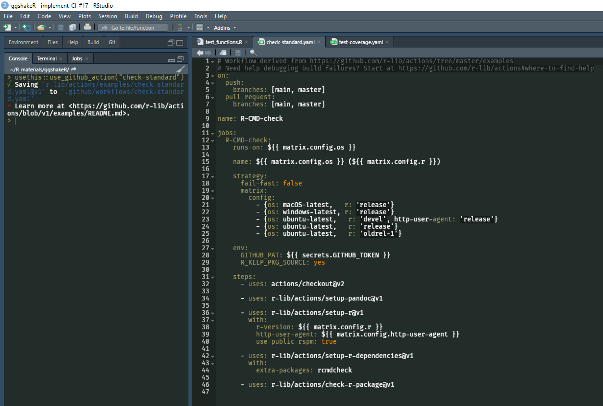

This is what it looks like in action:

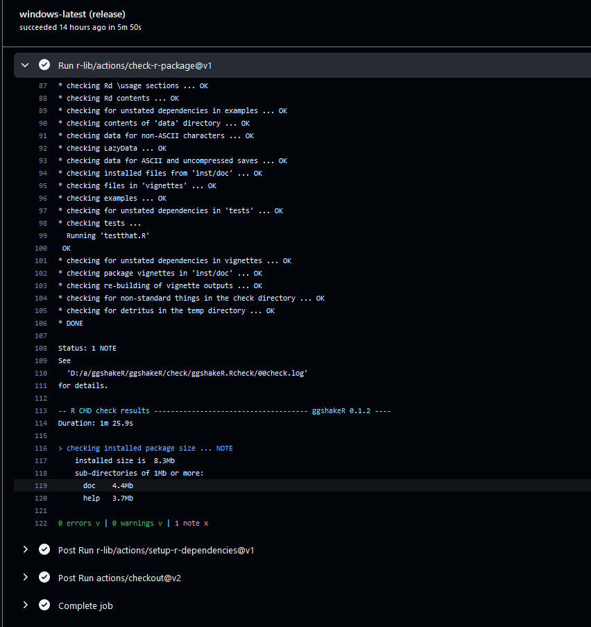

codecov: Test coverage checks
=============================

Knowing how much code your tests cover in your package is very
important. Using [codecov](https://about.codecov.io/) via the
[covr](https://github.com/r-lib/covr) package allows you to create
reports that describes the breadth of your test coverage.

``` r
## Create covr
usethis::use_coverage()
## Run via `Github Actions`
usethis::use_github_action("test-coverage")
```

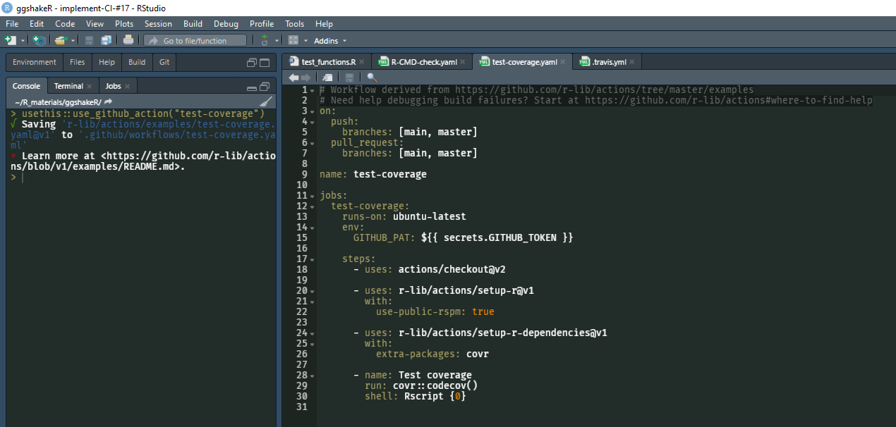

Once you have codecov connected, you can see the badge on the README
and click through it to see the report for the latest commit.

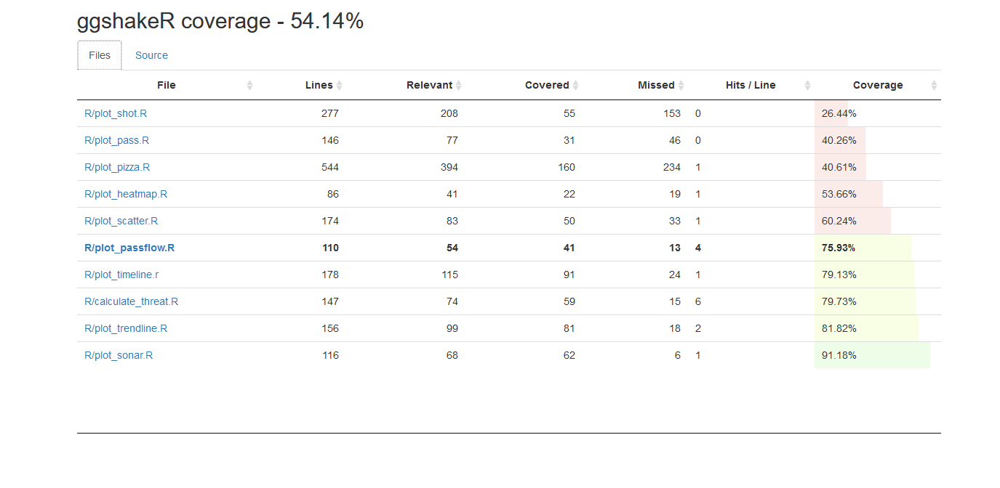

A lot more work still needs to be made in regards to testing but its
also worth noting that most of the basic functions are covered, its just
that these functions have a lot of different options that haven’t been
covered yet (like tests for different background/theme colors). An easy
way to generate a testing matrix for multiple configurations of function
arguments will be the topic of the next release and ‘developer diary’.

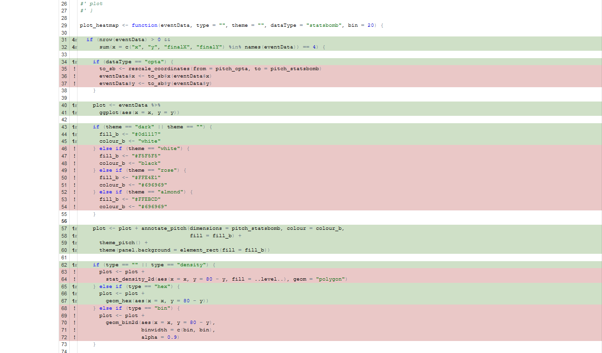

lintr checks: static code analysis
==================================

[lintr](https://github.com/r-lib/lintr) is a package that lets you
analyze your code base and check for various stylistic issues in your
code, mainly based on the [tidyverse style
guide](https://style.tidyverse.org/).

``` r
## Run lintr for your package
lintr::lint_package()

## Implement lintr in your `Github Actions` workflow
usethis::use_github_action("lint")
```

I took a cool lintr Actions workflow from the {lintr} package itself
that only lints files that were changed in the `Pull Request`.

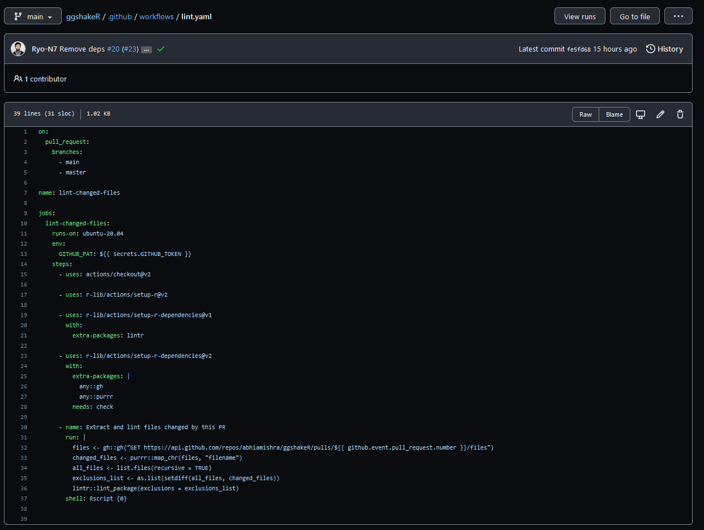

Not all linters are important or need to be turned on so I configured
the `.lintr` file to exclude a certain number of superfluous checks.
Most of the issues that remained were either cosmetic or for readability
of the code, such as `spaces after commas`,
`using <- instead of = for assignment`, `trailing whitespace`, etc. The
most pressing issue that was flagged that would impact users was the
inconsistency in the function arguments between camelCase and
snake\_case, sometimes within the same function.

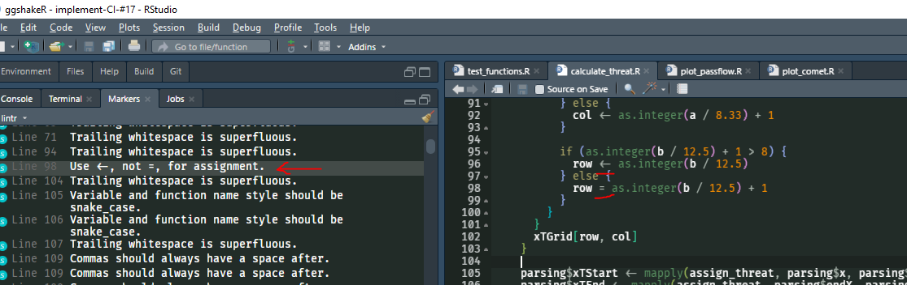

These are all issues that will be tackled in a future issue after some
discussion between the {ggshakeR} authors. For the purposes of this
release, I mainly focused on identifying issues and fixing stuff that
wouldn’t directly impact users by changing argument names and function
behavior.

While lintr allows you to identify issues, how would one go about
changing them? While you could click through the lintr report manually,
you can also use the [{styler}](https://github.com/r-lib/styler) package
to do this automatically for you. Of course, you have to be very careful
about using this as it will change your code. For this package, I only
ran `styler::style_file()` on the testing file as an example.

<p float="left" align="center">
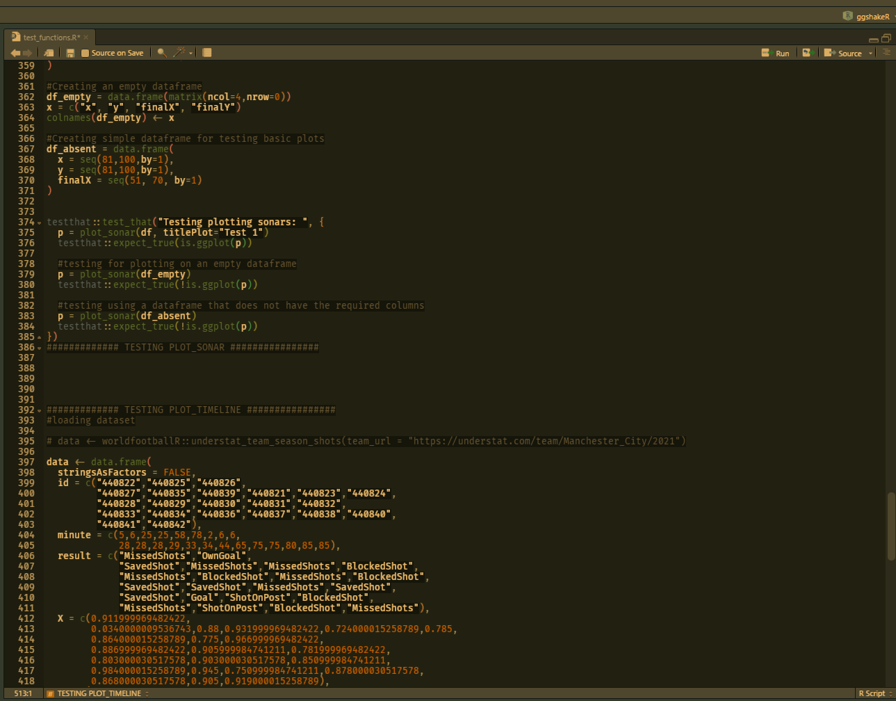
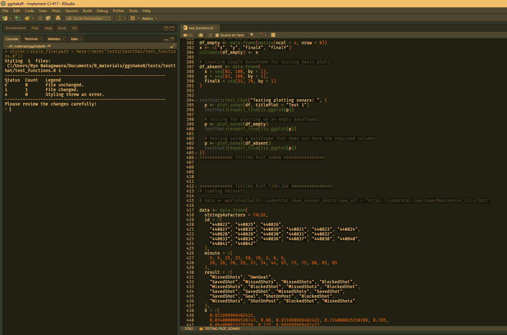
</p>

By letting it run on `Github Actions`, we can check before we merge `Pull Requests` that our changes comply with standard coding style conventions
by clicking on the individual commits themselves after the Actions have
completed in the `Pull Request` window.

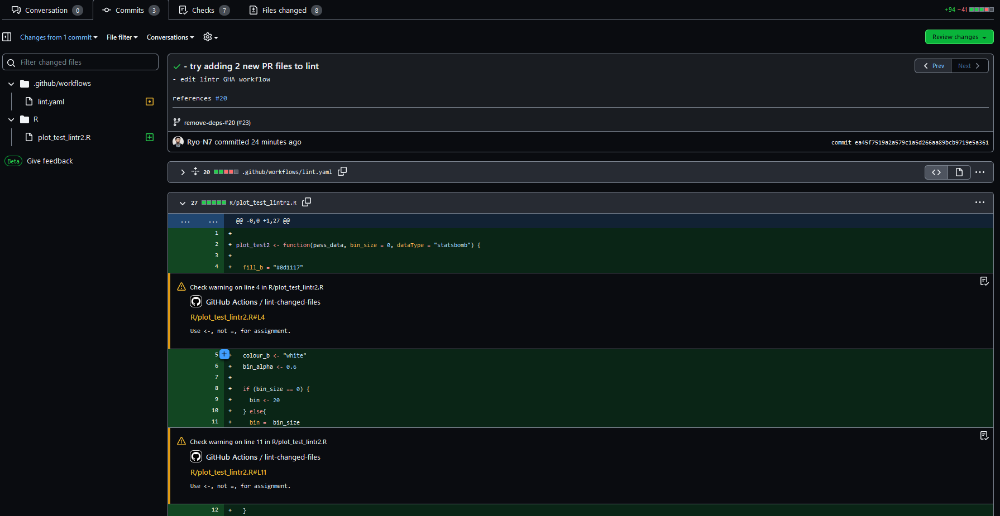

Reduce number of package dependencies
=====================================

Prior to this version, {ggshakeR} had 19 dependencies. One of the goals
of this patch was try to find ways to reduce this number. Thankfully,
the functions from certain packages could easily be replaced with base R
code or could be replaced with a function in a different dependency (Ex.
going from {stringr} to {stringi}).

For the big `0.2.0` release there will be further steps to take out a
few more. The nature of this wide-ranging visualization package makes it
necessary to import different packages (no need to re-invent the wheel)
but where able, I’ve been working with the other authors to reduce them
where possible.

Conclusion
==========

This blog post was more of a ‘developer diary’ rather than a tutorial
for new features. There is still lots of work to be done, mainly testing
to increase coverage and also some much needed discussions on code
consistency between the different authors and potential contributors to
the package.

Big thanks to the other {ggshakeR} authors,
[Abhishek](https://twitter.com/MishraAbhiA) and
[Harsh](https://twitter.com/harshthecreator), and to all the users for
your support. There is much more to come, especially in terms of actual
viz content in version `0.2.0`… and eventually to a CRAN release!
