Midst a monsoon, another TokyoR meetup! Since the pandemic started all
of TokyoR’s meetups have turned into online sessions and the transition
has been seamless thanks to the efforts of the `TokyoR` organizing team.
This was the [101st TokyoR
Meetup](https://tokyor.connpass.com/event/259246/)!

My previous TokyoR roundups:

-   [Japan.R 2018
    (12/1/2018)](https://ryo-n7.github.io/2018-12-06-japanr-conference-roundup-blog-post/)
-   [Tokyo.R #76
    (3/2/2019)](https://ryo-n7.github.io/2019-03-07-tokyoR-76-roundup/)
-   [Tokyo.R #77
    (4/13/2019)](https://ryo-n7.github.io/2019-04-24-tokyoR-77/)
-   [Tokyo.R #78
    (5/25/2019)](https://ryo-n7.github.io/2019-05-31-tokyoR-78-roundup/)
-   [Tokyo.R #79
    (6/29/2019)](https://ryo-n7.github.io/2019-07-05-tokyoR-79-roundup/)
-   [Tokyo.R #80
    (7/27/2019)](https://ryo-n7.github.io/2019-08-02-tokyoR-80-roundup/)
-   [Tokyo.R #81
    (9/28/2019)](https://ryo-n7.github.io/2019-10-30-tokyoR-81-roundup/)
-   [Tokyo.R #87 (7/
    /2020)](https://ryo-n7.github.io/2020-08-03-tokyoR-87-roundup/)

As you can see it was my first [TokyoR](https://tokyor.connpass.com/) in
quite a long time, so it was nice to be back! On top of short summaries
of all the talks I will also provide some helpful links and resources of
my own to supplement the content of the talks.

Let’s get started!

-   <a href="#beginner-session" id="toc-beginner-session">BeginneR
    Session</a>
-   <a href="#main-session" id="toc-main-session">Main Session</a>
    -   <a href="#data-cleaning-with-palmer-penguins---bob3bob3"
        id="toc-data-cleaning-with-palmer-penguins---bob3bob3">Data cleaning
        with Palmer penguins - <code>@bob3bob3</code></a>
        -   <a href="#resources" id="toc-resources">Resources</a>
    -   <a href="#regression-analysis-with-r---kilometer00"
        id="toc-regression-analysis-with-r---kilometer00">Regression Analysis
        with R - <span class="citation"
        data-cites="kilometer00">@kilometer00</span></a>
    -   <a href="#resources-1" id="toc-resources-1">Resources</a>
-   <a href="#lightning-talks" id="toc-lightning-talks">Lightning Talks</a>
    -   <a href="#r-and-snowflake---y__mattu"
        id="toc-r-and-snowflake---y__mattu">R and Snowflake -
        <code>@y__mattu</code></a>
    -   <a href="#resources-2" id="toc-resources-2">Resources</a>
    -   <a href="#buying-art-with-r---saltcooky"
        id="toc-buying-art-with-r---saltcooky">Buying art with R -
        <code>@saltcooky</code></a>
    -   <a href="#resources-3" id="toc-resources-3">Resources</a>
    -   <a href="#graphs---bob3bob3" id="toc-graphs---bob3bob3">Graphs -
        <code>@bob3bob3</code></a>
    -   <a href="#resources-4" id="toc-resources-4">Resources</a>
-   <a href="#conclusion" id="toc-conclusion">Conclusion</a>

# BeginneR Session

As with every TokyoR meetup, we began with a set of beginner user
focused talks:

-   [Intro to R -
    @kotatyamtema](https://www.slideshare.net/kotora_0507/tokyor101beginnerssession1pdf)
-   [Data cleaning -
    @kotatyamtema](https://www.slideshare.net/kotora_0507/tokyor101beginnerssession2pdf)
-   [Data visualization -
    @yutakanzawa](https://ytknzw.github.io/TokyoR/%E5%88%9D%E5%BF%83%E8%80%85%E3%82%BB%E3%83%83%E3%82%B7%E3%83%A7%E3%83%B3_%E3%83%87%E3%83%BC%E3%82%BF%E5%8F%AF%E8%A6%96%E5%8C%96_TokyoR_20220917.pdf)

# Main Session

## Data cleaning with Palmer penguins - `@bob3bob3`

-   [Slides](https://speakerdeck.com/bob3bob3/tokyor-number-101-pamasutesiyonnopengintati2-detakuriningubian)

`@bob3bob3` presented on data cleaning techniques using the Palmer
penguins data set.

``` r
install.packages("palmerpenguins")
```

This data set consists of data on 3 species of penguin with details
about their weight, wingspan, beak length, etc. There are two data sets
included within the package:

-   `penguins_raw`: the raw data set gathered from study
-   `penguins`: the cleaned version

The goal of this talk was to start from `penguins_raw` and get close to
the cleaned `penguins` data set.

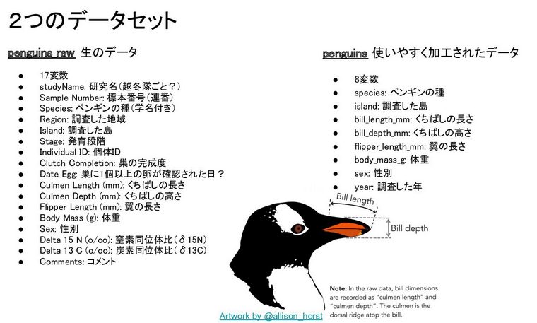

As a first step, we explored the data set from the lens of the
`summarytools::dfSummary()` function which provides us with a summary
view of the data.frame.

``` r
library(palmerpenguins)
library(summarytools)

penguins_raw |> 
  dfSummary() |>
  View()
```

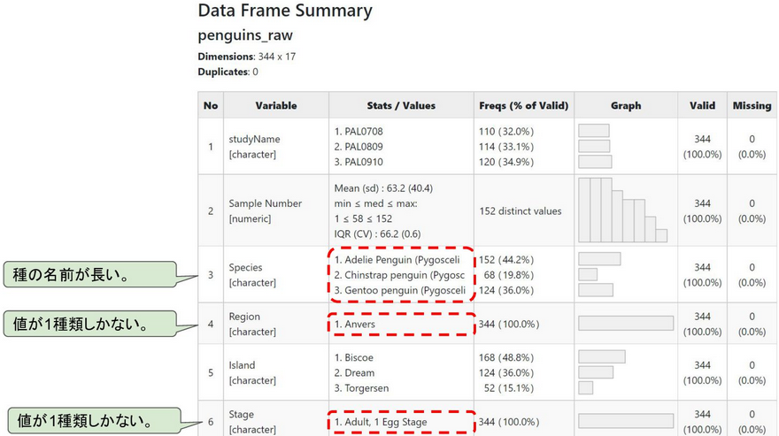

From here we were able to identify various problems with the data set
and come up with a plan to clean it. Using packages such as the
{tidyverse} group, {janitor} and {lubridate}, `@bob3bob3` explained each
step of the long piped chain of cleaning operations.

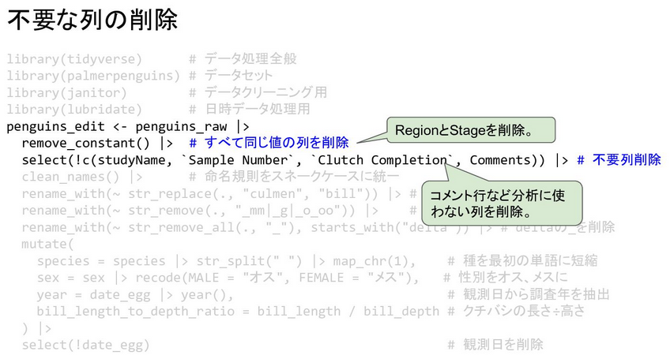

`@bob3bob3` said he’ll continue this series as he plans on doing another
talk on EDA and visualization, and then more planned talks on doing
various statistical analysis on this data set.

### Resources

-   [{palmerpenguins} R
    package](https://github.com/allisonhorst/palmerpenguins)
-   [Intro to Palmer Penguins dataset: Twitter thread (Allison
    Horst)](https://twitter.com/allison_horst/status/1270046399418138625)

## Regression Analysis with R - @kilometer00

-   [Slides](https://speakerdeck.com/kilometer/tokyor-number-101-regressionanalysis)

TokyoR organizer, `@kilometer00` gave a very thorough overview of
regression analysis using R. From using the base `lm()` function, to
going step-by-step to calculating the various statistical outputs
(residuals, standard errors, F-statistic, etc.) manually, and concise
explanations of all of the formulas behind them, this was a helpful
intro for anybody trying to understand linear regression using R.

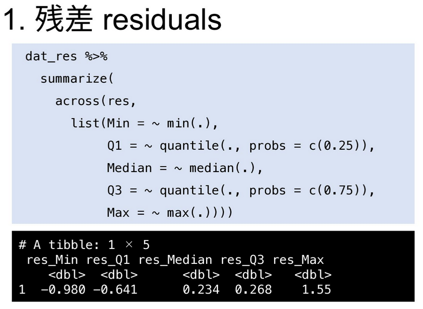

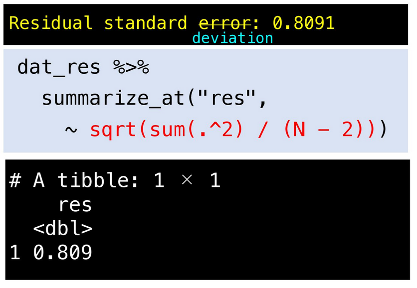

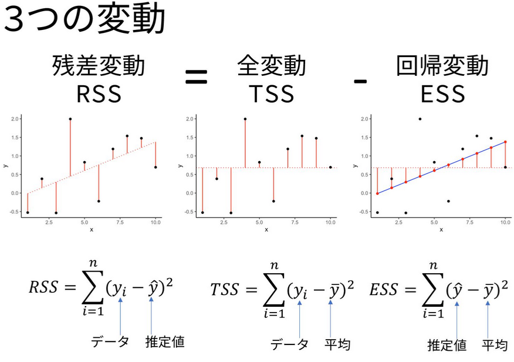

## Resources

-   [Linear Models with R - Julian J.
    Faraway](https://www.utstat.toronto.edu/~brunner/books/LinearModelsWithR.pdf)
-   [Extending the Linear Model with R - Julian J.
    Faraway](https://julianfaraway.github.io/faraway/ELM/)
-   [Statistical Inference via Data Science: A ModernDive into R and the
    Tidyverse - Chester Ismay & Albert Y. Kim](https://moderndive.com/)

# Lightning Talks

## R and Snowflake - `@y__mattu`

One of the organizers of TokyoR, `@y__mattu`, gave a short intro to
using snowflake with R. Snowflake is a cloud database platform, one of
many that have grown out of the emergence of cloud data warehouses
following a long period of time where database software was basically
dominated by the likes of Oracle and MySQL.

However, there is no R package (…yet?) that directly connects with
Snowflake so one needs to setup an [ODBC
driver](https://docs.snowflake.com/en/user-guide/odbc.html) and use the
{DBI} package.

``` r
library(DBI)
library(odbc)

myconn <- DBI::dbConnect(odbc::odbc(), "SNOWFLAKE_DSN_NAME", uid="USERNAME", pwd='Snowflak123')
mydata <- DBI::dbGetQuery(myconn,"SELECT * FROM EMP")
```

## Resources

-   [Snowflake R/RStudio Integration: How to Connect & Analyze Data? -
    Hevo Data](https://hevodata.com/learn/snowflake-r/)
-   [How To Connect Snowflake with R/RStudio using ODBC driver on
    Windows/MacOS/Linux. - snowflake community
    article](https://community.snowflake.com/s/article/How-To-Connect-Snowflake-with-R-RStudio-using-RODBC-driver-on-Windows-MacOS-Linux)
-   [Accessing Snowflake with R - Martin
    Stingl](https://rstats-tips.net/2022/02/07/accessing-snowflake-with-r/)

## Buying art with R - `@saltcooky`

-   [Slides](https://speakerdeck.com/saltcooky12/rdeyou-ming-hui-hua-woan-quan-nimai-itai)

`@saltcooky` likes Jackson Pollock’s artwork and in this LT he talked
about using R to do fractal analysis of Pollock’s world famous drip
paintings.

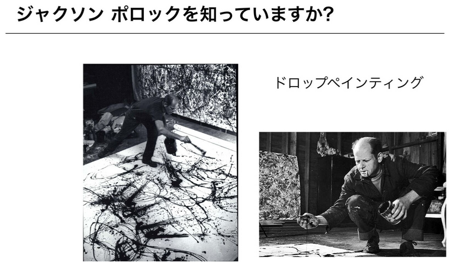

`@saltcooky` gave us an intro to fractal analysis, talking about the
fractal dimension and the mathematical theories behind in. One of the
ways to calculate the fractal dimensions of an object is to use the
box-counting algorithm. In R, we can use the {VoxR} package,
specifically the `box_counting()` function.

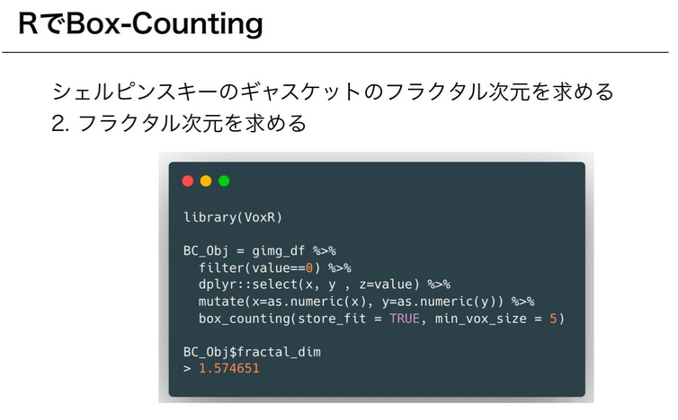

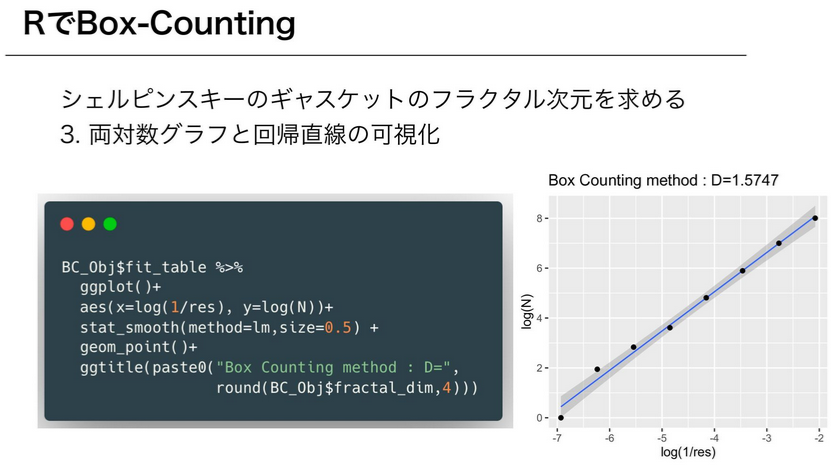

## Resources

-   [{VoxR}: Trees Geometry and Morphology from Unstructured TLS Data -
    Bastien Lecigne](https://cran.r-project.org/package=VoxR)
-   Fractal analysis of Pollock’s drip paintings. - R.P. Taylor, et
    al. 1999.
-   On multi-fractal structure in non-representational art. - J.R.
    Nureika, et al. 2005.

## Graphs - `@bob3bob3`

-   [Slides](https://speakerdeck.com/bob3bob3/shi-waretagurahuwoqiu-mete)

In his 2nd presentation of the day, `@bob3bob3` talked about graphs,
specifically some visualization functions that are included in base R.

Why does R have these functions? … [For compatibility with
S](https://twitter.com/whydoesr).

For those that might not get the joke/adage/whatever, these
visualizations continued to exist in R, in part, due to its origins in
its predecessor language, S.

First is the stem-and-leaf plot, which is similar to the histogram that
most people should be familiar with. Unlike the histogram, however, the
stem-and-leaf plot tries to retain as much of the original data as
possible and orders them from least to greatest in both the “stem” and
“leaf” part of the plots. R users can create this plot via the `stem()`
function which is available from base R graphics functionality.

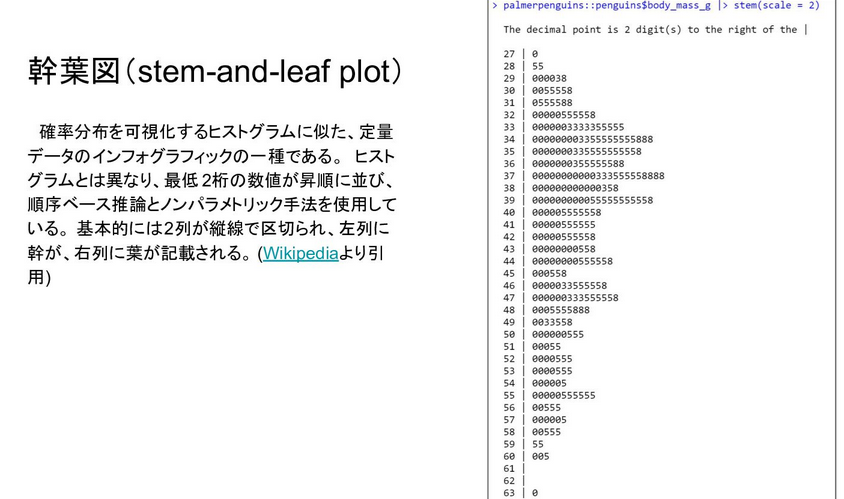

Next are the Chernoff face graphs. This is a type of visualization
invited by Herman Chernoff to display multivariate data in the shape of
a human face. The ways to see how each individual data point is
differentiated is by how the Chernoff graph displays the individual
parts of the face differently by the shape, size, placement, and
orientation.

R users can create this type of visualization via the {aplpack} package,
specifically the `faces()` function.

-   <https://flowingdata.com/2010/08/31/how-to-visualize-data-with-cartoonish-faces/>

and provided an example using the Palmer penguins data set that he used
in his previous presentation.

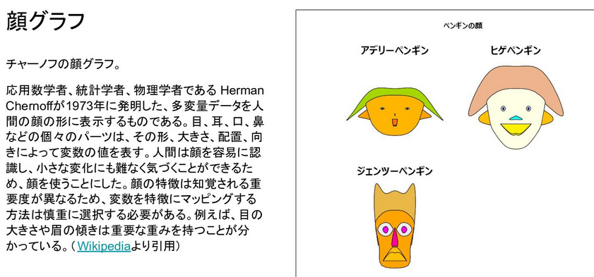

Nowadays to achieve a similar goal to view differences in multivariate
data, people can make radar plots or parallel coordinate plots.

Finally, `@bob3bob3` talked about sun flower plots. Sunflower plots are
a variant of the traditional scatter plot that tries to reduce over
plotting by adding petals for areas on a plot where multiple data points
have similar values. Base R has the `sunflowerplot()` function available
for easy access to this type of visualization.

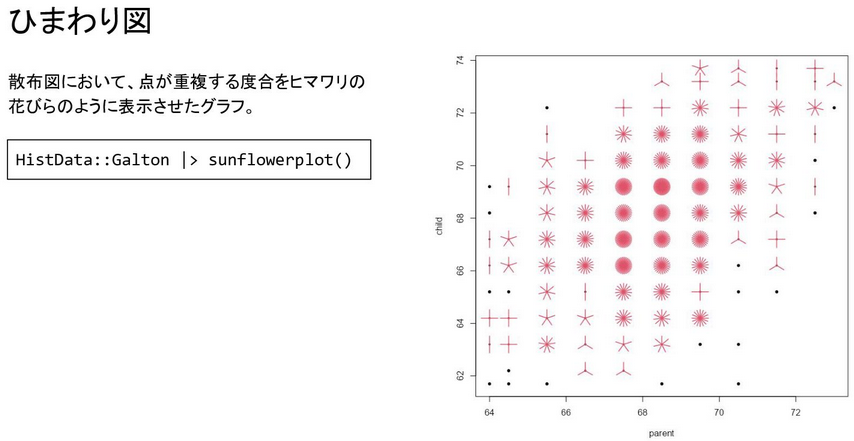

## Resources

-   [Example of stem-and-leaf plot - R Guide for NSC
    Statistics](https://bookdown.org/dli/rguide/stem-and-leaf-plot.html)

-   Hermann Chernoff (1973). The use of faces to represent points in
    k-dimensional space graphically. Journal of the American Statistical
    Association, 68(342), 361–368.

-   [{aplpack}: ‘Bagplots’, ‘Iconplots’, ‘Summaryplots’, Slider
    Functions and Others - Hans Peter
    Wolf](https://cran.r-project.org/package=aplpack)

-   [{ggChernoff}: Chernoff face geom for {ggplot2} - David
    Selby](https://cran.r-project.org/package=ggChernoff)

-   [How to visualize data with cartoonish faces -
    FlowingData](https://flowingdata.com/2010/08/31/how-to-visualize-data-with-cartoonish-faces/)

-   [What is a sunflower
    plot?](https://statisticaloddsandends.wordpress.com/2021/02/05/what-is-a-sunflower-plot/)

-   Schilling, M. F. and Watkins, A. E. (1994). A suggestion for
    sunflower plots. The American Statistician, 48, 303–305. doi:
    10.2307/2684839.

# Conclusion

The next TokyoR meetup is scheduled for sometime near the end of
October. Please follow the [official TokyoR Twitter
account](https://twitter.com/TokyoRCommunity) to keep tabs on any new
updates or you can visit the [TokyoR](https://tokyor.connpass.com/)
website for details on past and future meetups. For the time being
meetups will continue to be conducted online. Talks in English are also
welcome so come join us!
