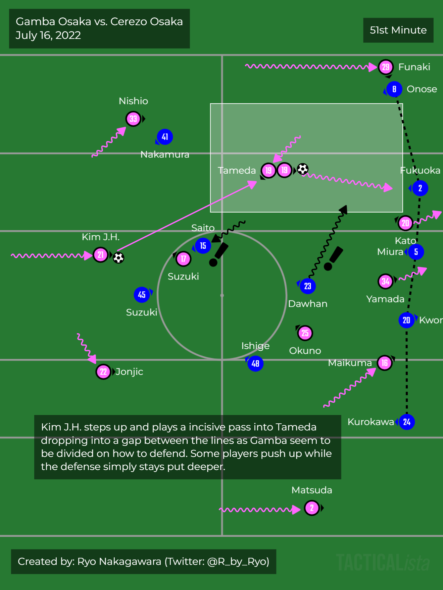
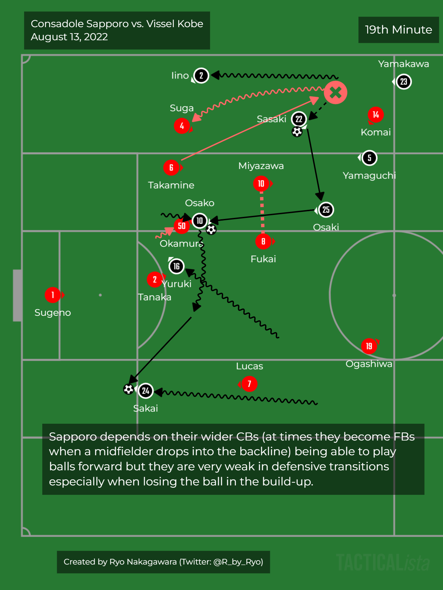
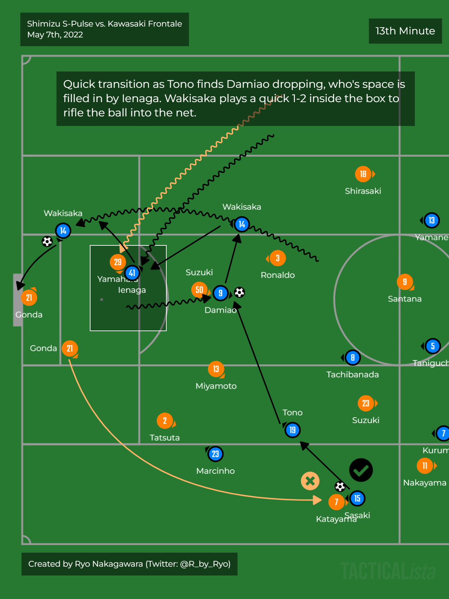
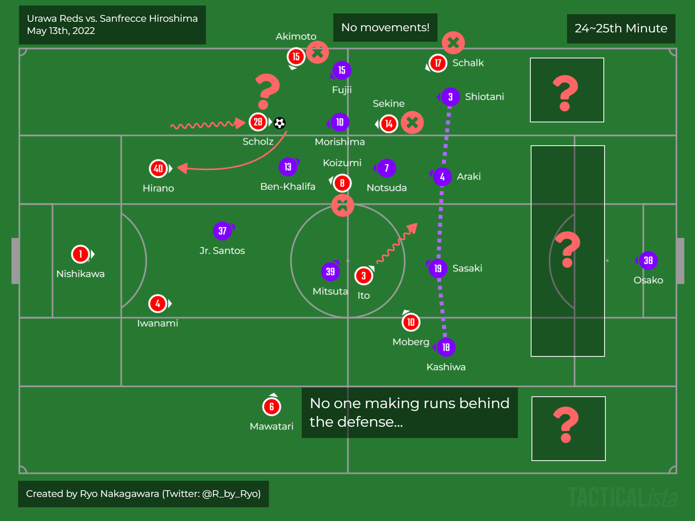
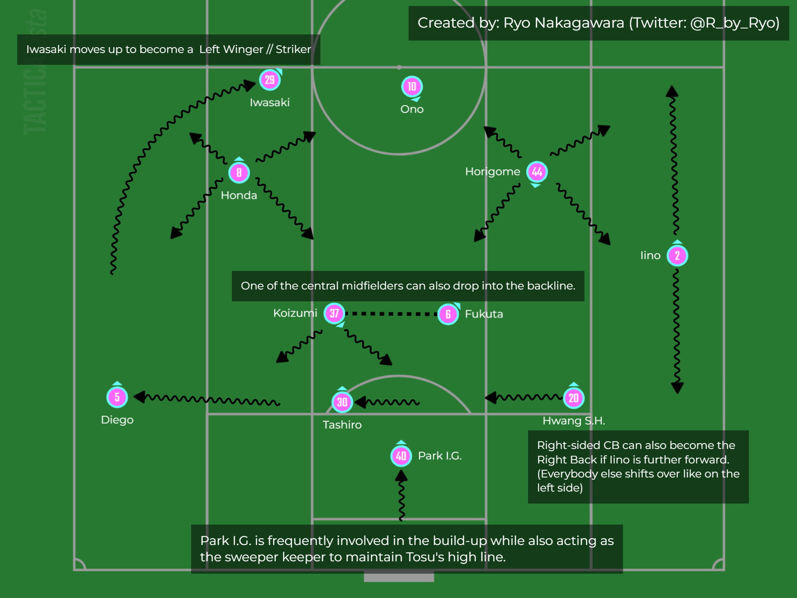
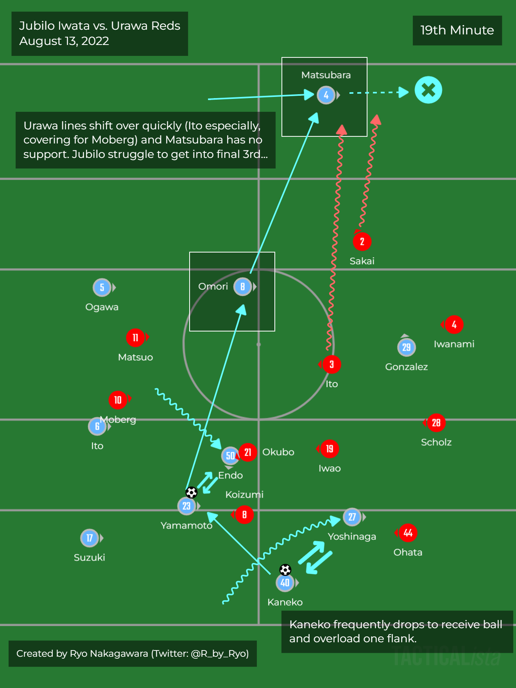

-   <a href="#intro" id="toc-intro">Intro</a>
-   <a href="#league-table" id="toc-league-table">League table</a>
-   <a href="#team-reviews" id="toc-team-reviews">Team Reviews</a>
    -   <a href="#cerezo-osaka" id="toc-cerezo-osaka">Cerezo Osaka</a>
    -   <a href="#shimizu-s-pulse" id="toc-shimizu-s-pulse">Shimizu S-Pulse</a>
    -   <a href="#vissel-kobe" id="toc-vissel-kobe">Vissel Kobe</a>
    -   <a href="#kawasaki-frontale" id="toc-kawasaki-frontale">Kawasaki
        Frontale</a>
    -   <a href="#kashiwa-reysol" id="toc-kashiwa-reysol">Kashiwa Reysol</a>
    -   <a href="#kashima-antlers" id="toc-kashima-antlers">Kashima Antlers</a>
    -   <a href="#yokohama-f.-marinos" id="toc-yokohama-f.-marinos">Yokohama F.
        Marinos</a>
    -   <a href="#nagoya-grampus" id="toc-nagoya-grampus">Nagoya Grampus</a>
    -   <a href="#shonan-bellmare" id="toc-shonan-bellmare">Shonan Bellmare</a>
    -   <a href="#fc-tokyo" id="toc-fc-tokyo">FC Tokyo</a>
    -   <a href="#gamba-osaka" id="toc-gamba-osaka">Gamba Osaka</a>
    -   <a href="#consadole-sapporo" id="toc-consadole-sapporo">Consadole
        Sapporo</a>
    -   <a href="#urawa-reds" id="toc-urawa-reds">Urawa Reds</a>
    -   <a href="#kyoto-sanga" id="toc-kyoto-sanga">Kyoto Sanga</a>
    -   <a href="#sagan-tosu" id="toc-sagan-tosu">Sagan Tosu</a>
    -   <a href="#avispa-fukuoka" id="toc-avispa-fukuoka">Avispa Fukuoka</a>
    -   <a href="#sanfrecce-hiroshima" id="toc-sanfrecce-hiroshima">Sanfrecce
        Hiroshima</a>
    -   <a href="#jubilo-iwata" id="toc-jubilo-iwata">Jubilo Iwata</a>
-   <a href="#data-visualizations" id="toc-data-visualizations">Data
    Visualizations</a>
    -   <a href="#squad-age-profiles" id="toc-squad-age-profiles">Squad Age
        Profiles</a>
    -   <a href="#time-interval" id="toc-time-interval">Time Interval</a>
    -   <a href="#scoring-situations" id="toc-scoring-situations">Scoring
        Situations</a>
    -   <a href="#team-shot-quantity" id="toc-team-shot-quantity">Team Shot
        Quantity</a>
    -   <a href="#team-shot-quality" id="toc-team-shot-quality">Team Shot
        Quality</a>
    -   <a href="#match-rolling-averages" id="toc-match-rolling-averages">5
        Match Rolling Averages:</a>
        -   <a href="#goals-vs.-goals-against"
            id="toc-goals-vs.-goals-against">Goals vs. Goals Against</a>
        -   <a href="#xg-vs.-xga" id="toc-xg-vs.-xga">xG vs. xGA</a>
        -   <a href="#xg-vs.-goals" id="toc-xg-vs.-goals">xG vs. Goals</a>
        -   <a href="#xga-vs.-goals-against" id="toc-xga-vs.-goals-against">xGA
            vs. Goals Against</a>
    -   <a href="#xg-difference" id="toc-xg-difference">xG Difference</a>
-   <a href="#conclusion" id="toc-conclusion">Conclusion</a>

# Intro

As winter approaches, the sun sets on the 2022 season of the J.League!
This was yet another condensed season due to the `2022 World Cup` in
Qatar, just about overlapping with the time the J.League usually
finishes so fans and players alike got another busy J1 schedule. We are
now in the 30th season of the J.League and although COVID related
measures are still largely in place, things were slowly getting back to
normal with bigger crowds and from the summer months onward, small
sections of fans in the stadium were allowed to cheer again. It is quite
likely, bar some catastrophic new variant, that this season might be the
end of all restrictions on fan cheering/singing (fingers crossed…). This
season saw **Jubilo Iwata** and **Kyoto Sanga** join J1, their first
time back to the premier competition level in 3 years and 12 years
respectively. As has become tradition in the last few years, this is the
season end review of the J.League where I look at how teams are doing
using both **data** and **watching the games** (or the **“eye-test”** or
whatever other term you want to use).

For these blog posts that I create I would ideally use data from
WyScout, InStat, etc. to take advantage of their detailed stats
(expected goals, progressive passes, etc.) especially to look at
player-level data and match that up with my own notes from watching the
games and of course the tagged/organized video footage that these
platforms provide (especially as DAZN only keeps matches up online for
about a month until they are archived forever into the abyss…).
Unfortunately, all of that costs *$$$*. I do all of this as a hobby and
I can’t justify the expense (it’s not the $ but more importantly the
**time** to make full use of purchasing an account). So, I am only using
data from free websites which do not have as much detail. Thankfully, I
have been able to find a bit more on a player and team level from a
variety of new sources this past year. Once again, a big *arigato* to
websites like [Transfermarkt](https://www.transfermarkt.com/),
[Sporteria](https://sporteria.jp/),
[Football-Lab](https://www.football-lab.jp/),
[FBref](https://fbref.com/en/), and more! As always, you can always
check **where** I got the **data** from my taking a look at the bottom
corners of any viz.

Since last year I’ve been heavily relying on the
[TACTICALista](https://app.tacticalista.com/#/) app to create tactics
diagrams/animations. You’ll see a lot of them in the tactics sections
and I urge you to check it out, it’s really great. For those of you
familiar with [my previous
work](https://ryo-n7.github.io/2018-06-29-visualize-worldcup/), I
would’ve liked to remain on brand and create soccer-related
diagrams/animations with {ggplot2} and {gganimate} but… that would’ve
taken a loooong time so I have been using a program that’s actually
built for this kind of thing instead.

I’ll be very happy if any J.League bloggers (as long as there’s no pay
wall or anything) want to use any of the viz I’ve made in this blog post
with proper credit along with a link to their work (as I’d love to read
more English J.League content). Some of the viz can be created for J2
and J3 teams as well so please don’t hesitate to reach out ([on Twitter:
R_by_Ryo](https://twitter.com/R_by_Ryo)) if you want me to do so!

Before I start just a few notes:

-   To keep up to date with all of what’s happening in J1, I made a
    giant Twitter thread of lots of cool informed people to follow on
    **Twitter** for English language/international J.League content. You
    can find it
    [here](https://twitter.com/R_by_Ryo/status/1493180532603383815)!

-   While I have become a FC Tokyo fan since returning to Japan a few
    years back, this review is meant to be as **objective (as
    possible)** and I do try my best to be **impartial**.

-   I can’t watch **every match** for **every team** but I do try to
    watch around **70%\~80%** of all J1 games in a given season. Of
    those games I do watch I’m almost always taking detailed notes on
    them to review later, re-watching them, etc. This season I’ve been
    able to go watch games live at the stadiums a lot more so I was able
    to gain impressions from that perspective as well.

-   All of the shots and xG related stuff you see in the viz are
    **non-penalty** stats. Exceptions are stuff like the time interval
    and scoring situations plots. When I mentioned these stats in
    writing I always do mean **non-penalty** but I explicitly wrote it
    out every time just to be super clear.

-   My views come from watching **only J1 league matches** as most cup
    games clash with my work schedule and I can’t be bothered to
    subscribe to yet another streaming service. The things I talk about
    here are primarily based on the **J1 league** with occasional
    references to cup competitions.

-   Again, I am doing this all on my **own free time**. As much as I do
    enjoy doing this, it’s honestly becoming a huge time sink. **It’s
    quite likely this will be the end of blog posts of this scale.** The
    data stuff is easy and I can produce everything with a few button
    clicks but the tactics stuff takes an enormous amount of time,
    especially when I am doing it for 18 (Eighteen!) teams to the level
    of understanding and depth that I am happy with. I may change the
    format to a **monthly newsletter** that is much smaller in scope and
    may ease the burden on me.

-   With better data and more time (especially with the World Cup
    starting in only 14 days after the J.League finishes), I would’ve
    done more… I definitely **wanted** to do more… but what you see is
    what you get!

Anyway, **Let’s get started!**

# League table

<details>
<summary>
<b>Click to show R code!</b>
</summary>
<pre>

```r
jleague_table_2022_end_cleaned <- read.csv(
  file = "https://raw.githubusercontent.com/Ryo-N7/soccer_ggplots/master/data/jleague_2022_end/jleague_table_2022_end_cleaned.csv")

jleague_kable_table <- jleague_table_2022_end_cleaned %>% 
  knitr::kable(format = "html", 
               caption = "J.League 2022 - League Table (After Matchday 16)") %>% 
  kable_styling(full_width = FALSE,
                bootstrap_options = c("condensed", "responsive")) %>% 
  add_header_above(c(" ", "Result" = 5, "Goals" = 3,
                     "Expected Goals" = 3)) %>% 
  column_spec(1:2, bold = TRUE) %>% 
  row_spec(1, bold = TRUE, color = "white", background = "green") %>% 
  row_spec(2:3, bold = TRUE, color = "grey", background = "lightgreen") %>% 
  row_spec(4:15, bold = TRUE, color = "grey", background = "white") %>% 
  row_spec(16, bold = TRUE, color = "white", background = "orange") %>% 
  row_spec(17:18, color = "white", background = "red") %>% 
  add_footnote(label = "Data: FBref.com & Sporteria | Kyoto survive after winning pro/rel playoff | All xG values do not include penalties",
               notation = "none")

jleague_kable_table
```
</pre>
</details>


<table class="table table-condensed table-responsive" style="width: auto !important; margin-left: auto; margin-right: auto;">
<caption>J.League 2022 - League Table (After Matchday 16)</caption>
 <thead>
<tr>
<th style="empty-cells: hide;border-bottom:hidden;" colspan="1"></th>
<th style="border-bottom:hidden;padding-bottom:0; padding-left:3px;padding-right:3px;text-align: center; " colspan="5"><div style="border-bottom: 1px solid #ddd; padding-bottom: 5px; ">Result</div></th>
<th style="border-bottom:hidden;padding-bottom:0; padding-left:3px;padding-right:3px;text-align: center; " colspan="3"><div style="border-bottom: 1px solid #ddd; padding-bottom: 5px; ">Goals</div></th>
<th style="border-bottom:hidden;padding-bottom:0; padding-left:3px;padding-right:3px;text-align: center; " colspan="3"><div style="border-bottom: 1px solid #ddd; padding-bottom: 5px; ">Expected Goals</div></th>
</tr>
  <tr>
   <th style="text-align:left;"> Team </th>
   <th style="text-align:right;"> Matches </th>
   <th style="text-align:right;"> W </th>
   <th style="text-align:right;"> D </th>
   <th style="text-align:right;"> L </th>
   <th style="text-align:right;"> Pts </th>
   <th style="text-align:right;"> GF </th>
   <th style="text-align:right;"> GA </th>
   <th style="text-align:right;"> GD </th>
   <th style="text-align:right;"> xG </th>
   <th style="text-align:right;"> xGA </th>
   <th style="text-align:right;"> xGDiff </th>
  </tr>
 </thead>
<tbody>
  <tr>
   <td style="text-align:left;font-weight: bold;font-weight: bold;color: white !important;background-color: green !important;"> Yokohama Marinos </td>
   <td style="text-align:right;font-weight: bold;font-weight: bold;color: white !important;background-color: green !important;"> 34 </td>
   <td style="text-align:right;font-weight: bold;color: white !important;background-color: green !important;"> 20 </td>
   <td style="text-align:right;font-weight: bold;color: white !important;background-color: green !important;"> 8 </td>
   <td style="text-align:right;font-weight: bold;color: white !important;background-color: green !important;"> 6 </td>
   <td style="text-align:right;font-weight: bold;color: white !important;background-color: green !important;"> 68 </td>
   <td style="text-align:right;font-weight: bold;color: white !important;background-color: green !important;"> 70 </td>
   <td style="text-align:right;font-weight: bold;color: white !important;background-color: green !important;"> 35 </td>
   <td style="text-align:right;font-weight: bold;color: white !important;background-color: green !important;"> 35 </td>
   <td style="text-align:right;font-weight: bold;color: white !important;background-color: green !important;"> 57.32 </td>
   <td style="text-align:right;font-weight: bold;color: white !important;background-color: green !important;"> 36.86 </td>
   <td style="text-align:right;font-weight: bold;color: white !important;background-color: green !important;"> 20.46 </td>
  </tr>
  <tr>
   <td style="text-align:left;font-weight: bold;font-weight: bold;color: grey !important;background-color: lightgreen !important;"> Kawasaki Frontale </td>
   <td style="text-align:right;font-weight: bold;font-weight: bold;color: grey !important;background-color: lightgreen !important;"> 34 </td>
   <td style="text-align:right;font-weight: bold;color: grey !important;background-color: lightgreen !important;"> 20 </td>
   <td style="text-align:right;font-weight: bold;color: grey !important;background-color: lightgreen !important;"> 6 </td>
   <td style="text-align:right;font-weight: bold;color: grey !important;background-color: lightgreen !important;"> 8 </td>
   <td style="text-align:right;font-weight: bold;color: grey !important;background-color: lightgreen !important;"> 66 </td>
   <td style="text-align:right;font-weight: bold;color: grey !important;background-color: lightgreen !important;"> 65 </td>
   <td style="text-align:right;font-weight: bold;color: grey !important;background-color: lightgreen !important;"> 42 </td>
   <td style="text-align:right;font-weight: bold;color: grey !important;background-color: lightgreen !important;"> 23 </td>
   <td style="text-align:right;font-weight: bold;color: grey !important;background-color: lightgreen !important;"> 41.57 </td>
   <td style="text-align:right;font-weight: bold;color: grey !important;background-color: lightgreen !important;"> 32.93 </td>
   <td style="text-align:right;font-weight: bold;color: grey !important;background-color: lightgreen !important;"> 8.64 </td>
  </tr>
  <tr>
   <td style="text-align:left;font-weight: bold;font-weight: bold;color: grey !important;background-color: lightgreen !important;"> Sanfrecce Hiroshima </td>
   <td style="text-align:right;font-weight: bold;font-weight: bold;color: grey !important;background-color: lightgreen !important;"> 34 </td>
   <td style="text-align:right;font-weight: bold;color: grey !important;background-color: lightgreen !important;"> 15 </td>
   <td style="text-align:right;font-weight: bold;color: grey !important;background-color: lightgreen !important;"> 10 </td>
   <td style="text-align:right;font-weight: bold;color: grey !important;background-color: lightgreen !important;"> 9 </td>
   <td style="text-align:right;font-weight: bold;color: grey !important;background-color: lightgreen !important;"> 55 </td>
   <td style="text-align:right;font-weight: bold;color: grey !important;background-color: lightgreen !important;"> 52 </td>
   <td style="text-align:right;font-weight: bold;color: grey !important;background-color: lightgreen !important;"> 41 </td>
   <td style="text-align:right;font-weight: bold;color: grey !important;background-color: lightgreen !important;"> 11 </td>
   <td style="text-align:right;font-weight: bold;color: grey !important;background-color: lightgreen !important;"> 44.25 </td>
   <td style="text-align:right;font-weight: bold;color: grey !important;background-color: lightgreen !important;"> 38.81 </td>
   <td style="text-align:right;font-weight: bold;color: grey !important;background-color: lightgreen !important;"> 5.44 </td>
  </tr>
  <tr>
   <td style="text-align:left;font-weight: bold;font-weight: bold;color: grey !important;background-color: white !important;"> Kashima Antlers </td>
   <td style="text-align:right;font-weight: bold;font-weight: bold;color: grey !important;background-color: white !important;"> 34 </td>
   <td style="text-align:right;font-weight: bold;color: grey !important;background-color: white !important;"> 13 </td>
   <td style="text-align:right;font-weight: bold;color: grey !important;background-color: white !important;"> 13 </td>
   <td style="text-align:right;font-weight: bold;color: grey !important;background-color: white !important;"> 8 </td>
   <td style="text-align:right;font-weight: bold;color: grey !important;background-color: white !important;"> 52 </td>
   <td style="text-align:right;font-weight: bold;color: grey !important;background-color: white !important;"> 47 </td>
   <td style="text-align:right;font-weight: bold;color: grey !important;background-color: white !important;"> 42 </td>
   <td style="text-align:right;font-weight: bold;color: grey !important;background-color: white !important;"> 5 </td>
   <td style="text-align:right;font-weight: bold;color: grey !important;background-color: white !important;"> 37.35 </td>
   <td style="text-align:right;font-weight: bold;color: grey !important;background-color: white !important;"> 37.53 </td>
   <td style="text-align:right;font-weight: bold;color: grey !important;background-color: white !important;"> -0.18 </td>
  </tr>
  <tr>
   <td style="text-align:left;font-weight: bold;font-weight: bold;color: grey !important;background-color: white !important;"> Cerezo Osaka </td>
   <td style="text-align:right;font-weight: bold;font-weight: bold;color: grey !important;background-color: white !important;"> 34 </td>
   <td style="text-align:right;font-weight: bold;color: grey !important;background-color: white !important;"> 13 </td>
   <td style="text-align:right;font-weight: bold;color: grey !important;background-color: white !important;"> 12 </td>
   <td style="text-align:right;font-weight: bold;color: grey !important;background-color: white !important;"> 9 </td>
   <td style="text-align:right;font-weight: bold;color: grey !important;background-color: white !important;"> 51 </td>
   <td style="text-align:right;font-weight: bold;color: grey !important;background-color: white !important;"> 46 </td>
   <td style="text-align:right;font-weight: bold;color: grey !important;background-color: white !important;"> 40 </td>
   <td style="text-align:right;font-weight: bold;color: grey !important;background-color: white !important;"> 6 </td>
   <td style="text-align:right;font-weight: bold;color: grey !important;background-color: white !important;"> 39.32 </td>
   <td style="text-align:right;font-weight: bold;color: grey !important;background-color: white !important;"> 37.77 </td>
   <td style="text-align:right;font-weight: bold;color: grey !important;background-color: white !important;"> 1.55 </td>
  </tr>
  <tr>
   <td style="text-align:left;font-weight: bold;font-weight: bold;color: grey !important;background-color: white !important;"> FC Tokyo </td>
   <td style="text-align:right;font-weight: bold;font-weight: bold;color: grey !important;background-color: white !important;"> 34 </td>
   <td style="text-align:right;font-weight: bold;color: grey !important;background-color: white !important;"> 14 </td>
   <td style="text-align:right;font-weight: bold;color: grey !important;background-color: white !important;"> 7 </td>
   <td style="text-align:right;font-weight: bold;color: grey !important;background-color: white !important;"> 13 </td>
   <td style="text-align:right;font-weight: bold;color: grey !important;background-color: white !important;"> 49 </td>
   <td style="text-align:right;font-weight: bold;color: grey !important;background-color: white !important;"> 46 </td>
   <td style="text-align:right;font-weight: bold;color: grey !important;background-color: white !important;"> 43 </td>
   <td style="text-align:right;font-weight: bold;color: grey !important;background-color: white !important;"> 3 </td>
   <td style="text-align:right;font-weight: bold;color: grey !important;background-color: white !important;"> 36.45 </td>
   <td style="text-align:right;font-weight: bold;color: grey !important;background-color: white !important;"> 40.90 </td>
   <td style="text-align:right;font-weight: bold;color: grey !important;background-color: white !important;"> -4.45 </td>
  </tr>
  <tr>
   <td style="text-align:left;font-weight: bold;font-weight: bold;color: grey !important;background-color: white !important;"> Kashiwa Reysol </td>
   <td style="text-align:right;font-weight: bold;font-weight: bold;color: grey !important;background-color: white !important;"> 34 </td>
   <td style="text-align:right;font-weight: bold;color: grey !important;background-color: white !important;"> 13 </td>
   <td style="text-align:right;font-weight: bold;color: grey !important;background-color: white !important;"> 8 </td>
   <td style="text-align:right;font-weight: bold;color: grey !important;background-color: white !important;"> 13 </td>
   <td style="text-align:right;font-weight: bold;color: grey !important;background-color: white !important;"> 47 </td>
   <td style="text-align:right;font-weight: bold;color: grey !important;background-color: white !important;"> 43 </td>
   <td style="text-align:right;font-weight: bold;color: grey !important;background-color: white !important;"> 44 </td>
   <td style="text-align:right;font-weight: bold;color: grey !important;background-color: white !important;"> -1 </td>
   <td style="text-align:right;font-weight: bold;color: grey !important;background-color: white !important;"> 36.33 </td>
   <td style="text-align:right;font-weight: bold;color: grey !important;background-color: white !important;"> 35.37 </td>
   <td style="text-align:right;font-weight: bold;color: grey !important;background-color: white !important;"> 0.96 </td>
  </tr>
  <tr>
   <td style="text-align:left;font-weight: bold;font-weight: bold;color: grey !important;background-color: white !important;"> Nagoya Grampus </td>
   <td style="text-align:right;font-weight: bold;font-weight: bold;color: grey !important;background-color: white !important;"> 34 </td>
   <td style="text-align:right;font-weight: bold;color: grey !important;background-color: white !important;"> 11 </td>
   <td style="text-align:right;font-weight: bold;color: grey !important;background-color: white !important;"> 13 </td>
   <td style="text-align:right;font-weight: bold;color: grey !important;background-color: white !important;"> 10 </td>
   <td style="text-align:right;font-weight: bold;color: grey !important;background-color: white !important;"> 46 </td>
   <td style="text-align:right;font-weight: bold;color: grey !important;background-color: white !important;"> 30 </td>
   <td style="text-align:right;font-weight: bold;color: grey !important;background-color: white !important;"> 35 </td>
   <td style="text-align:right;font-weight: bold;color: grey !important;background-color: white !important;"> -5 </td>
   <td style="text-align:right;font-weight: bold;color: grey !important;background-color: white !important;"> 39.44 </td>
   <td style="text-align:right;font-weight: bold;color: grey !important;background-color: white !important;"> 37.42 </td>
   <td style="text-align:right;font-weight: bold;color: grey !important;background-color: white !important;"> 2.02 </td>
  </tr>
  <tr>
   <td style="text-align:left;font-weight: bold;font-weight: bold;color: grey !important;background-color: white !important;"> Urawa Reds </td>
   <td style="text-align:right;font-weight: bold;font-weight: bold;color: grey !important;background-color: white !important;"> 34 </td>
   <td style="text-align:right;font-weight: bold;color: grey !important;background-color: white !important;"> 10 </td>
   <td style="text-align:right;font-weight: bold;color: grey !important;background-color: white !important;"> 15 </td>
   <td style="text-align:right;font-weight: bold;color: grey !important;background-color: white !important;"> 9 </td>
   <td style="text-align:right;font-weight: bold;color: grey !important;background-color: white !important;"> 45 </td>
   <td style="text-align:right;font-weight: bold;color: grey !important;background-color: white !important;"> 48 </td>
   <td style="text-align:right;font-weight: bold;color: grey !important;background-color: white !important;"> 39 </td>
   <td style="text-align:right;font-weight: bold;color: grey !important;background-color: white !important;"> 9 </td>
   <td style="text-align:right;font-weight: bold;color: grey !important;background-color: white !important;"> 47.08 </td>
   <td style="text-align:right;font-weight: bold;color: grey !important;background-color: white !important;"> 34.58 </td>
   <td style="text-align:right;font-weight: bold;color: grey !important;background-color: white !important;"> 12.50 </td>
  </tr>
  <tr>
   <td style="text-align:left;font-weight: bold;font-weight: bold;color: grey !important;background-color: white !important;"> Consadole Sapporo </td>
   <td style="text-align:right;font-weight: bold;font-weight: bold;color: grey !important;background-color: white !important;"> 34 </td>
   <td style="text-align:right;font-weight: bold;color: grey !important;background-color: white !important;"> 11 </td>
   <td style="text-align:right;font-weight: bold;color: grey !important;background-color: white !important;"> 12 </td>
   <td style="text-align:right;font-weight: bold;color: grey !important;background-color: white !important;"> 11 </td>
   <td style="text-align:right;font-weight: bold;color: grey !important;background-color: white !important;"> 45 </td>
   <td style="text-align:right;font-weight: bold;color: grey !important;background-color: white !important;"> 45 </td>
   <td style="text-align:right;font-weight: bold;color: grey !important;background-color: white !important;"> 55 </td>
   <td style="text-align:right;font-weight: bold;color: grey !important;background-color: white !important;"> -10 </td>
   <td style="text-align:right;font-weight: bold;color: grey !important;background-color: white !important;"> 43.91 </td>
   <td style="text-align:right;font-weight: bold;color: grey !important;background-color: white !important;"> 46.02 </td>
   <td style="text-align:right;font-weight: bold;color: grey !important;background-color: white !important;"> -2.11 </td>
  </tr>
  <tr>
   <td style="text-align:left;font-weight: bold;font-weight: bold;color: grey !important;background-color: white !important;"> Sagan Tosu </td>
   <td style="text-align:right;font-weight: bold;font-weight: bold;color: grey !important;background-color: white !important;"> 34 </td>
   <td style="text-align:right;font-weight: bold;color: grey !important;background-color: white !important;"> 9 </td>
   <td style="text-align:right;font-weight: bold;color: grey !important;background-color: white !important;"> 15 </td>
   <td style="text-align:right;font-weight: bold;color: grey !important;background-color: white !important;"> 10 </td>
   <td style="text-align:right;font-weight: bold;color: grey !important;background-color: white !important;"> 42 </td>
   <td style="text-align:right;font-weight: bold;color: grey !important;background-color: white !important;"> 45 </td>
   <td style="text-align:right;font-weight: bold;color: grey !important;background-color: white !important;"> 44 </td>
   <td style="text-align:right;font-weight: bold;color: grey !important;background-color: white !important;"> 1 </td>
   <td style="text-align:right;font-weight: bold;color: grey !important;background-color: white !important;"> 34.67 </td>
   <td style="text-align:right;font-weight: bold;color: grey !important;background-color: white !important;"> 38.21 </td>
   <td style="text-align:right;font-weight: bold;color: grey !important;background-color: white !important;"> -3.54 </td>
  </tr>
  <tr>
   <td style="text-align:left;font-weight: bold;font-weight: bold;color: grey !important;background-color: white !important;"> Shonan Bellmare </td>
   <td style="text-align:right;font-weight: bold;font-weight: bold;color: grey !important;background-color: white !important;"> 34 </td>
   <td style="text-align:right;font-weight: bold;color: grey !important;background-color: white !important;"> 10 </td>
   <td style="text-align:right;font-weight: bold;color: grey !important;background-color: white !important;"> 11 </td>
   <td style="text-align:right;font-weight: bold;color: grey !important;background-color: white !important;"> 13 </td>
   <td style="text-align:right;font-weight: bold;color: grey !important;background-color: white !important;"> 41 </td>
   <td style="text-align:right;font-weight: bold;color: grey !important;background-color: white !important;"> 31 </td>
   <td style="text-align:right;font-weight: bold;color: grey !important;background-color: white !important;"> 39 </td>
   <td style="text-align:right;font-weight: bold;color: grey !important;background-color: white !important;"> -8 </td>
   <td style="text-align:right;font-weight: bold;color: grey !important;background-color: white !important;"> 33.75 </td>
   <td style="text-align:right;font-weight: bold;color: grey !important;background-color: white !important;"> 36.60 </td>
   <td style="text-align:right;font-weight: bold;color: grey !important;background-color: white !important;"> -2.85 </td>
  </tr>
  <tr>
   <td style="text-align:left;font-weight: bold;font-weight: bold;color: grey !important;background-color: white !important;"> Vissel Kobe </td>
   <td style="text-align:right;font-weight: bold;font-weight: bold;color: grey !important;background-color: white !important;"> 34 </td>
   <td style="text-align:right;font-weight: bold;color: grey !important;background-color: white !important;"> 11 </td>
   <td style="text-align:right;font-weight: bold;color: grey !important;background-color: white !important;"> 7 </td>
   <td style="text-align:right;font-weight: bold;color: grey !important;background-color: white !important;"> 16 </td>
   <td style="text-align:right;font-weight: bold;color: grey !important;background-color: white !important;"> 40 </td>
   <td style="text-align:right;font-weight: bold;color: grey !important;background-color: white !important;"> 35 </td>
   <td style="text-align:right;font-weight: bold;color: grey !important;background-color: white !important;"> 41 </td>
   <td style="text-align:right;font-weight: bold;color: grey !important;background-color: white !important;"> -6 </td>
   <td style="text-align:right;font-weight: bold;color: grey !important;background-color: white !important;"> 41.05 </td>
   <td style="text-align:right;font-weight: bold;color: grey !important;background-color: white !important;"> 40.45 </td>
   <td style="text-align:right;font-weight: bold;color: grey !important;background-color: white !important;"> 0.60 </td>
  </tr>
  <tr>
   <td style="text-align:left;font-weight: bold;font-weight: bold;color: grey !important;background-color: white !important;"> Avispa Fukuoka </td>
   <td style="text-align:right;font-weight: bold;font-weight: bold;color: grey !important;background-color: white !important;"> 34 </td>
   <td style="text-align:right;font-weight: bold;color: grey !important;background-color: white !important;"> 9 </td>
   <td style="text-align:right;font-weight: bold;color: grey !important;background-color: white !important;"> 11 </td>
   <td style="text-align:right;font-weight: bold;color: grey !important;background-color: white !important;"> 14 </td>
   <td style="text-align:right;font-weight: bold;color: grey !important;background-color: white !important;"> 38 </td>
   <td style="text-align:right;font-weight: bold;color: grey !important;background-color: white !important;"> 29 </td>
   <td style="text-align:right;font-weight: bold;color: grey !important;background-color: white !important;"> 38 </td>
   <td style="text-align:right;font-weight: bold;color: grey !important;background-color: white !important;"> -9 </td>
   <td style="text-align:right;font-weight: bold;color: grey !important;background-color: white !important;"> 33.42 </td>
   <td style="text-align:right;font-weight: bold;color: grey !important;background-color: white !important;"> 32.14 </td>
   <td style="text-align:right;font-weight: bold;color: grey !important;background-color: white !important;"> 1.28 </td>
  </tr>
  <tr>
   <td style="text-align:left;font-weight: bold;font-weight: bold;color: grey !important;background-color: white !important;"> Gamba Osaka </td>
   <td style="text-align:right;font-weight: bold;font-weight: bold;color: grey !important;background-color: white !important;"> 34 </td>
   <td style="text-align:right;font-weight: bold;color: grey !important;background-color: white !important;"> 9 </td>
   <td style="text-align:right;font-weight: bold;color: grey !important;background-color: white !important;"> 10 </td>
   <td style="text-align:right;font-weight: bold;color: grey !important;background-color: white !important;"> 15 </td>
   <td style="text-align:right;font-weight: bold;color: grey !important;background-color: white !important;"> 37 </td>
   <td style="text-align:right;font-weight: bold;color: grey !important;background-color: white !important;"> 33 </td>
   <td style="text-align:right;font-weight: bold;color: grey !important;background-color: white !important;"> 44 </td>
   <td style="text-align:right;font-weight: bold;color: grey !important;background-color: white !important;"> -11 </td>
   <td style="text-align:right;font-weight: bold;color: grey !important;background-color: white !important;"> 34.37 </td>
   <td style="text-align:right;font-weight: bold;color: grey !important;background-color: white !important;"> 49.09 </td>
   <td style="text-align:right;font-weight: bold;color: grey !important;background-color: white !important;"> -14.72 </td>
  </tr>
  <tr>
   <td style="text-align:left;font-weight: bold;font-weight: bold;color: white !important;background-color: orange !important;"> Kyoto Sanga </td>
   <td style="text-align:right;font-weight: bold;font-weight: bold;color: white !important;background-color: orange !important;"> 34 </td>
   <td style="text-align:right;font-weight: bold;color: white !important;background-color: orange !important;"> 8 </td>
   <td style="text-align:right;font-weight: bold;color: white !important;background-color: orange !important;"> 12 </td>
   <td style="text-align:right;font-weight: bold;color: white !important;background-color: orange !important;"> 14 </td>
   <td style="text-align:right;font-weight: bold;color: white !important;background-color: orange !important;"> 36 </td>
   <td style="text-align:right;font-weight: bold;color: white !important;background-color: orange !important;"> 30 </td>
   <td style="text-align:right;font-weight: bold;color: white !important;background-color: orange !important;"> 38 </td>
   <td style="text-align:right;font-weight: bold;color: white !important;background-color: orange !important;"> -8 </td>
   <td style="text-align:right;font-weight: bold;color: white !important;background-color: orange !important;"> 36.44 </td>
   <td style="text-align:right;font-weight: bold;color: white !important;background-color: orange !important;"> 44.84 </td>
   <td style="text-align:right;font-weight: bold;color: white !important;background-color: orange !important;"> -8.40 </td>
  </tr>
  <tr>
   <td style="text-align:left;font-weight: bold;color: white !important;background-color: red !important;"> Shimizu S-Pulse </td>
   <td style="text-align:right;font-weight: bold;color: white !important;background-color: red !important;"> 34 </td>
   <td style="text-align:right;color: white !important;background-color: red !important;"> 7 </td>
   <td style="text-align:right;color: white !important;background-color: red !important;"> 12 </td>
   <td style="text-align:right;color: white !important;background-color: red !important;"> 15 </td>
   <td style="text-align:right;color: white !important;background-color: red !important;"> 33 </td>
   <td style="text-align:right;color: white !important;background-color: red !important;"> 44 </td>
   <td style="text-align:right;color: white !important;background-color: red !important;"> 54 </td>
   <td style="text-align:right;color: white !important;background-color: red !important;"> -10 </td>
   <td style="text-align:right;color: white !important;background-color: red !important;"> 39.64 </td>
   <td style="text-align:right;color: white !important;background-color: red !important;"> 44.33 </td>
   <td style="text-align:right;color: white !important;background-color: red !important;"> -4.69 </td>
  </tr>
  <tr>
   <td style="text-align:left;font-weight: bold;color: white !important;background-color: red !important;"> Jubilo Iwata </td>
   <td style="text-align:right;font-weight: bold;color: white !important;background-color: red !important;"> 34 </td>
   <td style="text-align:right;color: white !important;background-color: red !important;"> 6 </td>
   <td style="text-align:right;color: white !important;background-color: red !important;"> 12 </td>
   <td style="text-align:right;color: white !important;background-color: red !important;"> 16 </td>
   <td style="text-align:right;color: white !important;background-color: red !important;"> 30 </td>
   <td style="text-align:right;color: white !important;background-color: red !important;"> 32 </td>
   <td style="text-align:right;color: white !important;background-color: red !important;"> 57 </td>
   <td style="text-align:right;color: white !important;background-color: red !important;"> -25 </td>
   <td style="text-align:right;color: white !important;background-color: red !important;"> 36.11 </td>
   <td style="text-align:right;color: white !important;background-color: red !important;"> 48.62 </td>
   <td style="text-align:right;color: white !important;background-color: red !important;"> -12.51 </td>
  </tr>
</tbody>
<tfoot>
<tr>
<td style = 'padding: 0; border:0;' colspan='100%'><sup></sup> Data: FBref.com &amp; Sporteria | Kyoto survive after winning pro/rel playoff | All xG values do not include penalties</td>
</tr>
</tfoot>
</table>

# Team Reviews

Since the mid-season review, I’ve gone for an approach to integrate
everything (both the data viz and the tactics stuff) for every team into
its own section. Therefore, if you want an explainer to the data viz
you’ll need to jump down to the `Data Visualizations` section to learn
more. Hopefully the specific context I provide when presenting each viz
for a particular team I’m talking about can give you the right idea
though.

## Cerezo Osaka

Manager **Akio Kogiku**’s first full season (he took over from Levir
Culpi in the summer of 2021) can be marked as a success, the club
hierarchy certainly seem to think so as a week after the season ended
the club announced they were continuing with him at the helm for 2023.
Their start of the season was rather inconsistent but they really
started building moment mid-season only losing twice in 14 games from
May to August in a `8W-4D-2L` record that propelled the pink half of
Osaka to 4th and within 3 points of 2nd placed Kawasaki Frontale after
matchday 24. All despite a very public bust up between star player
**Takashi Inui** and the manager which saw the ex-national team winger
leave the team in June to go join Shimizu S-Pulse as a free agent in
July.

Unfortunately, it went all down hill after the first week of August as
Cerezo only won twice in the last 10 games of the season, even going
win-less in the last 6 games of the campaign to limp to a 5th place
finish (their malaise only dropping them to 5th due to everybody else in
the top half also in bad form). The one bright spot among this was
another good League Cup run but yet again they fell at the last hurdle,
this time against Sanfrecce Hiroshima in heartbreaking/dramatic fashion
as they were denied victory by 2 goals in the 92nd and 97th minute of
the 2nd half.


Various injuries to **Riki Harakawa**, **Hinata Kida** and later
**Hiroaki Okuno** (luckily only for a short period) left Cerezo
extremely bare in center midfield. On the other hand, this opportunity
gave **Tokuma Suzuki** the ability to shine in the 2nd half of the
season after spending most of the 1st half on the bench. His ability to
control the tempo in midfield as well as his set-piece deliveries have
meant Cerezo didn’t miss Harakawa much at all. Veteran **Hiroshi
Kiyotake** had to drop back into an uneasy double pivot role late in the
season and it even came to the point that 17 year old **Nelson
Ishiwatari** made his debut against FC Tokyo in mid-October. Out wide,
**Jean Patric** proved to be a good outlet with his dribbling ability,
especially as a late substitute, but he’ll be hoping to break into the
starting XI more often next season. Another benefactor of Inui’s
departure was **Hirotaka Tameda**, who is extremely good at combining
with teammates and getting into good positions… which he unfortunately
ruins with extremely poor decision making and off-the-mark shooting in
the final 3rd. It’s very frustrating to watch.



Promising young defender **Ryuya Nishio** found himself more on the
bench or played at Left Back, as his Center Back berth next to the
returning **Matej Jonjic** was usurped by **Koji Toriumi** in the 2nd
half of the season. At full back, veteran **Yusuke Maruhashi** suffered
a horrible injury so the burden was on **Ryosuke Yamanaka** to supply
the strikers with his trademark crosses alongside **Riku Matsuda** on
the right. Yamanaka’s own injury troubles also gave **Kakeru Funaki** a
chance in the team while **Seiya Maikuma** was converted to a wide
midfielder following Inui’s departure to decent effect. **Kim
Jin-Hyeon** in goal remains not only a good shot-stopper but an
excellent passer as well.


Cerezo once again featured a rotating cast of big hard working strikers
but lack of finishing touch detrimental (like in the calamitous game
vs. Sapporo in September) as **Hiroto Yamada**, **Bruno Mendes**, new
signing **Satoki Uejo** especially disappointed with many glaring shots
off target. On a slightly positive note the injury-riddled **Adam
Taggart** finally recovered enough to contribute `5 goals` in very
limited minutes and **Kato Mutsuki** finished as the top goal scorer
albeit with only `6 goals` to his name.

**Akio Kogiku** had Cerezo stepping up to press a lot more than in
previous years and they notably did good job against build-up savvy
Urawa Reds in the league and cup games among other fixtures like
Yokohama Marinos. Otherwise they reform into a very tight 4-4-2
mid-block that are very quick moving laterally to close down gaps and
spaces between the lines.


Set pieces and crosses from the likes of **Ryosuke Yamanaka**, **Riki
Harakawa** (and after his injury, **Tokuma Suzuki**), and **Riku
Matsuda** ([Matsuda cross vs. Kobe](https://youtu.be/fy0Yq2Auu-E?t=388))
are a huge source of chances for this team, over `45%` of Cerezo’s goals
this season coming from either situation. Yamanaka in particular took
over from the injured veteran **Yusuke Maruhashi** to make the Left Back
position his own. See examples against
[Kobe](https://www.youtube.com/watch?v=TAAevTRRHj8) and
[S-Pulse](https://www.youtube.com/watch?v=X8aLjkWfCW0). The wide
midfielders and full backs work really well together, coordinating their
movements and bringing out the best of the crossing ability in this
team.


Over the long season, Cerezo’s performances could veer from fantastic to
dreadful and building upon the foundations of a decent 2022, the team
will hope to gain some consistency and make a real push for the
Champions League places next year. It should be a bit concerning that
the group of players who played around or over 80% of total league
minutes this season were all well into their 30s. Since the previous
winter though, Cerezo have been recruiting smartly for younger players
in key positions, so I expect this kind of recruitment, especially
plucking promising pre-peak age players from J2 (like Funaki, Uejo,
Maikuma, Nakahara, etc.), will continue.


## Shimizu S-Pulse

After securing Shimizu S-Pulse’s survival at the end of the 2021 season
with a record of `3W-1D-0L`, **Hiroaki Hiraoka** was rewarded with a
mandate to see if he could build upon that good run of form. It turned
out to be a huge mistake as S-Pulse only won 2 games in the 16 matches
in Hiraoka’s first full season in charge and he was promptly fired. In
came Brazilian manager, **Ze Ricardo**, who apparently was someone the
S-Pulse hierarchy had been after for quite a few years.

At first glance it certainly looked he improved the attack, helped by
new acquisitions in the form of **Takashi Inui** and **Yago Pikachu**
and S-Pulse looked well poised to be clear of the relegation battle
following a good stretch of form through August that pushed them up to
11th place by matchday 28. However, a loss against 10 man Hiroshima in
early September started a downward spiral that S-Pulse simply couldn’t
climb out of as they failed to win another game for the rest of the
season.


The problem, as has been the case for S-Pulse for quite sometime now, is
in **defense** (I feel like I’ve repeated this in just about every
review since I started in 2019…) and its a major failing of Ze Ricardo’s
tenure that there was nothing done about shoring up an awful defense
despite having decent-to-good J1 level players like **Shuichi Gonda**
and **Yoshinori Suzuki** leading the back line. When looking deeper at
the numbers (the number of games from either manager being close
enough…) its actually interesting to see that in fact **the attack
didn’t really change all that much** in terms of creating chances (using
xG), only their **finishing** improved. On the defensive side, things
got even worse than the already poor numbers under Hiraoka’s reign…

| Hiraoka (16 games)    |              |                |                        |     |
|--------------------|-------------|---------------|---------------------|----|
| xG per Game           | xGA per Game | Goals per Game | Goals Against per Game |     |
| 1.18                  | 1.27         | 0.938          | 1.44                   |     |
| Ze Ricardo (18 games) |              |                |                        |     |
| 1.15                  | 1.34         | 1.56           | 1.67                   |     |

(Data: Sporteria + removing penalties from above metrics done by myself)

When looking at S-Pulse’s metrics over the entire season compared to
other teams in general, the metrics show S-Pulse to be around a midtable
team (in non-penalty xG, xG per shot, shots taken, etc.), so its clear
what really sunk them was their awful defense. It’s been an issue for
S-Pulse for the past few seasons, regardless of manager or squad that
they simply can not keep the lead and have a deeply concerning habit of
conceding late goals.


A heartbreaking loss to Kawasaki Frontale after leading 2-1 at the 75th
minute, an injury time equalizer in a relegation decider against bottom
club and regional rival Jubilo Iwata, among late drama earlier in the
season, culminated in a final matchday tie vs. Consadole Sapporo to
secure a playoff place or evade relegation altogether. …Where they threw
away a 3-2 lead going into the 80th minute to promptly lose 3-4 and send
the Shizuoka club directly down the drain to J2.

Check out the [“How does Shimizu S-Pulse
play?”](https://ryo-n7.github.io/2022-06-15-jleague-2022-midseason-review/#shimizu-s-pulse)
section from the mid-season review for a more in-depth look at their
tactics/play style, especially if you are interested in **Yuito
Suzuki**, **Reon Yamahara**, and **Ryohei Shirasaki** (a really smart
successful signing), all players I focused on a fair bit. Some examples
below:


On the topic of **Yuito Suzuki**, following his injury on national duty
in June, the young attacker subsequently lost his place in the line-up
even after recovering and so what was looking like a promising year for
him overall ended on a bad note. It was a touch unlucky, that he got
injured right as **Ze Ricardo** took over the managerial reins. In his
stead, star striker **Thiago Santana** has been paired with
**Carlinhos** or **Koya Kitagawa** (who returned from a failed stint in
Europe). Santana was the undisputed MVP of the team as his `14 goals`
and `6 assists` were able to keep S-Pulse alive until the final
matchday. Not only could he settle long balls from the defense and
**Shuichi Gonda** when their build-up failed (and it failed often…) he
was also capable of drifting wide into the channels, especially in the
space vacated by Inui’s dropping movements dragging the opposition
fullback in tow.


**Ryohei Shirasaki** would make runs from midfield to overload wide
areas and open up space for Santana in the middle or in the half-spaces.
Along with **Takashi Inui**’s ball-carrying ability from deeper areas,
**Yago Pikachu** was always ready on the Right Wing to make a hard dash
behind the defensive lines, so S-Pulse did have quite varied weapons in
their attacking arsenal. The latter two were summer signings that were a
big upgrade on **Katsuhiro Nakayama**, **Benjamin Cololli**, **Kenta
Nishizawa** (injured again), **Yuta Kamiya**, and a better option than
forcing **Carlinhos** or **Yuito Suzuki** to play out wide.


As you might have noticed a lot of S-Pulse’s good attacking come from
transition moments and when they are desperate for a goal (as they so
often were), they had troubles breaking down a packed box, with endless
crossing from the likes of **Teruki Hara** and **Reon Yamahara** an
exercise in futility at times.

Shimizu S-Pulse have very little to show for the… medium-to-large (?)
amount of investment put into this club in the past few seasons, never
breaking out of a relegation battle and constantly changing managers. I
had quite a few things to say in the mid-season review on S-Pulse as a
club:

> S-Pulse have now gone nearly 4 seasons of hiring a new manager,
> struggling in a relegation battle, firing that manager, and finally
> the new manager or caretaker just about leading them to safety
> (S-Pulse were also lucky there was no relegation play-off in 2020 due
> to COVID as well), then rinse-and-repeat. It’s not as though S-Pulse
> are a club with few resources either, while they may not have the
> strength of the absolute top teams in J1, they have been able to
> splash some cash (well, relatively speaking) on various players in
> transfer fees and wages all throughout the past couple of years. It’s
> quite a damning indictment of their top-level administration that they
> keep swapping and changing players and managers, then starting all
> over again once they’ve fired them. I’m not sure what S-Pulse’s vision
> or identity is, even more so because they haven’t actually had any
> real success on the pitch in the past 20 years with only Kenta
> Hasegawa’s tenure coming anywhere close to consistent success (and he
> still didn’t win a single trophy!).

With their **direct** relegation, the vultures are swooping overhead and
its hard to tell who will be willing to stay with S-Pulse, as I
explained above there are more than a few talented individuals on this
team. It may certainly be a season of heavy rebuilding for S-Pulse to
push themselves right back up to J1 but so much uncertainty hangs around
the club as both the club and players themselves have big decisions to
make on whether certain people/staff will stay or go.


## Vissel Kobe

It’s been a topsy-turvy season for the `Rakuten Rovers` but firing
**Miguel Angel Lotina** and hiring **Takayuki Yoshida** for the 3rd time
led to a run of 5 straight wins coming into the last 2 games of the
season that saw them finish fairly comfortably in 13th place. While
their 2 losses to finish the season were disappointing and brought them
down to only 4 points away from the relegation spots, those were against
the top 2 teams in the league. It will only motivate them to keep
pushing to regain the kind of form that got them to finish 3rd (their
highest ever league finish) back in the 2021 season.


So how exactly did Vissel Kobe turn their fortunes around, especially as
they had sat **bottom** of the table when I wrote my mid-season review
after matchday 16?

They simplified the game-plan, turning to a solid 4-4-2/4-2-3-1
mid-block and playing more direct by relying on the speed and dribbling
ability of wingers **Koya Yuruki** and **Nanasei Iino** (a summer
signing). In the striker positions, **Yoshinori Muto**, **Yuya Osako**,
and **Daiju Sasaki** (later **Yuki Kobayashi**) would try and bait
opponent CBs and allow Yuruki and Iino to make dangerous diagonal runs
inside to great effect. The wingers also worked well with the Full Backs
overlapping past them in the final 3rd and Vissel Kobe distinctly
crossed the ball into the box and played more long direct balls forward
far more than in previous seasons under **Atsuhiro Miura**. A lot of
this strategy was also reliant on how brilliant **Yuya Osako** is at
settling the ball from any direction, a great example being [Yuki
Kobayashi’s goal against Avispa
Fukuoka](https://youtu.be/oGrpwDbq940?t=144).

-   [Video clip: Sakai cross for Muto
    vs. Marinos](https://youtu.be/aytE5VBfnV0?t=183)





In midfield, **Leo Osaki** made a imperious return to the starting XI as
he formed a formidable midfield partnership with **Hotaru Yamaguchi**.
Their range of covering and their enormous strength in winning duels in
the ground and air was a key factor in Kobe being able to shut down
attacks while Osaki’s passing range was helpful in pushing Kobe forward
on the ball.


For opponents it’s become necessary to try and completely bypass Kobe’s
strong midfield altogether and find gaps between Kobe’s wide midfielders
and fullbacks especially when the wide midfielders push up to press and
enlarge the vertical gap between the lines.


Whenever both Muto and Osako were fully fit together, this Vissel Kobe
team looked much like the upper table team they should be but Osako
especially was only fit to start 16 matches this season and Kobe
suffered for it.

Despite a shaky start to the season (esp. with the early injury troubles
of Center Back **Ryuho Kikuchi**), Kobe’s defense was solid in the
latter half of the season. **Ryuho Kikuchi** and **Yuki Kobayashi**
rekindled the partnership that blossomed in the 2021 season (while
**Thomas Vermaelen** was away at the Euros, read more about the duo
[here](https://ryo-n7.github.io/2021-07-26-jleague-2021-midseason-review/))
while **Tetsushi Yamakawa** and **Gotoku Sakai** have contained opponent
wingers pretty well out in the wide areas. The team finished with the
tied 5th best xGA per shot while giving up the 5th most shots against in
the league (so allowing a large quantity of shots while suppressing the
quality of shots). For a team that was rock bottom mid-season they
finished around the middle in terms of goals against and their goal
differentials (both actual and xG related) were better than most of the
bottom half teams around them.

| Miura, Planaguma, Lotina (All stats per game, 18 games) |      |       |               |       |               |
|------------------------------------|-----|------|-----------|------|-----------|
| xG                                                      | xGA  | Goals | Goals Against | Shots | Shots Against |
| 1.19                                                    | 1.28 | 0.83  | 1.39          | 12.1  | 13.7          |
| Takayuki Yoshida (All stats per game, 16 games)         |      |       |               |       |               |
| 1.22                                                    | 1.08 | 1.12  | 0.875         | 11.6  | 11.6          |

(Data: Sporteria + removing penalties from above metrics done by myself)

I’d imagine getting a younger and most importantly fit striker will be
one of many priorities for the `Rakuten Rovers` in the off-season
especially as **Stefan Mugosa**, **Lincoln**, **Bojan**, among others
have flattered to deceive up top. In the tail end of the season **Yuki
Kobayashi** (the midfielder, not the defender…) played the
#10/#9-and-a-half role quite well when one of Osako/Muto needed to be
rested or Muto had to play out wide.

**Takahiro Ogihara** was quite good at Marinos but I think they were
quite smart to offload him to Kobe at the time and I had questions about
the signing in the [2021 season
review](https://ryo-n7.github.io/2021-12-20-jleague-2021-endseason-review/)
as he’s an older and even less mobile version of **Sergi Samper**. On
that note, I do wonder how **Sergi Samper** will fit into the team next
season as although still a fantastic passer of the ball, this
rejuvenated Vissel Kobe team relies a lot on a very mobile and
aggressive center midfield. While Samper still produces a reasonable
defensive output, he is very poor at covering ground (many examples of
which I highlighted in the 2021 review) and in light of how Kobe’s
midfield is rather old it might make sense to dip into the market here
especially since younger midfielders such as **Yuta Goke** and **Yuya
Nakasaka** don’t really fit in a double pivot.

Veteran defender **Tomoaki Makino** didn’t make much of a splash either.
Although to be fair to him, he wasn’t supposed to start as many games as
he did but had to fill in after Kikuchi’s injury/illness at the
beginning of the season. In the latter half of the season he barely made
an appearance let alone start games. A priority should be made to sign
**Thuler** permanently as **Leo Osaki** looks to be a more medium-term
fixture in midfield instead, and lots of rumors swill around **Yuki
Kobayashi** (the defender, not the midfielder…) regarding a transfer to
Celtic FC, while **Tetsushi Yamakawa** will be need far more at Right
Back (while only occasionally filling in at CB).

Another big question mark in defense is the medium-to-long term
goalkeeper spot. Both **Hiroki Iikura** and **Daiya Maekawa** split
minutes…and while Maekawa got injured in the last month of the season,
**Hiroki Iikura**’s contract was not renewed at all. 23 year old **Yuya
Tsuboi** played the last 2 games of the season but I doubt he’ll be
challenging for the starting spot next season. This squad is reasonably
composed if Vissel Kobe can start offloading a lot more of their old
deadwood such as **Bojan**, **Takahiro Ogihara**, **Stefan Mugosa**,
and… dare I say **Andres Iniesta**?


## Kawasaki Frontale

So close, yet so far for Kawasaki Frontale as they took the title race
to the last matchday but came up 2 points short. It was not smooth
sailing as they had many rocky periods of their own. So despite Marinos’
own stumbles, Frontale didn’t take enough advantage to overtake the
eventual champions after relinquishing their 1st place position way back
in matchday 15 (late May) following a catastrophic 0-4 loss against
relegation strugglers Shonan Bellmare.

As mentioned in the mid-season review Frontale yet again suffered
another horrendous exit in the Champions League, somehow topping last
year’s ignominious exit by being eliminated in the group stages. This
team seems cursed somehow to never be able to spread their dominance of
the J.League to the continent as a whole. In other cup competitions they
did no better, being dumped out by J2 side Tokyo Verdy in the Emperor’s
Cup and then by Cerezo Osaka in the League Cup.

For all the negativity surrounding the club (from neutrals and their own
fans), despite the disappointments in every competitions, looking at the
season overall from a bird’s eye point of view… Kawasaki Frontale were
still a very good team. Frontale accumulated
`1.22 non-penalty xG per 90` throughout the season (5th best in the
league), but they were actually 3rd best in the 2nd half of the season.
It’s on the defensive side of things that things weren’t very rosy, in a
very particular way…


Despite limiting the opposition to the fewest (non-penalty) shots in the
league and the 2nd least xGA overall, they had the 4th worst xGA per
shot… when opportunities were presented to the opposition (even if they
were few and far between), they were relatively good ones!

**Jesiel**’s return to the lineup in July definitely helped things, but
it didn’t completely solve all of Frontale’s defense as fans would’ve
hoped. It became all too easy for opponent’s to play right through
Frontale’s midfield, then smart movements by attackers can pull away
**Jesiel** out of the defense line or penalty box and others can attack
the space vacated by the Brazilian with the other Frontale defenders and
midfielders in no position or without the speed to recover. It became
such a problem to the point that at various points Oniki shifted to a
double-pivot of **Kento Tachibanada** and **Joao Schmidt** to provide
more protection (as well as offer more options in the buildup).

**Miki Yamane**’s critical role in Frontale’s attack means he’s going to
be quite far up field especially as Frontale play a style of football
that tries to assert dominance and keep possession in their opponent’s
defensive 3rd. In Frontale’s best years this wasn’t a concern because
Jesiel-Taniguchi were at their physical best and could defend quick
transitions even when outnumbered due to their speed and strength. On
top of that Frontale also had a fully functioning counter-press that
would extinguish those types of situations from flaring up in the first
place. Without **Jesiel** and the gradual change in Frontale’s midfield
personnel over the past few years, this stopped working as neither
**Kazuya Yamamura**, **Shintaro Kurumaya**, etc. had the tools to match
quick opponent wingers/strikers in large open spaces and captain **Shogo
Taniguchi** had too much to handle by himself.


Still, none of this excuses Yamane from the slew of poor defensive
decisions he’s made this season nor not being able to recover quickly
enough. I’ll just keep repeating that Oniki has really run him into the
ground the past few years by not rotating him which I would think has
only contributed to his physical and mental fatigue. Still, no other
fullback in this team (and dare I say league?) can match Yamane’s
offensive output and he works extremely well with **Akihiro Ienaga**
ahead of him so it is difficult to simply not play him … but also
there’s literally **no other Right Back** in this squad which is on
Oniki and Frontale as an organization.


On top of all this, **Kyohei Noborizato**’s injury woes continued all
throughout the season which meant **Asahi Sasaki** was given a trial by
fire as he started most games at Left Back in the 1st Half of the
season. **Shintaro Kurumaya** was also shifted back out wide despite
becoming more of a Center Back in recent years. At other points,
midfielders such as **Kento Tachibanada** and **Tatsuki Seko** were
press-ganged to play fullback as the young Sasaki suffered dips in form
in his debut season.

In attack… I talked in length about **Leandro Damiao**’s decline in the
mid-season review (tl;dr: drastically lower shot quantity and xG output)
and it didn’t get much better; it ended with a whimper as he suffered a
season-ending injury in late August. The Brazilian striker finished the
season with only `5 goals` and `1 assist` in only `17 starts`. In his
place **Kei Chinen** and **Yu Kobayashi** shared striker duties and
battled hard (Chinen in particular doing a lot of great work with his
back to goal settling long balls, his performance in Sanfrecce that I
watched live at Todoroki was standout in particular), scoring some
crucial goals of their own. Still, even in the short term I am not quite
sure either are the right quality to lead the line next season,
especially as Kobayashi is 35 years old.

In lieu of Damiao’s goals, the burden fell onto the two wingers,
**Akihiro Ienaga** and **Marcinho**, whose exploits kept Frontale in the
title race and were a deserved inclusion in the `Team of the Season`.
Supplying them was **Yasuto Wakisaka**, one of my favorite players in
the league, one that I’d love to write a dedicated article on. So many
of Frontale’s great attacking moments come through his combination play
with **Akihiro Ienaga** and **Miki Yamane** when drifting over to the
right. From deeper areas Frontale had **Joao Schmidt** pulling strings
as the single pivot, with his great range of passing allowing the team
to switch play from one side to the other with ease.




On the opposite wing **Marcinho** was a terrific outlet. Using his speed
to score goals galore, making back post runs to get on the end of the
crosses/passes into the box made by the aforementioned Right sided trio.
Frontale fans feared the worst when close to the end of the season,
Al-Ahly (Egypt) came a-knocking for his signature but Frontale refused
outright and the Brazilian continued business as usual, scoring
`3 crucial goals` in the final 3 games.


However, just because they kept themselves in the title race doesn’t
mean we should turn a blind eye to a lot of their poor performances, as
in quite a few games they weren’t punished for their mistakes. Frontale
just can’t seem to establish the dominance that they used to, and had to
resort to very risky tactics (going all-for-broke with a 4-2-4 formation
when desperately chasing goals) to somehow brute-force their way to
victories. On top of this, goalkeeper **Jun Sung-ryong** seemed way
busier this season than previously, with the spotlight on him far more
as he rescued Frontale countless times. Every great team has a great
goalkeeper but ideally you don’t want him getting this kind of attention
very often. A part of Frontale’s threat has always been **set-pieces**
(they led the league with `15 goals` from this type of situation), but a
lot of the time this season… this was their **only** way of breaking the
deadlock which was/is a major concern.


So, in the end Frontale still finished 2nd… good results masking poor
performances, other teams (not just Marinos) collapsing at various
points in the season notwithstanding… Still as mentioned throughout this
section there is still a lot of quality in this team and their
performance against FC Tokyo on the final day while a man-down for a
majority of the game was rather inspiring, even if their hard fought
victory was for naught as Marinos clinched victory themselves in their
game.


I’d imagine Frontale will keep going with **Tohru Oniki**. But this is a
really big turning point for Frontale as with the long winter break it
really is the perfect time to reset and refresh this rather small squad
that’s been stretched to its limits in the past few years. Oniki will
really need to reconfigure Frontale’s toolkit and get some fresh faces
in so that Frontale can once again dominate games.


## Kashiwa Reysol

In **Nelsinho**’s 4th season at the helm (10th if you include his
previous stint from the 2009\~2014 seasons), Reysol were able to defy
all pre-season predictions (including my own!) and finish in the top
half. They were legitimately a good team in the 1st Half of the season.
But unfortunately, after this electric start, their attacking output
really dropped as **Mao Hosoya** only scored twice in the 2nd half of
the season while **Matheus Savio** wasn’t able to create as much.

| 1st Half of the Season (All stats per game, 17 games) |       |       |               |       |               |
|-----------------------------------|------|------|-----------|------|-----------|
| xG                                                    | xGA   | Goals | Goals Against | Shots | Shots Against |
| 1.27                                                  | 0.989 | 1.29  | 0.882         | 12.3  | 10.6          |
| 2nd Half of the Season (All stats per game, 17 games) |       |       |               |       |               |
| 0.869                                                 | 1.09  | 1.06  | 1.59          | 10.7  | 11.9          |

(Data: Sporteria + removing penalties from above metrics done by myself)

Looking deeper at the numbers, it surprised me at just how good their
defense actually was, although this too deteriorated in the 2nd Half of
the season. Overall, with `35.37 non-penalty xGA` (4th best in the
league), `0.093 non-penalty xGA per Shot` (4th best in the league) and
`382 shots against` (5th best in the league), all painted a picture of a
team that were not only able to restrict the number of shots against
them but also limit good quality chances as well. What seems to have
done them in is opponent’s finishing as it’s interesting to note that
they conceded significantly more goals than the quality of the chances
conceded (`1.59 goals against per game` from `1.09 xGA per game` in the
2nd half of the season). Opponents haven’t been able to break this team
down often in open-play but Reysol’s Achilles’ heel was clearly **set
pieces** which is how they gave up a whopping `34.1%` of their total
goals conceded.


Despite Reysol’s attack slowing down, overall there have been lots of
encouraging signs in attack for a team that had been wrestling with the
departures of **Michael Olunga** and **Ataru Esaka** since 2021. The
reinvigorated **Matheus Savio** has been at the forefront of this
renaissance, helped ably by **Tomoya Koyamatsu**’s and **Mao Hosoya**’s
intelligent movement.


Attempts to continue building out from back is still a work-in-progress,
with a big problem being too many players dropping back toward their own
goal. Sometimes this can work to pull opponents higher up the pitch and
exploit the space in behind (like in the 1st image below) but often
times this just makes Reysol easier to defend against as players are all
bunching up in a small(er) space as well as lacking numbers in attack
when the ball is able to be moved forward. This is similar to problems
that Sanfrecce Hiroshima and FC Tokyo faced this season, you’ll see me
bring this topic up a few more times throughout this blog post. This
team still has a bit more work to do on the training pitch to be able to
properly use the space in their own half to their advantage to move up
the field without resorting to just kicking it up for Hosoya or Douglas
(although, of course this is still a valid alternative tactic).


This is a squad that’s build pretty well, with the majority of the
players that accumulated most of the minutes all coming into or at their
physical peak ages. If Kashiwa can build around this solid core of
**Matheus Savio**, **Mao Hosoya**, **Taiyo Koga**, **Masato Sasaki**,
etc. they are in a good position to challenge for the next couple of
years. **Nelsinho** will hope to build upon the solid foundations he
discovered this season to make the necessary tweaks for another push for
an ACL place in 2023.


## Kashima Antlers

It’s all gone belly up in Kashima. **Rene Weiler** was fired in August
despite Antlers still in the top 3 (although they had been without a win
in the 5 games prior to the sacking) due to “differences with the upper
management” and **Daiki Iwamasa**, who was installed as a coach just a
few weeks prior, was given the full time gig until the end of the
season. The team from Ibaraki prefecture was in the mix for the title
for nearly half a season but a horrendous loss of form in the 2nd half
of the season, saw Antlers only win 3 (three!) games since my mid-season
review in mid-June! Their slide down the table only stopped at 6th as
they drew an extraordinary amount of games (taking over from early
season Tosu/Sapporo it seems) rather than outright losing them. Antlers
fans were **not** happy as the season continued (and certainly let the
manager know about it) and **Daiki Iwamasa** was/is under a lot of
pressure, especially after the poor performance against Ventforet Kofu
in the semifinals of the Emperor’s Cup where Antlers finally
extinguished any hopes of silverware in 2022.


In hindsight it’s easy to pinpoint their inability to grab victory in
close games was due to the loss of star striker **Ayase Ueda** but in my
opinion the rot starts from much deeper down the field. Antlers play
extremely narrow with their midfielders shaped in a diamond while the
width in the team came from the fullbacks, especially **Koki Anzai** on
the Left. Just like under Rene Weiler, **Yuma Suzuki** continued to be
the main threat, dropping back and/or to the sides to support the play.
Not only was Yuma their best striker, he was their most creative outlet
too. Otherwise, they kept the same long and direct ball strategy as
under Weiler despite attempts to change course.


Another positive note has been **Yuta Higuchi** who worked tirelessly in
midfield and was one of Kashima’s main threats this season with his
accurate long passing/switches of play being the start of many dangerous
attacks.


However, Antlers had difficulty in breaking down packed defenses with
their only solution seemingly throwing endless amounts of crosses into
the box. They really missed the presence of **Ryotaro Araki** (last
season’s winner of the “best young player” award) as the
creator-in-chief, with a herniated disc injury keeping him out for the
majority of the season. Deeper still, they continued to have the same
build-up problems as they had under Rene Weiler, in spite of having good
individual passers in **Ikuma Sekigawa** and **Yuto Misao** as the
Center Back pairing. It goes to show that just having good passers
doesn’t make for a good clean buildup.


The numbers don’t lie… Kashima Antlers in the 1st Half of the season had
**2nd best** xG per 90 in the league but in the 2nd Half they were the
**2nd worst**! Their defensive numbers remained relatively the same
(around middle-of-the-pack) throughout the season which is part of the
reason why they drew so many games in the tail end of the season rather
than lose outright which prevented Antlers from tumbling further down
the table.

In defense, **Keigo Tsunemoto** continues to be a very solid Right Back
at the J1 level as his 1v1 defending is top notch. Further up the pitch,
**Arthur Caike** played many times as striker after Ueda left and
overall he became the 2nd highest goal scorer in the team with 9 goals
to his name. However, his threat comes from being a guy that can sneak
into holes in the defense from midfield. The Brazilian seems much more
limited when he starts out up top, under pressure and the watchful eye
of defenders from the get go.

**Everaldo** made somewhat of a come back ([an eye popping overhead goal
to boot](https://www.youtube.com/watch?v=mspVY2TaeHA) that inexplicably
didn’t win the “Goal of the Season” award) but he barely started despite
netting `5 goals` in `3 starts` and `19 appearances` (totaling up to
only `6.1 90s played`). To fill the Ueda-shaped hole up top, they
brought in **Blessing Eleke** for Weiler as the two had a prior
relationship… but then Kashima promptly fired the Swiss manager a few
weeks later…

I am not really confident in Iwamasa’s abilities as a manager nor am I
confident that the higher ups at Kashima can find some other candidate
given their poor managerial decisions in the past few seasons. This
squad is still clearly good, featuring a talented mix of young, peak,
and veteran players. Antlers really could use another Center Back to
pair with **Ikuma Sekigawa**, as **Bueno** and **Naoki Hayashi** were
constantly injured, **Kim Min-tae** not doing too well, and any way for
**Kento Misao** to return to midfield where he truly belongs. Most
importantly, they need the **right manager** to guide the ship.


## Yokohama F. Marinos

Despite taking over from **Ange Postecoglou** and guiding them to a 2nd
place finish in 2021, there were lots of concerns about the team and the
new manager, fellow Aussie **Kevin Muscat**, heading into 2022 (from
myself included!). By the time of the mid-season review I updated my
prior assumptions and marveled at how well Marinos were able to navigate
another busy schedule of games throughout the season. The one big
disappointment would be their Champions League exit to (at the time) a
Vissel Kobe team in upheaval but they’ll have another chance next year
with a bit more experience under their belt, both Muscat and the
players. By all metrics this team was just clearly the best team in the
league, especially when it comes to their attacking output.
`67 non-penalty goals` from `57 non-penalty xG` were the best numbers in
the league by a big margin (next placed teams were Urawa Reds on
`47 non-penalty xG` and Kawasaki Frontale on `57 non-penalty goals`).
Overall, their goal difference (both actual and xG related) also showed
their dominance over the 34 game season. They not only took the most
shots (`535`) but also took **quality** shots with
`0.107 non-penalty xG per Shot` being 2nd best in the league. For
defensive metrics they were slightly more middle of the rankings but it
was far improved from their disastrous 2020 season when their high line
was broken again and again.


Not only can this Marinos team dominate in possession but they can be
also be more vertical and direct. Marinos are really good at shifting
gears in a flash as they search for spaces between the lines and then
immediately slice through teams with quick combinations.


With goalkeeper **Yohei Takaoka** acting as the extra man in the
buildup, Marinos are able to break past opponent pressing. Their players
work together to create space by luring opponent marker off a Marinos
player so that another Marinos player can be in a optimal position to
receive facing forwards. Marinos players also by distance themselves
from each other in an optimal way to spread their opponents far apart
and force them to exert more energy to approach Marinos defenders.
Further up-field the fullbacks (usually **Ryuta Koike** and **Katsuya
Nagato**) are either hugging the touchline or slightly inverted to
support the central midfielders, who in turn either remain as a double
pivot or can spread themselves out vertically, depending on how the
opponent defended.


**Tomoki Iwata**, surprisingly, won the `Player of the Year` award as
attributes such as his unrelenting stamina that gave him the range to
cover all over the field and ball-progressing from back-line to midfield
or further forward as either a Center Back or Center Midfielder were
given the plaudits it thoroughly deserved.


On the defensive side of things, what immediately pops up is how `40%`
of their **total goals conceded** have come from **set pieces** and add
to that the `25.7%` of conceded goals coming from **crossing**
situations, we can see a clear weakness in this team. With **Shinnosuke
Hatanaka**’s injury troubles and poor form continuing this season, only
new signing **Eduardo** (184cm) and **Ryotaro Tsunoda** (184cm) stood
more than 180cm tall in Marinos’ defense line. At full back **Katsuya
Nagato** is actually decent enough in the air but **Ryuta Koike**’s
aerial ability is almost non-existent. You don’t necessarily need height
to be good in the air (and indeed there are many tall players who are
bad at winning headers!) but it’s still important in general. With
**Tsunoda**’s inexperience (despite his promise) and the fact that both
he and **Eduardo** are left-footed meant that Muscat wasn’t inclined to
start both of them together at any point during the campaign. On top of
that, when your midfielders were also on the short side (vs. Tosu they
started 165cm **Kota Watanabe** and 173cm **Riku Yamane** together!),
things can get very difficult *no matter how well you try to set up your
team on set pieces to compensate for lack of height*. A common tactic by
opponents was to simply drag **Eduardo** away and contest aerial balls
vs. **Tomoki Iwata** instead. Contesting aerial duels is probably
Iwata’s one big weakness and is one of the reasons why I prefer him to
be in midfield rather than at Center Back.

-   [Video clip: goal conceded vs. Vissel
    Kobe](https://youtu.be/aytE5VBfnV0?t=183)


Looking at other parts of the squad, a notable change in Marinos
personnel was **Takuma Nishimura** who was brought over from a rather
mediocre spell at relegated Vegalta Sendai. With the presence of the
ever-excellent **Marcos Junior**, he was seen as cover but as the season
progressed it would actually be Nishimura who would make the #10
position all his own. Not only was he a brilliant at finding pockets of
space to receive the ball, he was getting on the end of chances in the
box as well culminating in his `10 goal` haul which was only 1 goal
behind the tallies of both of Marinos’ strikers, **Leo Ceara** and
**Anderson Lopes**.


I don’t think there was a team in this league with not just the quality
but the quantity of fantastic wingers in **Elber**, **Kota Mizunuma**,
**Teruhito Nakagawa**, and **Ryo Miyaichi** (Frontale’s Ienaga and
Marcinho come close but nobody else in that team can match Marinos’
quartet). **Ryo Miyaichi** had a renaissance season of sorts, not just
chipping in with `3 goals` and `3 assists` but his general performances
caught my eye and he did enough to earn himself a call back to the Japan
national team for the EAFF Cup… only for his injury curse to strike
again and leave him out for the season in July. After a few seasons of
injury struggles of his own for **Teruhito Nakagawa**, he came close to
match his MVP winning performances of 2019 with `7 goals` and
`6 assists` mainly coming off the bench or as part of the rotation. As I
mentioned in the mid-season review, **rotation** was a big part of
Muscat’s overall strategy to handle the long and hectic season and for
the most part it worked. As part of this, in midfield both the
youngsters **Kota Watanabe** and **Joel Fujita** (another pick up from a
relegated side, Tokushima Vortis) filled in admirably when **Tomoki
Iwata** had to step back into defense and were partnered by veteran
captain/midfield stalwart, **Takuya Kida**. It was only in the last 5 or
so games, with no other competitions to think about that the starting XI
sort of got more consistent.


Despite all the praises sung about Marinos, they still nearly threw it
away with poor results in two consecutive matchdays against
relegation-battling teams in the form of Gamba Osaka and Jubilo Iwata. I
do feel like if Marinos were to play both of these game over and over
again, they would win 9/10, unluckily for them some things were slightly
off (individual mistakes vs. Iwata, tactics vs. Gamba) and they got
`football'd`… it happens! It just happened at probably the worst time in
the season!

Nevertheless, I reiterate that Marinos were absolutely the best team in
the league and all eyes (and pressure!) will be on **Kevin Muscat** and
his fantastic group of players to repeat the feat next year as well as
take the continent by storm through an improved showing in the Asian
Champions League in 2023.


## Nagoya Grampus

**Kenta Hasegawa**’s first season in charge of Nagoya Grampus was quite
a struggle despite finishing in 8th. An awful start to the season saw
Grampus teetering close to relegation until an overhaul in strategy to
move to a back 3 paid dividends as Grampus rose up the table with lots
of wobbles along the way.


Nagoya’s Right side unit consisting of **Shinnosuke Nakatani**, **Ryoya
Morishita**, and **Mateus** were quite good. They had good chemistry and
a lot of Grampus’ good attacks came from there, especially when Nakatani
was able to step up with the ball from defense and play incisive passes
into the final 3rd. There is still a giant over-reliance on **Mateus**
to actually finish off attacks and when he drifts wider to support the
play, Grampus have lacked numbers in the box and a lot of burden were
placed on their other midfielders to make late long distance runs into
the box to make up for the lack of numbers. None of **Noriyoshi Sakai**,
**Naldinho**, or **Yoichiro Kakitani** were been able to provide the
goals up front while surprisingly summer arrival **Kensuke Nagai** was
in fine form notching `4 goals` and `3 assists` in the 2nd half of the
season. As many might know star striker **Jakub Swierczok** was
suspended since last year for failing a doping test and it looks likely
that he won’t be able to play football for another few years…


The defense has been mostly fine, I talked about **Haruya Fujii** a bit
in the [mid-season
review](https://ryo-n7.github.io/2022-11-15-jleague-2022-midseason-review/#nagoya-grampus).
**Mitch Langerak** was also a top goalkeeper yet again and it’s
mind-boggling that he wasn’t selected for Australia’s World Cup squad.
From what I’ve seen, a lot of their goals conceded have been problems
further up-field. There doesn’t seem to be a great understanding in
midfield of when to properly drop-off and when to go press and this
caused moments of hesitancy and confusion to the rest of the team. When
the ill-conceived press attempt was easily evaded then that left the
defense exposed and the other players were in no position to be able to
track back quickly enough.


The midfield 3 had a lot of work to do shifting as a unit from
side-to-side but at times that left the opposite side very exposed if
they couldn’t swing back in time (similar to the problems I’ve talked
about facing Shonan’s midfield 3 in the past…).


**Sho Inagaki** in particular had to do quite a lot as he was usually
the key player in making late runs to support the attack, especially
entering the space vacated by **Mateus** when he drifted out wide to
receive the ball and exchange passes with **Ryoya Morishita**. At the
same time, **Keiya Sento** dropped into spaces between the lines to
receive on the half-turn or lay-off to teammate using the space created
by **Kensuke Nagai** pushing defenders back toward their own goal.
Still, it will be a disappointment to both him and Nagoya fans that he
just wasn’t at his best and ended the season mainly coming off the
bench.

To their credit Nagoya did bring in reinforcements for the central
midfield positions that I fretted over in the [mid-season
review](https://ryo-n7.github.io/2022-11-15-jleague-2022-midseason-review/#nagoya-grampus)
in the form of **Ryota Nagaki** and **Takuya Shigehiro** so they
wouldn’t be forced to use **Kazuya Miyahara** or **Takuya Uchida** as
midfield cover.

There is at least some credit that should be given to **Kenta Hasegawa**
for recognizing the faults in the team (and some of the blame is also on
the upper management of Nagoya not recruiting well too) and shifting to
a 3-at-the-back shape which slowly improved Grampus’ fortunes to a level
where they were comfortably midtable… Indeed, looking at their stats,
Nagoya pretty much wound up around the middle-of-the-pack in the **per
game** metrics, `39.44 non-penalty xG` (8th), `37.42 non-penalty xGA`
(7th), `404 non-penalty shots` (10th), `395 non-penalty shots against`
(8th), `0.098 non-penalty xG per shot` (9th),
`0.095 non-penalty xGA per shot` (10th)…

**But** clearly this is not what Grampus management and fans were
expecting from this squad nor Hasegawa himself. Well, at least in terms
of the quality of their best 13\~14 or so players… I’ve already touched
on the squad depth issues previously. So I imagine a lot of pressure
will be on Hasegawa at the start of next season to deliver results,
especially after a long winter break to make and execute on lots of
plans. Otherwise, I can see **Kenta Hasegawa** as a good candidate for
getting the chop early next season.


## Shonan Bellmare

It was another season fighting relegation for **Satoshi Yamaguchi**’s
Shonan Bellmare side but they finished the season extremely strongly.
They only lost twice in the last 10 games and were undefeated in the
last 7 to secure a 12th place finish which was their best highest
position in the J.League since they returned to J1 back in 2018 (also
one position below their best ever league finishes back in the 90s).
After finishing last in 2020 (but not relegated due to the pandemic) and
finishing with their neck just above water in 2021, **Satoshi
Yamaguchi** did a much better job than his predecessors and his contract
with the Hiratsuka-based side has already been renewed for next season.

Despite a few blowout losses to Consadole Sapporo, S-Pulse, and Marinos,
they have otherwise been able to keep the score down… it’s been notable
how they were able to suck the life out of games. Shonan finished the
season with the 5th best non-penalty xGA (`36.6`) and limiting opponents
to the 3rd best shots conceded (`367 total` or
`10.79 shots against per 90`) in the league. Shonan have been able to do
this through not just working hard to hassle-and-harry the opposition,
something that has been a trademark of Shonan for a long time now under
different managers, but also defending really deep in their own box.

[](../assets/2022-11-15-jleague-2022-endseason-review_files/diagrams/ShonanBellmare/FCT-buildup-fail.png)

On their worst days this made them leak goals mostly through attrition
especially when their press didn’t work and they were worryingly stuck
in their own half for long periods of the game. Despite the good
defensive stats I presented in the previous paragraph, Shonan also
concede the 3rd worst xGA per shot in the league
(`0.1 non-penalty xGA per Shot`), providing some evidence as to when
opponents were able to break through Shonan they created dangerous
opportunities. Shonan also noticeably struggled to build-up out of their
own half when their opponent man-marked their 3 CBs and the single
pivot. It’s become the clear blue print to suppress Shonan in the past
few years and keep them trapped in their own half. Also still relevant
is switching the ball to the outside and advancing before their midfield
3 can shift over.


A big change for the squad was that in mid-season, star midfielder
**Satoshi Tanaka** (finally) left for Europe. You can see all of my
various thoughts on Satoshi in the past few years
[here](https://twitter.com/R_by_Ryo/status/1561705677990424576) (I
really like him). This meant a big paradigm shift in midfield as Tanaka
had made the defensive single pivot position his own for the past few
seasons. In his place veteran **Akimi Barada** (well, after **Takuji
Yonemoto** fell out of favor) shifted back from his box-to-box position
to become the new holding midfielder. Then, to fill Barada’s position
came **Masaki Ikeda** who is adept at finding space and combining with
teammates using quick touches to progress up the field. I was hoping to
see more of **Taiyo Hiraoka** but just turning 20, he’s still got plenty
of time on his hands and it’ll be interesting seeing him battle it out
with **Masaki Ikeda** and **Tarik Elyounoussi** for the midfield spots
next season.


I was disappointed in the little progress **Taiga Hata** showed this
season, **Yoshihiro Nakano** seems to have taken his position at Left
Wing Back while it looks like **Hirokazu Ishihara** will continue at
Right Wing Back along with veteran **Takuya Okamoto**, who only returned
to the lineup following a long injury layoff in the middle of the
season. Interestingly, upon Okamoto’s return he was played more as a
Right-sided Center Back alongside Ishihara at Right Wingback. It’s a bit
of a shame as Okamoto’s attacking instincts (4 goals apiece in the 2020
and 2021 seasons) have been a huge asset for Shonan in the past with his
late runs to the back post but it seems Yamaguchi has other plans for
him (or maybe with Okamoto’s latest injury means he just can’t get up
and down the field like he used to?).

**Yusuke Segawa** missed an enormous amount of good quality chances…
scoring only `3 goals` off of `6.88 xG`! If he scored just a few more,
Shonan would’ve been quite comfortable far earlier in the season. Still,
his excellent movement to even appear in the right place and the right
time to take those chances in the first place speaks well of him, as
well as his great defensive contributions on the other side of the ball.

On the other hand, **Shuto Machino** finally found his shooting boots
this season and lead the team with `13 goals` (from just `6.34 xG`
according to Football-Lab, which does raise some concerns for me as to
whether he can consistently keep up with this kind of production). His
all-around performances also led him to be called up to the national
team proper, first for the domestic-only EAFF squad and then a
curve-ball inclusion in the full national squad against the USA and
Ecuador in September. Finally, with Left Back **Yuta Nakayama**’s
injury, it came as a surprise to all that **Shuto Machino** was called
up to travel to the World Cup!


**Wellington** was released by the club (for the 2nd time) and with
**Shuto Machino** not long for Europe (especially with his inclusion in
the World Cup squad), it’ll be interesting to see who Shonan can find to
fill their boots. At the other end of the pitch, lots of question marks
over on-loan goalkeeper **Kosei Tani** appear again, especially as Gamba
Osaka go through (yet another…) transformation and only time will tell
if a new Gamba manager will want to pull Tani back into the fold to
finally take over from **Masaaki Higashiguchi**. Satoshi Yamaguchi has
done a decent, if unspectacular job given the limited resources at
Shonan’s disposal. They will hope to push onwards to a midtable (or
above) finish in 2023.


## FC Tokyo

FC Tokyo’s first season under new management both on the footballing
side with the arrival of Spanish manager (and former Barcelona academy
director) **Albert Puig** and in club owners, MIXI, was a moderate
success. The performance against title-holders Kawasaki Frontale in the
1st game of the season was an electric performance with **Kuryu
Matsuki** making his professional debut, despite having only played at
the high school level, and this game provided fans with a sweet taste of
what this new Tokyo team could bring. Of course, the manager repeatedly
mentioned the need for **patience** and despite early good results
(Tokyo were 4th after matchday 10) some hard times followed in the
summer with heavy defeats to Avispa Fukuoka, Sagan Tosu, and Urawa Reds
as Tokyo’s players struggled to play in a drastically different way as
in the past few seasons. This inconsistent form simply continued in the
fall and despite a brief potential of a late run for a Champions League
spot, FC Tokyo were resigned to a 6th place finish as they lost the last
2 games of the season, including a disappointing final matchday defeat
to 10 man Kawasaki Frontale. Getting dumped out of the cup competitions
very early on was also a disappointment. Nevertheless, it gave Puig a
great opportunity to give quite a few young players such as **Renta
Higashi**, **Yuki Kajiura**, **Yuta Arai**, a chance to make an impact
which was aligned with the new Spanish manager’s philosophy.


**Adailton** had a barnstorming year with a career best `12 goals` (1
penalty), his immense dribbling ability to move the ball up to the
opponent box, usually all by himself was a huge asset especially due to
FC Tokyo’s struggles in building up from the back more slowly. It should
be noted though that this came from a strong finishing streak rather
than consistently getting on the end of quality chances as his
`12 goals` came from just `7.73 xG` (Football-Lab, penalties included).


**Ryoma Watanabe** playing a variety of roles in midfield, popping up in
spaces between the lines to receive the ball from the defenders.


A star was born in Tokyo in the form of **Kuryu Matsuki**, who from his
first game was already matching the intensity of seasoned professionals.
His boundless energy was an asset, popping up deeper to help with the
build-up and then make lung-bursting runs behind the defense in the same
possession sequence. Matsuki also gradually got more disciplined as the
season went on after an early string of early yellow card accumulations.
A big room for improvement for both the teenager and fellow midfielder
**Shuto Abe** is to start chipping in with more goals as they both
improved upon making more dangerous runs into the box as the season
progressed.


All 3 players mentioned above were a huge part of FC Tokyo’s successes
this season, they were the most involved players in attacking sequences
as per Opta/StatsPerform.


**Kashif Bangunagande**, who I talked about in quite some depth in the
[2021 midseason
review](https://ryo-n7.github.io/2021-07-26-jleague-2021-midseason-review/)
a long time ago, used the departure of **Ryoya Ogawa** (to Europe) to
really make the Left Back spot his own. The Japan international (U-21s)
is so calm and assured with his feet, he was a great outlet for FC Tokyo
transitioning from defense to attack.


**Yasuki Kimoto** and **Masato Morishige** as the Center Back pairing
were aggressive in shutting down opposition strikers in tandem with
Tokyo’s high press. The midfielders pushing up meant gaps behind and to
the side of the single pivot, so it was crucial that the Center Backs
stepped up. Both players were also very good at long passes out to the
wingers to release them on the weaker side of the opponent after they
left space open to press FC Tokyo.


However, without **Henrique Trevisan** as back up to a series of
injuries, it was rather nervous having them play nearly every single
game, especially as **Makoto Okazaki** didn’t quite look up to the task.
As a solution, **Seiji Kimura** was brought back from loan to take up
the bench role in the summer and would occasionally come on to close
games as the 3rd Center Back.

Regarding the big issue of passing it from the back line, there is a
clear need for better press-resistance from individuals while as a unit
more care needs to be made in how players space themselves relative to
their teammates. Many times players dropping back would only restrict
space and made it easier for opponents to press and disrupt the build-up
even in smaller numbers since the players got bunched up. This happened
particularly along the sidelines when a FC Tokyo fullback received the
ball and opponents wisely aimed to press FC Tokyo in a way that funneled
the ball toward the fullbacks. It would be nice to get goalkeeper more
involved, but **Jakub Slowik**, for all of his brilliance, is just
simply not the guy for that…


At the other end of the pitch, FC Tokyo’s pressing was fairly good
especially when **Diego Oliveira** was leading the line.


It was a season of many steps backwards and forwards. The fact that FC
Tokyo were still in touching distance of a possible ACL spot was also
due to the horrific loss of form of Kashima Antlers (2 wins in the last
10 games), Kashiwa Reysol (0 (zero!) wins in the last 10 games), and
Cerezo Osaka (2 wins in the last 10 games ) so despite a lot of
(warranted!) excitement, FC Tokyo’s season needs to be taken in context
of the other teams around them as well.


Even with these reality checks, I am still very much looking forward to
next season, where the long winter break will benefit FC Tokyo and
hopefully there is a bit more squad turnover to get ready for a
Champions League place push in 2023.


## Gamba Osaka

Things seemed hopeful at the start of the year as **Tomohiro
Katanosaka** took the helm at Gamba Osaka. I was rather worried for them
in the mid-season review even though they sat in 13th (albeit only 4
points off the drop) and unfortunately, things did not improve and
`Katano-soccer` ceased to exist at Gamba as he was relieved from duty
after a demoralizing defeat to fellow relegation candidates Shimizu
S-Pulse in mid-August. Much like under **Takashi Kiyama** at the end of
the 2021 season, under **Hiroshi Matsuda** Gamba once again found
themselves in need of going back to a solid 4-4-2 low-mid block… playing
on the counterattack and launching the ball up top to **Patric** and
**L. Pereira** in attack.


**Juan Alano** was a good acquisition, one of the few in my opinion
which tells you quite a lot about Gamba’s recent transfer dealings. The
rest have been the likes of **Hideki Ishige**, who hasn’t been in the
matchday squad since August (and I haven’t seen any reports of injury
although I may be wrong?). **Musashi Suzuki** returned to Japan after a
failed stint in Belgium and he does not look half the player he was for
Consadole Sapporo a few years ago. Defending in general was horrible,
about the only person in the back 4/5 that you could say that had a
‘decent’ season was **Keisuke Kurokawa**, even then I quite like him
more for his boundless energy to get up and down the flank in support of
the attack rather than any defensive miracle work he did.


Beneath is a table of the stats under both managers, not the best
comparison as Matsuda had only 10 games compared to Katanosaka but it’s
what we’ve got. Even after moving to a compact 4-4-2, Gamba still gave
up quite a lot of shots (`15.9 per game` under Katanosaka
vs. `15.5 per game` under Matsuda, see below table) and it still came
down to **Masaaki Higashiguchi** performing miracles between the posts
for Gamba to just about scrape by in games and keep themselves within
touching distance of safety until the final day. We can see this in how
despite only slightly decreasing the quality and quantity of chances
conceded, Gamba somehow managed to reduce their goals conceded by a
solid chunk on a per game level (bad opponent finishing and just pure
good luck probably played a part as well, of course).

| Katanosaka (All stats per game, 24 games) |      |       |               |       |               |
|--------------------------------|------|------|------------|------|------------|
| xG                                        | xGA  | Goals | Goals Against | Shots | Shots Against |
| 1.06                                      | 1.46 | 0.96  | 1.33          | 11.3  | 15.9          |
| Matsuda (All stats per game, 10 games)    |      |       |               |       |               |
| 0.9                                       | 1.39 | 1.00  | 0.9           | 9.8   | 15.5          |

(Data: Sporteria + removing penalties from above metrics done by myself)

Still, Gamba’s guardian goalie isn’t getting any younger and yet again
J.League fans everywhere will speculate on what’s to become of **Kosei
Tani**, who had excellent performances of his own on loan at Shonan
Bellmare the past few years.

**Takashi Usami** finally came back in October after a long injury
lay-off but it’s the same old thing all over again, the very reliance on
him that Gamba want/should move away from. It’s been two straight
seasons of the same thing, actually:

> poor squad recruitment, fire underperforming manager, hire a
> “firefighter” manager, move to a mid-low block 4-4-2, “hail mary” it
> to Patric and Usami, Higashiguchi performs miracles, etc.

It was very frustrating as a neutral (and just imagine how their
supporters feel!) as this is a club that has so much going for it…
**great/many fans, great stadium, and fantastic youth set up** (and the
willingness of the club to play them at the top level creates a virtuous
cycle of more players wanting to come play for Gamba) but its just
hampered by awful short-term thinking. Sooner rather than later they
might just wind up like Shimizu S-Pulse! If I’m honest, I’d much rather
have seen Gamba gone down under **Tomohiro Katanosaka** so he could have
had the possibility to rebuild **everything** from the ground up… but
that wasn’t to be. Gamba are safe… yet again, but what exactly does the
**future** hold?

Rumors of **Dani Poyatos** coming to manage swill around the media as
the off-season slowly grinds itself into gear despite the approaching
World Cup. Gamba have already started clearing house, saying
`"sayonara!"` to **Leandro Pereira** (a big flop), **Wellington Silva**,
and surprisingly **Patric** by not extending their contracts. New
signing like **Rihito Yamamoto** will seek to establish themselves in
the team after an injury ruined his first half-season with Gamba while
**Juan Alano** and **Dawhan** will hope to continue their good form into
the new season. Otherwise the promising youngsters that lost their place
in the team under Matsuda, like **Jiro Nakamura**, **Hiroto Yamami**
(who I thought was one of Gamba’s few bright lights during Katanosaka’s
tenure but disappeared from August until making the bench on the final
matchday…), and **Isa Sakamoto**, will hope a new manager and a new
direction will mean further chances to impress. Whoever comes in will
face a lot of pressure early on so as to not have history repeat itself
yet again…


## Consadole Sapporo

It’s been a very weird and yet another inconsistent season from
Consadole Sapporo. Starting off the season with 6 straight draws and not
scoring a whole lot in the 1st half of the season… to finishing off the
season extremely strongly with 5 wins in the last 8 games of the season
and also scoring a bucket load of goals throughout the 2nd half with 4
games where Sapporo scored more than 4 goals. It’s not exactly like they
were suddenly amazing though, as when we look deeper at the stats we can
see that they’ve been fairly consistently producing the same quality of
chances throughout the season but they just simply started scoring more
from a similar set of chances in the last 10 or so games.


Looking at the data and the matches, this is a defensively shambolic
team. It’s not secret. A multitude of factors meant that these defensive
horrors didn’t actually translate to equally bad results though. Their
`0.115 xGA per Shot` is the worst in the league and alongside conceding
`1.35 xGA per game` (3rd worst in the league), Consadole Sapporo should
be building a statue for **Takanori Sugeno**, who frequently came to
Sapporo’s rescue (especially in games vs. Urawa, Marinos, etc.). When
Sugeno was injured, the young **Kojiro Nakano** filled in but those
coincided with 3 of Sapporo’s heaviest losses of the season. While of
course not all goals were Nakano’s fault, it does strike home how
daunting of a task it will be to fill Sugeno’s shoes in the near future
as the veteran is approaching his 39th birthday. In general though, it’s
far more of an immediate issue to sort out this disastrous defense.


While I’m still not really sold on **Daihachi Okamura** as **Hiroki
Miyazawa**’s heir at the heart of the defense yet, it’s quite clear that
he will continue to play there (and hopefully improve). Out of the other
defenders available, he is still the best candidate to play as the
center most Center Back due to his sheer strength and dueling ability in
the air or ground being his main skill set.


I quite like **Tomoki Takamine** but he’s not the type to be the Central
Center Back in a 3 and is better kept in his usual position as
Left-sided Center Back or in the double pivot. I don’t see him improving
to the point of entering the national team (unless maybe a future EAFF
cup place?) nor going to Europe but as a good-to-very-good J1 level
Center Back? Yep, fine and I can see him moving to a top-half J1 team in
the next year or two if Sapporo keep floundering around in lower-mid
table. Same applies to **Shunta Tanaka** on the other side of Sapporo’s
defense as well. I find Tanaka a better 1v1 defender and carries the
ball better, while Takamine is more about passing out from the back.


For all of **Daiki Suga**’s highlight goals you also have to realize he
takes the 2nd most (!) shots on the team and is extremely inaccurate
with those shots (as per FBref). He slowly started to replace **Akito
Fukumori** (when Takamine wasn’t in midfield) but the big negative about
Suga is that he’s not particularly good at passing and is a much more
direct player. Sapporo’s build-up ability noticeably declines whenever
he played there. In the near term, it’s probably for the best to play
Takamine at Left Center Back and keep Suga in the energetic up-down
Wingback role to utilize his strengths. Going back to Fukumori, as great
of a wand his left foot is, he was a huge liability in every other
aspect of the game and indeed he slowly lost his starting spot in the
team in the 2nd half of the season to the aforementioned Suga or
Takamine.


The general problem is that defending as a unit is hard for a team that
is set up by **Mischa Petrovic**, as he likes to incorporate a tight
man-marking system all over the pitch which can leave gigantic spaces
open for opponents to exploit.

At the opposite end of the pitch, things were rosier and especially
their goal scoring spurt at the end of the season helped their numbers
significantly. Oddly, of all people in the squad, it’s **Ryota Aoki**
that finished as the team’s top scorer with `8 goals`. He’s a peculiar
player that got shoved around different midfield and wingback type
roles. His game is mostly about being a final 3rd passer (but **not**
directly assist others) and finisher, he had a large volume of passing
yet not really involved in the build up at all. Otherwise, the goals
were very spread out across the entire team from attackers, midfielders
and even defenders like **Hiroki Miyazawa** and the aforementioned
**Daiki Suga**.

**Yoshiaki Komai** played a lot more this season as one of the attackers
behind the striker with his defensive work-rate in chasing down
opponents a crucial asset as his attacking partners were often the likes
of **Gabriel Xavier** and **Shinzo Koroki**, who for all of their
positive attributes are not quite the defensive workhorses needed in
Sapporo’s man-marking system.


The new summer arrivals, **Supachok** and **Kim Gun-hee** provided a
much needed spark, albeit in very limited minutes as 2nd half
substitutes. Kim provided a much needed aerial presence up top that’s
been missing since **Jay Bothroyd** retired and **A. Lopes** left, while
**Supachok** has made some smart runs and passes in the final 3rd. Time
will tell if they can force themselves into the starting XI next season.
(Update: Supachok’s loan was upgraded to a full transfer in the days
after the league ended.)

Continuing with the striker position, Sapporo fans will hope **Tsuyoshi
Ogashiwa** can stay fit next year and that **Taika Nakashima** improves
and gets more chances. With some bright cameos this season, it was very
easy for people to say he should have got more chances but we don’t
really know what goes on in training and how he fits Mischa’s system,
especially on the defensive side of things.


Otherwise, they’re stuck with **Shinzo Koroki** or **GX10** (or I should
say **GX18** now but old habits die hard) up top next season. While
Koroki has been quite good in my opinion, it’s very clear he has a time
limit every game and it’ll only get worse from here on out. Regarding
**GX10 ** playing as the striker… the fact that he’s not going to be
able to hold off players with his back to goal still stands from my
mid-season review, but if the ball is played to his feet he can keep it
just long enough for support to arrive. His role is really to provide
the through balls into space or feet for the attacking midfielders and
wingbacks making overlapping runs or layoffs for the double pivot who
can face forward on the ball.

The less said about **Milan Tucic** and **Douglas**, the better.

**Lucas Fernandes** remains a consistent threat bombing up the Right
Wing. Near the end of the season he was switched over to the Left to
take advantage of cutting inside and came up with `2 goals` and
`3 assists` in the final 5 games of the season. This may be a winning
formula that **Mischa Petrovic** wants to build upon next season.
**Takuro Kaneko** is still an essential cog to Sapporo’s attack as his
role out wide or sometimes closer to the striker tasks him with speeding
up the rhythm of Sapporo’s possession as they try to break into the
final 3rd with his mazy dribbles. Even so, he of all people would be
disappointed he wasn’t able to get close to his excellent 2021 numbers
(`7 Goals`, `2 Assists`) as he tallied up only `2 goals` and `4 assists`
in 2022.


Once again it was another midtable finish but unlike previous seasons it
did look like Mischa was actually in hot water for a bit. There was a
point in the last few months of the season that Sapporo were teetering
close to getting dropped into the relegation dog fight. Anyway, my
talking points from the mid-season review still stands:

> But in terms of the near-to-mid term future, where does Mischa go from
> here? It just feels like Sapporo keep taking a few steps forward but
> even more steps back every season and wind up in midtable mediocrity…
> or this season, it could easily be worse.


## Urawa Reds

Urawa Reds endured an extremely rough start to a season that had
initially promised a lot following their Emperor’s Cup win alongside
their trouncing of ex-Champions Kawasaki Frontale in the Super Cup
(basically the J.League version of the Community Shield) that kicked off
the 2022 season.

What I wrote about them in the [mid-season
review](https://ryo-n7.github.io/2022-06-15-jleague-2022-midseason-review/#urawa-reds)
sums up their start…

> It has been a rocky start to the 2nd season of Ricardo Rodriguez’s
> Reds Revolution as the club hovers just above the relegation zone. A
> wild mix of disallowed goals (some deserved, some questionable),
> chances being missed by themselves or scored by the opposition at
> crucial branching points in games, and idiotic red cards especially
> when Urawa were in the ascendancy (Gamba, Kobe, etc.), have seen the
> Reds completely throwing away their momentum from their Emperor’s Cup
> win late last year. This hasn’t been helped by injury issues (star
> striker Kasper Junker having an especially slow start as his injury
> malaise from last year followed him into this season) and a COVID
> scare right after the morale-boosting pre-season Super Cup win over
> league and ACL rivals Kawasaki Frontale.

At the halfway point, they were in 14th, hovering just 2 points off the
relegation zone. However, I also mentioned that I wasn’t too worried
about them, they are/were a good team that just couldn’t score even
though they were clearly creating good chances on average.


| 1st Half of the Season (All stats per game, 17 games) |      |       |               |       |               |
|------------------------------------|-----|------|-----------|------|-----------|
| xG                                                    | xGA  | Goals | Goals Against | Shots | Shots Against |
| 1.28                                                  | 0.90 | 0.82  | 0.88          | 12.7  | 10.5          |
| 2nd Half of the Season (All stats per game, 17 games) |      |       |               |       |               |
| 1.49                                                  | 1.13 | 1.53  | 1.29          | 13.8  | 12.2          |

(Data: Sporteria + removing penalties from above metrics done by myself)

And yeah, after the midway point of the season they won 6 of their next
10 and were pretty safe from relegation by September as they started
scoring more in line with the chances they were creating (from
`0.82 goals per game` from `1.28 xG per game` vs. `1.53 goals per game`
from `1.49 xG per game`). On top of that, they pretty comfortably won
their way to the final of the Asian Champions League. The semifinal game
against Jeonbuk should have been put to bed long before penalties on the
quality of chances that Urawa created… again a recurring theme of this
season.

However, poor losses against Cerezo in both the league and cup started a
downward spiral in the league yet again with Reds upper management
seemingly losing confidence in **Ricardo Rodriguez**. Following the
heavy defeat against Marinos on the penultimate matchday, it was
announced that they were ending their contract with the Spanish manager.


**Alex Scholz** was a centerpiece of Urawa’s build-up as he has been
since his arrival in 2021, carrying the ball from the left half-space
into midfield to push past opponent’s first line of press. He also took
penalties with aplomb, 5 of his `6 goals` were from the spot which
actually put him as the 3rd highest goal scorer in the team (a bit of a
red flag we’ll get to later). **Ayumu Ohata** has been quite good as a
good passer and works well with Scholz taking up the right positions to
allow the ball to progress smoothly up the field. **Tomoya Inukai**
suffered a season-ending injury early on and so there wasn’t much
rotation at Center Back with **Tetsuya Chinen** only filling in
occasionally to play alongside regular **Takuya Iwanami**.


**Ken Iwao** established himself as the fundamental rock of the midfield
but with Rodriguez now gone, whether his loan will be made permanent is
very up in the air. I find that a shame as he was so good this year, he
was the glue that connected the defense to attack and lots of Urawa’s
ball progression flowed through his feet.


**Ataru Esaka** lost his starting position in the 2nd half of the
season, after being guilty of missing quite a lot of good chances (a
paltry `2 goals` from `6.4 xG` as per Football-Lab) despite his innate
creativity, along with the versatile **Takahiro Akimoto**. Meanwhile
**Yoshio Koizumi** started to play more as the season went by but
instead of solely operating centrally, he would sometimes start on the
Left Wing with license to move inside or outside as needed. Near the end
of the season, Koizumi or whoever else was playing behind the striker
would drop deeper to form a 3 in midfield next to **Atsuki Ito**, with
**Ken Iwao** playing as a single pivot.


**Bryan Linssen** got injured immediately after arriving, continuing
Urawa’s curse at the Striker position especially as **Kasper Junker**’s
injury concerns also didn’t let up all throughout the season. As a mix
between a winger/striker, **Alex Schalk** continued to flatter to
deceive and was largely left out of the matchday squads. On the other
hand, **Yusuke Matsuo** took up this opportunity to be converted into a
striker to good effect, he was seen as a good option not just for his
movement but for his pressing instincts as well. Still none of the
striker options got into the double digits, Junker coming closest with
`7 goals` but his fitness issues remained as he only played minutes
totaling up to `12.2 90s` in the league.


Despite a slow start to his Red’s career, **David Moberg** gradually lit
up the league with his step-overs and direct dribbling (and also the
team’s top goal scorer with `8 goals`) while **Tomoaki Okubo** does
similar on either wing. I’ve really liked the evolution of Okubo from a
pure wide dribbler to someone who can take up more varied tasks like
coming inside into the half-spaces or more centrally to receive the ball
under pressure.

-   [Okubo dribble vs. Tosu for Junker’s goal (if anybody can actually
    find a clip of it anymore please share it with me…)]()

-   [Okubo half-space receive and dribble
    vs. Reysol](https://youtu.be/VVeHu2lgHyo)

Even still, despite the immense talent **Ricardo Rodriguez** had at his
disposal and their mid-season recovery to get back into the top half…
Urawa really struggled to be **consistent** in the last 10 or so games
of the season. There was a lot of squad turnover between games but
unlike Marinos, Urawa felt like a different team game-to-game depending
on who was playing, especially when it came to the players in the
attacking unit (ex. Matsuo vs. Junker up top). For all the praise I’ve
given to Urawa’s build-up throughout Rodriguez’s reign, there have been
quite a few times where they have struggled like against Cerezo or
Marinos. Reds’ transition from building up with a back 3 vs. a back 4
each had their pros vs. cons, neither which completely solved Urawa’s
problems.

-   `Back 3` (a 3-1 or 3-2 build-up): More people involved in deeper
    areas but means less people up top making runs in-behind the
    opponent’s defense and longer time for support to arrive in the
    final 3rd (a thing I touched upon the the mid-season review).

-   `Back 4` (a 2-1 or 2-2 build-up): Heavily reliant on the skills of
    each individual in the back line as there are fewer people
    supporting the build-up from deeper areas but when they can progress
    into the opponent half, there are more options readily available to
    make runs in-behind or attack the box.

-   [Urawa concede vs. Sanfrecce (70th
    minute)](https://youtu.be/BPUeD5gUhcI?t=255)




With the conclusion of the 2022 season, so too ended Urawa’s **“3 Year
Plan”**. There were some clear successes: winning the Emperor’s Cup,
getting to the final of the Champions League, and generally playing good
football especially compared to the mediocrity seen in the 2019 and 2020
seasons. As touched upon in the previous paragraph, Reds couldn’t find
the consistency to challenge for the title in a year that should have
been the capstone for Urawa’s medium-term strategy after a very good
2021 season. I am disappointed that **Ricardo Rodriguez** left but I’m
sure he’ll have no shortage of takers in J1 or even J2 in the
off-season. To replace the Spaniard, **Maciej Skorza** will be the
incoming manager. He has a lot of experience winning titles in the
Polish League but I don’t know too much about him so we’ll have to wait
and see. This squad has seen significant investment and turnover, so
overall it can be said that Urawa under-performed this season. With a
great mix of players of all age categories, a few tweaks by the new
manager could see them as a extremely strong force to be reckoned with
in the years ahead.


## Kyoto Sanga

Only **3 wins** in the latter half of the season but to Kyoto’s credit
they were able to keep the score down in their defeats as they only lost
by more than 1 goal twice (0-2 vs. FC Tokyo and 1-3 vs. Kawasaki
Frontale). They ran hard all over the pitch and with **Naoto
Kamifukumoto** in goal they were able to squeeze the life out of games.
This is despite them giving up the 4th worst most shots against and xGA
per shot in the league, opponents had a hard time converting that into
goals as Kyoto finished the season giving up `36 non-penalty goals`
(their 38 total goals conceded is tied 3rd **best** in the league!) from
`44.84 non-penalty xGA`. They were able to cling on for dear life and
scrape draws in games where their xGD were very negative and even
managed to squeeze some wins from those types of games as well. I can
not emphasize how immense **Naoto Kamifukumoto** was this season, while
of course some luck also played a part in the opposition not being able
to finish their chances.


But at the other end of the pitch, things became quite barren. In the
mid-season review I talked about how Kyoto’s survival would depend on
**Peter Utaka** and well… the Nigerian simply stopped scoring after July
(July 2nd to be concise). Then due to injury and also subsequently
losing his starting position despite his return he’s played an extremely
bit-part role for someone who had been such an integral piece of Kyoto’s
play. His replacement up top were former Nagoya striker, **Ryogo
Yamasaki**, whose hard work off the ball and his hold-up play kept
Kyoto’s intensity intact but on the other hand he only scored a solitary
goal. No other player come close to **Peter Utaka** with the next
highest scorer on the team being **Kosuke Taketomi** with 3 goals.

Check out the [“How does Kyoto Sanga
play?”](https://ryo-n7.github.io/2022-06-15-jleague-2022-midseason-review/#kyoto-sanga)
section from the mid-season review for a more in-depth look at their
tactics/play style.

I found this team pretty poor in possession once in the final 3rd, they
need overlapping runs from their full/wing-backs like **Kosuke Shirai**
and **Takuya Ogiwara** to create chances and even those are low-quality
ones created from crossing situations. Kyoto live or die by the
quickness and interplay of attackers in tight areas on the counter
attack, especially on balls won from the pressing up high.


They can also build up slowly from the back and use their attackers to
drag opponents around to create space, probably the most extreme example
being the goal they [scored against Kashiwa
Reysol](https://twitter.com/ACMomento/status/1517464518443606016) that
went somewhat viral back in the summer.


Summer also saw the Kyoto side welcome **Alan Carius**, **Paulinho**,
and **Kyo Sato** to bolster Sanga’s survival hopes… but none of them
actually saw any significant number of minutes as manager **Cho
Kwi-jae** sought to shuffle his existing deck of players rather than
throw his new players into the fray. A lot was expected of **Origbaajo
Ismaila**, especially as a backup for **Peter Utaka** but that never
really materialized as the likes of **Ryogo Yamasaki**, **Yuta
Toyokawa**, and even **Kosuke Taketomi** took up the striker position
instead at various points of the season. **Fuki Yamada** looked
promising at one point, his performances in limited minutes earned him a
call up to the U-23 national team set up but he completely disappeared
in the 2nd half of the season (similar to promising striker **Yudai
Kimura**, although he made most of his appearances in the 2nd half of
the season instead).

It was a closely run thing, with J2 challengers Roasso Kumamoto playing
their hearts out and were just one shot off the post away from throwing
Kyoto back down into J2. Kyoto Sanga have a youthful squad and if they
can build upon this temporary reprieve, their stay in J1 may be
prolonged without having to get mired in a relegation battle again.


## Sagan Tosu

> tl;dr: “The whole is greater than the sum of the parts” describes
> Sagan Tosu quite succinctly.

In my mid-season review I talked about how my predictions for Tosu going
down were completely upended by their really good form under new manager
**Kenta Kawai** and now at the end of the season… yeah this team is
still good, even if going win-less in their last 7 games ended the
season on a bit of a sour note.

<blockquote class="twitter-tweet">
<p lang="en" dir="ltr">
One of the funnest (?) parts of watching Sagan Tosu in the past few
years is you never **really** know what their shape is until a few
minutes after the game starts!
😅<a href="https://twitter.com/hashtag/JLeague?src=hash&amp;ref_src=twsrc%5Etfw">#JLeague</a>
<br><br>(not to mention, their shape can change drastically depending on
in-poss. vs. out-of-poss.)
<a href="https://t.co/7XF2mhYgGi">https://t.co/7XF2mhYgGi</a>
</p>
— ⚽️Ryo Nakagawara📊 (@R_by_Ryo)
<a href="https://twitter.com/R_by_Ryo/status/1576061315231408130?ref_src=twsrc%5Etfw">October
1, 2022</a>
</blockquote>
<script async src="https://platform.twitter.com/widgets.js" charset="utf-8"></script>

Sagan Tosu shifted between different shapes mainly looking like either a
`3-4-2-1` or a `4-4-2`. Below is how things shifted around in the 1st
half of the season:



The left side is dominated by the presence of **Yuto Iwasaki**, his
speed and direct dribbling, won many plaudits this season (even
culminating in a national team call-up for the domestic-player only EAFF
Cup squad). He starts off as a wing back but can push up to become a
part of a front two when pressing the opposition from high up before
reverting back to his wing back position when Tosu are pushed back
toward their own goal or only drop slightly back as a wide midfielder in
a `4-4-2` instead. **Diego**, working slightly deeper on the same wing
as the Left Center Back or Left Back, showed a lot of quality as a ball
progressor from deep with his ball carrying abilities and was an
inspired choice to replace **Ayumu Ohata**, who left for Urawa Reds in
the off season.

In Tosu’s tactics section in the mid-season review I talked about how
well they work as a team to work the ball up from the back, starting off
with their Goalkeeper **Park I.G.** In general they like to keep a lot
of conservative possession, not really forcing things too much which can
also serve as a good defensive tactic.


Still, even they can get pressed into mistakes.


On top of this, forcing Tosu’s wing backs back deeper into their own
half provided avenues for the opposition to bring the ball up from the
wide areas.


Two young stars made their names known in a Tosu shirt this season in
the form of attacking midfielders **Fuchi Honda** and **Taichi
Kikuchi**. Honda made headlines for providing the finishing touch to
chances as he concluded the season as the team’s 3rd highest goal scorer
while Kikuchi was more in the business of assisting and creating for
others with his smart passing while also possessing a good defensive
work rate.


**Yoichi Naganuma**, who arrived after **Nanasei Iino** was scooped up
by Vissel Kobe, carved out a spot on the Right of Midfield with his
tireless running in the 2nd half of the season. The rise in prominence
of the ex-Sanfrecce man alongside Honda and Kikuchi saw **Yuki
Horigome** take a step back from the starting line up as he mostly
appeared from the bench in the 2nd half of the season.

**Akito Fukuta** become the central cog in Tosu’s system, creating a
solid midfield partnership with **Kei Koizumi** and sharing
responsibilities to drop into the back line to aid the build up. Further
forward in the final 3rd, Fukuta’s accurate deliveries into the box from
open-play and set-pieces earned him `7 assists` which were vital for a
team that scored over `35%` of their total goal haul from crossing
situations this season (even more so when you add the `22.2%` of goals
coming from set-pieces as well, many of them taken by Fukuta).


In the mid-season review I talked about how the goal scoring was spread
across entire team but the lack of true clinical striker has been a bit
of a disadvantage, with only **Yuki Kakita** truly able to perform that
role, but he doesn’t usually start due to deficiencies in other parts of
his game that Tosu need to generate chances in the first place. Saying
this, Tosu don’t create a whole lot of shots with their `370` over the
course of the 2022 season tied for 3rd worst in the league. In the 2nd
half of the season **Taisei Miyashiro** looked to have partially solved
Tosu’s goal scoring issues with `4 goals` in the last 8 matches of the
season, but he was only on loan and is unlikely to return next season
due to his good form.

It will be another transfer market of turbulence for Sagan Tosu as teams
might pluck their star performers of the 2022 season alongside the
question marks hanging over many of their loanees such as **Taisei
Miyashiro**, **Yuki Kakita**, **Jun Nishikawa**, and **Yuto Iwasaki**.
So clearly Tosu will be on the look out for a striker that can finish
the few quality chances that this team can fashion. But seeing their
consistently good record over the past few years, one would be foolish
to bet against them anymore.


## Avispa Fukuoka

The COVID crisis during the summer really derailed their campaign,
although to be clear, by the halfway point of the season they weren’t
exactly looking like the Avispa Fukuoka of last season either. The
Fukuoka side were 6 points clear of 16th and 17th at the halfway point
but going on a 7 game win-less streak from August to mid-September threw
the team right into the thick of the relegation dogfight.

The team was so depleted they had to bring out veteran striker 36 year
old **Hisashi Jogo** as a Center Midfielder in the league and cup games
while [2 goalkeepers filled the 4 man
bench](https://twitter.com/aishiterutokyo/status/1554781609857286144) in
their League Cup tie vs. Vissel Kobe immediately after the breakout was
confirmed.

More frequent changes to a back 3 (something we only saw manager
**Shigetoshi Hasebe** turn to when playing against back 3 sides a few
times) and trying to play **Lukian** as a wide midfielder to provide
some attacking spark didn’t really make much of an impact. Indeed, the
big problems that Avispa carried over from last season remained in
attack with the Kyushu side scoring only a league worst `29 goals` this
season.

It was fortuitous that **Yuya Yamagishi** turned down a move to Gamba
over the summer as their goal scoring problems would have somehow turned
even worse if he (and his team-leading `10 goal haul`) were to have
departed midway through the season. As mentioned in the [mid-season
review](https://ryo-n7.github.io/2022-06-15-jleague-2022-midseason-review/#avispa-fukuoka),
**Lukian** wasn’t the goal scoring spark that was expected, with 2 of
his `3 goals` coming in a drubbing of FC Tokyo. To his credit, he did
work hard for the team by filling in as a wide midfielder and as a
attacking midfielder when Fukuoka shape up in a back 3/5.


**Emil Salomonsson**’s absence was felt keenly as neither his
replacements at fullback nor options further forward in midfield (such
as major signing **Tatsuya Tanaka** from Urawa Reds who hasn’t even been
seen in the matchday squad since the end of August!) were able to match
his creativity from the flank and on set pieces in the 2021 season. For
a team with a limited budget like Avispa, making key transfers work is
absolutely crucial and unfortunately their bets on **Tatsuya Tanaka**
and **Lukian** didn’t worked out (although it’s clear **Lukian** is
providing some impact outside of goal scoring).

As a result a lot has been put on **Jordy Croux**’s shoulders while both
**Hiroyuki Mae** and **Shun Nakamura** try to be a bit more progressive
themselves. On top of this the sheer volume of crosses have increased
across this entire team. Indeed, **Jordy Croux** led the league by some
margin in cross attempts… but Avispa have little to show for it. They
took the least amount of shots in the league, worst xG per 90, lowest
shots taken per 90, even if their xG per Shot is tied 3rd best in the
league (it’s more just because they take so few shots than anything in
my opinion) Avispa simply don’t produce enough attacking output. Are
they getting enough players in the box? Can they up the variety of
crosses and/or create more opportunities through more dangerous
cut-backs instead? Are they dragging opponent CBs out of the box to make
it easier for their big strikers to get on the end of crosses? Answer to
all these questions were a resounding **no**.


I also mentioned how Avispa were trying to slightly update their style
by pressing a bit higher up than they were before but… it just doesn’t
seem to be working and all too frequently they’ve got their backs to the
wall without much hope for attacking besides long distance (inefficient)
counterattacks. On top of this, in goal, **Masaaki Murakami** lost his
spot to backup **Takumi Nagaishi** as his form dropped at various points
of the season. Compared to their good 2021 season, they seem to have far
more problems with filling the gaps between the lines and getting pulled
out of position. On the other hand, they still did finish the season
conceding the 2nd least shots per game and league best xGA per game.


With 3 wins in the last 5 matches of the season, they finished 2 points
off the relegation playoff place to just about clinch survival on the
final day. Still, it wasn’t completely awful as Avispa made some pretty
deep cup runs in the shape of the Semifinals of the League Cup (after
defeating Kobe over 2 legs with a bare bones squad in the Quarters) and
the Quarterfinals of the Emperor’s Cup where they were beat by eventual
“Giant Killer” champions, Ventforet Kofu.

This season was a big challenge for **Shigetoshi Hasebe** and the Kyushu
side just about overcame it. With a long off-season, it’ll be up to
Avispa to make sure they are far more comfortable next season and
perhaps make another run at the Cups. I’ve talked about Avispa’s old
squad composition in many past reviews and yet again it’ll be an
important transfer market period as their core players are all
approaching 30 and they don’t have a whole lot of young(er) players to
rely upon (or at least haven’t convinced Hasebe to give them an extended
run out yet).


## Sanfrecce Hiroshima

**Michael Skibbe** deservedly won the `Manager of the Year` award after
a terrific debut season with Sanfrecce Hiroshima. He led the team to
appearances in the finals of both domestic cup competitions, winning one
of them alongside a strong 3rd place league finish, their best since
2018 and the championship winning teams of the early 2010s.


Largely taking a squad that remained unchanged since the maligned
**Hiroshi Jofuku** era as they had no outright transfers, the only
arrivals being players coming back from loan (**Gakuto Notsuda** and
**Takumu Kawamura**) or recruited from university (**Taishi Senba** and
**Makoto Mitsuta**), Michael Skibbe rapidly transformed this team into a
quality team. As a result, Skibbe didn’t change the shape of the team
(`3-4-2-1`) but drastically increased the intensity of the team on and
off the ball.

-   [Sanfrecce press Urawa and score](https://youtu.be/BPUeD5gUhcI)


It wasn’t just running hard but also smart movements especially the
likes of **Makoto Mitsuta** and **Tsukasa Morishima** to drag defenders
around and create space. These two were absolutely the star players in
this team, Mitsuta especially being one of the surprises of the season
as he was brought in from Ryutsu Keizai University but has been playing
like a seasoned professional. Another player who really blossomed this
season was Right Wing Back **Tomoya Fujii**. His speed and directness
gave Sanfrecce a new dimension in attack through his elite ball carrying
ability and support for attackers on the over/underlap.


Another thing to notice was the general theme of Sanfrecce’s opponents
widening the gap and getting in between Sanfrecce’s midfield and back
line (something I also noticed while watching the Emperor’s Cup final
live at Nissan Stadium in October). Opponents would spread out and/or
drop players into the back line to force one or both of the double pivot
to move around to cover Sanfrecce’s wingbacks pushing really high up or
jump forward to press an open player, which then opened gaps to switch
play as there’s barely any cover available in the center and opposite
wing. Deeper in Sanfrecce’s half, opponents would try to create gaps
between Sanfrecce’s Center Back trio to force one or two wide away from
the box.

-   [vs. Shonan](https://youtu.be/Z3LfufPAU7Q?t=106)

-   [vs. Sapporo](https://youtu.be/oUOSqS4oICY?t=106)


With the wingbacks also dropping back to ostensibly help the build-up,
this actually made problems worse as they restricted space for the
ball-carrier even further by bringing even more players into the
immediate playing area.


While there was a time where Skibbe experimented with a very attacking
3-man midfield with **Gakuto Notsuda** at the base and Mitsuta and
Morishima as box-to-box midfielders, they soon changed back to a
double-pivot as the burden on Notsuda to cover the midfield was too
great. Notsuda was another loand returnee that impressed this season,
surprisingly so considered he had been exiled out on loan for multiple
seasons prior to 2022 (On the other hand his last loan at Kofu did catch
the eye).


With a lot of emphasis on taking risks and supporting the attack, the
central midfielders would often support the wing back and attacking
midfielders with runs out wide of their own. However, this caused
significant problems if there was a turnover as there was a lack of
cover in central areas which left Sanfrecce’s Center Backs woefully
exposed. It’s fairly indicative of their approach that while Sanfrecce
were able to suppress the quantity of `shots against` them (`371`, 4th
best in the league), their `xGA per shot of 0.105` is the 2nd worst in
the league.

I mentioned in the mid-season review about how thin Sanfrecce’s squad
looks and indeed, with the loss of **Tomoya Fujii**, **Shunki Higashi**,
and **Ezequiel** to injury for long stretches of the season, and
Naganuma’s transfer to Tosu, Sanfrecce were forced to play regular
Center Back **Yuki Nogami**, convert central midfielders like **Takumu
Kawamura** into a wing back, or extend playing time to **Yusuke
Chajima**, options that weren’t ideal at all. With Sanfrecce’s entry
into the Asian Champions League next season it’s even more imperative
that they fill out the squad a bit more. Other options could simply be
players like **Taishi Semba** or **Ryo Nagai** returning from loan
reinvigorated (the former more likely than the latter) like Notsuda and
Kawamura did or **Shunki Higashi** and **Shun Ayukawa** returning fully
fit. I am especially worried at the wide Center Back options as neither
**Sho Sasaki** nor **Tsukasa Shiotani** are getting any younger and
their ball progressing skills from deep are essential to how Sanfrecce
want to build up from the back. Maybe **Osamu Iyoha**, who had a very
good season with Roasso Kumamoto in J2, will be recalled and integrated?
Especially as neither **Jelani Sumiyoshi** nor **Yuta Imazu** fill me
with confidence playing against quality opposition as backup.

These worries can’t completely cloud over an extremely successful season
for Sanfrecce Hiroshima and over the long off-season they’ll hope to
take time to make some moves in the market and work on their weaknesses
for what could very likely be another title-challenging year ahead.


## Jubilo Iwata

A truly woeful team.

I noted with surprise in the [mid-season
review](https://ryo-n7.github.io/2022-06-15-jleague-2022-midseason-review/#jubilo-iwata)
that while they were by far the worst team (by eye and the data), they
had somehow kept themselves out of the relegation zone (in 15th by a
mere 2 points) at the halfway point. Nothing improved in the 2nd half of
the season, in fact things got worse, and it shouldn’t be a surprise
that their xG did catch up to them as they continued to post some of the
worst numbers in the league (2nd worst in non-penalty xGA, 2nd worst
shots taken, 2nd worst shots against, 4th worst xGA per shot) **and
critically**, their results started to fall in line with those
underlying numbers.


Manager **Akira Ito** was finally fired after a horrific 0-6 loss
against Urawa Reds and in came… **Hiroki Shibuya**, who was one of the
coaches during Ito’s tenure. Not very inspiring. Unsurprisingly, not a
whole lot changed as they only won once under him and relegation was
confirmed on `Matchday 32` after a 0-2 loss against relegation rivals
Gamba Osaka. The fact that they weren’t relegated earlier was due the
poor performances of the teams around them along with the shock win over
Marinos in mid-October.

**Yuto Suzuki** simply stopped scoring/assisting goals, partly due to
being forced to cover the Right Center Back position instead of the
marauding Wing Back position that proved so fruitful in the first few
months of the season. The fact that his early season exploits of
`6 goals` and `4 assists` proved to be the team’s best individual record
is a damning indictment of the attacking “talent” on show at the Yamaha
Stadium this season (Lasso has `6 goals` but 0 assists). It’s all
representative of the keenly felt loss of **Lukian** to Avispa Fukuoka
last year but even with him in the team, would the rest of this very
mediocre squad have been able to supply their former Brazilian attacker
with the chances against J1 level opposition? **Doubtful**.

With **Fabian Gonzalez (Lasso)** proving to be a volatile threat mainly
off the bench, that didn’t translate as much when he started games due
to his volatility, injuries, and **now** he’s been suspended (in effect
he’s been excluded from the squad since early September) for illegally
breaking a contract to join Jubilo. Jubilo themselves have been dealt
with the extremely dire consequences of a possible transfer ban! For a
relegated club this is a double-whammy to end all double-whammys and I
would be extremely doubtful of Jubilo being able to return to J1 anytime
soon if the decision is upheld.

Where else could they get goals from? **Ryo Germain** has bounced around
various relegation-threatened J1 clubs and has done poorly everywhere he
goes, **Kotaro Omori** wanders between an attacking midfielder and wide
midfielder without really threatening in either position. **Shota
Kaneko** has some utility as a good ball receiver - finding pockets of
space between the lines but is yet another player that isn’t much of a
goal threat. With injuries and the poor form of others, Jubilo resorted
to playing veteran **Hiroki Yamada** at the tail end of the season as
they didn’t really have anybody else. I would’ve liked to see a bit more
of **Atsushi Kurokawa** and **Yosuke Furukawa** (who did score against
Marinos in October) but throwing them on would maybe have been a bit too
much in that tightrope situation.

Jubilo played in a mix of `5-4-1` and `5-2-3` that shifted around in
different phases of possession with **Kotaro Omori** usually switching
between the wide attacker role and the wide midfielder role throughout
the game. Their back line weren’t quick or aggressive enough and lines
between midfield and defense were very open to be exploited. Jubilo
would fall back to try and defend in numbers but their lines would get
bypassed easily and players would be slow to shift over, defeating the
point of having more players sit back to defend.

-   [Ex. Sapporo goal
    concede](https://twitter.com/DAZN_JPN/status/1568820655570980864)


Their attempts at pressing only worked when they intentionally played
their more “active” guys like **Kurokawa**, **Kaneko**, **Germain**,
**Lasso**, etc. but even then it wasn’t always successful. In general,
consistent pressing was unfeasible for Jubilo a lot of the time due to
the profiles of key players in each line (**Otsu**, **Omori**, **Endo**,
and their entire back line).


In the attack Jubilo have been one of the worst teams in the league.
They tried to play it out from the back but were rather poor…


**Shota Kaneko** was an outlet as he would drift around into pockets of
space or overload the wings.


However, Jubilo had to spend so many “resources” (players) into getting
the ball up-field by moving around or dropping back that even when they
were successful, they had a hard time getting shots off simply because
there weren’t enough people in the box or on the opposite wing when they
switched the ball.

Jubilo have struggled a lot as their languid possession style has them
camped out outside the box without a whole lot of incision. They have
often looked a lot more threatening playing direct and on the counter,
especially when **Lasso** was involved.




With Jubilo also confirming **Hiroki Shibuya**’s exit, whoever comes
into the managerial hot-seat next has quite a fight in J2 on his hands
as this squad is rather bloated with veterans, many who played
significant minutes throughout the season. However, there are still a
fair number of young or ‘entering their prime’ players that could take
up the mantle, especially considering Jubilo’s transfer ban. With
regional rival Shimizu S-Pulse’s relegation, this was indeed a very dark
season for soccer fans in Shizuoka Prefecture.


# Data Visualizations

## Squad Age Profiles

I changed the calculation of a squad’s median age up a bit by simply
taking into account only players that have played
`50% of more of total possible league minutes`. This is so when looking
at the ‘average’ age of a team, we’re doing a better job of considering
players who are **regulars** in the team. I am not sure how other people
might do it but from playing around with the raw data it looks OK, most
teams have around 9\~12 players that meet this threshold so I do think
I’m capturing the right selection of players in any given team.

Anyway, here’s the list of the U-23 players in the league with the most
minutes played so far this season (filtered for those that have played
more than 50% of total possible league minutes). You might want to keep
an eye on these guys in the short-to-end term.

<details>
<summary>
<b>Click to show R code!</b>
</summary>
<pre>

```r
jleague_age_utility_df <- read.csv(
  file = "https://raw.githubusercontent.com/Ryo-N7/soccer_ggplots/master/data/jleague_2022_end/jleague_age_utility_df_2022_end.csv")

jleague_age_utility_df %>% 
  filter(age <= 23, min_perc >= 0.5) %>% 
  arrange(desc(min_perc)) %>% 
  select(contains('name'), age, -fname, minutes, min_perc) %>% 
  mutate(min_perc = min_perc * 100) %>% 
  unite('Name', first_name, last_name, sep = ' ') %>% 
  rename(Team = team_name, Age = age, Minutes = minutes,
         `% of Total Minutes Played` = min_perc) %>% 
  knitr::kable()
```

<table>
 <thead>
  <tr>
   <th style="text-align:left;"> Name </th>
   <th style="text-align:left;"> Team </th>
   <th style="text-align:right;"> Age </th>
   <th style="text-align:right;"> Minutes </th>
   <th style="text-align:right;"> % of Total Minutes Played </th>
  </tr>
 </thead>
<tbody>
  <tr>
   <td style="text-align:left;"> Kosei Tani </td>
   <td style="text-align:left;"> Shonan Bellmare </td>
   <td style="text-align:right;"> 21 </td>
   <td style="text-align:right;"> 2790 </td>
   <td style="text-align:right;"> 91.2 </td>
  </tr>
  <tr>
   <td style="text-align:left;"> Haruya Fujii </td>
   <td style="text-align:left;"> Nagoya Grampus </td>
   <td style="text-align:right;"> 21 </td>
   <td style="text-align:right;"> 2635 </td>
   <td style="text-align:right;"> 86.1 </td>
  </tr>
  <tr>
   <td style="text-align:left;"> Reon Yamahara </td>
   <td style="text-align:left;"> Shimizu S-Pulse </td>
   <td style="text-align:right;"> 23 </td>
   <td style="text-align:right;"> 2616 </td>
   <td style="text-align:right;"> 85.5 </td>
  </tr>
  <tr>
   <td style="text-align:left;"> Yuki Kobayashi </td>
   <td style="text-align:left;"> Vissel Kobe </td>
   <td style="text-align:right;"> 22 </td>
   <td style="text-align:right;"> 2586 </td>
   <td style="text-align:right;"> 84.5 </td>
  </tr>
  <tr>
   <td style="text-align:left;"> Yuki Kobayashi </td>
   <td style="text-align:left;"> Vissel Kobe </td>
   <td style="text-align:right;"> 22 </td>
   <td style="text-align:right;"> 2586 </td>
   <td style="text-align:right;"> 84.5 </td>
  </tr>
  <tr>
   <td style="text-align:left;"> Keisuke Osako </td>
   <td style="text-align:left;"> Sanfrecce Hiroshima </td>
   <td style="text-align:right;"> 23 </td>
   <td style="text-align:right;"> 2520 </td>
   <td style="text-align:right;"> 82.4 </td>
  </tr>
  <tr>
   <td style="text-align:left;"> Hirokazu Ishihara </td>
   <td style="text-align:left;"> Shonan Bellmare </td>
   <td style="text-align:right;"> 23 </td>
   <td style="text-align:right;"> 2501 </td>
   <td style="text-align:right;"> 81.7 </td>
  </tr>
  <tr>
   <td style="text-align:left;"> Kuryu Matsuki </td>
   <td style="text-align:left;"> FC Tokyo </td>
   <td style="text-align:right;"> 19 </td>
   <td style="text-align:right;"> 2433 </td>
   <td style="text-align:right;"> 79.5 </td>
  </tr>
  <tr>
   <td style="text-align:left;"> Mao Hosoya </td>
   <td style="text-align:left;"> Kashiwa Reysol </td>
   <td style="text-align:right;"> 21 </td>
   <td style="text-align:right;"> 2385 </td>
   <td style="text-align:right;"> 77.9 </td>
  </tr>
  <tr>
   <td style="text-align:left;"> Ikuma Sekigawa </td>
   <td style="text-align:left;"> Kashima Antlers </td>
   <td style="text-align:right;"> 22 </td>
   <td style="text-align:right;"> 2382 </td>
   <td style="text-align:right;"> 77.8 </td>
  </tr>
  <tr>
   <td style="text-align:left;"> Makoto Mitsuta </td>
   <td style="text-align:left;"> Sanfrecce Hiroshima </td>
   <td style="text-align:right;"> 23 </td>
   <td style="text-align:right;"> 2358 </td>
   <td style="text-align:right;"> 77.1 </td>
  </tr>
  <tr>
   <td style="text-align:left;"> Sota Kawasaki </td>
   <td style="text-align:left;"> Kyoto Sanga </td>
   <td style="text-align:right;"> 21 </td>
   <td style="text-align:right;"> 2173 </td>
   <td style="text-align:right;"> 71.0 </td>
  </tr>
  <tr>
   <td style="text-align:left;"> Tomoya Fujii </td>
   <td style="text-align:left;"> Sanfrecce Hiroshima </td>
   <td style="text-align:right;"> 23 </td>
   <td style="text-align:right;"> 2105 </td>
   <td style="text-align:right;"> 68.8 </td>
  </tr>
  <tr>
   <td style="text-align:left;"> Ryuya Nishio </td>
   <td style="text-align:left;"> Cerezo Osaka </td>
   <td style="text-align:right;"> 21 </td>
   <td style="text-align:right;"> 1989 </td>
   <td style="text-align:right;"> 65.0 </td>
  </tr>
  <tr>
   <td style="text-align:left;"> Masato Sasaki </td>
   <td style="text-align:left;"> Kashiwa Reysol </td>
   <td style="text-align:right;"> 20 </td>
   <td style="text-align:right;"> 1800 </td>
   <td style="text-align:right;"> 58.8 </td>
  </tr>
  <tr>
   <td style="text-align:left;"> Shuto Machino </td>
   <td style="text-align:left;"> Shonan Bellmare </td>
   <td style="text-align:right;"> 23 </td>
   <td style="text-align:right;"> 1792 </td>
   <td style="text-align:right;"> 58.6 </td>
  </tr>
  <tr>
   <td style="text-align:left;"> Shimpei Fukuoka </td>
   <td style="text-align:left;"> Kyoto Sanga </td>
   <td style="text-align:right;"> 22 </td>
   <td style="text-align:right;"> 1775 </td>
   <td style="text-align:right;"> 58.0 </td>
  </tr>
  <tr>
   <td style="text-align:left;"> Mitsuki Saito </td>
   <td style="text-align:left;"> Gamba Osaka </td>
   <td style="text-align:right;"> 23 </td>
   <td style="text-align:right;"> 1695 </td>
   <td style="text-align:right;"> 55.4 </td>
  </tr>
  <tr>
   <td style="text-align:left;"> Taisei Miyashiro </td>
   <td style="text-align:left;"> Sagan Tosu </td>
   <td style="text-align:right;"> 22 </td>
   <td style="text-align:right;"> 1575 </td>
   <td style="text-align:right;"> 51.5 </td>
  </tr>
  <tr>
   <td style="text-align:left;"> Asahi Sasaki </td>
   <td style="text-align:left;"> Kawasaki Frontale </td>
   <td style="text-align:right;"> 22 </td>
   <td style="text-align:right;"> 1550 </td>
   <td style="text-align:right;"> 50.7 </td>
  </tr>
</tbody>
</table>
</pre>
</details>
<table>
<thead>
<tr>
<th style="text-align:left;">
Name
</th>
<th style="text-align:left;">
Team
</th>
<th style="text-align:right;">
Age
</th>
<th style="text-align:right;">
Minutes
</th>
<th style="text-align:right;">
% of Total Minutes Played
</th>
</tr>
</thead>
<tbody>
<tr>
<td style="text-align:left;">
Kosei Tani
</td>
<td style="text-align:left;">
Shonan Bellmare
</td>
<td style="text-align:right;">
21
</td>
<td style="text-align:right;">
2790
</td>
<td style="text-align:right;">
91.2
</td>
</tr>
<tr>
<td style="text-align:left;">
Haruya Fujii
</td>
<td style="text-align:left;">
Nagoya Grampus
</td>
<td style="text-align:right;">
21
</td>
<td style="text-align:right;">
2635
</td>
<td style="text-align:right;">
86.1
</td>
</tr>
<tr>
<td style="text-align:left;">
Reon Yamahara
</td>
<td style="text-align:left;">
Shimizu S-Pulse
</td>
<td style="text-align:right;">
23
</td>
<td style="text-align:right;">
2616
</td>
<td style="text-align:right;">
85.5
</td>
</tr>
<tr>
<td style="text-align:left;">
Yuki Kobayashi
</td>
<td style="text-align:left;">
Vissel Kobe
</td>
<td style="text-align:right;">
22
</td>
<td style="text-align:right;">
2586
</td>
<td style="text-align:right;">
84.5
</td>
</tr>
<tr>
<td style="text-align:left;">
Yuki Kobayashi
</td>
<td style="text-align:left;">
Vissel Kobe
</td>
<td style="text-align:right;">
22
</td>
<td style="text-align:right;">
2586
</td>
<td style="text-align:right;">
84.5
</td>
</tr>
<tr>
<td style="text-align:left;">
Keisuke Osako
</td>
<td style="text-align:left;">
Sanfrecce Hiroshima
</td>
<td style="text-align:right;">
23
</td>
<td style="text-align:right;">
2520
</td>
<td style="text-align:right;">
82.4
</td>
</tr>
<tr>
<td style="text-align:left;">
Hirokazu Ishihara
</td>
<td style="text-align:left;">
Shonan Bellmare
</td>
<td style="text-align:right;">
23
</td>
<td style="text-align:right;">
2501
</td>
<td style="text-align:right;">
81.7
</td>
</tr>
<tr>
<td style="text-align:left;">
Kuryu Matsuki
</td>
<td style="text-align:left;">
FC Tokyo
</td>
<td style="text-align:right;">
19
</td>
<td style="text-align:right;">
2433
</td>
<td style="text-align:right;">
79.5
</td>
</tr>
<tr>
<td style="text-align:left;">
Mao Hosoya
</td>
<td style="text-align:left;">
Kashiwa Reysol
</td>
<td style="text-align:right;">
21
</td>
<td style="text-align:right;">
2385
</td>
<td style="text-align:right;">
77.9
</td>
</tr>
<tr>
<td style="text-align:left;">
Ikuma Sekigawa
</td>
<td style="text-align:left;">
Kashima Antlers
</td>
<td style="text-align:right;">
22
</td>
<td style="text-align:right;">
2382
</td>
<td style="text-align:right;">
77.8
</td>
</tr>
<tr>
<td style="text-align:left;">
Makoto Mitsuta
</td>
<td style="text-align:left;">
Sanfrecce Hiroshima
</td>
<td style="text-align:right;">
23
</td>
<td style="text-align:right;">
2358
</td>
<td style="text-align:right;">
77.1
</td>
</tr>
<tr>
<td style="text-align:left;">
Sota Kawasaki
</td>
<td style="text-align:left;">
Kyoto Sanga
</td>
<td style="text-align:right;">
21
</td>
<td style="text-align:right;">
2173
</td>
<td style="text-align:right;">
71.0
</td>
</tr>
<tr>
<td style="text-align:left;">
Tomoya Fujii
</td>
<td style="text-align:left;">
Sanfrecce Hiroshima
</td>
<td style="text-align:right;">
23
</td>
<td style="text-align:right;">
2105
</td>
<td style="text-align:right;">
68.8
</td>
</tr>
<tr>
<td style="text-align:left;">
Ryuya Nishio
</td>
<td style="text-align:left;">
Cerezo Osaka
</td>
<td style="text-align:right;">
21
</td>
<td style="text-align:right;">
1989
</td>
<td style="text-align:right;">
65.0
</td>
</tr>
<tr>
<td style="text-align:left;">
Masato Sasaki
</td>
<td style="text-align:left;">
Kashiwa Reysol
</td>
<td style="text-align:right;">
20
</td>
<td style="text-align:right;">
1800
</td>
<td style="text-align:right;">
58.8
</td>
</tr>
<tr>
<td style="text-align:left;">
Shuto Machino
</td>
<td style="text-align:left;">
Shonan Bellmare
</td>
<td style="text-align:right;">
23
</td>
<td style="text-align:right;">
1792
</td>
<td style="text-align:right;">
58.6
</td>
</tr>
<tr>
<td style="text-align:left;">
Shimpei Fukuoka
</td>
<td style="text-align:left;">
Kyoto Sanga
</td>
<td style="text-align:right;">
22
</td>
<td style="text-align:right;">
1775
</td>
<td style="text-align:right;">
58.0
</td>
</tr>
<tr>
<td style="text-align:left;">
Mitsuki Saito
</td>
<td style="text-align:left;">
Gamba Osaka
</td>
<td style="text-align:right;">
23
</td>
<td style="text-align:right;">
1695
</td>
<td style="text-align:right;">
55.4
</td>
</tr>
<tr>
<td style="text-align:left;">
Taisei Miyashiro
</td>
<td style="text-align:left;">
Sagan Tosu
</td>
<td style="text-align:right;">
22
</td>
<td style="text-align:right;">
1575
</td>
<td style="text-align:right;">
51.5
</td>
</tr>
<tr>
<td style="text-align:left;">
Asahi Sasaki
</td>
<td style="text-align:left;">
Kawasaki Frontale
</td>
<td style="text-align:right;">
22
</td>
<td style="text-align:right;">
1550
</td>
<td style="text-align:right;">
50.7
</td>
</tr>
</tbody>
</table>

Here are the image links for each team:

\|<a href="../assets/2022-11-15-jleague-2022-endseason-review_files/squad_age_profile/SquadAge_KawasakiFrontale_2022_end_EN.png">Kawasaki
Frontale</a> \|
<a href="../assets/2022-11-15-jleague-2022-endseason-review_files/squad_age_profile/SquadAge_GambaOsaka_2022_end_EN.png">Gamba
Osaka</a> \|
<a href="../assets/2022-11-15-jleague-2022-endseason-review_files/squad_age_profile/SquadAge_NagoyaGrampus_2022_end_EN.png">Nagoya
Grampus</a> \|
<a href="../assets/2022-11-15-jleague-2022-endseason-review_files/squad_age_profile/SquadAge_CerezoOsaka_2022_end_EN.png">Cerezo
Osaka</a> \|
<a href="../assets/2022-11-15-jleague-2022-endseason-review_files/squad_age_profile/SquadAge_KashimaAntlers_2022_end_EN.png">Kashima
Antlers</a> \|
<a href="../assets/2022-11-15-jleague-2022-endseason-review_files/squad_age_profile/SquadAge_FCTokyo_2022_end_EN.png">FC
Tokyo</a> \| \|
<a href="../assets/2022-11-15-jleague-2022-endseason-review_files/squad_age_profile/SquadAge_KashiwaReysol_2022_end_EN.png">Kashiwa
Reysol</a> \|
<a href="../assets/2022-11-15-jleague-2022-endseason-review_files/squad_age_profile/SquadAge_SanfrecceHiroshima_2022_end_EN.png">Sanfrecce
Hiroshima</a> \|
<a href="../assets/2022-11-15-jleague-2022-endseason-review_files/squad_age_profile/SquadAge_YokohamaFMarinos_2022_end_EN.png">Yokohama
F. Marinos</a> \|
<a href="../assets/2022-11-15-jleague-2022-endseason-review_files/squad_age_profile/SquadAge_UrawaReds_2022_end_EN.png">Urawa
Reds</a> \|
<a href="../assets/2022-11-15-jleague-2022-endseason-review_files/squad_age_profile/SquadAge_JubiloIwata_2022_end_EN.png">Jubilo
Iwata</a> \|
<a href="../assets/2022-11-15-jleague-2022-endseason-review_files/squad_age_profile/SquadAge_ConsadoleSapporo_2022_end_EN.png">Consadole
Sapporo</a> \| \|
<a href="../assets/2022-11-15-jleague-2022-endseason-review_files/squad_age_profile/SquadAge_SaganTosu_2022_end_EN.png">Sagan
Tosu</a> \|
<a href="../assets/2022-11-15-jleague-2022-endseason-review_files/squad_age_profile/SquadAge_VisselKobe_2022_end_EN.png">Vissel
Kobe</a> \|
<a href="../assets/2022-11-15-jleague-2022-endseason-review_files/squad_age_profile/SquadAge_ShimizuSPulse_2022_end_EN.png">Shimizu
S-Pulse</a> \|
<a href="../assets/2022-11-15-jleague-2022-endseason-review_files/squad_age_profile/SquadAge_AvispaFukuoka_2022_end_EN.png">Avispa
Fukuoka</a> \|
<a href="../assets/2022-11-15-jleague-2022-endseason-review_files/squad_age_profile/SquadAge_ShonanBellmare_2022_end_EN.png">Shonan
Bellmare</a> \|
<a href="../assets/2022-11-15-jleague-2022-endseason-review_files/squad_age_profile/SquadAge_KyotoSanga_2022_end_EN.png">Kyoto
Sanga</a>

## Time Interval

Ideally I would use a 15 minute interval so I could get rid of that one
weird section straddling both halves (40-50th minute) but this was the
easiest data set I could get. What’s noticeable from this data set is
that the **good** teams generally know how to close out a game and don’t
concede many goals in the last 10\~20 minutes.

Here are the image links for each team:

\|<a href="../assets/2022-11-15-jleague-2022-endseason-review_files/interval/interval_goaltimes_KawasakiFrontale.png">Kawasaki
Frontale</a> \|
<a href="../assets/2022-11-15-jleague-2022-endseason-review_files/interval/interval_goaltimes_GambaOsaka.png">Gamba
Osaka</a> \|
<a href="../assets/2022-11-15-jleague-2022-endseason-review_files/interval/interval_goaltimes_NagoyaGrampus.png">Nagoya
Grampus</a> \|
<a href="../assets/2022-11-15-jleague-2022-endseason-review_files/interval/interval_goaltimes_CerezoOsaka.png">Cerezo
Osaka</a> \|
<a href="../assets/2022-11-15-jleague-2022-endseason-review_files/interval/interval_goaltimes_KashimaAntlers.png">Kashima
Antlers</a> \|
<a href="../assets/2022-11-15-jleague-2022-endseason-review_files/interval/interval_goaltimes_FCTokyo.png">FC
Tokyo</a> \| \|
<a href="../assets/2022-11-15-jleague-2022-endseason-review_files/interval/interval_goaltimes_KashiwaReysol.png">Kashiwa
Reysol</a> \|
<a href="../assets/2022-11-15-jleague-2022-endseason-review_files/interval/interval_goaltimes_SanfrecceHiroshima.png">Sanfrecce
Hiroshima</a> \|
<a href="../assets/2022-11-15-jleague-2022-endseason-review_files/interval/interval_goaltimes_YokohamaMarinos.png">Yokohama
F. Marinos</a> \|
<a href="../assets/2022-11-15-jleague-2022-endseason-review_files/interval/interval_goaltimes_UrawaReds.png">Urawa
Reds</a> \|
<a href="../assets/2022-11-15-jleague-2022-endseason-review_files/interval/interval_goaltimes_JubiloIwata.png">Jubilo
Iwata</a> \|
<a href="../assets/2022-11-15-jleague-2022-endseason-review_files/interval/interval_goaltimes_ConsadoleSapporo.png">Consadole
Sapporo</a> \| \|
<a href="../assets/2022-11-15-jleague-2022-endseason-review_files/interval/interval_goaltimes_SaganTosu.png">Sagan
Tosu</a> \|
<a href="../assets/2022-11-15-jleague-2022-endseason-review_files/interval/interval_goaltimes_VisselKobe.png">Vissel
Kobe</a> \|
<a href="../assets/2022-11-15-jleague-2022-endseason-review_files/interval/interval_goaltimes_ShimizuSPulse.png">Shimizu
S-Pulse</a> \|
<a href="../assets/2022-11-15-jleague-2022-endseason-review_files/interval/interval_goaltimes_AvispaFukuoka.png">Avispa
Fukuoka</a> \|
<a href="../assets/2022-11-15-jleague-2022-endseason-review_files/interval/interval_goaltimes_ShonanBellmare.png">Shonan
Bellmare</a> \|
<a href="../assets/2022-11-15-jleague-2022-endseason-review_files/interval/interval_goaltimes_KyotoSanga.png">Kyoto
Sanga</a>

## Scoring Situations

Ideally, I would have data that concerns all shots or xG accumulated
from different match situations as that would mean a much larger sample
of data to power any insights (as goals are only the end result and may
not give us information about a team’s actual performance).

Here are the image links for each team:

\|<a href="../assets/2022-11-15-jleague-2022-endseason-review_files/situation/goal_situation_plot_2022_end_KawasakiFrontale.png">Kawasaki
Frontale</a> \|
<a href="../assets/2022-11-15-jleague-2022-endseason-review_files/situation/goal_situation_plot_2022_end_GambaOsaka.png">Gamba
Osaka</a> \|
<a href="../assets/2022-11-15-jleague-2022-endseason-review_files/situation/goal_situation_plot_2022_end_NagoyaGrampus.png">Nagoya
Grampus</a> \|
<a href="../assets/2022-11-15-jleague-2022-endseason-review_files/situation/goal_situation_plot_2022_end_CerezoOsaka.png">Cerezo
Osaka</a> \|
<a href="../assets/2022-11-15-jleague-2022-endseason-review_files/situation/goal_situation_plot_2022_end_KashimaAntlers.png">Kashima
Antlers</a> \|
<a href="../assets/2022-11-15-jleague-2022-endseason-review_files/situation/goal_situation_plot_2022_end_FCTokyo.png">FC
Tokyo</a> \| \|
<a href="../assets/2022-11-15-jleague-2022-endseason-review_files/situation/goal_situation_plot_2022_end_KashiwaReysol.png">Kashiwa
Reysol</a> \|
<a href="../assets/2022-11-15-jleague-2022-endseason-review_files/situation/goal_situation_plot_2022_end_SanfrecceHiroshima.png">Sanfrecce
Hiroshima</a> \|
<a href="../assets/2022-11-15-jleague-2022-endseason-review_files/situation/goal_situation_plot_2022_end_YokohamaMarinos.png">Yokohama
F. Marinos</a> \|
<a href="../assets/2022-11-15-jleague-2022-endseason-review_files/situation/goal_situation_plot_2022_end_UrawaReds.png">Urawa
Reds</a> \|
<a href="../assets/2022-11-15-jleague-2022-endseason-review_files/situation/goal_situation_plot_2022_end_JubiloIwata.png">Jubilo
Iwata</a> \|
<a href="../assets/2022-11-15-jleague-2022-endseason-review_files/situation/goal_situation_plot_2022_end_ConsadoleSapporo.png">Consadole
Sapporo</a> \| \|
<a href="../assets/2022-11-15-jleague-2022-endseason-review_files/situation/goal_situation_plot_2022_end_SaganTosu.png">Sagan
Tosu</a> \|
<a href="../assets/2022-11-15-jleague-2022-endseason-review_files/situation/goal_situation_plot_2022_end_VisselKobe.png">Vissel
Kobe</a> \|
<a href="../assets/2022-11-15-jleague-2022-endseason-review_files/situation/goal_situation_plot_2022_end_ShimizuSPulse.png">Shimizu
S-Pulse</a> \|
<a href="../assets/2022-11-15-jleague-2022-endseason-review_files/situation/goal_situation_plot_2022_end_AvispaFukuoka.png">Avispa
Fukuoka</a> \|
<a href="../assets/2022-11-15-jleague-2022-endseason-review_files/situation/goal_situation_plot_2022_end_ShonanBellmare.png">Shonan
Bellmare</a> \|
<a href="../assets/2022-11-15-jleague-2022-endseason-review_files/situation/goal_situation_plot_2022_end_KyotoSanga.png">Kyoto
Sanga</a>

## Team Shot Quantity

In the previous few sections we got to know a lot about the goals that
J.League teams scored. However, in a sport like soccer/football goals
are hard to come by, they might not really accurately represent a team’s
actual ability or performance (even if ultimately, it’s the end result
that matters). To take things one step further I was able to gather data
from Sporteria on shot quantity to dive a bit more into team
performances. I’ve reversed the order of some of the stats in these next
few plots so that in all cases the **top right** is **best** and
**bottom left** is the **worst** teams when looking at their respective
stats.


## Team Shot Quality

So, what exactly is **expected goals** (xG)? Expected goals is a
statistic where a model assigns a probability (between 0 and 1) that a
shot taken will result in a goal based on a variety of variables and is
used for evaluating the quality of chances and predicting players’ and
teams’ future performances. A xG model only looks at the variables up to
the point that the player touches the ball for a shot. Post-shot xG
models covers the information about where in the frame of the goal the
shot went (“post” as in all the information after the player touches the
ball for the shot) but I won’t cover that here.

For some quick primers on xG check the links below:

-   [Expected Goals in Context
    (StatsPerform)](https://www.statsperform.com/resource/expected-goals-in-context/)
-   [What is xG?
    (TifoFootball)](https://www.youtube.com/watch?v=zSaeaFcm1SY)
-   [Football Stats Explainer: xG - Grace On
    Football](https://onfootball.substack.com/p/football-stats-explainer-xg/)

The following two sections use xG data from Football-Lab. I’m not privy
to all of what goes into their model but the [explanation page on their
website (in Japanese)](https://www.football-lab.jp/pages/expected_goal/)
tells us about some of the information they used:

-   Distance from goal?
-   Angle from goal line?
-   Aerial duel?
-   Body part used?
-   Number of touches? (one touch, more than two touches, set plays,
    etc.)
-   Play situation? (Corner kick, direct/indirect free kick, open play,
    etc.)

So, the usual variables that you might recognize from other xG models
are being considered. Combining shot quantity and shot quality numbers
gives you a much better idea about a team’s performance on either side
of the ball.


## 5 Match Rolling Averages:

Here are the image links for each team:

### Goals vs. Goals Against

\|<a href="../assets/2022-11-15-jleague-2022-endseason-review_files/rolling_average/goals/KawasakiFrontale_2022_end_rollingGGA_logo.png">Kawasaki
Frontale</a> \|
<a href="../assets/2022-11-15-jleague-2022-endseason-review_files/rolling_average/goals/GambaOsaka_2022_end_rollingGGA_logo.png">Gamba
Osaka</a> \|
<a href="../assets/2022-11-15-jleague-2022-endseason-review_files/rolling_average/goals/NagoyaGrampus_2022_end_rollingGGA_logo.png">Nagoya
Grampus</a> \|
<a href="../assets/2022-11-15-jleague-2022-endseason-review_files/rolling_average/goals/CerezoOsaka_2022_end_rollingGGA_logo.png">Cerezo
Osaka</a> \|
<a href="../assets/2022-11-15-jleague-2022-endseason-review_files/rolling_average/goals/KashimaAntlers_2022_end_rollingGGA_logo.png">Kashima
Antlers</a> \|
<a href="../assets/2022-11-15-jleague-2022-endseason-review_files/rolling_average/goals/FCTokyo_2022_end_rollingGGA_logo.png">FC
Tokyo</a> \| \|
<a href="../assets/2022-11-15-jleague-2022-endseason-review_files/rolling_average/goals/KashiwaReysol_2022_end_rollingGGA_logo.png">Kashiwa
Reysol</a> \|
<a href="../assets/2022-11-15-jleague-2022-endseason-review_files/rolling_average/goals/SanfrecceHiroshima_2022_end_rollingGGA_logo.png">Sanfrecce
Hiroshima</a> \|
<a href="../assets/2022-11-15-jleague-2022-endseason-review_files/rolling_average/goals/YokohamaMarinos_2022_end_rollingGGA_logo.png">Yokohama
F. Marinos</a> \|
<a href="../assets/2022-11-15-jleague-2022-endseason-review_files/rolling_average/goals/UrawaReds_2022_end_rollingGGA_logo.png">Urawa
Reds</a> \|
<a href="../assets/2022-11-15-jleague-2022-endseason-review_files/rolling_average/goals/JubiloIwata_2022_end_rollingGGA_logo.png">Jubilo
Iwata</a> \|
<a href="../assets/2022-11-15-jleague-2022-endseason-review_files/rolling_average/goals/ConsadoleSapporo_2022_end_rollingGGA_logo.png">Consadole
Sapporo</a> \| \|
<a href="../assets/2022-11-15-jleague-2022-endseason-review_files/rolling_average/goals/SaganTosu_2022_end_rollingGGA_logo.png">Sagan
Tosu</a> \|
<a href="../assets/2022-11-15-jleague-2022-endseason-review_files/rolling_average/goals/VisselKobe_2022_end_rollingGGA_logo.png">Vissel
Kobe</a> \|
<a href="../assets/2022-11-15-jleague-2022-endseason-review_files/rolling_average/goals/ShimizuSPulse_2022_end_rollingGGA_logo.png">Shimizu
S-Pulse</a> \|
<a href="../assets/2022-11-15-jleague-2022-endseason-review_files/rolling_average/goals/AvispaFukuoka_2022_end_rollingGGA_logo.png">Avispa
Fukuoka</a> \|
<a href="../assets/2022-11-15-jleague-2022-endseason-review_files/rolling_average/goals/ShonanBellmare_2022_end_rollingGGA_logo.png">Shonan
Bellmare</a> \|
<a href="../assets/2022-11-15-jleague-2022-endseason-review_files/rolling_average/goals/KyotoSanga_2022_end_rollingGGA_logo.png">Kyoto
Sanga</a>

### xG vs. xGA

\|<a href="../assets/2022-11-15-jleague-2022-endseason-review_files/rolling_average/xG/KawasakiFrontale_2022_end_rollingxGGA_logo.png">Kawasaki
Frontale</a> \|
<a href="../assets/2022-11-15-jleague-2022-endseason-review_files/rolling_average/xG/GambaOsaka_2022_end_rollingxGGA_logo.png">Gamba
Osaka</a> \|
<a href="../assets/2022-11-15-jleague-2022-endseason-review_files/rolling_average/xG/NagoyaGrampus_2022_end_rollingxGGA_logo.png">Nagoya
Grampus</a> \|
<a href="../assets/2022-11-15-jleague-2022-endseason-review_files/rolling_average/xG/CerezoOsaka_2022_end_rollingxGGA_logo.png">Cerezo
Osaka</a> \|
<a href="../assets/2022-11-15-jleague-2022-endseason-review_files/rolling_average/xG/KashimaAntlers_2022_end_rollingxGGA_logo.png">Kashima
Antlers</a> \|
<a href="../assets/2022-11-15-jleague-2022-endseason-review_files/rolling_average/xG/FCTokyo_2022_end_rollingxGGA_logo.png">FC
Tokyo</a> \| \|
<a href="../assets/2022-11-15-jleague-2022-endseason-review_files/rolling_average/xG/KashiwaReysol_2022_end_rollingxGGA_logo.png">Kashiwa
Reysol</a> \|
<a href="../assets/2022-11-15-jleague-2022-endseason-review_files/rolling_average/xG/SanfrecceHiroshima_2022_end_rollingxGGA_logo.png">Sanfrecce
Hiroshima</a> \|
<a href="../assets/2022-11-15-jleague-2022-endseason-review_files/rolling_average/xG/YokohamaMarinos_2022_end_rollingxGGA_logo.png">Yokohama
F. Marinos</a> \|
<a href="../assets/2022-11-15-jleague-2022-endseason-review_files/rolling_average/xG/UrawaReds_2022_end_rollingxGGA_logo.png">Urawa
Reds</a> \|
<a href="../assets/2022-11-15-jleague-2022-endseason-review_files/rolling_average/xG/JubiloIwata_2022_end_rollingxGGA_logo.png">Jubilo
Iwata</a> \|
<a href="../assets/2022-11-15-jleague-2022-endseason-review_files/rolling_average/xG/ConsadoleSapporo_2022_end_rollingxGGA_logo.png">Consadole
Sapporo</a> \| \|
<a href="../assets/2022-11-15-jleague-2022-endseason-review_files/rolling_average/xG/SaganTosu_2022_end_rollingxGGA_logo.png">Sagan
Tosu</a> \|
<a href="../assets/2022-11-15-jleague-2022-endseason-review_files/rolling_average/xG/VisselKobe_2022_end_rollingxGGA_logo.png">Vissel
Kobe</a> \|
<a href="../assets/2022-11-15-jleague-2022-endseason-review_files/rolling_average/xG/ShimizuSPulse_2022_end_rollingxGGA_logo.png">Shimizu
S-Pulse</a> \|
<a href="../assets/2022-11-15-jleague-2022-endseason-review_files/rolling_average/xG/AvispaFukuoka_2022_end_rollingxGGA_logo.png">Avispa
Fukuoka</a> \|
<a href="../assets/2022-11-15-jleague-2022-endseason-review_files/rolling_average/xG/ShonanBellmare_2022_end_rollingxGGA_logo.png">Shonan
Bellmare</a> \|
<a href="../assets/2022-11-15-jleague-2022-endseason-review_files/rolling_average/xG/KyotoSanga_2022_end_rollingxGGA_logo.png">Kyoto
Sanga</a>

### xG vs. Goals

\|<a href="../assets/2022-11-15-jleague-2022-endseason-review_files/rolling_average/xG-Goals/KawasakiFrontale_2022_end_rollingxGGoals_logo.png">Kawasaki
Frontale</a> \|
<a href="../assets/2022-11-15-jleague-2022-endseason-review_files/rolling_average/xG-Goals/GambaOsaka_2022_end_rollingxGGoals_logo.png">Gamba
Osaka</a> \|
<a href="../assets/2022-11-15-jleague-2022-endseason-review_files/rolling_average/xG-Goals/NagoyaGrampus_2022_end_rollingxGGoals_logo.png">Nagoya
Grampus</a> \|
<a href="../assets/2022-11-15-jleague-2022-endseason-review_files/rolling_average/xG-Goals/CerezoOsaka_2022_end_rollingxGGoals_logo.png">Cerezo
Osaka</a> \|
<a href="../assets/2022-11-15-jleague-2022-endseason-review_files/rolling_average/xG-Goals/KashimaAntlers_2022_end_rollingxGGoals_logo.png">Kashima
Antlers</a> \|
<a href="../assets/2022-11-15-jleague-2022-endseason-review_files/rolling_average/xG-Goals/FCTokyo_2022_end_rollingxGGoals_logo.png">FC
Tokyo</a> \| \|
<a href="../assets/2022-11-15-jleague-2022-endseason-review_files/rolling_average/xG-Goals/KashiwaReysol_2022_end_rollingxGGoals_logo.png">Kashiwa
Reysol</a> \|
<a href="../assets/2022-11-15-jleague-2022-endseason-review_files/rolling_average/xG-Goals/SanfrecceHiroshima_2022_end_rollingxGGoals_logo.png">Sanfrecce
Hiroshima</a> \|
<a href="../assets/2022-11-15-jleague-2022-endseason-review_files/rolling_average/xG-Goals/YokohamaMarinos_2022_end_rollingxGGoals_logo.png">Yokohama
F. Marinos</a> \|
<a href="../assets/2022-11-15-jleague-2022-endseason-review_files/rolling_average/xG-Goals/UrawaReds_2022_end_rollingxGGoals_logo.png">Urawa
Reds</a> \|
<a href="../assets/2022-11-15-jleague-2022-endseason-review_files/rolling_average/xG-Goals/JubiloIwata_2022_end_rollingxGGoals_logo.png">Jubilo
Iwata</a> \|
<a href="../assets/2022-11-15-jleague-2022-endseason-review_files/rolling_average/xG-Goals/ConsadoleSapporo_2022_end_rollingxGGoals_logo.png">Consadole
Sapporo</a> \| \|
<a href="../assets/2022-11-15-jleague-2022-endseason-review_files/rolling_average/xG-Goals/SaganTosu_2022_end_rollingxGGoals_logo.png">Sagan
Tosu</a> \|
<a href="../assets/2022-11-15-jleague-2022-endseason-review_files/rolling_average/xG-Goals/VisselKobe_2022_end_rollingxGGoals_logo.png">Vissel
Kobe</a> \|
<a href="../assets/2022-11-15-jleague-2022-endseason-review_files/rolling_average/xG-Goals/ShimizuSPulse_2022_end_rollingxGGoals_logo.png">Shimizu
S-Pulse</a> \|
<a href="../assets/2022-11-15-jleague-2022-endseason-review_files/rolling_average/xG-Goals/AvispaFukuoka_2022_end_rollingxGGoals_logo.png">Avispa
Fukuoka</a> \|
<a href="../assets/2022-11-15-jleague-2022-endseason-review_files/rolling_average/xG-Goals/ShonanBellmare_2022_end_rollingxGGoals_logo.png">Shonan
Bellmare</a> \|
<a href="../assets/2022-11-15-jleague-2022-endseason-review_files/rolling_average/xG-Goals/KyotoSanGoals_2022_end_rollingxGGoals_logo.png">Kyoto
Sanga</a>

### xGA vs. Goals Against

\|<a href="../assets/2022-11-15-jleague-2022-endseason-review_files/rolling_average/xGA-GoalsAgainst/KawasakiFrontale_2022_end_rollingxGAGoalsAgainst_logo.png">Kawasaki
Frontale</a> \|
<a href="../assets/2022-11-15-jleague-2022-endseason-review_files/rolling_average/xGA-GoalsAgainst/GambaOsaka_2022_end_rollingxGAGoalsAgainst_logo.png">Gamba
Osaka</a> \|
<a href="../assets/2022-11-15-jleague-2022-endseason-review_files/rolling_average/xGA-GoalsAgainst/NagoyaGrampus_2022_end_rollingxGAGoalsAgainst_logo.png">Nagoya
Grampus</a> \|
<a href="../assets/2022-11-15-jleague-2022-endseason-review_files/rolling_average/xGA-GoalsAgainst/CerezoOsaka_2022_end_rollingxGAGoalsAgainst_logo.png">Cerezo
Osaka</a> \|
<a href="../assets/2022-11-15-jleague-2022-endseason-review_files/rolling_average/xGA-GoalsAgainst/KashimaAntlers_2022_end_rollingxGAGoalsAgainst_logo.png">Kashima
Antlers</a> \|
<a href="../assets/2022-11-15-jleague-2022-endseason-review_files/rolling_average/xGA-GoalsAgainst/FCTokyo_2022_end_rollingxGAGoalsAgainst_logo.png">FC
Tokyo</a> \| \|
<a href="../assets/2022-11-15-jleague-2022-endseason-review_files/rolling_average/xGA-GoalsAgainst/KashiwaReysol_2022_end_rollingxGAGoalsAgainst_logo.png">Kashiwa
Reysol</a> \|
<a href="../assets/2022-11-15-jleague-2022-endseason-review_files/rolling_average/xGA-GoalsAgainst/SanfrecceHiroshima_2022_end_rollingxGAGoalsAgainst_logo.png">Sanfrecce
Hiroshima</a> \|
<a href="../assets/2022-11-15-jleague-2022-endseason-review_files/rolling_average/xGA-GoalsAgainst/YokohamaMarinos_2022_end_rollingxGAGoalsAgainst_logo.png">Yokohama
F. Marinos</a> \|
<a href="../assets/2022-11-15-jleague-2022-endseason-review_files/rolling_average/xGA-GoalsAgainst/UrawaReds_2022_end_rollingxGAGoalsAgainst_logo.png">Urawa
Reds</a> \|
<a href="../assets/2022-11-15-jleague-2022-endseason-review_files/rolling_average/xGA-GoalsAgainst/JubiloIwata_2022_end_rollingxGAGoalsAgainst_logo.png">Jubilo
Iwata</a> \|
<a href="../assets/2022-11-15-jleague-2022-endseason-review_files/rolling_average/xGA-GoalsAgainst/ConsadoleSapporo_2022_end_rollingxGAGoalsAgainst_logo.png">Consadole
Sapporo</a> \| \|
<a href="../assets/2022-11-15-jleague-2022-endseason-review_files/rolling_average/xGA-GoalsAgainst/SaganTosu_2022_end_rollingxGAGoalsAgainst_logo.png">Sagan
Tosu</a> \|
<a href="../assets/2022-11-15-jleague-2022-endseason-review_files/rolling_average/xGA-GoalsAgainst/VisselKobe_2022_end_rollingxGAGoalsAgainst_logo.png">Vissel
Kobe</a> \|
<a href="../assets/2022-11-15-jleague-2022-endseason-review_files/rolling_average/xGA-GoalsAgainst/ShimizuSPulse_2022_end_rollingxGAGoalsAgainst_logo.png">Shimizu
S-Pulse</a> \|
<a href="../assets/2022-11-15-jleague-2022-endseason-review_files/rolling_average/xGA-GoalsAgainst/AvispaFukuoka_2022_end_rollingxGAGoalsAgainst_logo.png">Avispa
Fukuoka</a> \|
<a href="../assets/2022-11-15-jleague-2022-endseason-review_files/rolling_average/xGA-GoalsAgainst/ShonanBellmare_2022_end_rollingxGAGoalsAgainst_logo.png">Shonan
Bellmare</a> \|
<a href="../assets/2022-11-15-jleague-2022-endseason-review_files/rolling_average/xGA-GoalsAgainst/KyotoSanga_2022_end_rollingxGAGoalsAgainst_logo.png">Kyoto
Sanga</a>

## xG Difference

xG Difference is pretty much the same thing as Goal Difference except
that we use xG and xGA rather than goals and goals against. This lets us
see very quickly which teams generally outperformed their opponents in
terms of quality of chances created to quality of chances conceded based
on a xG model. This time around I also included the team’s results
inside the bubble points. So it’s easier to see whether a team that had
a positive xGD in a specific match couldn’t manage to win the game or
vice-versa.

\|<a href="../assets/2022-11-15-jleague-2022-endseason-review_files/xGDiff/KawasakiFrontale_2022_end_xgdiff_logo.png">Kawasaki
Frontale</a> \|
<a href="../assets/2022-11-15-jleague-2022-endseason-review_files/xGDiff/GambaOsaka_2022_end_xgdiff_logo.png">Gamba
Osaka</a> \|
<a href="../assets/2022-11-15-jleague-2022-endseason-review_files/xGDiff/NagoyaGrampus_2022_end_xgdiff_logo.png">Nagoya
Grampus</a> \|
<a href="../assets/2022-11-15-jleague-2022-endseason-review_files/xGDiff/CerezoOsaka_2022_end_xgdiff_logo.png">Cerezo
Osaka</a> \|
<a href="../assets/2022-11-15-jleague-2022-endseason-review_files/xGDiff/KashimaAntlers_2022_end_xgdiff_logo.png">Kashima
Antlers</a> \|
<a href="../assets/2022-11-15-jleague-2022-endseason-review_files/xGDiff/FCTokyo_2022_end_xgdiff_logo.png">FC
Tokyo</a> \| \|
<a href="../assets/2022-11-15-jleague-2022-endseason-review_files/xGDiff/KashiwaReysol_2022_end_xgdiff_logo.png">Kashiwa
Reysol</a> \|
<a href="../assets/2022-11-15-jleague-2022-endseason-review_files/xGDiff/SanfrecceHiroshima_2022_end_xgdiff_logo.png">Sanfrecce
Hiroshima</a> \|
<a href="../assets/2022-11-15-jleague-2022-endseason-review_files/xGDiff/YokohamaMarinos_2022_end_xgdiff_logo.png">Yokohama
F. Marinos</a> \|
<a href="../assets/2022-11-15-jleague-2022-endseason-review_files/xGDiff/UrawaReds_2022_end_xgdiff_logo.png">Urawa
Reds</a> \|
<a href="../assets/2022-11-15-jleague-2022-endseason-review_files/xGDiff/JubiloIwata_2022_end_xgdiff_logo.png">Jubilo
Iwata</a> \|
<a href="../assets/2022-11-15-jleague-2022-endseason-review_files/xGDiff/ConsadoleSapporo_2022_end_xgdiff_logo.png">Consadole
Sapporo</a> \| \|
<a href="../assets/2022-11-15-jleague-2022-endseason-review_files/xGDiff/SaganTosu_2022_end_xgdiff_logo.png">Sagan
Tosu</a> \|
<a href="../assets/2022-11-15-jleague-2022-endseason-review_files/xGDiff/VisselKobe_2022_end_xgdiff_logo.png">Vissel
Kobe</a> \|
<a href="../assets/2022-11-15-jleague-2022-endseason-review_files/xGDiff/ShimizuSPulse_2022_end_xgdiff_logo.png">Shimizu
S-Pulse</a> \|
<a href="../assets/2022-11-15-jleague-2022-endseason-review_files/xGDiff/AvispaFukuoka_2022_end_xgdiff_logo.png">Avispa
Fukuoka</a> \|
<a href="../assets/2022-11-15-jleague-2022-endseason-review_files/xGDiff/ShonanBellmare_2022_end_xgdiff_logo.png">Shonan
Bellmare</a> \|
<a href="../assets/2022-11-15-jleague-2022-endseason-review_files/xGDiff/KyotoSanga_2022_end_xgdiff_logo.png">Kyoto
Sanga</a>

# Conclusion

It was another fantastic J.League season that went right down to the
wire! **Yokohama F. Marinos** are your `2022 J.League champions`, their
5th ever league title. At the other end of the table, two storied
Shizuoka clubs, Jubilo Iwata and Shimizu S-Pulse go down while Kyoto
Sanga kept their heads just above water by not being defeated by J2
playoff challengers, Roasso Kumamoto.

With the World Cup putting an early end to J.League festivities, there
will be seven J.League-based players heading over to Qatar. Best of luck
to **Shuichi Gonda** (Shimizu S-Pulse), **Miki Yamane** and **Shogo
Taniguchi** (Kawasaki Frontale), **Yuto Nagatomo** (FC Tokyo), **Hiroki
Sakai** (Urawa Reds), **Yuki Soma** (Nagoya Grampus), **Shuto Machino**
(Shonan Bellmare), and of course the rest of the Japan team.

As for myself, I had the pleasure of going to quite a few games this
year:

-   Kyoto Sanga vs. Sagan Tosu
-   Urawa Reds vs. Nagoya Grampus
-   Vegalta Sendai vs. V-Varen Nagasaki
-   Kawasaki Frontale vs. Sanfrecce Hiroshima
-   FC Tokyo vs. Kyoto Sanga
-   Kashiwa Reysol vs. Cerezo Osaka
-   Ventforet Kofu vs. Sanfrecce Hiroshima
-   FC Tokyo vs. Kawasaki Frontale

I plan to go to even more next year - including more J2, J3, and WE
League! Maybe I’ll see some of you around.

A big **thank you** if you stuck around to read this all the way
through!

<center>
<script type='text/javascript' src='https://storage.ko-fi.com/cdn/widget/Widget_2.js'></script>
<script type='text/javascript'>kofiwidget2.init('Buy Me A Coffee!', '#29abe0', 'O4O342A2A');kofiwidget2.draw();</script>
<center/>
