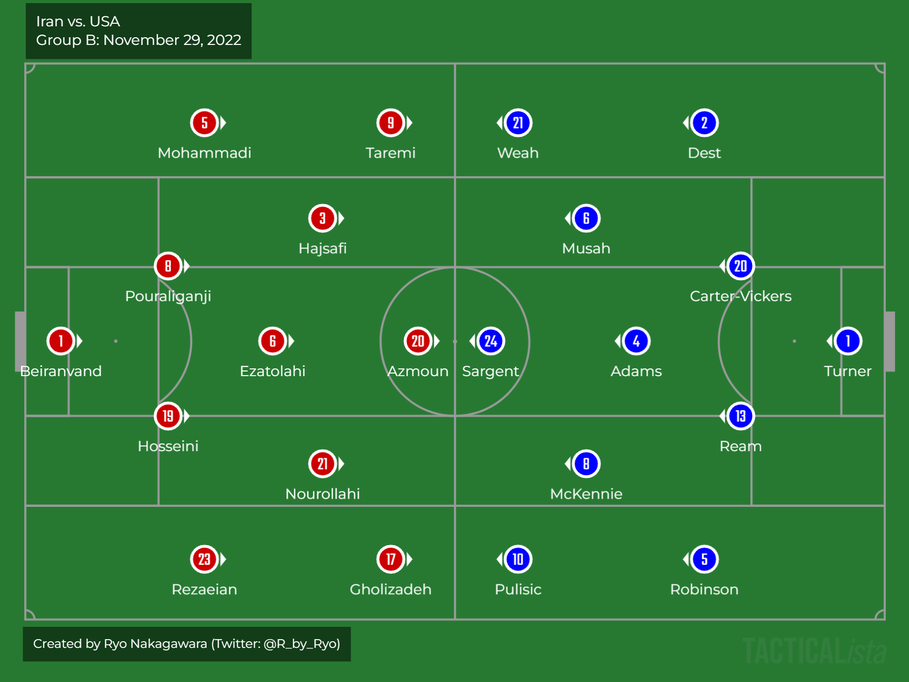

-   <a href="#introduction" id="toc-introduction">Introduction</a>
-   <a href="#the-situation-so-far" id="toc-the-situation-so-far">The
    Situation So Far</a>
-   <a href="#tldr-too-long-didnt-read"
    id="toc-tldr-too-long-didnt-read">tl;dr (too long; didn’t read)</a>
-   <a href="#line-ups" id="toc-line-ups">Line-ups</a>
-   <a href="#st-half" id="toc-st-half">1st Half</a>
    -   <a href="#the-goal" id="toc-the-goal">The GOAL</a>
-   <a href="#nd-half" id="toc-nd-half">2nd Half</a>
-   <a href="#whats-next" id="toc-whats-next">What’s Next?</a>

# Introduction

**Iran** vs. the **United States of America**, was an interesting match
up with all to play for as both teams vied for a ticket to the knockout
stages. This is a **small** review done as part of a fun project by a
large group of Japanese (mainly J.League related) tactical writers who
are trying to write a report for **every single game** of this 2022
World Cup in Qatar. You can check out the special web page for the
project
[here](https://windtosh.com/%E5%BA%83%E5%A0%B4/%E8%A9%A6%E5%90%88%E7%B5%90%E6%9E%9C/%E8%A9%A6%E5%90%88%E7%B5%90%E6%9E%9C_fifa_world_cup).
For those unfamiliar, I mainly write big mid-season and season end
reviews for the J.League filled with both `tactical` and `data`
insights. My most recent blog post was the [2022 J.League Season
Review](https://ryo-n7.github.io/2022-11-15-jleague-2022-endseason-review/).

I could talk about the geo-political stuff surrounding this game but
someone else on the project already has, you can read it [here (it’s in
Japanese though)](https://note.com/kumawacky/n/n6ff764389484).

Anyways, this will be a fairly **short** review due to time constraints.

Let’s get started!

# The Situation So Far

Iran had a miserable start to their World Cup campaign as they were
swatted aside by a dominant England team who easily broke through their
deep block defense. However, against Wales they played much better and
were creating quite a few chances even before Wale’s goalkeeper
`Wayne Hennessy` got sent off.

USA had a good 1st Half against Wales but struggled to deal with
`Kieffer Moore`’s physical presence and were pushed back and conceded an
equalizer in the last 10 minutues of the game. Unperturbed by this, they
really played well against England and barely conceded chances on top of
being able to control the ball somewhat themselves. Still, with only 2
points on the board the USMNT absolutely needed to win against Iran.

# tl;dr (too long; didn’t read)

> Iran counterattacked in small numbers and caused some early transition
> scares but gradually ceded control of the match to the USA who pushed
> back and then stretched Iran’s blocks of 4 using the width provded by
> the Full Backs. USA created several good chances and eventually scored
> a well-worked goal. In the 2nd Half, Iran couldn’t break down USA’s
> defense and usually resorted to inefficient long balls down the
> channels. USA tired considerably but a shift to a back 5 with Walker
> Zimmerman led to a victory with Iran looking very uninspired
> throughout.

# Line-ups

Unlike in previous games for the USMNT, `Weston McKennie` started on the
left side of the midfield 3 rather than on the right. Like against
England, the USA can shift between a 4-4-2 and a 4-3-3 depending on the
positioning of `Christian Pulisic` on the Left.

Iran were largely unchanged from the Wales game except for
`Alireza Beiranvand` who returned in goal after a concussion in the
first game vs. England while `Ali Gholizadeh` came in for the suspended
`Alireza Jahanbaksh`.

# 1st Half

Iran started ever so slightly better in the opening 10 minutes or so.
Clear idea to simply counter attack with only 2\~4 players at a time for
safety. There was a bit of the passing combinations in **central** areas
like in the 4th minute, but this was pretty much the only time in the
game that I can remember Iran doing this and otherwise resorted to the
counterattack (7th, 16th, 33rd, etc. minutes).

Most **opportunities** for Iran didn’t turn into **chances** as even in
the moments where they got into the box, both the final pass was lacking
and the USA had numbers in the box to cover. I imagine their xT would be
higher (even if only slightly) than their xG in this game. If the quick
counter wasn’t on, Iran wouldn’t force the issue and pass it backwards
to recycle possession (like in the 18th minute).

USA sought to play **around** Iran’s block in a **2-3-5-ish** shape by
overloading the wide areas with any one of the 3 midfielders dropping in
closer to the Center Backs, while the Full Backs pushed high and wide to
cause dilemmas for Iran’s wide midfielders. Should they follow the US
Full Backs and let the dropping midfielders time on the ball? Or leave
them to press `McKennie` or `Tyler Adams`? Iran chose the former and
they were slowly pushed back into their defensive 3rd as a result.

Still Iran had numbers in the box so even when crosses were launched
inside they were cleared easily or on cut-backs there was usually
Iranian defender to spare to block those passes despite the efforts of
Josh Sargent to pull defenders away with off-ball runs.

Around the 20 minute mark, the USA started to control the game in their
favor. Like in previous games, `Yunus Musah` and `McKennie` would drift
out to the wide areas, `McKennie` would drop closer to the Center Backs
as well as receive and dribble in the half-spaces. Meanwhile `Musah`
would normally be pushed up a bit higher, exchanging positions with
`Tim Weah` while trying to find opportunities to thread a ball wide to
`Sergiño Dest` on the wing.

I feel like the idea for `McKennie` in left half-space was for him to
cut in on his right foot and pass diagonally to `Dest` as well as
combine with `Pulisic` and `Antonee Robinson` on the left. `Pulisic`
made lots of off-runs and tried to create space for `Robinson` and
`McKennie` but `Ramin Rezaeian` was tasked with man-marking him so it
wasn’t that effective unless he was able to dribble past any Iranian
player (like in the 27th minute). `Antonee Robinson` continued to be an
outlet on the left wing, bombing up from Left Back.

## The GOAL

`Tyler Adams` drove up field with the ball from his own half, going
Right to Left and into the final 3rd as Iran opted to contain and
retreat rather than attack `Adams` on the ball. `Adams` exchanged passes
with `Robinson` on the left which pulled Iran’s lines over. Iran’s Right
Back was preoccupied with `Musah` in the half-space and Iran’s Left
Midfielder (`Ehsan Hajsafi` #3) didn’t keep track of `Dest`. As soon as
`McKennie` receives the ball from `Adams` and shapes up to play the
pass, `Christian Pulisic` is already making his run into the box,
leaving his marker, `Rezaeian`, in his wake.

# 2nd Half

Half-Time Substitutions: 

**Iran**: 

-   `Ali Karimi` came on for the injured `Milad Mohammadi` in 1st Half
    injury time, `Hajsafi` shifted backwards to the Left Back spot while
    `Karimi` replaced him in midfield.

-   `Saman Ghoddos` came on for `Sardar Azmoun`:
    A bit surprising to haul off your ace striker in a must-win game but
    `Azmoun`’s defensive work left a lot to be desired and he also hasn’t
    been 100% fit since before the tournament so I guess that’s why…

**USA**:

-   `Pulisic` suffered a concussion when he scored, so
    `Brenden Aaaronson` replaced him.

USA started the half off by putting more pressure on Iran’s back line,
their 1st Line continued to chase backwards against the Full Backs when
Iran passed around them in the build-up.

Only real spark was `Taremi` and `Ghoddos` combining on the wings.
`Taremi` would have multiple attempts where he was rather isolated and
would cut inside on the dribble but `Cameron Carter-Vickers` was too
strong and quick for him, especially once the USA moved to a back 5, the
Americans always had a spare man to cover these runs in-behind.

For the most part, Iran had no ability to pull USA defenders out of
block. There was one interesting attempt by `Mehdi Torabi`, who dribbled
diagonally from the Right to the Center against the grain of America’s
midfield block and Iran were able to get the ball up to the box but
there just wasn’t enough of these types of movements to worry the
Americans.

Even when Iran were able to get their Full Backs up high and wide on the
ball, they had no 1v1 dribbling ability to get past USA defenders and
get a clean cross off so it was largely ineffective. Indeed, for all of
Iran’s attempts throughout the game, they only got their first Corner
Kick in the 43rd minute… of the 2nd half!

Especially without `Alireza Jahanbakhsh` (who was suspended due to
accumulating yellow cards), there really were a lack of attacking
options for Team Melli in this game that could turn the tide. The usual
attacking subs that people may be familiar with like ex-Wolfsburg
`Ashkan Dejagah` were way too old now to even make the squad this time
around. Surely, one of the 4 goalkeeper spots could’ve been given to an
extra attacker or perhaps one of the many defenders `Carlos Queiroz`
brought along?

Around the 80th minute, US manager `Gregg Berhalter` made his changes,
bringing on `Shaq Moore` and `Walker Zimmerman` on for `Tim Weah` and
`Dest`, turning America into a back 5. Along with `Tyler Adams` tracking
back everywhere and chasing Iran players all over the pitch, the only
real chance that Iran could muster after the US bunkered down was a
header from a free kick on the near post in injury time.

# What’s Next?

The United States of America advance to the Round of 16 right behind
England, while Iran were eliminated having finished in 3rd place.

The USA will face the Group A winners, Netherlands, next and I am a bit
worried about them. My concerns are from how tired the US’s midfield
looks after the amount of work they’ve put in throughout the group
stages and the lack of quality bench options besides `Kellyn Acosta`
(who along with the other Center Midfield depth in `Cristian Roldan` and
`Luca de la Torre`, aren’t anywhere near the level of
`Musah/McKennie/Adams`). Also in attack, my concerns lie in `Pulisic`’s
concussion (even if on social media he said he’ll be OK for the
knockouts) as well as the extent of `Josh Sargent`’s knee/ankle injury
from that very unlucky landing. While a lot of things can be said of how
USA were able to defend fairly comfortably in their own box (regardless
of the quality of the opposition), in games like this you’d hope that
there would be strikers in the team who could hold the ball up and
create a bit more breathing space for the besieged American team in the
2nd Half. The fact that `Haji Wright` and co. couldn’t hold the ball up
vs. Iran doesn’t bode well with better quality opposition in the
Netherlands (with `Van Dijk`, `de Ligt`, etc.) on the horizon. Still,
this team does have talent and they are also young. Whatever happens
this will be extremely good experience for this generation of players
heading into the World Cup on home soil in 2026.

Big changes will be needed for Iran, as most of their important players are
close to 30 if not older (`Beiranvand`, `Hosseini`, `Hajsafi`,
`Mohammadi`, `Pourlaliganji`, `Rezaeian`, `Jahanbakhsh`, `Ghoddos`,
`Nourollahi`, `Taremi`, `Ansarifard`). Some will no doubt still be in
the squad for 2026 even if they won’t be starters but it’s clear that a
generational overhaul will be needed. Speaking of overhaul, will they
keep going with `Carlos Queiroz` who only returned a few months before
the World Cup? The Asia Cup is already coming next year (or most likely
moved to early 2024 because it's in Qatar…), so decisions are going to be
needed somewhat quickly. This is especially pertinent when you consider
that their World Cup preparations were rather poor with `Queiroz`
himself only re-joining the team in September!

I’ll probably be writing another review for at least one of the
knock-out matches. See you then and enjoy the World Cup!

<blockquote class="twitter-tweet">
USA’s Antonee Robinson consoles Iran’s Ramin Rezaian after America’s victory. Iran’s regime has tried hard to brainwash its people against the US, but most Americans who’ve been to Iran will tell you it’s among the friendliest places they’ve ever visited. <a href="https://t.co/GbyPFMEMVL">pic.twitter.com/GbyPFMEMVL</a>
&mdash; Karim Sadjadpour (@ksadjadpour) <a href="https://twitter.com/ksadjadpour/status/1597922491426799619?ref_src=twsrc%5Etfw">November 30, 2022</a></blockquote>  
