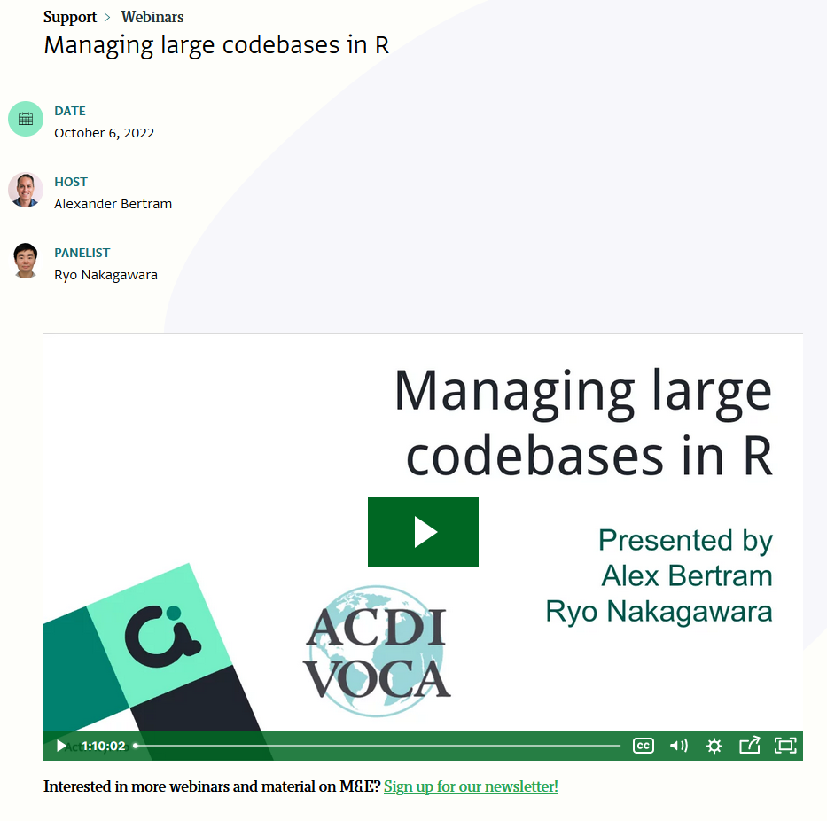
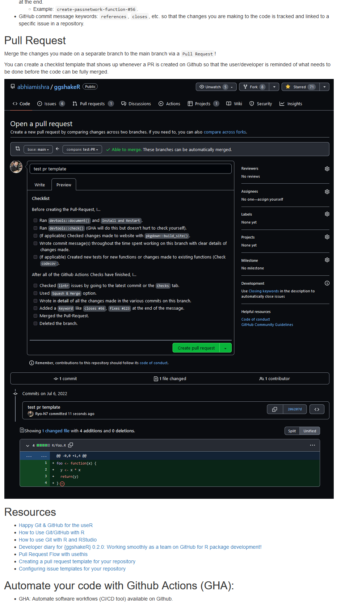

In October last year, I was part of a webinar to talk about **“Managing
Large Codebases in R”** with Alex Bertram of
[ActivityInfo](https://www.activityinfo.org/). It is a bit late to write
a blog post about this, I know, but I realized I never created one to
spread the word around a lot more even though I did refer to it on
social media… so here you go:

-   [Managing Large Codebases in R (October 7,
    2022)](https://www.activityinfo.org/support/webinars/2022-10-06-managing-large-codebases-in-R.html)

In summary, we discussed:

-   Adopting a coding style for your team ({lintr}, {styler}, style
    guides, etc.)
-   Organizing code into R functions (DRY principles, etc.)
-   Organizing functions into R packages ({usethis}, {devtools}, etc.)
-   Documenting and testing code ({roxygen2}, {sinew}, {codecov},
    {testthat}, {pkgdown}, etc.)
-   Using version control: git/GitHub (GitHub issue templates,
    branching, Pull-Request checklist, etc.)
-   Practical examples from the field (some of the work I’ve been doing
    at ACDI/VOCA)

You can see my slides
[here](https://rpubs.com/Ryo-N7/ManagingLargeRCodebase), while Alex’s
slides are
[here](https://www.activityinfo.org/about/assets/pdf/2022-10-06-managing-large-codebases-in-R.pdf).
For each section I also included a lot of links to other material that
I’ve referred to/used over the years so hopefully it’s helpful!

Example:

Unfortunately, due to time constraints we couldn’t talk in more detail
about git/GitHub as much as we would’ve liked but it does open us up to
another potential workshop in the future. You can still read more about
what I wanted to talk about in my presentations notes along with content
from my previous blog posts regarding how I approach (open-source)
collaboration work:

-   [Developer diary for {ggshakeR} 0.1.2 (a package for soccer
    analytics viz): Implementing Github Actions CI tools (codecov,
    lintr, etc.) into the
    workflow!](https://ryo-n7.github.io/2022-03-23-ggshakeR-0.1.2-announcement/)
    (March 23, 2022)
-   [Developer diary for {ggshakeR} 0.2.0 (a package for soccer
    analytics viz): Working smoothly as a team on GitHub for R package
    development!](https://ryo-n7.github.io/2022-07-22-ggshakeR-0.2.0-announcement/)
    (July 22, 2022)

As you may have noticed from my blog/Twitter, I’ve really went **off the
deep end** in terms of doing soccer related analysis in the past year…
not even data analysis with soccer data but just purely *tactical*
stuff. I feel like I need to **course-correct** a little bit so in 2023
I’m hoping to have **more R // data science related content** on Twitter
and/or my blog as well. To be honest, like this blog post, there are a
few other R related things that I didn’t post last year due to my focus
on soccer analysis and then the World Cup happened, so be on the look
out for all that soon.

Thanks for reading, hope it’s useful to you, and don’t hesitate to
contact me if you have comments/questions!
