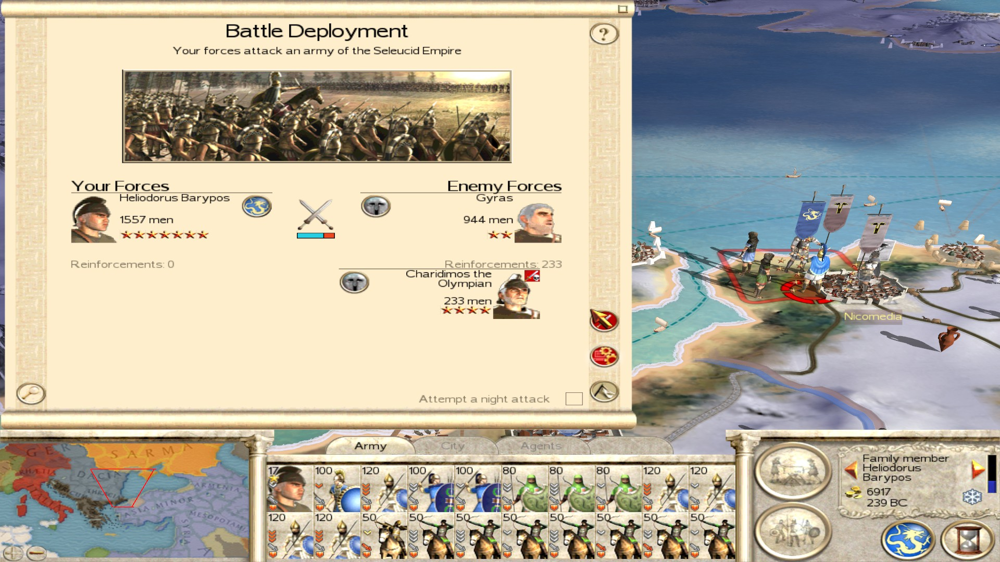
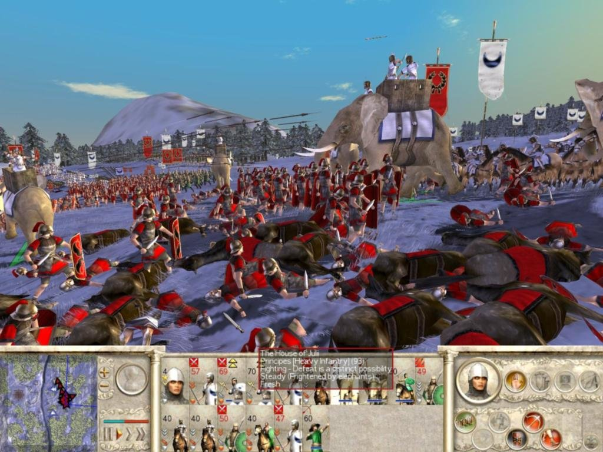
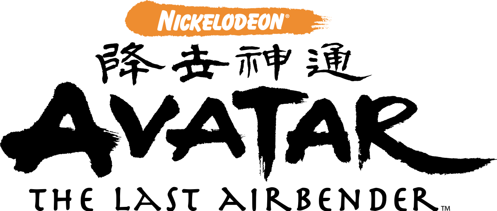
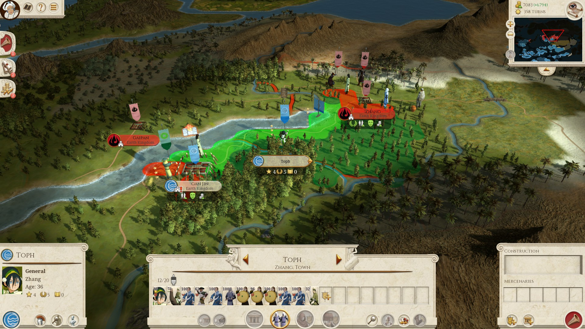
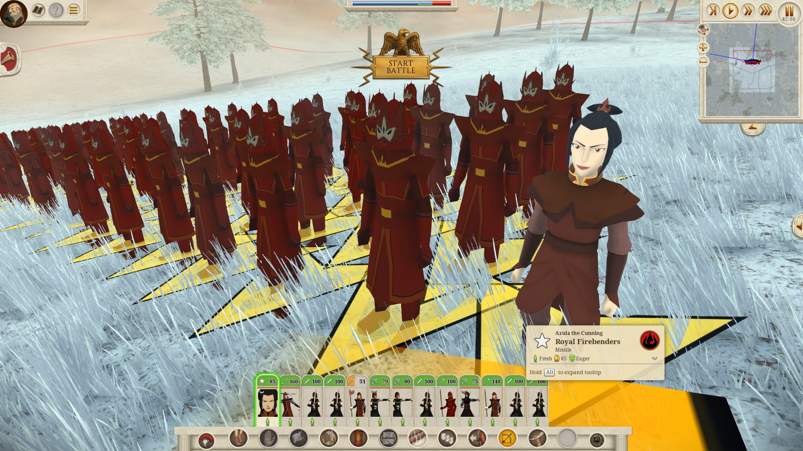
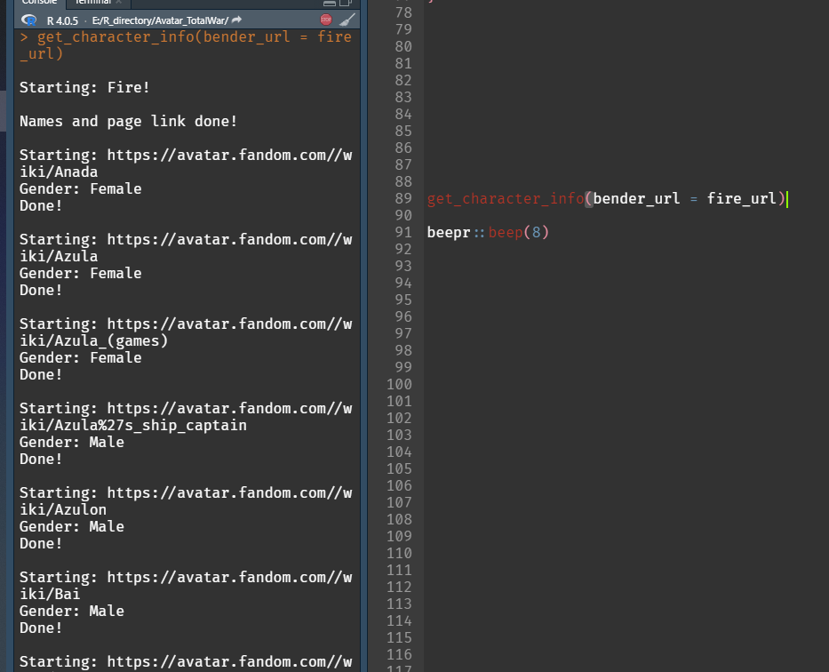
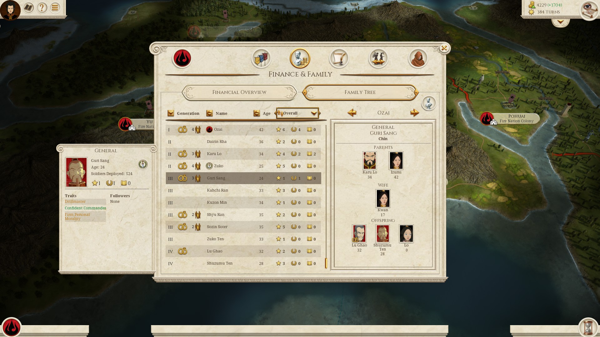
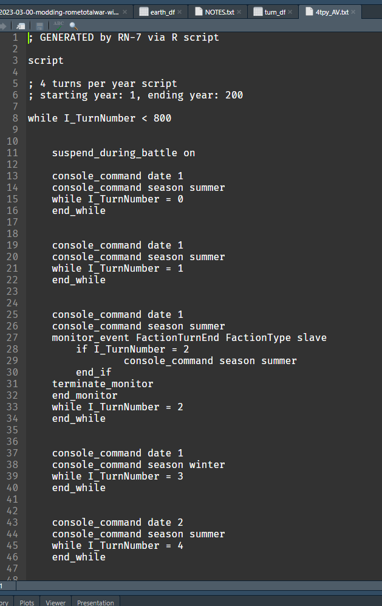
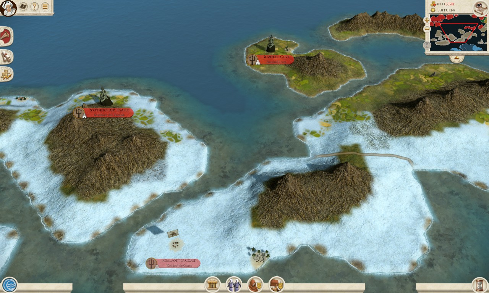

This blog post will be on a very weird mash-up of a few of my interests,
Rome: Total War, Avatar: The Last Airbender, and of course the R
programming language! I’ll introduce these drastically different
interests first…

> “and now for something completely different…”

-   <a href="#what-is-rome-total-war"
    id="toc-what-is-rome-total-war"><strong>What is Rome: Total
    War?</strong></a>
-   <a href="#what-is-avatar-the-last-airbender"
    id="toc-what-is-avatar-the-last-airbender"><strong>What is Avatar: The
    Last Airbender?</strong></a>
-   <a href="#what-is-the-avatar-the-last-airbender-mod-for-rome-total-war"
    id="toc-what-is-the-avatar-the-last-airbender-mod-for-rome-total-war"><strong>What
    is the Avatar: The Last Airbender mod for Rome: Total War?</strong></a>
-   <a href="#web-scraping-avatar-characters-to-add-into-the-game."
    id="toc-web-scraping-avatar-characters-to-add-into-the-game."><strong>Web-scraping
    Avatar characters to add into the game</strong></a>
-   <a
    href="#generating-a-turns-per-year-script-through-rs-text-generation-capabilities"
    id="toc-generating-a-turns-per-year-script-through-rs-text-generation-capabilities"><strong>Generating
    a “turns-per-year” script through R’s text generation
    capabilities</strong></a>
-   <a href="#summary" id="toc-summary"><strong>Summary</strong></a>

## **What is Rome: Total War?**

-   A turn-based strategy RPG game set in the early years of the Roman
    Republic that was released back in 2004. There’s both a campaign map
    where you do management (akin to say, Civ or EU games) but a major
    difference to those games is that you can also fight the battles
    yourself on the battle map with the troops you’ve recruited.





-   It’s probably the game I’ve played the most, ever. Yes, even more
    than FIFA actually (I haven’t played FIFA in nearly a decade now…).
    I have the original CD version that I bought when I lived in Israel,
    the Steam version which I play on today, and I also got the
    Re-mastered version as that’s the version that works with the Avatar
    mod. Despite newer games in the series and lots of other games in
    general, I just keep coming back to it over the past 20 years!

## **What is Avatar: The Last Airbender?**

-   An animated TV series from the mid-2000s about a group of teenagers
    from various “tribes/nations” (based on Fire, Air, Water, and Earth elements) who set out to restore balance and
    harmony to their world which has been ravaged by war for the past
    100 years.

-   It’s actually better if you just watch the 45-second opening as it
    sets the scene extremely well in a succinct manner, click the image
    below:

[](https://www.youtube.com/watch?v=IAdd8RSg86g)

-   It got pretty popular (again) during the pandemic I feel… Most
    likely because the people who watched it when they were kids are
    right around the late 20s/early 30s-ish age that are pretty active
    on social media and people wanted some comfort-shows to watch in the
    early-pandemic-uncertain-times.

## **What is the Avatar: The Last Airbender mod for Rome: Total War?**

-   Basically combining the first two interests above into **ONE**!

-   [The Last Airbender: Total War, Steam
    Workshop](https://steamcommunity.com/sharedfiles/filedetails/?id=2817235421)





-   Note: I’m **not** the creator of the mod, just helping out.

I was working on this during summer/fall of last year but then I got
busy (J.League review, World Cup, etc.) so I never wrote up the blog
post in full. A lot of the actual modding is obviously done outside of
R, but as always I was able to find ways to use **R** to my advantage to
improve this mod.

Let’s get started!

## **Web-scraping Avatar characters to add into the game**

When I first came across this mod, I realized pretty quickly that there
weren’t a whole lot of character names for each of the tribes. So after
like 50 turns or so of playing the game, you wind up having a dozen or
so “Katara”s running around in your Water Tribe kingdom or 50 “Zuko”s in
your Fire Nation Empire. Therefore I took it upon myself to add more
character names by extracting names and gender from the [Avatar fandom
wiki](https://avatar.fandom.com/wiki/Avatar_Wiki).

First, let’s load some R packages:

``` r
library(rvest)   ## web-scraping
library(polite)  ## web-scraping, politely
library(dplyr)   ## clean data
library(purrr)   ## clean data and iteration
library(stringr) ## string/text cleaning
```

Before I jumped into creating a big workflow, I wanted to test how to
grab the data I need based on one page, so let’s take a look at Azula’s
page.

``` r
## Check out robots.txt and see if URL link is scrape-able
session2 <- bow("https://avatar.fandom.com/wiki/Azula")

## Find the character info box on the right corner and 
## grab all the text, then extract the gender identifying words
gender_is <- scrape(session2) %>%
  html_nodes(".portable-infobox") %>%
  html_text() %>%
  ## Some characters are non-binary or gender isn't listed
  stringr::str_extract("Female|Male|Man|Woman") 

gender_is
```

    ## [1] "Woman"

Great! After flipping through a few character pages at random, this is
how these pages are set up so I should be able to apply the above code
to **every** character page to extract the character name and their
gender.

NOTE: Since the time I actually worked on this last October, there’s
been quite a few weird changes in the pages where instead of simply
listing gender as “Male” or “Female” or otherwise, some pages keep the
“Male”/“Female” set while others have “Man” or “Woman” instead… so the
consistency across character pages got worse, wonderful!

So to expand this search across all characters, I tried to find a page
that listed them all. There wasn’t one but there are a couple of pages
that lists all characters split by tribe/nation which is still good
enough for what I wanted to do.

``` r
earth_url <- "https://avatar.fandom.com/wiki/Category:Earth_Kingdom_characters"
fire_url <- "https://avatar.fandom.com/wiki/Category:Fire_Nation_characters"
water_url <- "https://avatar.fandom.com/wiki/Category:Water_Tribe_characters"
air_url <- "https://avatar.fandom.com/wiki/Category:Air_Nomad_characters"
```

So from here, I need to grab:

-   The character’s name
-   The URL link to that character’s page

``` r
## one nation
bender_url <- earth_url
bender_label <- str_extract(bender_url, "Fire|Earth|Water|Air")

cat(paste0("\nStarting: ", bender_label, "!\n"))
## Get name and page link
session <- bow(bender_url)

char_link <- scrape(session) %>%
  html_nodes(".category-page__member-link") %>%
  html_attr("href")

char_name <- scrape(session) %>%
  html_nodes(".category-page__member-link") %>%
  html_text()

base_url <- "https://avatar.fandom.com/"

earth_df <- data.frame(
  char_link,
  char_name
) %>%
  ## Strip out 'Category:' pages that aren't single character page links
  filter(!str_detect(char_link, "Category")) %>%
  mutate(char_link = paste0(base_url, char_link))

cat("\nNames and page link done!\n")
```

``` r
tail(earth_df, 10)
```

    ##                                           char_link       char_name
    ## 190            https://avatar.fandom.com//wiki/Rhee            Rhee
    ## 191             https://avatar.fandom.com//wiki/Rin             Rin
    ## 192            https://avatar.fandom.com//wiki/Rose            Rose
    ## 193 https://avatar.fandom.com//wiki/Royal_messenger Royal messenger
    ## 194              https://avatar.fandom.com//wiki/Ru              Ru
    ## 195             https://avatar.fandom.com//wiki/Ryu             Ryu
    ## 196  https://avatar.fandom.com//wiki/Ryu%27s_mother    Ryu's mother
    ## 197          https://avatar.fandom.com//wiki/Saiful          Saiful
    ## 198             https://avatar.fandom.com//wiki/San             San
    ## 199          https://avatar.fandom.com//wiki/San_Ho          San Ho

Then use that information to:

-   Jump into each character page to find their gender
-   Bind all individual character info into one data.frame and save that
    as a file

``` r
## find all genders at once
earth_namegender_df <- map(
  earth_df$earth_link,
  ~ get_gender(data = earth_df, link = .x)
) %>%
  purrr::reduce(earth_namegender_df, bind_rows)

saveRDS(earth_namegender_df, file = "data/earth_namegender_df.RDS")
```

``` r
tail(earth_namegender_df, 10)
```

    ##                                           char_link       char_name gender
    ## 190            https://avatar.fandom.com//wiki/Rhee            Rhee   Male
    ## 191             https://avatar.fandom.com//wiki/Rin             Rin Female
    ## 192            https://avatar.fandom.com//wiki/Rose            Rose Female
    ## 193 https://avatar.fandom.com//wiki/Royal_messenger Royal messenger   Male
    ## 194              https://avatar.fandom.com//wiki/Ru              Ru Female
    ## 195             https://avatar.fandom.com//wiki/Ryu             Ryu   Male
    ## 196  https://avatar.fandom.com//wiki/Ryu%27s_mother    Ryu's mother Female
    ## 197          https://avatar.fandom.com//wiki/Saiful          Saiful   Male
    ## 198             https://avatar.fandom.com//wiki/San             San   Male
    ## 199          https://avatar.fandom.com//wiki/San_Ho          San Ho   Male

Of course, after running through one nation’s worth of character pages I
can then standardize it as one big function to take any of the character
list URLs.

``` r
get_character_info <- function(bender_url) {
  bender_label <- str_extract(bender_url, "Fire|Earth|Water|Air")

  cat(paste0("\nStarting: ", bender_label, "!\n"))
  ## Get name and page link
  session <- bow(bender_url)

  char_link <- scrape(session) %>%
    html_nodes(".category-page__member-link") %>%
    html_attr("href")

  char_name <- scrape(session) %>%
    html_nodes(".category-page__member-link") %>%
    html_text()

  base_url <- "https://avatar.fandom.com/"

  char_df <- data.frame(
    char_link,
    char_name
  ) %>%
    ## Strip out 'Category:' pages that aren't single character page links
    filter(!str_detect(char_link, "Category")) %>%
    mutate(char_link = paste0(base_url, char_link))

  cat("\nNames and page link done!\n")

  ## Get gender
  get_gender <- function(data, link) {
    cat(paste0("\nStarting: ", link))
    session2 <- bow(link)

    gender_is <- scrape(session2) %>%
      html_nodes(".portable-infobox") %>%
      html_text() %>%
      stringr::str_extract("Female|Male|Man|Woman") ## Some are "Non-binary" or gender isn't listed

    cat(paste0("\nGender: ", gender_is))

    final_df <- data %>%
      filter(char_link == link)

    if (class(gender_is) != "character") {
      final_df <- final_df %>%
        mutate(gender = NA_character_)
    } else {
      final_df <- final_df %>%
        mutate(gender = gender_is)
    }

    cat("\nDone!\n")

    return(final_df)
  }

  char_namegender_df <- map(
    char_df$char_link,
    ~ get_gender(data = char_df, link = .x)
  ) %>%
    purrr::reduce(bind_rows)

  saveRDS(char_namegender_df, file = here::here(paste0("data/", bender_label, "_namegender_df.RDS")))

  cat(paste0("\nScript for: ", bender_label, " done!\n"))
}
```



You can see the complete script on GitHub
[here](https://github.com/Ryo-N7/Avatar_TotalWar/blob/main/scripts/scrape_avatar_wiki.R).

From here I basically shoved all these character names by nation/tribe
into the game’s character files using `NotePad++` since most of the game
is built on simple text files so it’s very easy to mod! The model/map
rendering and stuff is obviously much harder though.

Aaand voila!



## **Generating a “turns-per-year” script through R’s text generation capabilities**

The way the campaign is set up in this game is that the seasons
alternate every two turns (summer, winter) and two turns make up a full
year. However, this can create problems where your favorite characters
age really quickly and you don’t get to spend a whole lot of time
developing their skills and role-playing as them before they kick the
bucket. So throughout all the different total war games, there have been
mods or scripts made to extend the “turns-per-year” mechanic in the
campaign (4, 8, 16, turns-per-year, etc. depending on the setting/size
of map/etc.).

This is especially true for a mod like Avatar: The Last Airbender.
While, all the protagonists start off as young teenagers, the fact that
they can die in only 100 or so turns makes the campaign a bit drab once
they all bite the dust and are replaced by a bunch of randomly generated
characters. Not very fun or immersive for role-playing. So I decided to
take a shot at re-creating the “turns-per-year” script seen in the base
game for the “Re-mastered” version of Rome Total War.

First, I set up the base data.frame. `cons_date` is the year repeated 4
times each to represent 4-turns-per-year. Most people won’t play up to
200 turns but just in case I extended it to 800 turns in the `turn_num`
variable. Keep in mind that we’re starting from turn `0`/zero and not
turn `1`.

I create a separate vector that makes sure to change the season every 4
turns starting from turn 2. Then I set a separate vector representing
which turns will be the “winter” turns, starting from turn 3 (since
we’re first changing the season after turn 2).

``` r
## Generate turn numbers and other vars
turn_df <- data.frame(
  cons_date = rep(1:200, each = 4),
  turn_num = seq(0, 799)
)

glimpse(turn_df)
```

    ## Rows: 800
    ## Columns: 2
    ## $ cons_date <int> 1, 1, 1, 1, 2, 2, 2, 2, 3, 3, 3, 3, 4, 4, 4, 4, 5, 5, 5, 5, ~
    ## $ turn_num  <int> 0, 1, 2, 3, 4, 5, 6, 7, 8, 9, 10, 11, 12, 13, 14, 15, 16, 17~

``` r
season_change_turn <- seq(2, 800, by = 4)
winter_turn <- seq(3, 800, by = 4)
```

From here I open up a file to write my code into: `4tpy_AV.txt`. From
there I use `cat()` calls to push text into the file that I created,
first some comments describing what this script is doing.

``` r
fileName <- sprintf("4tpy_AV.txt")

message(sprintf("Writing %s...", fileName))
r <- file(fileName, open = "w")

cat(file = r, "; GENERATED by RN-7 via R script\n\n")

cat(file = r, "script\n\n")

cat(file = r,
    "; 4 turns per year script\n")

cat(file = r,
    "; starting year: 1, ending year: 200\n\n")

cat(file = r,
    "while I_TurnNumber < 800\n\n")

cat(file = r,
    "
    suspend_during_battle on\n")
```

From here, it’s a giant `for` loop of setting the text snippet for each
turn/season.

``` r
## for loop
for (i in 1:nrow(turn_df)) { # 1:nrow(turn_df)
  # print(turn_df[i, 1]) # cons_date
  # print(turn_df[i, 2]) # turn_num

  ## check if 'i' is season changing turn
  if (turn_df[i, 2] %in% season_change_turn) {
    cat(file = r,
        sprintf("
    console_command date %s
    console_command season summer
    monitor_event FactionTurnEnd FactionType slave
        if I_TurnNumber = %s
                console_command season summer
        end_if
    terminate_monitor
    end_monitor
    while I_TurnNumber = %s
    end_while\n\n",
    turn_df[i, 1], turn_df[i, 2], turn_df[i, 2]
        )
    )
  } else if (turn_df[i, 2] %in% winter_turn) {
    cat(file = r,
        sprintf("
    console_command date %s
    console_command season winter
    while I_TurnNumber = %s
    end_while\n\n",
    turn_df[i, 1], turn_df[i, 2]
        )
    )
  } else {
    cat(file = r,
        sprintf("
    console_command date %s
    console_command season summer
    while I_TurnNumber = %s
    end_while\n\n",
    turn_df[i, 1], turn_df[i, 2]
        )
    )
  }
}

## Close connection to file ----
close(r)
```

So I run the entire script in one go and boom!

``` r
## Generate turn numbers and other vars
turn_df <- data.frame(
  cons_date = rep(1:200, each = 4),
  turn_num = seq(0, 799)
)

# cons_date <- rep(1:200, each = 4)
# turn_num <- seq(0, 800)

season_change_turn <- seq(2, 800, by = 4)
winter_turn <- seq(3, 800, by = 4)

fileName <- sprintf("4tpy_AV.txt")

message(sprintf("Writing %s...", fileName))
r <- file(fileName, open = "w")

cat(file = r, "; GENERATED by RN-7 via R script\n\n")

cat(file = r, "script\n\n")

cat(file = r,
    "; 4 turns per year script\n")

cat(file = r,
    "; starting year: 1, ending year: 200\n\n")

cat(file = r,
    "while I_TurnNumber < 800\n\n")

cat(file = r,
    "
    suspend_during_battle on\n")

## for loop
for (i in 1:nrow(turn_df)) { # 1:nrow(turn_df)
  # print(turn_df[i, 1]) # cons_date
  # print(turn_df[i, 2]) # turn_num

  ## check if 'i' is season changing turn
  if (turn_df[i, 2] %in% season_change_turn) {
    cat(file = r,
        sprintf("
    console_command date %s
    console_command season summer
    monitor_event FactionTurnEnd FactionType slave
        if I_TurnNumber = %s
                console_command season summer
        end_if
    terminate_monitor
    end_monitor
    while I_TurnNumber = %s
    end_while\n\n",
    turn_df[i, 1], turn_df[i, 2], turn_df[i, 2]
        )
    )
  } else if (turn_df[i, 2] %in% winter_turn) {
    cat(file = r,
        sprintf("
    console_command date %s
    console_command season winter
    while I_TurnNumber = %s
    end_while\n\n",
    turn_df[i, 1], turn_df[i, 2]
        )
    )
  } else {
    cat(file = r,
        sprintf("
    console_command date %s
    console_command season summer
    while I_TurnNumber = %s
    end_while\n\n",
    turn_df[i, 1], turn_df[i, 2]
        )
    )
  }
}

## Close ----
close(r)
```



You can find the actual script file
[here](https://github.com/Ryo-N7/Avatar_TotalWar/blob/main/scripts/4tpy_AV.txt).

Unfortunately, I don’t know enough about modding to make the UI track
the “actual” date rather than just the year. So in the campaign map you
just get:

-   “Year 1 (Summer icon)”, “Year 1 (Summer icon)”, “Year 1 (Summer
    icon)”, “Year 1 (Winter icon)”,
-   “Year 2 (Summer icon)”, “Year 2 (Summer icon)”, “Year 2 (Summer
    icon)”, “Year 2 (Winter icon)”,
-   “Year 3 (Summer icon)” … and so on…

This wasn’t a problem in the UI for the original (Steam and CD-ROM)
versions of Rome: Total War, so I’m still thinking of ways to fix that
for the re-mastered version before I push it to the mod for review…

## **Summary**

In terms of character names, by web-scraping the wiki I was able to add
around 300 more male/female/last names for all the different factions.

As noted in the previous section, the implementation for the
4-turns-per-year feature needs a bit more work but the R script itself
is fine. Anyway, this kind of text-generation scheme is how I set up my
soccer data analysis workflow that you might have seen in my past
[J.League reviews](). Each year or half-a-season I am creating the same
visualizations from similar data sets. The only thing that changes is
the name of the folders or the name of the data sets (ex. `2022_data` to
`2023_data`), names of the teams involved (which I can just grab from
the incoming data set), etc… so I really only need to define these as
variables at the top of my script then carefully make sure that the text
I’m generating will create the exact set of
data-cleaning/data-visualization code that I need with the new data set.

I can run the script to generate the R script file using the new
season//half-a-season//whatever variables, then run the script itself
and all my data viz pop up! It saves me a lot of time as I don’t have to
copy-paste my previous script and then find-replace stuff like `2022` to
`2023` and whatnot.

For those curious, here are a few other things I did/am working on for
the mod:

-   Added new settlements (no R, unfortunately… mostly me getting to
    grips with good ol’ MS Paint and GIMP)



-   Added new character portraits. Like with the character names, the
    mod was just recycling the same 8 or so pics which got old pretty
    fast once you started growing your empire and gained more
    generals/family members.

Here’s the link to the GitHub repo where I keep all my stuff (not a
whole lot to see to be honest, just a bunch of work-in-progress stuff):

-   [Avatar_TotalWar
    repository](https://github.com/Ryo-N7/Avatar_TotalWar)

Hope this was as fun to read as I had doing it!
